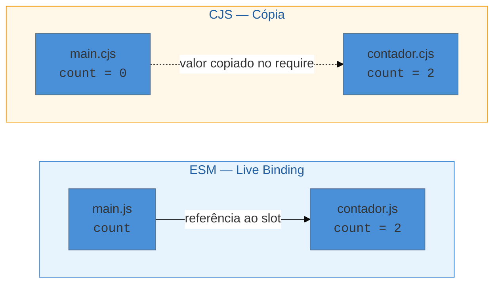
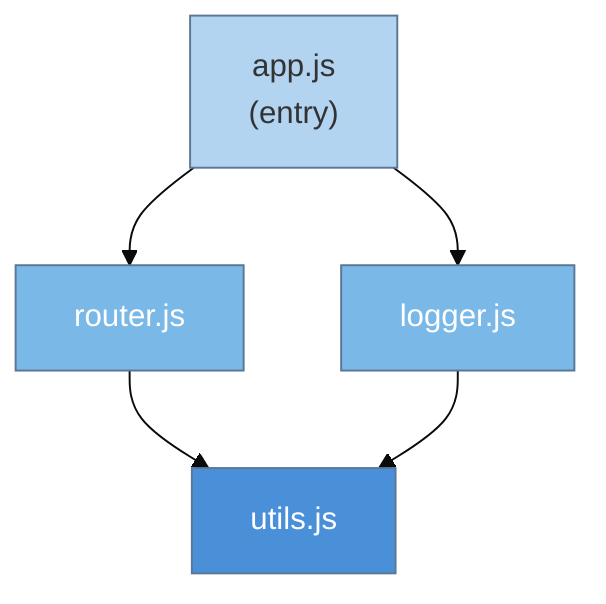

> [!abstract] TL;DR
> ESM (ECMAScript Modules) é o sistema de módulos nativo do JavaScript: cada arquivo tem seu próprio escopo, e `import`/`export` são declarações estáticas analisadas antes da execução. O ponto de virada em relação a `require()` do CJS é o **live binding**: um `import` não é uma cópia do valor exportado — é uma referência viva ao slot de memória do módulo de origem. O motor carrega o grafo de dependências, executa cada módulo **uma vez** (com cache), e `dynamic import()` permite postergar esse carregamento para demanda. Resolver paths, interop com CJS e dual packages são questões de *tooling*, não de linguagem — para isso, veja [[03-Dominios/Tecnologia/Tooling e Build/06 - ESM e CJS e o sistema de módulos|Tooling 06]].

---

## O problema que módulos resolvem

Antes de módulos, escrever JavaScript de médio porte era como montar móvel sem parafusos: tudo ficava no escopo global. Você incluía dez scripts na página e torcia para que nenhum deles declarasse uma variável `data` ou `utils` que quebrasse o outro. As soluções artesanais — *IIFE*, *revealing module pattern*, *namespaces manuais* — funcionavam, mas eram contratos de cavalheiros: um descuido e o contrato quebrava silenciosamente.

O Node.js resolveu isso com `require()` e o formato CommonJS em 2009. Funcionou por mais de uma década, mas era uma solução de *runtime*: o motor só sabia o que você importava depois de executar o código. Isso tornava análise estática, tree-shaking e resolução antecipada de erros muito mais difíceis.

O ECMAScript 2015 (ES6) padronizou uma solução **na própria linguagem**: o sistema ESM. A promessa era simples — declare seus `import` e `export` no topo do arquivo, de forma que uma ferramenta (ou o próprio motor) consiga montar o grafo de dependências **antes de rodar uma linha de código**.

---

## Escopo de módulo: o isolamento que você sempre quis

Em ESM, cada arquivo é um módulo com seu próprio escopo léxico. Variáveis declaradas no topo de um módulo não vazam para o global.

```js
// contagem.js
let contador = 0; // invisível fora deste módulo

export function incrementar() {
  contador++;
}

export function ler() {
  return contador;
}
```

> [!question]- E o `this` no topo do módulo?
> Em scripts clássicos, `this` no nível superior apontava para o objeto global (`window` no browser). Em módulos ESM, **`this` é `undefined`** no topo. Isso é intencional: módulos não têm "dono" global — eles são unidades autônomas. Se precisar do global, use `globalThis` explicitamente.

O isolamento de escopo também significa que **nenhum código de módulo polui o global** acidentalmente. Dois módulos podem ter uma variável interna chamada `id` sem conflito algum.

---

## Sintaxe de `export` e `import`

### Named exports — exportar pelo nome

A forma mais comum: você exporta qualquer quantidade de itens com nome explícito.

```js
// matematica.js
export const PI = 3.14159;

export function somar(a, b) {
  return a + b;
}

export function multiplicar(a, b) {
  return a * b;
}
```

Importação correspondente:

```js
// main.js
import { somar, PI } from './matematica.js';

console.log(somar(2, 3)); // 5
console.log(PI);           // 3.14159
```

Você pode renomear na importação para evitar colisões:

```js
import { somar as add, PI as pi } from './matematica.js';
```

### Default export — a exportação principal

Cada módulo pode ter **zero ou uma** exportação default. Ela é importada sem chaves e pode receber qualquer nome:

```js
// usuario.js
export default class Usuario {
  constructor(nome) {
    this.nome = nome;
  }
}
```

```js
// qualquer-nome serve:
import Pessoa from './usuario.js';
import User  from './usuario.js';  // mesmo módulo, mesmo objeto
```

> [!info] Named vs Default — quando usar cada um
> - **Named**: módulos utilitários com múltiplas funções (math, validators, helpers)
> - **Default**: módulos que exportam uma coisa principal (classe, componente React, configuração) Misturar os dois no mesmo arquivo é válido, mas pode confundir. Muitos style guides modernos preferem só named exports para facilitar tree-shaking e autocompletion do editor.

### Namespace import — importar tudo como objeto

```js
import * as mat from './matematica.js';

console.log(mat.somar(1, 2)); // 3
console.log(mat.PI);           // 3.14159
```

Útil quando você quer evitar nomes de importação explícitos, mas atenção: torna tree-shaking mais difícil (o bundler não sabe quais membros você vai usar até a análise completa).

### Side-effect import — executar sem importar nada

```js
import './setup-globals.js';
import './polyfills.js';
```

Executa o módulo pelos seus efeitos colaterais (registrar event listeners, configurar globais, etc.) sem capturar nenhum export. Útil para setup de ambiente.

---

## Live bindings: a maior diferença em relação ao CJS

Aqui mora uma das pegadinhas mais frequentes para quem vem de `require()`.

> [!question]- O que é um "binding vivo"?
> Quando você faz `import { count } from './counter.js'`, você **não está copiando o valor atual de `count`**. Você está criando uma janela diretamente para o slot de memória onde `count` vive dentro do módulo `counter.js`. Se o módulo exportador mudar aquele valor, sua "janela" mostra o novo valor automaticamente.

Veja a diferença em código:

```js
// contador.js
export let count = 0;

export function increment() {
  count++; // modifica o binding exportado
}
```

```js
// main.js — com ESM (live binding)
import { count, increment } from './contador.js';

console.log(count); // 0
increment();
console.log(count); // 1  ← enxerga a mudança!
increment();
console.log(count); // 2  ← ainda enxerga
```

Se esse mesmo código fosse escrito com CommonJS e `require()`, o comportamento seria diferente:

```js
// contador.cjs
let count = 0;
module.exports = {
  count,              // copia o valor 0 no momento do exports
  increment() { count++; }
};

// main.cjs
const { count, increment } = require('./contador.cjs');
console.log(count); // 0
increment();
console.log(count); // AINDA 0 — você recebeu uma cópia do primitivo
```

Esse comportamento fica ainda mais claro com o diagrama abaixo:



**Resumo do mecanismo**: o motor ESM cria um *module record* para cada arquivo, e cada `export` é um slot nesse record. Quando outro módulo importa, recebe uma ligação (binding) para aquele slot — não uma cópia. Por isso importações ESM são **somente-leitura do lado do importador** (você não pode fazer `count = 5` diretamente), mas o módulo de origem pode mudar o valor e você enxerga.

---

## Ordem de avaliação: o grafo executado uma vez

ESM é **estático e lazy-evaluado**: o motor faz três fases antes de executar qualquer código:

1. **Parsing** — lê todos os `import` no topo do arquivo e monta o grafo de dependências
2. **Linking** — resolve todos os bindings (sem executar nada ainda)
3. **Evaluation** — executa cada módulo do grafo, de folhas para raízes (dependências primeiro)



No grafo acima, `utils.js` é executado primeiro (é folha), depois `router.js` e `logger.js` (em ordem), e por último `app.js`. Cada módulo executa **uma única vez**, mesmo que seja importado por múltiplos módulos. O resultado fica em cache — imports subsequentes retornam o mesmo module record.

> [!info] Por que isso importa na prática
> Se dois arquivos importam o mesmo `store.js` de estado, ambos recebem **a mesma instância** — não duas cópias. É o padrão Singleton gratuito. Em CJS com `require()`, o comportamento é similar (o cache do `require`), mas explicitamente documentado como detalhe de runtime, não de especificação de linguagem.

---

## `dynamic import()` — carregamento sob demanda

Até aqui, falamos de imports **estáticos**: eles ficam no topo do arquivo e são processados antes da execução. Mas e quando você quer carregar um módulo **somente quando o usuário precisar**?

`import()` (com parênteses) é uma função que retorna uma `Promise` com o module record:

```js
// O módulo pesado.js só é carregado quando chamado
async function carregarEditor() {
  const { Editor } = await import('./editor-markdown.js');
  return new Editor();
}
```

O `import()` dinâmico:
- Aceita qualquer expressão como argumento (não só strings literais)
- Retorna uma `Promise<ModuleNamespace>` — o objeto com todos os exports
- Pode ser chamado de dentro de `if`, loops, event handlers — qualquer lugar

```js
// Carregamento condicional por feature flag
if (user.hasFeature('advanced-charts')) {
  const { renderChart } = await import('./charts.js');
  renderChart(data);
}
```

> [!question]- E o cache do dynamic import?
> O mesmo cache dos imports estáticos se aplica. Se você chamar `import('./pesado.js')` duas vezes, o módulo só é carregado e executado **uma vez**. A segunda chamada retorna uma Promise que resolve imediatamente com o módulo já em cache.

---

## Top-level `await`

A partir do ES2022, módulos ESM podem usar `await` no nível superior — sem precisar de uma função `async`:

```js
// config.js — carrega config de um endpoint antes de exportar
const resp = await fetch('/api/config');
export const config = await resp.json();
```

```js
// app.js — import espera config.js terminar o await antes de continuar
import { config } from './config.js';
console.log(config.baseUrl); // garantidamente disponível
```

O motor pausa a avaliação do módulo importador até que o módulo que usa `await` termine. Isso é seguro porque a ordem de avaliação do grafo já é definida em linking.

> [!warning] Top-level await bloqueia dependentes
> Se `config.js` levar 3 segundos para fazer fetch, **todos os módulos que dependem de `config.js`** vão esperar esses 3 segundos antes de executar. Use com critério — prefira inicialização lazy ou carregamento explícito quando o delay for significativo. Para detalhes sobre como `await` se conecta ao modelo de Promises, veja [[14 - Promises]].

---

## `import.meta` — metadados do módulo

`import.meta` é um objeto especial disponível dentro de qualquer módulo ESM com informações sobre o módulo atual:

```js
// No browser:
console.log(import.meta.url);
// "https://example.com/js/app.js"

// No Node.js:
console.log(import.meta.url);
// "file:///home/user/projeto/app.js"
```

**Casos de uso comuns:**

```js
// Resolver um path relativo ao módulo atual (Node.js)
import { fileURLToPath } from 'url';
import path from 'path';

const __dirname = path.dirname(fileURLToPath(import.meta.url));
const config = path.join(__dirname, 'config.json');
```

```js
// Verificar se é o módulo de entrada (sem deps rodando o arquivo diretamente)
if (import.meta.url === `file://${process.argv[1]}`) {
  // executando diretamente, não importado
  main();
}
```

Bundlers como Vite também expandem `import.meta` com propriedades próprias:

```js
import.meta.env.MODE    // "development" | "production"
import.meta.env.VITE_API_URL  // variável de ambiente com prefixo VITE_
import.meta.hot  // HMR API
```

---

## Import Attributes (ES2025)

A partir do ECMAScript 2025, você pode importar recursos não-JavaScript nativamente com a palavra-chave `with`:

```js
// Importar JSON como módulo de dados (não como código!)
import data from './config.json' with { type: 'json' };

// Dynamic import com atributo
const i18n = await import('./pt-BR.json', { with: { type: 'json' } });
```

O atributo `type: 'json'` **não só valida** — ele também instrui o motor a parsear o arquivo como dado JSON puro, nunca como código executável. Isso tem implicação de segurança: você não pode injetar código JS disfarçado de JSON.

Suporte em 2026: Chrome 123+, Firefox 128+, Safari 17.2+, Node.js 22+.

> [!info] `assert` vs `with`
> A sintaxe antiga era `assert { type: 'json' }` (import assertions, Chrome 91+). Foi substituída por `with` no ES2025 porque *assertions* apenas validavam — *attributes* podem influenciar o comportamento de carregamento. Use `with` em código novo; `assert` está sendo descontinuado.

---

## Casos práticos

### Cenário 1: lazy load de módulo pesado com `dynamic import()`

Imagine um editor de texto rico que só é necessário quando o usuário clica em "Editar". Carregar `prosemirror` ou `monaco-editor` no bundle inicial seria punir todos os usuários pelo comportamento de poucos:

```js
// editor-button.js
const btnEditar = document.getElementById('btn-editar');

btnEditar.addEventListener('click', async () => {
  // Módulo pesado (~500 KB) só carrega no primeiro clique
  const { montarEditor } = await import('./editor/index.js');

  const container = document.getElementById('editor-container');
  montarEditor(container, { initialValue: getTextoAtual() });

  btnEditar.disabled = true; // evita montar duas vezes
});
```

O browser faz um `fetch` separado para `editor/index.js` apenas quando o evento ocorre. O bundle inicial continua leve. Se o usuário nunca clicar, o módulo nunca carrega.

**Variante com feedback de loading:**

```js
btnEditar.addEventListener('click', async () => {
  btnEditar.textContent = 'Carregando...';
  try {
    const { montarEditor } = await import('./editor/index.js');
    montarEditor(document.getElementById('editor-container'));
  } finally {
    btnEditar.textContent = 'Editar';
  }
});
```

### Cenário 2: barrel file e seus custos reais

Um *barrel file* (convencionalmente `index.js`) re-exporta tudo de uma pasta para simplificar imports:

```js
// components/index.js — barrel file
export { Button }   from './Button.js';
export { Modal }    from './Modal.js';
export { Dropdown } from './Dropdown.js';
export { Table }    from './Table.js';
export { Chart }    from './Chart.js';  // ← 200 KB, pesado
```

```js
// app.js — parece inocente
import { Button } from './components/index.js';
```

O problema: **ao importar do barrel, o motor (e muitos bundlers) precisam processar todos os módulos listados** para construir o grafo — inclusive `Chart.js`, que você nunca usou. Bundlers modernos fazem tree-shaking para remover o código, mas o custo de *processamento* ainda pode ser alto:

- Atlassian removeu barrels do Jira Frontend e conseguiu **75% de redução no tempo de build**
- Vercel mediu **200-800 ms de overhead por cold boot** em packages que exportam via barrel

**A alternativa: import direto:**

```js
// Explicito, mais rápido, mais fácil de rastrear
import { Button } from './components/Button.js';
```

**Quando barrels ainda fazem sentido:** em bibliotecas públicas, onde o barrel é a API pública e o consumidor não tem acesso às internals. Nesses casos, o bundler do consumidor faz o tree-shaking. Em monorepos e apps internos, prefira imports diretos.

---

## Armadilhas comuns

> [!warning] Circular imports silenciosos
> **O que acontece:** módulo A importa de B, B importa de A. O código não lança erro, mas um dos módulos pode receber `undefined` onde esperava um valor. **Por quê:** durante o linking, o motor cria os bindings antes da avaliação. Se A ainda não foi avaliado quando B tenta usar um export de A, o binding existe mas aponta para `undefined` (o valor inicial antes da avaliação). **Como evitar:** extraia a dependência compartilhada para um terceiro módulo C que ambos importam. Círculos são um smell de design que indica responsabilidades misturadas.

> [!warning] `import` não pode ficar dentro de if ou função (static only)
> **O que acontece:** `SyntaxError: import declarations may only appear at top level of a module` se você tenta condicionar um import estático. **Por quê:** a análise estática do ESM exige que todos os imports sejam declarações de topo — eles precisam ser resolúveis antes da execução. **Como evitar:** use `dynamic import()` para carregamento condicional. Os imports estáticos ficam sempre no topo.

> [!warning] Re-atribuir um named import causa TypeError
> **O que acontece:** `TypeError: Assignment to constant variable` (ou similar) ao tentar `count = 5` quando `count` foi importado. **Por quê:** do lado do importador, o binding é somente-leitura — a referência viva não pode ser redirecionada. Só o módulo de origem pode mudar o valor. **Como evitar:** se precisar de estado mutável compartilhado, exporte uma função que muta internamente (como `increment()` no exemplo de live binding) ou use um objeto exportado (objetos são mutáveis mesmo com binding somente-leitura).

> [!warning] Top-level await pode bloquear o carregamento da página inteira
> **O que acontece:** o app demora para aparecer; DevTools mostra o bundle principal como "carregando" por segundos. **Por quê:** um módulo com top-level await bloqueia todos os seus dependentes na fase de avaliação. **Como evitar:** use top-level await apenas em módulos folha (sem dependentes), ou mova o fetch para `dynamic import()` que pode ser aguardado explicitamente sem bloquear o grafo principal.

---

## Como explicar em inglês

**Em entrevista:**

*"ESM is JavaScript's native module system. Each file gets its own scope, and imports are live bindings — not copies. That means if the exporting module updates a value, every importer sees the update immediately. Static imports are hoisted and analyzed before execution, which enables tree-shaking and circular-dependency detection at build time. Dynamic import() lets you defer loading to runtime, returning a Promise — useful for code splitting and lazy loading."*

| PT | EN |
|----|-----|
| módulo | module |
| escopo de módulo | module scope |
| exportação nomeada | named export |
| exportação padrão | default export |
| binding vivo | live binding |
| importação dinâmica | dynamic import |
| importação de namespace | namespace import |
| efeito colateral | side effect |
| importar por efeito | side-effect import |
| granularidade de importação | import granularity |
| atributos de importação | import attributes |

---

## Resumo em uma linha

**Módulos ESM em uma frase:** um sistema de escopo-por-arquivo com `import`/`export` estáticos que criam referências vivas (não cópias) às exportações, avaliados uma vez em ordem de dependência — com `dynamic import()` para carregamento tardio e `import.meta` para introspecção do módulo.

---

## O que vem a seguir

Entender ESM como linguagem é o fundamento — mas na prática você vai se deparar com perguntas que vão além da sintaxe: por que o Node não carrega meu `.js` como módulo? Como um bundler mistura CJS e ESM? O que é um "dual package"? Essas são questões de tooling e runtime, cobertas a fundo na nota de Tooling.

- [[03-Dominios/Tecnologia/Tooling e Build/06 - ESM e CJS e o sistema de módulos|Tooling 06 — ESM e CJS e o sistema de módulos]] — resolução de paths, interop, dual packages, bundlers
- [[14 - Promises]] — fundação para entender `dynamic import()`, top-level await e como o carregamento assíncrono se encaixa no event loop
- [[Dicionário de JavaScript#ESM (ECMAScript Modules)]] — verbete de referência rápida
- [[Dicionário de JavaScript#live binding]] — definição formal do conceito central desta nota

---

## Fontes

- **MDN Web Docs** — [*import*](https://developer.mozilla.org/en-US/docs/Web/JavaScript/Reference/Statements/import) — referência canônica da sintaxe estática, incluindo namespace e side-effect imports
- **MDN Web Docs** — [*JavaScript modules*](https://developer.mozilla.org/en-US/docs/Web/JavaScript/Guide/Modules) — guia completo com exemplos de escopo, export/import e dynamic import
- **MDN Web Docs** — [*import attributes (`with`)*](https://developer.mozilla.org/en-US/docs/Web/JavaScript/Reference/Statements/import/with) — referência da sintaxe ES2025 para importar JSON e CSS como módulos nativos
- **Trevor Lasn** — [*JavaScript Import Attributes (ES2025)*](https://www.trevorlasn.com/blog/import-attributes-in-javascript) — explicação prática da mudança de `assert` para `with` com exemplos de uso
- **ESModules.com** — [*Advanced ES Modules — Dynamic Imports & Top-Level Await*](https://esmodules.com/advanced/) — cobertura de dynamic import() e top-level await com casos reais
- **Joshua K. Goldberg** — [*Speeding Up Centered Part 3: Barrel Exports*](https://www.joshuakgoldberg.com/blog/speeding-up-centered-part-3-barrel-exports/) — análise de performance real de barrel files em produção
- **wesionaryTEAM** — [*The Hidden Costs of Barrel Files*](https://articles.wesionary.team/the-hidden-costs-of-barrel-files-25de560b9f63) — dados do Atlassian/Jira e Vercel sobre custo de builds com barrels
