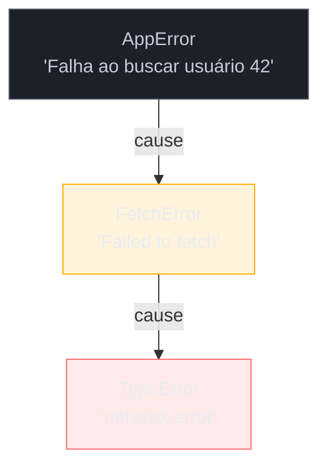
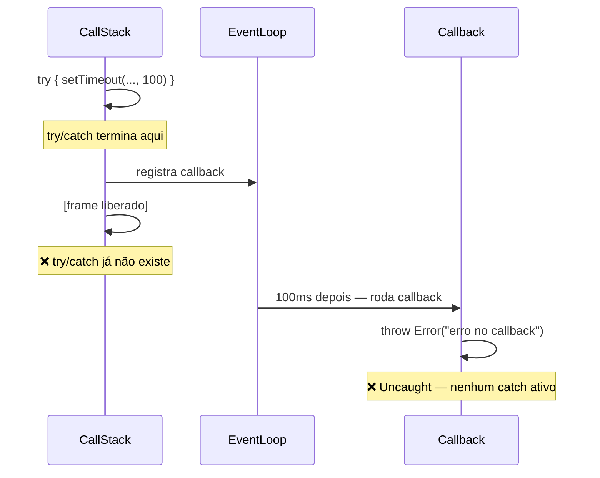

# Error handling

> [!abstract] TL;DR
> Em JavaScript, erros são objetos da classe `Error` (ou subclasses) lançados com `throw` e capturados com `try/catch/finally`. O bloco `finally` sempre executa — seja qual for o caminho. Erros em código assíncrono exigem `await` dentro de `try/catch` **ou** `.catch()` em Promises; `try/catch` em volta de um callback assíncrono *não* pega o erro. Desde ES2022, `Error.cause` permite encadear erros preservando a causa raiz. `AggregateError` agrupa múltiplas falhas (como as de `Promise.any`). Erros não tratados em Promises travam o processo Node.js (desde v15) — nunca deixe uma Promise flutuando.
>
> Dois gotchas de produção frequentemente ignorados: (1) `Error.cause` é **não-enumerável** por spec — `JSON.stringify(err)` retorna `{}`, silenciando a causa em muitos loggers; (2) handlers **async** em `EventEmitter` criam unhandled rejections invisíveis sem `captureRejections: true`.

---

Imagine que você está consumindo uma API de pagamento em produção. A rede falha, a API retorna 503, o JSON vem malformado. Seu código lança exceção no `JSON.parse`, o stack trace aponta para uma linha interna da sua biblioteca de fetch — e você não tem a menor ideia de qual chamada originou o problema.

Esse é o cenário para o qual o sistema de erros do JavaScript foi projetado — e onde ele é mais frequentemente mal usado. Antes de saber *como* tratar erros, vale entender *o que* um erro JavaScript realmente é.

---

## O objeto `Error` e os tipos built-in

Um erro em JavaScript é um objeto de primeira classe. A classe base `Error` carrega três propriedades essenciais:

- **`message`** — texto legível por humanos
- **`name`** — o tipo do erro (`"Error"`, `"TypeError"`, etc.)
- **`stack`** — rastreio de pilha gerado automaticamente pelo motor

```js
const err = new Error("algo deu errado");
console.log(err.name);    // "Error"
console.log(err.message); // "algo deu errado"
console.log(err.stack);   // "Error: algo deu errado\n    at <anonymous>:1:13"
```

O motor JavaScript lança automaticamente **seis subclasses built-in** dependendo do tipo de problema:

| Tipo | Quando é lançado | Exemplo |
|------|-----------------|---------|
| `TypeError` | Operação em valor do tipo errado | `null.foo`, chamar não-função |
| `RangeError` | Valor fora do intervalo esperado | `new Array(-1)`, `toFixed(200)` |
| `SyntaxError` | Código inválido ao fazer `eval()` | `eval("const x = {")` |
| `ReferenceError` | Acesso a variável não declarada | `console.log(naoExiste)` |
| `URIError` | `encodeURI`/`decodeURI` com string inválida | `decodeURIComponent("%")` |
| `EvalError` | Herança histórica, raro hoje | — |

> [!info] Erros built-in são subclasses reais de `Error`
> `new TypeError("x") instanceof Error` retorna `true`. A hierarquia existe e você pode verificar com `instanceof` no `catch`.

---

## `throw` — lançando erros

`throw` aceita **qualquer valor** — string, número, objeto literal. Mas lançar qualquer coisa que não seja um `Error` é uma armadilha clássica:

```js
// ❌ Lançar string perde o stack trace
throw "algo deu errado";

// ✅ Sempre lançar um objeto Error
throw new Error("algo deu errado");

// ✅ Ou uma subclasse
throw new TypeError("esperava número, recebeu string");
```

Por que isso importa? O `stack` só existe em objetos `Error`. Sem ele, depurar produção é um exercício de adivinhação. Além disso, convenções de catch (como `instanceof`) pressupõem que o valor é um `Error`.

---

## `try / catch / finally`

O bloco `try/catch/finally` é a espinha dorsal do tratamento de erros síncronos:

```js
function parsearConfig(json) {
  try {
    const config = JSON.parse(json); // pode lançar SyntaxError
    return config;
  } catch (err) {
    if (err instanceof SyntaxError) {
      throw new Error("Configuração inválida", { cause: err }); // encadeia
    }
    throw err; // relança o que não sabemos tratar
  } finally {
    console.log("parsearConfig executou"); // SEMPRE roda
  }
}
```

### O que `finally` garante

`finally` executa **independentemente do caminho**: sucesso no `try`, exceção capturada no `catch`, ou exceção re-lançada. Inclusive se houver `return` dentro do `try` ou `catch`:

```js
function comReturn() {
  try {
    return "try";
  } finally {
    console.log("finally rodou mesmo assim"); // ← imprime
  }
}
comReturn(); // → "try", mas o log aparece antes
```

> [!question]- O `finally` pode mudar o valor de retorno?
> Sim. Se o `finally` tiver um `return` explícito, ele **sobrescreve** o `return` do `try`. Isso é quase sempre um bug — evite `return` dentro de `finally`.

---

## `Error.cause` — encadeamento de erros (ES2022)

Antes do ES2022, quando você queria envolver um erro externo em um erro próprio, você perdia a causa raiz ou precisava guardar manualmente em uma propriedade custom. Desde o ES2022, o segundo argumento do construtor `Error` aceita um objeto `{ cause }`:

```js
async function buscarUsuario(id) {
  try {
    const resp = await fetch(`/api/users/${id}`);
    return await resp.json();
  } catch (err) {
    // Wrap com contexto, sem perder a causa
    throw new Error(`Falha ao buscar usuário ${id}`, { cause: err });
  }
}

// No chamador:
try {
  await buscarUsuario(42);
} catch (err) {
  console.error(err.message);       // "Falha ao buscar usuário 42"
  console.error(err.cause.message); // "Failed to fetch" (ou o erro original)
}
```

A causa pode ser qualquer valor — outro `Error`, uma string, um objeto de resposta HTTP. O encadeamento é manual (não recursivo automático), mas já é suficiente para a maioria dos casos de produção.



> [!info] Suporte
> `Error.cause` está disponível desde Node.js 16.9+ e em todos os browsers modernos (Chrome 93, Firefox 91, Safari 15).

### Percorrendo a cadeia de `cause`

A nota mostra como *criar* a cadeia — mas como *ler* ela inteira para logging estruturado? Com múltiplos níveis de encadeamento, acessar apenas `err.cause.message` perde os elos intermediários. Um utilitário simples percorre a cadeia sem assumir profundidade máxima:

```js
function extrairCadeia(err, profundidade = 0) {
  if (!err || profundidade > 10) return []; // guard: evita ciclos acidentais
  return [
    { name: err.name, message: err.message, stack: err.stack },
    ...extrairCadeia(err.cause, profundidade + 1),
  ];
}

// uso em logger estruturado:
logger.error({ cadeia: extrairCadeia(err) });
// → [
//     { name: "AppError",   message: "Falha ao buscar usuário 42", ... },
//     { name: "FetchError", message: "Failed to fetch", ... },
//     { name: "TypeError",  message: "network error", ... }
//   ]
```

O guard de profundidade existe porque a especificação ECMAScript não proíbe ciclos em `cause` — embora raros em código real, um `cause` circular travaria a recursão sem ele.

> [!warning] `Error.cause` é não-enumerável — cuidado com loggers e `JSON.stringify`
> Por especificação, `Error.cause` (assim como `message`, `name` e `stack`) é uma propriedade **não-enumerável**. Isso significa que `JSON.stringify(err)` retorna `{}` — silenciando a causa —, e loggers que serializam só propriedades enumeráveis (como certos transportes do Winston/Pino com configuração padrão) descartam a causa inteira sem aviso.
>
> Para logar corretamente, acesse explicitamente:
> ```js
> logger.error({
>   message: err.message,
>   cause: err.cause?.message,
>   causeStack: err.cause?.stack,
> });
> // ou use libs como serialize-error que percorrem non-enumerables
> ```
>
> Isso não é um bug do logger — é o comportamento especificado. A armadilha está em supor que serializar o objeto de erro via JSON captura tudo.

---

## Custom errors — estendendo `Error`

Para sistemas com domínios distintos de falha, erros custom permitem identificar a natureza do problema sem depender da mensagem de texto:

```js
class AppError extends Error {
  constructor(message, options) {
    super(message, options); // repassa cause via options
    this.name = this.constructor.name; // "AppError"
  }
}

class HttpError extends AppError {
  constructor(statusCode, message, options) {
    super(message, options);
    this.statusCode = statusCode;
  }
}

class NotFoundError extends HttpError {
  constructor(resource, options) {
    super(404, `${resource} não encontrado`, options);
  }
}
```

Com essa hierarquia, o `catch` pode ser preciso:

```js
try {
  await buscarProduto(id);
} catch (err) {
  if (err instanceof NotFoundError) {
    return res.status(404).json({ message: err.message });
  }
  if (err instanceof HttpError) {
    return res.status(err.statusCode).json({ message: err.message });
  }
  throw err; // erro desconhecido → relança
}
```

> [!question]- Por que definir `this.name = this.constructor.name`?
> Sem isso, `err.name` seria `"Error"` para todos — a subclasse não sobrescreve `name` por padrão. Definir via `constructor.name` evita repetição e funciona para qualquer nível da hierarquia.

---

## Erros em código assíncrono

Aqui mora a armadilha mais comum da linguagem.

### `try/catch` com `await` — o que funciona

Quando você `await` dentro de um bloco `try`, rejeições de Promise são convertidas em exceções e capturadas normalmente:

```js
async function carregar() {
  try {
    const dados = await fetch("/api/dados").then(r => r.json());
    return dados;
  } catch (err) {
    // Captura: erros de rede, JSON inválido, qualquer rejeição do await
    console.error("Falha:", err);
  }
}
```

### Por que `try/catch` NÃO pega erro de callback assíncrono

Este é o erro mais clássico de quem está aprendendo async JavaScript:

```js
// ❌ ISSO NÃO FUNCIONA
function tentativa() {
  try {
    setTimeout(() => {
      throw new Error("erro no callback"); // ← lançado fora do try/catch
    }, 100);
  } catch (err) {
    console.error("nunca chega aqui", err);
  }
}
tentativa(); // → UnhandledError (processo pode travar)
```

O motivo: quando `setTimeout` dispara, a call stack já saiu do bloco `try/catch`. O `try/catch` protege apenas a execução **síncrona** do seu bloco. O callback do `setTimeout` roda em um tick completamente novo, sem nenhuma relação com o frame anterior.



A solução: use Promises (ou `async/await`) para que o erro possa ser capturado:

```js
// ✅ Correto: encapsular em Promise para capturar
function esperar(ms) {
  return new Promise(resolve => setTimeout(resolve, ms));
}

async function carregarComDelay() {
  try {
    await esperar(100);
    throw new Error("erro após delay"); // ← agora está dentro do contexto async
  } catch (err) {
    console.error("capturado:", err.message); // ✓
  }
}
```

---

## `throw` vs `Promise.reject`

Em código síncrono, `throw` é o mecanismo nativo. Em funções `async`, você pode usar tanto `throw` quanto `return Promise.reject()` — o resultado é idêntico do ponto de vista do chamador:

```js
// Estas duas funções se comportam da mesma forma para o chamador:
async function versaoA() {
  throw new Error("falha");
}

async function versaoB() {
  return Promise.reject(new Error("falha"));
}

// Ambas rejeitam a Promise retornada
versaoA().catch(err => console.log(err.message)); // "falha"
versaoB().catch(err => console.log(err.message)); // "falha"
```

Em função **não-async**, `throw` lança síncronamente (pode não ser capturado por `.catch`), enquanto `return Promise.reject()` sempre cria uma rejeição assíncrona:

```js
// ⚠️ Cuidado com funções não-async
function naoAsync() {
  throw new Error("síncrono"); // lança antes de retornar Promise
}
naoAsync().catch(...); // TypeError: naoAsync(...).catch is not a function
```

---

## Unhandled rejection

Uma [[Dicionário de JavaScript#Promise|Promise]] rejeitada sem nenhum `.catch()` (ou `await` em `try/catch`) gera um **unhandled rejection**. No browser, dispara o evento `unhandledrejection`. No Node.js (v15+), **encerra o processo**:

```js
// ❌ Promise flutuante — perigoso em produção
fetch("/api/dados").then(r => r.json()); // e se falhar?

// ✅ Sempre encadear .catch ou await em try/catch
fetch("/api/dados")
  .then(r => r.json())
  .catch(err => logger.error("fetch falhou", err));
```

Para captura global como safety net (não substitui tratamento local):

```js
// Node.js
process.on("unhandledRejection", (reason, promise) => {
  logger.error("Unhandled Rejection:", reason);
  // Decida: apenas logar ou encerrar
});

// Browser
window.addEventListener("unhandledrejection", event => {
  console.error("Unhandled:", event.reason);
});
```

### `captureRejections` no `EventEmitter` — o vetor esquecido

Existe um segundo vetor de unhandled rejection que pega a maioria dos devs de surpresa: handlers **async** em `EventEmitter`. Quando você registra um listener assíncrono e ele rejeita, o EventEmitter não tem como interceptar a Promise — a rejeição escapa para o nível do processo como unhandled rejection.

```js
// ❌ Rejeição do handler async escapa para o processo
const ee = new EventEmitter();
ee.on('data', async (payload) => {
  await processarAsync(payload); // se rejeitar → unhandled rejection
});
```

A solução é o opt-in `captureRejections: true` (disponível desde Node.js 12.16), que instala um handler `.then(undefined, handler)` em cada listener async e roteia a rejeição para o evento `'error'` do emitter:

```js
// ✅ captureRejections roteia a rejeição para o handler 'error'
const ee = new EventEmitter({ captureRejections: true });

ee.on('data', async (payload) => {
  const result = await processarAsync(payload); // rejeição → vai para 'error'
  ee.emit('result', result);
});

ee.on('error', (err) => {
  logger.error('Erro no handler async:', err); // capturado aqui
});
```

Para habilitar globalmente em toda a aplicação:

```js
const { EventEmitter } = require('events');
EventEmitter.captureRejections = true; // afeta todas as novas instâncias
```

> [!warning] Não use função async como handler de `'error'`
> A doc do Node.js alerta: se o próprio handler de `'error'` for async e rejeitar, você entra em loop infinito de emissão de erros. Handlers de `'error'` devem ser síncronos.

---

## `AggregateError` — múltiplas falhas

`AggregateError` aparece naturalmente com `Promise.any()`: se **todas** as Promises passadas rejeitarem, o resultado é um `AggregateError` contendo todas as rejeições em `errors`:

```js
const resultados = await Promise.any([
  fetch("/cdn1/recurso"),
  fetch("/cdn2/recurso"),
  fetch("/cdn3/recurso"),
]).catch(err => {
  if (err instanceof AggregateError) {
    console.log("Todos os CDNs falharam:");
    err.errors.forEach((e, i) => console.log(`  CDN${i + 1}:`, e.message));
  }
  throw err;
});
```

Você também pode criar `AggregateError` diretamente quando quiser reportar múltiplas falhas:

```js
const falhas = [];
for (const item of lote) {
  try {
    await processar(item);
  } catch (err) {
    falhas.push(err);
  }
}
if (falhas.length > 0) {
  throw new AggregateError(falhas, `${falhas.length} itens falharam no lote`);
}
```

---

## Padrões de design para erros

### Fail fast

Detecte condições inválidas o mais cedo possível — no início da função, antes de qualquer efeito colateral:

```js
function transferir(origem, destino, valor) {
  if (valor <= 0) throw new RangeError("valor deve ser positivo");
  if (origem === destino) throw new Error("origem e destino iguais");
  // ...operação de transferência
}
```

### Error boundary (conceitual)

Em aplicações React existe o componente `ErrorBoundary`. Em Node.js/back-end, o conceito equivale a uma camada de middleware que captura erros, loga e decide a resposta — sem deixar o erro vazar para o chamador upstream não preparado:

```js
// Express — error boundary como middleware
app.use((err, req, res, next) => {
  if (err instanceof NotFoundError) {
    return res.status(404).json({ error: err.message });
  }
  logger.error(err); // loga causa completa
  res.status(500).json({ error: "Internal server error" });
});
```

### Result / Either como alternativa

Em vez de lançar exceções para fluxos esperados, retorne um objeto discriminado:

```js
// Tipo Result simples (sem TypeScript, com convenção)
function parsearJSON(texto) {
  try {
    return { ok: true, value: JSON.parse(texto) };
  } catch (err) {
    return { ok: false, error: err };
  }
}

const resultado = parsearJSON(inputUsuario);
if (!resultado.ok) {
  mostrarErroUI(resultado.error.message);
  return;
}
usar(resultado.value);
```

> [!info] Result vs throw
> `throw` é ideal para condições **excepcionais** (falhas de rede, bugs, estados impossíveis). O padrão Result é preferível quando a falha é parte do fluxo normal — validação de formulário, busca que pode não encontrar nada.

---

## Casos práticos

### Cenário 1: Wrap de erro de API com `cause`

Você tem uma camada de serviço que chama uma API externa. O objetivo é expor um erro de negócio significativo para o chamador, sem perder o erro original para o logger:

```js
class ApiError extends Error {
  constructor(message, statusCode, options) {
    super(message, options); // options.cause preserva o original
    this.name = "ApiError";
    this.statusCode = statusCode;
  }
}

async function buscarPedido(pedidoId) {
  let resp;
  try {
    resp = await fetch(`https://api.loja.com/orders/${pedidoId}`, {
      headers: { Authorization: `Bearer ${process.env.API_TOKEN}` },
    });
  } catch (networkErr) {
    throw new ApiError(
      `Falha de rede ao buscar pedido ${pedidoId}`,
      503,
      { cause: networkErr } // ← preserva o erro original
    );
  }

  if (!resp.ok) {
    throw new ApiError(
      `Pedido ${pedidoId} não encontrado`,
      resp.status
    );
  }

  try {
    return await resp.json();
  } catch (parseErr) {
    throw new ApiError(
      `Resposta inválida da API para pedido ${pedidoId}`,
      500,
      { cause: parseErr }
    );
  }
}

// No handler da rota:
try {
  const pedido = await buscarPedido(req.params.id);
  res.json(pedido);
} catch (err) {
  logger.error({
    msg: err.message,
    status: err.statusCode,
    cause: err.cause?.message, // log da causa raiz
  });
  res.status(err.statusCode ?? 500).json({ error: err.message });
}
```

Este padrão garante que: (a) o chamador recebe um erro de negócio compreensível, (b) o logger tem acesso à causa raiz para debugging, e (c) o `instanceof ApiError` permite tratamento específico.

### Cenário 2: Retry com backoff exponencial

Operações de rede falham. Um retry ingênuo pode sobrecarregar o servidor. Backoff exponencial com jitter espaça as tentativas de forma inteligente:

```js
class RetryExaustedError extends Error {
  constructor(tentativas, cause) {
    super(`Operação falhou após ${tentativas} tentativas`, { cause });
    this.name = "RetryExaustedError";
    this.tentativas = tentativas;
  }
}

async function comRetry(fn, { maxTentativas = 3, delayBase = 300 } = {}) {
  let ultimoErro;

  for (let tentativa = 1; tentativa <= maxTentativas; tentativa++) {
    try {
      return await fn();
    } catch (err) {
      ultimoErro = err;

      // Não fazer retry para erros de cliente (4xx)
      if (err instanceof HttpError && err.statusCode < 500) {
        throw err;
      }

      if (tentativa < maxTentativas) {
        // Backoff exponencial + jitter aleatório (evita thundering herd)
        const delay = delayBase * 2 ** (tentativa - 1) + Math.random() * 100;
        console.warn(`Tentativa ${tentativa} falhou. Retry em ${delay.toFixed(0)}ms`);
        await new Promise(r => setTimeout(r, delay));
      }
    }
  }

  throw new RetryExaustedError(maxTentativas, ultimoErro);
}

// Uso:
try {
  const dados = await comRetry(
    () => buscarPedido(pedidoId),
    { maxTentativas: 3, delayBase: 500 }
  );
  processar(dados);
} catch (err) {
  if (err instanceof RetryExaustedError) {
    logger.error("Esgotadas as tentativas:", err.cause);
    // err.cause é o último erro que causou a falha
  }
  throw err;
}
```

O encadeamento com `cause` aqui é essencial: `RetryExaustedError.cause` aponta para o **último** erro de rede, que por sua vez pode ter sua própria `cause` se você usar o padrão do Cenário 1.

---

## Armadilhas comuns

> [!warning] Catch que engole o erro silenciosamente
> **O que acontece:** o programa continua com estado inconsistente, sem log, sem re-throw. Bugs ficam invisíveis em produção. **Por quê:** `catch (err) {}` bloco vazio absorve qualquer exceção. **Como evitar:** sempre logue ou re-lance no `catch`. Regra: se você não sabe o que fazer com o erro, `throw err` de volta.

```js
// ❌
try { await operacao(); } catch (e) {}

// ✅
try {
  await operacao();
} catch (err) {
  logger.error(err);
  throw err; // ou tratar conscientemente
}
```

> [!warning] `try/catch` em volta de código que chama callback assíncrono
> **O que acontece:** o erro do callback não é capturado. Em Node.js v15+, processo encerra. **Por quê:** o callback roda em tick futuro, fora do frame do `try`. **Como evitar:** use `async/await` com `await` dentro do `try`, ou `.catch()` na Promise.

```js
// ❌ try/catch não alcança o erro do setTimeout
try {
  setTimeout(() => { throw new Error("ops"); }, 100);
} catch (e) { /* nunca executa */ }

// ✅ Promisifique e use await
const esperar = ms => new Promise(r => setTimeout(r, ms));
try {
  await esperar(100);
  // código que pode falhar
} catch (e) { /* captura corretamente */ }
```

> [!warning] Lançar string em vez de `Error`
> **O que acontece:** `err.stack` é `undefined`. Ferramentas de APM não registram o stack trace. `instanceof Error` retorna `false`, quebrando verificações de tipo. **Por quê:** `throw "algo errado"` lança uma string primitiva. **Como evitar:** sempre `throw new Error("mensagem")` — nunca lançar primitivos.

> [!warning] `finally` com `return` sobrescrevendo o valor do `try`
> **O que acontece:** o valor retornado pelo `try` (ou a exceção do `catch`) é silenciosamente descartado. **Por quê:** `return` em `finally` tem precedência sobre qualquer `return` ou `throw` anterior. **Como evitar:** use `finally` apenas para limpeza (fechar conexões, cancelar timers) — sem `return` explícito.

```js
// ❌ O "try" nunca retorna — finally sobrescreve
function problema() {
  try { return 1; }
  finally { return 2; } // retorna 2, não 1
}

// ✅ finally só para cleanup
function certo() {
  try {
    return operacao();
  } finally {
    limparRecursos(); // sem return
  }
}
```

---

## Como explicar em inglês

When asked in a technical interview: *"How do you handle errors in async JavaScript?"*

> "In modern JavaScript, async errors are handled by wrapping `await` calls in `try/catch` blocks. A plain `try/catch` won't catch errors thrown inside asynchronous callbacks like `setTimeout`, because by the time the callback runs, the call stack has already moved on. For Promise chains, every chain should end with `.catch()`. Since ES2022, `Error.cause` lets you chain errors — you wrap the low-level error with a meaningful application-level error, preserving the root cause for debugging."

| PT | EN |
|----|-----|
| tratamento de erros | error handling |
| erro não tratado | unhandled error / uncaught exception |
| rejeição não tratada | unhandled rejection |
| encadeamento de erros | error chaining |
| causa raiz | root cause |
| relançar | rethrow |
| erro personalizado | custom error |
| tipo de erro | error type |
| hierarquia de erros | error hierarchy |
| falha rápida | fail fast |
| contorno de erros | error boundary |

---

## O que vem a seguir

Erros assíncronos foram mencionados aqui no nível das Promises. Para entender completamente por que `try/catch` com `await` funciona e por que callbacks síncronos de `setTimeout` ficam fora do alcance, você precisa entender como Promises funcionam internamente — o mecanismo de microtask queue e o event loop.

- [[14 - Promises]] — como Promises propagam rejeições pela cadeia e por que `.catch()` ao final captura erros de qualquer `.then()` anterior
- [[15 - async-await]] — `async/await` como açúcar sobre Promises e por que `await` dentro de `try/catch` converte rejeições em exceções síncronas
- [[Dicionário de JavaScript]] — termos técnicos do capítulo (Error, cause, AggregateError, unhandled rejection)

---

## Fontes

- **MDN Web Docs** — [*Error*](https://developer.mozilla.org/en-US/docs/Web/JavaScript/Reference/Global_Objects/Error) — referência canônica do objeto Error, propriedades e subclasses built-in
- **MDN Web Docs** — [*Error: cause*](https://developer.mozilla.org/en-US/docs/Web/JavaScript/Reference/Global_Objects/Error/cause) — especificação e exemplos de Error.cause (ES2022)
- **MDN Web Docs** — [*AggregateError*](https://developer.mozilla.org/en-US/docs/Web/JavaScript/Reference/Global_Objects/AggregateError) — erros agregados com Promise.any
- **Dr. Axel Rauschmayer (2ality)** — [*ECMAScript proposal: Error cause*](https://2ality.com/2021/06/error-cause.html) — análise aprofundada da proposta ES2022 com exemplos de encadeamento
- **javascript.info** — [*Custom errors, extending Error*](https://javascript.info/custom-errors) — guia prático de hierarquias de erros personalizadas
- **Bugfender** — [*JavaScript Exception Handling: try, catch, throw, async & Best Practices*](https://bugfender.com/blog/javascript-exception-handling/) — visão geral moderna com padrões async (2026)
- **certificates.dev** — [*Custom Errors in JavaScript: Extending Error the Right Way*](https://certificates.dev/blog/custom-errors-in-javascript-extending-error-the-right-way) — boas práticas atuais para subclasses de Error
- **Node.js Docs** — [*Events: captureRejections*](https://nodejs.org/docs/latest/api/events.html) — documentação oficial do `captureRejections` no EventEmitter
- **Matt Smith (allthingssmitty)** — [*Error chaining in JavaScript: cleaner debugging with Error.cause*](https://allthingssmitty.com/2025/11/10/error-chaining-in-javascript-cleaner-debugging-with-error-cause/) — análise prática de Error.cause com foco em produção (2025)

> [!tip] Vídeo recomendado
> **Wes Bos** — [*5 Async + Await Error Handling Strategies*](https://www.youtube.com/watch?v=wsoQ-fgaoyQ) (YouTube, 2022) — percorre 5 estratégias distintas para tratar erros com async/await: try/catch simples, mix com `.catch()`, HOF wrappers e mais. Excelente complemento prático à teoria desta nota.
