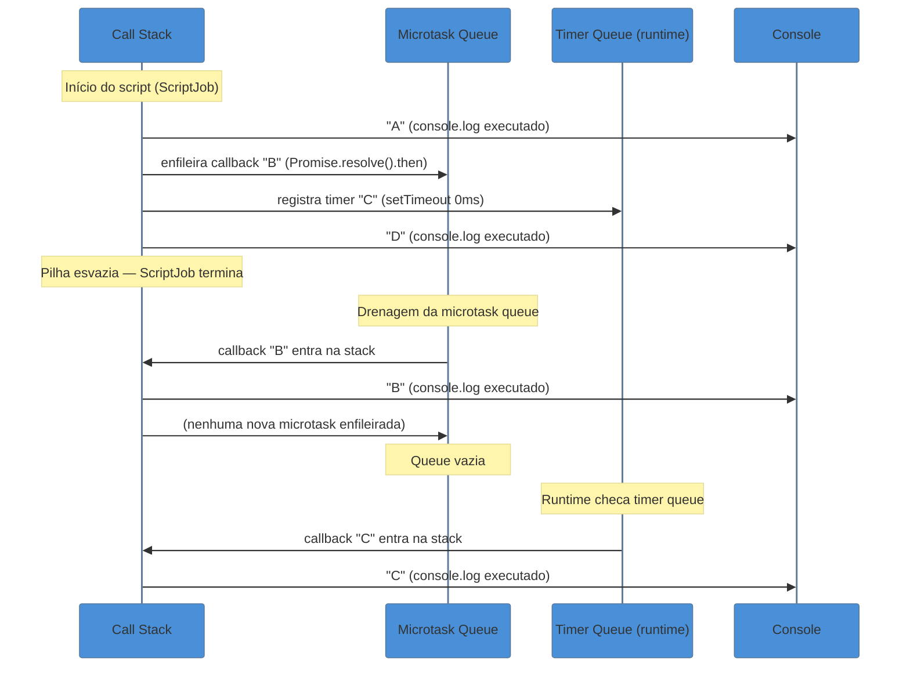
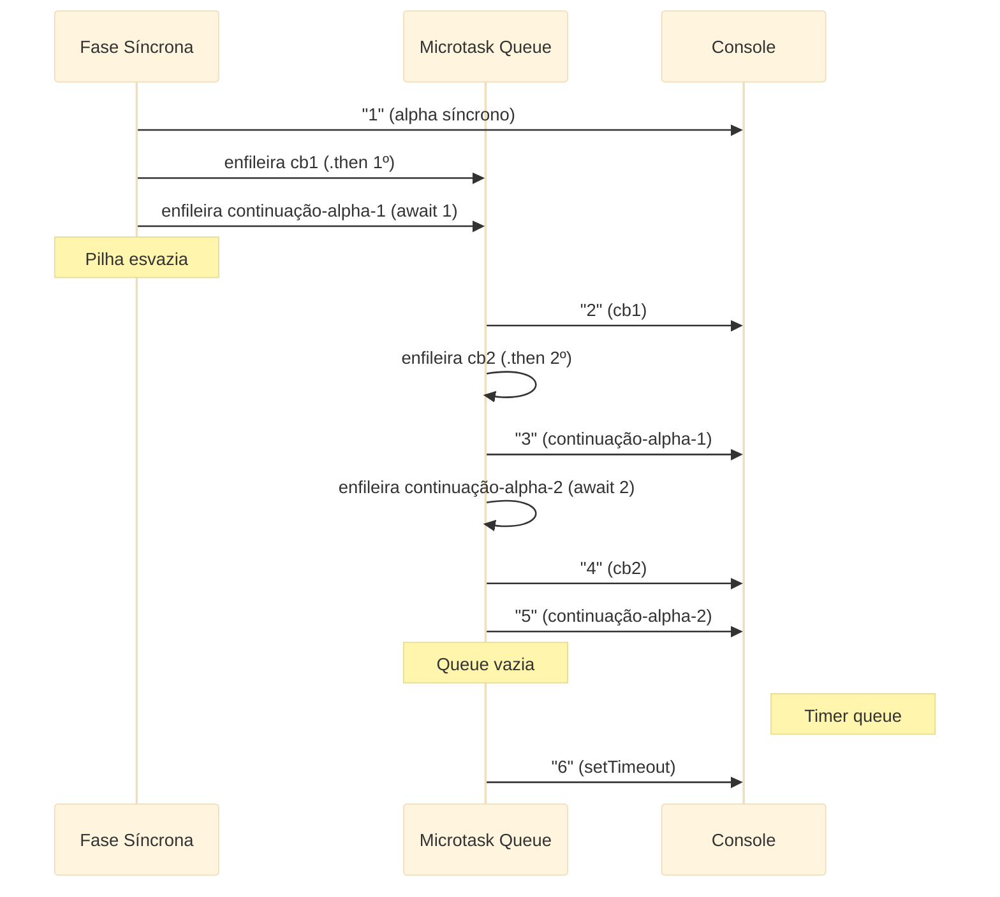

# Modelo de execução a fundo

> [!abstract] TL;DR
> JavaScript executa em uma única thread com semântica **run-to-completion**: cada "turno" de execução vai até o fim antes de qualquer outro código entrar. A ECMAScript spec define uma fila de **Jobs** (também chamada microtask queue) que é drenada completamente após cada turno síncrono — callbacks de `Promise.then` e `queueMicrotask` vivem aqui. O que a spec **não** define são fases, timers ou I/O: isso é responsabilidade do runtime (Node.js ou browser). A armadilha sênior é confundir o que é garantia da linguagem com o que é comportamento de plataforma — e a starvation de microtask é o sinal de que alguém confundiu.

---

## O problema: por que o código não roda na ordem que você escreveu?

Você escreve três linhas de código. Roda. A saída não é a ordem que você esperava.

```javascript
console.log("A");

Promise.resolve().then(() => console.log("B"));

setTimeout(() => console.log("C"), 0);

console.log("D");
```

A saída é: `A → D → B → C`.

Não `A → B → C → D`. Não `A → D → C → B`. Exatamente `A → D → B → C`.

Por quê? Porque há três mecanismos distintos em jogo — e entendê-los separadamente é o que separa quem *usa* JavaScript de quem *conhece* JavaScript.

---

## A call stack: o palco da execução síncrona

Imagine a call stack como uma pilha de pratos. Cada chamada de função empilha um prato (um **frame**); quando a função retorna, o prato sai. O JavaScript só executa código enquanto há pratos na pilha — e nunca interrompe uma função no meio para executar outra.

```javascript
function c() {
    console.log("c");       // frame 3
}

function b() {
    c();                    // frame 2 chama c → frame 3 empilha
}

function a() {
    b();                    // frame 1 chama b → frame 2 empilha
}

a();                        // frame 1 empilha → b → c → desempilha tudo
```

Cada frame carrega: a referência à função, os argumentos, as variáveis locais, e o ponto de retorno. Quando `c` termina, desempilha; quando `b` termina, desempilha; quando `a` termina, a pilha fica **vazia**.

> [!question]- O que acontece quando a pilha fica vazia?
> Exatamente aqui é onde a mágica acontece. Uma pilha vazia é o sinal para o runtime verificar se há trabalho pendente: primeiro na fila de microtasks, depois nas filas do runtime (timers, I/O). A pilha precisa estar **completamente vazia** antes de qualquer callback entrar.

### Stack overflow: quando a pilha transborda

Cada frame ocupa memória. Uma recursão infinita (ou muito profunda) esgota a memória reservada para a stack:

```javascript
function boom() {
    return boom(); // nunca desempilha
}

boom(); // RangeError: Maximum call stack size exceeded
```

O limite é de ~10.000–15.000 frames no V8 (varia pela plataforma e tamanho dos frames). Recursão profunda legítima usa trampolim ou iteração explicita para contornar.

---

## Run-to-completion: a garantia que torna JS previsível

A semântica **run-to-completion** é uma garantia fundamental da ECMAScript: uma vez que um pedaço de código começa a executar, ele vai até o fim antes de qualquer outro código JavaScript entrar na thread.

Isso é diferente de linguagens com threads e locks. Em JS, não há condição de corrida no acesso a variáveis — porque nunca há dois pedaços de código correndo ao mesmo tempo.

```javascript
let contador = 0;

setTimeout(() => {
    // este callback só entra quando a pilha já estiver vazia
    // "contador" aqui é sempre o valor final, nunca um valor intermediário
    console.log(contador);
}, 0);

for (let i = 0; i < 1_000_000; i++) {
    contador++;
}
// mesmo com 1 milhão de incrementos, o setTimeout espera
```

> [!info] Run-to-completion não significa "rápido"
> Significa "sem interrupção". Um loop de 10 segundos bloqueia o event loop por 10 segundos — nenhum callback, render, ou evento de usuário entra durante esse tempo. Essa é a definição de **bloqueio do event loop**.

---

## O que a ECMAScript spec define: Jobs e Job Queues

A spec (ECMAScript 2025, seção 9.5) formaliza o conceito de **Job**: uma operação abstrata que é enfileirada para executar quando a pilha estiver vazia. Jobs vivem em **Job Queues** — filas FIFO.

A spec define duas queues principais:

| Queue | O que vai para lá |
|-------|------------------|
| **ScriptJobs** | A execução inicial de um script ou módulo |
| **PromiseJobs** | Callbacks de `Promise.then`, `Promise.catch`, `Promise.finally` |

O que a spec diz literalmente: *"A Job can only be initiated when there is no running execution context and the execution context stack is empty."*

Tradução operacional: **Jobs só rodam com pilha vazia.** E quando começam, rodam até o fim (run-to-completion novamente — recursivo).

### HostEnqueuePromiseJob: a ponte spec↔runtime

A spec define o *abstract operation* `HostEnqueuePromiseJob` como um hook que o host (browser, Node.js) deve implementar para enfileirar um PromiseJob. É aqui que a spec para e o runtime começa.

O browser implementa esse hook para enfileirar na microtask queue do HTML event loop. Node.js implementa para enfileirar via libuv. O comportamento de drenagem (esvaziar a fila antes do próximo macrotask) é **comportamento do host**, não da spec — mas é garantido por ambos os hosts principais.

> [!question]- A spec garante que microtasks rodam antes de timers?
> Não diretamente. A spec garante que Jobs rodam antes do próximo Job inicial (ScriptJob). A garantia de que microtasks rodam antes de `setTimeout` é da spec do HTML Whatwg e da implementação Node/libuv — não da ECMAScript. Na prática, todo host moderno segue essa semântica, mas tecnicamente é uma convenção de runtime, não da linguagem.

---

## A fila de microtasks em detalhe

"Microtask" é o nome que o HTML spec e o V8 usam para o que a ECMAScript chama de PromiseJob. Os dois termos são intercambiáveis na prática.

O que vai para a microtask queue:

- `Promise.then`, `.catch`, `.finally` callbacks
- `queueMicrotask(fn)` — API direta para enfileirar uma microtask
- `MutationObserver` callbacks (no browser)
- `process.nextTick` (Node.js — tecnicamente uma queue separada, mas com prioridade similar, veja [[03-Dominios/Tecnologia/Node/Runtime e Event Loop/05 - Microtasks - nextTick, queueMicrotask, Promise.then|Node 05]])

### A regra de drenagem

Depois que cada "turno" síncrono termina (pilha esvazia), **toda a microtask queue é drenada antes de qualquer macrotask entrar**. Se uma microtask enfileira outra microtask, essa nova microtask também é drenada no mesmo ciclo.

```
Turno síncrono → [pilha esvazia] → drena microtasks até vazia → próxima macrotask
```

Isso é fundamental. Não é "uma microtask por vez entre macrotasks" — é **todas as microtasks enfileiradas até aquele momento, mais as que forem adicionadas durante a drenagem**.

---

## Anatomia do exemplo: A → D → B → C passo a passo

Voltemos ao exemplo inicial. Vamos dissecar cada passo:

```javascript
console.log("A");                          // linha 1
Promise.resolve().then(() => console.log("B")); // linha 2
setTimeout(() => console.log("C"), 0);    // linha 3
console.log("D");                          // linha 4
```



**Passo 1 — `console.log("A")`:** Entra na pilha, executa, sai. Saída: `A`.

**Passo 2 — `Promise.resolve().then(...)`:** `Promise.resolve()` cria uma Promise já resolvida. `.then(cb)` verifica: a Promise está resolvida? Sim. Então enfileira `cb` na microtask queue **imediatamente** — mas não executa. A pilha não está vazia ainda.

**Passo 3 — `setTimeout(cb, 0)`:** Não é JS — é uma API do runtime. O runtime registra o timer. O callback só entrará na fila de timers depois que o delay expirar E a pilha estiver vazia.

**Passo 4 — `console.log("D")`:** Executa. Saída: `D`. Pilha esvazia.

**Passo 5 — Drenagem de microtasks:** Pilha vazia → microtask queue tem um item (callback `"B"`). Ele entra na pilha, executa, sai. Saída: `B`. Nenhuma nova microtask foi adicionada → queue vazia.

**Passo 6 — Próxima macrotask (runtime):** O timer de 0ms já expirou. Callback `"C"` entra. Saída: `C`.

Resultado final: `A → D → B → C`. Exatamente como previsto.

---

## `queueMicrotask` vs `Promise.then` vs `setTimeout`

Três formas de deferir código — três semânticas distintas:

| Mecanismo | Onde vai | Quando executa | Overhead | Caso de uso |
|-----------|----------|---------------|----------|-------------|
| `queueMicrotask(fn)` | Microtask queue | Antes do próximo macrotask, pilha vazia | Baixo (sem Promise) | Deferir trabalho de alta prioridade sem criar Promise |
| `Promise.resolve().then(fn)` | Microtask queue (PromiseJob) | Idem | Médio (cria objeto Promise) | Encadear operações assíncronas |
| `setTimeout(fn, 0)` | Timer queue (macrotask) | Após microtasks, após delay mínimo (~1-4ms no browser) | Baixo, mas delay real | Ceder ao event loop (yield), deixar render acontecer |

`queueMicrotask` foi adicionada (ES2019 / HTML spec) exatamente porque `Promise.resolve().then(fn)` era o hack idiomático para enfileirar microtasks — funciona, mas cria um objeto Promise desnecessário e pode mascarar exceções como rejeições de Promise em vez de erros síncronos.

```javascript
// Antes de queueMicrotask: hack com Promise
Promise.resolve().then(() => {
    throw new Error("ops"); // vira UnhandledPromiseRejection — difícil de debugar
});

// Com queueMicrotask: erro fica como erro normal
queueMicrotask(() => {
    throw new Error("ops"); // erro propagado normalmente
});
```

---

## Starvation de microtask: quando a fila nunca esvazia

A regra de drenagem — "drena todas as microtasks antes do próximo macrotask, incluindo as adicionadas durante a drenagem" — cria um risco real: **starvation**.

Se uma microtask sempre adiciona outra microtask, a fila nunca fica vazia. O event loop nunca avança para macrotasks. Timers, renders, eventos de I/O: tudo congela.

```javascript
// STARVATION — não faça isso
function starve() {
    queueMicrotask(starve); // enfileira a si mesma infinitamente
}

starve();
// setTimeout abaixo NUNCA executa
setTimeout(() => console.log("nunca"), 0);
```

Isso é diferente de um loop síncrono infinito apenas no mecanismo — o efeito observável (UI congelada, timers bloqueados) é idêntico.

> [!question]- Por que isso é pior que um setTimeout recursivo?
> `setTimeout` cria um novo macrotask a cada invocação — então o event loop consegue processar outros macrotasks entre eles (inclusive renders). `queueMicrotask` recursivo bloqueia o event loop sem jamais ceder.

---

## A fronteira spec↔runtime: o que a linguagem garante vs o que o runtime adiciona

Esta é a distinção que separa o conhecimento sênior:

| Camada | Quem define | O que garante |
|--------|-------------|---------------|
| **ECMAScript spec** | TC39 | Call stack, run-to-completion, Jobs/PromiseJobs, ordem dentro de cada Job Queue |
| **HTML Whatwg spec** | WHATWG | Event loop do browser: rendering, microtask checkpoint, macrotasks, `queueMicrotask` |
| **Node.js** | OpenJS Foundation | Fases libuv: timers, I/O, poll, check (`setImmediate`), close; `process.nextTick` queue |

A ECMAScript spec **não menciona** `setTimeout`, `setInterval`, I/O, rendering, ou as fases do event loop. Esses são detalhes de plataforma.

Isso tem implicação prática: o comportamento de `setTimeout(fn, 0)` vs `setImmediate(fn)` no Node.js é diferente do browser — não é bug, é diferença de runtime. Para aprofundar as fases do Node.js e a interação `nextTick` / `Promise.then` / `setImmediate`, veja [[03-Dominios/Tecnologia/Node/Runtime e Event Loop/index|Node · Runtime e Event Loop]].

---

## Casos práticos

### Cenário 1: batching de atualizações de estado

Em frameworks de UI (React, Vue, Svelte), múltiplas atualizações de estado num mesmo turno síncrono são "batched" — o re-render acontece uma vez só, não N vezes. O mecanismo é exatamente a drenagem de microtasks.

```javascript
// Simulação de batching manual com queueMicrotask
let pending = false;
const updates = [];

function scheduleFlush() {
    if (!pending) {
        pending = true;
        queueMicrotask(flush); // uma microtask por "turno"
    }
}

function flush() {
    pending = false;
    const batch = updates.splice(0);
    batch.forEach(fn => fn()); // aplica todas as atualizações de uma vez
}

function setState(update) {
    updates.push(update);
    scheduleFlush();
}

// Três setState no mesmo turno síncrono → um único flush
setState(() => console.log("update 1"));
setState(() => console.log("update 2"));
setState(() => console.log("update 3"));
// Saída: "update 1", "update 2", "update 3" — todos em uma microtask
```

Por que `queueMicrotask` e não `setTimeout`? Porque `setTimeout` cederia ao event loop e possivelmente a um render prematuro — visualmente indesejável. `queueMicrotask` garante que o flush acontece antes de qualquer macrotask, mas depois que o código síncrono atual termina (dando tempo para múltiplos `setState` acumularem).

### Cenário 2: garantir execução assíncrona em API pública

Uma armadilha clássica de libs: uma função que às vezes é síncrona e às vezes assíncrona.

```javascript
// PROBLEMA: comportamento inconsistente
function getData(cache, key, callback) {
    if (cache.has(key)) {
        callback(cache.get(key)); // síncrono — chama callback antes de retornar!
    } else {
        fetch(`/api/${key}`)
            .then(r => r.json())
            .then(data => {
                cache.set(key, data);
                callback(data); // assíncrono
            });
    }
}

// Quem chama não sabe se callback é síncrono ou não
getData(cache, "user", (data) => {
    // "result" pode ser undefined aqui se cache hit (callback rodou antes desta linha)
    console.log(result);
});
const result = "pós-chamada";
```

A correção clássica é garantir que o callback sempre seja assíncrono:

```javascript
function getData(cache, key, callback) {
    if (cache.has(key)) {
        queueMicrotask(() => callback(cache.get(key))); // sempre assíncrono
    } else {
        fetch(`/api/${key}`)
            .then(r => r.json())
            .then(data => {
                cache.set(key, data);
                callback(data);
            });
    }
}
```

Agora `callback` sempre roda depois que o código atual termina, seja cache hit ou miss.

---

## Por que microtasks drenam completamente: a regra da spec e o risco de starvation

Antes de explorar mais casos práticos, vale entender *por que* a drenagem total de microtasks é uma garantia — não um detalhe de implementação — e qual o preço real de violar isso por descuido.

### A regra da spec HTML

A seção 8.1.7.3 da spec HTML (Whatwg) descreve o **microtask checkpoint**: um procedimento chamado em múltiplos pontos do event loop que drena a fila de microtasks. A frase-chave é:

> *"While the microtask queue is not empty: dequeue a microtask and run it."*

Não "dequeue uma microtask". Não "dequeue até N microtasks". **Enquanto não estiver vazia**. E se durante a execução de uma microtask outra é enfileirada, ela entra na mesma fila que ainda está sendo drenada.

O resultado é uma invariante: **ao término do microtask checkpoint, a fila de microtasks está vazia**. O event loop nunca avança para rendering ou para a próxima macrotask com microtasks pendentes.

Por que a spec foi escrita assim? Consistência observável. Se o browser pudesse interromper a drenagem no meio, o estado do DOM entre microtasks seria visível para código que roda depois — criando race conditions observáveis sem multithreading. A drenagem total garante que o conjunto de microtasks de um "turno" forma uma unidade atômica.

### O risco de starvation: análise detalhada

Starvation ocorre quando microtasks continuam sendo geradas mais rápido do que são consumidas — ou, no caso extremo, quando cada microtask gera exatamente outra microtask.

```javascript
// Starvation clássica: recursão via queueMicrotask
function processarItens(lista, indice = 0) {
    if (indice >= lista.length) return;

    console.log(`Processando item ${indice}: ${lista[indice]}`);
    // PROBLEMA: enfileira a próxima iteração como microtask
    queueMicrotask(() => processarItens(lista, indice + 1));
}

const listaGrande = Array.from({ length: 100_000 }, (_, i) => i);

processarItens(listaGrande);

// Esta linha nunca executa durante o processamento:
setTimeout(() => console.log("Render liberado"), 0);
// O timer só disparará DEPOIS dos 100.000 queueMicrotask
```

Compare com a versão que usa `setTimeout` para ceder ao event loop:

```javascript
function processarItensComYield(lista, indice = 0) {
    if (indice >= lista.length) return;

    console.log(`Processando item ${indice}: ${lista[indice]}`);
    // Usa setTimeout: cede ao event loop entre cada 1.000 itens
    if (indice % 1000 === 999) {
        setTimeout(() => processarItensComYield(lista, indice + 1), 0);
    } else {
        queueMicrotask(() => processarItensComYield(lista, indice + 1));
    }
}
```

Nessa versão, a cada 1.000 itens o event loop tem chance de processar renders, inputs do usuário, e timers. A UI fica responsiva.

### Quando starvation é acidental

O cenário mais perigoso não é o loop óbvio — é a starvation acidental em código de produção:

```javascript
// Parece inofensivo: processa resultados paginados
async function carregarTudo(pagina = 1) {
    const dados = await fetch(`/api/items?page=${pagina}`).then(r => r.json());
    processar(dados.items);

    if (dados.hasNextPage) {
        return carregarTudo(pagina + 1); // recursão via await → microtasks
    }
}
```

Se a API tiver centenas de páginas e as respostas forem rápidas (cache local, por exemplo), cada `await` cria uma microtask. Com respostas síncronas simuladas (ex.: `fetch` mockado retornando Promise já resolvida), o loop processa todas as páginas antes de ceder ao event loop — starvation acidental.

A correção: inserir `await new Promise(resolve => setTimeout(resolve, 0))` periodicamente para ceder o event loop intencionalmente.

---

## Cenário 3: `await`, `.then` encadeado e `setTimeout` no mesmo tick

Este é o caso prático mais traiçoeiro em entrevistas sênior. Quando você mistura `async/await`, `.then` manual e `setTimeout` no mesmo bloco, a ordem de saída parece contra-intuitiva — mas é totalmente determinística se você sabe o mecanismo.

```javascript
async function alpha() {
    console.log("1 - alpha: início síncrono");

    await Promise.resolve(); // ponto de suspensão 1

    console.log("3 - alpha: após primeiro await");

    await Promise.resolve(); // ponto de suspensão 2

    console.log("5 - alpha: após segundo await");
}

Promise.resolve()
    .then(() => console.log("2 - .then encadeado (1º)"))
    .then(() => console.log("4 - .then encadeado (2º)"));

setTimeout(() => console.log("6 - setTimeout"), 0);

alpha();
```

**Saída esperada:**

```
1 - alpha: início síncrono
2 - .then encadeado (1º)
3 - alpha: após primeiro await
4 - .then encadeado (2º)
5 - alpha: após segundo await
6 - setTimeout
```

Vamos dissecar passo a passo:

**Fase síncrona (pilha cheia):**

- `Promise.resolve().then(cb1).then(cb2)`: cria Promise resolvida → `cb1` vai para microtask queue. `cb2` é registrado como dependente do resultado de `cb1` (ainda não enfileirado).
- `setTimeout(cb6, 0)`: registra timer no runtime → `cb6` vai para a timer queue quando expirar.
- `alpha()`: executa síncronamente até o primeiro `await`.
  - Imprime `"1 - alpha: início síncrono"`.
  - `await Promise.resolve()`: `Promise.resolve()` está resolvida → a continuação de `alpha` após o await é enfileirada como microtask. `alpha` suspende e retorna.

**Microtask queue ao final da fase síncrona:** `[cb1, continuação-alpha-1]`

**Drenagem de microtasks — rodada 1:**

- `cb1` executa → imprime `"2 - .then encadeado (1º)"`. O resultado de `cb1` resolve a Promise intermediária → `cb2` vai para a queue.
- `continuação-alpha-1` executa → imprime `"3 - alpha: após primeiro await"`. Encontra o segundo `await Promise.resolve()` → continuação-alpha-2 vai para a queue.

**Microtask queue após rodada 1:** `[cb2, continuação-alpha-2]`

**Drenagem de microtasks — rodada 2:**

- `cb2` executa → imprime `"4 - .then encadeado (2º)"`. Sem mais `.then` registrado → nada mais enfileirado.
- `continuação-alpha-2` executa → imprime `"5 - alpha: após segundo await"`. `alpha` termina.

**Microtask queue vazia → runtime verifica timer queue:**

- Timer de 0ms expirou → `cb6` entra → imprime `"6 - setTimeout"`.

### Por que `2` vem antes de `3`?

A questão-chave: quando `alpha()` é chamado, o `Promise.resolve().then(cb1)` **já foi registrado antes** da chamada de `alpha`. Então `cb1` entra na microtask queue **antes** da continuação do `await` de alpha.

Se a ordem fosse invertida — `alpha()` antes do `.then` — a saída seria diferente:

```javascript
alpha(); // alpha registra sua continuação primeiro
Promise.resolve().then(() => console.log("2")); // entra depois na queue
```

```
1 - alpha: início síncrono
3 - alpha: após primeiro await  ← continuação de alpha veio primeiro
2 - .then encadeado (1º)        ← .then entrou depois
...
```

**A regra:** a posição na microtask queue é FIFO — primeiro a ser enfileirado, primeiro a executar. A ordem das linhas síncronas que criam as Promises determina a ordem das microtasks.



### `queueMicrotask` dentro de uma microtask

Um sub-caso de starvation controlada: o que acontece quando uma microtask chama `queueMicrotask` explicitamente?

```javascript
console.log("A");

queueMicrotask(() => {
    console.log("B - microtask 1");
    queueMicrotask(() => console.log("D - microtask aninhada"));
    console.log("C - ainda em B");
});

console.log("E");
```

**Saída:** `A → E → B → C → D`

- Fase síncrona: `A`, enfileira microtask-B, `E`.
- Drenagem: microtask-B executa → imprime `B`, enfileira microtask-D, imprime `C`.
- Drenagem continua: microtask-D executa → imprime `D`.
- Queue vazia.

Ponto sutil: `C` vem **antes** de `D`, porque `C` está no meio da execução de microtask-B — que ainda não terminou quando `queueMicrotask(D)` é chamado. A microtask-D só é processada quando microtask-B terminar e a drenagem continuar.

---

## Event loop: browser vs Node — as diferenças que importam

A ECMAScript define o mecanismo de Jobs. Mas quem implementa o event loop são os runtimes. As diferenças entre browser e Node.js não são triviais — e em situações de código cross-platform ou durante debugging, saber a fronteira evita horas de caça ao bug.

### O event loop do browser

O browser segue a spec HTML (Whatwg). O ciclo completo de um "tick" do event loop inclui etapas que não existem no Node:

```
┌──────────────────────────────────────────────────────────────┐
│                     Browser Event Loop                        │
│                                                              │
│  1. Seleciona uma macrotask da task queue                    │
│  2. Executa a macrotask (run-to-completion)                  │
│  3. Microtask checkpoint: drena toda a microtask queue       │
│  4. [ Se necessário ] Rendering pipeline:                    │
│       a. requestAnimationFrame callbacks                     │
│       b. Intersection observers, resize observers            │
│       c. Layout e paint                                      │
│  5. Volta ao passo 1                                         │
└──────────────────────────────────────────────────────────────┘
```

O passo 4 é o que não existe no Node. O browser só roda o rendering pipeline **quando necessário** (tipicamente a cada 16.7ms para 60fps) e **após** o microtask checkpoint. Isso tem implicações diretas:

**requestAnimationFrame (rAF) é uma macrotask especial de render:**

```javascript
requestAnimationFrame(() => {
    console.log("rAF: antes do paint");
    // Rodou antes do próximo frame de 16ms, mas depois de todas as microtasks
});

Promise.resolve().then(() => {
    console.log("microtask: roda antes do rAF");
});

setTimeout(() => {
    console.log("setTimeout: pode rodar antes ou depois do rAF, depende do timing");
}, 0);
```

A ordem de `rAF` vs `setTimeout` não é garantida pela spec — depende de quando o browser decide que é hora de renderizar. Mas microtasks **sempre** rodam antes do rAF, que roda antes do paint.

**Por que importa para desenvolvedores front-end:**

Se você tem código que precisa ler o DOM após uma mudança de estado mas antes do próximo paint, `queueMicrotask` é a ferramenta certa. Se você quer coordenar com o ciclo de render (animações, medições de layout), `requestAnimationFrame` é a API correta.

Para detalhes do pipeline de render e suas implicações de performance (layout thrashing, forced reflow, etc.), veja a nota de Plataforma Web.

### O event loop do Node.js

O Node.js usa o libuv como event loop. A estrutura é radicalmente diferente — tem **fases** explícitas:

```
┌──────────────────────────────────────────────────────────────┐
│                   Node.js Event Loop (libuv)                 │
│                                                              │
│  ┌─────────┐  ┌──────────┐  ┌──────┐  ┌─────────────────┐  │
│  │ timers  │→ │ pending  │→ │ idle │→ │   poll (I/O)    │  │
│  │ (setTimeout│ callbacks│  │      │  │                 │  │
│  │ setInterval)│         │  │      │  │                 │  │
│  └─────────┘  └──────────┘  └──────┘  └─────────────────┘  │
│       ↑                                        │            │
│       │        ┌─────────────┐  ┌──────────┐  │            │
│       └────────│    close    │← │  check   │←─┘            │
│                │  callbacks  │  │(setImm.) │               │
│                └─────────────┘  └──────────┘               │
│                                                              │
│  Entre cada fase: drena nextTick queue → drena microtasks   │
└──────────────────────────────────────────────────────────────┘
```

A diferença crítica: em Node.js, `process.nextTick` tem uma queue **separada** e com prioridade **maior** que Promises. E essa drenagem acontece **entre cada fase do libuv** — não só após cada macrotask.

```javascript
// Node.js: ordem diferente do browser
setTimeout(() => console.log("setTimeout"), 0);
setImmediate(() => console.log("setImmediate")); // fase check

Promise.resolve().then(() => console.log("Promise.then"));
process.nextTick(() => console.log("nextTick"));

// Saída típica no Node:
// nextTick
// Promise.then
// setTimeout   ← ou setImmediate, depende do timing da fase timers
// setImmediate
```

A ordem `nextTick > Promise.then > setTimeout/setImmediate` é garantida no Node. A ordem entre `setTimeout(0)` e `setImmediate` **não é garantida** fora de um callback de I/O (vira condição de corrida de timing).

**Para aprofundar as fases do Node e os detalhes de nextTick/setImmediate**, veja [[03-Dominios/Tecnologia/Node/Runtime e Event Loop/index|Node · Runtime e Event Loop]] — especialmente a nota [[03-Dominios/Tecnologia/Node/Runtime e Event Loop/04 - As fases do event loop|04 · As fases do event loop]] e [[03-Dominios/Tecnologia/Node/Runtime e Event Loop/05 - Microtasks - nextTick, queueMicrotask, Promise.then|05 · Microtasks no Node]]. Esse conteúdo pertence ao domínio Node — aqui só a fronteira importa.

### Tabela de diferenças práticas browser vs Node

| Aspecto | Browser | Node.js |
|---------|---------|---------|
| `setTimeout(fn, 0)` | Delay real ~1-4ms (throttle aninhado) | Delay real ~1ms, mas na fase `timers` |
| `setImmediate` | Não existe | Fase `check` — após poll, antes de timers |
| `process.nextTick` | Não existe | Queue separada, prioridade > Promise |
| `queueMicrotask` | Spec HTML — após cada macrotask | Disponível; drena entre fases do libuv |
| `requestAnimationFrame` | Sincronizado com o frame de render | Não existe |
| `MutationObserver` | Microtask (antes de render) | Não existe (sem DOM) |
| Rendering pipeline | Integrado ao loop (60fps) | Sem rendering — só I/O |

---

## Armadilhas comuns

> [!warning] Assumir que `setTimeout(fn, 0)` é imediato
> **O que acontece:** O callback não roda "logo depois" — roda depois de todas as microtasks pendentes, mais o delay mínimo do timer (browsers impõem ~1ms, às vezes 4ms se aninhado). Em benchmarks de latência isso importa.
> **Por quê:** `setTimeout` cria uma macrotask, que só entra após a drenagem completa da microtask queue.
> **Como evitar:** Para execução o mais cedo possível (mas ainda assíncrona), use `queueMicrotask`. Para ceder ao event loop intencionalmente, `setTimeout(fn, 0)` é correto.

> [!warning] Encadear `.then` e achar que é "uma" microtask
> **O que acontece:** Cada `.then` cria **uma nova** microtask. Um chain de 5 `.then` cria 5 microtasks enfileiradas em sequência. Com chains longos em loops, isso pode acumular dezenas de milhares de microtasks.
> **Por quê:** A spec exige que cada `.then` handler seja enfileirado como um PromiseJob separado, mesmo que todos estejam em sequência.
> **Como evitar:** Em processamento de alto volume, prefira loops síncronos sobre arrays resolvidos em vez de chains longos de Promises.

> [!warning] Criar loops de microtask recursivos sem critério de parada
> **O que acontece:** UI congela, timers param, o processo parece travado.
> **Por quê:** A fila de microtasks nunca esvazia — o event loop nunca avança.
> **Como evitar:** Se precisar de recursão assíncrona, use `setTimeout` com delay 0 (cede ao event loop entre iterações) ou divida o trabalho em chunks.

> [!warning] Confundir `process.nextTick` com `queueMicrotask` no Node.js
> **O que acontece:** `process.nextTick` tem prioridade **ainda maior** que Promise callbacks no Node.js — roda antes de qualquer PromiseJob. Código que funciona no browser pode ter ordem diferente no Node.
> **Por quê:** Node.js mantém uma nextTick queue separada, drenada antes da microtask queue do libuv.
> **Como evitar:** Para código portável, use `queueMicrotask`. Use `process.nextTick` apenas quando precisar da semântica Node-específica (antes de qualquer I/O na fase atual). Ver [[03-Dominios/Tecnologia/Node/Runtime e Event Loop/05 - Microtasks - nextTick, queueMicrotask, Promise.then|Node 05]].

---

## Como explicar em inglês

In an interview, if asked about the JavaScript execution model:

> "JavaScript is single-threaded with run-to-completion semantics — once a piece of code starts executing, it runs to completion before anything else can enter. The ECMAScript spec defines a Job Queue — the microtask queue — which is fully drained after each synchronous turn before any macrotasks like timers or I/O callbacks can run. `Promise.then` and `queueMicrotask` both schedule microtasks; `setTimeout` schedules a macrotask. The phases of the event loop — timers, I/O, check — are runtime-specific behavior, not part of the language spec itself."

| PT | EN |
|----|----|
| pilha de chamadas | call stack |
| fila de microtasks | microtask queue |
| fila de macrotasks | macrotask queue / task queue |
| semântica run-to-completion | run-to-completion semantics |
| inanição de microtask | microtask starvation |
| drenagem da fila | queue draining |
| frame de execução | execution frame / stack frame |
| Job (spec ECMAScript) | Job (ECMAScript abstract operation) |
| fila de Jobs | Job Queue |
| host | host environment |

---

## Resumo em 1 linha

O modelo de execução JavaScript em uma frase: **a call stack executa síncronamente até esvaziar, então drena todas as microtasks (PromiseJobs, queueMicrotask), e só depois cede ao runtime para timers e I/O — em sequência, uma thread, sem interrupção.**

---

## O que vem a seguir

Entender a ordem sync → microtask → macrotask é o mapa. As notas a seguir preenchem os detalhes do território:

- [[03-Dominios/Tecnologia/JavaScript/14 - Promises|14 · Promises]] — como Promises geram PromiseJobs: o mecanismo interno de resolução e encadeamento
- [[03-Dominios/Tecnologia/JavaScript/15 - async-await|15 · async-await]] — como `async/await` é açúcar sintático sobre Promises e como cada `await` cria pontos de suspensão/retomada via microtasks
- [[03-Dominios/Tecnologia/Node/Runtime e Event Loop/index|Node · Runtime e Event Loop]] — as fases do event loop do Node.js: timers, I/O, poll, check, `setImmediate`, `process.nextTick`; o que acontece além da microtask queue

---

## Fontes

- **MDN Web Docs** — [*JavaScript execution model*](https://developer.mozilla.org/en-US/docs/Web/JavaScript/Reference/Execution_model) — documentação oficial do modelo de execução, referência para comportamento garantido pela spec
- **MDN Web Docs** — [*Using microtasks in JavaScript with queueMicrotask()*](https://developer.mozilla.org/en-US/docs/Web/API/HTML_DOM_API/Microtask_guide) — guia autoritativo sobre microtasks, queueMicrotask e starvation
- **MDN Web Docs** — [*In depth: Microtasks and the JavaScript runtime environment*](https://developer.mozilla.org/en-US/docs/Web/API/HTML_DOM_API/Microtask_guide/In_depth) — análise em profundidade da relação entre spec e runtime
- **Jake Archibald** — [*Tasks, microtasks, queues and schedules*](https://jakearchibald.com/2015/tasks-microtasks-queues-and-schedules/) — análise clássica e detalhada com exemplos visuais interativos; ainda preciso em 2026
- **javascript.info** — [*Microtasks*](https://javascript.info/microtask-queue) e [*Event loop: microtasks and macrotasks*](https://javascript.info/event-loop) — explicação progressiva com exemplos de starvation
- **ECMAScript 2025 Specification** — Seção 9.5 (Jobs and Job Queues) — fonte primária da spec; define `EnqueueJob`, `HostEnqueuePromiseJob`, e a semântica de PromiseJobs
