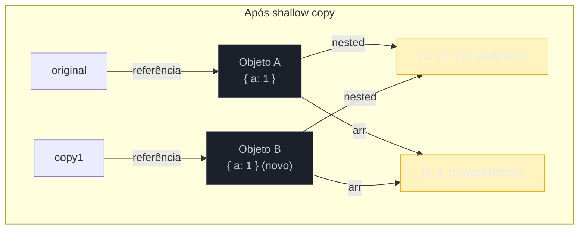
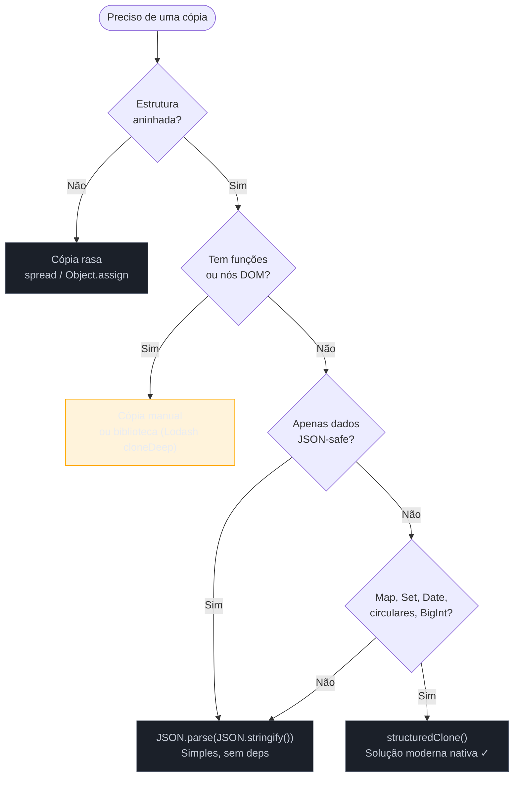

# Cópia, serialização e imutabilidade

> [!abstract] TL;DR
> Em JavaScript, atribuir um objeto a outra variável copia a **referência**, não o valor — qualquer mutação reflete nos dois lados. Cópia rasa (`spread`, `Object.assign`) resolve o nível superficial mas deixa objetos aninhados compartilhados. `structuredClone()` é hoje a solução nativa para cópia profunda, suportando `Map`, `Set`, `Date`, referências circulares — mas rejeitando funções e nós DOM. `JSON.parse(JSON.stringify())` é alternativa simples, porém perde tipos (`Date` vira string, `undefined` some, `BigInt` lança erro). `Object.freeze()` congela apenas o nível superficial — objetos aninhados continuam mutáveis. Imutabilidade profunda real exige ou uma função `deepFreeze` recursiva ou uma biblioteca como Immer, que usa *structural sharing* para evitar cópias desnecessárias.

---

## O bug que assombra todo desenvolvedor JavaScript

Imagine que você tem um carrinho de compras em um estado global e precisa preparar um "carrinho de prévia" para o usuário revisar antes de confirmar. A solução parece óbvia:

```js
const cart = { items: [{ id: 1, qty: 2 }], discount: 0.1 };
const preview = { ...cart };  // cópia rasa

preview.items[0].qty = 5;     // ajuste para prévia

console.log(cart.items[0].qty); // → 5  🚨 O carrinho original foi mutado!
```

O `spread` copiou a referência do array `items`, não o array em si. Quando `preview.items[0].qty` mudou, você mudou o **mesmo objeto** que `cart.items[0]` aponta. Esse é o bug de mutação compartilhada — silencioso, difícil de rastrear, e a causa de horas perdidas em debugging de estado.

Para entender por quê isso acontece, precisamos voltar ao modelo de memória do JavaScript.

---

## Valor vs. referência — o recap que salva vidas

Tipos primitivos (`number`, `string`, `boolean`, `null`, `undefined`, `symbol`, `BigInt`) são passados **por valor**: a variável guarda o dado diretamente na pilha (*stack*). Atribuir um primitivo a outra variável cria uma cópia independente.

Objetos, arrays e funções vivem no *heap* e são passados **por referência**: a variável guarda um ponteiro para o endereço de memória. Copiar a variável copia o ponteiro, não o dado.

```js
// Primitivo: cópia independente
let a = 42;
let b = a;
b = 100;
console.log(a); // → 42  ✓

// Objeto: referência compartilhada
let obj1 = { x: 1 };
let obj2 = obj1;
obj2.x = 99;
console.log(obj1.x); // → 99  ⚠️ mesmo objeto
```

O detalhe importante para objetos aninhados é que cada nível da estrutura é um objeto separado no heap, com seu próprio endereço. Copiar o nível de cima não copia os níveis de baixo.

> [!info] Mais sobre objetos e sua estrutura interna
> A mecânica de propriedades, descritores e prototype chain está em [[07 - Objetos]]. Arrays como objetos especiais em [[08 - Arrays e métodos]].

---

## Cópia rasa: o que funciona, o que falha

Cópia rasa (*shallow copy*) cria um novo objeto no topo, mas **mantém referências** para todos os valores que são objetos.

### As três formas canônicas

```js
const original = { a: 1, nested: { b: 2 }, arr: [3, 4] };

// 1. Spread operator (ES2018 para objetos)
const copy1 = { ...original };

// 2. Object.assign()
const copy2 = Object.assign({}, original);

// 3. Array.prototype.slice() — para arrays
const arr = [1, [2, 3], 4];
const arrCopy = arr.slice();
```

Todas as três fazem a **mesma coisa**: copiam as propriedades do nível superficial. Para propriedades cujo valor é um primitivo, a cópia é independente. Para propriedades cujo valor é um objeto, a referência é compartilhada.

```js
copy1.a = 99;             // ✓ não afeta original
copy1.nested.b = 99;      // ⚠️ afeta original.nested.b — referência compartilhada
copy1.arr.push(5);        // ⚠️ afeta original.arr — mesma referência
```



O nível amarelo (aninhado) é compartilhado — qualquer mutação lá reflete nos dois lados.

---

## Cópia profunda: as três abordagens

### `structuredClone()` — a solução moderna

> [!tip] Vídeos recomendados
> - **Web Dev Simplified** — [*I Didn't Know JavaScript Had THIS!*](https://www.youtube.com/watch?v=LB6RnfblQl8) — cobertura direta do `structuredClone` com casos de uso reais (12 min)
> - **Fireship** — [*JavaScript Immutability*](https://www.youtube.com/watch?v=7PolyDM9Ias) — visão geral rápida de imutabilidade, `freeze` vs bibliotecas (8 min)
> - **Theo - t3.gg** — [*Deep Clone in JavaScript - Stop Doing It Wrong*](https://www.youtube.com/watch?v=bW5G_5kZh5s) — compara `structuredClone`, JSON e lodash cloneDeep com benchmarks (14 min)

Introduzida no Node.js 17 (2021) e disponível em todos os browsers modernos desde 2022 (Chrome 98+, Firefox 94+, Safari 15.4+), `structuredClone()` usa o [Structured Clone Algorithm](https://developer.mozilla.org/en-US/docs/Web/API/Web_Workers_API/Structured_clone_algorithm) para percorrer recursivamente toda a estrutura e criar cópias independentes em cada nível.

```js
const original = {
  name: "cart",
  items: [{ id: 1, qty: 2 }],
  createdAt: new Date("2026-01-01"),
  meta: new Map([["source", "web"]]),
  tags: new Set(["promo", "sale"]),
};

const clone = structuredClone(original);

clone.items[0].qty = 99;
console.log(original.items[0].qty); // → 2  ✓ independente

clone.createdAt.setFullYear(2099);
console.log(original.createdAt.getFullYear()); // → 2026  ✓ Date clonada
```

**O que `structuredClone` suporta:**

| Tipo | Comportamento |
|------|---------------|
| Objetos e arrays aninhados | Clonagem profunda completa |
| `Date` | Clona como `Date` (preserva tipo) |
| `Map` e `Set` | Clona com seus dados |
| `RegExp` | Clona (mas `lastIndex` não é preservado) |
| `ArrayBuffer`, `TypedArray` | Clona os dados binários |
| Referências circulares | Suportado — mantém a estrutura circular |
| `Error` | Clona mensagem e stack |

**O que `structuredClone` NÃO suporta:**

| Tipo | Resultado |
|------|-----------|
| Funções | `DataCloneError` — lança exceção |
| Nós DOM (`Element`, `Node`) | `DataCloneError` — lança exceção |
| Descritores de propriedade | Ignorados (getters/setters viram valores) |
| `Symbol` como chave | Ignorado |
| Prototype personalizado | Ignorado — clone vira `Object` puro |

```js
// Funções: falha
const withFn = { greet: () => "hello", name: "Alice" };
structuredClone(withFn); // → DataCloneError ❌

// Referência circular: funciona
const a = { name: "a" };
a.self = a;  // referência circular
const clone = structuredClone(a);
console.log(clone.self === clone); // → true  ✓
```

> [!question]- Por que funções não podem ser clonadas?
> Funções em JavaScript contêm referências ao seu escopo léxico (closure). Serializar isso fielmente implicaria copiar todo o contexto de variáveis capturadas — um problema equivalente a serializar estado de execução. O algoritmo structured clone, por design, opera sobre dados, não sobre comportamento. Para transferir comportamento, use código-fonte (string) ou reconstrução manual.

### `JSON.parse(JSON.stringify())` — legado ainda útil

A abordagem clássica serializa o objeto em uma string JSON e desserializa de volta. Funciona para estruturas simples de dados puros, mas cobra um preço alto em tipos.

```js
const obj = {
  name: "produto",
  date: new Date("2026-01-01"),
  price: undefined,
  compute: () => 42,
  bigN: BigInt(9999999999999),
};

const clone = JSON.parse(JSON.stringify(obj));

// O que sobrou:
// { name: "produto", date: "2026-01-01T00:00:00.000Z" }
// date → string (perdeu o tipo Date)
// price → desapareceu (undefined some)
// compute → desapareceu (função some)
// bigN → TypeError: Do not know how to serialize a BigInt
```

**Mapa de perdas do JSON round-trip:**

| Valor original | Após `JSON.parse(JSON.stringify(...))` |
|----------------|---------------------------------------|
| `Date` | String ISO (perde o tipo) |
| `undefined` (valor de prop) | Propriedade removida |
| `undefined` (em array) | `null` |
| `function` | Propriedade removida |
| `Infinity`, `NaN` | `null` |
| `BigInt` | `TypeError` |
| `Map`, `Set` | `{}` ou `[]` (dados perdidos) |
| Referência circular | `TypeError` |
| Prototype personalizado | Vira `Object` puro |

**Quando usar mesmo assim:** estruturas simples de dados puros (strings, numbers, booleans, objetos planos, arrays de primitivos) onde você controla o formato. É rápido e sem dependências. Para tudo que envolva tipos ricos, prefira `structuredClone`.

**`replacer` e `reviver` — cirurgia de precisão**

```js
// replacer: controla o que entra no JSON
const replacer = (key, value) => {
  if (typeof value === "function") return undefined; // omite funções
  if (value instanceof Date) return { __type: "Date", iso: value.toISOString() };
  return value;
};

// reviver: restaura tipos na desserialização
const reviver = (key, value) => {
  if (value && value.__type === "Date") return new Date(value.iso);
  return value;
};

const serialized = JSON.stringify(obj, replacer);
const restored = JSON.parse(serialized, reviver);
// restored.date → Date válida  ✓
```

O par `replacer`/`reviver` é a forma de ensinar ao JSON como tratar tipos personalizados — essencialmente um protocolo de serialização manual. Funciona bem para casos previsíveis, mas exige manutenção quando o schema evolui.

---

## Diagrama: qual abordagem usar?



---

## Imutabilidade: congelar objetos em JavaScript

Às vezes não queremos clonar — queremos **garantir que um objeto não seja mutado** depois de criado. JavaScript oferece três níveis de congelamento, do mais restritivo ao mais permissivo.

### Os três níveis

```js
const obj = { x: 1, nested: { y: 2 } };

// Object.preventExtensions — não pode adicionar props novas
Object.preventExtensions(obj);
obj.z = 3;   // silencioso em modo normal, TypeError em strict mode
obj.x = 99;  // ✓ ainda pode alterar existentes
delete obj.x; // ✓ ainda pode deletar

// Object.seal — não pode adicionar nem deletar props
Object.seal(obj);
obj.z = 3;    // ❌ silencioso ou TypeError
delete obj.x; // ❌ silencioso ou TypeError
obj.x = 99;   // ✓ ainda pode alterar valores

// Object.freeze — não pode adicionar, deletar nem alterar
Object.freeze(obj);
obj.x = 99;   // ❌ silencioso ou TypeError (strict mode)
obj.z = 3;    // ❌
delete obj.x; // ❌
```

**Verificação do estado:**

```js
Object.isExtensible(obj); // false após preventExtensions/seal/freeze
Object.isSealed(obj);     // false / true / true
Object.isFrozen(obj);     // false / false / true
```

### `freeze` é raso — a armadilha mais comum

```js
const config = Object.freeze({
  db: { host: "localhost", port: 5432 }
});

config.db = "outro";   // ❌ bloqueado pelo freeze
config.db.host = "evil.com"; // ✓ funciona! O objeto aninhado não está frozen
```

`Object.freeze` congela apenas o objeto diretamente referenciado. Objetos aninhados continuam completamente mutáveis.

### `deepFreeze` — implementação recursiva

Para imutabilidade real, é preciso percorrer a estrutura:

```js
function deepFreeze(obj) {
  // Congela o próprio objeto
  Object.freeze(obj);

  // Percorre as propriedades e congela objetos filhos
  Object.getOwnPropertyNames(obj).forEach((name) => {
    const value = obj[name];
    if (
      value !== null &&
      typeof value === "object" &&
      !Object.isFrozen(value)
    ) {
      deepFreeze(value);
    }
  });

  return obj;
}

const config = deepFreeze({
  db: { host: "localhost", port: 5432 },
  features: ["auth", "payments"],
});

config.db.host = "evil.com"; // → silencioso (ou TypeError em strict mode)
console.log(config.db.host); // → "localhost"  ✓
```

> [!question]- Por que `Object.freeze` não faz deep por padrão?
> Performance e design. Um objeto pode ter estruturas muito profundas ou circulares. Congelar recursivamente por padrão causaria custos inesperados e problemas com ciclos. A linguagem expõe o mecanismo primitivo; você compõe o comportamento de que precisa.

---

## Imutabilidade na prática: padrões e bibliotecas

### Padrão imutável sem congelamento

Em muitos sistemas (Redux, React state), imutabilidade é uma **convenção de código** — nunca mute, sempre retorne um novo objeto:

```js
// ❌ mutação — partido em pedaços de código grande
function addItem(cart, item) {
  cart.items.push(item);  // muta o original
  return cart;
}

// ✓ imutável — retorna nova estrutura
function addItem(cart, item) {
  return {
    ...cart,
    items: [...cart.items, item],
  };
}
```

Para estruturas profundas, o spread aninhado fica tedioso rapidamente:

```js
// Atualizar qty de um item específico — puramente imutável
function updateQty(cart, itemId, qty) {
  return {
    ...cart,
    items: cart.items.map((item) =>
      item.id === itemId ? { ...item, qty } : item
    ),
  };
}
```

### Structural sharing — o princípio por trás das bibliotecas

Copiar a estrutura inteira a cada mudança é caro para estruturas grandes. **Structural sharing** (compartilhamento estrutural) resolve isso: apenas o caminho até o nó mutado é copiado; o restante da árvore é compartilhado entre versão nova e antiga.

```
Estado anterior:        Estado novo (qty do item[0] mudou):

    Root                    Root'
   /    \                  /    \
 Meta   Items           Meta   Items'    ← novo array
        / \                    / \
      I1  I2                 I1' I2      ← I1' novo, I2 compartilhado
```

Isso é o que bibliotecas como **Immer** e **Immutable.js** implementam internamente. No caso do Immer, a API é especialmente ergonômica — você escreve código como se estivesse mutando, e o Immer produz uma nova estrutura imutável:

```js
import { produce } from "immer";

const nextCart = produce(cart, (draft) => {
  draft.items[0].qty = 5;  // parece mutação, mas não é
});

console.log(cart.items[0].qty);     // → 2  (original intacto)
console.log(nextCart.items[0].qty); // → 5  (novo)
```

> [!info] Records & Tuples — proposta retirada; o que veio depois
> A proposta TC39 de Records & Tuples (primitivos imutáveis com comparação por valor, `#{ a: 1 }`) foi **retirada em abril de 2025** (issue #394) após não conseguir consenso no comitê para adicionar novos primitivos à linguagem — a principal objeção foi o custo de semântica nova de valor para objetos. Em 2026, a área permanece sem substituto oficial em estágio avançado. As alternativas práticas: **Immer** (`produce`) para estado imutável por convenção; **Immutable.js** para coleções persistentes com structural sharing; TypeScript com `Readonly<T>` e `as const` para garantia estática (sem custo em runtime). A proposta **Value Objects** (exploratória, 2025) busca um caminho mais conservador, mas ainda em fase de discussão.

> [!info] `structuredClone` — suporte em 2026
> Em junho de 2026, `structuredClone` é Baseline Widely Available: suportado em todos os ambientes relevantes (Chrome 98+, Firefox 94+, Safari 15.4+, Node.js 17+, Deno 1.14+, Bun 0.1+). Não há razão para usar `JSON.parse(JSON.stringify())` em código novo, exceto quando a serialização para string JSON é o objetivo em si (ex: persistência, transporte HTTP).

---

## Comparação de igualdade estrutural

Uma consequência direta da semântica de referência é que `===` compara identidade, não conteúdo:

```js
const a = { x: 1 };
const b = { x: 1 };
console.log(a === b); // → false  (objetos diferentes no heap)
console.log(a === a); // → true   (mesma referência)
```

Para comparação estrutural (valor a valor), você precisa de uma função dedicada. A implementação ingênua para casos simples:

```js
function shallowEqual(a, b) {
  if (a === b) return true;
  const keysA = Object.keys(a);
  const keysB = Object.keys(b);
  if (keysA.length !== keysB.length) return false;
  return keysA.every((k) => a[k] === b[k]);
}
```

Para comparação profunda, o padrão em produção é `JSON.stringify` (com a ressalva de ordem de chaves) ou bibliotecas como Lodash `_.isEqual`. Em React, `shallowEqual` é suficiente para a maioria dos casos de `memo`/`PureComponent` porque o estado costuma ser imutável por convenção — se o objeto mudou, é um objeto novo.

---

## Casos práticos

### Cenário 1: clonar estado de formulário sem mutar a store

```js
// store Redux / Zustand com estado complexo
const formState = {
  user: { name: "Alice", address: { city: "SP", zip: "01000-000" } },
  files: [{ id: 1, name: "foto.jpg", metadata: new Map([["size", 2048]]) }],
  submitted: false,
};

// ❌ Tentativa ingênua — spread raso
const draft = { ...formState };
draft.user.address.city = "RJ"; // 💥 muta o estado original

// ✓ structuredClone — cópia profunda + Map clonado
const draft2 = structuredClone(formState);
draft2.user.address.city = "RJ";
draft2.files[0].metadata.set("size", 4096);

console.log(formState.user.address.city);          // → "SP"  ✓
console.log(formState.files[0].metadata.get("size")); // → 2048  ✓
```

Por que não usar JSON aqui? O campo `metadata` é um `Map`. `JSON.stringify` o transformaria em `{}`, destruindo os dados.

### Cenário 2: objeto de configuração imutável em módulo

Configurações de aplicação são candidatas naturais a `deepFreeze`: definidas uma vez, nunca devem ser acidentalmente alteradas em runtime.

```js
// config.js
function deepFreeze(obj) {
  Object.freeze(obj);
  Object.getOwnPropertyNames(obj).forEach((name) => {
    const val = obj[name];
    if (val !== null && typeof val === "object" && !Object.isFrozen(val)) {
      deepFreeze(val);
    }
  });
  return obj;
}

export const CONFIG = deepFreeze({
  api: {
    baseUrl: "https://api.example.com",
    timeout: 5000,
    retry: { maxAttempts: 3, backoffMs: 500 },
  },
  features: {
    darkMode: true,
    betaEnabled: false,
  },
});

// Em outro módulo:
CONFIG.api.timeout = 999;          // TypeError em strict mode ✓
CONFIG.api.retry.maxAttempts = 99; // TypeError em strict mode ✓ (deepFreeze alcançou)
```

> [!question]- E se o objeto de config tiver um `Date` ou `RegExp`?
> `Object.freeze` funciona com qualquer objeto — não há restrições de tipo. `Date` congelada não pode ter suas propriedades internas alteradas, mas `setFullYear()` e similares modificam o estado interno do objeto pelo mecanismo nativo, não via propriedades JS — então o freeze **não bloqueia mutações de `Date` pelo seus métodos**. Para configs, evite objetos mutáveis internamente como `Date`; prefira strings ISO ou timestamps Unix.

---

## Armadilhas comuns

> [!warning] JSON perde tipos ricos silenciosamente
> `JSON.parse(JSON.stringify(obj))` não lança erro quando encontra `undefined`, funções ou `Map`/`Set` — simplesmente os remove ou transforma. Você recebe um objeto que parece correto mas com dados faltando. Audite os tipos antes de adotar a abordagem JSON.

> [!warning] `Object.freeze` é raso — objetos aninhados continuam mutáveis
> `Object.freeze(obj)` protege apenas as propriedades diretas de `obj`. Qualquer propriedade que aponte para outro objeto mantém esse objeto completamente mutável. O erro é assumir que freeze garante imutabilidade profunda sem implementar `deepFreeze`.

> [!warning] `structuredClone` lança `DataCloneError` silencioso em produção
> Se um objeto passado para `structuredClone` contiver funções (inclusive métodos de instância em classes), a chamada lança `DataCloneError` em runtime. Em código que mistura dados e comportamento (classes com métodos), extraia apenas os dados antes de clonar.

> [!warning] Spread em arrays de objetos cria compartilhamento oculto
> `[...arr]` cria um novo array, mas cada elemento (se for objeto) ainda é a mesma referência. `arr.map(item => ({ ...item }))` faz shallow copy de cada elemento — ainda oculta objetos aninhados mais profundos. O padrão "spread de array + spread de elemento" só é seguro para estruturas de dois níveis.

> [!warning] `BigInt` causa `TypeError` no JSON.stringify
> Diferente de funções e `undefined` que são silenciosamente ignorados, `BigInt` lança um `TypeError: Do not know how to serialize a BigInt`. Isso pode derrubar código de produção inesperadamente se BigInt aparecer nos dados. Defina um `replacer` que converta `BigInt` para string antes de serializar.

---

## Como explicar em inglês

When asked in a technical interview:

> "JavaScript passes objects by reference, not by value. When you assign an object to a new variable, both variables point to the same memory location. A shallow copy — using spread or `Object.assign` — duplicates the top-level properties but still shares references to nested objects. For true deep cloning, `structuredClone()` is the modern native solution: it handles `Date`, `Map`, `Set`, circular references, but rejects functions and DOM nodes. The old `JSON.parse(JSON.stringify())` trick works only for plain JSON-safe data — it silently drops `undefined`, functions, converts `Date` to strings, and throws on `BigInt`. For immutability, `Object.freeze()` is shallow — nested objects remain mutable. A recursive `deepFreeze` is needed for true structural immutability."

| PT | EN |
|----|----|
| cópia rasa | shallow copy |
| cópia profunda | deep copy |
| referência compartilhada | shared reference |
| congelamento profundo | deep freeze |
| imutabilidade | immutability |
| compartilhamento estrutural | structural sharing |
| serialização | serialization |
| desserialização | deserialization |
| referência circular | circular reference |
| mutação | mutation |

---

## O que vem a seguir

Agora que entendemos como copiar e proteger dados em memória, o próximo passo natural é entender o que acontece *com* essa memória ao longo do tempo: como o motor JavaScript aloca, gerencia e libera objetos, e o que pode causar vazamentos de memória em aplicações de longa duração.

- [[21 - Memory management]] — garbage collection, referências fracas, WeakMap/WeakRef e como evitar memory leaks
- [[07 - Objetos]] — modelo de propriedades, descritores, prototype chain — a base sobre a qual cópia e freeze operam
- [[08 - Arrays e métodos]] — métodos imutáveis vs. mutáveis de array; como `slice`, `map`, `filter` se encaixam no padrão imutável
- [[12 - Map, Set, WeakMap, WeakSet]] — por que `structuredClone` suporta `Map` e `Set` mas `JSON.stringify` não — estrutura interna dessas coleções
- [[Dicionário de JavaScript]] — termos canônicos do ecossistema

---

## Referências

- **MDN Web Docs** — [*structuredClone() — Window API*](https://developer.mozilla.org/en-US/docs/Web/API/Window/structuredClone) — documentação oficial com lista completa de tipos suportados e não suportados
- **MDN Web Docs** — [*Structured Clone Algorithm*](https://developer.mozilla.org/en-US/docs/Web/API/Web_Workers_API/Structured_clone_algorithm) — especificação do algoritmo subjacente ao `structuredClone`
- **Boundev** — [*JavaScript Deep Cloning: structuredClone vs JSON.stringify (2026)*](https://www.boundev.com/blog/javascript-deep-cloning-structured-clone-2026) — benchmarks e comparação prática
- **Gutu Galuppo / Medium** — [*JSON.parse(JSON.stringify()) VS structuredClone() (fev/2026)*](https://galuppodev.medium.com/json-parse-json-stringify-vs-structuredclone-207619b7bcfe) — análise de performance e casos de uso
- **TC39 / GitHub** — [*Records & Tuples proposal — retirada (issue #394)*](https://github.com/tc39/proposal-record-tuple/issues/394) — discussão e decisão oficial de retirada da proposta em abril 2025
- **Can I Use** — [*structuredClone — suporte de browsers*](https://caniuse.com/?search=structuredClone) — tabela de compatibilidade atualizada
- **Andrea Giammarchi / Medium** — [*Surviving the Structured Clone Algorithm*](https://webreflection.medium.com/surviving-the-structured-clone-algorithm-130608b69f47) — edge cases e comportamentos não documentados
