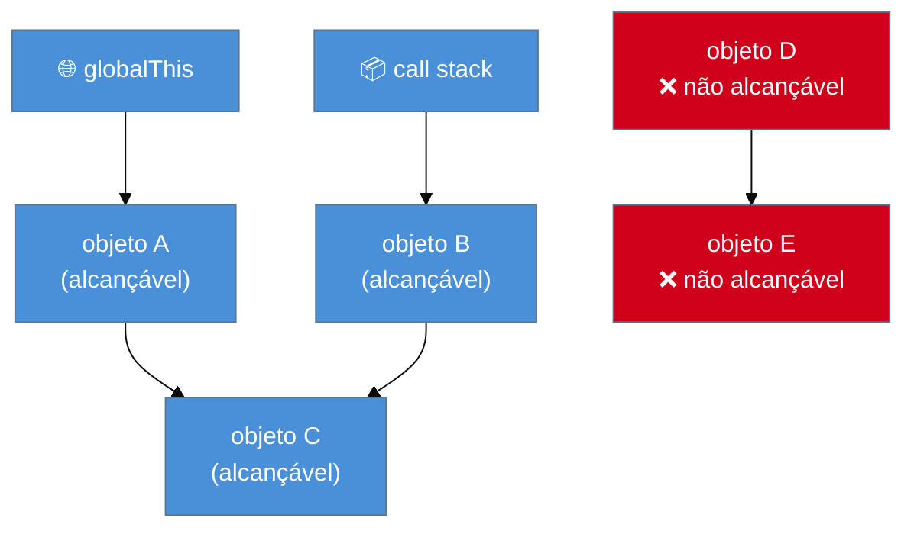
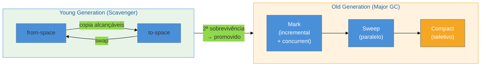

# Memory management

> [!abstract] TL;DR
> JavaScript gerencia memória automaticamente: você aloca, o GC libera. O motor V8 usa um coletor geracional (Orinoco) que separa objetos jovens de velhos e coleta cada grupo com estratégias diferentes — Scavenger rápido para o young generation, Mark-Sweep-Compact incremental/concurrent para o old generation. O problema não é o GC falhar; é você criar referências fortes que o GC não pode romper. Closures, listeners e caches crescendo sem bounds são os culpados clássicos. WeakMap/WeakSet/WeakRef existem exatamente para quebrar essas referências sem abrir mão da funcionalidade — mas WeakRef e FinalizationRegistry têm semântica quase-não-garantida e devem ser usados com cautela máxima.

---

Imagine que você abre um dashboard de monitoramento em produção. Após dois dias sem reiniciar, o processo Node está consumindo 4 GB de RAM — e subindo. O código parece correto. Não há loops infinitos visíveis. Os dados chegam, são processados, a resposta é enviada.

O que está acontecendo?

A resposta quase sempre envolve o mesmo trio: uma referência forte que você não percebeu, um callback registrado que nunca foi removido, ou um cache que cresceu sem bound. O GC está funcionando perfeitamente — ele só não consegue coletar o que você está segurando.

Este capítulo explica como o JS gerencia memória, como o GC decide o que coletar, e como você — inadvertidamente — pode impedi-lo de fazer seu trabalho.

---

## Como a memória é organizada

### Stack e heap

Quando uma função é chamada, o JS aloca um **stack frame**: espaço para os valores primitivos locais (números, booleans, referências de ponteiro). O stack é rápido, gerenciado automaticamente e liberado quando a função retorna.

Tudo que não cabe no stack vai para o **heap**: objetos, arrays, strings longas, funções, closures. O heap é uma região de memória não ordenada. Alocar no heap é mais caro; liberar exige o GC.

```
Chamada de função
┌─────────────┐      Heap
│   Stack     │  ┌────────────────────────┐
│             │  │  { id: 1, data: [...] }│ ←── obj
│  x = 42    │  │  [1, 2, 3, 4, 5]       │ ←── arr
│  obj = ●───┼──►  <closure env>          │ ←── fn
│  arr = ●───┼──►                        │
└─────────────┘  └────────────────────────┘
```

Valores primitivos pequenos (number, boolean, null, undefined) vivem no stack. Strings e objetos vivem no heap — mesmo quando você escreve `const s = "hello"`, o conteúdo da string está no heap; o stack guarda só o ponteiro.

### Alocação automática

Em C, você chama `malloc` e depois `free`. Em JavaScript, a alocação acontece automaticamente na maioria das operações:

```js
// Cada linha dessas aloca no heap
const obj = { name: "Alice" };  // objeto literal
const arr = [1, 2, 3];          // array
const fn = () => obj.name;      // closure (captura ref para obj)
const s = `Hello, ${obj.name}`; // string resultante
```

Você não escolhe quando liberar. Quem decide é o **Garbage Collector**.

---

## Mark-and-sweep: a lógica do GC

O GC precisa responder a uma pergunta: "quais objetos no heap ainda são necessários?"

A resposta usa o conceito de **reachability** (alcançabilidade). Um objeto é alcançável se existe algum caminho de referência que parte de um **root** e chega até ele. Roots são:

- Variáveis globais (`window`, `globalThis`, variáveis no escopo global)
- A call stack atual (variáveis locais de funções em execução)
- Referências em closures ativas
- Referências nos registros internos do motor (inline caches, por exemplo)

O algoritmo mark-and-sweep funciona em duas fases:

**Mark (marcação):** o GC parte dos roots, percorre o grafo de referências, e marca tudo que consegue alcançar.

**Sweep (varredura):** percorre o heap e libera qualquer objeto **não marcado** — ninguém tem referência para ele, portanto não pode ser usado.



D e E formam um ciclo entre si, mas nenhum root aponta para eles — logo, são coletados. Isso resolve o problema clássico de "referência circular", que algoritmos de contagem de referência (reference counting) não conseguem resolver.

> [!question]- E se dois objetos apontam um para o outro mas ninguém mais aponta para eles?
> Referências circulares não protegem objetos da coleta — o que importa é **alcançabilidade a partir dos roots**. Se o ciclo A→B→A não tem nenhum root apontando para ele, ambos são coletados. Isso é exatamente por que o JS usa mark-and-sweep e não contagem de referência pura.

**Memory management em uma frase:** o GC libera o que não é alcançável a partir dos roots — e seu trabalho como desenvolvedor é não criar referências fortes desnecessárias.

---

## V8 e o coletor Orinoco

V8 (motor do Node.js e do Chrome) não usa um GC simples e único. O projeto **Orinoco** introduziu um pipeline geracional com múltiplas estratégias rodando em paralelo e de forma concurrent.

### Hipótese geracional

A observação empírica que guia o design: **a maioria dos objetos morre jovem**. Um objeto temporário criado dentro de um handler de requisição provavelmente não sobrevive mais que alguns milissegundos. Um objeto de configuração criado no startup pode viver horas.

O V8 separa o heap em duas regiões:

| Geração | Também chamada | Tamanho típico | Estratégia |
|---------|---------------|----------------|------------|
| **Young** | New Space / Nursery | ~1–8 MB | Scavenger (cópia) |
| **Old** | Old Space | ~128 MB–1.4 GB+ | Mark-Sweep-Compact |

### Young generation — Scavenger

O Scavenger usa um algoritmo de **cópia semiespelho** (Cheney's algorithm). O new space é dividido em dois semiespaços: `from-space` e `to-space`. Na coleta:

1. Objetos alcançáveis no `from-space` são **copiados** para o `to-space` (compactação implícita)
2. `from-space` inteiro é liberado de uma vez
3. Os espaços são trocados

Objetos que sobrevivem a duas rodadas de Scavenger são **promovidos** para o old generation. O Scavenger moderno do V8 (Orinoco Parallel Scavenger) distribui o trabalho de cópia entre múltiplas threads helper — reduzindo a pausa do main thread drasticamente.

### Old generation — Major GC

O old generation usa **Mark-Sweep-Compact**, que opera em três subetapas:

1. **Marking (marcação):** percorre o grafo de referências a partir dos roots. A partir do V8 Orinoco, a marcação é **incremental** (intercalada com execução JS em pequenas fatias) e **concurrent** (worker threads marcam em background enquanto o main thread executa JavaScript).

2. **Sweeping (varredura):** percorre as páginas do heap e libera memória dos objetos não marcados. Pode ser paralelo.

3. **Compacting (compactação):** move objetos sobreviventes para eliminar fragmentação. Apenas em páginas com alta fragmentação — é o passo mais caro.



> [!info] Concurrent vs Incremental
> **Incremental:** o GC divide o trabalho em fatias pequenas, intercalando com JS. Elimina pausas longas, mas não elimina todas as pausas. **Concurrent:** worker threads do GC trabalham em paralelo com o main thread — zero pausa no main thread para essa fase. O V8 usa ambas as técnicas no Major GC.

### Atualizações recentes (2025)

O blog do engenheiro Andy Wingo (wingolog, novembro 2025) documenta experimentos recentes no V8: o time tentou um "mark-sweep nursery" (em vez de Scavenger por cópia) e "sticky mark-bit" generational collection, mas ambos se mostraram menos eficazes que o Scavenger atual. O V8 adicionou suporte a **pinning** no Scavenger para páginas com referências ambíguas — relevante para integrações com WebAssembly. A direção geral segue sendo reduzir pausas e melhorar o throughput concurrent.

---

## O que torna algo alcançável na prática

Entender roots concretos evita surpresas. Em JavaScript no browser/Node:

```js
// Root 1: variável global
window.cache = [];  // 'cache' é um root — nunca coletado enquanto window viver

// Root 2: variável local em função em execução
function process(data) {
  const result = transform(data);  // 'result' é root enquanto process() executa
  return result;
}  // ao retornar, result perde o root → elegível para coleta

// Root 3: closure — ATENÇÃO
function createHandler() {
  const bigData = new Array(1_000_000).fill(0);  // aloca ~8 MB
  return function handler() {
    return bigData[0];  // closure captura bigData inteiro
  };
}
const h = createHandler();  // h → handler → bigData: bigData não é coletado
```

A closure `handler` mantém `bigData` vivo enquanto `h` existir — mesmo que você só use `bigData[0]`.

---

## Vazamentos comuns em JavaScript

### 1. Globais acidentais

```js
function init() {
  config = { apiKey: "..." };  // sem let/const/var — vira global!
}
```

`config` agora vive em `window.config` (browser) ou `global.config` (Node). Nunca é coletado enquanto o processo viver.

### 2. Timers e listeners não removidos

```js
// Problema
class Modal {
  constructor() {
    this.data = new Array(100_000).fill(0);  // 800 KB
    window.addEventListener("resize", this.onResize.bind(this));
  }
  close() {
    this.el.remove();  // remove do DOM, mas...
    // ❌ esqueceu: window.removeEventListener("resize", ...)
  }
}

// Correção
class Modal {
  constructor() {
    this.data = new Array(100_000).fill(0);
    this._onResize = this.onResize.bind(this);
    window.addEventListener("resize", this._onResize);
  }
  close() {
    this.el.remove();
    window.removeEventListener("resize", this._onResize);  // ✅
  }
}
```

`window` é um root permanente. Qualquer objeto referenciado por um listener em `window` não é coletado enquanto o listener existir.

### 3. Closures que retêm escopo maior que o necessário

```js
// Problema sutil: ambas as funções compartilham o mesmo escopo léxico
function setup() {
  const bigBuffer = new Uint8Array(10_000_000);  // 10 MB
  const smallValue = 42;

  const useful = () => smallValue;   // só usa smallValue
  const leak = () => bigBuffer[0];   // usa bigBuffer

  return useful;  // retorna só 'useful', mas...
}
// 'useful' e 'leak' compartilham o closure environment
// bigBuffer fica vivo porque leak (mesmo não retornado) está no mesmo scope
const fn = setup();
```

Este é um bug documentado em motores JS: se duas closures compartilham o mesmo ambiente léxico, **qualquer** variável capturada por qualquer uma delas fica viva enquanto qualquer closure do grupo estiver viva. O workaround é separar os escopos.

### 4. Caches sem bound

```js
// Problema: Map cresce indefinidamente
const responseCache = new Map();
app.get("/user/:id", (req, res) => {
  const { id } = req.params;
  if (!responseCache.has(id)) {
    responseCache.set(id, fetchUser(id));  // nunca removido
  }
  res.json(await responseCache.get(id));
});
```

Cada novo `id` adiciona uma entrada ao Map que nunca é removida. Em aplicações com alto volume de usuários distintos, isso esgota a memória linearmente.

### 5. Detached DOM nodes

```js
const detached = [];
function removeElement() {
  const el = document.querySelector(".big-table");
  detached.push(el);   // ← referência forte guardada
  el.remove();         // remove do DOM, mas a ref mantém o nó vivo
}
```

O nó foi removido do DOM tree, mas ainda é alcançável via `detached`. O GC não pode coletar o nó — nem seus filhos, que podem ser centenas de elementos.

> [!warning] Global acidental
> **O que acontece:** memória cresce indefinidamente; o objeto nunca é coletado.
> **Por quê:** variáveis sem declaração (sem `let`/`const`/`var`) são atribuídas ao objeto global, que é um root permanente.
> **Como evitar:** use `"use strict"` (lança ReferenceError) ou sempre declare variáveis. ESLint regra `no-undef`.

> [!warning] Listener esquecido (SPA leak clássico)
> **O que acontece:** a memória de componentes destruídos nunca é liberada; o processo vai crescendo em cada navegação.
> **Por quê:** o listener mantém uma referência forte ao componente via `this` ou closure — o componente é alcançável a partir do root `window`.
> **Como evitar:** frameworks modernos expõem lifecycle hooks (`onUnmounted`, `useEffect` cleanup, `ngOnDestroy`) — **sempre** remova listeners nesses hooks.

> [!warning] Cache Map crescendo sem bound
> **O que acontece:** uso de memória cresce linearmente com o volume de dados distintos processados.
> **Por quê:** Map usa referências fortes para chaves e valores; sem remoção explícita, nada é coletado.
> **Como evitar:** use LRU cache com tamanho máximo, TTL explícito, ou WeakMap quando as chaves são objetos (não strings).

> [!warning] Closure com escopo compartilhado
> **O que acontece:** um objeto grande fica na memória mesmo que você só use uma função que não precisa dele.
> **Por quê:** closures no mesmo escopo léxico compartilham o mesmo closure environment — se qualquer uma retém uma variável grande, toda o ambiente fica vivo.
> **Como evitar:** isole closures que precisam de dados grandes em funções IIFE separadas; não misture closures "leves" e "pesadas" no mesmo escopo.

---

## WeakMap, WeakSet, WeakRef e FinalizationRegistry

Às vezes você quer associar dados a um objeto sem impedir que ele seja coletado. Para isso existem as **weak collections**.

### WeakMap e WeakSet

Ver detalhes em [[12 - Map, Set, WeakMap, WeakSet]]. Em resumo:

- **WeakMap:** chaves devem ser objetos. Se o objeto-chave não tiver outros referenciadores além da WeakMap, ele é coletado — e a entrada some automaticamente.
- **WeakSet:** similar, mas armazena apenas objetos (sem valor associado), útil para rastrear conjuntos de objetos sem interferir na coleta.

```js
// Metadados por objeto sem interferir no ciclo de vida
const metadata = new WeakMap();

function registerComponent(component) {
  metadata.set(component, { createdAt: Date.now(), renderCount: 0 });
}

function destroyComponent(component) {
  component.el.remove();
  // NÃO precisamos de metadata.delete(component)
  // Quando component perde suas referências fortes → é coletado
  // → a entrada na WeakMap é removida automaticamente
}
```

WeakMap é ideal para **associar metadados a objetos** (ex.: dados de ciclo de vida, caches por instância) sem criar referência forte.

### WeakRef — referência fraca explícita

`WeakRef` (ES2021) permite guardar uma referência a um objeto que não impede sua coleta. Para acessar o objeto, você chama `.deref()` — que retorna `undefined` se já foi coletado.

```js
class Cache {
  #store = new Map();

  set(key, value) {
    this.#store.set(key, new WeakRef(value));
  }

  get(key) {
    const ref = this.#store.get(key);
    if (!ref) return undefined;

    const value = ref.deref();
    if (value === undefined) {
      this.#store.delete(key);  // limpa entrada morta
      return undefined;
    }
    return value;
  }
}
```

> [!warning] WeakRef — semântica quase-não-garantida
> **O que acontece:** `.deref()` pode retornar `undefined` a qualquer momento, mesmo que você "ache" que o objeto ainda existe.
> **Por quê:** o GC pode coletar o objeto a qualquer momento após ele perder referências fortes. O tempo é não-determinístico e varia por motor, geração e pressão de memória.
> **Como evitar:** **nunca use WeakRef para lógica crítica**. Sempre trate o caso `undefined`. Prefira WeakMap quando possível — e WeakRef apenas como otimização não-essencial.

### FinalizationRegistry

Permite registrar um callback que é chamado *depois* que um objeto é coletado:

```js
const registry = new FinalizationRegistry((key) => {
  console.log(`Objeto com chave ${key} foi coletado`);
  cache.delete(key);  // cleanup do índice
});

const value = { data: "..." };
registry.register(value, "minha-chave");
```

> [!warning] FinalizationRegistry — não para lógica crítica
> **O que acontece:** o callback pode demorar segundos, minutos, horas para ser chamado — ou nunca ser chamado em engines que o permitem.
> **Por quê:** a spec JavaScript garante apenas que o callback *pode* ser chamado; a semântica é intencionalmente vaga por questões de segurança (timing attacks via GC) e portabilidade entre engines.
> **Como evitar:** use apenas para **cleanup não-crítico** (logs, debugging, métricas). Para recursos críticos (file handles, network connections), use padrões explícitos: `try/finally`, o protocolo `Symbol.dispose` (ES2026) ou métodos `dispose()`/`close()` explícitos.

---

## Casos práticos

### Caso 1: listener leak em SPA (React/Vue sem cleanup)

**Cenário:** aplicação de dashboard com gráficos em tempo real. Cada vez que o usuário navega para a aba de gráficos, um componente se registra no evento `resize` para redimensionar o canvas. Ao navegar para fora, o componente é destruído — mas o listener permanece.

```js
// ❌ Componente com leak (pseudocódigo React)
function Chart({ data }) {
  useEffect(() => {
    const handleResize = () => redrawChart(data);
    window.addEventListener("resize", handleResize);
    // ← sem cleanup! handleResize captura data (pode ser grande)
  }, [data]);

  return <canvas ref={canvasRef} />;
}

// Cada montagem adiciona um listener.
// Após 50 navegações: 50 listeners ativos, todos retendo instâncias de data.
```

```js
// ✅ Correção
function Chart({ data }) {
  useEffect(() => {
    const handleResize = () => redrawChart(data);
    window.addEventListener("resize", handleResize);

    return () => {
      window.removeEventListener("resize", handleResize);  // cleanup na desmontagem
    };
  }, [data]);

  return <canvas ref={canvasRef} />;
}
```

**Como detectar:** no Chrome DevTools, abra a aba Memory → Heap Snapshot. Navegue para a aba e de volta várias vezes. Compare snapshots: se o número de instâncias de `handleResize` ou do objeto `data` cresce a cada navegação, confirme o leak.

---

### Caso 2: cache de API crescendo sem bound → solução com WeakMap + LRU

**Cenário:** serviço Node que processa objetos de usuário (objetos grandes, ~50 KB cada). Um cache de resultados computados é mantido em memória para evitar reprocessamento.

```js
// ❌ Map com chave string — cresce sem bound
const computedCache = new Map();

async function processUser(userId) {
  if (computedCache.has(userId)) return computedCache.get(userId);
  const user = await db.fetchUser(userId);
  const result = expensiveCompute(user);
  computedCache.set(userId, result);  // nunca removido
  return result;
}
// Após 100k usuários únicos: ~5 GB de cache na memória
```

**Solução A — WeakMap (quando a chave é um objeto):**

```js
// ✅ WeakMap: resultado vive enquanto o objeto user viver
const computedCache = new WeakMap();

async function processUser(userObj) {
  if (computedCache.has(userObj)) return computedCache.get(userObj);
  const result = expensiveCompute(userObj);
  computedCache.set(userObj, result);
  // Quando userObj perder suas referências fortes, a entrada some
  return result;
}
```

**Solução B — LRU Cache (quando a chave é string/id):**

```js
// ✅ LRU com tamanho máximo: pressão de memória controlada
import { LRUCache } from "lru-cache";

const computedCache = new LRUCache({
  max: 1000,           // máximo 1000 entradas
  ttl: 5 * 60 * 1000, // expira em 5 minutos
});

async function processUser(userId) {
  if (computedCache.has(userId)) return computedCache.get(userId);
  const result = await computeForUser(userId);
  computedCache.set(userId, result);
  return result;
}
```

Quando a chave é uma string (userId), WeakMap não é adequado (só aceita objetos). LRU com bound explícito é a solução correta.

---

## Como diagnosticar vazamentos

O diagnóstico de memory leaks segue uma sequência simples no Chrome DevTools (ou no Node com `--inspect`):

**1. Heap Snapshot:** captura um retrato instantâneo de todos os objetos no heap, com seus tamanhos e referências. Para encontrar leaks, compare dois snapshots (antes e depois de uma operação que deveria ser neutra em memória).

**2. Shallow size vs Retained size:** `shallow size` é a memória do objeto em si. `retained size` é a memória do objeto mais tudo que seria liberado se ele fosse coletado. Um objeto com shallow size de 64 bytes mas retained size de 20 MB está segurando muita coisa.

**3. "Detached" filter:** no heap snapshot, filtre por "Detached" para encontrar nós DOM que foram removidos do DOM tree mas ainda têm referência JS — o sinal clássico de detached node leak.

**4. Timeline (Allocation instrumentation):** grava alocações em tempo real. Útil para identificar quais chamadas de função estão alocando objetos que nunca são liberados.

> [!example] Fluxo de diagnóstico
> 1. Abra DevTools → Memory
> 2. Realize a ação suspeita uma vez (navegação, ciclo de vida do componente)
> 3. Force GC (botão de lixeira no DevTools)
> 4. Tire Heap Snapshot 1
> 5. Repita a ação N vezes
> 6. Force GC novamente
> 7. Tire Heap Snapshot 2
> 8. No Snapshot 2, selecione "Comparison" → observe o que cresceu entre os dois

No Node.js, você pode usar `--expose-gc` + `process.memoryUsage()` para inspecionar o heap programaticamente, ou usar o módulo `v8.writeHeapSnapshot()` para gerar um arquivo `.heapsnapshot` analisável no Chrome.

> [!tip] Vídeo: Memory Leaks in JavaScript — jsday 2025
> **[Memory Leaks in JavaScript | Daniel Danielecki | jsday 2025](https://www.youtube.com/watch?v=R16Ra3zAeBk)** (YouTube, ~40 min)
> Palestra de conferência que percorre todo o fluxo prático: identificação com MemLab (ferramenta open-source do Meta para detecção automática de leaks), heap snapshots no Chrome DevTools, e padrões de vazamento em React/Node. Complemento direto ao fluxo de diagnóstico descrito acima — boa para ver o processo ao vivo antes de aplicar no seu próprio código.

---

## Fundamento teórico: por que GC geracional funciona

A hipótese geracional se apoia em dados empíricos coletados em décadas de análise de programas reais: **90%+ dos objetos morrem dentro de uma ou duas coletas do young generation**. Ao focar a coleta mais frequente onde a maioria das mortes ocorre, o GC amortiza o custo:

- Scavenger no young gen: muito frequente (a cada poucos MB de alocação), mas muito rápido (~1–5 ms)
- Major GC no old gen: pouco frequente (heap cheio), mais caro, mas acontece raramente

Isso explica por que o V8 investe tanto em tornar o Scavenger paralelo e o Major GC concurrent: as pausas do Major GC são raras mas longas; concurrent marking elimina a maior parte desse custo do main thread.

A analogia: pense no young gen como sua mesa de trabalho (bagunça de trabalho em andamento, limpa com frequência) e o old gen como um armário (organizado com menos frequência, mas o conteúdo fica por mais tempo).

---

## Como explicar em inglês

When asked about JavaScript memory management in an interview, frame it around reachability: "The GC uses mark-and-sweep — it traverses the object graph from roots like globals and the call stack, marks everything reachable, then sweeps unreachable objects. V8 uses a generational collector called Orinoco: short-lived objects go into the young generation and are collected by a fast Scavenger; objects that survive multiple collections are promoted to the old generation, which uses incremental and concurrent mark-sweep-compact."

For leaks: "The most common leaks I've seen in production are forgotten event listeners holding component references, caches backed by plain Maps that grow without bounds, and closures capturing larger scopes than intended. The fix is usually explicit cleanup in lifecycle hooks and switching unbounded Maps to LRU caches or WeakMaps when the keys are objects."

| PT | EN |
|----|-----|
| Coleta de lixo | Garbage collection |
| Alcançabilidade | Reachability |
| Raízes do GC | GC roots |
| Geração jovem | Young generation |
| Geração velha | Old generation |
| Varredura | Scavenge / Sweep |
| Marcação | Marking |
| Compactação | Compaction |
| Vazamento de memória | Memory leak |
| Nó DOM desanexado | Detached DOM node |
| Referência fraca | Weak reference |
| Tamanho retido | Retained size |
| Tamanho superficial | Shallow size |
| Marcação incremental | Incremental marking |
| Marcação concurrent | Concurrent marking |

---

## O que vem a seguir

Você agora entende como o GC decide o que liberar e quais padrões criam referências fortes indesejadas. O próximo passo natural é entender os mecanismos de performance além da memória: como o V8 compila JS com JIT, como otimiza funções hot paths com Turbofan, e como o event loop interage com a alocação de memória em contextos de alta concorrência.

Internamente ao vault:

- [[10 - Closures]] — closures são o vetor mais frequente de retenção acidental; entenda o modelo de escopo léxico por completo
- [[12 - Map, Set, WeakMap, WeakSet]] — detalhe completo de WeakMap e WeakSet, incluindo casos de uso e limitações
- [[19 - Modelo de execução a fundo]] — como o event loop, microtask queue e call stack interagem com o ciclo de vida do GC; entender o modelo de execução é pré-requisito para raciocinar sobre quando objetos tornam-se inacessíveis
- [[03-Dominios/Tecnologia/Node/Runtime e Event Loop/index|Node — Runtime e Event Loop]] — como o event loop, o V8 heap e o libuv thread pool interagem no contexto do Node.js
- [[Dicionário de JavaScript]] — glossário de termos do ecossistema JS

---

## Referências

- **V8 Team** — [*Trash talk: the Orinoco garbage collector*](https://v8.dev/blog/trash-talk) — artigo oficial do blog V8 explicando a arquitetura completa do Orinoco
- **V8 Team** — [*Orinoco: young generation garbage collection*](https://v8.dev/blog/orinoco-parallel-scavenger) — detalhe do Parallel Scavenger e o modelo de cópia semiespelho
- **Andy Wingo** — [*the last couple years in v8's garbage collector*](https://wingolog.org/archives/2025/11/13/the-last-couple-years-in-v8s-garbage-collector) — atualização de novembro 2025 sobre experimentos recentes no GC do V8 (sticky mark-bit, pinning, nursery mark-sweep)
- **MDN Web Docs** — [*Memory management*](https://developer.mozilla.org/en-US/docs/Web/JavaScript/Guide/Memory_management) — referência canônica, inclui WeakRef e FinalizationRegistry com caveats
- **MDN Web Docs** — [*WeakRef*](https://developer.mozilla.org/en-US/docs/Web/JavaScript/Reference/Global_Objects/WeakRef) — spec e advertências sobre não-determinismo
- **javascript.info** — [*WeakRef and FinalizationRegistry*](https://javascript.info/weakref-finalizationregistry) — exemplos práticos e discussão dos edge cases
- **Leapcell** — [*Understanding JavaScript's Memory Management — A Deep Dive into V8's Garbage Collection with Orinoco*](https://leapcell.io/blog/understanding-javascript-s-memory-management-a-deep-dive-into-v8-s-garbage-collection-with-orinoco) — síntese acessível do pipeline Orinoco
