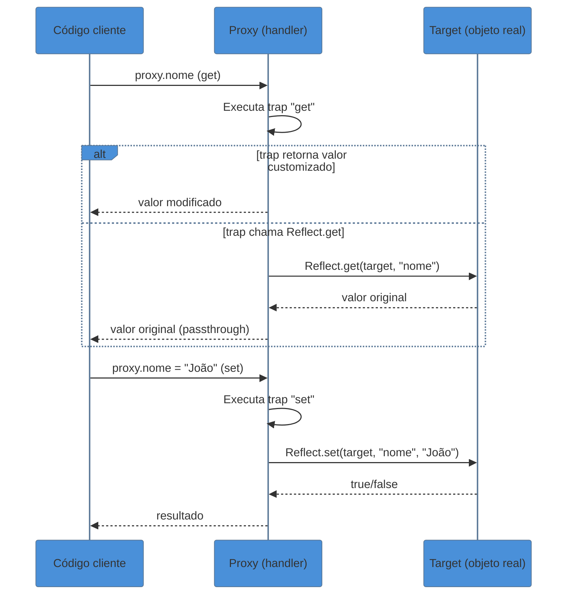

# Metaprogramação

> [!abstract] TL;DR
> Metaprogramação é escrever código que modifica ou observa o comportamento do próprio código — sem alterar a lógica de negócio em si. Em JavaScript, três ferramentas formam o núcleo: **Symbol** (chaves primitivas únicas que personalizam protocolos da linguagem), **Proxy** (intercepta operações fundamentais sobre objetos) e **Reflect** (API espelho que permite repassar o comportamento padrão de dentro de um trap). Juntos, permitem construir sistemas reativos, validação automática e abstrações que parecem nativas. O custo: Proxy tem overhead de 5–20% em hot paths e viola invariantes de forma silenciosa se mal usado — use com parcimônia.

---

Imagine que você quer que um objeto comum "avise" toda vez que uma propriedade for lida ou escrita — sem instalar um getter manualmente em cada campo, sem uma classe base, sem bibliotecas. Agora imagine que quer criar um array que aceita índices negativos como Python, ou que uma classe personalize o que `instanceof` significa para ela.

Nenhum desses comportamentos é possível com o JavaScript comum. Você precisaria hackear protótipos ou usar abstrações que escondem os objetos reais por trás de wrappers opacos.

É exatamente aqui que entra a metaprogramação. Não é mágica — é um conjunto de ganchos que o motor do JavaScript expõe para que você "intercepte" operações fundamentais da linguagem.

---

## Symbol — chaves que não colidem

Toda linguagem precisa de um jeito de estender objetos sem quebrar o que já existe. O problema com strings como chaves é óbvio: se você adicionar `obj.type = "mine"` e alguma biblioteca já usar `type`, há colisão. Symbol resolve isso na raiz.

```javascript
const id = Symbol("id"); // "id" é só um rótulo de debug, não o valor
const outroId = Symbol("id");

id === outroId; // false — cada Symbol é único, sempre
```

Symbols não aparecem em `Object.keys()`, `for...in` ou `JSON.stringify()`. Eles são invisíveis para o código que não sabe que existem — o mecanismo ideal para metadados internos.

### Symbol.for e o registry global

```javascript
const A = Symbol.for("app.token");
const B = Symbol.for("app.token");
A === B; // true — registry global por string-chave
```

`Symbol.for` cria um Symbol no **registry global** compartilhado entre módulos (e mesmo entre iframes). Use quando precisar de um symbol reconhecível por múltiplos módulos independentes. Use `Symbol()` local quando quiser garantia de unicidade absoluta.

### Well-known Symbols — protocolos da linguagem

Os well-known symbols são a maneira pela qual o JavaScript permite que **objetos customizados participem de protocolos nativos** — iteração, coerção, verificação de tipo — sem que o motor precise saber de antemão o que são esses objetos.

Pense neles como interfaces implícitas: se o seu objeto implementa `[Symbol.iterator]`, ele é iterável. Se implementa `[Symbol.toPrimitive]`, ele sabe como se converter em número ou string.

| Symbol | Protocolo interceptado | Gatilho típico |
|---|---|---|
| `Symbol.iterator` | Iteração | `for...of`, spread, destructuring |
| `Symbol.asyncIterator` | Iteração assíncrona | `for await...of` |
| `Symbol.toPrimitive` | Coerção de tipo | `+obj`, `${obj}`, comparações |
| `Symbol.hasInstance` | Verificação de instância | `x instanceof MinhaClasse` |
| `Symbol.toStringTag` | Tag de tipo | `Object.prototype.toString.call(obj)` |

#### Symbol.iterator — objeto customizado iterável

```javascript
class Range {
  constructor(start, end) {
    this.start = start;
    this.end = end;
  }

  [Symbol.iterator]() {
    let current = this.start;
    const end = this.end;
    return {
      next() {
        return current <= end
          ? { value: current++, done: false }
          : { value: undefined, done: true };
      }
    };
  }
}

for (const n of new Range(1, 5)) {
  console.log(n); // 1 2 3 4 5
}

const arr = [...new Range(10, 12)]; // [10, 11, 12]
```

O `for...of` simplesmente chama `[Symbol.iterator]()` no objeto. Se o método existe, ele funciona — sem herança obrigatória, sem registro em nenhum lugar. Veja a ligação com iteradores em [[16 - Iterators e generators]].

#### Symbol.toPrimitive — controle fino sobre coerção

```javascript
class Dinheiro {
  constructor(valor, moeda) {
    this.valor = valor;
    this.moeda = moeda;
  }

  [Symbol.toPrimitive](hint) {
    if (hint === "string") return `${this.valor} ${this.moeda}`;
    if (hint === "number") return this.valor;
    return this.valor; // hint === "default"
  }
}

const preco = new Dinheiro(42.5, "BRL");
console.log(`Preço: ${preco}`);   // "Preço: 42.5 BRL" (hint: "string")
console.log(preco + 10);          // 52.5 (hint: "default" → number)
console.log(+preco);              // 42.5 (hint: "number")
```

Sem `Symbol.toPrimitive`, `preco + 10` produziria `"[object Object]10"` — o resultado padrão de coerção. O symbol permite que o objeto decida. Para entender por que o motor escolhe cada hint, veja [[03 - Coerção e igualdade]].

#### Symbol.hasInstance e Symbol.toStringTag

```javascript
class TipoEspecial {
  static [Symbol.hasInstance](obj) {
    return Array.isArray(obj) && obj.length > 0;
  }
}

[] instanceof TipoEspecial;      // false (array vazio)
[1, 2] instanceof TipoEspecial;  // true

// Symbol.toStringTag
class MinhaColecao {
  get [Symbol.toStringTag]() {
    return "MinhaColecao";
  }
}
Object.prototype.toString.call(new MinhaColecao()); // "[object MinhaColecao]"
```

`Symbol.toStringTag` é especialmente útil quando você precisa de type-checking robusto que não depende de `instanceof` (que falha entre realms/iframes diferentes).

---

> [!tip] Vídeo — Proxy e Reflect em ação
> **Fireship** — [JavaScript Proxy in 100 Seconds](https://www.youtube.com/watch?v=kT1J6P5IJss) — visão relâmpago de Proxy + casos de uso em menos de 2 minutos. Ideal para ancorar o mental model antes de mergulhar nos traps.
>
> **Akshay Saini (Namaste JavaScript)** — [Proxy & Reflect in JavaScript](https://www.youtube.com/watch?v=eNsJCq3WUTM) — deep dive de ~30 min que cobre todos os traps principais, o papel do Reflect como parceiro obrigatório e o exemplo de objeto reativo do zero. Segue a mesma lógica da seção de reatividade desta nota.
>
> **Web Dev Simplified** — [JavaScript Proxy](https://www.youtube.com/watch?v=SYwR8DQALMc) — foco em casos práticos: validação, logging, índices negativos e a armadilha do loop infinito sem Reflect. Recomendado após ler os exemplos de código abaixo.

## Proxy — interceptando operações fundamentais

Um Proxy é literalmente um intermediário entre o código que acessa um objeto e o objeto em si. Quando você faz `proxy.nome`, o motor não vai direto ao objeto — passa pelo **handler** primeiro.



### Os traps principais

| Trap | Quando é chamado | Assinatura |
|---|---|---|
| `get` | Leitura de propriedade | `(target, prop, receiver)` |
| `set` | Escrita de propriedade | `(target, prop, value, receiver)` |
| `has` | Operador `in` | `(target, prop)` |
| `deleteProperty` | `delete obj.prop` | `(target, prop)` |
| `apply` | Chamada de função | `(target, thisArg, args)` |
| `construct` | Operador `new` | `(target, args, newTarget)` |
| `ownKeys` | `Object.keys()`, `Object.getOwnPropertyNames()` | `(target)` |
| `getPrototypeOf` | `Object.getPrototypeOf()`, `instanceof` | `(target)` |

```javascript
const handler = {
  get(target, prop, receiver) {
    console.log(`Lendo: ${prop}`);
    return Reflect.get(target, prop, receiver);
  },

  set(target, prop, value, receiver) {
    console.log(`Escrevendo: ${prop} = ${value}`);
    return Reflect.set(target, prop, value, receiver);
  }
};

const obj = new Proxy({ nome: "Alice" }, handler);
obj.nome;         // log: "Lendo: nome" → "Alice"
obj.nome = "Bob"; // log: "Escrevendo: nome = Bob"
```

### Índices negativos em arrays

Um caso elegante: fazer arrays aceitarem índices negativos como Python (onde `arr[-1]` é o último elemento).

```javascript
function criarArrayNegativo(arr) {
  return new Proxy(arr, {
    get(target, prop, receiver) {
      const indice = Number(prop);
      // Se for índice numérico negativo, mapeia do final
      if (!isNaN(indice) && indice < 0) {
        return Reflect.get(target, target.length + indice, receiver);
      }
      return Reflect.get(target, prop, receiver);
    }
  });
}

const nums = criarArrayNegativo([10, 20, 30, 40]);
nums[-1]; // 40
nums[-2]; // 30
nums[0];  // 10
nums.length; // 4 — funciona normalmente
```

A chave: o trap `get` intercepta *qualquer* propriedade — inclusive `"length"`, `"push"`, `"map"`. A guarda `!isNaN(indice) && indice < 0` garante que só índices numéricos negativos recebem tratamento especial; tudo o mais passa via `Reflect.get`.

### Trap apply — interceptando chamadas de função

```javascript
function soma(a, b) { return a + b; }

const somaComLog = new Proxy(soma, {
  apply(target, thisArg, args) {
    console.log(`Chamando soma(${args.join(", ")})`);
    const resultado = Reflect.apply(target, thisArg, args);
    console.log(`Resultado: ${resultado}`);
    return resultado;
  }
});

somaComLog(3, 4); // log: "Chamando soma(3, 4)" → "Resultado: 7" → 7
```

---

## Reflect — o parceiro obrigatório do Proxy

Reflect existe por uma razão específica: **dentro de um trap, você precisa de um jeito de executar a operação padrão sobre o target sem acidentalmente chamar o proxy de novo**.

Sem Reflect, o código dentro do trap `get` teria que fazer `target[prop]` — o que funciona na maioria dos casos, mas falha quando há herança de protótipos envolvida (o `receiver` — `this` correto — se perde).

```javascript
// Perigoso: perde o receiver correto em hierarquias com getters
get(target, prop) {
  return target[prop]; // ❌ receiver errado se houver getter na cadeia
}

// Correto: preserva receiver
get(target, prop, receiver) {
  return Reflect.get(target, prop, receiver); // ✅
}
```

### Por que o receiver importa?

```javascript
const pai = {
  get nome() { return this._nome; }
};

const filho = Object.create(pai);
filho._nome = "Filho";

// Sem Proxy: funciona
filho.nome; // "Filho" — this = filho, _nome correto

// Com Proxy sem receiver:
const proxy = new Proxy(filho, {
  get(target, prop) {
    return target[prop]; // this no getter = target (filho) ✓ acidentalmente ok
  }
});
```

O problema fica claro quando o `target` não é o objeto onde `_nome` foi definido. `Reflect.get(target, prop, receiver)` garante que `this` dentro do getter seja sempre o `receiver` (o proxy ou o objeto correto), não o `target`.

### Reflect.ownKeys — listar todas as chaves, inclusive Symbols

```javascript
const obj = {
  nome: "Alice",
  [Symbol("id")]: 42,
};

Object.keys(obj);         // ["nome"] — sem Symbols
Reflect.ownKeys(obj);     // ["nome", Symbol(id)] — tudo
```

---

## Proxy.revocable — Proxy com prazo de validade

Todo `new Proxy(target, handler)` é permanente: uma vez criado, o interceptador existe enquanto existir referência ao proxy. `Proxy.revocable` resolve o problema oposto — como criar um proxy que pode ser **desativado explicitamente**, tornando-se inacessível depois.

```javascript
const { proxy, revoke } = Proxy.revocable({ saldo: 1000 }, {
  get(target, prop, receiver) {
    console.log(`[auditoria] leitura: ${prop}`);
    return Reflect.get(target, prop, receiver);
  }
});

proxy.saldo; // [auditoria] leitura: saldo → 1000

revoke(); // desativa o proxy — nenhum trap é chamado após isso

proxy.saldo; // TypeError: Cannot perform 'get' on a proxy that has been revoked
```

**Quando isso importa de verdade:**

- **Tokens temporários de acesso**: um módulo recebe um proxy de um objeto sensível (configurações, dados de usuário) para uma janela de tempo. Ao encerrar a operação, o proxy é revogado — o módulo não pode mais "guardar" o acesso nem acessar o target diretamente.
- **Sandboxing de terceiros**: código de plugin recebe um proxy revocable do ambiente host. Se o plugin for descarregado, `revoke()` garante que nenhuma referência retida consiga fazer chamadas.
- **Recursos com ciclo de vida explícito**: a proposta TC39 `using` (Stage 4 no ES2026, via **Explicit Resource Management**) combina naturalmente com Proxy.revocable — o `[Symbol.dispose]` pode chamar `revoke()` ao sair do escopo.

```javascript
// ES2026 — Explicit Resource Management + Proxy.revocable
{
  await using recurso = {
    proxy: null,
    revoke: null,
    [Symbol.asyncDispose]() { this.revoke?.(); }
  };

  const { proxy, revoke } = Proxy.revocable(dadosSensiveis, handler);
  recurso.proxy = proxy;
  recurso.revoke = revoke;

  await processarDados(recurso.proxy);
} // aqui: Symbol.asyncDispose → revoke() automático ao sair do bloco
```

> [!tip] Vídeo — Proxy.revocable e resource management
> Não existe um vídeo canônico dedicado exclusivamente a Proxy.revocable, mas o contexto de Explicit Resource Management (que fecha o loop com revocable proxies) está bem coberto em:
> - **Jake Archibald / Google Chrome Developers** — [Explicit Resource Management in JavaScript](https://www.youtube.com/watch?v=yDY-0QIIL3Q) — cobre `using`, `Symbol.dispose` e o padrão de ciclo de vida explícito que torna Proxy.revocable ainda mais relevante no ES2026.

---

## Invariantes que o motor JS impõe — e quando ele lança TypeError

Proxy não é onipotente. A spec ECMAScript define **invariantes de integridade** que o motor verifica *após* o trap retornar. Se um trap violar uma invariante, o motor lança `TypeError` antes de entregar o valor ao chamador — o handler não tem como evitar isso.

As invariantes mais importantes que pegam desenvolvedores de surpresa:

### 1. Propriedade non-configurable non-writable — o trap `get` é obrigado a retornar o valor exato

```javascript
const target = {};
Object.defineProperty(target, "PI", {
  value: 3.14159,
  writable: false,
  configurable: false
});

const proxy = new Proxy(target, {
  get(t, prop) {
    return 42; // tentando mentir sobre o valor
  }
});

proxy.PI;
// TypeError: 'get' on proxy: property 'PI' is a non-configurable and
//            non-writable data property on the proxy target but the
//            proxy did not return its actual value
```

**Regra**: se a propriedade é `writable: false` E `configurable: false`, o trap `get` deve retornar exatamente o mesmo valor que `target[prop]`. O motor compara com `SameValue`.

### 2. Propriedade non-configurable — o trap `set` não pode mudar `writable` de false para true

```javascript
const target = {};
Object.defineProperty(target, "x", { value: 10, writable: false, configurable: false });

const proxy = new Proxy(target, {
  set(t, prop, value) {
    // ignora e retorna true — mentindo ao chamador
    return true;
  }
});

proxy.x = 99;
// TypeError: 'set' on proxy: trap returned truthy for property 'x'
//            which exists in the proxy target as a non-configurable
//            and non-writable data property
```

### 3. O trap `has` não pode esconder propriedades non-configurable

```javascript
const target = {};
Object.defineProperty(target, "segredo", { value: "ops", configurable: false });

const proxy = new Proxy(target, {
  has(t, prop) {
    return false; // tentando esconder
  }
});

"segredo" in proxy;
// TypeError: 'has' on proxy: trap returned falsy for property 'segredo'
//            but the proxy target is not extensible
```

### 4. O trap `deleteProperty` não pode deletar propriedade non-configurable

```javascript
Object.defineProperty(target, "eterno", { value: 1, configurable: false });

const proxy = new Proxy(target, {
  deleteProperty(t, prop) { return true; } // mentindo
});

delete proxy.eterno;
// TypeError: 'deleteProperty' on proxy: trap returned truthy
//            for property 'eterno' which is non-configurable in the proxy target
```

> [!warning] Regra prática sobre invariantes
> **Nunca use `Object.freeze()`, `Object.seal()` ou `Object.defineProperty` com `configurable: false` no mesmo objeto que serve de `target` de um Proxy que altera comportamento**. O target deve ser um objeto "neutro" que o handler pode manipular livremente. As restrições de acesso (somente leitura, etc.) devem ser impostas *pelo handler*, não pelas propriedades do target.
>
> A invariante existe por um motivo: garantir que código que inspeciona o target diretamente (via `Object.getOwnPropertyDescriptor`) veja um estado consistente com o que o proxy reporta.

---

## Casos práticos

### Caso 1 — Objeto reativo simples (estilo Vue 3)

Vue 3 trocou `Object.defineProperty` (Vue 2) por Proxy exatamente porque Proxy intercepta *qualquer* propriedade — inclusive as adicionadas depois da criação do objeto.

```javascript
function reativo(alvo) {
  // Map de propriedade → Set de efeitos que dependem dela
  const deps = new Map();

  function getDeps(prop) {
    if (!deps.has(prop)) deps.set(prop, new Set());
    return deps.get(prop);
  }

  let efeitoAtual = null;

  function efeito(fn) {
    efeitoAtual = fn;
    fn(); // roda uma vez para registrar dependências
    efeitoAtual = null;
  }

  const proxy = new Proxy(alvo, {
    get(target, prop, receiver) {
      // Rastreia: se há efeito rodando, ele depende desta prop
      if (efeitoAtual) {
        getDeps(prop).add(efeitoAtual);
      }
      return Reflect.get(target, prop, receiver);
    },

    set(target, prop, value, receiver) {
      const resultado = Reflect.set(target, prop, value, receiver);
      // Dispara todos os efeitos que dependem desta prop
      getDeps(prop).forEach(fn => fn());
      return resultado;
    }
  });

  return { proxy, efeito };
}

// Uso:
const { proxy: estado, efeito } = reativo({ contador: 0 });

efeito(() => {
  console.log(`Contador: ${estado.contador}`);
});
// → "Contador: 0" (execução inicial)

estado.contador = 1; // → "Contador: 1" (reatividade automática)
estado.contador = 5; // → "Contador: 5"
```

**O que acontece nos bastidores:**
1. `efeito(fn)` executa `fn` com `efeitoAtual = fn`.
2. Durante a execução, `estado.contador` é lido — o trap `get` registra `fn` como dependente de `"contador"`.
3. Quando `estado.contador = 1` é atribuído, o trap `set` encontra todos os efeitos dependentes e re-executa.

Essa é exatamente a estrutura de `reactive()` do Vue 3, simplificada. O sistema real adiciona lazy evaluation, evita loops infinitos e suporta objetos aninhados.

### Caso 2 — Validação de schema com Proxy

```javascript
function comValidacao(alvo, schema) {
  return new Proxy(alvo, {
    set(target, prop, value, receiver) {
      if (prop in schema) {
        const { tipo, obrigatorio, min, max } = schema[prop];

        if (tipo && typeof value !== tipo) {
          throw new TypeError(
            `${prop} deve ser ${tipo}, recebeu ${typeof value}`
          );
        }
        if (typeof value === "number") {
          if (min !== undefined && value < min)
            throw new RangeError(`${prop} deve ser >= ${min}`);
          if (max !== undefined && value > max)
            throw new RangeError(`${prop} deve ser <= ${max}`);
        }
        if (obrigatorio && (value === null || value === undefined)) {
          throw new Error(`${prop} é obrigatório`);
        }
      }
      return Reflect.set(target, prop, value, receiver);
    }
  });
}

const usuario = comValidacao({}, {
  nome:  { tipo: "string", obrigatorio: true },
  idade: { tipo: "number", min: 0, max: 150 },
  email: { tipo: "string" },
});

usuario.nome = "Alice";   // ✓
usuario.idade = 30;       // ✓
usuario.idade = -5;       // RangeError: idade deve ser >= 0
usuario.nome = 123;       // TypeError: nome deve ser string
```

**Por que não usar uma função `setUsuario()` em vez de Proxy?** Porque com Proxy, a validação funciona independente de quem escreve no objeto — código legado, bibliotecas de terceiros, desestruturação. O contrato é aplicado na camada mais baixa possível.

---

## Trade-offs sênior

### Quando metaprogramação ajuda

- **Frameworks reativos**: rastreamento de dependências genérico sem decorators em cada propriedade (Vue 3, MobX 6+).
- **Validação declarativa**: schema aplicado automaticamente sem repetição de chamadas.
- **Debugging e observabilidade**: logging de acesso a objetos em desenvolvimento sem alterar código de produção.
- **APIs ergonômicas**: índices negativos, defaults automáticos, propriedades "virtuais" que computam sob demanda.

### Quando não usar

- **Hot paths de performance**: o overhead de trap invocation (5–20% conforme benchmark V8/SpiderMonkey) é mensurável em loops com milhões de iterações.
- **Código que precisa de serialização trivial**: `JSON.stringify` não vê Symbols, e Proxy torna o objeto opaco para muitas ferramentas de inspeção.
- **Invariantes complexas**: um trap `set` que viola invariantes de objetos não-extensíveis lança `TypeError` silenciosamente em produção se não for testado com cuidado.
- **Quando uma classe simples resolve**: antes de Proxy, pergunte se `get`/`set` accessor em uma classe não é mais legível e 10x mais rápido.

> [!question]- Por que Proxy é mais lento do que acesso direto?
> O motor JS não pode otimizar acesso a propriedades de Proxy com JIT da mesma forma que faz com objetos comuns — porque o trap pode retornar qualquer coisa. O V8 trata Proxies como "megamórficos" para fins de otimização de acesso a propriedades.

---

## Armadilhas comuns

> [!warning] Invariantes de objetos selados
> **O que acontece:** `TypeError: 'get' on proxy: property 'x' is a read-only and non-configurable...` **Por quê:** Se o target tem uma propriedade non-configurable non-writable, o trap `get` é obrigado a retornar exatamente o mesmo valor — o motor verifica e lança TypeError se violar. **Como evitar:** Nunca use `Object.freeze()` ou `Object.seal()` no target de um Proxy que modifica propriedades. Use um objeto intermediário simples como target e aplique as restrições no handler.

> [!warning] Proxy não é o target — identity e WeakMap
> **O que acontece:** `mapa.get(proxy) !== mapa.get(target)` — o Proxy e o objeto original são identidades distintas. **Por quê:** `proxy === target` é `false`. Se você armazena o objeto original em um Map e depois recebe o Proxy, o lookup falha. **Como evitar:** Armazene o Proxy (não o target) em estruturas de dados, ou mantenha um WeakMap de `proxy → target` para conversão bidirecional.

> [!warning] Loops infinitos no trap set
> **O que acontece:** Stack overflow — o trap `set` chama `target[prop] = value` em vez de `Reflect.set`. **Por quê:** Se o target também for um Proxy (ou o handler chama o setter do próprio proxy), você entra em recursão. **Como evitar:** Sempre use `Reflect.set(target, prop, value, receiver)` dentro do trap — nunca `target[prop] = value` diretamente quando o target pode ser reatribuído.

> [!warning] Symbol.toPrimitive ignorado em JSON.stringify
> **O que acontece:** `Symbol.toPrimitive` não é chamado por `JSON.stringify` — o objeto serializa com `{}` ou usa `toJSON()`. **Por quê:** `JSON.stringify` usa `toJSON()` e depois converte para string/número diretamente, não passando pelo protocolo `Symbol.toPrimitive`. **Como evitar:** Para serialização customizada, implemente `toJSON()`. Para coerção em expressões, use `Symbol.toPrimitive`.

---

## Como explicar em inglês

Metaprogramming in JavaScript lets your code intercept and customize fundamental language operations — reading properties, type coercion, iteration, and more. Symbols are unique primitive keys that let objects opt into built-in protocols like `for...of` or `instanceof`. Proxy wraps an object and intercepts operations through handler traps, while Reflect provides the default implementations so you can safely forward calls from inside those traps.

| PT | EN |
|---|---|
| Metaprogramação | Metaprogramming |
| Símbolo (único) | Symbol (unique) |
| Símbolo bem-conhecido | Well-known symbol |
| Proxy / handler | Proxy / handler |
| Armadilha / interceptador | Trap |
| Encaminhar operação | Forward operation |
| Objeto reativo | Reactive object |
| Invariante | Invariant |
| Receptor | Receiver |
| Registry global | Global symbol registry |

---

## O que vem a seguir

Você acabou de ver como interceptar operações fundamentais do motor JavaScript. Há dois prolongamentos naturais daqui:

- [[16 - Iterators e generators]] — `Symbol.iterator` é a ponte entre metaprogramação e protocolos de iteração; se você quiser criar objetos iteráveis complexos com estado (geradores assíncronos, pipelines lazy), é o próximo passo.
- [[03 - Coerção e igualdade]] — `Symbol.toPrimitive` controla coerção, mas para entender *quando* e *por que* o motor escolhe o hint `"number"` vs `"string"` vs `"default"`, o contexto completo de coerção é indispensável.
- [[24 - ES2026 e o futuro]] — Decorators (Stage 4 desde 2023, TC39 standardized) e Explicit Resource Management (`using` + `Symbol.dispose`) são as evoluções mais relevantes da metaprogramação no JavaScript moderno. Decorators oferecem um caminho declarativo para o que Proxy faz de forma programática; a seção de decorators em `[[24]]` explica a diferença de filosofia entre os dois modelos.

Consulte também o [[Dicionário de JavaScript]] para os termos técnicos desta nota — incluindo os verbetes Proxy, Reflect, trap, metaprogramação e Proxy.revocable.

---

## Metaprogramação em uma frase

Metaprogramação é o ato de programar *o comportamento da linguagem* em vez de programar apenas *a lógica de negócio* — Symbols definem protocolos, Proxy intercepta operações, e Reflect os repassa com segurança.

---

## Referências

- **MDN Web Docs** — [Meta programming (JavaScript Guide)](https://developer.mozilla.org/en-US/docs/Web/JavaScript/Guide/Meta_programming) — documentação canônica; atualizado em maio/2026.
- **MDN Web Docs** — [Proxy reference](https://developer.mozilla.org/en-US/docs/Web/JavaScript/Reference/Global_Objects/Proxy) — especificação completa dos traps e invariantes.
- **MDN Web Docs** — [Symbol reference](https://developer.mozilla.org/en-US/docs/Web/JavaScript/Reference/Global_Objects/Symbol) — well-known symbols e registry global.
- **Axel Rauschmayer** — [Metaprogramming with Proxies (Deep JavaScript)](https://exploringjs.com/deep-js/ch_proxies.html) — análise aprofundada de invariantes e traps avançados.
- **Dmitri Pavlutin** — [Detailed Overview of Well-known Symbols](https://dmitripavlutin.com/detailed-overview-of-well-known-symbols/) — exemplos práticos de todos os well-known symbols.
- **Vue.js** — [Reactivity in Depth](https://vuejs.org/guide/extras/reactivity-in-depth.html) — como Vue 3 usa Proxy internamente para rastreamento de dependências.
- **javascript.info** — [Proxy and Reflect](https://javascript.info/proxy) — tutorial com foco em casos de uso e armadilhas.
- **EisenbergEffect / Medium** — [The Prickly Case of JavaScript Proxies](https://eisenbergeffect.medium.com/the-prickly-case-of-javascript-proxies-b6c3833b738) — análise de performance e edge cases em produção.
- **TC39** — [Explicit Resource Management (Stage 4)](https://github.com/tc39/proposal-explicit-resource-management) — proposta aprovada para ES2026; cobre `using`, `await using`, `Symbol.dispose` e `Symbol.asyncDispose` — o padrão que fecha o ciclo de vida de `Proxy.revocable` de forma ergonômica (2026).
- **TC39** — [Decorators (Stage 4)](https://github.com/tc39/proposal-decorators) — spec final de decorators; metaprogramação declarativa em nível de classe como alternativa/complemento ao modelo programático de Proxy (ratificado ES2026).
- **V8 Blog** — [Elements Kinds in V8](https://v8.dev/blog/elements-kinds) — contexto de otimização JIT; explica por que Proxy é tratado como "megamórfico" e por que o overhead de 5–20% em hot paths é estrutural, não acidental.
