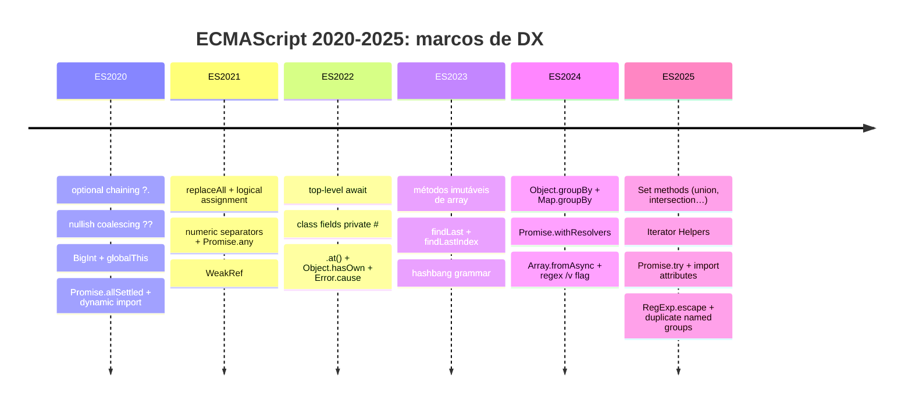

# Recursos modernos (ES2020 a ES2025)

> [!abstract] TL;DR
> De 2020 a 2025, o ECMAScript entregou recursos que eliminaram boilerplate histórico: `?.` e `??` acabaram com verificações manuais de null; top-level await e import dinâmico tornaram módulos assíncronos simples; class fields privados chegaram sem workarounds; métodos imutáveis de array (`toSorted`, `toReversed`) eliminam bugs de mutação silenciosa; e ES2025 trouxe Set methods e Iterator Helpers que tornam programação funcional ergonômica nativamente. Nenhuma dessas versões é "apenas syntax sugar" — cada uma resolve um padrão de bug recorrente ou um gap de expressividade real.

Você já escreveu `obj && obj.prop && obj.prop.sub` dezenas de vezes. Ou `val !== null && val !== undefined ? val : 'default'`. Ou copiou um array antes de ordenar porque `.sort()` muta. Cada um desses padrões de defesa existia porque o JavaScript simplesmente não tinha o operador certo — e você pagava o preço em verbosidade e em bugs sutis.

Entre ES2020 e ES2025, o TC39 fechou sistematicamente esses gaps. Este tour percorre os recursos por ano, foca no *por que* cada um importa, e aponta onde a trilha aprofunda cada tema.

> [!tip]- Assista: tour em vídeo das features ES2020–2025
> **JavaScript ES2020-ES2025 — All New Features Explained** · Academind (Maximilian Schwarzmüller) · ~25 min [▶ Assistir no YouTube](https://www.youtube.com/watch?v=c0tMZztzQEs) Percorre optional chaining, nullish coalescing, top-level await, private fields, métodos imutáveis de array e Iterator Helpers com exemplos práticos. Bom como revisão rápida antes de entrevista.
>
> **What's NEW in JavaScript 2024 & 2025** · Fireship · ~8 min [▶ Assistir no YouTube](https://www.youtube.com/watch?v=AoU6E54bDok) Cobertura rápida e densa de ES2024 (groupBy, Promise.withResolvers) e ES2025 (Set methods, Iterator Helpers, Promise.try). Estilo característico Fireship: máxima densidade em mínimo tempo.

---

## Timeline geral



---

## ES2020 — Fundação de ergonomia

### Optional chaining `?.`

Antes de `?.`, navegar propriedades opcionais era um exercício de checagem em cascata:

```js
// antes — verboso e propenso a erro
const cidade = usuario && usuario.endereco && usuario.endereco.cidade;

// depois
const cidade = usuario?.endereco?.cidade;
```

O operador curto-circuita: se o lado esquerdo for `null` ou `undefined`, retorna `undefined` sem lançar `TypeError`. Funciona em chamadas de método (`obj?.method()`) e acessos por índice (`arr?.[0]`).

> [!question]- Por que `?.` retorna `undefined` e não `null`?
> Por convenção da linguagem: ausência de valor é `undefined` em JS. Retornar `null` seria inconsistente — o operador não sabe se o valor "intencionalmente ausente" era `null` ou `undefined`, então padroniza na ausência "neutra".

Ver [[03 - Coerção e igualdade]] para o comportamento de `null`/`undefined` em comparações — contexto direto para entender por que `?.` escolhe o curto-circuito nessa fronteira.

### Nullish coalescing `??`

```js
// problema: || trata 0, '' e false como falsy — engole valores legítimos
const porta = config.port || 3000;  // bug: se port=0, usa 3000

// solução: ?? verifica só null/undefined
const porta = config.port ?? 3000;  // correto: 0 é mantido
```

`??` resolve especificamente o gap entre "valor ausente" e "valor falsy legítimo". É o complemento natural de `?.`:

```js
const nome = usuario?.perfil?.nome ?? 'Anônimo';
```

### BigInt

JavaScript `Number` perde precisão acima de `2^53 - 1` (`Number.MAX_SAFE_INTEGER`). BigInt permite inteiros de precisão arbitrária:

```js
const grande = 9007199254740993n; // sufixo n
const soma = grande + 1n;          // aritmética exata
```

Detalhe importante: BigInt e Number **não se misturam** em operações aritméticas — `1n + 1` lança `TypeError`. Conversão explícita (`Number(big)` ou `BigInt(num)`) é necessária.

Ver [[13 - Números, BigInt e precisão]] para o aprofundamento em representação IEEE 754 e quando BigInt é realmente necessário.

### `globalThis`

Antes, acessar o objeto global dependia do ambiente: `window` no browser, `global` no Node, `self` em workers. `globalThis` unifica:

```js
// funciona em browser, Node, Deno, workers, cf-workers…
globalThis.minhaConfig = {};
```

### `Promise.allSettled`

Diferente de `Promise.all` (que rejeita ao primeiro erro), `allSettled` espera *todas* as promises e retorna um array com o estado de cada uma:

```js
const resultados = await Promise.allSettled([fetchA(), fetchB(), fetchC()]);
resultados.forEach(r => {
  if (r.status === 'fulfilled') usar(r.value);
  else logar(r.reason);
});
```

Útil quando você quer processar o máximo possível mesmo com falhas parciais.

Ver [[14 - Promises]] para a semântica completa de `allSettled` vs `all` vs `race`.

### Dynamic import `import()`

Importar um módulo sob demanda, de forma assíncrona:

```js
const btn = document.getElementById('calcular');
btn.addEventListener('click', async () => {
  const { calcular } = await import('./calculadora.js');
  calcular(dados);
});
```

Retorna uma Promise. Essencial para code-splitting em aplicações grandes — o bundle inicial não carrega o módulo até ele ser necessário.

Ver [[17 - Módulos ESM]] para o modelo de importação estática vs dinâmica.

### `String.prototype.matchAll`

```js
const texto = 'cat bat sat';
const matches = [...texto.matchAll(/[a-z]at/g)];
// cada match tem groups, index, input — diferente de match()
```

---

## ES2021 — Refinamento de operadores

### `String.prototype.replaceAll`

```js
// antes — regex necessário para substituir todas as ocorrências
'a-b-c'.replace(/-/g, '_'); // 'a_b_c'

// agora
'a-b-c'.replaceAll('-', '_'); // 'a_b_c' — sem regex
```

### Logical assignment `??=` / `&&=` / `||=`

Combinam operadores lógicos com atribuição — equivalente ao que `+=` faz para aritmética:

```js
// ??= — atribui só se null/undefined
config.timeout ??= 5000;
// equivale a: config.timeout = config.timeout ?? 5000;

// ||= — atribui se falsy
user.nome ||= 'Anônimo';

// &&= — atribui se truthy (útil para transformar valor existente)
cache &&= processarCache(cache);
```

### Numeric separators `_`

```js
const bilhao    = 1_000_000_000;
const hex       = 0xFF_EC_D8_12;
const bytes     = 0b1010_0001;
const milisseg  = 2_500.5_25;
```

Puramente visual — o `_` é ignorado pelo parser. Melhora legibilidade de constantes numéricas longas sem mudar o valor.

### `Promise.any`

Resolve com o primeiro valor que cumprir; rejeita com `AggregateError` se *todas* rejeitarem:

```js
// útil para fallback de endpoints
const dados = await Promise.any([
  fetch(urlPrimario),
  fetch(urlSecundario),
  fetch(urlTerciario),
]);
```

Contraste: `Promise.race` resolve/rejeita com a primeira que terminar (qualquer resultado). `Promise.any` ignora rejeições até esgotar todas.

### `WeakRef` e `FinalizationRegistry`

Permitem referenciar objetos sem impedir a coleta de lixo:

```js
const ref = new WeakRef(objeto);
// mais tarde:
const vivo = ref.deref(); // undefined se coletado
```

`FinalizationRegistry` registra um callback quando o objeto for coletado. Útil para caches que não devem impedir GC — mas com a ressalva de que o timing de coleta é não-determinístico.

---

## ES2022 — Classes e módulos maduros

### Top-level await

Antes de ES2022, `await` só funcionava dentro de funções `async`. No topo de um módulo ESM, você precisava de um IIFE:

```js
// antes
(async () => {
  const config = await carregarConfig();
  iniciar(config);
})();

// depois — no topo do módulo
const config = await carregarConfig();
iniciar(config);
```

O módulo que usa top-level await bloqueia os módulos que o importam até que a Promise resolva — cuidado com a ordem de inicialização em aplicações complexas.

Ver [[17 - Módulos ESM]] para o modelo de carregamento e como top-level await afeta o grafo de dependências.

### Class fields e métodos privados `#`

Antes, "privado" em classes JS era convenção (`_metodo`) ou closure — sem enforcement real da linguagem:

```js
class Conta {
  #saldo = 0;                    // campo privado de instância
  static #totalContas = 0;       // campo privado estático

  depositar(valor) {
    if (valor <= 0) throw new Error('Inválido');
    this.#saldo += valor;
  }

  get saldo() { return this.#saldo; }
}

const c = new Conta();
c.depositar(100);
console.log(c.saldo);   // 100
console.log(c.#saldo);  // SyntaxError — enforcement real
```

O `#` é parte do nome do campo — não é apenas um modificador de acesso. Isso significa que `#campo` em subclasse é um campo *diferente* de `#campo` na superclasse.

### Static blocks

Permitem lógica de inicialização estática mais complexa do que uma simples atribuição:

```js
class Config {
  static valores;
  static {
    try {
      Config.valores = JSON.parse(process.env.CONFIG);
    } catch {
      Config.valores = { debug: false };
    }
  }
}
```

### `Array.prototype.at()` e `String.prototype.at()`

```js
const arr = [1, 2, 3, 4, 5];
arr.at(-1);  // 5  — índice negativo sem arr[arr.length - 1]
arr.at(-2);  // 4
```

Ver [[08 - Arrays e métodos]] para o contexto completo de acesso e fatiamento.

### `Object.hasOwn`

Substitui o pattern verboso `Object.prototype.hasOwnProperty.call(obj, key)`:

```js
// antes
if (Object.prototype.hasOwnProperty.call(obj, 'prop')) { ... }

// depois
if (Object.hasOwn(obj, 'prop')) { ... }
```

Mais seguro: funciona mesmo em objetos criados com `Object.create(null)` (sem prototype) onde `obj.hasOwnProperty` lançaria erro.

### `Error.cause`

Permite encadear erros preservando o contexto original:

```js
try {
  await conectarBD();
} catch (err) {
  throw new Error('Falha ao inicializar serviço', { cause: err });
}

// quem captura:
catch (err) {
  console.error(err.cause); // erro original do BD
}
```

Ver [[18 - Error handling]] para estratégias de encadeamento de erros em produção.

---

## ES2023 — Imutabilidade no núcleo

### `findLast` e `findLastIndex`

Espelhos de `find`/`findIndex`, mas percorrem o array de trás para frente:

```js
const pedidos = [
  { id: 1, status: 'pago' },
  { id: 2, status: 'pendente' },
  { id: 3, status: 'pago' },
];

pedidos.findLast(p => p.status === 'pago');       // { id: 3, status: 'pago' }
pedidos.findLastIndex(p => p.status === 'pago');  // 2
```

### Métodos imutáveis de array: `toSorted`, `toReversed`, `toSpliced`, `with`

Este é um dos maiores ganhos de ES2023. Os métodos clássicos `sort()`, `reverse()` e `splice()` **mutam o array original** — fonte de bugs clássicos em React state, pipelines funcionais e qualquer código que compartilhe referências:

```js
// o problema
const original = [3, 1, 2];
const ordenado = original.sort(); // BUG: original também virou [1, 2, 3]

// solução pré-ES2023 — manual e verbosa
const ordenado = [...original].sort();

// ES2023 — explicitamente imutável
const ordenado    = original.toSorted();   // original intacto
const invertido   = original.toReversed(); // original intacto
const substituido = original.with(1, 99);  // [3, 99, 2] — original intacto
const cortado     = original.toSpliced(0, 1); // [1, 2] — original intacto
```

Ver [[08 - Arrays e métodos]] para o quadro completo de métodos mutantes vs imutáveis.

Ver [[20 - Cópia, serialização e imutabilidade]] para estratégias mais amplas de imutabilidade.

### Hashbang grammar `#!`

```js
#!/usr/bin/env node
// agora é sintaxe oficial — antes o Node aceitava mas o parser do V8 rejeitava
```

Permite scripts Node.js executáveis diretamente (`chmod +x script.js && ./script.js`).

### Symbols como chaves de WeakMap/WeakSet

```js
const chave = Symbol('privado');
const mapa = new WeakMap();
mapa.set(chave, dados); // era inválido antes de ES2023
```

Ver [[12 - Map, Set, WeakMap, WeakSet]] para o contexto de WeakMap e coleta de lixo.

---

## ES2024 — Agrupamento e utilitários assíncronos

### `Object.groupBy` e `Map.groupBy`

Substituem reduce-para-agrupar — um pattern tão comum que acabou na especificação:

```js
const produtos = [
  { nome: 'Caneta', categoria: 'escritorio' },
  { nome: 'Caderno', categoria: 'escritorio' },
  { nome: 'Teclado', categoria: 'tech' },
];

const porCategoria = Object.groupBy(produtos, p => p.categoria);
// { escritorio: [{...}, {...}], tech: [{...}] }

// Map.groupBy — quando a chave não é string
const porTamanho = Map.groupBy(itens, item => item.tamanho);
```

`Map.groupBy` aceita qualquer valor como chave (objetos, Symbols), enquanto `Object.groupBy` serializa para string.

### `Promise.withResolvers`

Expõe `resolve` e `reject` externamente sem envolver código em um construtor Promise:

```js
// antes — resolve/reject presos no construtor
let resolver, rejeitar;
const promise = new Promise((res, rej) => {
  resolver = res;
  rejeitar = rej;
});
// ... mais tarde
resolver(valor);

// depois
const { promise, resolve, reject } = Promise.withResolvers();
// ... mais tarde
resolve(valor);
```

Útil para integrar callbacks legados com código Promise, ou para criar sinalização entre partes assíncronas desconexas.

### `Array.fromAsync`

Constrói um array a partir de iteráveis assíncronos:

```js
async function* gerarPaginas() {
  yield await fetchPagina(1);
  yield await fetchPagina(2);
}

const paginas = await Array.fromAsync(gerarPaginas());
```

Equivale ao pattern `const arr = []; for await (const item of iter) arr.push(item)` — mas em uma linha.

### `Atomics.waitAsync`

Versão não-bloqueante de `Atomics.wait` — permite esperar mudanças em memória compartilhada (`SharedArrayBuffer`) sem bloquear a thread principal:

```js
const { value } = await Atomics.waitAsync(int32Array, 0, 0).value;
```

Relevante em cenários com Web Workers e memória compartilhada.

### Regex `v` flag (unicode sets)

A flag `v` é um upgrade da flag `u` para expressões regulares — adiciona operações de conjunto em classes de caracteres e propriedades Unicode mais expressivas:

```js
// interseção de conjuntos de caracteres
/[\p{Letter}&&\p{ASCII}]/v  // letras que são ASCII

// diferença
/[\p{Letter}--\p{ASCII}]/v  // letras não-ASCII

// strings de múltiplos caracteres
/[\q{ab|cd|ef}]/v
```

Ver [[09 - Strings, template literals e regex]] para o contexto de flags e classes Unicode.

---

## ES2025 — Programação funcional nativa

ES2025 foi aprovado em 25 de junho de 2025 pela ECMA International.

### Set methods: union, intersection, difference…

Sets em JavaScript sempre foram básicos — você podia criar e iterar, mas operações de conjunto exigiam código manual. ES2025 corrige isso:

```js
const a = new Set([1, 2, 3, 4]);
const b = new Set([3, 4, 5, 6]);

a.union(b);              // Set {1, 2, 3, 4, 5, 6}
a.intersection(b);       // Set {3, 4}
a.difference(b);         // Set {1, 2}
a.symmetricDifference(b); // Set {1, 2, 5, 6}
a.isSubsetOf(b);         // false
a.isSupersetOf(b);       // false
a.isDisjointFrom(b);     // false
```

Ver [[12 - Map, Set, WeakMap, WeakSet]] para o modelo de dados de Set e casos de uso.

### Iterator Helpers

Talvez o maior ganho de ergonomia de ES2025. Iterators sempre foram poderosos (ver [[16 - Iterators e generators]]), mas consumir um iterator exigia materializar um array primeiro — perdendo a avaliação lazy:

```js
// antes — precisa criar array intermediário
const resultado = [...gerarMilhoes()]
  .filter(x => x % 2 === 0)
  .map(x => x * 2)
  .slice(0, 10);

// depois — lazy, sem array intermediário
const resultado = gerarMilhoes()
  .filter(x => x % 2 === 0)
  .map(x => x * 2)
  .take(10)
  .toArray();
```

Os helpers disponíveis: `map`, `filter`, `take`, `drop`, `flatMap`, `reduce`, `forEach`, `some`, `every`, `find`, `toArray`, `from`.

A eficiência vem da composição lazy — `take(10)` para o generator assim que tem 10 elementos, sem gerar o resto.

### `Promise.try`

Executa uma função que pode ser síncrona ou assíncrona e sempre retorna uma Promise — inclusive capturando erros síncronos:

```js
// problema: misturar sync/async no mesmo handler é verboso
function processar(fn) {
  try {
    return Promise.resolve(fn()); // não captura throws em fn() que retorna promise
  } catch (err) {
    return Promise.reject(err);
  }
}

// solução
function processar(fn) {
  return Promise.try(fn);
}
```

Útil em bibliotecas que aceitam callbacks potencialmente assíncronos — garante que erros síncronos e assíncronos são tratados pelo mesmo caminho.

### Import attributes `with`

Permite importar recursos não-JS com tipo explícito:

```js
import config from './config.json' with { type: 'json' };
import estilos from './tema.css' with { type: 'css' };

// dinâmico
const dados = await import('./dados.json', { with: { type: 'json' } });
```

Antes, bundlers como Vite e webpack tinham convenções proprietárias para isso. `with { type: 'json' }` é agora parte da especificação.

Ver [[17 - Módulos ESM]] para o sistema de módulos e import dinâmico.

### Duplicate named capture groups

Permite reutilizar o mesmo nome em grupos de captura em ramos alternativos de regex:

```js
// antes — nomes únicos obrigatórios mesmo em alternativas exclusivas
const re = /(?<ano>\d{4})-(?<mes>\d{2})|(?<mes_alt>\d{2})\/(?<ano_alt>\d{4})/;

// depois — mesmo nome em alternativas exclusivas
const re = /(?<ano>\d{4})-(?<mes>\d{2})|(?<mes>\d{2})\/(?<ano>\d{4})/;
const m = '12/2025'.match(re);
m.groups.mes;  // '12'
m.groups.ano;  // '2025'
```

### `RegExp.escape`

Escapa uma string para uso seguro em regex — evita injection:

```js
const entrada = 'preço: $10.00 (10%)';
const re = new RegExp(RegExp.escape(entrada)); // caracteres especiais escapados
```

---

## Casos práticos

### Cenário 1: Dashboard com dados de múltiplas APIs

Um dashboard busca dados de várias APIs independentes. Algumas podem falhar; queremos mostrar o máximo possível:

```js
async function carregarDashboard(usuarioId) {
  const [perfil, pedidos, recomendacoes] = await Promise.allSettled([
    fetch(`/api/perfil/${usuarioId}`).then(r => r.json()),
    fetch(`/api/pedidos/${usuarioId}`).then(r => r.json()),
    fetch(`/api/recomendacoes/${usuarioId}`).then(r => r.json()),
  ]);

  return {
    nome:          perfil.status === 'fulfilled' ? perfil.value?.nome ?? 'Usuário' : 'Usuário',
    pedidos:       pedidos.status === 'fulfilled' ? pedidos.value : [],
    sugeridos:     recomendacoes.status === 'fulfilled' ? recomendacoes.value : [],
  };
}
```

Neste snippet: `Promise.allSettled` (ES2020), `?.` (ES2020), `??` (ES2020).

### Cenário 2: Pipeline funcional lazy sobre stream de eventos

Processar um stream de eventos de log, filtrar por severidade e tomar os 5 primeiros erros críticos, sem materializar tudo na memória:

```js
async function* streamLogs(arquivo) {
  for await (const linha of arquivo.lines()) {
    yield JSON.parse(linha);
  }
}

// ES2025 Iterator Helpers — composição lazy
const criticos = streamLogs(arquivo)
  .filter(log => log.nivel === 'ERROR' && log.servico === 'pagamento')
  .map(log => ({
    id:        log.id,
    mensagem:  log.msg,
    timestamp: log.ts,
    causa:     log.causa ?? 'desconhecida',   // ?? ES2020
  }))
  .take(5)
  .toArray();

const resultado = await criticos;
```

### Cenário 3: Agrupamento e análise de pedidos

```js
const pedidos = await buscarPedidos();

// ES2024 — sem reduce manual
const porStatus = Object.groupBy(pedidos, p => p.status);

// ES2023 — ordenar sem mutar
const recentes = pedidos
  .toSorted((a, b) => b.data - a.data)
  .slice(0, 10);

// ES2022 — acessar último sem length
const ultimo = pedidos.at(-1);
```

---

## Armadilhas comuns

> [!warning] `??` vs `||` com valores falsy legítimos
> **O que acontece:** `const porta = config.port || 3000` usa 3000 mesmo quando `config.port = 0`. **Por quê:** `||` considera `0`, `''`, `false` e `NaN` como falsy — substitui por padrão quando o valor existe mas é falsy. **Como evitar:** Use `??` quando quiser substituir apenas `null`/`undefined`. Use `||` apenas quando qualquer valor falsy deve ser tratado como ausência.

> [!warning] Optional chaining mascarando erros de typo
> **O que acontece:** `user?.adress?.city` retorna `undefined` silenciosamente quando `adress` foi escrito errado (deveria ser `address`). **Por quê:** `?.` foi projetado para tratar ausência com graça — não distingue "propriedade que pode não existir" de "propriedade que não deveria existir". **Como evitar:** TypeScript com tipos estritos captura erros de typo em tempo de compilação. Em JS puro, use `?.` com consciência de que silencia *todos* os erros de acesso, inclusive os involuntários.

> [!warning] `toSorted`/`toReversed` não existem em ambientes antigos
> **O que acontece:** `array.toSorted is not a function` em Node < 20 ou browsers sem suporte (lançado em meados de 2023). **Por quê:** ES2023 foi implementado progressivamente — Node 20 (abril 2023) trouxe suporte completo, mas projetos em Node 18 LTS precisam de polyfill. **Como evitar:** Verifique o target do seu projeto. Para Node 18, use `[...arr].sort()` ou adicione polyfill via `core-js`.

> [!warning] Top-level await paralisa importadores
> **O que acontece:** Um módulo com `await fetch(url)` no topo bloqueia *todos* os módulos que o importam até a Promise resolver — incluindo o bootstrap da aplicação. **Por quê:** O grafo de módulos ESM é avaliado em ordem topológica; top-level await introduz pontos de suspensão nesse grafo. **Como evitar:** Use top-level await para inicialização que realmente deve ser concluída antes de qualquer uso (conexão BD, config). Evite em módulos utilitários ou em dependências de bibliotecas síncronas.

> [!warning] BigInt não mistura com Number em aritmética
> **O que acontece:** `1n + 1` lança `TypeError: Cannot mix BigInt and other types`. **Por quê:** Decisão de design deliberada — conversão implícita poderia perder precisão silenciosamente. **Como evitar:** Converta explicitamente: `1n + BigInt(1)` ou `Number(1n) + 1`. Defina nas fronteiras do sistema onde BigInt entra e sai.

> [!warning] `Object.groupBy` retorna objeto sem prototype
> **O que acontece:** O objeto retornado por `Object.groupBy` tem `null` como prototype — métodos como `hasOwnProperty` não estão disponíveis diretamente. **Por quê:** Decisão de segurança — evita colisão de chaves de dados com métodos herdados (ex: uma categoria chamada `"constructor"`). **Como evitar:** Use `Object.hasOwn(grupo, chave)` (ES2022) em vez de `grupo.hasOwnProperty(chave)`.

---

## Como explicar em inglês

Optional chaining and nullish coalescing were the biggest day-to-day DX improvements in ES2020 — they eliminated entire categories of defensive null-checking boilerplate. ES2022 brought true private class fields enforced by the engine, not just by convention. ES2025 rounded things out with Set algebra and lazy Iterator Helpers that make functional pipelines efficient without intermediate arrays.

| PT | EN |
|----|-----|
| encadeamento opcional | optional chaining |
| coalescência nula | nullish coalescing |
| campos privados | private class fields |
| bloco estático | static initialization block |
| métodos imutáveis | non-mutating / immutable array methods |
| separadores numéricos | numeric separators |
| agrupamento | groupBy |
| ajudantes de iterator | Iterator Helpers |
| atributos de importação | import attributes |
| fuga de regex | RegExp escape |
| diferença simétrica | symmetric difference |

---

## O que vem a seguir

Com os recursos modernos do ES2020 ao ES2025 mapeados, você tem o vocabulário para ler e escrever JavaScript contemporâneo com confiança. O próximo passo natural é consolidar tudo em uma visão de como escrever JavaScript de qualidade em contextos reais — o que inclui testes, patterns de arquitetura e tooling moderno.

- [[Dicionário de JavaScript]] — glossário canônico dos termos da trilha
- [[08 - Arrays e métodos]] — aprofundamento em `toSorted`, `at()`, `findLast` e o modelo mutante vs imutável
- [[12 - Map, Set, WeakMap, WeakSet]] — Set methods e WeakRef em profundidade
- [[14 - Promises]] — `allSettled`, `any`, `withResolvers`, `Promise.try` em contexto
- [[16 - Iterators e generators]] — Iterator Helpers e avaliação lazy
- [[17 - Módulos ESM]] — dynamic import, top-level await, import attributes

---

## Resumo em 1 linha

ES2020-ES2025 em uma frase: cada versão fechou um gap que forçava JavaScript a ser mais verboso do que precisava — de `?.` que aboliu checagens null em cascata até Iterator Helpers que tornaram pipelines lazy nativos.

---

## Fontes

- **ECMA International** — [*ECMA-262 16th Edition, ECMAScript 2025*](https://262.ecma-international.org/) — especificação oficial aprovada em junho de 2025
- **InfoWorld** — [*ECMAScript 2025: The best new features in JavaScript*](https://www.infoworld.com/article/4021944/ecmascript-2025-the-best-new-features-in-javascript.html) — cobertura editorial dos recursos ES2025
- **socket.dev** — [*ECMAScript 2025 Finalized with Iterator Helpers, Set Methods...*](https://socket.dev/blog/ecmascript-2025-finalized) — detalhes da finalização e lista completa de propostas
- **pawelgrzybek.com** — [*What's new in ECMAScript 2025*](https://pawelgrzybek.com/whats-new-in-ecmascript-2025/) — análise técnica detalhada por recurso
- **Saeloun Blog** — [*New features in ECMAScript 2025*](https://blog.saeloun.com/2025/07/08/new-features-in-ecmascript-2025/) — exemplos práticos de ES2025
- **Wikipedia** — [*ECMAScript version history*](https://en.wikipedia.org/wiki/ECMAScript_version_history) — registro histórico e datas de publicação ES2020-ES2024
