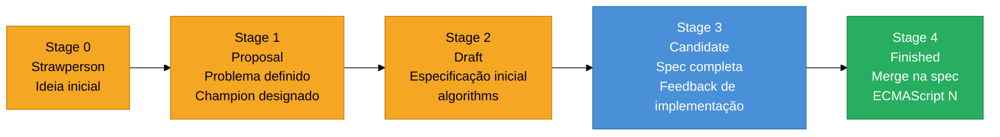
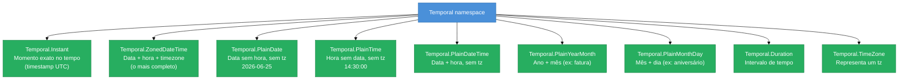

# ES2026 e o futuro do JavaScript

> [!abstract] TL;DR
> O ECMAScript evolui via TC39, um processo de 5 estágios (0–4) que garante consenso antes de standardização. Em 2026, as maiores adições são: **Temporal API** (stage 4 — substituto imutável e timezone-aware do `Date` quebrado), **Explicit Resource Management** (`using`/`await using`, stage 4 — limpeza determinística de recursos) e **Decorators** (stage 3 — metaprogramação declarativa em classes). Records & Tuples, a proposta mais aguardada de imutabilidade primitiva, foi **retirada em abril de 2025** por expectativas de performance irrealistas. Pattern matching e o pipe operator (`|>`) ainda navegam stages iniciais sem previsão de landing.

---

Imagine que você está construindo um sistema de agendamento de consultas médicas. Você precisa calcular "30 dias após hoje, no fuso horário do paciente, sem contar fins de semana". Com o `Date` do JavaScript, essa tarefa — aparentemente simples — vira um pesadelo de bugs silenciosos, fuso horário errado e código ilegível. Você provavelmente vai instalar o `date-fns` ou o `luxon` e torcer pra ninguém tocar no código depois.

Isso não é acidente. É sintoma de uma API com quase 30 anos de decisões ruins acumuladas — e o TC39 finalmente decidiu corrigir isso na raiz.

---

## O processo TC39: como o JavaScript evolui

Antes de mergulhar nas propostas, vale entender o mecanismo. O TC39 é o comitê que padroniza o JavaScript (ECMAScript). Toda nova feature passa por 5 estágios antes de entrar na especificação:



**Stage 3** significa: "spec estável, implementações experimentais existem, só falta feedback de engines reais". Features em stage 3 já podem ser usadas com transpilers (Babel, TypeScript). **Stage 4** é o sinal verde definitivo — a feature entra na spec anual.

O ECMAScript lança uma versão por ano (ES2020, ES2021, …). Features que atingem stage 4 até o início do ano entram no corte daquele ano.

---

## Tabela de status das propostas (junho 2026)

| Proposta | Stage | ES | Observação |
|----------|-------|----|------------|
| **Temporal API** | 4 | ES2026 | Finalmente. Stage 4 em março/2026 |
| **Explicit Resource Management** (`using`) | 4 | ES2026 | Stage 4 em junho/2025; aguarda merge editorial |
| **Decorators** | 3 | ES2027? | Stage 3 desde 2022; TypeScript 5.0 já suporta |
| **Iterator Helpers** (`map`, `filter` em iterators) | 4 | ES2025 | Já na spec |
| **Records & Tuples** | **Withdrawn** | — | Retirado em abril/2025 — ver seção abaixo |
| **Pattern Matching** | 1 | — | Design ainda em aberto |
| **Pipeline Operator** (`\|>`) | 2 | — | Hack-pipes flavor; sem previsão |
| **Iterator.range** | 1 | — | Implementação em andamento no SpiderMonkey |

---

## Temporal API: o Date finalmente consertado

### Por que o `Date` legado é quebrado

O `Date` foi introduzido no JavaScript 1.0 (1995), copiado do Java — que depois admitiu que a API era um erro. Trinta anos depois, ainda carregamos esse peso:

**Mutabilidade silenciosa:**
```javascript
const prazo = new Date('2026-12-31');
function adicionarDias(data, n) {
  data.setDate(data.getDate() + n); // Muta o original!
  return data;
}
const novoPrazo = adicionarDias(prazo, 7);
console.log(prazo === novoPrazo); // true — mesma referência mutada
```

Você passou `prazo` como referência, a função o mutou, e agora `prazo` tem um valor diferente do esperado. Sem erro, sem aviso.

**Meses 0-indexed (armadilha clássica):**
```javascript
new Date(2026, 11, 25); // Dezembro, não novembro — mês 11 = dezembro
new Date(2026, 12, 25); // Janeiro de 2027 — silenciosamente overflow!
```

**Parsing inconsistente entre engines:**
```javascript
new Date('2026-01-01');         // ISO 8601 → UTC
new Date('01/01/2026');         // Local timezone em alguns engines
new Date('January 1, 2026');    // Funciona no V8, pode falhar em outros
```

**Sem timezone real:**
O `Date` armazena internamente um timestamp UTC e só exibe em local timezone do sistema. Não há como dizer "esta data é em São Paulo" de forma robusta sem bibliotecas externas.

**Aritmética dolorosa:**
```javascript
// Quantos dias entre duas datas?
const diff = (new Date('2026-06-25') - new Date('2026-01-01')) / (1000 * 60 * 60 * 24);
// Você está fazendo subtração de timestamps em milissegundos — e esperando que não haja horário de verão no caminho
```

### O que o Temporal resolve

Temporal introduz um **namespace global** com tipos especializados, todos **imutáveis**. Cada tipo resolve um problema específico:



**A regra de ouro para escolher o tipo:**

| Situação | Tipo correto |
|----------|--------------|
| "Quando exatamente isso aconteceu" (log, evento) | `Temporal.Instant` |
| "Às 14h em São Paulo" (reunião, voo) | `Temporal.ZonedDateTime` |
| "Dia 25 de junho" (data de nascimento) | `Temporal.PlainDate` |
| "30 minutos" (duração) | `Temporal.Duration` |
| "Fatura de dezembro/2026" | `Temporal.PlainYearMonth` |

**Imutabilidade como padrão:**
```javascript
const hoje = Temporal.Now.plainDateISO();
const semanaQueVem = hoje.add({ days: 7 }); // Retorna NOVO objeto
console.log(hoje.toString());        // '2026-06-25' — intacto
console.log(semanaQueVem.toString()); // '2026-07-02'
```

**Meses 1-indexed (como humanos esperam):**
```javascript
const natal = Temporal.PlainDate.from({ year: 2026, month: 12, day: 25 });
// month: 12 = dezembro. Ponto.
```

**Timezone explícito e correto:**
```javascript
const reuniao = Temporal.ZonedDateTime.from(
  '2026-07-01T14:00:00[America/Sao_Paulo]'
);
const emLondres = reuniao.withTimeZone('Europe/London');
console.log(emLondres.toString());
// '2026-07-01T18:00:00+01:00[Europe/London]'
// Calculou o offset correto incluindo horário de verão britânico
```

**Comparação e aritmética segura:**
```javascript
const inicio = Temporal.PlainDate.from('2026-01-01');
const hoje = Temporal.PlainDate.from('2026-06-25');
const diff = inicio.until(hoje);
console.log(diff.days); // 175 — sem milissegundos, sem surpresa de timezone
```

Temporal em uma frase: uma API de datas imutável, tipada por intenção e timezone-aware — o que o `Date` deveria ter sido desde o início.

---

## Explicit Resource Management: `using` e `await using`

### O problema dos recursos sem cleanup

Recursos como arquivos, conexões de banco, locks de mutex e handles de sistema precisam ser liberados explicitamente. Em JavaScript, isso sempre dependeu de `try/finally` manual — código verboso e propenso a esquecimento:

```javascript
// Antes: cleanup manual, propenso a bugs
const arquivo = await abrirArquivo('dados.csv');
try {
  const dados = await arquivo.ler();
  processar(dados);
} finally {
  await arquivo.fechar(); // E se processar() lançar + fechar() lançar? Quem vence?
}
```

O problema é real: se tanto `processar()` quanto `arquivo.fechar()` lançarem erros, o erro do `finally` engole o erro original. Você perde o contexto do problema real.

### Como `using` funciona

Explicit Resource Management (ERM) adiciona a declaração `using` (síncrona) e `await using` (assíncrona). Quando a variável sai de escopo — seja por execução normal, `return`, `throw` ou `break` — o método `Symbol.dispose` (ou `Symbol.asyncDispose`) é chamado automaticamente:

```javascript
// Depois: cleanup automático e seguro
{
  using arquivo = abrirArquivoSync('dados.csv');
  // arquivo[Symbol.dispose]() é chamado ao sair deste bloco
  // mesmo que uma exceção seja lançada
  processar(arquivo.ler());
}
// Aqui, arquivo já está fechado
```

**Para recursos assíncronos:**
```javascript
async function sincronizarBanco() {
  await using conn = await pool.getConnection();
  // conn[Symbol.asyncDispose]() é chamado ao sair
  const resultado = await conn.query('SELECT * FROM usuarios');
  return resultado;
}
```

**Múltiplos recursos — ordem garantida (LIFO):**
```javascript
{
  using A = abrirRecursoA(); // Aberto primeiro
  using B = abrirRecursoB(); // Aberto segundo
  // B.dispose() é chamado primeiro, depois A.dispose()
  // — como uma pilha, LIFO
}
```

**Erros agregados com `SuppressedError`:**
Se o `dispose()` lançar quando já há um erro em voo, o ERM cria um `SuppressedError` que contém ambos — o erro original e o erro do cleanup. Você não perde nenhum:

```javascript
// SuppressedError {
//   error: <erro do dispose>,
//   suppressed: <erro original>
// }
```

**Implementar `Symbol.dispose` em suas classes:**
```javascript
class Conexao {
  constructor(url) {
    this._client = criarClient(url);
  }

  consultar(sql) { return this._client.execute(sql); }

  [Symbol.dispose]() {
    this._client.desconectar();
    console.log('Conexão fechada.');
  }
}

{
  using db = new Conexao('postgres://localhost/meudb');
  const rows = db.consultar('SELECT 1');
  // db[Symbol.dispose]() chamado automaticamente ao sair do bloco
}
```

`using` em uma frase: gerenciamento determinístico de recursos com a garantia do compilador — como `with` do Python ou `using` do C#, mas integrado ao modelo de escopo do JavaScript.

---

## Decorators: metaprogramação declarativa em classes

### O problema que Decorators resolvem

Você quer adicionar logging, validação, memoização ou controle de acesso a métodos de uma classe. Sem decorators, você faz isso manualmente — e repete a lógica em cada método:

```javascript
class ServicoUsuario {
  async buscarUsuario(id) {
    console.log(`[LOG] buscarUsuario chamado com ${id}`);
    const inicio = Date.now();
    try {
      const resultado = await this._repo.findById(id);
      return resultado;
    } finally {
      console.log(`[LOG] buscarUsuario levou ${Date.now() - inicio}ms`);
    }
  }
  // Repetir para cada método...
}
```

### O que Decorators permitem

Um decorator é uma função que recebe o valor decorado (classe, método, campo, acessor) e um objeto de contexto, e opcionalmente retorna um substituto. A sintaxe usa `@`:

```javascript
// Definindo um decorator de logging
function log(fn, context) {
  return function (...args) {
    console.log(`[LOG] ${context.name} chamado`);
    const inicio = Date.now();
    const resultado = fn.apply(this, args);
    console.log(`[LOG] ${context.name} levou ${Date.now() - inicio}ms`);
    return resultado;
  };
}

// Usando
class ServicoUsuario {
  @log
  async buscarUsuario(id) {
    return this._repo.findById(id);
  }

  @log
  async salvarUsuario(usuario) {
    return this._repo.save(usuario);
  }
}
```

**Decorator de campo com validação:**
```javascript
function naoNegativo(value, context) {
  // Para campos, retorna um objeto com get/set
  return {
    get() { return value; },
    set(novoValor) {
      if (novoValor < 0) throw new RangeError(`${context.name} não pode ser negativo`);
      value = novoValor;
    }
  };
}

class Conta {
  @naoNegativo
  accessor saldo = 0;
}

const conta = new Conta();
conta.saldo = -100; // RangeError: saldo não pode ser negativo
```

**Status atual (junho 2026):** Stage 3. Suportado via TypeScript 5.0+, Babel e Deno. Ainda aguarda stage 4, mas é seguro usar em produção com transpilers. A spec é estável — mudanças breaking são improváveis.

Decorators em uma frase: transformadores declarativos de classes e seus membros, que separam a lógica de cross-cutting concerns (logging, validação, cache) do corpo da função.

---

## Records & Tuples: a proposta que não vingou

Esta é a parte que mais decepciona — e a mais importante de comunicar com honestidade.

Records & Tuples prometia adicionar **primitivos imutáveis** ao JavaScript: `#{ a: 1, b: 2 }` (Record) e `#[1, 2, 3]` (Tuple), com igualdade por valor em vez de por referência:

```javascript
// O que era prometido (NÃO está na linguagem)
const r1 = #{ x: 1, y: 2 };
const r2 = #{ x: 1, y: 2 };
r1 === r2; // true — igualdade por valor, como number e string
```

**Por que foi retirada (abril de 2025):**

A proposta ficou presa no Stage 2 por anos. O bloqueio central era de **performance**: para que `r1 === r2` seja `true`, o engine precisa de uma forma de comparar estruturalmente ou de internar os valores (criar uma única instância para cada valor único). Ambas as abordagens têm custo proibitivo em dados grandes.

Engines como V8 e SpiderMonkey resistiram a implementar porque as garantias de performance prometidas pela comunidade eram irrealistas. Em abril/2025, o TC39 arquivou o repositório e retirou formalmente a proposta.

**O que vem no lugar:**

Não há substituto direto aprovado. O que existe hoje para imutabilidade em JavaScript:

- `Object.freeze()` — imutabilidade superficial, sem igualdade por valor
- Bibliotecas como `Immer` e `Immutable.js` — usadas em produção, mas sem suporte nativo
- Discussões em aberto no TC39 sobre alternativas baseadas em objetos (não primitivos) — sem proposta formal ainda

Para entender o estado da arte em imutabilidade sem o suporte de primitivos, veja [[20 - Cópia, serialização e imutabilidade]].

---

## Propostas em estágio inicial: o que observar

### Pipeline Operator (`|>`) — Stage 2

O operador de pipe permite encadear transformações sem variáveis intermediárias:

```javascript
// Sem pipe
const resultado = formatar(normalizar(validar(entrada)));

// Com pipe (Hack-flavor — Stage 2)
const resultado = entrada |> validar(%) |> normalizar(%) |> formatar(%);
// % representa o valor do passo anterior
```

A proposta usa o "Hack flavor" (com `%` como topic token) em vez do "F# flavor" (sem token). Está em stage 2 desde 2021 e enfrenta resistência de alguns delegados sobre design de syntax. Sem previsão de stage 3.

### Pattern Matching — Stage 1

Match expression como alternativa ao `switch`:

```javascript
// Proposta (não disponível ainda)
const descricao = match (resposta) {
  when { status: 200, body } => `OK: ${body}`,
  when { status: 404 } => 'Não encontrado',
  when { status } if status >= 500 => `Erro de servidor: ${status}`,
  else => 'Resposta desconhecida'
};
```

Em stage 1 desde 2017. O design ainda está em aberto — questões sobre exhaustiveness checking e performance de matching estrutural não foram resolvidas.

### Iterator.range — Stage 1

Gerar ranges de números sem boilerplate:

```javascript
// Proposta (não disponível ainda)
for (const i of Iterator.range(0, 10)) console.log(i); // 0..9
for (const i of Iterator.range(0, 10, 2)) console.log(i); // 0, 2, 4, 6, 8
```

SpiderMonkey (Firefox) já tem implementação experimental em Nightly. Stage 1; sem previsão de avanço.

---

## Casos práticos

### Cenário 1: Sistema de agendamento com Temporal

Um sistema de consultas médicas precisa calcular o próximo horário disponível, respeitando o fuso horário do paciente e o horário de expediente da clínica:

```javascript
import { Temporal } from '@js-temporal/polyfill'; // polyfill até engines suportarem nativamente

const FUSO_CLINICA = 'America/Sao_Paulo';
const HORARIO_INICIO = Temporal.PlainTime.from('08:00');
const HORARIO_FIM = Temporal.PlainTime.from('18:00');

function proximoHorarioDisponivel(agendaOcupada) {
  let candidato = Temporal.Now.zonedDateTimeISO(FUSO_CLINICA)
    .round({ smallestUnit: 'minute', roundingMode: 'ceil' });

  // Avança se estiver fora do expediente
  if (Temporal.PlainTime.compare(candidato.toPlainTime(), HORARIO_FIM) >= 0) {
    candidato = candidato
      .add({ days: 1 })
      .with({ hour: 8, minute: 0, second: 0 });
  }

  // Pula fins de semana (dayOfWeek: 6=Sábado, 7=Domingo)
  while (candidato.dayOfWeek >= 6) {
    candidato = candidato.add({ days: 1 });
  }

  // Verifica conflito com agenda
  const conflito = agendaOcupada.some(ocupado =>
    Temporal.ZonedDateTime.compare(ocupado, candidato) === 0
  );

  if (conflito) {
    return proximoHorarioDisponivel([...agendaOcupada, candidato]);
  }

  return candidato;
}

const proximo = proximoHorarioDisponivel([]);
console.log(proximo.toString());
// '2026-06-26T08:00:00+03:00[America/Sao_Paulo]' — ou o próximo dia útil
```

Tudo isso sem instalar `moment`, `date-fns` ou `luxon`. O `Temporal.ZonedDateTime.compare()` retorna -1, 0 ou 1 — comparação segura sem subtração de timestamps.

### Cenário 2: Pool de conexões com `using`

Um worker que processa jobs de uma fila, garantindo que toda conexão seja devolvida ao pool — mesmo em erro:

```javascript
class DbConnection {
  constructor(pool, client) {
    this._pool = pool;
    this._client = client;
  }

  async query(sql, params) {
    return this._client.query(sql, params);
  }

  async [Symbol.asyncDispose]() {
    await this._pool.release(this._client);
    // Chamado automaticamente ao sair do escopo
  }
}

class ConnectionPool {
  async acquire() {
    const client = await this._driver.connect();
    return new DbConnection(this, client);
  }

  async release(client) {
    await client.end();
    this._available++;
  }
}

// Worker de processamento de jobs
async function processarJob(pool, jobId) {
  await using conn = await pool.acquire();
  // conn é devolvida ao pool independente de erro

  const job = await conn.query('SELECT * FROM jobs WHERE id = $1', [jobId]);
  const resultado = await executarLogicaDeNegocio(job);
  await conn.query('UPDATE jobs SET status = $1 WHERE id = $2',
    ['concluido', jobId]);

  return resultado;
  // conn[Symbol.asyncDispose]() chamado aqui automaticamente
}

// Sem try/finally manual. Sem vazamento de conexão.
```

Se `executarLogicaDeNegocio()` lançar, `Symbol.asyncDispose` ainda é chamado, e a conexão é devolvida. Se o `dispose()` também lançar, você recebe um `SuppressedError` com ambos os erros.

---

## Armadilhas comuns

> [!warning] Confundir Temporal.PlainDate com Temporal.ZonedDateTime
> **O que acontece:** Você usa `PlainDate` para agendar reuniões com timezone e percebe que o horário "errou" ao exibir para usuários em outro fuso.
> **Por quê:** `PlainDate` (e `PlainDateTime`) intencionalmente não tem timezone — é uma data "flutuante". Para eventos que ocorrem em um momento exato no tempo, use `ZonedDateTime`.
> **Como evitar:** Regra de ouro — se o evento tem relevância global ou precisa de conversão de tz, use `ZonedDateTime`. Se é uma data de nascimento ou aniversário (sem hora), use `PlainDate`.

> [!warning] `using` não funciona com recursos que exigem cleanup assíncrono em contexto síncrono
> **O que acontece:** Você usa `using` (síncrono) com um recurso que tem `Symbol.asyncDispose`, e o cleanup não aguarda o Promise — o recurso pode ser fechado antes de operações assíncronas pendentes terminarem.
> **Por quê:** `using` é síncrono por design. Para recursos com cleanup async, o contexto precisa ser `async` e a declaração precisa ser `await using`.
> **Como evitar:** Sempre use `await using` em contextos async quando o recurso implementa `Symbol.asyncDispose`. Se o recurso tem ambos (`Symbol.dispose` e `Symbol.asyncDispose`), `using` usará o síncrono — implemente-os de forma consistente.

> [!warning] Decorator behavior varia entre TypeScript legacy e Stage 3
> **O que acontece:** Código com `experimentalDecorators: true` (TypeScript legacy) se comporta diferente de decorators Stage 3. Você mistura as duas formas e tem bugs difíceis de rastrear.
> **Por quê:** O TC39 reescreveu a spec de decorators completamente. O TypeScript suportou uma versão experimental por anos antes de stage 3. As APIs são incompatíveis.
> **Como evitar:** Em projetos novos, use TypeScript 5.0+ sem `experimentalDecorators`. Se migrando, refatore um arquivo de cada vez e teste o comportamento dos decorators explicitamente.

> [!warning] Records & Tuples: não tente reimplementar com Proxy ou freeze esperando igualdade por valor
> **O que acontece:** Você viu a proposta, adorou a ideia de `===` por valor, e tenta simular com `Object.freeze` ou `Proxy`. O resultado não funciona como esperado: dois objetos freeze com os mesmos valores ainda são `!==`.
> **Por quê:** Igualdade por valor para objetos exigiria interning ou comparação estrutural no nível do engine — não é possível no userland.
> **Como evitar:** Use serialização para comparações (JSON.stringify para casos simples, deep-equal para casos complexos). Para imutabilidade de estado em apps React/Vue, use Immer. Aceite que o JavaScript não terá primitivos imutáveis em curto prazo.

---

## Como explicar em inglês

"JavaScript's date handling has always been broken — mutable, zero-indexed months, and no real timezone support. The Temporal API, which reached Stage 4 in March 2026, finally fixes this with immutable types, explicit timezones, and human-readable arithmetic. On the resource management side, the `using` keyword brings deterministic cleanup to JavaScript — similar to Python's `with` or C#'s `using` — so you don't need try/finally boilerplate to guarantee file handles and connections are released."

| PT | EN |
|----|-----|
| Proposta TC39 | TC39 proposal |
| Imutável | Immutable |
| Fuso horário | Timezone |
| Gestão de recursos | Resource management |
| Limpeza determinística | Deterministic cleanup |
| Decoradores | Decorators |
| Proposta retirada | Withdrawn proposal |
| Primitivo | Primitive |
| Internamento de valores | Value interning |
| Stage/Estágio | Stage |

---

## O que vem a seguir

Você chegou ao fim da trilha principal de JavaScript do Codex. Cada proposta desta nota conecta a fundamentos que você já estudou: Temporal usa o mesmo modelo de imutabilidade que você viu em [[20 - Cópia, serialização e imutabilidade]]; `using` é a evolução natural dos mecanismos de error handling de [[18 - Error handling]]; Decorators são metaprogramação sobre o que você aprendeu em [[22 - Metaprogramação]]; e os problemas de precisão numérica do `Date` têm raízes em [[13 - Números, BigInt e precisão]].

O próximo passo natural é a aplicação: frameworks, tooling, Node.js e o ecossistema. Mas para o núcleo da linguagem, você tem agora o mapa completo — do `typeof` ao futuro da TC39.

- [[20 - Cópia, serialização e imutabilidade]] — imutabilidade hoje, sem aguardar Records & Tuples
- [[22 - Metaprogramação]] — Proxy, Reflect e Symbols: a base sobre a qual Decorators operam
- [[18 - Error handling]] — por que `SuppressedError` do ERM é uma extensão natural do modelo de erros
- [[13 - Números, BigInt e precisão]] — raízes dos bugs numéricos que Temporal também resolve
- [[Dicionário de JavaScript]] — glossário de termos da linguagem e do ecossistema

---

## Referências

- **Socket.dev** — [*TC39 Advances Temporal to Stage 4 Alongside Several ECMAScript Proposals*](https://socket.dev/blog/tc39-advances-temporal-to-stage-4) — cobertura do meeting de março/2026 onde Temporal chegou a stage 4
- **Bloomberg** — [*Temporal Is Now Official*](https://www.bloomberg.com/company/stories/temporal-is-now-official-transforming-javascript-dates-times-with-bloomberg-support/) — Bloomberg foi o principal financiador do desenvolvimento do Temporal
- **GitHub tc39/proposal-temporal** — [*Proposal repository*](https://github.com/tc39/proposal-temporal) — spec oficial e documentação
- **GitHub tc39/proposal-record-tuple** — [*Issue #394: Proposal is withdrawn*](https://github.com/tc39/proposal-record-tuple/issues/394) — confirmação oficial da retirada em abril/2025
- **InfoQ** — [*TC39 Advances Nine JavaScript Proposals, Including Explicit Resource Management*](https://www.infoq.com/news/2025/06/tc39-stage-4-2025/) — cobertura do stage 4 do ERM em junho/2025
- **Igalia Compilers Blog** — [*Summary of the February 2025 TC39 plenary*](https://blogs.igalia.com/compilers/2025/03/27/summary-of-the-february-2025-tc39-plenary/) — contexto da retirada de Records & Tuples
- **tc39/proposals** — [*Tracking ECMAScript Proposals*](https://github.com/tc39/proposals) — lista canônica de todas as propostas e seus stages atuais
- **tc39.es/proposal-temporal/docs** — [*Temporal documentation*](https://tc39.es/proposal-temporal/docs/) — guia oficial dos tipos e métodos do Temporal
- **GitHub tc39/proposal-explicit-resource-management** — [*Explicit Resource Management spec*](https://github.com/tc39/proposal-explicit-resource-management) — spec do `using`/`await using`
