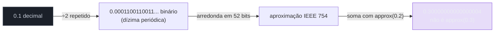
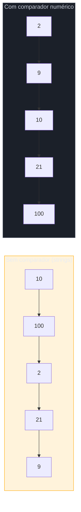
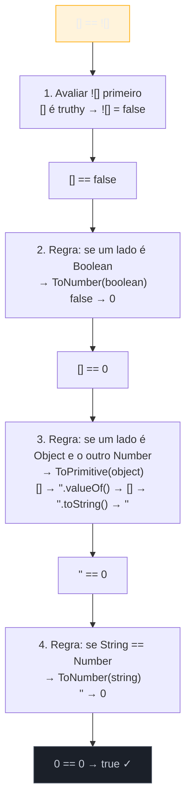
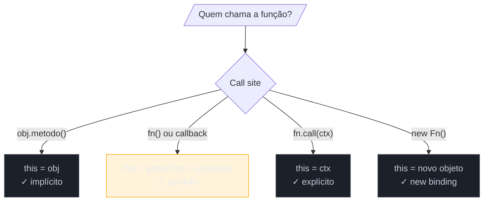
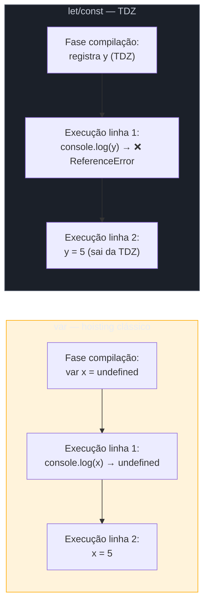

> [!abstract] TL;DR
> JavaScript tem uma coleção de comportamentos contra-intuitivos que nascem de três fontes: decisões de design dos anos 1990 congeladas por compatibilidade (`typeof null`), a representação IEEE 754 de ponto flutuante (`NaN`, `0.1+0.2`), e as regras de coerção do operador `==`. Conhecer o *porquê* de cada quirk — não só o *o quê* — separa o sênior que depura em minutos do júnior que passa horas. Este compêndio explica cada armadilha como uma história: o que parece, o que é, por que funciona assim, e a regra prática para não cair duas vezes.

---

Imagine que você entra em uma entrevista sênior e o entrevistador escreve no quadro:

```js
console.log(typeof null);          // ?
console.log(NaN === NaN);          // ?
console.log(0.1 + 0.2 === 0.3);   // ?
console.log([] == ![]);            // ?
```

Se você hesitar em qualquer dessas — ou pior, souber o resultado mas não conseguir explicar por que — você deixou escapar um sinal claro. Não porque essas perguntas meçam habilidade diária, mas porque explicar o mecanismo por trás delas demonstra que você entende JavaScript como máquina, não só como ferramenta.

Este capítulo é um compêndio dessas armadilhas. Para cada uma: o cenário que confunde, a realidade técnica, a raiz histórica ou especificação que a causa, e a regra prática que evita o erro em produção.

---

## Categoria 1 — Tipos e `typeof`

### `typeof null === "object"`: o bug congelado em 1995

Você testa se uma variável é `null` com `typeof`:

```js
if (typeof minhaVar === "object") {
  // seguro para usar como objeto?
}
```

Passa-se `null` para `minhaVar`. A condição é `true`. O código explode.

**O que realmente acontece:** Em Brendan Eich's implementação original de 1995, valores eram armazenados em unidades de 32 bits com uma *type tag* nos três bits menos significativos. A tag `000` significava "ponteiro para objeto". `null` era representado como o valor nulo do ponteiro — literalmente o valor `0x00000000` em memória — cujos três bits menos significativos também são `000`. O `typeof` lê a tag, vê `000`, e retorna `"object"`.

```
Tag bits    Tipo
000         object  ← null também cai aqui (0x00 = todos zeros)
001         int
010         double
100         string
110         boolean
```

Brendan Eich chamou isso de bug publicamente. A proposta de corrigir para `typeof null === "null"` foi incluída no rascunho do ES2015, mas rejeitada: teria quebrado código existente que fazia `if (typeof x === "object" && x !== null)` como idiom de guarda — ironicamente, a própria correção para o bug.

**Regra prática:**

```js
// ❌ não confie apenas em typeof para null
if (typeof x === "object") { x.foo }  // explode se x for null

// ✅ guarda canônica
if (x !== null && typeof x === "object") { x.foo }

// ✅ ou, para testar null especificamente
if (x === null) { ... }  // identidade estrita — nenhuma coerção
```

---

### `typeof NaN === "number"`: o número que não é número

```js
console.log(typeof NaN);  // "number"
console.log(NaN === NaN); // false
```

Duplo choque: `NaN` é do tipo `"number"` e não é igual a si mesmo.

**Por quê:** `NaN` significa *Not a Number*, mas é definido pela especificação IEEE 754 como um valor do conjunto dos números de ponto flutuante — um valor especial para representar resultados indefinidos de operações numéricas (`0/0`, `Math.sqrt(-1)`, `Number("abc")`). Ele habita o espaço de tipo numérico, não um tipo separado.

A inequalidade consigo mesmo (`NaN !== NaN`) também vem do IEEE 754: a especificação define que qualquer comparação envolvendo `NaN` retorna `false` — inclusive a de igualdade. É uma escolha deliberada para propagação de erros: se uma computação produziu `NaN`, qualquer operação subsequente de comparação também deve indicar "indefinido".

**Como testar corretamente:**

```js
// ❌ armadilha clássica
if (resultado === NaN) { ... }  // sempre false, código morto

// ❌ isNaN() global tem coerção de tipo
isNaN("abc")  // true — converte string para número primeiro!

// ✅ Number.isNaN() — sem coerção, sem surpresa
Number.isNaN(NaN)    // true
Number.isNaN("abc")  // false — apenas o valor NaN retorna true
Number.isNaN(42)     // false

// ✅ alternativa sem polyfill: explorar a propriedade única
function ehNaN(v) { return v !== v; }  // só NaN é diferente de si mesmo
```

---

## Categoria 2 — Números e ponto flutuante

### `0.1 + 0.2 !== 0.3`: aritmética de frações binárias

```js
console.log(0.1 + 0.2);        // 0.30000000000000004
console.log(0.1 + 0.2 === 0.3); // false
```

Parece bug. É física computacional.

**O mecanismo:** JavaScript usa o padrão IEEE 754 de dupla precisão (64 bits) para todos os números. Nesse formato, `0.1` não tem representação exata em binário — é uma dízima periódica binária, como `1/3` é dízima em decimal. O número mais próximo representável em 64 bits é `0.1000000000000000055511151231257827021181583404541015625`. O mesmo ocorre com `0.2`. Quando esses dois aproximados são somados, o resultado é ligeiramente maior que `0.3`.

```
0.1 (real)  → 0.1000000000000000055... (IEEE 754)
0.2 (real)  → 0.2000000000000000111... (IEEE 754)
soma        → 0.3000000000000000444... ≠ 0.30000000000000004...

0.3 (real)  → 0.2999999999999999888... (IEEE 754, diferente da soma)
```

**Visualização — por que 1/10 não cabe em binário:**



**Regra prática:**

```js
// ❌ comparação direta de floats
if (0.1 + 0.2 === 0.3) { ... }  // false

// ✅ use tolerância (epsilon)
const EPSILON = Number.EPSILON;  // 2.220446049250313e-16
Math.abs(0.1 + 0.2 - 0.3) < EPSILON;  // true

// ✅ para dinheiro/finanças: trabalhe em inteiros (centavos)
const preco = 10;      // R$ 0.10 em centavos
const taxa  = 20;      // R$ 0.20 em centavos
preco + taxa === 30;   // true — inteiros são exatos

// ✅ ou BigDecimal via biblioteca (Decimal.js, big.js)
```

> [!question]- Por que `0.1 + 0.1 + 0.1 === 0.3` também é false?
> Porque os erros de arredondamento se acumulam a cada operação. Cada soma de aproximações produz uma nova aproximação, e essas diferem da aproximação direta de `0.3`. Veja [[13 - Números, BigInt e precisão]] para o tratamento completo.

---

### `sort` lexicográfico: o traidor de arrays numéricos

```js
[10, 9, 2, 21, 100].sort()
// → [10, 100, 2, 21, 9]  — não é o que você espera!
```

**Por quê:** O método `Array.prototype.sort()` sem comparador converte cada elemento para string e ordena por ponto de código Unicode — ordenação lexicográfica, como um dicionário. "10" vem antes de "2" porque o caractere "1" (U+0031) tem código menor que "2" (U+0032).

**Visualização comparativa:**



**Regra prática:**

```js
// ❌ sort sem comparador para números
[10, 2, 100].sort()  // [10, 100, 2] — ERRADO

// ✅ comparador numérico explícito
[10, 2, 100].sort((a, b) => a - b)  // [2, 10, 100] — crescente
[10, 2, 100].sort((a, b) => b - a)  // [100, 10, 2] — decrescente

// ✅ para strings, use localeCompare
['caju', 'abacaxi', 'banana'].sort((a, b) => a.localeCompare(b))
```

---

### `parseInt` sem radix: a armadilha do zero à esquerda

```js
// comportamento pré-ES5 (motores antigos)
parseInt('08')  // 0 em alguns ambientes — interpretava como octal!
parseInt('09')  // 0 em alguns ambientes

// hoje (ES5+)
parseInt('08')  // 8 — o leading-zero octal foi removido
parseInt('08', 10)  // 8 — explícito e seguro em todos os ambientes
```

**Por quê:** Antes do ES5, strings que começavam com `0` eram interpretadas como octais (base 8). O dígito `8` não existe na base 8, então `parseInt('08')` retornava `0`. O ES5 removeu esse comportamento para `parseInt`, mas ambientes legados ainda existem (Node.js antigo, browsers antigos em modo quirks).

**Regra prática:**

```js
// ✅ sempre especifique o radix
parseInt('42', 10)    // 42 — decimal
parseInt('ff', 16)    // 255 — hexadecimal
parseInt('10', 2)     // 2 — binário
parseInt('08', 10)    // 8 — seguro mesmo com zero à esquerda
```

---

## Categoria 3 — Coerção e igualdade

### `[] == ![]`: a coerção em sete passos

Esta é a quirk mais frequente em entrevistas, e a mais reveladora: quem entende o mecanismo nunca mais tem medo de `==`.

```js
[] == ![]  // true
```

**Passo a passo da especificação Abstract Equality Comparison:**



**Por quê existe:** O operador `==` segue a *Abstract Equality Comparison Algorithm* da especificação, que define um conjunto de regras de coerção automática. O objetivo original (anos 90) era tornar comparações "convenientes". O resultado foi um sistema de regras complexo que ninguém memoriza corretamente.

**Regra prática:**

```js
// ❌ evite == com tipos mistos — nunca está claro qual coerção acontece
[] == false  // true
"" == false  // true
"0" == false // true
0 == false   // true
null == 0    // false (null tem regra especial!)

// ✅ use === — sem coerção, sem surpresa
[] === false  // false — tipos diferentes, ponto final
```

> Para o algoritmo completo de coerção, veja [[03 - Coerção e igualdade]].

---

### Truthy/falsy: os valores que mentem

```js
Boolean([])   // true  — array vazio é truthy!
Boolean({})   // true  — objeto vazio é truthy!
Boolean("0")  // true  — string não-vazia é truthy!
Boolean(0)    // false
Boolean("")   // false
Boolean(null) // false
```

**Tabela dos seis falsy values:**

| Valor | `Boolean()` | Notas |
|-------|-------------|-------|
| `false` | `false` | — |
| `0` | `false` | inclui `-0` e `0n` (BigInt) |
| `""` | `false` | string vazia, qualquer delimitador |
| `null` | `false` | — |
| `undefined` | `false` | — |
| `NaN` | `false` | — |

Tudo o mais é truthy — inclusive `[]`, `{}`, `"0"`, `"false"`.

**A armadilha de `"0"`:**

```js
if ("0") console.log("truthy");  // imprime — string não-vazia!
if (0)   console.log("truthy");  // não imprime — número zero é falsy

// Cuidado ao receber valores de formulários HTML:
// input.value retorna string — "0" da string é truthy!
const valor = "0";      // vindo de um <input>
if (valor) { /* executa — bug! */ }
if (Number(valor)) { /* não executa — correto */ }
```

---

### `==` com `null` e `undefined`: a exceção da regra

```js
null == undefined   // true
null == 0           // false  ← surpresa!
null == ""          // false  ← surpresa!
null == false       // false  ← surpresa!
```

**Por quê:** A especificação tem uma regra especial: `null == undefined` retorna `true` e `null == <qualquer outra coisa>` retorna `false` — sem coerção numérica. Isso é diferente de todos os outros valores.

**Quando isso é útil:**

```js
// Verifica tanto null quanto undefined em uma tacada
function processar(valor) {
  if (valor == null) {  // true para null E undefined
    return 'sem valor';
  }
  return valor;
}
```

**Tabela de igualdade `==` dos casos-armadilha:**

| Expressão | Resultado | Motivo |
|-----------|-----------|--------|
| `null == undefined` | `true` | Regra especial da spec |
| `null == 0` | `false` | Null não sofre coerção numérica |
| `null == false` | `false` | Idem |
| `"" == 0` | `true` | `ToNumber("")` = 0 |
| `"0" == 0` | `true` | `ToNumber("0")` = 0 |
| `"0" == false` | `true` | false→0, "0"→0 |
| `[] == 0` | `true` | ToPrimitive([])="" → 0 |
| `{} == 0` | ❌ SyntaxError | `{}` no início de statement = bloco |

---

## Categoria 4 — `this` e escopo

### `this` perdido: quando o contexto escapa

```js
const timer = {
  nome: "Timer A",
  iniciar() {
    setTimeout(function () {
      console.log(this.nome);  // undefined!
    }, 100);
  }
};
timer.iniciar();
```

**Por quê:** `this` em JavaScript não é léxico — é determinado pelo *call site* (o ponto de chamada), não pelo ponto de definição. Quando `setTimeout` chama a função passada como callback, o call site é o runtime interno do timer — `this` aponta para `globalThis` (ou `undefined` em strict mode), não para o objeto `timer`.

**Visualização dos quatro modos de `this`:**



**Soluções:**

```js
// ✅ arrow function captura o this léxico do envoltório
iniciar() {
  setTimeout(() => {
    console.log(this.nome);  // "Timer A" ✓
  }, 100);
}

// ✅ .bind() para fixar o contexto
iniciar() {
  setTimeout(function () {
    console.log(this.nome);  // "Timer A" ✓
  }.bind(this), 100);
}

// ✅ variável de captura (padrão legado)
iniciar() {
  const self = this;
  setTimeout(function () {
    console.log(self.nome);  // "Timer A" ✓
  }, 100);
}
```

> Detalhamento completo dos quatro modos de `this` e precedência: [[06 - this]].

---

### Hoisting: declaração sobe, inicialização não

```js
console.log(x);  // undefined (não erro!)
var x = 5;
console.log(x);  // 5

console.log(y);  // ReferenceError: Cannot access 'y' before initialization
let y = 5;
```

**Por quê:** O motor JavaScript processa o código em duas fases. Na fase de compilação, ele eleva (*hoist*) todas as declarações `var` ao topo do escopo e as inicializa com `undefined`. Na fase de execução, a atribuição acontece na linha original.

`let` e `const` também são hoistados (a declaração é registrada), mas ficam em uma *Temporal Dead Zone* (TDZ) — qualquer acesso antes da linha de declaração lança `ReferenceError`.

**Visualização do hoisting:**



**Hoisting de funções (surpresa extra):**

```js
// Declaração de função: hoistada completamente (nome + corpo)
ola();  // "olá!" — funciona antes da declaração!
function ola() { console.log("olá!"); }

// Expressão de função: hoistado apenas o var (undefined)
tchau();  // TypeError: tchau is not a function
var tchau = function () { console.log("tchau!"); };
```

> Ver [[04 - Variáveis e escopo]] para escopo de bloco, closures e TDZ completo.

---

## Categoria 5 — Arrays e iteração

### Mutação durante iteração: o loop que pula elementos

```js
const arr = [1, 2, 3, 4, 5];
arr.forEach((item, i) => {
  if (item === 2) arr.splice(i, 1);  // remove o 2
});
console.log(arr);  // [1, 3, 4, 5]? Não — [1, 3, 5] pode pular o 3!
```

**Por quê:** `forEach` itera por índice de 0 a `length - 1` no início da chamada. Quando você remove `arr[1]` (o `2`) com `splice`, o elemento `3` passa a ocupar o índice `1`. O loop já avançou para o índice `2`, que agora é `4` — o `3` foi pulado.

**Regra prática:**

```js
// ✅ filter cria novo array — sem mutação durante iteração
const resultado = arr.filter(item => item !== 2);

// ✅ iterar de trás para frente ao usar splice
for (let i = arr.length - 1; i >= 0; i--) {
  if (arr[i] === 2) arr.splice(i, 1);
}
```

---

### `for...in` em arrays: o iterador errado

```js
const arr = [10, 20, 30];
arr.custom = "propriedade extra";

for (const key in arr) {
  console.log(key);  // "0", "1", "2", "custom" — inclui propriedades!
}
```

**Por quê:** `for...in` itera sobre **todas as propriedades enumeráveis** de um objeto, incluindo as herdadas do prototype e qualquer propriedade adicionada ao array. Arrays em JavaScript são objetos — índices são apenas chaves de string especiais.

**Regra prática:**

```js
// ❌ for...in para arrays — itera propriedades, não valores
for (const key in arr) { ... }

// ✅ for...of — itera valores, ignora propriedades extras
for (const valor of arr) { console.log(valor); }  // 10, 20, 30

// ✅ forEach, map, filter, reduce — funcionam sobre índices numéricos apenas
arr.forEach(v => console.log(v));
```

---

## Categoria 6 — Funções matemáticas e edge cases

### `Math.max()` sem args = `-Infinity`: o acumulador neutro

```js
Math.max()          // -Infinity
Math.min()          // Infinity
Math.max(1, 2, 3)   // 3   — comportamento esperado
Math.min(1, 2, 3)   // 1   — comportamento esperado
```

Parece invertido — mas faz sentido quando você entende que essas funções são redutores.

**Por quê:** `Math.max()` e `Math.min()` são implementados como reduções comparativas: cada argumento é comparado ao acumulador e "vence" se for maior (ou menor). Para que essa redução funcione com qualquer conjunto de argumentos, o acumulador inicial precisa ser o **elemento neutro** da operação:

- O elemento neutro do `max` é o menor valor possível: `-Infinity` (qualquer número é maior que `-Infinity`).
- O elemento neutro do `min` é o maior valor possível: `Infinity` (qualquer número é menor que `Infinity`).

Com zero argumentos, o acumulador neutro é retornado sem ser alterado. A matemática está correta — o instinto humano é que falha.

```js
// Visualizando como redução:
Math.max(1, 3, 2)
// → max(-Infinity, 1) = 1
// → max(1, 3) = 3
// → max(3, 2) = 3  ← resultado final

Math.max()
// → nenhum argumento: retorna -Infinity diretamente
```

**Armadilha real — spread de array vazio:**

```js
const nums = [];
const maior = Math.max(...nums);  // -Infinity — não NaN, não erro!

// Esse -Infinity pode silenciosamente contaminar cálculos:
const bonus = maior * 0.1;  // -Infinity * 0.1 = -Infinity
```

**Regra prática:**

```js
// ✅ guarda antes do spread
const maior = nums.length ? Math.max(...nums) : 0;

// ✅ ou reduce com fallback explícito
const maior2 = nums.reduce((acc, v) => Math.max(acc, v), -Infinity);

// ❌ não assume que Math.max de array vazio é seguro — é -Infinity silencioso
```

> Aprofundamento em representação numérica: [[13 - Números, BigInt e precisão]].

---

## Categoria 7 — Conversões e coerções numéricas

### `+""` e o operador de conversão silenciosa

```js
+"";        // 0
+"3";       // 3
+"3.14";    // 3.14
+true;      // 1
+false;     // 0
+null;      // 0
+undefined; // NaN
+[];        // 0
+{};        // NaN
+[1,2];     // NaN (ToPrimitive([1,2]) = "1,2" → NaN)
```

**Por quê:** O operador `+` unário chama `ToNumber()` sobre o operando. `ToNumber` tem regras diferentes para cada tipo — strings numéricas viram números, arrays passam por `ToPrimitive` primeiro (que chama `toString()`), e objetos arbitrários viram `NaN`.

**Tabela de conversões numéricas comuns:**

| Valor | `+valor` | `Number(valor)` | `parseInt(valor)` |
|-------|----------|-----------------|-------------------|
| `""` | `0` | `0` | `NaN` |
| `"3"` | `3` | `3` | `3` |
| `"3.14"` | `3.14` | `3.14` | `3` |
| `true` | `1` | `1` | `NaN` |
| `false` | `0` | `0` | `NaN` |
| `null` | `0` | `0` | `NaN` |
| `undefined` | `NaN` | `NaN` | `NaN` |
| `[]` | `0` | `0` | `NaN` |
| `[3]` | `3` | `3` | `3` |
| `{}` | `NaN` | `NaN` | `NaN` |

**Quando `+` some-com-strings vs. some-números:**

```js
// Unário: converte para número
+"5"   // 5

// Binário: se qualquer lado é string, concatena
"5" + 3   // "53" — string!
5 + "3"   // "53" — string!
5 + 3     // 8  — numérico
5 + 3 + "1"  // "81" — esquerda para direita: 8, depois "81"
"1" + 5 + 3  // "153" — "15", depois "153"
```

---

## Armadilhas comuns

> [!warning] Verificar null com `typeof` e não verificar `=== null`
> **O que acontece:** `typeof null === "object"` retorna `true`. Código que testa `if (typeof x === "object")` executa para valores `null`, causando `TypeError: Cannot read properties of null`. **Por quê:** Bug histórico de 1995 na implementação de Brendan Eich — `null` tem tag de bits `000`, igual a objetos. **Como evitar:** Sempre use `if (x !== null && typeof x === "object")`. Para testar null especificamente, use `if (x === null)` com identidade estrita.

> [!warning] `sort()` sem comparador em arrays numéricos
> **O que acontece:** `[10, 9, 2, 100].sort()` retorna `[10, 100, 2, 9]` — ordenação lexicográfica por string. **Por quê:** Sem comparador, `sort()` chama `.toString()` em cada elemento e compara caractere a caractere. **Como evitar:** Sempre passe um comparador: `.sort((a, b) => a - b)` para ordem numérica crescente.

> [!warning] `NaN` comparado com `===`
> **O que acontece:** `resultado === NaN` é sempre `false`, mesmo quando `resultado` de fato é `NaN`. A condição nunca é verdadeira — código morto silencioso. **Por quê:** IEEE 754 define que NaN é "não-ordenado" em relação a qualquer valor, inclusive si mesmo. **Como evitar:** Use `Number.isNaN(resultado)` — sem coerção, detecta somente o valor `NaN`.

> [!warning] `for...in` em arrays com propriedades extras ou prototype modificado
> **O que acontece:** Bibliotecas que adicionam métodos ao `Array.prototype` (frameworks antigos, polyfills ingênuos) fazem `for...in` iterar sobre esses métodos. **Por quê:** `for...in` percorre todas as propriedades enumeráveis, incluindo as herdadas via prototype chain. **Como evitar:** Use `for...of`, `forEach`, `map`, `filter` ou `for (let i = 0; i < arr.length; i++)` para arrays.

> [!warning] Aritmética de float para dinheiro
> **O que acontece:** Calcular preços com `0.1 + 0.2` acumula erros de ponto flutuante. Em sistemas financeiros, centavos podem aparecer ou desaparecer. **Por quê:** IEEE 754 não representa 0.1 exatamente — é uma aproximação binária. **Como evitar:** Trabalhe em inteiros (centavos) ou use bibliotecas como `Decimal.js` / `big.js` para aritmética de precisão arbitrária.

---

## Casos práticos

### Caso 1: o carrinho de compras que calculava errado

Em um e-commerce, o total do carrinho era calculado somando preços em float:

```js
// Bug em produção
const items = [{ preco: 1.10 }, { preco: 2.20 }, { preco: 3.30 }];
const total = items.reduce((acc, item) => acc + item.preco, 0);
console.log(total);           // 6.6000000000000005
console.log(total === 6.60);  // false

// Exibição com toFixed mascarava o bug na UI
console.log(total.toFixed(2));  // "6.60" — parecia correto!
```

O bug era silencioso: `toFixed` arredondava para exibição, mas a comparação `total === 6.60` no backend para verificar descontos era sempre falsa para certos valores.

**Correção:**

```js
// Trabalhar em centavos (inteiros)
const items = [{ preco: 110 }, { preco: 220 }, { preco: 330 }];
const totalCentavos = items.reduce((acc, item) => acc + item.preco, 0);
// totalCentavos = 660 — exato
const totalReais = (totalCentavos / 100).toFixed(2);  // "6.60"
```

---

### Caso 2: o sort que embaralhava a tabela de usuários

Um painel administrativo exibia usuários ordenados por ID. Os IDs vinham como strings do backend:

```js
// Bug em produção
const usuarios = [
  { id: "10", nome: "Alice" },
  { id: "2",  nome: "Bob" },
  { id: "100", nome: "Carol" },
  { id: "21",  nome: "Dave" }
];

usuarios.sort((a, b) => a.id - b.id);  // Parece correto...
// ...mas a.id e b.id são strings! "10" - "2" = 8 (coerção automática)
// Funciona aqui, mas...

// Diferente de:
usuarios.sort((a, b) => a.id > b.id ? 1 : -1);  // ❌ lexicográfico!
// Resultado: Carol(100), Alice(10), Dave(21), Bob(2)
```

O bug aparecia somente quando IDs tinham comprimentos diferentes. Para IDs de um dígito com dois dígitos, o resultado lexicográfico diferia do numérico.

**Correção:**

```js
// ✅ converter para número explicitamente no comparador
usuarios.sort((a, b) => Number(a.id) - Number(b.id));

// ✅ ou garantir que o backend envie números, não strings
// { id: 10, nome: "Alice" }
```

---

### Caso 3: o `this` perdido no event handler

Um componente de UI usava um método como callback de evento diretamente:

```js
class Contador {
  constructor() {
    this.count = 0;
    // ❌ Bug: this dentro do handler aponta para o elemento DOM
    document.querySelector('#btn').addEventListener('click', this.incrementar);
  }

  incrementar() {
    this.count++;  // TypeError: Cannot set properties of undefined
    console.log(this.count);
  }
}

// ✅ Correção: bind no construtor
document.querySelector('#btn').addEventListener('click', this.incrementar.bind(this));

// ✅ ou arrow function no construtor (field syntax)
incrementar = () => {
  this.count++;  // captura this léxico da classe
};
```

O erro aparecia somente ao clicar — em testes unitários que chamavam `contador.incrementar()` diretamente, funcionava. `this` era diferente dependendo do *call site*.

---

## Como explicar em inglês

> "JavaScript has a set of well-known quirks that stem from three main sources: legacy design decisions frozen in time for backward compatibility, the IEEE 754 floating-point standard used for all number types, and the abstract equality coercion algorithm of the `==` operator. Understanding these quirks — not just knowing the output, but explaining the underlying mechanism — is what distinguishes a senior JavaScript developer in technical interviews."

| PT | EN |
|----|----|
| armadilha / quirk | quirk / gotcha / footgun |
| coerção de tipo | type coercion |
| ponto flutuante | floating-point |
| etiqueta de bits | type tag / bit tag |
| valor falsy | falsy value |
| elevação de declaração | hoisting |
| zona morta temporal | Temporal Dead Zone (TDZ) |
| site de chamada | call site |
| igualdade abstrata | abstract equality |
| igualdade estrita | strict equality |
| primitivo | primitive |
| operador unário | unary operator |

---

## O que vem a seguir

Estas quirks são o campo de batalha, mas as notas a seguir aprofundam cada território separadamente. Depois de entender *o que* e *por que*, o próximo passo é dominar os mecanismos completos para não apenas evitar — mas antecipar onde eles vão aparecer no código de outra pessoa.

- [[03 - Coerção e igualdade]] — o algoritmo completo de coerção, tabelas de verdade de `==` e `===`, e todos os casos onde a coerção silenciosa vai te surpreender
- [[06 - this]] — os quatro modos de binding de `this`, precedência entre eles, e como arrow functions capturam o contexto léxico
- [[13 - Números, BigInt e precisão]] — IEEE 754 a fundo, `Number.EPSILON`, representação de inteiros seguros, e quando usar `BigInt`
- [[04 - Variáveis e escopo]] — hoisting completo, TDZ, diferenças entre `var`/`let`/`const` e escopo de bloco vs. função
- [[Dicionário de JavaScript]] — termos técnicos de todo o galho, incluindo os usados neste capítulo

---

## Mídia

> [!tip] Assistir — WAT: a palestra que viralizou os quirks de JS (Gary Bernhardt, 4 min)
> **"WAT"** — Gary Bernhardt, CodeMash 2012. Uma relâmpago de 4 minutos que demonstra ao vivo os comportamentos mais absurdos de Ruby e JavaScript: `[] + []`, `[] + {}`, `{} + []`, NaN e coerção. A reação da platéia captura exatamente o choque que todo desenvolvedor sente antes de entender os mecanismos por trás dos quirks. Assista **antes** de explicar coerção para alguém.
> - Vídeo: [https://www.destroyallsoftware.com/talks/wat](https://www.destroyallsoftware.com/talks/wat)
> - YouTube (espelho): [https://www.youtube.com/watch?v=20BySC_6HyY](https://www.youtube.com/watch?v=20BySC_6HyY)
>
> Após assistir, leia [[03 - Coerção e igualdade]] para o mecanismo por trás de cada slide.

> [!tip] Assistir — "JavaScript: The Good Parts" (Douglas Crockford, Google Tech Talks, 2009)
> Crockford cataloga sistematicamente as partes ruins e as boas de JavaScript, incluindo coerção, `typeof null`, e por que `==` é um design mistake. Contexto histórico indispensável para entender por que tantos quirks existem e são impossíveis de corrigir.
> - YouTube: [https://www.youtube.com/watch?v=hQVTIJBZook](https://www.youtube.com/watch?v=hQVTIJBZook)

---

## Referências

- **MDN Web Docs** — [typeof](https://developer.mozilla.org/en-US/docs/Web/JavaScript/Reference/Operators/typeof) — referência canônica com nota sobre o bug de `null`
- **MDN Web Docs** — [Equality comparisons and sameness](https://developer.mozilla.org/en-US/docs/Web/JavaScript/Equality_comparisons_and_sameness) — tabelas de igualdade para todos os tipos
- **MDN Web Docs** — [Array.prototype.sort()](https://developer.mozilla.org/en-US/docs/Web/JavaScript/Reference/Global_Objects/Array/sort) — comportamento de sort sem comparador e algoritmo estável desde ES2019
- **ECMAScript 2024 Specification** — [Abstract Equality Comparison](https://tc39.es/ecma262/#sec-abstract-equality-comparison) — especificação normativa do algoritmo `==`
- **IEEE 754-2019** — Standard for Floating-Point Arithmetic — base técnica para quirks numéricas
- **Brendan Eich** — [The origin of `typeof null`](https://2ality.com/2013/10/typeof-null.html) via Axel Rauschmayer — relato histórico e tentativa de correção no ES6
- **Axel Rauschmayer** — [*Speaking JavaScript*](https://speakingjs.com/) — análise de coerção e quirks do `==`, capítulo 9
- **Kyle Simpson** — [*You Don't Know JS: Types & Grammar*](https://github.com/getify/You-Dont-Know-JS/blob/1st-ed/types%20%26%20grammar/README.md) — tratamento definitivo de coerção e tipos em JavaScript
