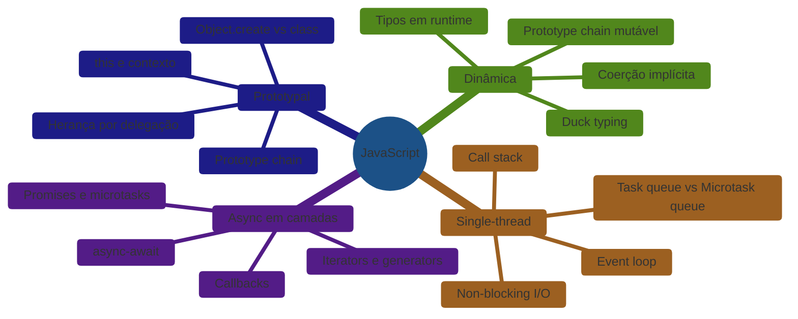
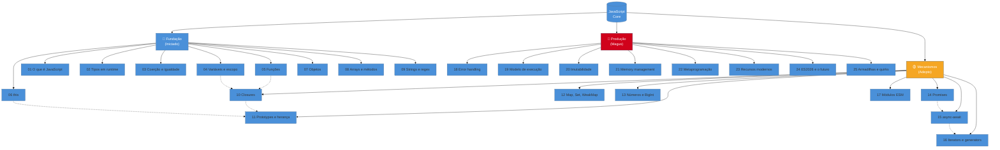

> [!abstract] TL;DR
> JavaScript é uma linguagem dinâmica, single-thread, prototypal, orientada a eventos — e a entrevista técnica é a prova de que você entende *por quê* cada uma dessas palavras importa, não só o que elas significam. Este capstone costura as 22 notas da trilha em um modelo mental unificado: o modelo de execução single-thread com call stack + event loop, a herança por prototype chain, a coerção de tipos em runtime, e o sistema de async construído em camadas sobre callbacks → Promises → async/await. Saber esses quatro eixos — e onde cada conceito da trilha se encaixa neles — é o que separa um candidato sênior de um que decora sintaxe.

---

Você chegou ao fim de uma jornada que começou com "o que é JavaScript?" e terminou com gerenciamento de memória, Proxy/Reflect e generators. Ao longo de 22 notas, a trilha não ensinou API para copiar da MDN — ela ensinou *mecanismo*: por que `this` muda dependendo de como a função é chamada, por que `0.1 + 0.2 !== 0.3`, por que uma Promise não executa no microtask queue da mesma forma que um `setTimeout`.

Este capstone não é um resumo. É o mapa que conecta os pontos — o modelo mental que você vai usar quando o entrevistador perguntar "me explica o event loop" e você quiser ir além da resposta decorada.

---

## O modelo mental unificado

JavaScript tem quatro características que definem *tudo* sobre como a linguagem se comporta. Entender as quatro — e como elas interagem — é o núcleo do que um sênior sabe que um júnior ainda está construindo.



**Dinâmica** significa que os tipos existem em runtime, não em compile time. `typeof null === "object"` não é um bug de sintaxe — é uma decisão de runtime que ficou. Coerção acontece porque o engine converte tipos para fazer operações funcionar. Isso explica por que `"5" - 3 === 2` (subtração converte para número) mas `"5" + 3 === "53"` (adição prefere string).

**Single-thread** significa que há uma única call stack executando JavaScript por vez. A sensação de "paralelo" vem do event loop: o engine delega I/O para as APIs do browser/Node, e quando a resposta chega, o callback entra na task queue para ser processado quando a stack estiver vazia. Microtasks (Promises) têm prioridade sobre macrotasks (setTimeout) — e entender essa ordem é o que explica comportamentos contraintuitivos em código async.

**Prototypal** significa que herança é delegação, não cópia. Quando você acessa `objeto.propriedade`, o engine sobe a prototype chain buscando onde aquela propriedade existe. A sintaxe `class` do ES6 é açúcar sintático — por baixo, é prototype chain. Isso explica por que `this` é dinâmico: ele não é capturado na definição da função, mas resolvido no momento da chamada.

**Async em camadas** é a evolução histórica que ainda aparece em código de produção: callbacks foram a primeira solução, Promises organizaram o fluxo, async/await tornou o código legível, e generators/iterators deram controle fino sobre sequências assíncronas.

---

## Mapa da trilha por fase

### Iniciado — A fundação

Estas notas constroem o vocabulário básico. Sem elas, o resto não faz sentido.

| # | Nota | O que ensina |
|---|------|--------------|
| 01 | [[03-Dominios/Tecnologia/JavaScript/01 - O que é JavaScript\|O que é JavaScript]] | Origem, engines, ECMAScript vs JavaScript, o modelo mental inicial |
| 02 | [[03-Dominios/Tecnologia/JavaScript/02 - Tipos em runtime\|Tipos em runtime]] | Os 8 tipos, `typeof`, `null` vs `undefined`, duck typing |
| 03 | [[03-Dominios/Tecnologia/JavaScript/03 - Coerção e igualdade\|Coerção e igualdade]] | `==` vs `===`, Abstract Equality Comparison, quando coerção acontece |
| 04 | [[03-Dominios/Tecnologia/JavaScript/04 - Variáveis e escopo\|Variáveis e escopo]] | `var`/`let`/`const`, hoisting, TDZ, escopo léxico |
| 05 | [[03-Dominios/Tecnologia/JavaScript/05 - Funções\|Funções]] | Declaração vs expressão, arrow functions, IIFE, parâmetros rest/spread |
| 06 | [[03-Dominios/Tecnologia/JavaScript/06 - this\|this]] | Como `this` é resolvido: call site, bind/call/apply, arrow vs regular |
| 07 | [[03-Dominios/Tecnologia/JavaScript/07 - Objetos\|Objetos]] | Criação, descritores de propriedade, spread, Optional chaining |
| 08 | [[03-Dominios/Tecnologia/JavaScript/08 - Arrays e métodos\|Arrays e métodos]] | map/filter/reduce, flatMap, sort estável, desestruturação |
| 09 | [[03-Dominios/Tecnologia/JavaScript/09 - Strings, template literals e regex\|Strings, template literals e regex]] | Imutabilidade de strings, tagged templates, regex grupos |

### Adepto — Os mecanismos internos

Onde a linguagem revela por que funciona do jeito que funciona.

| # | Nota | O que ensina |
|---|------|--------------|
| 10 | [[03-Dominios/Tecnologia/JavaScript/10 - Closures\|Closures]] | Lexical environment, por que closures "lembram", módulo pattern |
| 11 | [[03-Dominios/Tecnologia/JavaScript/11 - Prototypes e herança\|Prototypes e herança]] | `[[Prototype]]`, `Object.create`, `class` como açúcar sintático |
| 12 | [[03-Dominios/Tecnologia/JavaScript/12 - Map, Set, WeakMap, WeakSet\|Map, Set, WeakMap, WeakSet]] | Quando usar Map vs object, referências fracas, casos de uso reais |
| 13 | [[03-Dominios/Tecnologia/JavaScript/13 - Números, BigInt e precisão\|Números, BigInt e precisão]] | IEEE 754, por que `0.1+0.2≠0.3`, BigInt para inteiros grandes |
| 14 | [[03-Dominios/Tecnologia/JavaScript/14 - Promises\|Promises]] | Estados, microtask queue, encadeamento, `Promise.all/race/allSettled` |
| 15 | [[03-Dominios/Tecnologia/JavaScript/15 - async-await\|async/await]] | Açúcar sobre Promises, tratamento de erro, `await` em loops |
| 16 | [[03-Dominios/Tecnologia/JavaScript/16 - Iterators e generators\|Iterators e generators]] | Protocol iterator, `function*`, lazy evaluation |
| 17 | [[03-Dominios/Tecnologia/JavaScript/17 - Módulos ESM\|Módulos ESM]] | `import`/`export`, análise estática, ESM vs CommonJS, tree-shaking |

### Magus — Controle e produção

O nível que diferencia quem escreve código de quem entende o que o código faz.

| # | Nota | O que ensina |
|---|------|--------------|
| 18 | [[03-Dominios/Tecnologia/JavaScript/18 - Error handling\|Error handling]] | Hierarquia de Error, `cause`, propagação em async, erro tipado |
| 19 | [[03-Dominios/Tecnologia/JavaScript/19 - Modelo de execução a fundo\|Modelo de execução a fundo]] | Call stack, heap, event loop, task vs microtask, `queueMicrotask` |
| 20 | [[03-Dominios/Tecnologia/JavaScript/20 - Cópia, serialização e imutabilidade\|Cópia, serialização e imutabilidade]] | Shallow vs deep copy, `structuredClone`, `Object.freeze`, imutabilidade |
| 21 | [[03-Dominios/Tecnologia/JavaScript/21 - Memory management\|Memory management]] | GC, reachability, vazamentos comuns (closures, event listeners, timers) |
| 22 | [[03-Dominios/Tecnologia/JavaScript/22 - Metaprogramação\|Metaprogramação]] | Proxy, Reflect, Symbol, `Symbol.iterator`, interceptação de operações |
| 23 | [[03-Dominios/Tecnologia/JavaScript/23 - Recursos modernos (ES2020 a ES2025)\|Recursos modernos (ES2020–ES2025)]] | Optional chaining, nullish coalescing, `at()`, `Object.groupBy`, top-level await |
| 24 | [[03-Dominios/Tecnologia/JavaScript/24 - ES2026 e o futuro\|ES2026 e o futuro]] | Pipeline operator, `Error.isError`, `RegExp.escape`, o que está no Stage 3/4 |
| 25 | [[03-Dominios/Tecnologia/JavaScript/25 - Armadilhas e quirks\|Armadilhas e quirks]] | Os comportamentos mais surpreendentes da linguagem reunidos em um atlas de armadilhas |

---

## Banco de perguntas de entrevista

### Fundamentos e tipos

**"Qual a diferença entre `null` e `undefined`?"**
`undefined` é o valor padrão de variáveis declaradas mas não inicializadas — o engine atribui. `null` é ausência intencional, atribuída pelo programador. O único caso onde `==` é aceitável: `x == null` captura ambos sem coerção estranha. Aprofunda em [[03-Dominios/Tecnologia/JavaScript/02 - Tipos em runtime|Tipos em runtime]].

**"Por que `0.1 + 0.2 !== 0.3`?"**
JavaScript usa IEEE 754 double-precision. `0.1` e `0.2` não têm representação exata em binário — a soma acumula erro de arredondamento. Para comparações financeiras, use `Math.round(valor * 100) / 100` ou bibliotecas como `decimal.js`. Veja [[03-Dominios/Tecnologia/JavaScript/13 - Números, BigInt e precisão|Números, BigInt e precisão]].

**"Explique o que é coerção e quando ela é problemática."**
Coerção é a conversão implícita de tipos que o engine faz para executar operações. É problemática quando `+` concatena strings em vez de somar (`"5" + 3 === "53"`), ou quando `==` compara após conversão surpreendente (`[] == false`). Regra: use `===` sempre, exceto `== null`. Veja [[03-Dominios/Tecnologia/JavaScript/03 - Coerção e igualdade|Coerção e igualdade]].

### Escopo, closures e `this`

**"O que é closure e qual problema ela resolve?"**
Closure é a capacidade de uma função acessar variáveis do escopo onde foi *definida*, mesmo depois que aquele escopo encerrou. Resolve encapsulamento sem classes: a variável privada só existe na closure. O módulo pattern clássico é construído inteiro sobre closures. Veja [[03-Dominios/Tecnologia/JavaScript/10 - Closures|Closures]].

**"Como `this` é determinado em JavaScript?"**
`this` não é capturado na definição — é resolvido no call site. Quatro regras em ordem de precedência: (1) `new` binding; (2) explicit binding via `call`/`apply`/`bind`; (3) implicit binding — o objeto antes do ponto; (4) default binding — `undefined` em strict mode, `globalThis` fora. Arrow functions são exceção: herdam `this` do escopo léxico e não podem ser rebinadas. Veja [[03-Dominios/Tecnologia/JavaScript/06 - this|this]].

**"Qual a diferença entre `var`, `let` e `const`?"**
`var` tem escopo de função e é hoisted com valor `undefined`. `let` e `const` têm escopo de bloco e entram na Temporal Dead Zone (TDZ) — acessá-los antes da declaração lança `ReferenceError`, não retorna `undefined`. `const` impede reassignment, não mutação do valor. Veja [[03-Dominios/Tecnologia/JavaScript/04 - Variáveis e escopo|Variáveis e escopo]].

### Prototypes e herança

**"Como funciona herança prototypal? Como difere de herança clássica?"**
Em herança clássica, a classe é um molde — o objeto criado é uma cópia. Em herança prototypal, objetos delegam para outros objetos via `[[Prototype]]`. Quando você acessa `obj.método`, o engine sobe a chain até encontrar ou retornar `undefined`. A sintaxe `class` é açúcar sintático sobre isso — não há classes reais. Vantagem: você pode mudar o prototype em runtime; desvantagem: a mutabilidade exige cuidado. Veja [[03-Dominios/Tecnologia/JavaScript/11 - Prototypes e herança|Prototypes e herança]].

### Event loop e async

**"Explique o event loop e por que JavaScript não bloqueia."**
JavaScript tem uma única call stack. Operações I/O são delegadas às APIs da plataforma (browser/Node). Quando completam, o callback vai para a task queue. O event loop monitora: se a call stack está vazia, move o próximo item da queue para a stack. Microtasks (Promises, `queueMicrotask`) têm fila própria e são processadas *antes* da próxima macrotask — por isso `.then()` roda antes de `setTimeout(..., 0)`. Veja [[03-Dominios/Tecnologia/JavaScript/19 - Modelo de execução a fundo|Modelo de execução a fundo]].

**"Qual a diferença entre `Promise.all` e `Promise.allSettled`?"**
`Promise.all` rejeita imediatamente se *qualquer* promise rejeitar (fail-fast). `Promise.allSettled` espera todas terminarem e retorna um array com o status de cada uma — ideal quando você quer processar resultados parciais mesmo com falhas. Use `Promise.all` para dependência mútua; `allSettled` para operações independentes onde falhas parciais são aceitáveis. Veja [[03-Dominios/Tecnologia/JavaScript/14 - Promises|Promises]].

**"Quando usar async/await em loop? Qual a armadilha?"**
`forEach` não funciona com async — o callback é chamado sem aguardar a promise. Use `for...of` para execução sequencial ou `Promise.all(array.map(...))` para paralela. A escolha importa: sequencial gasta mais tempo mas evita sobrecarga; paralelo é mais rápido mas pode sobrecarregar a API chamada. Veja [[03-Dominios/Tecnologia/JavaScript/15 - async-await|async/await]].

### Módulos e metaprogramação

**"Qual a diferença entre ESM e CommonJS?"**
ESM (`import`/`export`) é analisado estaticamente — o bundler sabe o grafo de dependências antes de executar, permitindo tree-shaking. CommonJS (`require`) é dinâmico — pode-se fazer `require` condicional, mas o bundler não consegue eliminar código morto com a mesma precisão. ESM tem `top-level await`; CommonJS não. Veja [[03-Dominios/Tecnologia/JavaScript/17 - Módulos ESM|Módulos ESM]].

**"O que é um Proxy e quando você usaria?"**
`Proxy` intercepta operações fundamentais em objetos: leitura, escrita, deleção, chamada de função. Casos de uso reais: validação reativa (interceptar `set` para validar antes de atribuir), logging transparente, objetos observáveis (Vue 3 usa Proxy para reatividade), mocking em testes. O custo é overhead de runtime — não use sem necessidade. Veja [[03-Dominios/Tecnologia/JavaScript/22 - Metaprogramação|Metaprogramação]].

### Recursos modernos e armadilhas

**"O que é optional chaining e qual armadilha ela esconde?"**
`?.` curto-circuita a expressão para `undefined` se o operando esquerdo for `null` ou `undefined`. O risco: silencia erros legítimos — se `user?.address.city` retorna `undefined`, você não sabe se `user` é nulo ou se `address` não tem `city`. Em código crítico, prefira checar a presença do objeto antes de acessar propriedades aninhadas. Veja [[03-Dominios/Tecnologia/JavaScript/23 - Recursos modernos (ES2020 a ES2025)|Recursos modernos (ES2020–ES2025)]].

**"Qual a diferença entre `??` (nullish coalescing) e `||`?"**
`||` usa o valor direito quando o esquerdo é *falsy* — isso inclui `0`, `""` e `false`, o que frequentemente não é o que você quer. `??` usa o valor direito *somente* quando o esquerdo é `null` ou `undefined`. Para valores default de configuração (onde `0` ou `""` são válidos), `??` é o correto. Veja [[03-Dominios/Tecnologia/JavaScript/23 - Recursos modernos (ES2020 a ES2025)|Recursos modernos (ES2020–ES2025)]].

---

## Decision points — o que um sênior sabe

Estas não são regras decoradas. São julgamentos construídos com entendimento do mecanismo.

### Map vs Object

Use `Map` quando: as chaves não são strings fixas em compile time; você precisa preservar ordem de inserção garantida; o tamanho muda frequentemente (Map tem performance melhor para insert/delete repetidos); as chaves são objetos ou outros valores não-string.

Use `Object` quando: as chaves são strings conhecidas; você usa desestruturação ou spread; o objeto é serializado para JSON; a estrutura é estática e serve como "record".

```js
// Object: chaves fixas, estrutura de dados
const config = { host: "localhost", port: 3000 };

// Map: chaves dinâmicas, frequentemente modificado
const cache = new Map();
cache.set(requestObject, response); // chave = objeto
```

### `==` nunca, exceto `== null`

A única exceção legítima para `==` é `value == null`, que captura tanto `null` quanto `undefined` sem coerção surpreendente. Qualquer outro uso de `==` exige que você conheça a Abstract Equality Comparison de cor — e não vale a confusão que gera ao leitor.

```js
// NUNCA
if (x == "") { }        // "" == false == 0... impossível prever
if (arr.length == false) { } // length 0 == false: surpresa

// ÚNICO caso aceitável
if (value == null) { }  // captura null E undefined, correto e idiomático
```

### Async paralelo vs sequencial

```js
// Sequencial: uma espera a outra — total = soma dos tempos
const a = await fetchA();
const b = await fetchB(); // só começa quando fetchA termina

// Paralelo: disparam juntas — total = máximo dos tempos
const [a, b] = await Promise.all([fetchA(), fetchB()]);

// Quando usar sequencial: fetchB depende do resultado de fetchA
// Quando usar paralelo: operações independentes
```

A regra simples: se B não usa o resultado de A, use paralelo.

### Imutabilidade: quando e como

`Object.freeze` congela o objeto superficialmente — propriedades aninhadas ainda são mutáveis. Para imutabilidade profunda, use `structuredClone` + `Object.freeze` recursivo, ou bibliotecas como Immer. O padrão mais comum em produção é tratar objetos como imutáveis por convenção (retornar cópias via spread) sem `freeze` — que adiciona overhead e não garante imutabilidade profunda de qualquer forma.

```js
// Shallow freeze — não protege objetos aninhados
const config = Object.freeze({ db: { host: "localhost" } });
config.db.host = "hacked"; // funciona! db não está frozen

// Copiar em vez de mutar (padrão idiomático)
const updated = { ...state, count: state.count + 1 };
```

### Quando closures causam vazamento de memória

Closures mantêm vivo o lexical environment inteiro, não só as variáveis que usam. Se uma closure captura acidentalmente um objeto grande (ou mantém referência para o DOM), o GC não pode coletar. Padrões de risco: event listeners não removidos que capturam `this`; timers (`setInterval`) que mantêm referência ao escopo; closures criadas em loop que capturam o escopo do loop.

```js
// Vazamento: listener não removido captura elemento DOM grande
function init() {
  const bigData = loadBigData();
  document.addEventListener("click", () => {
    console.log(bigData.length); // bigData nunca é coletado
  });
}

// Correto: remover quando não precisar mais
const handler = () => console.log(bigData.length);
document.addEventListener("click", handler);
// ... depois:
document.removeEventListener("click", handler);
```

---

## Como explicar em inglês

Estas frases são construídas para entrevistas técnicas em inglês — naturais, não traduzidas literalmente.

**Event loop:**
> "JavaScript is single-threaded, so it has one call stack. The event loop watches that stack — when it's empty, it picks the next callback from the task queue and pushes it. Microtasks, like Promise callbacks, have a higher-priority queue that's drained completely before the next macrotask runs."

**Closures:**
> "A closure is when a function retains access to its outer lexical scope even after that scope has returned. It's not a copy of the variables — it's a live reference to the environment. That's how module patterns work: the inner function 'closes over' private state that nothing outside can touch."

**`this`:**
> "In JavaScript, `this` isn't captured at function definition — it's resolved at call time based on four rules: new binding, explicit binding via call/apply/bind, implicit binding from the dot notation, and default binding. Arrow functions are the exception: they inherit `this` from their enclosing lexical scope and can't be rebound."

**Prototypal inheritance:**
> "JavaScript doesn't have classes in the classical sense — it has prototype chains. When you access a property, the engine walks up the chain until it finds it or hits null. The `class` syntax is syntactic sugar over this mechanism, which means you can still inspect and even modify the prototype at runtime."

**Coercion:**
> "JavaScript is dynamically typed and will try to coerce types to make operations work. The `+` operator with a string will concatenate instead of add. The rule I follow: always use triple equals, because it doesn't trigger coercion. The only exception is `value == null`, which cleanly checks for both null and undefined."

**async/await:**
> "async/await is syntax sugar over Promises — an async function returns a Promise, and await pauses execution inside that function until the Promise settles. The key thing is that it doesn't block the thread — the call stack is free while waiting, and the continuation runs as a microtask when the Promise resolves."

| PT | EN |
|----|----|
| Fila de microtarefas | Microtask queue |
| Cadeia de protótipos | Prototype chain |
| Coerção implícita | Implicit coercion |
| Escopo léxico | Lexical scope |
| Referência fraca | Weak reference |
| Delegação (herança) | Delegation |
| Modelo de execução | Execution model |
| Pilha de chamadas | Call stack |
| Associação de contexto | Context binding |
| Herança por protótipo | Prototypal inheritance |
| Avaliação preguiçosa | Lazy evaluation |
| Ligação explícita | Explicit binding |

---

## Armadilhas comuns

> [!warning] `typeof null === "object"`
> **O que acontece:** código que testa `typeof value === "object"` para verificar se é objeto passa também para `null`.
> **Por quê:** decisão histórica do JavaScript que não foi corrigida para não quebrar compatibilidade.
> **Como evitar:** sempre use `value !== null && typeof value === "object"` para verificar objeto real.

> [!warning] `this` perdido em callbacks
> **O que acontece:** método passado como callback perde o `this` do objeto original — o contexto é determinado por quem chama, não por quem definiu.
> **Por quê:** `this` é resolvido no call site. Quando a função é passada como argumento, o call site é o invocador externo, não o objeto original.
> **Como evitar:** use arrow function (`onClick={() => this.handle()}`) ou bind explícito (`this.handle.bind(this)`).

> [!warning] `async` em `forEach` não funciona como esperado
> **O que acontece:** `array.forEach(async fn)` dispara todas as promises mas não espera nenhuma — o `forEach` retorna `undefined`, não uma promise.
> **Por quê:** `forEach` ignora o retorno do callback; não há mecanismo de agregação de promises.
> **Como evitar:** use `for...of` para sequencial, `Promise.all(array.map(async fn))` para paralelo.

> [!warning] Closure em loop com `var`
> **O que acontece:** `for (var i = 0; i < 3; i++) { setTimeout(() => console.log(i)) }` imprime `3, 3, 3`, não `0, 1, 2`.
> **Por quê:** `var` tem escopo de função — todas as closures compartilham a *mesma* variável `i`, que é 3 quando os callbacks executam.
> **Como evitar:** use `let` (cria novo binding por iteração) ou IIFE para capturar o valor.

> [!warning] Modificar objeto recebido como argumento
> **O que acontece:** funções que mutam objetos recebidos criam efeitos colaterais invisíveis — o chamador não espera que seu objeto seja modificado.
> **Por quê:** objetos são passados por referência em JavaScript — a função recebe a *mesma* referência, não uma cópia.
> **Como evitar:** crie uma cópia no início (`const copy = { ...obj }`) ou documente explicitamente que a função é destrutiva.

> [!warning] `Promise.all` falha rápido sem tratar as outras
> **O que acontece:** se uma promise rejeitar em `Promise.all`, o resultado rejeita imediatamente — mas as outras promises *continuam executando* (não são canceladas).
> **Por quê:** Promises em JavaScript não têm cancelamento nativo. `Promise.all` apenas muda o resultado, não para as operações em andamento.
> **Como evitar:** use `Promise.allSettled` quando precisar do resultado de todas, mesmo com falhas parciais.

---

## Mapa mental da trilha



---

## Roteiro de revisão pré-entrevista

Este roteiro pressupõe 3 dias antes de uma entrevista técnica focada em JavaScript. Adapte a intensidade ao tempo disponível.

### Dia 1 — Fundação e mecanismos internos (o que mais cai)

O objetivo do dia 1 é solidificar os conceitos que aparecem em 80% das entrevistas JS. Não se apresse — entenda o *mecanismo*, não decore a resposta.

**Manhã (2-3h): tipos, coerção e escopo**
- Revise [[03-Dominios/Tecnologia/JavaScript/02 - Tipos em runtime|Tipos em runtime]]: saiba os 8 tipos de cor, o que `typeof` retorna para cada um, e por que `typeof null === "object"`.
- Revise [[03-Dominios/Tecnologia/JavaScript/03 - Coerção e igualdade|Coerção e igualdade]]: trace mentalmente `[] == false` passo a passo pela Abstract Equality Comparison. Se conseguir fazer isso, você entende coerção.
- Revise [[03-Dominios/Tecnologia/JavaScript/04 - Variáveis e escopo|Variáveis e escopo]]: saiba explicar TDZ com um exemplo de código que lança `ReferenceError`.

**Tarde (2-3h): funções, closures e `this`**
- Revise [[03-Dominios/Tecnologia/JavaScript/05 - Funções|Funções]]: diferença entre declaração e expressão, como hoisting afeta cada uma.
- Revise [[03-Dominios/Tecnologia/JavaScript/10 - Closures|Closures]]: escreva um módulo pattern do zero — sem olhar. Se travar, releia a nota.
- Revise [[03-Dominios/Tecnologia/JavaScript/06 - this|this]]: as quatro regras de resolução em ordem de precedência. Pratique explicar oralmente como se estivesse numa entrevista.

**Exercício de fixação:** sem olhar as notas, explique em inglês o que é closure e por que `this` em um método callback perde o contexto. Grave em áudio se possível — você ouvirá onde a explicação trava.

### Dia 2 — Async, prototypes e coleções

**Manhã (2-3h): prototype chain e herança**
- Revise [[03-Dominios/Tecnologia/JavaScript/11 - Prototypes e herança|Prototypes e herança]]: desenhe numa folha a prototype chain de `class Dog extends Animal`. Confirme onde `toString` está — no `Object.prototype`.
- Revise [[03-Dominios/Tecnologia/JavaScript/07 - Objetos|Objetos]]: descritores de propriedade (`writable`, `enumerable`, `configurable`). Saber que `Object.defineProperty` existe e o que faz separa Adepto de Magus.
- Revise [[03-Dominios/Tecnologia/JavaScript/12 - Map, Set, WeakMap, WeakSet|Map, Set, WeakMap, WeakSet]]: saiba articular quando usar Map vs Object em uma frase.

**Tarde (2-3h): async**
- Revise [[03-Dominios/Tecnologia/JavaScript/14 - Promises|Promises]]: saiba os três estados e o que cada método de `Promise` faz (`all`, `allSettled`, `race`, `any`).
- Revise [[03-Dominios/Tecnologia/JavaScript/15 - async-await|async/await]]: escreva de cabeça um try/catch com async/await que trata erro de rede e erro de parsing JSON separadamente.
- Revise [[03-Dominios/Tecnologia/JavaScript/19 - Modelo de execução a fundo|Modelo de execução a fundo]]: trace a ordem de execução de `console.log(1); setTimeout(() => console.log(2)); Promise.resolve().then(() => console.log(3)); console.log(4)`. Resposta: 1, 4, 3, 2. Saber *por quê* é o ponto.

### Dia 3 — Magus e simulação de entrevista

**Manhã (1-2h): tópicos avançados**
- Revise [[03-Dominios/Tecnologia/JavaScript/20 - Cópia, serialização e imutabilidade|Cópia, serialização e imutabilidade]]: saiba a diferença entre shallow e deep copy e quando `structuredClone` é a escolha certa.
- Revise [[03-Dominios/Tecnologia/JavaScript/21 - Memory management|Memory management]]: três padrões de vazamento. Se você sabe identificar, você sabe evitar.
- Revise [[03-Dominios/Tecnologia/JavaScript/17 - Módulos ESM|Módulos ESM]]: por que `import` estático permite tree-shaking e `require` dinâmico não.

**Tarde (2h): simulação**
- Responda em voz alta cada pergunta do banco acima como se estivesse ao vivo.
- Foque nas "Como explicar em inglês" — fluência técnica em inglês é habilidade diferente de saber o conceito.
- Revise as armadilhas comuns: `async` em `forEach`, `this` perdido em callbacks, closure em loop com `var`.

> [!question]- O que fazer se o entrevistador perguntar algo que você não sabe?
> Diga exatamente isso: "Não tenho certeza do detalhe, mas pelo que entendo do mecanismo, eu esperaria que...". Mostrar raciocínio a partir de primeiros princípios impressiona mais do que uma resposta decorada que você não consegue defender.

---

## Onde esta trilha se conecta

JavaScript core é o núcleo — as outras tecnologias são camadas sobre ele. A decisão de onde aprofundar depende do seu contexto:

- **[[03-Dominios/Tecnologia/TypeScript/index|TypeScript]]** — adiciona tipos estáticos sobre JS. O conhecimento de coerção, prototype chain e módulos ESM que você construiu aqui é prerequisito para entender *onde* o TypeScript ajuda e onde ele não resolve.
- **[[03-Dominios/Tecnologia/Node/index|Node]]** — JS no servidor. O event loop que você estudou na nota 19 é o mesmo que faz o Node escalar I/O. Streams, Worker Threads e módulos CommonJS vs ESM fazem mais sentido com o modelo mental desta trilha.
- **[[03-Dominios/Tecnologia/React/index|React]]** — UI declarativa. Closures (nota 10) explicam por que hooks funcionam; a imutabilidade (nota 20) explica por que você nunca muta estado diretamente; Promises (nota 14) são a base de `useEffect` com async.
- **[[03-Dominios/Tecnologia/Tooling e Build/index|Tooling e Build]]** — bundlers, tree-shaking, transpilação. O entendimento de ESM (nota 17) é direto ao ponto para entender o que um bundler faz e por que `import` estático é necessário para tree-shaking funcionar.

O [[Dicionário de JavaScript]] mantém os termos canônicos da trilha — consulte para confirmar nomenclatura em inglês antes de entrevistas.

---

## Padrões de código para entrevista

Um sênior não só sabe o conceito — consegue escrever código limpo, idiomático e correto na hora. Estes padrões são os mais pedidos.

### Debounce do zero

Pedido frequente em entrevistas de frontend — testa closures, timers e `this`.

```js
function debounce(fn, delay) {
  let timerId;
  return function (...args) {
    clearTimeout(timerId);
    timerId = setTimeout(() => fn.apply(this, args), delay);
  };
}

// Por que funciona: a função retornada fecha sobre `timerId` (closure).
// Cada chamada cancela o timer anterior e cria um novo.
// `fn.apply(this, args)` preserva o contexto e os argumentos originais.
```

### Memoização genérica

Testa closures, Map e pensamento sobre cache.

```js
function memoize(fn) {
  const cache = new Map();
  return function (...args) {
    const key = JSON.stringify(args);
    if (cache.has(key)) return cache.get(key);
    const result = fn.apply(this, args);
    cache.set(key, result);
    return result;
  };
}

// Atenção: JSON.stringify não diferencia funções ou objetos com referências circulares.
// Em produção: use WeakMap para argumentos-objeto ou biblioteca especializada.
```

### Deep clone sem biblioteca

```js
// Moderno — funciona em 2024+
const clone = structuredClone(original);

// Limitações do structuredClone: não clona funções, Symbols, getters/setters.
// Para esses casos, você precisa de implementação recursiva ou Lodash cloneDeep.

// Alternativa recursiva simples (ignora casos especiais):
function deepClone(value) {
  if (value === null || typeof value !== "object") return value;
  if (Array.isArray(value)) return value.map(deepClone);
  return Object.fromEntries(
    Object.entries(value).map(([k, v]) => [k, deepClone(v)])
  );
}
```

### Encadeamento de Promises com tratamento de erro granular

```js
async function fetchWithRetry(url, retries = 3) {
  for (let attempt = 1; attempt <= retries; attempt++) {
    try {
      const response = await fetch(url);
      if (!response.ok) {
        throw new Error(`HTTP ${response.status}`, { cause: response });
      }
      return await response.json();
    } catch (err) {
      if (attempt === retries) throw err; // último retry: propaga
      await new Promise(r => setTimeout(r, 200 * attempt)); // backoff
    }
  }
}

// Pontos que o entrevistador vai notar:
// - `cause` no Error (ES2022) para preservar contexto original
// - backoff exponencial simples (200ms, 400ms, 600ms)
// - último retry propaga o erro em vez de engolir
```

### Implementar `Promise.all` do zero

Pedido clássico — testa entendimento de Promises e contadores.

```js
function promiseAll(promises) {
  return new Promise((resolve, reject) => {
    const results = [];
    let remaining = promises.length;

    if (remaining === 0) return resolve(results);

    promises.forEach((promise, index) => {
      Promise.resolve(promise).then(value => {
        results[index] = value; // preserva ordem
        if (--remaining === 0) resolve(results);
      }, reject); // rejeita imediatamente se qualquer uma falhar
    });
  });
}
```

### Event emitter minimalista

Testa objetos, closures e o padrão pub/sub.

```js
class EventEmitter {
  #listeners = new Map();

  on(event, fn) {
    if (!this.#listeners.has(event)) this.#listeners.set(event, []);
    this.#listeners.get(event).push(fn);
    return () => this.off(event, fn); // retorna unsubscribe
  }

  off(event, fn) {
    const fns = this.#listeners.get(event) ?? [];
    this.#listeners.set(event, fns.filter(f => f !== fn));
  }

  emit(event, ...args) {
    (this.#listeners.get(event) ?? []).forEach(fn => fn(...args));
  }
}

// Private fields (#) — evita que código externo acesse _listeners diretamente.
// on() retorna função de unsubscribe — padrão do React useEffect.
```

---

## Casos práticos

Saber o mecanismo é necessário; saber aplicá-lo em situações reais é o que o entrevistador quer ver. Cada cenário abaixo é uma situação de produção com causa raiz, diagnóstico e solução idiomática.

### Cenário 1 — Refactor de callback hell para async/await numa feature de checkout

**Contexto:** feature de checkout num e-commerce legado. O fluxo original: validar estoque → reservar item → cobrar cartão → enviar e-mail de confirmação. O código estava assim:

```js
// ANTES: callback hell — difícil de ler, tratar erro é pesadelo
function checkout(cartId, cardToken, cb) {
  validateStock(cartId, function(err, stockOk) {
    if (err) return cb(err);
    if (!stockOk) return cb(new Error("Fora de estoque"));
    reserveItem(cartId, function(err, reservation) {
      if (err) return cb(err);
      chargeCard(cardToken, reservation.total, function(err, charge) {
        if (err) {
          // E agora? O item foi reservado mas o pagamento falhou.
          // Rollback aqui seria outro callback aninhado.
          return cb(err);
        }
        sendConfirmationEmail(charge.orderId, function(err) {
          if (err) console.warn("E-mail falhou, mas pedido OK:", err);
          cb(null, charge.orderId);
        });
      });
    });
  });
}
```

O problema além da legibilidade: rollback em caso de falha de pagamento exigiria mais um nível de aninhamento, e o tratamento de erro estava espalhado.

```js
// DEPOIS: async/await com tratamento de erro explícito e rollback limpo
async function checkout(cartId, cardToken) {
  const stockOk = await validateStock(cartId);
  if (!stockOk) throw new Error("Fora de estoque", { cause: { cartId } });

  const reservation = await reserveItem(cartId);

  let charge;
  try {
    charge = await chargeCard(cardToken, reservation.total);
  } catch (err) {
    // Rollback isolado: só chega aqui se o pagamento falhou após reserva
    await releaseReservation(reservation.id).catch(rollbackErr =>
      logger.error("Rollback falhou", { rollbackErr, reservation })
    );
    throw new Error("Falha no pagamento", { cause: err });
  }

  // E-mail é best-effort: falha não cancela o pedido
  await sendConfirmationEmail(charge.orderId).catch(err =>
    logger.warn("E-mail de confirmação falhou", { err, orderId: charge.orderId })
  );

  return charge.orderId;
}
```

**O que o refactor ganhou:** rollback isolado no bloco `try/catch` certo, sem aninhar callbacks; `cause` preserva o erro original para observabilidade; e-mail best-effort sem esconder a falha; código linear e legível como prose.

**Lição de entrevista:** quando perguntarem "como você migraria código legado de callbacks para async/await", este padrão — isolar etapas com rollback em try/catch granulares, e-mail/notificação como best-effort — demonstra entendimento operacional, não só conhecimento de sintaxe.

### Cenário 2 — Debug de memory leak num SPA de dashboard

**Contexto:** SPA de analytics com gráficos em tempo real. Após algumas horas de uso, o browser começava a travar. O heap crescia linearmente. Ferramentas: DevTools > Memory > Heap Snapshot.

**Diagnóstico:** ao comparar dois snapshots (antes e depois de navegar entre rotas), o heap mostrava acúmulo de objetos `ChartData` — instâncias que deveriam ser coletadas quando o componente desmontasse. A causa raiz:

```js
// Componente React (classe) — ANTES: vazamento
class RealtimeChart extends React.Component {
  componentDidMount() {
    // Problema 1: referência ao componente capturada no handler
    window.addEventListener("resize", () => {
      this.chart.resize(); // `this` mantém o componente vivo
    });

    // Problema 2: intervalo nunca cancelado na desmontagem
    this.intervalId = setInterval(() => {
      this.setState({ data: fetchLatestData() });
    }, 1000);
  }

  // componentWillUnmount ausente — nem o intervalo nem o listener são removidos
}
```

Todo componente desmontado mantinha: (1) uma referência via closure no `resize` listener que impedia o GC de coletar `this`; (2) um `setInterval` rodando para sempre, impedindo a coleta do estado.

```js
// DEPOIS: desmontagem limpa
class RealtimeChart extends React.Component {
  #resizeHandler = null;

  componentDidMount() {
    this.#resizeHandler = () => this.chart?.resize();
    window.addEventListener("resize", this.#resizeHandler);

    this.intervalId = setInterval(() => {
      if (this.chart) this.setState({ data: fetchLatestData() });
    }, 1000);
  }

  componentWillUnmount() {
    window.removeEventListener("resize", this.#resizeHandler);
    clearInterval(this.intervalId);
    this.chart = null; // quebra referência explicitamente
  }
}
```

**Regra de produção:** qualquer coisa que você registra em `componentDidMount` ou `useEffect` e que não é coletável automaticamente (listeners, timers, subscriptions) precisa de cleanup em `componentWillUnmount` / função de retorno do `useEffect`. Veja [[03-Dominios/Tecnologia/JavaScript/21 - Memory management|Memory management]].

**Lição de entrevista:** ao descrever o processo de debug, mencione: (1) Heap Snapshot antes/depois para identificar o que está crescendo; (2) verificar retainment path para descobrir *quem* mantém a referência; (3) a correção é sempre remover a referência, nunca apenas "não criar o objeto".

### Cenário 3 — Escolha Map vs Object num cache de alto volume

**Contexto:** serviço de resolução de permissões num SaaS multi-tenant. Para cada request, o serviço verificava se o usuário tinha acesso a um recurso. O cache inicial usava um objeto simples:

```js
// ANTES: Object como cache — problemas em alto volume
const permissionCache = {};

function hasPermission(userId, resourceId) {
  const key = `${userId}:${resourceId}`;
  if (permissionCache[key] !== undefined) {
    return permissionCache[key];
  }
  const result = checkPermissionInDB(userId, resourceId);
  permissionCache[key] = result;
  return result;
}
```

**Problemas identificados em produção:**
1. **Colisão com prototype:** se `userId:resourceId` formasse uma string como `"toString"` ou `"hasOwnProperty"`, `permissionCache[key]` retornaria a função do prototype, não `undefined`.
2. **Performance em insert/delete:** com milhares de entradas e rotação de cache (TTL), `delete permissionCache[key]` em objetos JS é menos eficiente do que `Map.delete`.
3. **Tamanho:** `Object.keys(permissionCache).length` percorre todas as chaves; `Map.size` é O(1).

```js
// DEPOIS: Map como cache — semântica correta e melhor performance em alto volume
const permissionCache = new Map();
const CACHE_TTL_MS = 60_000;

function hasPermission(userId, resourceId) {
  const key = `${userId}:${resourceId}`;
  const cached = permissionCache.get(key);
  if (cached !== undefined) return cached.value;

  const result = checkPermissionInDB(userId, resourceId);
  permissionCache.set(key, { value: result, expiresAt: Date.now() + CACHE_TTL_MS });
  return result;
}

// Limpeza periódica — trivial com Map.forEach
function evictExpired() {
  const now = Date.now();
  permissionCache.forEach((v, k) => {
    if (v.expiresAt < now) permissionCache.delete(k);
  });
}
```

**Quando Object ainda ganha:** se as chaves são conhecidas em compile time e a estrutura é estática (ex: `config` com campos fixos), Object é mais ergonômico — desestruturação, spread e JSON.stringify funcionam diretamente. Veja [[03-Dominios/Tecnologia/JavaScript/12 - Map, Set, WeakMap, WeakSet|Map, Set, WeakMap, WeakSet]].

**Lição de entrevista:** a pergunta "Map vs Object" é uma das mais frequentes em entrevistas sênior. A resposta que impressiona não é "use Map quando as chaves não são strings" — é articular os trade-offs operacionais: colisão com prototype, performance de mutação frequente, e o custo de `size` em objetos.

> [!tip] Vídeo recomendado — Event loop e performance assíncrona
> **Jake Archibald — "In the Loop"** (JSConf Asia 2018, 35 min)
> [https://www.youtube.com/watch?v=cCOL7MC4Pl0](https://www.youtube.com/watch?v=cCOL7MC4Pl0)
> A melhor explicação visual do event loop, task queue vs microtask queue e como o browser usa cada uma para rendering. Fundamental para entender por que `.then()` roda antes de `setTimeout(..., 0)` e como evitar jank de UI. Complementa diretamente as notas 14, 15 e 19 desta trilha.

---

## O que fica fora desta trilha

Honestidade intelectual: a trilha JavaScript core cobre a linguagem, não o ecossistema completo. Tópicos que um sênior fullstack precisa mas estão em outras trilhas:

- **APIs do browser** (DOM, Fetch, Web Workers, Service Workers) — Plataforma Web
- **Testing** (Vitest, Testing Library, MSW) — [[Testes em JavaScript]]
- **Bundlers e configuração** (Vite, Webpack, esbuild) — [[03-Dominios/Tecnologia/Tooling e Build/index|Tooling e Build]]
- **TypeScript** — [[03-Dominios/Tecnologia/TypeScript/index|TypeScript]]
- **Runtime Node.js** (streams, cluster, Worker Threads) — [[03-Dominios/Tecnologia/Node/index|Node]]
- **Frameworks** (React, Vue, etc.) — [[03-Dominios/Tecnologia/React/index|React]]
- **Validação de schema** em runtime — [[03-Dominios/Tecnologia/JavaScript/Validação/index|Validação]]

---

## Resumo em uma linha

> JavaScript em uma frase: uma linguagem dinâmica e single-thread que resolve concorrência com event loop, herança com prototype chain, e cujo runtime de coerção exige que você entenda os mecanismos para não ser surpreendido.

---

## Fontes

- **MDN Web Docs** — [*JavaScript Reference*](https://developer.mozilla.org/en-US/docs/Web/JavaScript/Reference) — referência autoritativa da linguagem, mantida por Mozilla com contribuições da comunidade
- **Kyle Simpson** — *You Don't Know JS* (série completa) — aprofundamento em coerção, closures, prototype, async; gratuito no GitHub
- **Jake Archibald** — [*Tasks, microtasks, queues and schedules*](https://jakearchibald.com/2015/tasks-microtasks-queues-and-schedules/) — a melhor explicação visual do event loop com interação step-by-step
- **V8 Blog** — [*Trash talk: the Orinoco garbage collector*](https://v8.dev/blog/trash-talk) — como o GC do V8 funciona, base para a nota 21
