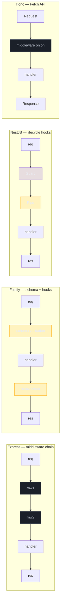

# Os 4 frameworks: Express, NestJS, Fastify, Hono

> [!abstract] TL;DR
> Em 2026, a decisão pragmática em Node passa por quatro modelos: Express (middleware-based e ubíquo), NestJS (opinativo, DI e decorators), Fastify (schema-first e performance), Hono (edge-first e Fetch API). Não existe campeão universal. Existe matching problema -> ferramenta.

## O que é

**Express** é o framework minimalista e "unopinionated" do ecossistema Node. A documentação oficial o descreve como uma camada fina de features web com uso forte de middleware; em 2026, Express 5.x é a linha corrente.

**NestJS** é um framework TypeScript opinativo para server-side apps escaláveis. O modelo central combina módulos, controllers, providers, decorators e um container de dependency injection.

**Fastify** é um framework HTTP focado em baixo overhead, plugin architecture e schemas. A própria documentação recomenda JSON Schema para validar rotas e serializar respostas.

**Hono** é um framework pequeno e multi-runtime baseado em Web Standards. Roda em Cloudflare Workers, Deno, Bun, AWS Lambda e Node, com API baseada em `Request`/`Response`.

## Por que importa

Confundir os modelos leva a escolhas caras. Usar NestJS em um microserviço simples pode introduzir DI e decorators sem retorno. Usar Express por hábito em um domínio enterprise grande pode deixar estrutura demais na disciplina individual de cada dev. Usar Fastify sem schema desperdiça o diferencial do framework. Usar Hono em app que depende profundamente de `fs`, `net` ou bibliotecas Node-only pode bater em constraints de edge.

## Como funciona

| Framework | Modelo | Use case típico | Maturidade | Trade-offs |
| --- | --- | --- | --- | --- |
| Express | Middleware-based, minimalista | Microsserviços simples, prototipagem, glue code | Maduro, v5.x | Pouca estrutura; precisa montar validation, DI e contracts manualmente |
| NestJS | Opinativo, DI, decorators | Apps enterprise, time grande, domínio complexo | Maduro, v10+ | Curva de aprendizado; overhead em apps simples |
| Fastify | Schema-first, performance-focused | APIs com contrato claro e throughput alto | Maduro, v5.x | Plugin encapsulation exige mental model; ecossistema menor que Express |
| Hono | Ultralight, edge-first, Fetch API | Edge workers, serverless, multi-runtime | Mais recente, v4+ | Ecossistema menor; edge limita APIs Node-specific |



```typescript
// Express 5
import express from "express";

const app = express();
app.get("/hello", (_req, res) => res.json({ greeting: "hello" }));
app.listen(3000);
```

```typescript
// NestJS
@Controller()
export class AppController {
  @Get("/hello")
  hello() {
    return { greeting: "hello" };
  }
}
```

```typescript
// Fastify
import Fastify from "fastify";

const app = Fastify();
app.get("/hello", async () => ({ greeting: "hello" }));
await app.listen({ port: 3000 });
```

```typescript
// Hono
import { Hono } from "hono";

const app = new Hono();
app.get("/hello", (c) => c.json({ greeting: "hello" }));
export default app;
```

## Casos práticos

- Microsserviço I/O-bound simples, time pequeno: Express ou Fastify.
- App enterprise, time grande, DI complexa: NestJS.
- API com schema bem definido e throughput alto: Fastify.
- Edge worker, serverless ou multi-runtime: Hono.
- Comparação detalhada: [[12 - Decision tree + cheatsheet]].

### Cenário 1 — Webhook receiver

Imagine uma API que recebe webhooks de Stripe/GitHub, valida assinatura, grava evento bruto e responde rápido. O domínio é pequeno, o throughput é moderado e o risco principal é latência/timeout do provedor. Express resolve bem se o time já conhece o ecossistema; Fastify ganha se schema e serialização forem parte central do contrato.

```typescript
// Express: simples, explícito, bom para glue code.
app.post("/webhooks/github", verifyGithubSignature, async (req, res) => {
  await inbox.save({ source: "github", payload: req.body });
  res.status(202).json({ accepted: true });
});
```

```typescript
// Fastify: contrato explícito na rota — schema valida e serializa.
app.post("/webhooks/github", {
  schema: {
    body: GithubWebhookSchema,
    response: { 202: AcceptedSchema },
  },
}, async (req, reply) => {
  await inbox.save({ source: "github", payload: req.body });
  return reply.code(202).send({ accepted: true });
});
```

### Cenário 2 — Produto enterprise com módulos

Imagine um backend com billing, usuários, permissões, auditoria, integrações e jobs internos. O problema já não é só "servir HTTP"; é manter boundaries por feature, lifecycle, DI, testes e composição de concerns. NestJS fica mais atraente porque força uma gramática comum.

```typescript
@Module({
  imports: [BillingModule, IdentityModule, AuditModule],
  controllers: [InvoicesController],
  providers: [CreateInvoiceUseCase, InvoicePolicy],
})
export class InvoicesModule {}
```

O custo é real: decorators, módulos, providers e scopes precisam ser aprendidos. Mas, em time maior, convenção compartilhada frequentemente vale mais do que liberdade local.

### Cenário 3 — Edge API com KV store

Se o requisito é responder perto do usuário em Cloudflare Workers, Deno Deploy ou runtime similar, a pergunta muda. Express e NestJS assumem Node HTTP; Hono assume Web Standards.

```typescript
const app = new Hono<{ Bindings: { KV: KVNamespace } }>();

app.get("/flags/:userId", async (c) => {
  // c.env.KV é binding do runtime — não existe em Node tradicional.
  const flags = await c.env.KV.get(`flags:${c.req.param("userId")}`, "json");
  return c.json(flags ?? {});
});
```

Essa decisão é menos sobre sintaxe e mais sobre deploy target. Edge runtime costuma limitar filesystem, sockets e tempo de CPU; escolher Hono evita carregar abstrações que não foram desenhadas para esse ambiente.

### Heurística de decisão rápida

Faça quatro perguntas antes de escolher:

1. **Qual é o deploy target?** Node tradicional, container, serverless, edge?
2. **O contrato HTTP é central?** Se sim, schema-first pesa a favor de Fastify.
3. **O domínio é grande?** Se sim, DI e módulos pesam a favor de NestJS ou Clean Architecture manual.
4. **O time já domina qual modelo?** Familiaridade não decide sozinha, mas reduz risco.

### Como revisar essa escolha em arquitetura

Procure sinais concretos, não preferências:

- Se o projeto é Express e já tem 40 services com wiring espalhado, pergunte por composition root ou container.
- Se o projeto é NestJS e só tem 4 endpoints CRUD, questione o overhead.
- Se o projeto é Fastify sem schemas, o principal diferencial está subutilizado.
- Se o projeto é Hono mas depende de libs Node-only, a portabilidade é ilusória.
- Se a justificativa é "performance", peça benchmark do caso real: payload, DB, rede, CPU, warm/cold start.

> [!warning] Benchmark não é arquitetura
> Framework overhead raramente é o gargalo principal de um backend com banco, fila, rede externa e autenticação. Use benchmark para eliminar opções inviáveis, não para transformar escolha de framework em ranking universal.

### Anti-decision tree

Alguns sinais indicam que a decisão está sendo tomada pelo critério errado:

```text
"Vamos de NestJS porque é enterprise"
  -> Qual complexidade enterprise existe agora?

"Vamos de Fastify porque é mais rápido"
  -> O gargalo medido é framework overhead?

"Vamos de Express porque todo mundo conhece"
  -> Quem vai impor estrutura, validation e error handling?

"Vamos de Hono porque é moderno"
  -> O deploy target é edge ou multi-runtime de verdade?
```

O papel de senior é transformar preferência em hipótese verificável. Se a hipótese não menciona deploy, contrato, domínio, time e operação, ela ainda está incompleta.

### Compatibilidade com os galhos anteriores

Framework não substitui fundamentos:

- [[03-Dominios/Tecnologia/Node/Runtime e Event Loop/index]] continua decidindo impacto de CPU-heavy work, timers, microtasks e bloqueio.
- [[03-Dominios/Tecnologia/Node/Paralelismo/index]] continua necessário quando o problema é CPU-bound ou isolamento de processo.
- [[03-Dominios/Tecnologia/Node/Streams/index]] continua aparecendo em upload, download, proxy, CSV, multipart e respostas longas.

```typescript
// Framework nenhum torna isso barato:
app.get("/report", (_req, res) => {
  const result = generateHugeCpuBoundReport(); // bloqueia event loop
  res.json(result);
});
```

Se a API sofre por CPU, escolher Fastify não resolve. Se sofre por upload gigante sem backpressure, escolher NestJS não resolve. Framework é camada HTTP; fundamentos ainda mandam.

### Critérios de maturidade de uma escolha

Uma escolha de framework está madura quando o time consegue responder:

1. Como validamos input?
2. Como formatamos erro?
3. Como observamos latência e falhas?
4. Como desligamos o app com graceful shutdown?
5. Como testamos handlers sem subir infraestrutura real?
6. Como isolamos regra de negócio da camada HTTP?
7. Como versionamos contrato?
8. Como lidamos com deploy target e limites operacionais?

Sem essas respostas, a escolha ainda é só scaffold.

### Regra prática final

Se duas opções parecem equivalentes, escolha a que reduz o risco dominante:

- risco de **desorganização** -> NestJS ou Clean Architecture explícita;
- risco de **contrato fraco** -> Fastify ou schema-first disciplinado;
- risco de **runtime incompatível** -> Hono/Web Standards;
- risco de **complexidade acidental** -> Express com poucas abstrações;
- risco de **time travar na curva de aprendizado** -> ferramenta que o time opera bem.

Essa regra evita discutir framework como identidade. Framework é mitigação de risco.

### Sinal de resposta madura

Uma resposta madura não termina em "eu escolheria X". Ela termina em uma consequência operacional:

```text
Escolheria Fastify porque o contrato é schema-first,
então eu espero ver schemas em todas as rotas críticas,
OpenAPI derivado deles e testes de payload inválido.
```

Se não há consequência verificável no repositório, a decisão ainda é retórica.

## O que vem a seguir

Com o panorama dos quatro modelos mapeado, o próximo passo é mergulhar em cada framework individualmente. As notas seguintes detalham padrões idiomáticos, armadilhas específicas e code review checklists para cada escolha:

- [[02 - Express idiomático]] — middleware pipeline, async handlers em Express 5, error middleware de 4 argumentos e estrutura de projeto por feature.
- [[03 - NestJS - fundamentos]] — módulos como boundary, providers, tokens de DI e scopes.
- [[04 - NestJS - guards, interceptors, pipes, filters]] — o lifecycle completo do NestJS e quando usar cada hook.
- [[05 - Fastify - schema-first, plugins, performance]] — schemas, encapsulamento de plugins e lifecycle de hooks.
- [[06 - Hono e edge runtimes]] — Web Standards, bindings e os limites reais de edge.
- [[12 - Decision tree + cheatsheet]] — árvore de decisão completa e cheatsheet comparativo lado a lado.

## Armadilhas comuns

> [!warning] Escolher por hype, não por fit
> **O que acontece:** Time adota NestJS em projeto pequeno porque "todo mundo usa". **Por quê:** Sem domínio complexo, DI e módulos viram cerimônia sem retorno. **Como evitar:** Pergunte qual complexidade enterprise existe *agora*, não no futuro hipotético.

> [!warning] Migrar framework no meio do projeto
> **O que acontece:** Reescrita de adapter HTTP durante desenvolvimento ativo gera regressões. **Por quê:** Mudança de framework exige adaptar testes, middleware, error handling e estrutura de pastas simultaneamente. **Como evitar:** Decida antes de escrever a primeira rota. Se precisar migrar, faça por feature e com strangler fig pattern.

> [!warning] Comparar performance por benchmark sintético
> **O que acontece:** Decision é tomada por "Fastify é X% mais rápido que Express em hello-world". **Por quê:** Benchmark sintético não inclui DB, rede, payload real, auth, cache e observability. **Como evitar:** Peça benchmark do caso real antes de usar performance como argumento principal.

> [!warning] Achar que NestJS é só "Express com decorators"
> **O que acontece:** Dev usa NestJS mas contorna módulos e DI, criando acoplamento pior que Express puro. **Por quê:** O modelo de módulos e lifecycle é diferente de Express; ignorar isso cria dois frameworks em um. **Como evitar:** Ou use NestJS pelo modelo completo, ou use Express/Fastify sem DI container.

> [!warning] Confundir framework com arquitetura
> **O que acontece:** Express vira massa acoplada; NestJS não garante Clean Architecture. **Por quê:** Framework entrega estrutura HTTP, não fronteiras de domínio. **Como evitar:** Defina explicitamente onde fica regra de negócio, independente do framework escolhido.

> [!warning] Ignorar deploy target
> **O que acontece:** Código Express/NestJS é implantado em Cloudflare Workers e falha por falta de APIs Node. **Por quê:** Edge, container e Lambda têm constraints diferentes de filesystem, memória e CPU. **Como evitar:** Defina o runtime antes do framework. Hono e Web Standards para edge; Express/NestJS/Fastify para Node container.

> [!warning] Escolher Fastify por performance e validar manualmente no controller
> **O que acontece:** Rota Fastify sem schema — o principal diferencial do framework fica inutilizado. **Por quê:** Fastify só otimiza serialização quando há response schema declarado; sem ele vira Express com API diferente. **Como evitar:** Schema obrigatório em todas as rotas que recebem ou retornam dados estruturados.

> [!warning] Escolher Hono por hype sem verificar bibliotecas do runtime alvo
> **O que acontece:** App usa Hono mas depende de libs de auth, storage ou crypto que não existem no edge target. **Por quê:** Multi-runtime não é automático — cada biblioteca precisa ser auditada por compatibilidade. **Como evitar:** Antes de adotar Hono, liste as dependências críticas e verifique se rodam no runtime alvo.

## Perguntas de entrevista

**Como você escolheria entre Express e Fastify?** Se o time precisa de simplicidade e ecossistema máximo, Express é baseline. Se contrato, validation e serialization são centrais, Fastify entrega mais estrutura sem virar framework enterprise.

**Quando NestJS é overkill?** Quando o app é pequeno, tem poucas dependências, domínio raso e time pequeno. Nessa situação, DI manual e Express/Fastify podem ser mais claros.

**Quando Hono entra na conversa?** Quando o deploy é edge ou multi-runtime. Hono não é "Express menor"; é um modelo baseado em Web Standards.

**Qual erro você espera de um candidato junior?** Responder "NestJS é melhor" ou "Fastify é mais rápido" sem falar de problema, time, domínio e deploy target.

## Em entrevista

"Node has four main framework models in 2026. Express is middleware-based and ubiquitous; NestJS is opinionated, decorator-based, and built around dependency injection; Fastify is schema-first and performance-focused; Hono is ultralight, multi-runtime, and edge-first. The decision is matching, not ranking: pick based on deploy target, domain complexity, team size, and API contract needs."

Vocabulário-chave:

- middleware-based -> baseado em middleware
- opinionated -> opinativo
- schema-first -> orientado por schema
- edge-first -> pensado para edge
- decision matching -> matching entre problema e ferramenta

## Fontes

- [Express](https://expressjs.com/)
- [NestJS docs](https://docs.nestjs.com/)
- [Fastify](https://fastify.dev/)
- [Hono docs](https://hono.dev/docs)

## Veja também

- [[03-Dominios/Tecnologia/Node/Frameworks e arquitetura/index]]
- [[02 - Express idiomático]]
- [[03 - NestJS - fundamentos]]
- [[05 - Fastify - schema-first, plugins, performance]]
- [[06 - Hono e edge runtimes]]
- [[12 - Decision tree + cheatsheet]]
- [[Node.js]]
