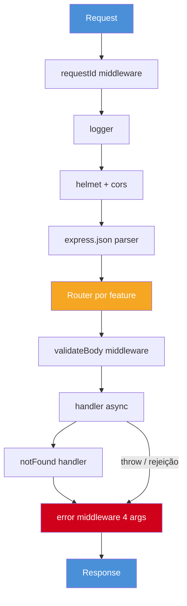

# Express idiomático

> [!abstract] TL;DR
> Express é middleware-based: uma pipeline ordenada de funções `(req, res, next)`. Express 5 encaminha rejeições de Promises para `next(err)` automaticamente; Express 4 ainda exige wrapper em muito código legacy. Error middleware tem quatro argumentos: `(err, req, res, next)`.

## O que é

Express é o framework HTTP minimalista mais conhecido do ecossistema Node. Ele oferece routing, middleware e integração direta com `http`, mas deixa validação, DI, OpenAPI, auth e organização arquitetural por conta da aplicação.

## Por que importa

Express continua aparecendo em entrevistas e projetos reais porque é simples, estável e bem conhecido. Código Express idiomático em 2026 é diferente de código Express 4 escrito sem TypeScript, sem schema e sem erro global consistente.

## Como funciona



```typescript
import express from "express";

const app = express();
app.use(express.json({ limit: "1mb" }));

app.get("/hello", (_req, res) => {
  res.json({ greeting: "hello" });
});

app.listen(3000);
```

```typescript
// Express 5: reject/throw em async handler chega ao error middleware.
app.get("/users/:id", async (req, res) => {
  const user = await db.users.findById(req.params.id);
  if (!user) throw new NotFoundError("User not found");
  res.json(user);
});
```

```typescript
// Express 4 ou compat: wrapper ainda aparece em codebases legacy.
const asyncHandler =
  <T extends express.RequestHandler>(fn: T): express.RequestHandler =>
  (req, res, next) => {
    Promise.resolve(fn(req, res, next)).catch(next);
  };

app.get(
  "/users/:id",
  asyncHandler(async (req, res) => {
    const user = await db.users.findById(req.params.id);
    res.json(user);
  }),
);
```

```typescript
import type { NextFunction, Request, Response } from "express";

app.use((err: Error, req: Request, res: Response, next: NextFunction) => {
  if (res.headersSent) return next(err);

  const status = err instanceof HttpError ? err.status : 500;
  res.status(status).type("application/problem+json").json({
    type: "about:blank",
    title: err.name,
    status,
    detail: status >= 500 ? "Unexpected error" : err.message,
    instance: req.originalUrl,
  });
});
```

```typescript
const userRouter = express.Router();
userRouter.get("/", listUsers);
userRouter.get("/:id", getUser);
userRouter.post("/", createUser);

app.use("/api/v1/users", userRouter);
```

## Casos práticos

Padrão típico em projetos TypeScript novos: Express 5 + `zod` + error middleware global + middlewares explícitos (`helmet`, `cors`, logger, rate limit) + routers por feature. `express.json({ limit })` deve ter limite explícito; body sem limite é porta para abuso de memória.

### Cenário 1 — API de criação de usuário com validation

Imagine um endpoint `POST /users` que recebe nome, e-mail e senha. O corpo pode chegar malformado, o e-mail pode duplicar e a senha precisa de hash antes de persistir. Em Express, cada concern vira um middleware separado, composto no router.

```typescript
// schema: zod valida na boundary, antes do controller.
const CreateUserSchema = z.object({
  name: z.string().min(2).max(100),
  email: z.string().email(),
  password: z.string().min(8),
});

// middleware genérico de validation — reutilizável.
const validateBody =
  <T extends z.ZodTypeAny>(schema: T): express.RequestHandler =>
  (req, _res, next) => {
    const result = schema.safeParse(req.body);
    if (!result.success) return next(new ValidationError(result.error));
    req.body = result.data; // substitui body pelo dado validado
    next();
  };

// controller: fino, só chama use case e formata saída.
userRouter.post(
  "/",
  validateBody(CreateUserSchema),
  asyncHandler(async (req, res) => {
    const user = await createUser.execute(req.body);
    res.status(201).json(UserPresenter.toHttp(user));
  }),
);

// Error middleware global captura qualquer throw/rejeição.
app.use((err: Error, req: Request, res: Response, next: NextFunction) => {
  if (res.headersSent) return next(err);
  const status = err instanceof HttpError ? err.status : 500;
  res.status(status).type("application/problem+json").json({
    type: "about:blank",
    title: err.name,
    status,
    detail: status >= 500 ? "Unexpected error" : err.message,
    instance: req.originalUrl,
  });
});
```

O ponto central: `createUser.execute` não conhece Express. Se amanhã migrar para Fastify, o use case não muda.

### Cenário 2 — Export CSV via stream com tratamento de erro

Um endpoint `GET /reports/users.csv` gera CSV de todos os usuários. Com milhares de registros, a resposta não pode esperar tudo em memória; a solução idiomática é pipeline de stream.

```typescript
import { pipeline } from "node:stream/promises";
import { createReadStream } from "node:fs";

// Rota com streaming — error handling explícito.
reportRouter.get(
  "/users.csv",
  authenticate,
  requireRole("admin"),
  asyncHandler(async (req, res, next) => {
    try {
      res.setHeader("Content-Type", "text/csv");
      res.setHeader("Content-Disposition", 'attachment; filename="users.csv"');

      // pipeline lança se stream falhar.
      await pipeline(exportUsersCsvStream(db), res);
    } catch (err) {
      // Se headers já foram enviados, só podemos fechar.
      // O error middleware não consegue trocar o Content-Type.
      if (!res.headersSent) next(err);
      else {
        req.log?.error({ err }, "streaming failed mid-response");
        res.end();
      }
    }
  }),
);
```

A fronteira com [[03-Dominios/Tecnologia/Node/Streams/index]] aparece aqui: se a stream falhar depois de bytes enviados, não é possível responder Problem Details. O máximo seguro é logar com correlation ID e fechar a conexão.

### Pipeline de uma request real

Uma request Express madura normalmente atravessa camadas em ordem. A ordem é o contrato:

```typescript
app.set("trust proxy", 1);

app.use(requestId());
app.use(logger());
app.use(helmet());
app.use(cors(corsOptions));
app.use(express.json({ limit: "1mb" }));

app.use("/api/v1/users", userRouter);
app.use(notFoundHandler);
app.use(problemDetailsHandler);
```

Se `problemDetailsHandler` vier antes dos routers, ele não verá erros das rotas. Se `express.json()` vier depois do router, `req.body` não existirá. Express dá liberdade; a dívida é documentar ordem.

### TypeScript sem mutação invisível

Mutar `req` é comum, mas precisa ser explícito. Para dados transversais, prefira `res.locals` quando o dado só será usado na resposta, ou declaration merging quando o dado realmente vira parte do contrato da request.

```typescript
declare global {
  namespace Express {
    interface Request {
      user?: { id: string; role: "admin" | "member" };
    }
  }
}

function authenticate(req: Request, _res: Response, next: NextFunction) {
  req.user = parseJwt(req.headers.authorization);
  next();
}
```

```typescript
function requireUser(req: Request, _res: Response, next: NextFunction) {
  if (!req.user) return next(new UnauthorizedError());
  next();
}
```

O ponto de code review: se uma rota assume `req.user`, o router precisa montar `authenticate` e `requireUser` antes da rota.

### Organização por feature

Evite um `routes.ts` gigante. Uma estrutura comum:

```text
src/
├── app.ts
├── features/
│   └── users/
│       ├── users.router.ts
│       ├── users.controller.ts
│       ├── create-user.schema.ts
│       └── users.service.ts
└── shared/
    ├── errors/problem-details.ts
    └── middleware/request-id.ts
```

Express não impõe estrutura, então a estrutura precisa aparecer no repositório.

## Checklist de code review

- Error middleware é o último `app.use()`?
- Async handlers em Express 4 usam wrapper ou o app já está em Express 5?
- `express.json()` tem `limit` explícito?
- Routers são montados por feature, não todos no arquivo principal?
- Validation cobre body, params e query?
- Mutação de `req` tem tipo declarado?
- `res.headersSent` é tratado no error middleware?
- Health check não passa por auth pesada?
- Logs incluem request ID/correlation ID?

## Exercício de maturidade

Pegue uma rota Express escrita assim:

```typescript
app.post("/users", async (req, res) => {
  const user = await db.user.create({ data: req.body });
  res.json(user);
});
```

O refactor senior separa quatro concerns:

```typescript
userRouter.post(
  "/",
  validateBody(CreateUserSchema),
  asyncHandler(async (req, res) => {
    const user = await createUser.execute(req.body);
    res.status(201).json(UserPresenter.toHttp(user));
  }),
);
```

O que mudou:

- schema valida boundary;
- use case não conhece Express;
- presenter controla contrato de saída;
- erro sobe para middleware global;
- status code ficou explícito.

Esse é o tipo de evolução que transforma Express de "arquivo de rotas" em aplicação sustentável.

## O que vem a seguir

Express idiomático já traz muito, mas não resolve tudo sozinho. Os próximos temas expandem o que acontece antes e depois do handler:

- [[07 - Middleware pipeline]] — pipeline detalhada com order, encapsulation e testes de middleware isolado.
- [[08 - Error handling estruturado]] — taxonomy de erros, Problem Details RFC 9457 e consistência de resposta.
- [[09 - Validation com schema]] — Zod, AJV e como compor validation com transformação de tipos.
- [[03 - NestJS - fundamentos]] — quando a estrutura manual do Express se torna custo alto e DI container compensa.

## Armadilhas comuns

> [!warning] Express 4 com handler async sem wrapper
> **O que acontece:** Rejeição de Promise não chega ao error middleware — o processo engole o erro silenciosamente. **Por quê:** Express 4 não wrapa automaticamente Promises; só Express 5 faz isso nativo. **Como evitar:** Use Express 5 ou adicione `asyncHandler` wrapper em todos os handlers async de codebases 4.x.

> [!warning] Error middleware com 3 argumentos
> **O que acontece:** Express não o reconhece como handler de erro — ele vira middleware comum. **Por quê:** Express identifica error handler pela assinatura `(err, req, res, next)` — quatro argumentos são obrigatórios. **Como evitar:** Sempre declare `(err: Error, req: Request, res: Response, next: NextFunction)` com todos os quatro parâmetros, mesmo que `next` não seja chamado.

> [!warning] Mutar `req` em middleware sem tipo/documentação
> **O que acontece:** Handler assume `req.user` mas o middleware que o popula não está montado na rota. **Por quê:** A ordem de montagem é o contrato implícito; sem tipo declarado, TypeScript não ajuda. **Como evitar:** Declare o campo via declaration merging e revise que o middleware está montado antes de qualquer rota que o consuma.

> [!warning] Chamar `res.send()` e depois `next(err)`
> **O que acontece:** `Cannot set headers after they are sent to the client`. **Por quê:** A resposta já foi enviada; o error middleware não pode sobrescrevê-la. **Como evitar:** Verifique `res.headersSent` antes de chamar `next(err)` e nunca chame `res.send` junto com `next`.

> [!warning] Registrar error middleware antes das rotas
> **O que acontece:** O error middleware não captura erros das rotas registradas depois dele. **Por quê:** Express processa middlewares na ordem de registro. **Como evitar:** Sempre registre o error middleware como o último `app.use()`, depois de todos os routers.

> [!warning] `app.use(auth)` global quebrando rotas públicas
> **O que acontece:** `/health`, `/metrics` ou callbacks públicos passam por auth pesada e retornam 401. **Por quê:** `app.use()` sem path aplica a todas as rotas. **Como evitar:** Monte auth em routers específicos, não globalmente. Use `unless` pattern ou exclusão explícita.

> [!warning] Validar em controller depois de chamar service
> **O que acontece:** Dado inválido atravessa a boundary HTTP e chega ao domínio. **Por quê:** Validation deve acontecer na entrada, antes de qualquer lógica de negócio. **Como evitar:** Validation como middleware antes do handler — nunca dentro do handler ou do service.

> [!warning] Capturar erro e responder direto em cada rota
> **O que acontece:** Formato de erro inconsistente por toda a aplicação. **Por quê:** Cada handler formata o erro à sua maneira, perdendo consistência de [[08 - Error handling estruturado]]. **Como evitar:** Sempre relance com `next(err)` e deixe o error middleware global formatar a resposta.

> [!warning] Ignorar `trust proxy` atrás de load balancer
> **O que acontece:** `req.ip` retorna IP do balanceador, não do cliente real; cookies `secure` podem não ser definidos. **Por quê:** Express confia no IP de origem da conexão, não no `X-Forwarded-For`, sem configuração explícita. **Como evitar:** `app.set("trust proxy", 1)` em ambientes com load balancer ou proxy reverso.

## Perguntas de entrevista

**O que mudou no Express 5 para async handlers?** Handlers e middlewares que retornam Promise chamam `next(value)` automaticamente quando rejeitam ou lançam erro. Em Express 4, wrapper ou `.catch(next)` ainda é necessário.

**Por que error middleware tem quatro argumentos?** É como Express distingue middleware normal de error handler: `(err, req, res, next)`.

**Como você estruturaria Express em app médio?** Routers por feature, schemas por boundary, services/use cases fora da camada HTTP, error middleware global e composition root explícito.

**Quando você não escolheria Express?** Quando o time precisa de convenção forte, DI/lifecycle built-in ou contrato schema-first nativo. Nesses casos, NestJS ou Fastify podem reduzir decisões repetidas.

## Em entrevista

"Express is a minimal middleware-based framework. In Express 5, promise rejections from async route handlers automatically call `next(err)`, while Express 4 codebases commonly need an `asyncHandler` wrapper. Error middleware is different from regular middleware: it has four arguments, with `err` first, and it should be registered after routes."

Vocabulário-chave:

- middleware pipeline -> pipeline de middleware
- error middleware -> middleware de erro
- async wrapper -> wrapper assíncrono
- router mounting -> montagem de routers
- body limit -> limite de payload

## Fontes

- [Express](https://expressjs.com/)
- [Express error handling](https://expressjs.com/en/guide/error-handling.html)

## Veja também

- [[01 - Os 4 frameworks - Express, NestJS, Fastify, Hono]]
- [[07 - Middleware pipeline]]
- [[08 - Error handling estruturado]]
- [[09 - Validation com schema]]
- [[Node.js]]
