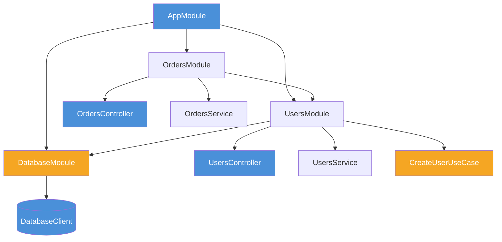

# NestJS: fundamentos

> [!abstract] TL;DR
> NestJS é um framework TypeScript opinativo, decorator-based e com DI built-in. A unidade organizacional é o módulo: ele declara controllers, providers, imports e exports. O container resolve dependências por constructor injection. É forte para apps enterprise; é overhead em apps pequenos.

## O que é

NestJS é um framework para aplicações server-side Node que organiza código em módulos, controllers e providers. Por padrão usa Express por baixo, mas pode usar Fastify como adapter. A filosofia lembra Spring Boot/Angular: metadata via decorators, DI container e arquitetura explícita.

## Por que importa

Em apps grandes, wiring manual, lifecycle e padrões transversais viram custo. NestJS compra estrutura: módulos por feature, providers testáveis, guards/pipes/interceptors/filters e DI consistente. Em apps pequenos, a mesma estrutura pode ser mais cerimônia que benefício.

## Como funciona



```typescript
import { Module } from "@nestjs/common";
import { UsersController } from "./users.controller";
import { UsersService } from "./users.service";

@Module({
  controllers: [UsersController],
  providers: [UsersService],
  exports: [UsersService],
})
export class UsersModule {}
```

```typescript
import { Injectable } from "@nestjs/common";

@Injectable()
export class UsersService {
  constructor(private readonly db: DatabaseClient) {}

  async findById(id: string) {
    return this.db.users.findById(id);
  }
}
```

```typescript
import { Controller, Get, Param } from "@nestjs/common";

@Controller("users")
export class UsersController {
  constructor(private readonly users: UsersService) {}

  @Get(":id")
  async getUser(@Param("id") id: string) {
    return this.users.findById(id);
  }
}
```

```typescript
import { Injectable, Scope } from "@nestjs/common";

@Injectable({ scope: Scope.REQUEST })
export class RequestContextService {}

@Injectable({ scope: Scope.TRANSIENT })
export class NewPerInjectionService {}

// Default: singleton no módulo/app.
```

```typescript
@Module({
  imports: [DatabaseModule, UsersModule],
  controllers: [OrdersController],
  providers: [OrdersService],
  exports: [OrdersService],
})
export class OrdersModule {}
```

## Casos práticos

Padrão observado no ecossistema: um módulo por feature (`UsersModule`, `OrdersModule`), shared modules para concerns transversais (`DatabaseModule`, `LoggerModule`), singleton como default, request scope apenas quando precisa de contexto da request. `exports` é o contrato entre módulos.

### Cenário 1 — Módulo de usuários com token de repositório

Imagine um domínio de usuários onde a regra de negócio não pode depender de Prisma diretamente. O use case precisa ser testável sem banco real. A solução é token de repositório + abstração.

```typescript
// Token explícito — interface TypeScript some em runtime.
export const USER_REPOSITORY = Symbol("USER_REPOSITORY");

export interface UserRepository {
  findById(id: string): Promise<User | null>;
  findByEmail(email: string): Promise<User | null>;
  save(user: User): Promise<void>;
}

// Implementação concreta com Prisma.
@Injectable()
export class PrismaUserRepository implements UserRepository {
  constructor(private readonly prisma: PrismaService) {}

  async findById(id: string) {
    return this.prisma.user.findUnique({ where: { id } });
  }

  async findByEmail(email: string) {
    return this.prisma.user.findUnique({ where: { email } });
  }

  async save(user: User) {
    await this.prisma.user.upsert({
      where: { id: user.id },
      create: user,
      update: user,
    });
  }
}

// Use case injeta abstração — não sabe do Prisma.
@Injectable()
export class CreateUserUseCase {
  constructor(
    @Inject(USER_REPOSITORY)
    private readonly users: UserRepository,
  ) {}

  async execute(dto: CreateUserDto): Promise<User> {
    const existing = await this.users.findByEmail(dto.email);
    if (existing) throw new ConflictError("Email already in use");

    const user = User.create(dto);
    await this.users.save(user);
    return user;
  }
}

// Módulo: wiring explícito, exports controlados.
@Module({
  imports: [DatabaseModule],
  controllers: [UsersController],
  providers: [
    { provide: USER_REPOSITORY, useClass: PrismaUserRepository },
    CreateUserUseCase,
    UsersService,
  ],
  exports: [UsersService],
})
export class UsersModule {}
```

Em teste, basta substituir o token:

```typescript
const moduleRef = await Test.createTestingModule({
  providers: [CreateUserUseCase],
})
  .overrideProvider(USER_REPOSITORY)
  .useValue({
    findByEmail: jest.fn().mockResolvedValue(null),
    save: jest.fn(),
  })
  .compile();

const useCase = moduleRef.get(CreateUserUseCase);
await expect(useCase.execute({ email: "a@b.com", name: "A" })).resolves.toBeDefined();
```

### Cenário 2 — Dynamic module para banco multi-tenant

Imagine uma aplicação multi-tenant onde cada instância de teste ou ambiente precisa de conexão diferente. Dynamic module resolve isso sem hardcode.

```typescript
// Interface de configuração.
export interface DatabaseOptions {
  url: string;
  maxConnections?: number;
  schema?: string;
}

// Module com forRoot para configuração única.
@Module({})
export class DatabaseModule {
  static forRoot(options: DatabaseOptions): DynamicModule {
    return {
      module: DatabaseModule,
      global: true,
      providers: [
        { provide: DATABASE_OPTIONS, useValue: options },
        {
          provide: DatabaseClient,
          useFactory: (opts: DatabaseOptions) =>
            new PrismaClient({ datasourceUrl: opts.url }),
          inject: [DATABASE_OPTIONS],
        },
      ],
      exports: [DatabaseClient],
    };
  }

  // forRootAsync: carrega configuração de ConfigService.
  static forRootAsync(options: {
    useFactory: (...args: any[]) => DatabaseOptions | Promise<DatabaseOptions>;
    inject?: any[];
  }): DynamicModule {
    return {
      module: DatabaseModule,
      global: true,
      providers: [
        {
          provide: DatabaseClient,
          useFactory: async (...args: any[]) => {
            const opts = await options.useFactory(...args);
            return new PrismaClient({ datasourceUrl: opts.url });
          },
          inject: options.inject ?? [],
        },
      ],
      exports: [DatabaseClient],
    };
  }
}

// Uso no AppModule.
@Module({
  imports: [
    DatabaseModule.forRootAsync({
      useFactory: (config: ConfigService) => ({
        url: config.getOrThrow("DATABASE_URL"),
      }),
      inject: [ConfigService],
    }),
    UsersModule,
    OrdersModule,
  ],
})
export class AppModule {}
```

### O módulo como boundary de feature

Um módulo NestJS saudável não é só uma pasta. Ele declara o que a feature possui e o que exporta para outras features.

```typescript
@Module({
  imports: [DatabaseModule],
  controllers: [UsersController],
  providers: [
    UsersService,
    CreateUserUseCase,
    { provide: USER_REPOSITORY, useClass: PostgresUserRepository },
  ],
  exports: [UsersService],
})
export class UsersModule {}
```

Se outro módulo precisa criar usuário, ele importa `UsersModule` e injeta o contrato exportado. Ele não deve importar arquivos internos da pasta `users` por caminho relativo atravessando boundary.

### Provider scope sem surpresa

Singleton é o default e geralmente é certo. Request scope deve ser exceção. Ele cria uma instância por request e pode propagar o custo para dependências que pareciam singleton.

```typescript
@Injectable()
export class PriceCalculator {
  // Stateless: singleton ideal.
}

@Injectable({ scope: Scope.REQUEST })
export class RequestContext {
  constructor(@Inject(REQUEST) private readonly req: Request) {}
}
```

Se o objetivo é só carregar `userId` ou `correlationId`, muitas vezes um interceptor/guard que popula contexto explícito resolve melhor do que transformar vários providers em request-scoped.

### Testabilidade

NestJS facilita substituir providers em teste.

```typescript
const moduleRef = await Test.createTestingModule({
  providers: [CreateUserUseCase, UsersService],
})
  .overrideProvider(USER_REPOSITORY)
  .useValue(fakeUserRepository)
  .compile();

const useCase = moduleRef.get(CreateUserUseCase);
```

Esse é um benefício concreto do container: trocar adapter sem mexer no código de aplicação.

## Checklist de code review

- Módulos exportam só o necessário?
- Há imports cruzados entre features por caminho interno?
- Providers stateless ficaram singleton?
- Request scope tem justificativa explícita?
- Tokens são usados quando a dependência é interface/abstração?
- Circular dependency foi resolvida com design ou só mascarada com `forwardRef()`?
- Controller chama use case/service, não repository direto?
- DTOs e validation estão na camada HTTP, não no domínio?

## Exercício de maturidade

Um controller NestJS imaturo costuma acumular tudo:

```typescript
@Post()
async create(@Body() body: any) {
  if (!body.email) throw new BadRequestException();
  const existing = await this.prisma.user.findUnique({ where: { email: body.email } });
  if (existing) throw new ConflictException();
  return this.prisma.user.create({ data: body });
}
```

Uma versão mais madura separa boundary, use case e adapter:

```typescript
@Post()
async create(@Body() dto: CreateUserDto) {
  const user = await this.createUser.execute(dto);
  return UserPresenter.toHttp(user);
}
```

```typescript
@Injectable()
export class CreateUserUseCase {
  constructor(
    @Inject(USER_REPOSITORY) private readonly users: UserRepository,
  ) {}
}
```

O NestJS continua sendo o framework, mas a regra de negócio não fica presa ao controller nem ao Prisma.

### Sinal de arquitetura saudável

Você consegue testar `CreateUserUseCase` sem `TestingModule`, sem HTTP e sem banco real. Use `TestingModule` para integração NestJS; use teste puro para regra de aplicação.

### Regra prática final

Use NestJS para padronizar a aplicação, não para esconder design. Se módulos, providers e decorators tornam boundaries mais claros, o framework está ajudando. Se todo problema vira decorator novo, módulo global ou `forwardRef()`, o framework virou maquiagem sobre acoplamento.

## O que vem a seguir

Com módulos e DI mapeados, o próximo passo é entender como o NestJS trata concerns transversais no ciclo de vida de cada request:

- [[04 - NestJS - guards, interceptors, pipes, filters]] — o lifecycle completo: quando cada hook roda, como compor e por que o controller deve ficar fino.
- [[09 - Validation com schema]] — class-validator, class-transformer e como `ValidationPipe` se integra ao ciclo.
- [[11 - DI - manual vs container]] — comparação entre wiring manual e container, quando cada abordagem escala melhor.

## Armadilhas comuns

> [!warning] `Scope.REQUEST` usado sem necessidade
> **O que acontece:** Provider request-scoped propaga escopo para dependências upstream, que deixam de ser singleton. **Por quê:** O container cria nova instância a cada request e força o mesmo comportamento em quem depende desse provider. **Como evitar:** Use singleton como default; request scope só quando a instância precisa ser genuinamente diferente por request. Para passar `userId` ou `correlationId`, prefira interceptor ou contexto explícito.

> [!warning] Circular imports entre módulos
> **O que acontece:** NestJS não consegue resolver o grafo de dependências e lança erro em startup. **Por quê:** Módulo A importa B que importa A — ciclo que o container não sabe como quebrar. **Como evitar:** `forwardRef()` existe mas frequentemente sinaliza design ruim. Prefira extrair a dependência compartilhada para um terceiro módulo compartilhado.

> [!warning] Esquecer `exports` no módulo
> **O que acontece:** Outro módulo importa `UsersModule` mas não consegue injetar `UsersService`. **Por quê:** Sem `exports`, o provider só está disponível dentro do próprio módulo. **Como evitar:** Revise o array `exports` de cada módulo no code review; ele é o contrato público da feature.

> [!warning] Lógica pesada no constructor
> **O que acontece:** Startup lento, erros difíceis de rastrear e testes complicados. **Por quê:** Constructor deve apenas armazenar dependências injetadas; side-effects em constructor são antipadrão. **Como evitar:** Use lifecycle hooks como `OnModuleInit` para inicialização assíncrona: `async onModuleInit() { await this.db.connect(); }`.

> [!warning] Injetar interface sem token
> **O que acontece:** `Error: Nest can't resolve dependencies of the MyService` em runtime. **Por quê:** Interfaces TypeScript são apagadas em compilação; o container precisa de um token concreto. **Como evitar:** Sempre defina um `Symbol` como token e use `@Inject(TOKEN)` ao injetar abstrações.

> [!warning] `SharedModule` virar gaveta global
> **O que acontece:** Tudo importa `SharedModule` e as features ficam acopladas entre si. **Por quê:** Módulo shared sem critério vira acoplamento disfarçado de reuso. **Como evitar:** Shared module só para utilitários genuinamente transversais (logger, config, health). Features com domínio próprio devem ter seu módulo.

> [!warning] Controller importando adapter de infraestrutura diretamente
> **O que acontece:** Regra de negócio fica presa ao framework e ao ORM, impossibilitando testes sem banco. **Por quê:** Controller só deve conhecer use cases/services, não repositórios ou Prisma. **Como evitar:** A dependência de `PrismaService` pertence ao repositório, não ao controller.

> [!warning] Decorator de ORM na entity de domínio
> **O que acontece:** Entity de domínio tem `@Column`, `@Entity` e vira acoplada ao Prisma/TypeORM. **Por quê:** Decorator de persistência na entity viola a dependency rule — o domínio passa a depender de infraestrutura. **Como evitar:** Separe entity de domínio de entity de persistência. Use mappers para converter entre as duas.

## Perguntas de entrevista

**Qual é a unidade fundamental de organização em NestJS?** O módulo. Ele agrupa controllers, providers, imports e exports. É boundary de composição.

**Por que interfaces precisam de tokens?** Porque interfaces TypeScript são apagadas em runtime. O container precisa de um token concreto: string, symbol ou classe.

**Quando usar request scope?** Quando a instância realmente precisa ser diferente por request, como contexto específico da request. Não use para resolver conveniência de passar `userId`.

**Como NestJS se relaciona com Clean Architecture?** Ele ajuda com módulos e DI, mas não garante arquitetura limpa. A dependency rule ainda precisa ser respeitada.

## Em entrevista

"NestJS is opinionated and decorator-based, with a built-in dependency injection container. Its fundamental unit is the module: a module declares controllers, providers, imports, and exports. Providers default to singleton scope; request and transient scopes exist but should be used deliberately. It is a good fit for enterprise apps with complex domains and teams that benefit from structure."

Vocabulário-chave:

- dependency injection -> injeção de dependência
- provider -> componente injetável
- module -> módulo
- controller -> controlador HTTP
- scope -> escopo

## Fontes

- [NestJS docs](https://docs.nestjs.com/)
- [NestJS custom providers](https://docs.nestjs.com/fundamentals/custom-providers)

## Veja também

- [[01 - Os 4 frameworks - Express, NestJS, Fastify, Hono]]
- [[04 - NestJS - guards, interceptors, pipes, filters]]
- [[09 - Validation com schema]]
- [[11 - DI - manual vs container]]
- [[Node.js]]
