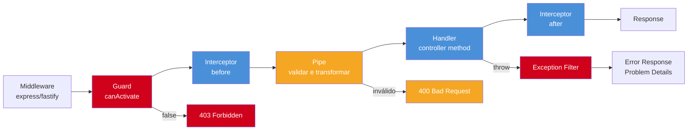

# NestJS: guards, interceptors, pipes, filters

> [!abstract] TL;DR
> NestJS separa concerns no lifecycle da request: Guards decidem se a request passa; Pipes validam/transformam input; Interceptors envolvem o handler antes/depois; Exception Filters formatam erros. Cada hook pode ser aplicado por rota, controller ou globalmente.

## O que é

Esses quatro hooks são o motivo de NestJS não ser apenas routing com decorators. Eles transformam auth, validation, logging, cache, timeout e error handling em componentes reutilizáveis.

## Por que importa

Sem lifecycle hooks, controllers acumulam boilerplate: checar auth, validar body, medir tempo, transformar resposta e formatar erro em cada método. Em NestJS idiomático, controller coordena caso de uso; concerns transversais ficam nos hooks certos.

## Como funciona



```typescript
@Injectable()
export class AuthGuard implements CanActivate {
  canActivate(ctx: ExecutionContext): boolean {
    const req = ctx.switchToHttp().getRequest<Request>();
    return Boolean(req.headers.authorization);
  }
}

@UseGuards(AuthGuard)
@Get("profile")
getProfile() {
  return this.users.current();
}
```

```typescript
@UsePipes(new ValidationPipe({ whitelist: true, forbidNonWhitelisted: true }))
@Post("users")
createUser(@Body() dto: CreateUserDto) {
  return this.users.create(dto);
}
```

```typescript
@Injectable()
export class TimingInterceptor implements NestInterceptor {
  intercept(_ctx: ExecutionContext, next: CallHandler) {
    const start = Date.now();
    return next.handle().pipe(
      tap(() => console.log(`request took ${Date.now() - start}ms`)),
    );
  }
}
```

```typescript
@Catch()
export class ProblemDetailsFilter implements ExceptionFilter {
  catch(exception: unknown, host: ArgumentsHost) {
    const ctx = host.switchToHttp();
    const res = ctx.getResponse<Response>();
    const req = ctx.getRequest<Request>();
    const status = exception instanceof HttpException ? exception.getStatus() : 500;

    res.status(status).type("application/problem+json").json({
      type: "about:blank",
      title: "Error",
      status,
      detail: exception instanceof Error ? exception.message : "Unexpected error",
      instance: req.url,
    });
  }
}
```

```typescript
// main.ts
app.useGlobalGuards(new AuthGuard());
app.useGlobalPipes(new ValidationPipe({ whitelist: true }));
app.useGlobalInterceptors(new TimingInterceptor());
app.useGlobalFilters(new ProblemDetailsFilter());
```

## Casos práticos

- Auth/autorização: Guard global ou por feature.
- Validation: `ValidationPipe` global com `whitelist` e `forbidNonWhitelisted`.
- Logging/timing/cache: Interceptor.
- Problem Details: Exception Filter global.
- Controller: fino, chamando use case/service.

### Cenário 1 — Auth em camadas: JWT + RBAC

Imagine um sistema com rotas públicas, rotas autenticadas e rotas restritas a admin. Separar autenticação de autorização mantém guards coesos e testáveis.

```typescript
// Guard 1: verifica token e popula req.user.
@Injectable()
export class JwtAuthGuard implements CanActivate {
  constructor(private readonly jwt: JwtService) {}

  canActivate(ctx: ExecutionContext): boolean {
    const req = ctx.switchToHttp().getRequest<Request>();
    const token = req.headers.authorization?.replace("Bearer ", "");
    if (!token) throw new UnauthorizedException("Token required");

    try {
      req.user = this.jwt.verify(token);
      return true;
    } catch {
      throw new UnauthorizedException("Invalid token");
    }
  }
}

// Decorator customizado para marcar roles.
export const Roles = (...roles: Role[]) => SetMetadata("roles", roles);

// Guard 2: verifica roles do usuário autenticado.
@Injectable()
export class RolesGuard implements CanActivate {
  constructor(private readonly reflector: Reflector) {}

  canActivate(ctx: ExecutionContext): boolean {
    const required = this.reflector.getAllAndOverride<Role[]>("roles", [
      ctx.getHandler(),
      ctx.getClass(),
    ]);
    if (!required?.length) return true; // sem roles requeridas, passa

    const req = ctx.switchToHttp().getRequest<Request>();
    return required.every((role) => req.user?.roles?.includes(role));
  }
}

// Controller: combina os dois guards e o decorator de roles.
@Controller("admin/invoices")
@UseGuards(JwtAuthGuard, RolesGuard)
export class AdminInvoicesController {
  @Get()
  @Roles("admin")
  listAll() {
    return this.invoices.findAll();
  }

  @Get("pending")
  @Roles("admin", "finance")
  listPending() {
    return this.invoices.findPending();
  }
}

// Rota pública — guard não se aplica.
@Controller("health")
export class HealthController {
  @Get()
  check() {
    return { status: "ok" };
  }
}
```

O `JwtAuthGuard` nunca sabe de roles; o `RolesGuard` nunca sabe de JWT. Cada guard tem uma responsabilidade.

### Cenário 2 — Interceptor de auditoria com logging estruturado

Imagine que toda operação de escrita precisa ser registrada: quem fez, o que fez, quando, e se deu certo. Um interceptor é o lugar certo — ele envolve o handler completo sem poluir o controller.

```typescript
@Injectable()
export class AuditInterceptor implements NestInterceptor {
  constructor(private readonly audit: AuditService) {}

  intercept(ctx: ExecutionContext, next: CallHandler): Observable<unknown> {
    const req = ctx.switchToHttp().getRequest<Request>();
    const { method, url, user } = req;
    const startedAt = new Date();

    return next.handle().pipe(
      // onSuccess: loga operação bem-sucedida.
      tap(async (result) => {
        await this.audit.log({
          actor: user?.id ?? "anonymous",
          action: `${method} ${url}`,
          outcome: "success",
          startedAt,
          resourceId: result?.id,
        });
      }),
      // onError: loga falha antes de repassar a exceção.
      catchError(async (err) => {
        await this.audit.log({
          actor: req.user?.id ?? "anonymous",
          action: `${method} ${url}`,
          outcome: "failure",
          startedAt,
          error: err.message,
        });
        throw err; // re-throw para o Exception Filter tratar
      }),
    );
  }
}

// Aplicado no controller de escrita — não no controller público.
@Controller("orders")
@UseGuards(JwtAuthGuard)
@UseInterceptors(AuditInterceptor)
export class OrdersController {
  @Post()
  create(@Body() dto: CreateOrderDto) {
    return this.createOrder.execute(dto);
  }

  @Patch(":id/cancel")
  cancel(@Param("id", ParseUUIDPipe) id: string) {
    return this.cancelOrder.execute(id);
  }
}
```

O controller permanece fino: nenhuma linha de logging, nenhuma lógica de auditoria — apenas coordenação de use cases.

### Escopo: global, controller ou rota

O mesmo hook pode ter escopos diferentes. A regra prática: global para política padrão, controller para feature, rota para exceção.

```typescript
// Global: toda request passa por validation.
app.useGlobalPipes(new ValidationPipe({ whitelist: true }));
```

```typescript
// Controller: todas as rotas de admin exigem auth.
@UseGuards(AdminGuard)
@Controller("admin/users")
export class AdminUsersController {}
```

```typescript
// Rota: cache só nesta operação.
@UseInterceptors(CacheInterceptor)
@Get("catalog")
findCatalog() {}
```

O erro comum é aplicar tudo globalmente e depois criar exceções em cascata. Global deve representar política quase universal.

### Pipe: boundary de input

Pipe é boundary. Ele roda antes do handler e deve transformar input externo em shape confiável.

```typescript
@Get(":id")
findOne(@Param("id", ParseUUIDPipe) id: string) {
  return this.users.findOne(id);
}
```

```typescript
@Post()
create(@Body(new ZodPipe(CreateUserSchema)) input: CreateUserInput) {
  return this.createUser.execute(input);
}
```

Se a validação aparece dentro do service, o boundary HTTP já vazou.

### Filter: taxonomy e Problem Details

Exception filter global deve converter tipos conhecidos em respostas previsíveis.

```typescript
@Catch(DomainError)
export class DomainErrorFilter implements ExceptionFilter {
  catch(error: DomainError, host: ArgumentsHost) {
    const ctx = host.switchToHttp();
    const res = ctx.getResponse<Response>();

    res.status(error.status).type("application/problem+json").json({
      type: error.type,
      title: error.title,
      status: error.status,
      detail: error.message,
    });
  }
}
```

Não transforme todo erro em 500 genérico antes de classificar erros operacionais.

## Checklist de code review

- Guard faz autorização/autenticação, não valida DTO?
- Pipe cobre params/query/body?
- Interceptor não contém regra de domínio?
- Filter não expõe stack trace em produção?
- Hooks globais têm exceções explícitas para health/metrics?
- Ordem mental do lifecycle está documentada em features críticas?
- `ValidationPipe` tem `whitelist` e, quando apropriado, `forbidNonWhitelisted`?
- Uso de Observable/RxJS no interceptor é simples e não faz CPU-heavy work?

## Exercício de maturidade

Ao revisar um controller cheio de decorators, pergunte se cada decorator representa uma policy estável:

```typescript
@UseGuards(JwtAuthGuard, RolesGuard)
@UseInterceptors(AuditInterceptor)
@UsePipes(new ValidationPipe({ whitelist: true }))
@Post("invoices")
createInvoice(@Body() dto: CreateInvoiceDto) {}
```

Isso é aceitável se:

- auth é realmente política da rota;
- audit é concern transversal;
- validation pertence à boundary;
- controller continua fino.

Se decorators aparecem para corrigir comportamento específico de regra de negócio, provavelmente o use case está pobre e o controller virou orquestrador.

### Debug de lifecycle

Quando comportamento parece "fora de ordem", registre o lifecycle:

```typescript
logger.debug("guard");
logger.debug("interceptor before");
logger.debug("pipe");
logger.debug("handler");
logger.debug("interceptor after");
```

Esse tracing simples resolve boa parte das confusões entre Guard, Pipe e Interceptor.

## O que vem a seguir

Com o lifecycle NestJS dominado, o próximo passo é olhar como validação funciona em detalhe e como error handling se padroniza através de toda a aplicação:

- [[09 - Validation com schema]] — `class-validator`, `class-transformer`, `ValidationPipe` e integração com Zod.
- [[08 - Error handling estruturado]] — taxonomy de erros, Problem Details RFC 9457 e consistência de resposta.
- [[07 - Middleware pipeline]] — diferença entre middleware Express e hooks NestJS, e quando cada um se aplica.

## Armadilhas comuns

> [!warning] Confundir Guard com Pipe
> **O que acontece:** Guard tenta validar DTO; Pipe tenta checar permissão. **Por quê:** Guard decide se a request pode continuar. Pipe transforma/valida dados de entrada. Misturar os dois torna o código imprevisível. **Como evitar:** Guard: "pode fazer isso?" Pipe: "o dado está no formato certo?" Se a pergunta mistura as duas, divida em dois hooks.

> [!warning] Interceptor com CPU-heavy work dentro de `tap`
> **O que acontece:** Operação pesada dentro de `tap` bloqueia event loop e aumenta latência de todas as requests. **Por quê:** `tap` é síncrono por padrão; trabalho pesado dentro dele não é deferido. **Como evitar:** Use `tapAsync` com cuidado, delegue trabalho pesado para fila/worker ou use `switchMap` com Observable assíncrono.

> [!warning] Filter `@Catch()` genérico demais sem taxonomy
> **O que acontece:** Todos os erros viram 500 genérico, perdendo contexto de erros de domínio e validação. **Por quê:** `@Catch()` sem argumento captura tudo, incluindo erros já tratados que mereceriam status diferente. **Como evitar:** Crie filters tipados: `@Catch(DomainError)`, `@Catch(ValidationError)`, `@Catch(HttpException)`. Filter genérico fica como fallback de último recurso.

> [!warning] DTO sem decorators de validação
> **O que acontece:** `ValidationPipe` não detecta campos inválidos porque não há metadados de validação. **Por quê:** `ValidationPipe` depende de `class-validator` decorators para saber o que validar. **Como evitar:** Todo DTO deve ter decorators `@IsString()`, `@IsEmail()`, etc. Habilite `whitelist: true` para remover campos não declarados.

> [!warning] Hook global sem pensar em rotas públicas
> **O que acontece:** `JwtAuthGuard` global bloqueia `/health`, `/metrics` e webhooks públicos com 401. **Por quê:** `useGlobalGuards` aplica a todas as rotas sem exceção por default. **Como evitar:** Use decorator `@Public()` com reflector, ou não aplique auth guard globalmente — aplique por controller.

> [!warning] Regra de negócio no Guard
> **O que acontece:** Guard consulta banco, aplica regras de domínio e vira um mini-service. **Por quê:** Guard "já roda antes do handler" — mas isso não o torna o lugar certo para lógica de negócio. **Como evitar:** Guard só decide autorização com base em dados já disponíveis (token, role, claim). Lógica de negócio fica no use case.

> [!warning] Interceptor para alterar input
> **O que acontece:** Interceptor transforma o corpo da request antes do handler, mas depois do Pipe. **Por quê:** Interceptor não tem acesso ao parsed/validated body; sua função é envolver execução, não transformar input. **Como evitar:** Transformação de input pertence ao Pipe. Use `@Transform()` em DTOs ou Pipe customizado.

> [!warning] Exception Filter capturando tudo e apagando status original
> **O que acontece:** `HttpException` com status 422 vira 500 porque o filter não preserva o status. **Por quê:** Filter que não verifica `instanceof HttpException` perde informação de status já definida pelo NestJS. **Como evitar:** Sempre verifique `exception instanceof HttpException ? exception.getStatus() : 500` antes de definir o status da resposta.

> [!warning] Pipe batendo em banco para validação pesada em toda request
> **O que acontece:** Cada request que passa por aquele Pipe faz uma query de banco, aumentando latência e criando vetor de DoS. **Por quê:** Pipe roda antes do handler em toda request que usa aquele pipe. **Como evitar:** Validações que dependem de banco (e-mail único, recurso existente) pertencem ao use case, não ao Pipe.

## Perguntas de entrevista

**Qual a diferença entre Guard e Pipe?** Guard decide se a request continua. Pipe valida/transforma dados de entrada.

**Por que Interceptor é útil para logging?** Porque envolve o handler: consegue medir antes/depois e observar sucesso/erro sem poluir controller.

**Onde você implementaria Problem Details em NestJS?** Em Exception Filter global, com mapping explícito de erros conhecidos para `application/problem+json`.

**Quando aplicar hook globalmente?** Quando a política vale para quase toda aplicação: validation, logging, error formatting. Auth global exige cuidado com rotas públicas.

## Em entrevista

"NestJS request lifecycle has specialized hooks. Guards decide whether a request is allowed to proceed. Pipes validate and transform input, with `ValidationPipe` being the canonical example. Interceptors wrap the handler with before-and-after behavior, useful for logging, caching, and response transformation. Exception filters format errors, often as Problem Details. Each can be route-scoped, controller-scoped, or global."

Vocabulário-chave:

- guard -> guarda de autorização
- pipe -> validação/transformação
- interceptor -> wrapper de execução
- exception filter -> filtro de exceção
- lifecycle hook -> gancho do ciclo de vida

## Fontes

- [NestJS docs](https://docs.nestjs.com/)
- [NestJS guards](https://docs.nestjs.com/guards)
- [NestJS interceptors](https://docs.nestjs.com/interceptors)

## Veja também

- [[03 - NestJS - fundamentos]]
- [[07 - Middleware pipeline]]
- [[08 - Error handling estruturado]]
- [[09 - Validation com schema]]
- [[Node.js]]
