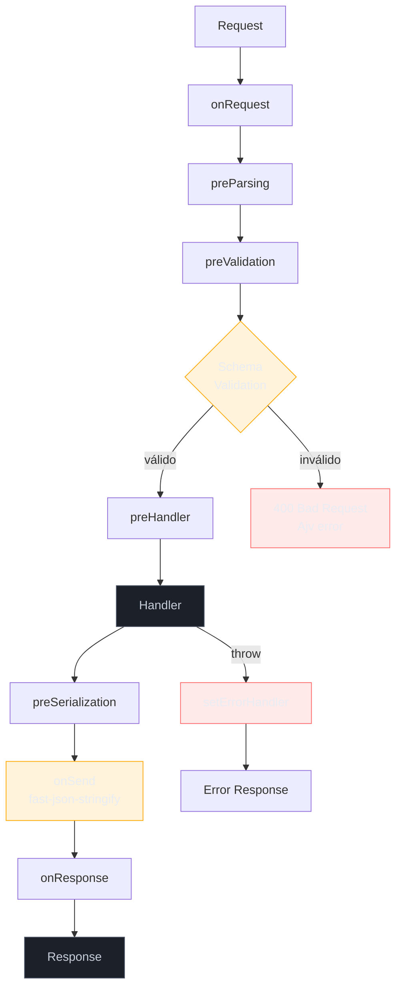

# Fastify: schema-first, plugins, performance

> [!abstract] TL;DR
> Fastify é performance-focused e schema-first. Route schemas validam input e serializam output com Ajv/fast-json-stringify. Plugins são encapsulados por default. É boa escolha para APIs com contrato claro e throughput relevante.

## O que é

Fastify é um framework HTTP de baixo overhead para Node. Seus pilares são performance, developer experience, hooks, plugins/decorators e uso recomendado de JSON Schema para validation/serialization.

## Por que importa

Quando API tem contrato claro, schema-first reduz validação ad-hoc e aproxima runtime, tipos e OpenAPI. Performance não deve ser a única métrica, mas em endpoints I/O-bound com alto volume a diferença de overhead pode importar.

## Como funciona



```typescript
import Fastify from "fastify";

const app = Fastify({ logger: true });
app.get("/hello", async () => ({ greeting: "hello" }));
await app.listen({ port: 3000 });
```

```typescript
app.post(
  "/users",
  {
    schema: {
      body: {
        type: "object",
        required: ["name", "email"],
        additionalProperties: false,
        properties: {
          name: { type: "string", minLength: 1 },
          email: { type: "string", format: "email" },
        },
      },
      response: {
        201: {
          type: "object",
          required: ["id", "name", "email"],
          properties: {
            id: { type: "string" },
            name: { type: "string" },
            email: { type: "string" },
          },
        },
      },
    },
  },
  async (req, reply) => {
    const user = await db.users.create(req.body);
    return reply.code(201).send(user);
  },
);
```

```typescript
import fp from "fastify-plugin";

async function dbPlugin(fastify: FastifyInstance) {
  const db = await connectDb();
  fastify.decorate("db", db);
  fastify.addHook("onClose", async () => db.close());
}

export default fp(dbPlugin);
```

```typescript
app.addHook("onRequest", async (req) => {
  req.startTime = Date.now();
});

app.addHook("onResponse", async (req) => {
  app.log.info({ url: req.url, ms: Date.now() - req.startTime });
});
```

```typescript
import { TypeBoxTypeProvider } from "@fastify/type-provider-typebox";
import { Type } from "@sinclair/typebox";

const typed = Fastify().withTypeProvider<TypeBoxTypeProvider>();
const UserSchema = Type.Object({ name: Type.String(), email: Type.String() });

typed.post("/users", { schema: { body: UserSchema } }, async (req) => {
  return { acceptedName: req.body.name };
});
```

## Casos práticos

Padrão forte: schema em toda rota, plugins por feature, encapsulation como isolamento e `@fastify/swagger` para derivar OpenAPI. Use `fastify-plugin` quando um plugin precisa expor decorators ao escopo pai.

### Cenário 1 — API de produtos com OpenAPI derivado do schema

Imagine uma API de catálogo com GET/POST/PATCH para produtos. O schema é a fonte de verdade — validation, serialization e documentação OpenAPI derivam do mesmo objeto. Isso evita o ciclo doloroso de "atualizar schema, atualizar docs, atualizar teste".

```typescript
import Fastify from "fastify";
import swagger from "@fastify/swagger";
import swaggerUi from "@fastify/swagger-ui";
import { TypeBoxTypeProvider } from "@fastify/type-provider-typebox";
import { Type } from "@sinclair/typebox";

const app = Fastify({ logger: true }).withTypeProvider<TypeBoxTypeProvider>();

await app.register(swagger, {
  openapi: {
    info: { title: "Catalog API", version: "1.0.0" },
  },
});
await app.register(swaggerUi, { routePrefix: "/docs" });

// Schemas compartilhados.
const ProductId = Type.Object({ id: Type.String({ format: "uuid" }) });
const CreateProductBody = Type.Object({
  name: Type.String({ minLength: 1, maxLength: 200 }),
  price: Type.Number({ minimum: 0 }),
  sku: Type.String({ pattern: "^[A-Z0-9-]+$" }),
});
const ProductResponse = Type.Object({
  id: Type.String(),
  name: Type.String(),
  price: Type.Number(),
  sku: Type.String(),
  createdAt: Type.String({ format: "date-time" }),
});

// GET /products/:id — TypeBox infere tipos de req.params automaticamente.
app.get(
  "/products/:id",
  { schema: { params: ProductId, response: { 200: ProductResponse } } },
  async (req) => {
    const product = await db.products.findById(req.params.id);
    if (!product) throw app.httpErrors.notFound("Product not found");
    return product;
  },
);

// POST /products — schema valida body e serializa resposta.
app.post(
  "/products",
  {
    schema: {
      body: CreateProductBody,
      response: {
        201: ProductResponse,
        409: Type.Object({ message: Type.String() }),
      },
    },
  },
  async (req, reply) => {
    const existing = await db.products.findBySku(req.body.sku);
    if (existing) return reply.code(409).send({ message: "SKU already exists" });

    const product = await db.products.create(req.body);
    return reply.code(201).send(product);
  },
);

// OpenAPI disponível em /docs sem configuração extra — deriva dos schemas.
```

O ponto chave: qualquer campo extra no body é rejeitado (`additionalProperties` é false por default no TypeBox). A doc em `/docs` é gerada automaticamente sem nenhum comentário JSDoc.

### Cenário 2 — Plugin de feature com encapsulamento e banco isolado

Imagine uma aplicação com dois domínios: `catalog` e `orders`. Cada domínio deve ser isolado — o catalog não deve acessar o repositório de orders diretamente. Plugins Fastify são o mecanismo de boundary.

```typescript
// Plugin do catalog — scope isolado.
async function catalogPlugin(catalog: FastifyInstance) {
  // Repositório visível apenas dentro deste plugin.
  const productsRepo = new ProductsRepository(catalog.db);

  // Schema de resposta compartilhado dentro do plugin.
  const CatalogProductSchema = {
    type: "object",
    required: ["id", "name", "price"],
    additionalProperties: false,
    properties: {
      id: { type: "string" },
      name: { type: "string" },
      price: { type: "number" },
    },
  } as const;

  catalog.get(
    "/catalog/products",
    {
      schema: {
        querystring: {
          type: "object",
          properties: {
            page: { type: "integer", minimum: 1, default: 1 },
            limit: { type: "integer", minimum: 1, maximum: 100, default: 20 },
          },
        },
        response: {
          200: {
            type: "object",
            properties: {
              data: { type: "array", items: CatalogProductSchema },
              total: { type: "integer" },
            },
          },
        },
      },
    },
    async (req) => {
      const { page, limit } = req.query;
      return productsRepo.list({ page, limit });
    },
  );

  catalog.post(
    "/catalog/products",
    { schema: { body: CreateProductBody, response: { 201: CatalogProductSchema } } },
    async (req, reply) => {
      const product = await productsRepo.create(req.body);
      return reply.code(201).send(product);
    },
  );
}

// Plugin de orders — escopo separado; não acessa productsRepo.
async function ordersPlugin(orders: FastifyInstance) {
  const ordersRepo = new OrdersRepository(orders.db);

  orders.post("/orders", { schema: { body: CreateOrderBody } }, async (req, reply) => {
    // Para pegar preço de produto, chama a API interna ou serviço — não o repo do catalog.
    const product = await catalogClient.getProduct(req.body.productId);
    const order = await ordersRepo.create({ ...req.body, price: product.price });
    return reply.code(201).send(order);
  });
}

// App principal: registra plugins sem vazamento de escopo.
await app.register(fp(dbPlugin)); // fp() expõe db para todos os plugins filhos
await app.register(catalogPlugin, { prefix: "/api/v1" });
await app.register(ordersPlugin, { prefix: "/api/v1" });
```

O `productsRepo` dentro de `catalogPlugin` é invisível para `ordersPlugin`. Isso é encapsulamento como boundary arquitetural, não só isolamento de variável.

### Lifecycle de hooks

Fastify não usa uma pipeline genérica estilo Express. Ele tem fases nomeadas. Isso melhora precisão, mas exige escolher o hook certo.

```typescript
app.addHook("preValidation", async (req) => {
  // Body já foi parseado; validation ainda vai acontecer.
  req.log.debug({ body: req.body }, "validating request");
});

app.addHook("preHandler", async (req) => {
  // Bom ponto para auth que precisa de params/body validados.
  await authorize(req);
});
```

`onRequest` é cedo demais para depender de body. `preHandler` é tarde demais para alterar parsing. Essa precisão é força e armadilha.

### Testes com inject

Fastify tem `app.inject()`, útil para testar sem abrir porta.

```typescript
test("POST /users validates body", async () => {
  const app = buildApp();
  await app.ready();

  const res = await app.inject({
    method: "POST",
    url: "/users",
    payload: { name: "", email: "invalid" },
  });

  expect(res.statusCode).toBe(400);
  await app.close();
});
```

Esse padrão deixa teste rápido e evita flakiness de porta TCP.

## Checklist de code review

- Toda rota pública tem schema de body/query/params quando aplicável?
- Response schema existe para endpoints críticos?
- `additionalProperties: false` aparece onde contrato precisa ser estrito?
- Hooks estão na fase correta (`onRequest` vs `preHandler`)?
- Plugin encapsulation é intencional?
- `fastify-plugin` foi usado só quando precisa expor decorators?
- Testes usam `app.inject()` e fecham o app?
- Logs usam `req.log`, não logger global solto?

## Exercício de maturidade

Compare uma rota Fastify sem aproveitar o framework:

```typescript
app.post("/users", async (req, reply) => {
  if (!req.body.email) return reply.code(400).send({ error: "email required" });
  return db.users.create(req.body);
});
```

Com uma rota alinhada ao modelo Fastify:

```typescript
app.post("/users", {
  schema: {
    body: CreateUserBody,
    response: {
      201: UserResponse,
      400: ProblemDetailsResponse,
    },
  },
}, async (req, reply) => {
  const user = await createUser.execute(req.body);
  return reply.code(201).send(user);
});
```

A segunda versão torna validation, response contract e documentação derivável parte da rota. Se o projeto não quer isso, talvez Fastify não esteja sendo usado pelo motivo certo.

### Performance com responsabilidade

Fastify reduz overhead, mas não compensa:

- query N+1 no banco;
- payload gigante sem paginação;
- CPU-heavy JSON transform;
- chamada serial a serviços externos;
- logging síncrono excessivo.

O framework ajuda quando o gargalo é camada HTTP/serialization. Meça antes de vender performance como argumento principal.

## O que vem a seguir

Com Fastify dominado, o próximo passo natural é entender validation em profundidade e como construir o contrato OpenAPI de forma sustentável:

- [[09 - Validation com schema]] — Ajv, JSON Schema avançado, TypeBox e como integrar com OpenAPI generation.
- [[07 - Middleware pipeline]] — comparação entre hooks Fastify e middleware Express: ciclo de vida, ordem e composição.
- [[12 - Decision tree + cheatsheet]] — quando Fastify ganha de Express e NestJS, e quando perde.

## Armadilhas comuns

> [!warning] Schema sem `additionalProperties: false`
> **O que acontece:** Payloads com campos extras passam pela validation e chegam ao handler. **Por quê:** O default do Ajv é permitir propriedades adicionais — sem a flag, campos desconhecidos entram silenciosamente. **Como evitar:** Sempre adicione `additionalProperties: false` em schemas de body e response onde o contrato é estrito. TypeBox faz isso por default com `Type.Object`.

> [!warning] Decorator registrado em plugin encapsulado, esperado fora
> **O que acontece:** `fastify.decorate("db", ...)` dentro de plugin encapsulado não está disponível no escopo pai. **Por quê:** Encapsulation é o comportamento default — decorator fica restrito ao plugin e seus filhos. **Como evitar:** Use `fastify-plugin` (`fp(plugin)`) para "quebrar" o encapsulamento e expor decorators ao escopo pai.

> [!warning] Validation async batendo em banco no `preValidation`
> **O que acontece:** Cada request faz query de banco para validar unicidade, criando vetor de DoS e aumentando latência. **Por quê:** `preValidation` roda antes do handler em toda request — banco aqui é custo fixo por request. **Como evitar:** Validações de unicidade pertencem ao handler ou use case, não ao hook de preValidation.

> [!warning] Teste sem `await app.ready()` ou `await app.close()`
> **O que acontece:** Plugins assíncronos podem não ter terminado de inicializar; testes ficam instáveis ou vazam handles. **Por quê:** Fastify inicializa plugins de forma assíncrona — `ready()` garante que tudo está pronto. **Como evitar:** Sempre `await app.ready()` antes dos asserts e `await app.close()` no teardown.

> [!warning] Usar `onRequest` esperando `req.body` disponível
> **O que acontece:** `req.body` é `undefined` em `onRequest` — o parsing ainda não aconteceu. **Por quê:** `onRequest` é a primeira fase, antes de `preParsing` e `preValidation`. **Como evitar:** Para lógica que depende de body, use `preHandler`. Para header/auth, `onRequest` é suficiente.

> [!warning] Não declarar response schema
> **O que acontece:** Serialização é feita via `JSON.stringify` padrão — sem otimização e sem contrato de saída. **Por quê:** `fast-json-stringify` só atua quando há response schema declarado. **Como evitar:** Defina `response` schema para todos os status codes relevantes, especialmente 200/201. Isso também gera a doc OpenAPI automaticamente.

> [!warning] Misturar plugin global e feature plugin sem regra
> **O que acontece:** Decorators aparecem ou somem dependendo da ordem de registro; comportamento fica imprevisível. **Por quê:** Sem regra clara de quais plugins usam `fp()`, a árvore de escopo fica difícil de rastrear. **Como evitar:** Estabeleça convenção: plugins de infraestrutura (db, logger, config) usam `fp()`; plugins de feature ficam encapsulados.

> [!warning] Tratar Fastify como Express com `reply` diferente
> **O que acontece:** Hooks, schemas e encapsulation ficam subutilizados; o projeto vira Express com API menos familiar. **Por quê:** Os diferenciais do Fastify são schema-first, lifecycle de hooks e plugin encapsulation — não só a API. **Como evitar:** Adote o modelo schema-first desde o primeiro endpoint. Code review deve exigir schema em toda rota nova.

## Perguntas de entrevista

**Por que Fastify é chamado schema-first?** Porque schemas ficam na definição da rota e participam de validation, serialization e documentação.

**O que é plugin encapsulation?** É o isolamento de decorators, hooks e rotas por escopo de plugin. O que um plugin registra não vaza automaticamente para o pai ou irmãos.

**Quando escolher Fastify sobre Express?** Quando contrato HTTP, validation, serialization e throughput importam mais do que o ecossistema máximo e a simplicidade absoluta.

**Qual hook você usaria para auth?** Depende. Se precisa só de header, `onRequest` pode bastar. Se precisa de params/body validados, `preHandler` é mais seguro.

## Em entrevista

"Fastify is schema-first and performance-focused. You declare JSON Schemas for request and response; Fastify uses Ajv for validation and fast-json-stringify for serialization. Its plugin system is encapsulated by default, which keeps feature modules isolated. It is a strong fit when your API contract is explicit and throughput matters."

Vocabulário-chave:

- schema-first -> orientado por schema
- JSON Schema -> schema JSON
- type provider -> provedor de tipos
- plugin encapsulation -> encapsulamento de plugin
- throughput -> vazão

## Fontes

- [Fastify](https://fastify.dev/)
- [Fastify validation and serialization](https://fastify.dev/docs/latest/Reference/Validation-and-Serialization/)
- [Fastify plugins](https://fastify.dev/docs/latest/Reference/Plugins/)

## Veja também

- [[01 - Os 4 frameworks - Express, NestJS, Fastify, Hono]]
- [[07 - Middleware pipeline]]
- [[09 - Validation com schema]]
- [[12 - Decision tree + cheatsheet]]
- [[Node.js]]
