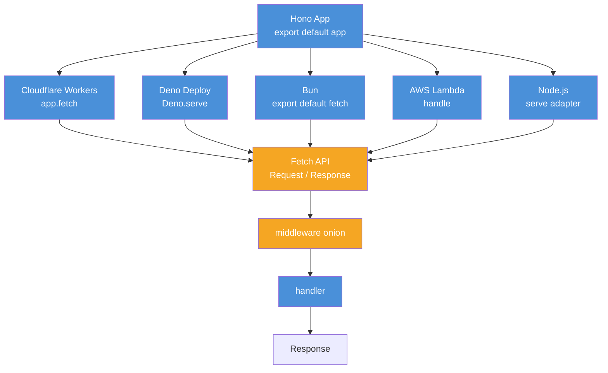

# Hono e edge runtimes

> [!abstract] TL;DR
> Hono é um framework ultralight baseado em Web Standards e Fetch API. Roda em Cloudflare Workers, Deno, Bun, AWS Lambda e Node. É boa escolha quando o deploy é edge/serverless multi-runtime; é ruim quando o app depende de APIs Node-only.

## O que é

Hono é um framework HTTP minimalista e multi-runtime. Em vez de `req`/`res` estilo Node, ele trabalha perto de `Request`/`Response` da Fetch API e expõe um contexto `c`.

## Por que importa

Edge runtimes mudam o contrato. Cloudflare Workers e similares não são "Node completo em outro lugar": `fs`, TCP custom, processos longos e várias libs nativas podem não existir. Hono dá uma API uniforme para escrever Web APIs nesse ambiente.

## Como funciona



```typescript
import { Hono } from "hono";

const app = new Hono();
app.get("/hello", (c) => c.json({ greeting: "hello" }));

export default app;
```

```typescript
// Mesmo app.fetch pode ser adaptado por runtime.
// Cloudflare Workers: export default app;
// Node: serve({ fetch: app.fetch })
// Deno: Deno.serve(app.fetch)
// Bun: export default { fetch: app.fetch }
```

```typescript
app.use("*", async (c, next) => {
  const start = Date.now();
  await next();
  const ms = Date.now() - start;
  console.log(`${c.req.method} ${c.req.url} ${ms}ms`);
});
```

```typescript
import { zValidator } from "@hono/zod-validator";
import { z } from "zod";

const CreateUser = z.object({
  name: z.string().min(1),
  email: z.string().email(),
});

app.post("/users", zValidator("json", CreateUser), (c) => {
  const data = c.req.valid("json");
  return c.json({ id: crypto.randomUUID(), ...data }, 201);
});
```

```typescript
import { HTTPException } from "hono/http-exception";

app.onError((err, c) => {
  const status = err instanceof HTTPException ? err.status : 500;
  return c.json(
    { type: "about:blank", title: "Error", status, detail: err.message },
    status,
    { "Content-Type": "application/problem+json" },
  );
});
```

## Casos práticos

Use Hono quando o deploy é Cloudflare Workers, Vercel Edge, Deno Deploy, Lambda@Edge ou quando a portabilidade multi-runtime é requisito. Prefira Express/Fastify/NestJS quando o app é Node-only, precisa de libs Node-specific ou tem integração profunda com filesystem, sockets, streams Node ou infraestrutura tradicional.

### Cenário 1 — API de feature flags em Cloudflare Workers com KV

Imagine um serviço de feature flags que precisa responder globalmente com latência mínima. O app lê flags de KV (Cloudflare KV), valida o token e retorna o conjunto de flags para o usuário. O deploy é Workers — não há servidor, não há processo longo, não há filesystem.

```typescript
// Tipos de ambiente para Workers — binding declarado no wrangler.toml.
type Env = {
  Bindings: {
    KV: KVNamespace;
    DB: D1Database;
    AUTH_SECRET: string;
  };
};

const app = new Hono<Env>();

// Middleware de auth — usa o binding AUTH_SECRET, não variável global.
app.use("/flags/*", async (c, next) => {
  const token = c.req.header("Authorization")?.replace("Bearer ", "");
  if (!token) throw new HTTPException(401, { message: "Token required" });

  // Verificação simples com HMAC — compatível com Web Crypto API.
  const valid = await verifyHmac(token, c.env.AUTH_SECRET);
  if (!valid) throw new HTTPException(401, { message: "Invalid token" });

  await next();
});

// GET /flags/:userId — lê do KV.
app.get("/flags/:userId", async (c) => {
  const userId = c.req.param("userId");
  const flags = await c.env.KV.get<Record<string, boolean>>(
    `flags:${userId}`,
    "json",
  );

  // KV pode retornar null se a chave não existir.
  return c.json(flags ?? {});
});

// POST /flags/:userId — grava no KV com TTL de 1 hora.
app.post(
  "/flags/:userId",
  zValidator("json", z.record(z.string(), z.boolean())),
  async (c) => {
    const userId = c.req.param("userId");
    const flags = c.req.valid("json");

    await c.env.KV.put(`flags:${userId}`, JSON.stringify(flags), {
      expirationTtl: 3600,
    });

    return c.json({ updated: true }, 200);
  },
);

// Error handler global — Problem Details.
app.onError((err, c) => {
  const status = err instanceof HTTPException ? err.status : 500;
  return c.json(
    {
      type: "about:blank",
      title: err instanceof HTTPException ? err.message : "Internal Error",
      status,
    },
    status,
    { "Content-Type": "application/problem+json" },
  );
});

export default app;
```

O ponto central: `c.env.KV` não existe em Node puro — é binding do runtime Workers. A aplicação foi desenhada para o ambiente, não portada de Node.

### Cenário 2 — API multi-runtime com adapter por ambiente

Imagine um CLI de desenvolvimento que precisa rodar em Node localmente, mas o deploy vai para Deno Deploy. O Hono permite um único codebase com entry point por runtime.

```typescript
// app.ts — lógica central compartilhada entre todos os runtimes.
import { Hono } from "hono";
import { zValidator } from "@hono/zod-validator";
import { z } from "zod";

export function buildApp() {
  const app = new Hono();

  app.use("*", async (c, next) => {
    const requestId = crypto.randomUUID(); // Web Crypto API — universal
    c.set("requestId", requestId);
    await next();
    c.res.headers.set("x-request-id", requestId);
  });

  const CreateItem = z.object({
    name: z.string().min(1),
    price: z.number().positive(),
  });

  app.post("/items", zValidator("json", CreateItem), (c) => {
    const data = c.req.valid("json");
    const item = { id: crypto.randomUUID(), ...data, createdAt: new Date().toISOString() };
    return c.json(item, 201);
  });

  app.onError((err, c) => {
    const status = err instanceof Error && "status" in err
      ? (err as any).status
      : 500;
    return c.json({ error: err.message }, status);
  });

  return app;
}
```

```typescript
// entry.node.ts — entry point para Node local.
import { serve } from "@hono/node-server";
import { buildApp } from "./app.js";

const app = buildApp();
const port = Number(process.env.PORT ?? 3000);

serve({ fetch: app.fetch, port }, () => {
  console.log(`Server running on http://localhost:${port}`);
});
```

```typescript
// entry.deno.ts — entry point para Deno Deploy.
import { buildApp } from "./app.ts";

const app = buildApp();
Deno.serve({ port: 8000 }, app.fetch);
```

```typescript
// entry.cloudflare.ts — entry point para Cloudflare Workers.
import { buildApp } from "./app";

export default buildApp();
```

O mesmo `buildApp()` funciona nos três runtimes porque usa apenas Web APIs (`crypto.randomUUID()`, `Response`, `Request`) — nenhuma API Node-only.

### Fetch API como contrato

Hono funciona bem porque fica perto do contrato universal da plataforma web: `Request`, `Response`, headers, URL e body streams. O contexto `c` é ergonomia em cima disso.

```typescript
app.get("/search", (c) => {
  const url = new URL(c.req.url);
  const q = url.searchParams.get("q") ?? "";
  return c.json({ query: q });
});
```

```typescript
app.get("/raw", () => {
  return new Response(JSON.stringify({ ok: true }), {
    status: 200,
    headers: { "content-type": "application/json" },
  });
});
```

Essa proximidade com Web Standards reduz lock-in de Node, mas também remove confortos do ecossistema Node tradicional.

### Bindings e ambiente

Em edge runtimes, dependências externas frequentemente aparecem como bindings, não como clients globais criados no startup.

```typescript
type Env = {
  Bindings: {
    KV: KVNamespace;
    DB: D1Database;
  };
};

const app = new Hono<Env>();

app.get("/flags/:userId", async (c) => {
  const flags = await c.env.KV.get(`flags:${c.req.param("userId")}`, "json");
  return c.json(flags ?? {});
});
```

Isso muda o desenho da aplicação: composition root tradicional dá lugar a adapters por runtime.

### Middleware onion na prática

O modelo onion permite before/after em um único middleware.

```typescript
app.use("*", async (c, next) => {
  const requestId = crypto.randomUUID();
  c.set("requestId", requestId);

  await next();

  c.res.headers.set("x-request-id", requestId);
});
```

Se `await next()` for esquecido, nada depois roda. Se `next()` for chamado duas vezes, a pipeline fica inválida.

### Limites de edge

Não fixe números absolutos como se fossem universais; cada provedor muda limites. O modelo mental é:

- CPU time menor que server tradicional.
- Memória limitada.
- Startup rápido importa.
- Conexões longas e sockets custom podem não existir.
- `fs`, `net`, `tls` e libs nativas podem falhar.
- Storage costuma ser remoto: KV, D1, Durable Objects, S3-like APIs.

```typescript
// Ruim para edge: depende de filesystem local.
const template = await fs.promises.readFile("email.html", "utf8");
```

```typescript
// Melhor: asset/binding/config entregue pelo runtime.
const template = await c.env.ASSETS.fetch(new URL("/email.html", c.req.url));
```

### Observability em edge

Logs e tracing podem ser diferentes do Node tradicional. Inclua request ID na resposta e no log, porque debugar execução distribuída sem correlação é caro.

```typescript
app.use("*", async (c, next) => {
  const requestId = crypto.randomUUID();
  await next();
  c.res.headers.set("x-request-id", requestId);
  console.log(JSON.stringify({ requestId, path: c.req.path, status: c.res.status }));
});
```

## Checklist de code review

- O código usa Web APIs ou APIs Node-only?
- Dependências externas existem no runtime alvo?
- Middleware chama `await next()` exatamente uma vez?
- Estado global é cache seguro ou estado de negócio indevido?
- Handlers evitam CPU-heavy work?
- Storage é compatível com edge/serverless?
- Observability considera cold start e request ID?
- Testes cobrem adapter Node e runtime alvo quando houver portabilidade real?

## Exercício de maturidade

Uma rota Hono que parece portátil pode esconder dependência de Node:

```typescript
import { readFile } from "node:fs/promises";

app.get("/template", async (c) => {
  return c.html(await readFile("template.html", "utf8"));
});
```

Em Node funciona; em Cloudflare Workers falha. A versão edge-aware usa asset/binding ou bundling:

```typescript
app.get("/template", async (c) => {
  const asset = await c.env.ASSETS.fetch(new URL("/template.html", c.req.url));
  return new Response(asset.body, {
    headers: { "content-type": "text/html; charset=utf-8" },
  });
});
```

O ponto de maturidade é auditar dependências por runtime, não só compilar TypeScript.

### Estado e cache

Estado global em edge deve ser tratado como cache oportunista, não fonte de verdade.

```typescript
let cachedConfig: Config | undefined;

app.get("/config", async (c) => {
  cachedConfig ??= await loadConfig(c.env.KV);
  return c.json(cachedConfig);
});
```

Isso pode reduzir latência, mas não deve ser usado para carrinho, saldo, sessão crítica ou qualquer dado que exige consistência forte.

## O que vem a seguir

Com Hono e edge runtimes mapeados, o próximo passo é entender como validation e error handling se comportam fora do Node tradicional, e quando Hono vence ou perde na decisão de framework:

- [[09 - Validation com schema]] — `@hono/zod-validator`, validação de query/body e tipos inferidos em handlers Hono.
- [[07 - Middleware pipeline]] — modelo onion vs middleware Express vs hooks Fastify: diferenças de composição.
- [[12 - Decision tree + cheatsheet]] — árvore completa de decisão incluindo Hono vs Express vs Fastify no eixo runtime.

## Armadilhas comuns

> [!warning] Assumir `fs`/`net` em edge runtime
> **O que acontece:** A aplicação lança `Error: fs is not defined` ou silenciosamente falha no Cloudflare Workers.
> **Por quê:** Edge runtimes não implementam APIs Node-only — filesystem e TCP sockets não existem.
> **Como evitar:** Audite todas as dependências com `import` de `node:*`. Use equivalentes Web API (`crypto`, `fetch`, `URL`) ou bindings do runtime.

> [!warning] CPU-heavy handler em edge
> **O que acontece:** Request é abortada por timeout de CPU — o worker excede o limite do provedor.
> **Por quê:** Edge tem limite de CPU time por invocação, muito menor que servidor tradicional.
> **Como evitar:** Operações pesadas (transformação de imagem, geração de PDF, encoding) devem ir para worker assíncrono ou serviço dedicado. Handler Hono deve ser I/O-bound.

> [!warning] Estado mutável global como fonte de verdade
> **O que acontece:** Dados que parecem persistir entre requests podem ser perdidos quando o worker é reiniciado ou escalado.
> **Por quê:** Edge pode criar múltiplas instâncias isoladas; estado global não é compartilhado entre elas.
> **Como evitar:** Use KV, D1, Durable Objects ou banco externo para qualquer dado que precisa de consistência. Estado global só para cache best-effort.

> [!warning] Esquecer `await next()` no middleware onion
> **O que acontece:** Handlers registrados depois do middleware nunca executam — a request não avança.
> **Por quê:** O modelo onion de Hono exige que o middleware chame `await next()` para continuar a cadeia.
> **Como evitar:** Todo middleware que não é "terminal" deve ter `await next()`. Adicione teste de integração que verifica a resposta final de uma rota com middlewares.

> [!warning] Bibliotecas de auth/storage que dependem de Node internals
> **O que acontece:** `jsonwebtoken`, `bcrypt`, `prisma` e similares falham em edge porque usam C++ bindings ou APIs Node.
> **Por quê:** Essas libs foram construídas para Node, não para Web Standards.
> **Como evitar:** Prefira `jose` (JWT/JOSE para Web Crypto), `@noble/hashes` (crypto puro), `@cloudflare/d1` ou SDKs nativos do provedor.

> [!warning] Tratar KV como banco transacional
> **O que acontece:** Leituras do KV retornam valor desatualizado em região diferente; writes não são atômicos por default.
> **Por quê:** KV é eventually consistent — otimizado para leitura global, não para consistência forte.
> **Como evitar:** KV serve para configuração, feature flags, sessão e cache. Para transações, use D1, Durable Objects ou banco externo com consistência forte.

> [!warning] Client pesado criado por request
> **O que acontece:** Conexão de banco ou inicialização de SDK acontece a cada invocação do worker — latência alta e custo desnecessário.
> **Por quê:** Workers têm cold start, mas clientes devem ser criados uma vez por instância, não por request.
> **Como evitar:** Inicialize clientes fora do handler, no escopo do módulo — eles são reutilizados enquanto a instância do worker existir.

> [!warning] Achar que multi-runtime é grátis
> **O que acontece:** App que "roda em Hono" precisa de meses de trabalho para realmente rodar em todos os runtimes.
> **Por quê:** Cada runtime tem bindings próprios, limites de CPU/memória, modelo de deploy e tooling.
> **Como evitar:** Defina o runtime alvo antes de começar. "Portabilidade" como objetivo secundário é razoável; como objetivo primário, audite o ecossistema de dependências de cada runtime antes de comprometer.

> [!warning] `c.req.url` retornando URL relativa em alguns contextos
> **O que acontece:** `new URL(c.req.url)` lança `TypeError: Invalid URL` quando `c.req.url` é um pathname relativo.
> **Por quê:** Em alguns adapters ou ambientes, `c.req.url` pode ser relativa — `URL` constructor exige base.
> **Como evitar:** Use `c.req.url` com base explícita: `new URL(c.req.url, "http://localhost")` ou use `c.req.path` para o pathname.

## Perguntas de entrevista

**O que diferencia Hono de Express?**
Hono é baseado em Fetch API e Web Standards, pensado para múltiplos runtimes. Express é centrado no modelo HTTP de Node.

**Quando Hono não é boa escolha?**
Quando o app depende profundamente de APIs Node-only, sockets, filesystem local, libs nativas ou processos longos.

**O que é onion middleware?**
Um middleware executa lógica antes de `await next()` e depois que os próximos handlers terminam.

**Qual é a decisão principal antes de usar Hono?**
Confirmar deploy target. Se o runtime é edge/serverless multi-runtime, Hono faz sentido; se é Node container tradicional, compare com Express/Fastify.

## Em entrevista

"Hono is an ultralight, multi-runtime framework built on Web Standards. It uses the Fetch API model instead of Node's `req` and `res`, and it runs on Cloudflare Workers, Deno, Bun, AWS Lambda, and Node. The decision is deploy-driven: choose it for edge or serverless multi-runtime apps; avoid it when the application depends deeply on Node-only APIs."

Vocabulário-chave:

- edge runtime -> runtime de borda
- Fetch API native -> nativo da Fetch API
- multi-runtime -> múltiplos runtimes
- ultralight -> ultraleve
- onion middleware -> middleware em cebola

## Fontes

- [Hono docs](https://hono.dev/docs)
- [Hono getting started — multi-runtime](https://hono.dev/docs/getting-started/basic)

## Veja também

- [[01 - Os 4 frameworks - Express, NestJS, Fastify, Hono]]
- [[07 - Middleware pipeline]]
- [[09 - Validation com schema]]
- [[12 - Decision tree + cheatsheet]]
- [[Node.js]]
