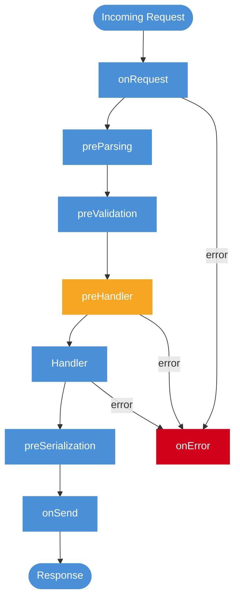

# Middleware pipeline

> [!abstract] TL;DR
> Middleware é a pipeline de funções que processa request/response ao redor do handler. Express usa `(req, res, next)`, Fastify usa hooks nomeados, NestJS usa middleware + interceptors/guards/pipes/filters, Hono usa onion model com `await next()`. Saber mapear cada concern para o hook certo — e não apenas para o primeiro `app.use()` disponível — separa quem usa middleware de quem entende o ciclo de vida real da request.

## O que é

Pipeline é onde entram concerns transversais: logging, auth, CORS, rate limit, parsing, tracing e error handling. O conceito é comum; o modelo de cada framework muda.

Pense na pipeline como um cano duplo: a request entra de um lado, passa por cada middleware em sequência, chega no handler, e a response volta pelo mesmo cano — cada middleware pode atuar nos dois sentidos. O que varia por framework é quantas seções esse cano tem e se elas têm nomes explícitos ou apenas posição de registro.

## Por que importa

Quem entende só Express tende a procurar `next()` em todo lugar. Em Fastify, o ponto certo pode ser `preHandler`; em NestJS, auth pode ser Guard; em Hono, after logic vem depois de `await next()`. Saber mapear o concern para o hook certo é skill de senior.

O custo de ignorar isso é real: auth colocado em `onRequest` no Fastify roda antes de parsing, então o body ainda não está disponível. Logging só no caminho feliz deixa erros e conexões abortadas invisíveis. Guard no controller ao invés de pipeline repete código e perde ortogonalidade com o resto do sistema.

## Como funciona

```typescript
// Express: sequencial e mutável.
app.use((req, _res, next) => {
  req.startTime = Date.now();
  next();
});
```

```typescript
// Fastify: hooks nomeados por fase.
app.addHook("onRequest", async (req) => {
  req.startTime = Date.now();
});

app.addHook("onResponse", async (req) => {
  app.log.info({ ms: Date.now() - req.startTime });
});
```

```typescript
// NestJS: interceptor com before/after.
@Injectable()
class TimingInterceptor implements NestInterceptor {
  intercept(_ctx: ExecutionContext, next: CallHandler) {
    const start = Date.now();
    return next.handle().pipe(tap(() => log(Date.now() - start)));
  }
}
```

```typescript
// Hono: onion model.
app.use("*", async (_c, next) => {
  const start = Date.now();
  await next();
  console.log(`took ${Date.now() - start}ms`);
});
```

| Framework | Modelo | Mutação | Async | Before/after |
| --- | --- | --- | --- | --- |
| Express | `next()` callback | Comum | v5 nativo | Sequencial |
| Fastify | Hooks tipados | Parcial | Sim | Fase nomeada |
| NestJS | Interceptors + hooks | Sim | Sim | Lifecycle explícito |
| Hono | Onion com `await next()` | Sim | Sim | Mesmo middleware antes/depois |

### Anatomia do lifecycle Fastify

Fastify tem um lifecycle com fases nomeadas. A ordem importa para entender onde cada hook atua:



`preHandler` é o hook certo para auth em Fastify: body já foi parseado e validado, mas handler ainda não rodou. `onRequest` roda cedo demais para acessar body; `onResponse` roda tarde demais para bloquear o request.

## Casos práticos

### Cenário 1: logging completo de request em Express com conexão abortada

Uma API de e-commerce precisa logar latência, status e request ID em todas as rotas, inclusive nas que lançam erro e nas que têm conexão abortada pelo cliente antes da resposta.

```typescript
import express, { Request, Response, NextFunction } from "express";
import { randomUUID } from "crypto";

// Extensão de tipo para Request.
declare global {
  namespace Express {
    interface Request { id: string; startTime: number }
  }
}

const app = express();

// 1. Request ID: deve ser o primeiro middleware.
app.use((req: Request, _res: Response, next: NextFunction) => {
  req.id = (req.headers["x-request-id"] as string) ?? randomUUID();
  req.startTime = Date.now();
  next();
});

// 2. Timing + logging: usa eventos da response para capturar após finalizar.
app.use((req: Request, res: Response, next: NextFunction) => {
  res.on("finish", () => {
    console.log(JSON.stringify({
      requestId: req.id,
      method: req.method,
      path: req.path,
      status: res.statusCode,
      ms: Date.now() - req.startTime,
    }));
  });

  // "close" captura conexão encerrada antes do fim.
  res.on("close", () => {
    if (!res.writableEnded) {
      console.warn(JSON.stringify({
        requestId: req.id,
        event: "aborted",
        ms: Date.now() - req.startTime,
      }));
    }
  });

  next();
});

app.get("/orders", (_req, res) => res.json({ orders: [] }));
```

`finish` indica resposta enviada com sucesso; `close` captura conexão encerrada antes do fim. Sem `close`, requests abortadas por timeout de cliente ficam invisíveis nas métricas e parecem latência zero.

### Cenário 2: auth com propagação de contexto tipado em Fastify

Uma API de relatórios precisa injetar o usuário autenticado no contexto de cada request, disponível para todos os handlers sem repetição. Fastify exige declaração de tipo explícita para o campo adicionado.

```typescript
import Fastify from "fastify";
import { verifyToken } from "./auth";

// Extensão de tipo do Request Fastify.
declare module "fastify" {
  interface FastifyRequest {
    user: { id: string; roles: string[] };
  }
}

const app = Fastify({ logger: true });

// preHandler: body e query já estão disponíveis após parsing/validation.
app.addHook("preHandler", async (req, reply) => {
  const token = req.headers.authorization?.replace("Bearer ", "");
  if (!token) {
    return reply.code(401).send({
      type: "about:blank",
      title: "Unauthorized",
      status: 401,
      instance: req.url,
    });
  }

  try {
    req.user = await verifyToken(token);
  } catch {
    return reply.code(401).send({
      type: "about:blank",
      title: "Invalid token",
      status: 401,
      instance: req.url,
    });
  }
});

app.get("/reports/:id", async (req) => {
  // req.user está disponível e tipado em todos os handlers.
  if (!req.user.roles.includes("analyst")) {
    throw { statusCode: 403, message: "Insufficient role" };
  }
  return { reportId: (req.params as { id: string }).id, owner: req.user.id };
});
```

O hook `preHandler` garante que auth roda depois de parsing/validation, mas antes do handler. Declarar `user` no módulo Fastify evita cast manual em cada handler e ativa verificação de tipo.

### Logging comparado

O mesmo concern muda de forma em cada framework.

```typescript
// Express
app.use((req, res, next) => {
  const start = Date.now();
  res.on("finish", () => logger.info({ path: req.path, ms: Date.now() - start }));
  next();
});
```

```typescript
// Fastify
app.addHook("onResponse", async (req, reply) => {
  req.log.info({ statusCode: reply.statusCode }, "request completed");
});
```

```typescript
// NestJS
return next.handle().pipe(
  tap(() => this.logger.log({ handler: ctx.getHandler().name })),
);
```

```typescript
// Hono
app.use("*", async (c, next) => {
  const start = Date.now();
  await next();
  console.log(c.req.path, Date.now() - start);
});
```

Express usa evento da response; Fastify já integra logger por request; NestJS envolve handler; Hono usa before/after no mesmo middleware.

### Auth comparado

Auth precisa escolher ponto do lifecycle conforme dado disponível.

```typescript
// Express: middleware antes do router protegido.
app.use("/api/private", authenticate, privateRouter);
```

```typescript
// Fastify: preHandler depois de parsing/validation.
app.addHook("preHandler", async (req) => {
  req.user = await authenticate(req.headers.authorization);
});
```

```typescript
// NestJS: Guard.
@UseGuards(AuthGuard, RolesGuard)
@Get("admin/report")
report() {}
```

```typescript
// Hono: contexto tipado.
app.use("/private/*", async (c, next) => {
  c.set("user", await authenticate(c.req.header("authorization")));
  await next();
});
```

### Antes/depois nem sempre existe

Express middleware clássico não tem after natural. Você precisa ouvir `finish`/`close` na response. Hono onion e NestJS interceptor têm after explícito. Fastify tem hooks de response.

```typescript
app.use((req, res, next) => {
  res.on("finish", () => audit(req, res.statusCode));
  res.on("close", () => auditAborted(req));
  next();
});
```

Esse detalhe importa para métricas: `finish` indica resposta enviada; `close` pode indicar conexão abortada.

### Ordem vs fase nomeada

Express e Hono dependem fortemente da ordem de registro. Fastify e NestJS dão nomes/fases, mas ainda há ordem dentro do mesmo escopo.

```typescript
app.use(authenticate);
app.use(authorize);
app.use(router);
```

```typescript
app.addHook("preHandler", authenticate);
app.addHook("preHandler", authorize);
```

O modelo muda, mas o princípio permanece: pipeline é contrato.

## Checklist de code review

- O concern está no hook certo ou foi enfiado no controller?
- Há diferença clara entre authn e authz?
- Métricas capturam sucesso, erro e conexão abortada?
- Middleware CPU-heavy foi evitado?
- A ordem de middlewares está documentada?
- Dados adicionados ao contexto/request têm tipo?
- Error handling conversa com [[08 - Error handling estruturado]]?
- CORS/rate limit/body parser estão antes das rotas certas?

## Exercício de maturidade

Uma API imatura repete concerns em cada handler:

```typescript
app.get("/orders", async (req, res) => {
  const start = Date.now();
  if (!req.headers.authorization) return res.sendStatus(401);
  try {
    res.json(await orders.list());
  } finally {
    console.log(Date.now() - start);
  }
});
```

A versão madura move concerns para pipeline:

```typescript
app.use(requestId);
app.use(timing);
app.use(authenticate);
app.get("/orders", listOrders);
app.use(problemDetailsHandler);
```

O handler volta a expressar o caso de uso. A pipeline expressa policies transversais.

### Ordem recomendada por categoria

```text
request id / tracing
security headers
CORS
body parser com limite
rate limit barato
authn
authz
validation
handler
not found
error handler
```

Nem todo framework usa exatamente essa sequência, mas o raciocínio ajuda: coloque proteções baratas antes de operações caras.

### Quando não usar middleware

Nem toda lógica compartilhada é middleware. Regra de domínio compartilhada deve ir para service/use case/policy, não para pipeline HTTP.

```typescript
// Ruim: middleware decide regra de desconto.
app.use(applyBlackFridayDiscount);

// Melhor: policy de domínio chamada pelo use case.
const price = discountPolicy.apply(order, campaign);
```

## Armadilhas comuns

> [!warning] Express: ordem de `app.use()` é contrato silencioso
> **O que acontece:** comportamento muda conforme middlewares são registrados fora de ordem — auth depois do router deixa rotas desprotegidas, body parser depois do handler resulta em body `undefined`. **Por quê:** Express processa middlewares na ordem de registro, sem garantias explícitas de fase nomeada. **Como evitar:** documente a ordem canônica; revise `app.use()` em code review como se fosse config de segurança.

> [!warning] Fastify: `onRequest` sem body disponível
> **O que acontece:** tentar acessar `req.body` no hook `onRequest` retorna `undefined` porque parsing ainda não rodou. **Por quê:** o lifecycle Fastify separa `onRequest` (antes de parsing) de `preHandler` (após parsing e validação). **Como evitar:** use `preHandler` para lógica que precisa do body; `onRequest` só para tracing, IP check e headers iniciais.

> [!warning] NestJS: middleware clássico sem acesso a DI
> **O que acontece:** tentar injetar serviço no middleware registrado com `app.use()` falha; a instância não está disponível. **Por quê:** middleware clássico em NestJS é próximo do Express puro e não participa do ciclo de DI do container. **Como evitar:** use Guards para auth e Interceptors para logging/transform; reserve middleware clássico para concerns que não precisam de DI.

> [!warning] Hono: `await next()` esquecido paralisa a pipeline
> **O que acontece:** handler ou middleware seguinte nunca executa; a response fica pendente ou retorna vazia. **Por quê:** Hono usa onion model explícito — o controle passa para o próximo handler apenas com `await next()`. **Como evitar:** todo middleware Hono que não termina a request deve ter `await next()` em ponto deliberado do fluxo.

> [!warning] Middleware CPU-heavy bloqueia o event loop
> **O que acontece:** requests ficam enfileiradas enquanto middleware síncrono pesado processa uma de cada vez. **Por quê:** Node.js tem um único thread JS; operação CPU-bound bloqueia o [[03-Dominios/Tecnologia/Node/Runtime e Event Loop/index]] para todas as requests. **Como evitar:** mova processamento pesado para worker threads ou serviços externos; mantenha middleware I/O-bound e rápido.

> [!warning] Logging só no caminho feliz
> **O que acontece:** erros e conexões abortadas pelo cliente não aparecem nos logs, criando pontos cegos em observability. **Por quê:** sem escutar `close` e `error` na response, o middleware de logging só dispara em finalizações bem-sucedidas. **Como evitar:** em Express, combine `res.on("finish")` com `res.on("close")`; em Fastify, use `onError` + `onResponse`.

> [!warning] Auth global bloqueando `/health` e `/metrics`
> **O que acontece:** liveness probe do Kubernetes retorna 401 e o pod é reiniciado em loop. **Por quê:** middleware de auth global sem exceção de rota cobre todos os paths, incluindo os de infraestrutura. **Como evitar:** use routers separados ou condicionais explícitas para rotas públicas antes do middleware de auth.

> [!warning] Rate limit depois de operação cara
> **O que acontece:** ataque de DDoS ainda consome CPU, banco e chamadas externas antes de ser bloqueado. **Por quê:** rate limit colocado ao final da pipeline só age depois de todos os outros middlewares processarem a request. **Como evitar:** coloque rate limit antes de authn/authz e qualquer operação de custo variável.

> [!warning] Contexto mutável sem tipagem
> **O que acontece:** bug aparece longe da origem — um middleware seta propriedade com typo e outro falha silenciosamente ao ler `undefined`. **Por quê:** em Express, `req` é mutável e não tipado por padrão; qualquer middleware pode adicionar qualquer campo. **Como evitar:** declare extensões de `Request` com TypeScript declaration merging; use `req.user: AuthUser` em vez de `req.user: any`.

## Perguntas de entrevista

**Onde colocar logging?** Na pipeline, não no controller. O mecanismo muda por framework: Express response events, Fastify `onResponse`, NestJS interceptor, Hono onion.

**Qual a diferença entre middleware e interceptor em NestJS?** Middleware é mais próximo do Express e roda cedo; interceptor é DI-aware e envolve o handler.

**Por que Fastify tem hooks nomeados?** Para dar pontos precisos do lifecycle, como `onRequest`, `preValidation`, `preHandler`, `onResponse`.

**Qual bug comum em Hono/Koa-like?** Esquecer `await next()`, impedindo a continuação da pipeline.

## Em entrevista

"Middleware is the cross-cutting pipeline around handlers, but each framework models it differently. Express is sequential and mutation-friendly with `(req, res, next)`. Fastify has lifecycle hooks like `onRequest`, `preHandler`, and `onResponse`. NestJS uses both traditional middleware and DI-aware hooks such as guards and interceptors. Hono uses the Koa-like onion model with `await next()`."

Vocabulário-chave:

- middleware -> middleware
- hook -> gancho
- interceptor -> interceptor
- onion model -> modelo cebola
- request lifecycle -> ciclo de vida da request

## O que vem a seguir

Com a pipeline dominada, o próximo passo é estruturar o que acontece quando algo falha nela. [[08 - Error handling estruturado]] mostra como transformar exceções em contratos previsíveis usando Problem Details (RFC 7807). Depois, [[09 - Validation com schema]] fecha o ciclo: toda entrada que chega via pipeline precisa ser validada com schema antes de atingir o handler.

## Fontes

- [Express: using middleware](https://expressjs.com/en/guide/using-middleware.html)
- [Fastify: lifecycle](https://fastify.dev/docs/latest/Reference/Lifecycle/)
- [NestJS: middleware](https://docs.nestjs.com/middleware)
- [NestJS: interceptors](https://docs.nestjs.com/interceptors)

## Veja também

- [[02 - Express idiomático]]
- [[04 - NestJS - guards, interceptors, pipes, filters]]
- [[05 - Fastify - schema-first, plugins, performance]]
- [[06 - Hono e edge runtimes]]
- [[Node.js]]
