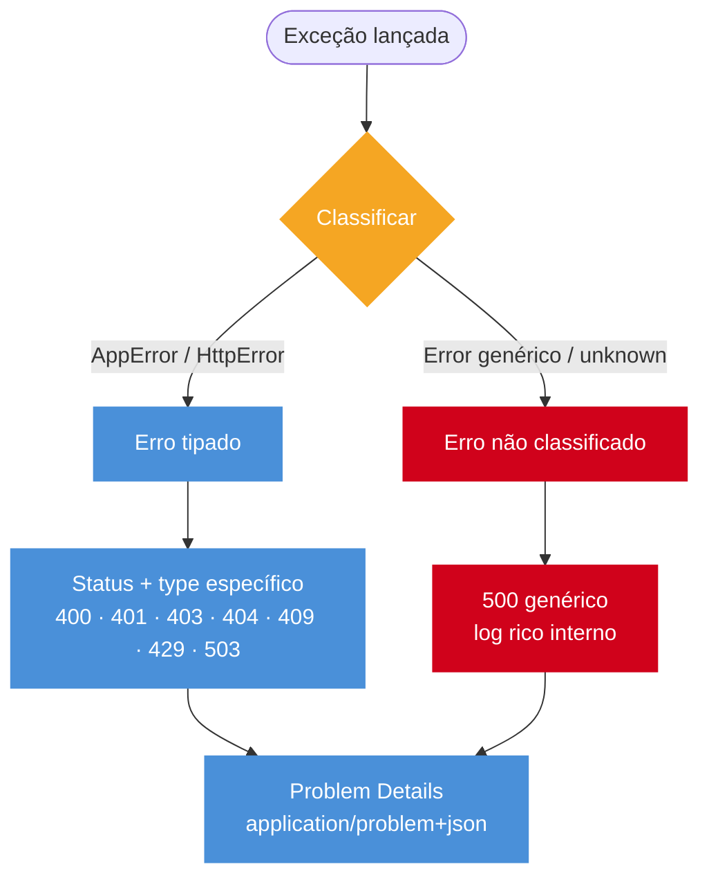

# Error handling estruturado

> [!abstract] TL;DR
> Problem Details (RFC 7807) padroniza erros HTTP com `application/problem+json` e campos como `type`, `title`, `status`, `detail`, `instance`. Express implementa com error middleware de 4 argumentos; NestJS com exception filter; Fastify com `setErrorHandler`; Hono com `app.onError`. O ponto de maturidade é ter um único lugar para policy de erro: logs ricos internamente, resposta sanitizada externamente, com taxonomy explícita entre erros do cliente e bugs do servidor.

## O que é

Error handling estruturado é tratar erro como contrato de API. Em vez de cada endpoint retornar JSON diferente, a API usa um envelope previsível que clientes e logs conseguem entender.

RFC 7807 define o formato padrão para erros HTTP com o media type `application/problem+json`. Os campos obrigatórios são `type` (URI que identifica o tipo de problema), `title` (descrição curta), `status` (código HTTP), `detail` (explicação específica desta ocorrência) e `instance` (URI da request que gerou o erro). Campos extras são permitidos para detalhes como lista de campos inválidos.

## Por que importa

Sem padrão, cliente faz parsing ad-hoc, observability perde contexto e bugs 4xx/5xx se misturam. Com Problem Details, cada erro tem status, título, detalhe e instância da request.

O impacto prático é direto: um `{ "error": "something went wrong" }` com status 500 não diz ao cliente se deve exibir mensagem para usuário, tentar retry ou abortar o fluxo. Um `application/problem+json` com `type`, `status` e `detail` estruturados permite tratamento diferenciado por tipo de erro sem parsing frágil de string.

## Como funciona

```json
{
  "type": "https://api.example.com/errors/validation",
  "title": "Validation Failed",
  "status": 400,
  "detail": "Field 'email' must be a valid email",
  "instance": "/api/v1/users"
}
```

```typescript
class HttpError extends Error {
  constructor(
    public readonly status: number,
    public readonly type: string,
    message: string,
  ) {
    super(message);
  }
}

app.use((err: Error, req: Request, res: Response, next: NextFunction) => {
  if (res.headersSent) return next(err);
  const status = err instanceof HttpError ? err.status : 500;
  res.status(status).type("application/problem+json").json({
    type: err instanceof HttpError ? err.type : "about:blank",
    title: err.name,
    status,
    detail: status >= 500 ? "Unexpected error" : err.message,
    instance: req.originalUrl,
  });
});
```

```typescript
@Catch()
export class ProblemDetailsFilter implements ExceptionFilter {
  catch(exception: unknown, host: ArgumentsHost) {
    const ctx = host.switchToHttp();
    const res = ctx.getResponse<Response>();
    const req = ctx.getRequest<Request>();
    const status = exception instanceof HttpException ? exception.getStatus() : 500;

    res.status(status).type("application/problem+json").json({
      type: "about:blank",
      title: "Error",
      status,
      detail: status >= 500 ? "Unexpected error" : String(exception),
      instance: req.url,
    });
  }
}
```

```typescript
app.setErrorHandler((err, req, reply) => {
  const status = err.statusCode ?? 500;
  reply.code(status).type("application/problem+json").send({
    type: "about:blank",
    title: err.name,
    status,
    detail: status >= 500 ? "Unexpected error" : err.message,
    instance: req.url,
  });
});
```

```typescript
app.onError((err, c) => {
  const status = err instanceof HTTPException ? err.status : 500;
  return c.json(
    { type: "about:blank", title: "Error", status, detail: err.message, instance: c.req.url },
    status,
    { "Content-Type": "application/problem+json" },
  );
});
```

### Fluxo de classificação de erros



Taxonomy prática:

- 4xx: cliente errou (validation, auth, not found).
- 5xx: servidor errou (bug, dependência indisponível, timeout interno).
- Programmer error: bug; logar e responder 500 genérico.
- Operational error: esperado; responder status específico.

## Casos práticos

### Cenário 1: taxonomy centralizada em Express com middleware global

Uma API de pedidos precisa diferenciar erros de validation (400), não encontrado (404), conflito de estado (409) e falha de dependência (503), com resposta padronizada e logs ricos internos.

```typescript
// errors.ts — hierarchy tipada de AppError
abstract class AppError extends Error {
  abstract readonly status: number;
  abstract readonly type: string;
  abstract readonly title: string;
}

class ValidationError extends AppError {
  readonly status = 400;
  readonly type = "https://api.example.com/errors/validation";
  readonly title = "Validation Failed";
  constructor(public readonly invalidParams: { name: string; reason: string }[]) {
    super("Request payload is invalid");
  }
}

class NotFoundError extends AppError {
  readonly status = 404;
  readonly type = "https://api.example.com/errors/not-found";
  readonly title = "Not Found";
}

class ConflictError extends AppError {
  readonly status = 409;
  readonly type = "https://api.example.com/errors/conflict";
  readonly title = "Conflict";
}

class DependencyUnavailableError extends AppError {
  readonly status = 503;
  readonly type = "https://api.example.com/errors/dependency-unavailable";
  readonly title = "Dependency Unavailable";
}
```

```typescript
// error-handler.ts — middleware de 4 argumentos obrigatório em Express
import type { NextFunction, Request, Response } from "express";

export function problemDetailsHandler(
  err: unknown,
  req: Request,
  res: Response,
  _next: NextFunction,
): void {
  if (res.headersSent) return;

  const problem =
    err instanceof AppError
      ? {
          type: err.type,
          title: err.title,
          status: err.status,
          detail: err.message,
          instance: req.originalUrl,
          ...(err instanceof ValidationError ? { invalidParams: err.invalidParams } : {}),
        }
      : {
          type: "about:blank",
          title: "Internal Server Error",
          status: 500,
          detail: "Unexpected error",
          instance: req.originalUrl,
        };

  req.log?.error({ err, problem }, "request failed");
  res.status(problem.status).type("application/problem+json").json(problem);
}
```

```typescript
// server.ts — handlers sem lógica de erro local
app.post("/orders/:id/cancel", asyncHandler(async (req, res) => {
  const order = await orders.findById(req.params.id);
  if (!order) throw new NotFoundError("Order not found");
  if (order.status !== "pending") throw new ConflictError("Cannot cancel a non-pending order");
  await orders.cancel(order.id);
  res.status(204).send();
}));

app.use(problemDetailsHandler); // último middleware
```

Handler não contém nenhuma lógica de serialização de erro. A taxonomy está centralizada no middleware e pode evoluir sem tocar em cada endpoint.

### Cenário 2: dependência externa com Retry-After em Fastify

Uma API de pagamentos que chama um gateway externo precisa sinalizar ao cliente quando tentar novamente — sem expor detalhes internos do provider ou do circuito.

```typescript
// payment-errors.ts
class PaymentProviderUnavailable extends AppError {
  readonly status = 503;
  readonly type = "https://api.example.com/errors/payment-provider-unavailable";
  readonly title = "Payment Provider Unavailable";
  constructor(public readonly retryAfterSeconds: number) {
    super("Payment provider is temporarily unavailable");
  }
}
```

```typescript
// Fastify setErrorHandler com Retry-After dinâmico
app.setErrorHandler((err, req, reply) => {
  const isUnavailable = err instanceof PaymentProviderUnavailable;
  const isAppError = err instanceof AppError;
  const status = isAppError ? err.status : 500;

  if (isUnavailable) {
    reply.header("Retry-After", String(err.retryAfterSeconds));
  }

  const detail =
    status >= 500 && !isUnavailable ? "Unexpected error" : err.message;

  reply.code(status).type("application/problem+json").send({
    type: isAppError ? err.type : "about:blank",
    title: isAppError ? err.title : "Internal Server Error",
    status,
    detail,
    instance: req.url,
  });
});

// Handler: foca no fluxo feliz, lança tipado nos casos de falha
app.post("/payments", async (req) => {
  try {
    return await gateway.charge(req.body);
  } catch (err) {
    if (isGatewayCircuitOpen(err)) {
      throw new PaymentProviderUnavailable(30);
    }
    throw err;
  }
});
```

O cliente recebe `503` com `Retry-After: 30` sem saber que o gateway interno é Stripe, Pagar.me ou qualquer outro provider. O contrato público é estável mesmo que o provider mude.

### Taxonomy operacional

Uma API madura diferencia erro por origem e por ação esperada.

| Tipo | Exemplo | Status | Ação |
| --- | --- | --- | --- |
| Validation | body inválido | 400/422 | cliente corrige payload |
| Authn | token ausente/inválido | 401 | cliente autentica |
| Authz | sem permissão | 403 | cliente não deve repetir igual |
| Not found | recurso inexistente | 404 | cliente ajusta referência |
| Conflict | versão/estado conflita | 409 | cliente refaz fluxo |
| Rate limit | limite excedido | 429 | cliente aguarda |
| Dependency | DB/serviço fora | 503 | retry/backoff |
| Programmer | bug/type error | 500 | log + alerta |

Essa tabela deve virar código, não só documentação.

```typescript
abstract class AppError extends Error {
  abstract readonly status: number;
  abstract readonly type: string;
  abstract readonly title: string;
}

class ConflictError extends AppError {
  readonly status = 409;
  readonly type = "https://api.example.com/errors/conflict";
  readonly title = "Conflict";
}
```

### Problem Details com extensão

RFC 7807 permite membros extras. Use com parcimônia para campos úteis ao cliente.

```json
{
  "type": "https://api.example.com/errors/validation",
  "title": "Validation Failed",
  "status": 400,
  "detail": "Request body is invalid",
  "instance": "/api/v1/users",
  "invalidParams": [
    { "name": "email", "reason": "must be a valid email" }
  ]
}
```

O contrato deve ser estável. Não inclua stack, SQL, nome de tabela ou mensagem crua de dependência.

### Logs e resposta não são a mesma coisa

Resposta ao cliente deve ser sanitizada. Log interno deve ser rico.

```typescript
logger.error({
  err,
  requestId: req.id,
  path: req.originalUrl,
  userId: req.user?.id,
}, "request failed");

res.status(500).type("application/problem+json").json({
  type: "about:blank",
  title: "Internal Server Error",
  status: 500,
  detail: "Unexpected error",
  instance: req.originalUrl,
});
```

Essa separação reduz vazamento sem perder debuggability.

### Streaming e erro tardio

Depois que headers/body começaram, não há como responder Problem Details. Em Express, se `res.headersSent`, delegue ou encerre. Em streams, use [[03-Dominios/Tecnologia/Node/Streams/index]] e `pipeline` para cleanup.

```typescript
if (res.headersSent) {
  req.log?.error({ err }, "streaming response failed after headers");
  return next(err);
}
```

## Checklist de code review

- Erros conhecidos têm classes/tipos explícitos?
- 4xx e 5xx não estão misturados?
- Stack trace nunca sai em produção?
- Logs internos têm request/correlation ID?
- Problem Details tem `type`, `title`, `status`, `detail`, `instance`?
- Validation errors têm formato parseável?
- Streaming trata `headersSent`?
- Retryable errors usam status adequado, como 503/429?

## Exercício de maturidade

Um handler imaturo responde erro localmente:

```typescript
app.post("/users", async (req, res) => {
  try {
    const user = await users.create(req.body);
    res.json(user);
  } catch (err) {
    res.status(500).json({ error: String(err) });
  }
});
```

Uma versão madura deixa a taxonomy centralizada:

```typescript
app.post("/users", asyncHandler(async (req, res) => {
  const user = await users.create(req.body);
  res.status(201).json(user);
}));

app.use(problemDetailsHandler);
```

```typescript
function problemDetailsHandler(err: unknown, req: Request, res: Response, next: NextFunction) {
  const problem = classifyError(err, req.originalUrl);
  req.log.error({ err, problem }, "request failed");
  res.status(problem.status).type("application/problem+json").json(problem);
}
```

O ponto de maturidade é ter um único lugar para policy de erro, com logs ricos e resposta estável.

### Erro de dependência externa

Dependência fora não é validation error. Use status e mensagem que ajudem cliente e operação.

```typescript
class PaymentProviderUnavailable extends AppError {
  readonly status = 503;
  readonly type = "https://api.example.com/errors/payment-provider-unavailable";
  readonly title = "Payment Provider Unavailable";
}
```

Inclua `Retry-After` quando fizer sentido. Não diga ao cliente "ECONNRESET from provider X" se isso não faz parte do contrato público.

## Armadilhas comuns

> [!warning] Stack trace em produção: vazamento de informação
> **O que acontece:** cliente recebe stack trace com paths internos, nomes de dependências e às vezes dados sensíveis de contexto. **Por quê:** error middleware sem sanitização retorna `err.stack` diretamente na response. **Como evitar:** sempre sanitize response para 5xx com mensagem genérica; mantenha stack nos logs internos com correlation ID.

> [!warning] Express error middleware com 3 argumentos
> **O que acontece:** o middleware nunca é invocado para erros; a request fica sem resposta ou recebe 500 genérico do Express. **Por quê:** Express detecta error middleware pela aridade da função (`.length === 4`); com 3 args, é tratado como middleware normal. **Como evitar:** declare sempre `(err: unknown, req: Request, res: Response, next: NextFunction)`, mesmo que `next` não seja usado.

> [!warning] Taxonomy quebrada: 500 para validation, 400 para DB down
> **O que acontece:** cliente recebe status errado; automações e logs ficam confusos sobre quem errou. **Por quê:** sem taxonomy explícita, código usa o primeiro status que vem à mente ou um 500 genérico para tudo. **Como evitar:** implemente taxonomy como classes tipadas; nunca use `res.status()` diretamente nos handlers para erros.

> [!warning] Express 4: handler async sem wrapper, rejeição silenciosa
> **O que acontece:** `Promise` rejeitada não chega ao error middleware global; request fica pendurada ou o processo emite `unhandledRejection`. **Por quê:** Express 4 não captura promises rejeitadas automaticamente; exige que `next(err)` seja chamado. **Como evitar:** use `express-async-handler` ou wrapper próprio; ou atualize para Express 5 que captura async nativamente.

> [!warning] `detail` com mensagem interna de banco
> **O que acontece:** response vaza schema, nome de coluna, constraint name ou query SQL para o cliente. **Por quê:** erro de ORM/driver é propagado diretamente para o campo `detail` do Problem Details. **Como evitar:** intercepte erros de infraestrutura e mapeie para mensagens de domínio antes de construir a response.

> [!warning] Responder erro diferente em cada endpoint
> **O que acontece:** cada rota retorna formato diferente; cliente precisa de lógica de parsing específica por endpoint. **Por quê:** falta de handler global e ausência de classes de erro compartilhadas entre rotas. **Como evitar:** handler global único; endpoints só lançam exceções tipadas, nunca chamam `res.status()` para erros.

> [!warning] Logar só `err.message` perde stack e cause
> **O que acontece:** debugging é cego; não há como rastrear onde o erro se originou ou qual dependência falhou. **Por quê:** `logger.error(err.message)` descarta stack trace e eventuais `err.cause` encadeados. **Como evitar:** logue o objeto `err` completo: `logger.error({ err }, "message")` — Pino e Winston serializam stack automaticamente.

> [!warning] Converter erro desconhecido em 200 com `{ success: false }`
> **O que acontece:** monitoramento não detecta falhas; alertas não disparam; métricas de erro ficam zeradas. **Por quê:** padrão herdado de épocas sem observability — desenvolvedor tenta evitar que status 5xx dispare alerta. **Como evitar:** retorne status HTTP correto; use Problem Details; configure alertas em 5xx, não em campo de resposta.

> [!warning] Não diferenciar erro retryable de permanente
> **O que acontece:** cliente tenta retry em erro 400 (que nunca vai mudar) e não tenta em 503 (que poderia resolver). **Por quê:** taxonomy não separa erros transitórios de permanentes; todos viram 500 ou 400. **Como evitar:** use 503 + `Retry-After` para falhas transitórias; use 409/422 para estados que exigem ação do cliente antes de retry.

## Perguntas de entrevista

**O que é Problem Details?** Um formato padrão para erros HTTP estruturados com media type `application/problem+json` e campos como `type`, `title`, `status`, `detail`, `instance`.

**Por que não expor stack trace?** Porque stack revela detalhes internos, paths, dependências e às vezes dados sensíveis. Stack pertence ao log, não à resposta.

**Como tratar erro de validação?** Como erro 4xx com detalhes parseáveis por campo, sem transformar em 500.

**Como lidar com erro depois de iniciar streaming?** Não tente trocar para JSON. Faça cleanup, logue, encerre/delegue conforme o framework.

## Em entrevista

"Problem Details, from RFC 7807, gives HTTP APIs a standard error envelope: `type`, `title`, `status`, `detail`, and `instance`, usually with `application/problem+json`. Express uses error middleware, NestJS uses exception filters, Fastify uses `setErrorHandler`, and Hono uses `app.onError`. The senior part is taxonomy: operational errors get specific 4xx/5xx responses, programmer errors get logged and sanitized."

Vocabulário-chave:

- Problem Details -> detalhes de problema
- error middleware -> middleware de erro
- exception filter -> filtro de exceção
- error taxonomy -> taxonomia de erros
- correlation ID -> identificador de correlação

## O que vem a seguir

Com error handling centralizado, o próximo passo é garantir que dados inválidos nunca cheguem aos handlers para lançar erros. [[09 - Validation com schema]] mostra como usar zod, JSON Schema e ValidationPipe para validar toda entrada externa antes do use case. Depois, [[10 - Clean Architecture em Node]] mostra como estruturar a aplicação para que erros e validação fiquem nas bordas certas, sem contaminar o domínio.

## Fontes

- [RFC 7807](https://datatracker.ietf.org/doc/html/rfc7807)
- [Express error handling](https://expressjs.com/en/guide/error-handling.html)

## Veja também

- [[02 - Express idiomático]]
- [[04 - NestJS - guards, interceptors, pipes, filters]]
- [[05 - Fastify - schema-first, plugins, performance]]
- [[09 - Validation com schema]]
- [[Node.js]]
