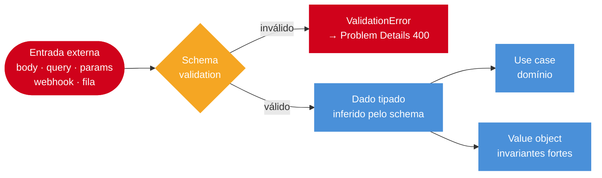

# Validation com schema

> [!abstract] TL;DR
> Schema-first é o padrão pragmático para validation em Node moderno. `zod` une schema, runtime validation e type inference; Fastify usa JSON Schema nativo; NestJS usa `ValidationPipe` com `class-validator` ou wrappers zod. O objetivo é evitar validação manual espalhada. O ponto de maturidade é validar toda entrada externa — não apenas o body, mas também params, query, headers, webhooks e mensagens de fila — antes de qualquer lógica de negócio.

## O que é

Validation com schema define o contrato de input em um objeto reutilizável. Esse contrato valida dados em runtime e, dependendo da ferramenta, também gera tipos TypeScript e documentação.

A alternativa sem schema é validação manual: `if (!body.email || !body.email.includes("@"))`. Esse padrão cresce linearmente com o número de campos, duplica em cada endpoint e gera mensagens de erro inconsistentes. Um schema centraliza a regra, permite reuso e torna o contrato visível para quem lê o código.

## Por que importa

Toda entrada externa é `unknown`: body, query, params, headers, webhooks, mensagens de fila. Sem schema, validação vira if espalhado em controller. Com schema, validação fica centralizada, testável e reaproveitável.

A fronteira que importa não é só a HTTP: uma mensagem Kafka, um evento SQS, um payload de webhook e uma variável de ambiente são entradas tão externas quanto um body de POST. Aplicar schema a todas essas fronteiras é o que separa uma aplicação defensiva de uma que falha silenciosamente com dados malformados.

## Como funciona

```typescript
import { z } from "zod";

const CreateUserSchema = z.object({
  name: z.string().min(1).max(100),
  email: z.string().email(),
  age: z.number().int().min(0).optional(),
}).strict();

type CreateUser = z.infer<typeof CreateUserSchema>;

app.post("/users", (req, res) => {
  const data: CreateUser = CreateUserSchema.parse(req.body);
  res.status(201).json(data);
});
```

```typescript
app.post(
  "/users",
  {
    schema: {
      body: {
        type: "object",
        required: ["name", "email"],
        additionalProperties: false,
        properties: {
          name: { type: "string", minLength: 1, maxLength: 100 },
          email: { type: "string", format: "email" },
          age: { type: "integer", minimum: 0 },
        },
      },
    },
  },
  async (req) => req.body,
);
```

```typescript
import { IsEmail, IsInt, IsOptional, IsString, MaxLength, Min, MinLength } from "class-validator";

export class CreateUserDto {
  @IsString()
  @MinLength(1)
  @MaxLength(100)
  name!: string;

  @IsEmail()
  email!: string;

  @IsOptional()
  @IsInt()
  @Min(0)
  age?: number;
}
```

```typescript
app.useGlobalPipes(
  new ValidationPipe({
    whitelist: true,
    forbidNonWhitelisted: true,
    transform: true,
  }),
);
```

```typescript
import { zValidator } from "@hono/zod-validator";

app.post("/users", zValidator("json", CreateUserSchema), (c) => {
  const data = c.req.valid("json");
  return c.json(data, 201);
});
```

### Fluxo de validação schema-first



Schema de boundary protege a aplicação de dados externos; value objects protegem o domínio de invariantes quebradas internamente.

## Casos práticos

### Cenário 1: cadastro de usuário com separação de boundary e domínio

Uma API de cadastro precisa validar entrada HTTP, transformar o email para lowercase e garantir que o domínio receba um tipo com invariante forte.

```typescript
import { z } from "zod";

// Schema de boundary: valida o que chega pelo HTTP.
const CreateUserInput = z.object({
  name: z.string().trim().min(1, "Name is required").max(100, "Name too long"),
  email: z.string().email("Invalid email format"),
  locale: z.enum(["pt-BR", "en-US"]).default("en-US"),
}).strict();

type CreateUserInputType = z.infer<typeof CreateUserInput>;
```

```typescript
// Value object de domínio: encapsula invariante de email.
class Email {
  private constructor(readonly value: string) {}

  static parse(raw: string): Email {
    const parsed = z.string().email().parse(raw);
    return new Email(parsed.toLowerCase()); // normalização no domínio
  }

  equals(other: Email): boolean {
    return this.value === other.value;
  }
}
```

```typescript
// Controller: valida na boundary, entrega tipo forte ao use case.
app.post("/users", zValidator("json", CreateUserInput), async (c) => {
  const input = c.req.valid("json"); // tipado como CreateUserInputType

  // Use case recebe value object, não string crua.
  const user = await createUserUseCase.execute({
    name: input.name,
    email: Email.parse(input.email),
    locale: input.locale,
  });

  return c.json(user, 201);
});
```

Schema de boundary e value object têm responsabilidades diferentes: o schema protege contra formato inválido externo; o value object encapsula invariante de negócio.

### Cenário 2: validação de mensagem de fila Kafka com schema reutilizável

Uma aplicação que consome eventos de um tópico Kafka precisa validar cada mensagem antes de processar, com o mesmo rigor aplicado ao HTTP.

```typescript
import { z } from "zod";

// Schema compartilhado entre producer e consumer.
const OrderPlacedEvent = z.object({
  eventId: z.string().uuid(),
  orderId: z.string().uuid(),
  userId: z.string().uuid(),
  items: z.array(z.object({
    productId: z.string().uuid(),
    quantity: z.number().int().positive(),
    unitPrice: z.number().positive(),
  })).min(1, "Order must have at least one item"),
  placedAt: z.string().datetime(),
  totalAmount: z.number().positive(),
}).strict();

type OrderPlacedEventType = z.infer<typeof OrderPlacedEvent>;
```

```typescript
// Consumer: valida antes de processar.
async function handleOrderPlaced(rawMessage: unknown): Promise<void> {
  // Mensagem de fila é unknown — pode vir corrompida ou de versão incompatível.
  const result = OrderPlacedEvent.safeParse(rawMessage);

  if (!result.success) {
    logger.error({
      errors: result.error.issues,
      raw: rawMessage,
    }, "Invalid OrderPlaced event — skipping to dead-letter queue");

    await deadLetterQueue.send(rawMessage);
    return; // não lança — evita retry infinito de mensagem inválida
  }

  const event: OrderPlacedEventType = result.data;
  await fulfillmentService.process(event);
}
```

```typescript
// Teste: schema como documentação executável.
test("rejects event without items", () => {
  const result = OrderPlacedEvent.safeParse({
    eventId: randomUUID(),
    orderId: randomUUID(),
    userId: randomUUID(),
    items: [], // array vazio deve falhar
    placedAt: new Date().toISOString(),
    totalAmount: 0,
  });
  expect(result.success).toBe(false);
});
```

Note o uso de `safeParse` em vez de `parse`: em consumer de fila, lançar exceção para mensagem inválida pode gerar retry infinito. `safeParse` permite redirecionar para dead-letter queue de forma controlada.

### Boundary-first validation

Valide em todas as fronteiras externas, não apenas em controllers HTTP.

```typescript
const GithubWebhookSchema = z.object({
  action: z.string(),
  repository: z.object({ full_name: z.string() }),
  sender: z.object({ login: z.string() }),
}).strict();

export async function handleGithubWebhook(raw: unknown) {
  const event = GithubWebhookSchema.parse(raw);
  return processGithubEvent(event);
}
```

Esse mesmo padrão vale para Kafka, SQS, cron input, env vars e arquivos importados.

### Params, query e headers

Body é só uma parte da entrada.

```typescript
const Params = z.object({ id: z.string().uuid() });
const Query = z.object({
  page: z.coerce.number().int().min(1).default(1),
  pageSize: z.coerce.number().int().min(1).max(100).default(25),
});

app.get("/users/:id", (req, res) => {
  const params = Params.parse(req.params);
  const query = Query.parse(req.query);
  return users.findOne(params.id, query);
});
```

`z.coerce` é útil para query string, mas deve ser usado deliberadamente. Coerção ampla demais pode esconder input ruim.

### Input schema vs domain type

Nem todo schema de input é tipo de domínio. Input aceita strings, formatos externos e campos opcionais. Domínio pode exigir invariantes mais fortes.

```typescript
const CreateUserInput = z.object({
  name: z.string().min(1),
  email: z.string().email(),
});

class Email {
  private constructor(readonly value: string) {}

  static parse(value: string) {
    const email = z.string().email().parse(value);
    return new Email(email.toLowerCase());
  }
}
```

Schema de boundary protege a aplicação; value objects protegem o domínio.

### Versionamento de schema

APIs evoluem. Não altere schema de forma incompatível sem versionar contrato.

```typescript
const CreateUserV1 = z.object({
  name: z.string(),
  email: z.string().email(),
});

const CreateUserV2 = CreateUserV1.extend({
  locale: z.enum(["pt-BR", "en-US"]).default("en-US"),
});
```

Escolha uma estratégia: path (`/v1`, `/v2`), header, media type ou compatibilidade aditiva. O pior cenário é mudar silenciosamente.

### Erros de validação como Problem Details

Validation deve conversar com [[08 - Error handling estruturado]].

```typescript
function toProblem(error: z.ZodError, instance: string) {
  return {
    type: "https://api.example.com/errors/validation",
    title: "Validation Failed",
    status: 400,
    detail: "Request payload is invalid",
    instance,
    invalidParams: error.issues.map((issue) => ({
      name: issue.path.join("."),
      reason: issue.message,
    })),
  };
}
```

Cliente precisa de erro parseável; dev precisa de log completo.

## Checklist de code review

- Body, params, query e headers relevantes são validados?
- Schema é strict quando contrato exige?
- Coerção (`z.coerce`, transform) é intencional?
- Schema de input não foi confundido com entity de domínio?
- Erros de validation viram Problem Details estável?
- Schemas têm estratégia de versionamento?
- Mensagens de erro não vazam detalhes internos?
- Testes cobrem payload válido, inválido e campos extras?

## Exercício de maturidade

Validação manual típica:

```typescript
if (!body.email || !body.email.includes("@")) {
  throw new BadRequestError("invalid email");
}
```

Problemas:

- regra incompleta;
- mensagem inconsistente;
- tipo TypeScript não melhora;
- teste precisa cobrir cada if manual;
- controller cresce.

Schema-first:

```typescript
const Email = z.string().email().transform((value) => value.toLowerCase());

const CreateUser = z.object({
  name: z.string().trim().min(1).max(100),
  email: Email,
}).strict();
```

Agora o contrato é declarativo, reusável e testável.

### Testes de schema

Schemas merecem teste quando são contrato público.

```typescript
test("rejects unknown fields", () => {
  expect(() => CreateUser.parse({
    name: "Ada",
    email: "ada@example.com",
    admin: true,
  })).toThrow();
});
```

Esse teste protege contra regressão de `.strict()` removido por acidente.

## Armadilhas comuns

> [!warning] Schema permissivo sem `.strict()` aceita campos desconhecidos
> **O que acontece:** campos extras do cliente passam pela validation e podem atingir o banco ou o domínio — risco de mass assignment. **Por quê:** por padrão, zod permite campos extras; JSON Schema também requer `additionalProperties: false` explícito. **Como evitar:** use `.strict()` em zod ou `additionalProperties: false` em JSON Schema para todos os schemas de input externo.

> [!warning] Validar só body e esquecer query/params/headers
> **O que acontece:** `req.params.id` chega como string UUID não validada; um ID com formato errado causa erro de banco, não 400. **Por quê:** body recebe atenção; params e query são vistos como secundários mas são tão externos quanto o body. **Como evitar:** trate cada parte do request como `unknown`; aplique schema a params, query e headers críticos.

> [!warning] Misturar zod e `class-validator` sem convenção clara
> **O que acontece:** metade dos endpoints valida com zod, metade com decorators; erros têm formatos diferentes; testes duplicam. **Por quê:** times diferentes adotam padrões diferentes sem alinhamento; NestJS vem com class-validator, mas zod é mais ergonômico em TS puro. **Como evitar:** escolha uma biblioteca por domínio/repositório e documente a escolha; wrappers como `nestjs-zod` unificam se necessário.

> [!warning] Mensagens de erro cruas expostas para o cliente
> **O que acontece:** cliente vê mensagens internas como `Expected string, received number at path "items.0.productId"` diretamente na response. **Por quê:** `ZodError` é lançado cru sem mapeamento para Problem Details com `invalidParams` legíveis. **Como evitar:** mapeie `ZodError.issues` para `invalidParams` no handler de erro global; mantenha a mensagem interna no log.

> [!warning] Validar depois do use case: domínio recebeu dado inválido
> **O que acontece:** use case processa dados malformados, corrompe estado ou lança erro interno difícil de rastrear. **Por quê:** validation foi postergada por acidente ou colocada dentro do use case em vez de na boundary HTTP. **Como evitar:** validation é sempre a primeira coisa que acontece na boundary — antes de qualquer lógica de aplicação.

> [!warning] Coerção ampla com `z.coerce` aceita input ambíguo
> **O que acontece:** `z.coerce.number().parse("abc")` retorna `NaN`; `z.coerce.boolean().parse("false")` retorna `true`. **Por quê:** `z.coerce` usa cast JavaScript nativo, que tem regras permissivas; `Boolean("false") === true`. **Como evitar:** use `z.coerce` apenas para conversões previsíveis como query string de número; adicione `.refine()` para casos limítrofes.

> [!warning] Usar schema de DTO como entity de domínio
> **O que acontece:** lógica de domínio fica acoplada ao formato de entrada; trocar a API exige mudar o domínio. **Por quê:** conveniência leva a reutilizar o tipo inferido pelo schema como tipo de domínio direto. **Como evitar:** schema de input → DTO/input type; domínio → entity/value object com invariantes próprias; mapeie entre eles no adapter.

> [!warning] Alterar schema público sem versionamento
> **O que acontece:** clientes existentes enviam payload no formato antigo e recebem 400 inesperado. **Por quê:** mudança incompatível (campo obrigatório, rename, remoção) foi feita sem criar nova versão da rota. **Como evitar:** campos novos obrigatórios exigem versão nova; use `.default()` para tornar campos novos opcionais de forma compatível.

> [!warning] Validar webhook depois de executar efeito colateral
> **O que acontece:** efeito colateral (email enviado, estoque decrementado) acontece com payload inválido ou de versão incompatível. **Por quê:** validation foi colocada após a lógica principal por simplicidade. **Como evitar:** em webhooks e mensagens de fila, validate primeiro com `safeParse`; redirecione para dead-letter queue se inválido; nunca processe antes de validar.

> [!warning] Sem testes de schema: regressão silenciosa
> **O que acontece:** alguém remove `.strict()` ou adiciona `.optional()` e o contrato muda sem detectar. **Por quê:** schema é tratado como configuração, não como código que precisa de teste. **Como evitar:** teste schemas públicos com payloads válidos, inválidos e com campos extras; inclua no CI.

## Perguntas de entrevista

**Por que schema-first é melhor que validação manual?** Porque centraliza contrato, reduz duplicação, permite type inference e torna erro/teste mais previsível.

**Onde validar query string?** Na boundary HTTP, antes do use case. Query chega como string e precisa de parsing/coerção explícita.

**Qual a diferença entre DTO e entidade?** DTO representa formato de entrada/saída. Entidade representa regra de domínio e invariantes internas.

**Como devolver erro de validação para cliente?** Com formato estruturado, idealmente Problem Details com lista de campos inválidos.

## Em entrevista

"Schema-first validation is the modern Node pattern. With zod, you define a schema once and get both runtime validation and TypeScript inference through `z.infer`. Fastify uses JSON Schema natively for validation and serialization. NestJS traditionally uses DTO classes with `class-validator` through a global `ValidationPipe`, though zod wrappers are common. The senior pattern is validating every external boundary, not only request bodies."

Vocabulário-chave:

- schema-first -> orientado por schema
- type inference -> inferência de tipo
- JSON Schema -> schema JSON
- ValidationPipe -> pipe de validação
- external boundary -> fronteira externa

## O que vem a seguir

Com validation na boundary garantida, o próximo passo é organizar toda a aplicação ao redor de camadas que respeitam esses contratos. [[10 - Clean Architecture em Node]] mostra como estruturar domínio, use cases e adapters para que schema de input e error handling fiquem nas bordas corretas. Depois, [[11 - DI - manual vs container]] fecha o ciclo: como montar o grafo de dependências que conecta boundary, use case e infraestrutura.

## Fontes

- [Zod](https://zod.dev/)
- [Fastify validation and serialization](https://fastify.dev/docs/latest/Reference/Validation-and-Serialization/)
- [NestJS docs](https://docs.nestjs.com/)

## Veja também

- [[04 - NestJS - guards, interceptors, pipes, filters]]
- [[05 - Fastify - schema-first, plugins, performance]]
- [[06 - Hono e edge runtimes]]
- [[08 - Error handling estruturado]]
- [[Node.js]]
