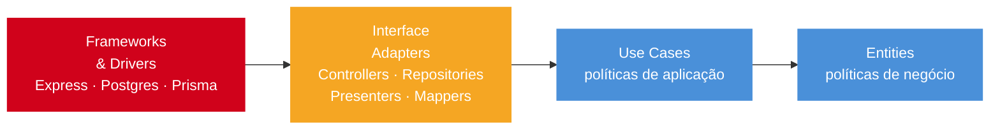

# Clean Architecture em Node

> [!abstract] TL;DR
> Clean Architecture organiza código em camadas: entities, use cases, interface adapters e frameworks/drivers. A dependency rule diz que dependências apontam para dentro. Em Node, isso aparece como domínio sem Express/ORM, use cases dependentes de ports e adapters externos. A validação de que a arquitetura está saudável é simples: um teste de use case que não precisa subir Express, NestJS ou Postgres. Use quando domínio justifica; CRUD simples não precisa.

## O que é

Clean Architecture, popularizada por Robert C. Martin, separa políticas de negócio de mecanismos externos. Hexagonal/Ports and Adapters é uma formulação próxima: domínio e aplicação definem portas; infraestrutura implementa adapters.

A dependency rule é o coração da arquitetura: código-fonte aponta sempre para dentro. Entity não conhece use case, use case não conhece adapter, adapter não conhece infraestrutura de outro adapter. A direção é sempre centrípeta — nunca do núcleo para fora. Quando você vê um import de `express` dentro de um `use-case/`, a regra foi violada.

## Por que importa

Se use case importa `Request` do Express ou entity importa decorator do ORM, framework virou parte do núcleo. Isso dificulta teste, troca de adapter e manutenção. Em domínio rico, separar camadas reduz acoplamento. Em CRUD simples, pode ser over-engineering.

O custo de violar a dependency rule só aparece mais tarde: quando você precisa testar o use case isolado mas ele exige subir todo o Express; quando você quer trocar ORM mas ele está espalhado em use cases; quando a entity carrega decorator do Prisma e você descobre que não consegue instanciá-la sem configuração de banco. Clean Architecture cobra caro na setup e paga na manutenção de longo prazo.

## Como funciona

```text
Entities
└── Use Cases
    └── Interface Adapters
        └── Frameworks and Drivers
```

```text
src/
├── domain/
│   └── User.ts
├── application/
│   ├── CreateUserUseCase.ts
│   └── UserRepository.ts
├── infrastructure/
│   ├── db/UserRepositoryPg.ts
│   └── http/UserController.ts
└── presentation/
    └── server.ts
```

```typescript
export class User {
  constructor(
    public readonly id: string,
    public name: string,
    public readonly email: string,
  ) {}

  changeName(name: string) {
    if (name.length < 1) throw new Error("Name required");
    this.name = name;
  }
}
```

```typescript
export interface UserRepository {
  save(user: User): Promise<void>;
  findById(id: string): Promise<User | null>;
}

export class CreateUserUseCase {
  constructor(private readonly repo: UserRepository) {}

  async execute(input: { name: string; email: string }) {
    const user = new User(crypto.randomUUID(), input.name, input.email);
    await this.repo.save(user);
    return user;
  }
}
```

```typescript
export class UserRepositoryPg implements UserRepository {
  constructor(private readonly db: PgPool) {}

  async save(user: User): Promise<void> {
    await this.db.query("insert into users(id, name, email) values($1, $2, $3)", [
      user.id,
      user.name,
      user.email,
    ]);
  }

  async findById(id: string): Promise<User | null> {
    const result = await this.db.query("select * from users where id = $1", [id]);
    return result.rowCount ? new User(result.rows[0].id, result.rows[0].name, result.rows[0].email) : null;
  }
}
```

```typescript
const repo = new UserRepositoryPg(pgPool);
const useCase = new CreateUserUseCase(repo);
const controller = new UserController(useCase);

app.post("/users", (req, res) => controller.create(req, res));
```

### Direção das dependências



Seta aponta para dentro. `domain/` e `application/` não têm setas saindo para fora. Qualquer import que quebre essa direção é uma violação arquitetural.

### Regra de dependência em imports

A forma mais simples de auditar Clean em Node é olhar imports.

```typescript
// Bom: aplicação depende de domínio.
import { User } from "../domain/User";
import type { UserRepository } from "./UserRepository";
```

```typescript
// Ruim: domínio depende de framework/infra.
import { Entity, Column } from "typeorm";
import type { Request } from "express";
```

Se `domain/` importa ORM, HTTP, logger externo ou framework, a camada interna conhece detalhe externo.

### Controller como adapter

Controller adapta HTTP para use case. Ele não deve conter regra de negócio rica.

```typescript
export class UserController {
  constructor(private readonly createUser: CreateUserUseCase) {}

  async create(req: Request, res: Response) {
    const input = CreateUserSchema.parse(req.body);
    const user = await this.createUser.execute(input);
    res.status(201).json(UserPresenter.toHttp(user));
  }
}
```

Validation e presenter pertencem à borda. Use case não sabe que existe Express.

### Use case como política de aplicação

Use case orquestra regra. Ele conhece ports, não adapters.

```typescript
export class CreateInvoiceUseCase {
  constructor(
    private readonly invoices: InvoiceRepository,
    private readonly payments: PaymentGateway,
    private readonly clock: Clock,
  ) {}

  async execute(input: CreateInvoiceInput) {
    const invoice = Invoice.create(input, this.clock.now());
    await this.payments.authorize(invoice.total);
    await this.invoices.save(invoice);
    return invoice;
  }
}
```

`PaymentGateway` é uma porta. Stripe, Pagar.me ou mock são adapters.

### NestJS com Clean

NestJS pode ser usado como composition layer, mas cuidado para decorators não contaminarem domínio.

```typescript
@Module({
  providers: [
    CreateInvoiceUseCase,
    { provide: INVOICE_REPOSITORY, useClass: PrismaInvoiceRepository },
    { provide: PAYMENT_GATEWAY, useClass: StripePaymentGateway },
  ],
  controllers: [InvoicesController],
})
export class InvoicesModule {}
```

O módulo monta dependências. O use case continua sendo TypeScript puro.

### Quando não aplicar

Clean não é ritual. Para CRUD administrativo simples, uma separação leve pode ser melhor:

```text
users/
├── users.router.ts
├── users.service.ts
├── users.repository.ts
└── users.schema.ts
```

Se não há regra de domínio, criar `entities/`, `use-cases/`, `ports/`, `adapters/` pode só espalhar código.

## Casos práticos

### Cenário 1: sistema de faturamento com múltiplos gateways de pagamento

Uma fintech precisa suportar Stripe para clientes internacionais e Pagar.me para clientes brasileiros, com possibilidade de adicionar novos providers sem alterar use cases. O domínio não pode conhecer nenhum provider.

```typescript
// domain/Invoice.ts — política de negócio pura
export class Invoice {
  private constructor(
    public readonly id: string,
    public readonly customerId: string,
    public readonly total: number,
    private _status: "pending" | "paid" | "failed",
  ) {}

  static create(customerId: string, total: number): Invoice {
    if (total <= 0) throw new Error("Invoice total must be positive");
    return new Invoice(crypto.randomUUID(), customerId, total, "pending");
  }

  markPaid(): void {
    if (this._status !== "pending") throw new Error("Only pending invoices can be paid");
    this._status = "paid";
  }

  get status() { return this._status; }
}
```

```typescript
// application/ports/PaymentGateway.ts — porta, sem implementação
export interface PaymentGateway {
  authorize(amount: number, currency: string): Promise<{ transactionId: string }>;
}

// application/ports/InvoiceRepository.ts
export interface InvoiceRepository {
  save(invoice: Invoice): Promise<void>;
  findById(id: string): Promise<Invoice | null>;
}
```

```typescript
// application/PayInvoiceUseCase.ts — orquestra portas, não sabe quem as implementa
export class PayInvoiceUseCase {
  constructor(
    private readonly invoices: InvoiceRepository,
    private readonly gateway: PaymentGateway,
    private readonly notifier: CustomerNotifier,
  ) {}

  async execute(invoiceId: string): Promise<void> {
    const invoice = await this.invoices.findById(invoiceId);
    if (!invoice) throw new NotFoundError("Invoice not found");
    if (invoice.status !== "pending") throw new ConflictError("Invoice already processed");

    const { transactionId } = await this.gateway.authorize(invoice.total, "BRL");
    invoice.markPaid();
    await this.invoices.save(invoice);
    await this.notifier.sendReceipt(invoice.customerId, transactionId);
  }
}
```

```typescript
// infrastructure/StripePaymentGateway.ts — adapter implementa a porta
import Stripe from "stripe";

export class StripePaymentGateway implements PaymentGateway {
  constructor(private readonly stripe: Stripe) {}

  async authorize(amount: number, currency: string) {
    const intent = await this.stripe.paymentIntents.create({
      amount: Math.round(amount * 100),
      currency,
    });
    return { transactionId: intent.id };
  }
}
```

```typescript
// Teste do use case: sem Stripe, sem Postgres, sem Express
test("pays a pending invoice and notifies customer", async () => {
  const invoice = Invoice.create("customer-1", 100);
  const repo = new InMemoryInvoiceRepository([invoice]);
  const gateway: PaymentGateway = {
    authorize: async () => ({ transactionId: "txn_test_123" }),
  };
  const notifier: CustomerNotifier = { sendReceipt: vi.fn() };

  const useCase = new PayInvoiceUseCase(repo, gateway, notifier);
  await useCase.execute(invoice.id);

  expect((await repo.findById(invoice.id))?.status).toBe("paid");
  expect(notifier.sendReceipt).toHaveBeenCalledWith("customer-1", "txn_test_123");
});
```

Trocar Stripe por Pagar.me é só trocar o adapter no composition root. O use case e o teste permanecem intactos.

### Cenário 2: auditoria de domínio com event sourcing parcial

Uma API de RH precisa registrar todas as alterações de cargo de funcionários, com possibilidade de replay. O domínio emite eventos; a infraestrutura persiste.

```typescript
// domain/Employee.ts — entity com events internos
export class Employee {
  private _domainEvents: DomainEvent[] = [];

  constructor(
    public readonly id: string,
    public readonly name: string,
    private _role: string,
  ) {}

  promoteToRole(newRole: string, promotedBy: string): void {
    if (newRole === this._role) throw new ConflictError("Role is already the same");
    const previous = this._role;
    this._role = newRole;
    this._domainEvents.push(new RoleChangedEvent(this.id, previous, newRole, promotedBy));
  }

  get role() { return this._role; }

  pullEvents(): DomainEvent[] {
    const events = this._domainEvents;
    this._domainEvents = [];
    return events;
  }
}
```

```typescript
// application/PromoteEmployeeUseCase.ts
export class PromoteEmployeeUseCase {
  constructor(
    private readonly employees: EmployeeRepository,
    private readonly eventStore: EventStore,
  ) {}

  async execute(input: { employeeId: string; newRole: string; promotedBy: string }) {
    const employee = await this.employees.findById(input.employeeId);
    if (!employee) throw new NotFoundError("Employee not found");

    employee.promoteToRole(input.newRole, input.promotedBy);

    await this.employees.save(employee);

    // Porta: EventStore pode ser Postgres, EventStoreDB ou mock.
    const events = employee.pullEvents();
    await this.eventStore.appendAll(events);
  }
}
```

```typescript
// Teste: domínio e use case sem infraestrutura
test("promotes employee and records event", async () => {
  const emp = new Employee("emp-1", "Ada", "junior");
  const repo = new InMemoryEmployeeRepository([emp]);
  const store = new InMemoryEventStore();

  await new PromoteEmployeeUseCase(repo, store).execute({
    employeeId: "emp-1",
    newRole: "senior",
    promotedBy: "manager-1",
  });

  expect((await repo.findById("emp-1"))?.role).toBe("senior");
  const events = store.getEvents("emp-1");
  expect(events[0]).toBeInstanceOf(RoleChangedEvent);
});
```

O domínio é testável sem Postgres, sem HTTP, sem NestJS. A arquitetura pagou por si mesma no primeiro teste de regressão.

## Checklist de code review

- `domain/` importa apenas linguagem e tipos internos?
- Use cases dependem de interfaces/ports?
- Controllers são adapters finos?
- Repositories implementam ports, não vazam ORM para use case?
- Mappers/presenters isolam formato HTTP/DB?
- Composition root está claro?
- Testes de use case rodam sem framework HTTP?
- A complexidade do domínio justifica as camadas?

## Exercício de maturidade

Violação comum:

```typescript
export class CreateUserUseCase {
  constructor(private readonly prisma: PrismaClient) {}

  async execute(input: Input) {
    return this.prisma.user.create({ data: input });
  }
}
```

O use case conhece Prisma. Trocar ORM, banco ou teste fake fica mais caro.

Versão com port:

```typescript
export class CreateUserUseCase {
  constructor(private readonly users: UserRepository) {}

  async execute(input: Input) {
    const user = User.create(input);
    await this.users.save(user);
    return user;
  }
}
```

```typescript
export class PrismaUserRepository implements UserRepository {
  constructor(private readonly prisma: PrismaClient) {}
}
```

Agora Prisma fica no adapter. O use case fala a linguagem da aplicação.

### Teste como prova arquitetural

Se o teste de use case precisa subir NestJS, Express ou Postgres, a camada talvez esteja acoplada demais.

```typescript
test("creates user", async () => {
  const repo = new InMemoryUserRepository();
  const useCase = new CreateUserUseCase(repo);
  const user = await useCase.execute({ name: "Ada", email: "ada@example.com" });
  expect(await repo.findById(user.id)).toEqual(user);
});
```

Teste simples é sinal de boundary saudável.

## Armadilhas comuns

> [!warning] Entity importando ORM ou decorator de framework
> **O que acontece:** entity não pode ser instanciada sem container ou banco configurado; testes exigem setup pesado.
> **Por quê:** conveniência de ORM (TypeORM `@Entity`, Prisma client, Mongoose schema) faz entity virar VO de infraestrutura.
> **Como evitar:** entities são classes TypeScript puras; adapters de repository fazem o mapeamento entre entity e formato do ORM.

> [!warning] Use case recebendo `Request` ou `Response` do framework HTTP
> **O que acontece:** use case acoplado ao framework; trocar Express exige reescrever use cases.
> **Por quê:** controller passou o objeto HTTP inteiro ao use case em vez de extrair o que é necessário.
> **Como evitar:** controller extrai `{ name, email }` do request e passa apenas o que o use case precisa; use case nunca recebe objetos HTTP.

> [!warning] Aplicar Clean em CRUD trivial sem domínio
> **O que acontece:** três vezes mais código, zero benefício — sem regra de negócio, não há o que proteger.
> **Por quê:** padrão arquitetural aplicado por cargo de trabalho ou obediência a um tech lead, não por necessidade.
> **Como evitar:** avalie se há regra de negócio rica, múltiplos adapters ou teste de use case valioso antes de adotar Clean.

> [!warning] Adapter virando god class com múltiplas responsabilidades
> **O que acontece:** repositório implementa busca, auditoria, cache e notificação — um único arquivo de 800 linhas.
> **Por quê:** "adapter" virou sinônimo de "tudo que não é domain"; sem bounded context, qualquer coisa vai para lá.
> **Como evitar:** separe adapters por responsabilidade; `UserRepositoryPg`, `UserCacheRedis`, `UserAuditLogger` são adapters separados.

> [!warning] Sem composition root claro: dependências espalhadas
> **O que acontece:** difícil rastrear quem instancia quem; testes precisam de mocks em lugares inesperados.
> **Por quê:** ausência de ponto único de wiring — cada módulo instancia suas próprias dependências.
> **Como evitar:** tenha um composition root explícito (ou container de DI claro como [[11 - DI - manual vs container]]); nada se auto-instancia.

> [!warning] Chamar qualquer pasta de `domain/` sem regra de negócio real
> **O que acontece:** pasta `domain/` vira dumping ground para entidades anêmicas e helpers.
> **Por quê:** nome da pasta foi adotado sem clareza sobre o que pertence ao domínio.
> **Como evitar:** domínio contém regra de negócio com comportamento; se o objeto não tem método de negócio, é DTO, não entity.

> [!warning] Colocar validação HTTP dentro da entity
> **O que acontece:** entity conhece formato de request; trocar API exige mudar domínio.
> **Por quê:** confusão entre validação de boundary (formato externo) e invariante de domínio (regra de negócio).
> **Como evitar:** validation de schema de entrada vai no controller/adapter via [[09 - Validation com schema]]; entity valida invariantes de negócio.

> [!warning] Testar use case subindo Nest/Express inteiro
> **O que acontece:** teste lento, frágil e com muitas dependências; refactor de infra quebra testes de domínio.
> **Por quê:** use case acoplado a framework, ou teste usa SuperTest em vez de invocar use case diretamente.
> **Como evitar:** use case deve ser testável com `new UseCaseClass(new InMemoryRepository())`; integração vai em teste separado.

> [!warning] Mapper ausente: formato de banco vira formato de API
> **O que acontece:** mudança de coluna de banco altera response da API; mudança de API exige migração de banco.
> **Por quê:** sem mapper/presenter, repositório retorna linha do banco direto ao controller, que passa para o cliente.
> **Como evitar:** presenters transformam entity para formato de resposta; mappers transformam linha de DB para entity; são adapters separados.

## Perguntas de entrevista

**Qual é a dependency rule?**
Dependências de código apontam para dentro. Camadas internas não conhecem frameworks, banco ou UI.

**Como Clean aparece em Node?**
Domínio puro, use cases dependentes de ports, adapters para HTTP/DB e composition root no startup/framework.

**Quando Clean é exagero?**
Quando o app é CRUD simples, sem regra de domínio rica e sem múltiplos adapters relevantes.

**NestJS garante Clean Architecture?**
Não. Ele ajuda com DI e módulos, mas você ainda pode acoplar use case a framework ou ORM.

## Em entrevista

"Clean Architecture separates business policies from external mechanisms. The dependency rule is the key: source dependencies point inward, so the domain does not know about Express, databases, or framework details. In Node, that means use cases depend on ports, and infrastructure implements adapters. It is valuable for complex domains, but over-engineering for simple CRUD."

Vocabulário-chave:

- layer -> camada
- dependency rule -> regra de dependência
- port -> porta
- adapter -> adaptador
- dependency inversion -> inversão de dependência

## O que vem a seguir

Com a arquitetura de camadas clara, o próximo desafio é montar o grafo de dependências que conecta use cases a adapters. [[11 - DI - manual vs container]] mostra quando composition root manual é suficiente e quando um container como awilix ou NestJS DI agrega valor. Por fim, [[12 - Decision tree + cheatsheet]] fecha o galho com um mapa de decisão para escolher framework, arquitetura e DI strategy conforme o contexto.

## Fontes

- [The Clean Architecture](https://blog.cleancoder.com/uncle-bob/2012/08/13/the-clean-architecture.html)

## Veja também

- [[03 - NestJS - fundamentos]]
- [[08 - Error handling estruturado]]
- [[09 - Validation com schema]]
- [[11 - DI - manual vs container]]
- [[Node.js]]
- [[Arquitetura de Software]]
