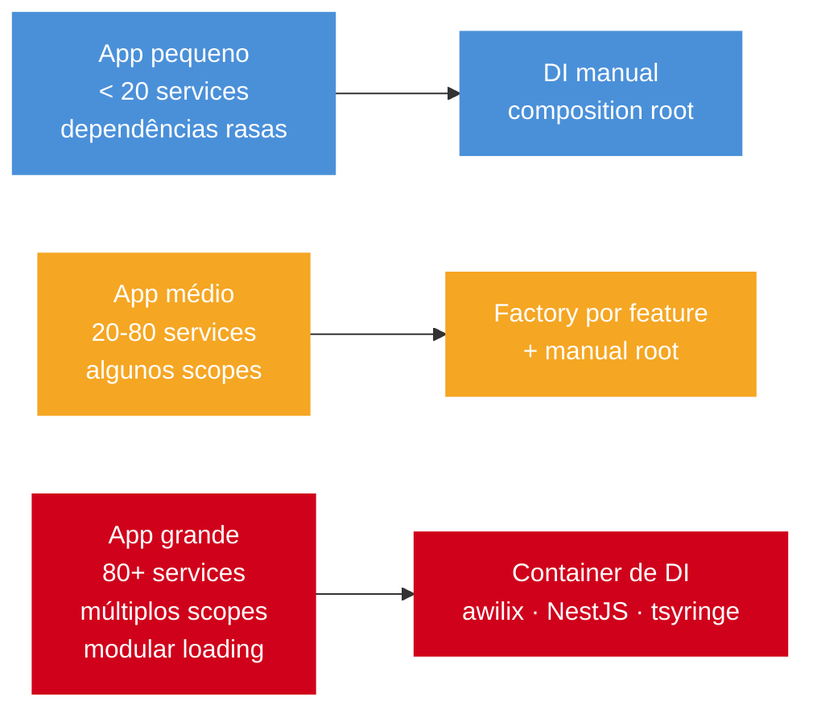

# DI: manual vs container

> [!abstract] TL;DR
> DI manual é constructor injection + composition root. Containers (NestJS, awilix, tsyringe, InversifyJS) automatizam wiring e lifecycle scopes. Manual é simples e explícito em apps pequenos; container vale quando o grafo de dependências e escopos fica complexo. A regra de ouro: DI manual primeiro, container quando o wiring começa a doer — nunca por antecipação. Service locator é sempre anti-pattern: esconde dependências e dificulta teste.

## O que é

Dependency Injection é passar dependências de fora para dentro, em vez de instanciá-las dentro da classe/função. Container de DI é uma ferramenta que resolve esse grafo automaticamente.

A pergunta que DI responde é: "quem cria as dependências?". Sem DI, a classe cria suas próprias dependências — acopla a implementação concreta, dificulta teste, viola o princípio da inversão de dependência. Com DI, quem cria o objeto sabe quais dependências injetar. Com container, essa responsabilidade é automatizada e centralizada com regras de lifecycle.

## Por que importa

Sem DI, use cases criam DB clients, loggers e gateways diretamente. Isso acopla, dificulta teste e viola [[10 - Clean Architecture em Node]]. Com DI, dependências ficam explícitas. Com container, o wiring pode ser centralizado e escalável.

O que torna DI poderoso no contexto de testes é a capacidade de substituição: com dependências explícitas no constructor, qualquer teste pode passar um fake, spy ou stub sem configuração global. A comparação é direta — classe que cria `new PrismaClient()` internamente não pode ser testada sem banco; classe que recebe `UserRepository` no constructor pode receber `InMemoryUserRepository` no teste.

## Como funciona

```typescript
// composition-root.ts
const logger = new Logger();
const db = new PgPool(config.database);
const userRepo = new UserRepositoryPg(db);
const createUser = new CreateUserUseCase(userRepo, logger);
const userController = new UserController(createUser);

export { userController };
```

```typescript
export function makeUserController(deps: { db: PgPool; logger: Logger }) {
  const repo = new UserRepositoryPg(deps.db);
  const createUser = new CreateUserUseCase(repo, deps.logger);
  return new UserController(createUser);
}
```

```typescript
@Injectable()
export class CreateUserUseCase {
  constructor(
    private readonly repo: UserRepository,
    private readonly logger: Logger,
  ) {}
}
```

```typescript
import { asClass, asValue, createContainer, InjectionMode } from "awilix";

const container = createContainer({ injectionMode: InjectionMode.PROXY });
container.register({
  db: asValue(pgPool),
  logger: asClass(Logger).singleton(),
  userRepo: asClass(UserRepositoryPg).singleton(),
  createUser: asClass(CreateUserUseCase).singleton(),
});

const createUser = container.resolve<CreateUserUseCase>("createUser");
```

```typescript
import "reflect-metadata";
import { container, inject, injectable } from "tsyringe";

@injectable()
class CreateUserUseCase {
  constructor(
    @inject("UserRepository") private readonly repo: UserRepository,
    @inject("Logger") private readonly logger: Logger,
  ) {}
}

container.register("UserRepository", { useClass: UserRepositoryPg });
const useCase = container.resolve(CreateUserUseCase);
```

| Approach | Ramp-up | Scopes | Quando usar |
| --- | --- | --- | --- |
| Manual | Baixo | Manual | App pequeno, dependências rasas |
| NestJS DI | Médio | Singleton/request/transient | Apps NestJS |
| awilix | Médio | Singleton/scoped/transient | Express/Fastify com grafo médio |
| tsyringe | Médio | Decorator-based | Times confortáveis com decorators |
| InversifyJS | Alto | Completo | Apps grandes, legado com container |

### Comparação de custo por complexidade



## Casos práticos

### Cenário 1: API Express de médio porte com composition root manual e factories por feature

Uma API de e-commerce com ~40 services precisa de DI sem overhead de container. A solução é composition root único com factories por feature — cada feature monta suas próprias dependências a partir de infra compartilhada.

```typescript
// infrastructure/index.ts — infra compartilhada instanciada uma vez
import { Pool } from "pg";
import { Logger } from "./Logger";
import { RedisCache } from "./RedisCache";

export function buildInfrastructure(config: Config) {
  const db = new Pool(config.database);
  const cache = new RedisCache(config.redis);
  const logger = new Logger(config.log);

  return { db, cache, logger };
}
```

```typescript
// features/users/index.ts — factory da feature de usuários
import { UserRepositoryPg } from "./UserRepositoryPg";
import { CreateUserUseCase } from "./CreateUserUseCase";
import { GetUserUseCase } from "./GetUserUseCase";
import { makeUsersRouter } from "./users.router";

export function makeUsersFeature(infra: ReturnType<typeof buildInfrastructure>) {
  const repo = new UserRepositoryPg(infra.db);
  const createUser = new CreateUserUseCase(repo, infra.logger);
  const getUser = new GetUserUseCase(repo);
  const router = makeUsersRouter({ createUser, getUser });

  return { router };
}
```

```typescript
// features/orders/index.ts — factory de pedidos com dependências cruzadas
export function makeOrdersFeature(
  infra: ReturnType<typeof buildInfrastructure>,
  deps: { userRepo: UserRepository },
) {
  const orderRepo = new OrderRepositoryPg(infra.db);
  const inventoryGateway = new InventoryHttpGateway(infra.http, config.inventoryUrl);
  const placeOrder = new PlaceOrderUseCase(orderRepo, deps.userRepo, inventoryGateway, infra.logger);
  const router = makeOrdersRouter({ placeOrder });

  return { router };
}
```

```typescript
// app.ts — composition root único
export function buildApp(config: Config): { app: Express; close: () => Promise<void> } {
  const infra = buildInfrastructure(config);

  const { router: usersRouter } = makeUsersFeature(infra);
  const { router: ordersRouter } = makeOrdersFeature(infra, {
    userRepo: new UserRepositoryPg(infra.db),
  });

  const app = express();
  app.use("/users", usersRouter);
  app.use("/orders", ordersRouter);
  app.use(problemDetailsHandler);

  return {
    app,
    close: async () => {
      await infra.db.end();
      await infra.cache.quit();
    },
  };
}
```

```typescript
// Teste: monta grafo alternativo sem container global
test("creates user", async () => {
  const repo = new InMemoryUserRepository();
  const logger = new NoopLogger();
  const createUser = new CreateUserUseCase(repo, logger);

  const result = await createUser.execute({ name: "Ada", email: "ada@example.com" });
  expect(result.name).toBe("Ada");
});
```

O padrão escala até ~80 services sem container. Quando factories começam a repetir wiring ou quando aparecem scopes por request, é hora de avaliar container.

### Cenário 2: container awilix com lifecycle scoped para contexto de request

Uma API de SaaS multi-tenant precisa que o tenant ID, o usuário autenticado e o logger com contexto de request estejam disponíveis em todos os services — sem passar por parâmetro em cada método.

```typescript
// container.ts — setup do container awilix
import { asClass, asValue, asFunction, createContainer, InjectionMode, Lifetime } from "awilix";

const container = createContainer({ injectionMode: InjectionMode.PROXY });

// Singletons: criados uma vez, compartilhados por todas as requests
container.register({
  db: asValue(pgPool),
  mailer: asClass(SmtpMailer).singleton(),
  userRepo: asClass(UserRepositoryPg).singleton(),
  auditLogger: asClass(AuditLogger).singleton(),
});

// Scoped: criados por request, destruídos ao fim
container.register({
  requestContext: asClass(RequestContext).scoped(),
  tenantRepo: asClass(TenantRepositoryPg).scoped(),
  createInvoiceUseCase: asClass(CreateInvoiceUseCase).scoped(),
});

export { container };
```

```typescript
// RequestContext.ts — contexto de request injetado por scope
export class RequestContext {
  tenantId: string = "";
  userId: string = "";
  requestId: string = "";
}
```

```typescript
// middleware Express que cria scope por request
import { AwilixContainer } from "awilix";

export function scopedContainerMiddleware(
  rootContainer: AwilixContainer,
) {
  return (req: Request, res: Response, next: NextFunction) => {
    // Cria scope filho para esta request
    const scope = rootContainer.createScope();

    // Registra valores específicos desta request no scope
    scope.register({
      requestContext: asValue(new RequestContext()),
    });

    // Resolve contexto e popula com dados da request
    const ctx = scope.resolve<RequestContext>("requestContext");
    ctx.requestId = req.id;
    ctx.tenantId = req.headers["x-tenant-id"] as string ?? "";

    req.container = scope; // disponível para handlers
    res.on("finish", () => scope.dispose());
    next();
  };
}
```

```typescript
// CreateInvoiceUseCase.ts — recebe contexto tipado via DI
export class CreateInvoiceUseCase {
  constructor(
    private readonly ctx: RequestContext,
    private readonly invoices: InvoiceRepository,
    private readonly mailer: Mailer,
    private readonly auditLogger: AuditLogger,
  ) {}

  async execute(input: CreateInvoiceInput) {
    const invoice = Invoice.create(this.ctx.tenantId, input);
    await this.invoices.save(invoice);
    await this.mailer.send(invoice);
    await this.auditLogger.log(this.ctx.userId, "invoice.created", invoice.id);
    return invoice;
  }
}
```

```typescript
// Handler Express: resolve use case do scope da request
app.post("/invoices", async (req: Request, res: Response) => {
  const useCase = req.container.resolve<CreateInvoiceUseCase>("createInvoiceUseCase");
  const invoice = await useCase.execute(CreateInvoiceInput.parse(req.body));
  res.status(201).json(invoice);
});
```

`scoped()` cria uma instância por request com `RequestContext` próprio. Manualmente, isso exigiria passar `tenantId` e `userId` por parâmetro em todos os métodos de todos os services. O container paga pelo custo de setup aqui.

### Composition root explícito

Composition root é o lugar onde o grafo de objetos nasce. Em app pequeno, isso é legível e poderoso.

```typescript
export function buildApp(config: Config) {
  const logger = new Logger(config.log);
  const db = new PgPool(config.database);
  const users = new UserRepositoryPg(db);
  const createUser = new CreateUserUseCase(users, logger);
  const app = express();

  app.use("/users", makeUsersRouter({ createUser }));
  return { app, close: () => db.end() };
}
```

Teste pode montar outro grafo sem container.

```typescript
const createUser = new CreateUserUseCase(new InMemoryUserRepository(), fakeLogger);
```

### Factory por feature

Quando o app cresce, factories mantêm wiring local sem container global.

```typescript
export function makeUsersFeature(deps: { db: PgPool; logger: Logger }) {
  const repo = new UserRepositoryPg(deps.db);
  const createUser = new CreateUserUseCase(repo, deps.logger);
  const router = makeUsersRouter({ createUser });

  return { router };
}
```

Esse padrão funciona bem com Express/Fastify e continua claro para code review.

### Container com lifecycle

Container começa a valer quando lifecycle importa.

```typescript
container.register({
  requestContext: asClass(RequestContext).scoped(),
  auditLogger: asClass(AuditLogger).singleton(),
  createOrder: asClass(CreateOrderUseCase).scoped(),
});
```

`scoped()` pode criar uma instância por request, útil para correlation ID, tenant, auth context. Manualmente, isso exigiria passar contexto por várias camadas.

### Service locator: anti-pattern comum

DI injeta dependências no constructor. Service locator busca dependências de dentro da classe.

```typescript
// Ruim: classe esconde dependência global.
class CreateUserUseCase {
  async execute(input: Input) {
    const repo = container.resolve<UserRepository>("userRepo");
    return repo.save(input);
  }
}
```

```typescript
// Bom: dependência explícita.
class CreateUserUseCase {
  constructor(private readonly repo: UserRepository) {}
}
```

Service locator dificulta teste e torna dependências invisíveis.

### Tokens e runtime

Como em [[03 - NestJS - fundamentos]], interface TypeScript não existe em runtime. Containers precisam de tokens.

```typescript
const TOKENS = {
  userRepository: Symbol("userRepository"),
  logger: Symbol("logger"),
} as const;
```

Padronize tokens cedo se for usar container, senão o projeto vira mistura de strings mágicas.

## Checklist de code review

- Dependências aparecem no constructor/factory?
- Não há `container.resolve()` dentro de regra de negócio?
- Composition root é único ou claramente dividido por feature?
- Lifecycle scope foi escolhido por necessidade, não por conveniência?
- Tokens são constantes, não strings espalhadas?
- Testes conseguem substituir adapters sem framework inteiro?
- Manual DI ainda está legível ou virou wiring repetitivo demais?
- Container não foi introduzido antes de existir problema real?

## Exercício de maturidade

Dependência escondida:

```typescript
export class SendWelcomeEmail {
  async execute(user: User) {
    const mailer = globalContainer.resolve<Mailer>("mailer");
    await mailer.send(user.email, "welcome");
  }
}
```

Teste precisa configurar container global. A dependência não aparece na assinatura.

Dependência explícita:

```typescript
export class SendWelcomeEmail {
  constructor(private readonly mailer: Mailer) {}

  async execute(user: User) {
    await this.mailer.send(user.email, "welcome");
  }
}
```

Agora teste passa fake direto.

```typescript
const sent: string[] = [];
const useCase = new SendWelcomeEmail({ send: async (email) => sent.push(email) });
```

### Quando migrar de manual para container

Sinais razoáveis:

- factories começaram a repetir wiring complexo;
- há múltiplos scopes por request/tenant;
- módulos são carregados condicionalmente;
- features independentes precisam registrar providers;
- testes de integração precisam trocar adapters em massa.

Sem esses sinais, manual DI continua sendo escolha forte.

## Armadilhas comuns

> [!warning] Container em app pequeno por antecipação
> **O que acontece:** complexidade de setup, tokens, decorators e lifecycle antes de qualquer problema real de wiring.
> **Por quê:** time adota container "para crescer" antes de ter grafo de dependências complexo o suficiente.
> **Como evitar:** comece com manual DI; migre para container quando factories ficarem repetitivas ou scopes ficarem necessários.

> [!warning] Misturar DI manual e container sem fronteira clara
> **O que acontece:** ninguém sabe se uma dependência é instanciada no composition root manual ou no container; debugging vira arqueologia.
> **Por quê:** migração parcial para container sem refatorar o composition root original.
> **Como evitar:** defina uma fronteira: ou todo o grafo vai para o container, ou use factories manuais — nunca os dois sem regra explícita.

> [!warning] `tsyringe` sem `reflect-metadata` importado no entrypoint
> **O que acontece:** erro em runtime: "Reflect.metadata is not a function" ou decorators não funcionam como esperado.
> **Por quê:** `tsyringe` depende de `reflect-metadata` mas não o importa automaticamente — exige `import "reflect-metadata"` antes de qualquer uso de decorator.
> **Como evitar:** importe `reflect-metadata` como primeira linha do entrypoint (`main.ts`); verifique `emitDecoratorMetadata: true` no `tsconfig.json`.

> [!warning] Request scope viral em NestJS
> **O que acontece:** um provider `Scope.REQUEST` torna todos os providers que dependem dele também request-scoped, criando instâncias desnecessárias.
> **Por quê:** NestJS propaga request scope pela árvore de dependências; um provider de logging mal posicionado pode contaminar toda a cadeia.
> **Como evitar:** use request scope só para dados específicos da request (tenantId, userId, requestId); logger e repositórios geralmente são singleton.

> [!warning] Composition root espalhado em múltiplos módulos sem coordenação
> **O que acontece:** dependências duplicadas, versões inconsistentes de serviços, race condition de inicialização.
> **Por quê:** cada módulo cria suas dependências no `constructor` ou no `OnModuleInit`, sem visibilidade do grafo completo.
> **Como evitar:** mantenha um ponto de inicialização claro; em NestJS, use o módulo raiz para registrar provedores globais.

> [!warning] Service locator escondendo dependências dentro de use case
> **O que acontece:** use case parece ter poucas dependências mas busca global container internamente; mock em teste exige configurar container.
> **Por quê:** desenvolvedor acha mais fácil buscar do container do que declarar no constructor.
> **Como evitar:** proibir `container.resolve()` fora do composition root/factory; use linter ou code review para reforçar.

> [!warning] Token string duplicado com typo
> **O que acontece:** `container.resolve("userRepositry")` silenciosamente retorna `undefined` ou lança erro críptico em runtime.
> **Por quê:** tokens como strings literais são fáceis de errar e não têm verificação de tipo em compile-time.
> **Como evitar:** use `Symbol` ou objeto de constantes tipadas para tokens: `TOKENS.userRepository` é verificado pelo compilador.

> [!warning] Container global compartilhado entre testes
> **O que acontece:** estado de um teste vaza para o próximo; testes ficam dependentes de ordem de execução.
> **Por quê:** container singleton global é registrado uma vez e reutilizado por todos os testes na mesma sessão Jest/Vitest.
> **Como evitar:** em testes, crie um container novo por suite ou use factory functions; evite importar container global em testes de unit.

> [!warning] Singleton para objeto que carrega dados de request
> **O que acontece:** `requestId` ou `userId` do usuário A vaza para request do usuário B sob carga concorrente.
> **Por quê:** objeto com estado de request foi registrado como singleton — compartilhado por todas as requests simultâneas.
> **Como evitar:** qualquer objeto que carrega dado de request (tenant, auth, correlation) deve ser `scoped()` ou transient, nunca singleton.

## Perguntas de entrevista

**DI precisa de container?**
Não. DI é passar dependências explicitamente. Container é ferramenta para automatizar wiring.

**O que é composition root?**
O ponto de startup onde objetos concretos são instanciados e conectados.

**Por que service locator é problemático?**
Porque dependências ficam escondidas. A classe parece simples, mas busca coisas em estado global.

**Quando container vale a pena?**
Quando o grafo é grande, há lifecycle scopes, módulos independentes ou muita substituição de adapters.

## Em entrevista

"Dependency injection without a container is constructor injection plus a composition root. You instantiate dependencies explicitly at startup and pass them in. Containers like NestJS DI, awilix, and tsyringe automate wiring and lifecycle scopes. Manual DI is better for small apps; containers earn their complexity in large apps, complex domains, or request-scoped lifecycles."

Vocabulário-chave:

- composition root -> raiz de composição
- constructor injection -> injeção por construtor
- container -> contêiner de DI
- lifecycle scope -> escopo de ciclo de vida
- request-scoped -> escopado por request

## O que vem a seguir

Com DI dominado, o galho de Frameworks e arquitetura está completo. [[12 - Decision tree + cheatsheet]] fecha o ciclo com uma árvore de decisão para escolher framework, arquitetura e estratégia de DI conforme o contexto real do projeto — útil como revisão rápida antes de entrevista ou de uma decisão de arquitetura em equipe.

## Fontes

- [awilix](https://github.com/jeffijoe/awilix)
- [tsyringe](https://github.com/microsoft/tsyringe)
- [NestJS docs](https://docs.nestjs.com/)

## Veja também

- [[03 - NestJS - fundamentos]]
- [[10 - Clean Architecture em Node]]
- [[12 - Decision tree + cheatsheet]]
- [[Node.js]]
