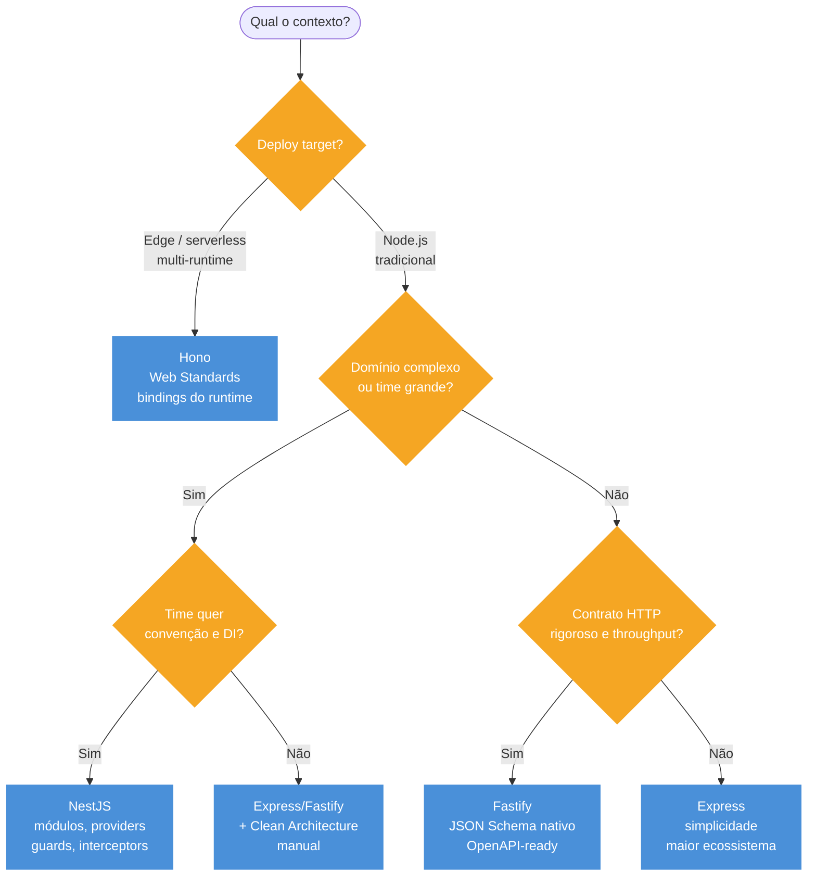

# Decision tree + cheatsheet

> [!abstract] TL;DR
> Fechamento do galho: decision tree para escolher framework, tabela comparativa, top armadilhas e vocabulário PT->EN. Use como revisão rápida antes de entrevista ou decisão de arquitetura. A resposta certa para "qual framework?" não começa pelo nome do framework — começa pelo deploy target, domínio, time e contrato.

## Decision tree - qual framework para qual contexto



### Árvore em texto (revisão rápida)

```text
Qual o contexto?

├─ Edge worker / serverless multi-runtime
│  └─ -> Hono
│
├─ API com schema bem definido + throughput alto
│  └─ -> Fastify
│
├─ App enterprise, domínio complexo, time grande
│  ├─ DI, módulos e convenção corporativa importam? -> NestJS
│  └─ Time quer controle manual? -> Express/Fastify + Clean Architecture
│
├─ Microsserviço I/O-bound simples, time pequeno
│  ├─ Performance/contrato importam muito? -> Fastify
│  └─ Time conhece Express e quer simplicidade? -> Express
│
└─ Migração de legacy
   ├─ Express legacy saudável -> modernizar Express
   └─ Framework abandonado -> avaliar Fastify ou NestJS
```

## Tabela comparativa

| Atributo | Express | NestJS | Fastify | Hono |
| --- | --- | --- | --- | --- |
| Modelo | Middleware-based | Opinionated, DI | Schema-first | Edge-first |
| DI built-in | Não | Sim | Não | Não |
| Validation | Manual/zod/joi | `ValidationPipe` ou zod | JSON Schema nativo | zod via lib |
| Performance | Baseline | Adapter-dependent | Baixo overhead | Edge-optimized |
| Maturidade | Alta | Alta | Alta | Crescente |
| Ecossistema | Maior | Médio/Nest-specific | Médio | Menor, crescendo |
| Learning curve | Baixa | Alta | Média | Baixa |
| Use case | Glue, protótipo, microsserviço | Enterprise | APIs throughput-focused | Edge/serverless |

## Casos práticos

### Cenário 1: escolha de framework para API de marketplace com requisitos conflitantes

Um marketplace de serviços tem times diferentes trabalhando em partes distintas do sistema. O time principal quer NestJS por convenção; o time de edge computing quer Hono para workers de imagem. Como estruturar essa decisão sem cair em uniformidade forçada?

```typescript
// services/catalog-api — NestJS: domínio complexo, time grande, DI necessário
@Module({
  imports: [TypeOrmModule.forFeature([Product, Category])],
  providers: [
    ProductsService,
    CategoriesService,
    { provide: SEARCH_ENGINE, useClass: ElasticsearchAdapter },
    { provide: PRICING_GATEWAY, useClass: PricingHttpGateway },
  ],
  controllers: [ProductsController, CategoriesController],
})
export class CatalogModule {}
```

```typescript
// services/image-processor — Hono: edge worker, sem Node APIs, bindings R2
import { Hono } from "hono";
import { zValidator } from "@hono/zod-validator";
import { z } from "zod";

const app = new Hono<{ Bindings: { R2_BUCKET: R2Bucket } }>();

const ResizeInput = z.object({
  width: z.coerce.number().int().min(1).max(4000),
  height: z.coerce.number().int().min(1).max(4000),
  format: z.enum(["webp", "avif", "jpeg"]).default("webp"),
});

app.post("/resize/:key", zValidator("json", ResizeInput), async (c) => {
  const key = c.req.param("key");
  const input = c.req.valid("json");

  const original = await c.env.R2_BUCKET.get(key);
  if (!original) return c.notFound();

  // Cloudflare Image Resizing via fetch
  const resized = await fetch(`https://cdn.example.com/${key}`, {
    cf: { image: { width: input.width, height: input.height, format: input.format } },
  });

  return new Response(resized.body, {
    headers: { "Content-Type": `image/${input.format}` },
  });
});

export default app;
```

```typescript
// services/orders-api — Fastify: throughput alto, contrato OpenAPI, JSON Schema nativo
import Fastify from "fastify";
import swagger from "@fastify/swagger";
import { Type } from "@sinclair/typebox";

const app = Fastify({ logger: true });
await app.register(swagger, { openapi: { info: { title: "Orders API", version: "1.0" } } });

const OrderSchema = Type.Object({
  customerId: Type.String({ format: "uuid" }),
  items: Type.Array(Type.Object({
    productId: Type.String({ format: "uuid" }),
    quantity: Type.Integer({ minimum: 1 }),
  }), { minItems: 1 }),
});

app.post("/orders", {
  schema: { body: OrderSchema, response: { 201: OrderSchema } },
  handler: async (req) => {
    const order = await placeOrderUseCase.execute(req.body);
    return order;
  },
});
```

A decisão por framework é local a cada serviço, guiada pelo deploy target e domínio — não por preferência global do CTO. Uniformidade forçada seria o erro.

### Cenário 2: modernização de Express legacy sem big-bang

Uma API Express 4 de 6 anos tem error handling inconsistente, sem validation schema, sem tipos. O time quer "migrar para NestJS" mas o orçamento é limitado. Como modernizar incrementalmente?

```typescript
// Passo 1: error handling centralizado (semana 1)
// Antes: cada endpoint com try/catch próprio e res.json({ error: ... })
// Depois: middleware global com Problem Details

// errors.ts
abstract class AppError extends Error {
  abstract readonly status: number;
  abstract readonly type: string;
  abstract readonly title: string;
}

// error-handler.ts
app.use((err: unknown, req: Request, res: Response, _next: NextFunction) => {
  const isAppError = err instanceof AppError;
  res.status(isAppError ? err.status : 500)
    .type("application/problem+json")
    .json({
      type: isAppError ? err.type : "about:blank",
      title: isAppError ? err.title : "Internal Server Error",
      status: isAppError ? err.status : 500,
      detail: isAppError ? err.message : "Unexpected error",
      instance: req.originalUrl,
    });
});
```

```typescript
// Passo 2: schema validation na boundary (semanas 2-3)
// Antes: if (!req.body.email) return res.status(400).json({ error: "invalid" })
// Depois: zod na boundary

import { z } from "zod";
import { asyncHandler } from "express-async-handler";

const CreateOrderInput = z.object({
  customerId: z.string().uuid(),
  items: z.array(z.object({
    productId: z.string().uuid(),
    quantity: z.number().int().positive(),
  })).min(1),
}).strict();

app.post("/orders", asyncHandler(async (req, res) => {
  const input = CreateOrderInput.parse(req.body); // ZodError cai no handler global
  const order = await orders.create(input);
  res.status(201).json(order);
}));
```

```typescript
// Passo 3: separar concerns por feature folder (semanas 4-6)
// Antes: routes/orders.js com 400 linhas misturando DB, lógica e HTTP
// Depois: feature folder com separação leve

// features/orders/
// ├── orders.router.ts     (HTTP only — sem lógica de negócio)
// ├── orders.service.ts    (lógica de aplicação — sem Express)
// ├── orders.repository.ts (acesso ao banco)
// └── orders.schema.ts     (schemas zod)

export function makeOrdersRouter(deps: { service: OrdersService }) {
  const router = Router();

  router.post("/", asyncHandler(async (req, res) => {
    const input = CreateOrderInput.parse(req.body);
    const order = await deps.service.create(input);
    res.status(201).json(order);
  }));

  return router;
}
```

```typescript
// Passo 4: avaliação após modernização (mês 3)
// Se ainda houver dor: avaliar NestJS ou Fastify com evidência
// Se não houver dor: Express modernizado pode ser o destino final

// Critérios para migrar framework:
// - DI manual ficou complexo demais? -> NestJS
// - Contrato OpenAPI e throughput são gargalos? -> Fastify
// - Time passou a dominar o Express modernizado? -> não migre
```

A modernização incremental reduz risco e revela se a migração de framework é necessária ou só era a solução em busca de problema.

## Playbooks rápidos

### Projeto novo: API interna simples

Escolha padrão: Express ou Fastify.

- Use Express se o time já domina e o contrato é simples.
- Use Fastify se schemas e OpenAPI serão parte do fluxo desde o início.
- Evite NestJS se a justificativa for só "pode crescer".
- Defina desde o dia 1: error handler, validation, request ID e estrutura por feature.

```text
Express/Fastify + zod + Problem Details + composition root simples
```

### Projeto novo: domínio enterprise

Escolha padrão: NestJS ou Clean Architecture manual.

- Use NestJS se convenção, DI e módulos reduzem atrito do time.
- Use Express/Fastify + Clean se o time prefere controle explícito.
- Evite controller gordo.
- Separe ports/adapters antes de integrar banco e provedores externos.

```text
Controller -> Use Case -> Port -> Adapter
```

### Edge/serverless multi-runtime

Escolha padrão: Hono.

- Confirme runtime alvo antes de escolher libs.
- Evite APIs Node-only.
- Pense em bindings e storage do provedor.
- Teste cold start, limites de CPU e observability.

```text
Hono + Web APIs + bindings do runtime + schema validation
```

### Legacy Express

Não migre por reflexo.

- Primeiro atualize error handling.
- Depois centralize validation.
- Em seguida organize routers por feature.
- Só então avalie Fastify/NestJS se ainda houver dor real.

```text
modernizar antes de migrar
```

## Checklist de revisão de arquitetura

- O framework foi escolhido por deploy, domínio, contrato e time?
- Há error handling global com Problem Details?
- Inputs externos são validados com schema?
- Cross-cutting concerns estão na pipeline, não nos controllers?
- O app tem composition root ou DI container claro?
- Clean Architecture foi aplicada onde há domínio, não por ritual?
- Edge apps não dependem de APIs Node-only?
- Performance claims têm benchmark do caso real?
- Rotas públicas, health e metrics foram consideradas na auth?
- Observability mínima existe: request ID, logs, status, latência?

## Flashcards mentais para entrevista

**Express:** liberdade máxima, responsabilidade máxima. **NestJS:** convenção e DI para complexidade organizacional. **Fastify:** contrato e performance via schema. **Hono:** deploy edge/multi-runtime via Web Standards. **Middleware:** pipeline de cross-cutting concerns. **Problem Details:** erro como contrato. **Validation:** toda entrada externa é `unknown`. **Clean:** dependências apontam para dentro. **DI:** explícito primeiro; container quando wiring/lifecycle justificam.

## Perguntas que diferenciam senior

1. Qual é o deploy target e quais APIs ele suporta?
2. Qual parte do sistema tem regra de domínio de verdade?
3. O gargalo provável é framework overhead, banco, rede ou CPU?
4. O time precisa mais de liberdade local ou convenção compartilhada?
5. O contrato HTTP precisa gerar documentação e clients?
6. Como erros serão parseados por clientes e logs?
7. Como auth, validation e logging entram sem poluir controller?
8. O framework ajuda ou esconde a arquitetura?
9. O código pode ser testado sem subir servidor real?
10. O que aconteceria se trocássemos banco/provedor/framework?

## Armadilhas comuns

> [!warning] Escolher framework por popularidade sem considerar deploy target
> **O que acontece:** API Node "Enterprise" é deployada em Cloudflare Workers e falha por usar APIs como `fs`, `net` e `Buffer` que não existem no runtime edge. **Por quê:** framework escolhido por familiaridade, sem verificar compatibilidade com o runtime de produção. **Como evitar:** confirme o runtime primeiro; Hono e Web Standards são as escolhas seguras para edge; valide com benchmark de cold start no runtime alvo.

> [!warning] Express 4 sem `asyncHandler`: erros async silenciosos
> **O que acontece:** `Promise` rejeitada não chega ao error middleware global; request fica pendurada ou processo emite `unhandledRejection`. **Por quê:** Express 4 não captura automaticamente erros de handlers async. **Como evitar:** use `express-async-handler` ou migre para Express 5 que captura async nativamente.

> [!warning] Express error middleware com 3 argumentos não captura erros
> **O que acontece:** middleware de erro nunca é invocado; erros caem no handler padrão do Express com HTML. **Por quê:** Express detecta error middleware pela aridade (`fn.length === 4`); com 3 args é middleware normal. **Como evitar:** sempre declare `(err, req, res, next)` mesmo que `next` não seja usado.

> [!warning] Mutar `req` sem tipagem: bug invisível à distância
> **O que acontece:** middleware A seta `req.user` com typo; middleware B lê `undefined` sem erro imediato; bug aparece no log de produção. **Por quê:** `req` em Express é mutável e não tipado por padrão; sem declaration merging, qualquer campo é `any`. **Como evitar:** declare extensões de `Request` com TypeScript; revise toda mutação de `req` em code review.

> [!warning] NestJS `Scope.REQUEST` sem necessidade: custo propaga
> **O que acontece:** providers que deveriam ser singletons ficam request-scoped, criando instâncias desnecessárias a cada request. **Por quê:** um provider com request scope torna todos os providers que dependem dele também request-scoped (propagação automática). **Como evitar:** use request scope apenas para dados de request (tenant, userId, requestId); logger, repositórios e use cases geralmente são singleton.

> [!warning] NestJS circular import resolvido com `forwardRef()` sem refatorar
> **O que acontece:** acoplamento circular fica encapsulado, cresce com o projeto e vira dívida técnica estrutural. **Por quê:** `forwardRef()` é aplicado como fix rápido sem investigar por que dois módulos se importam mutuamente. **Como evitar:** circular import é sinal de design problem; extraia um terceiro módulo ou inverta a dependência antes de usar `forwardRef`.

> [!warning] Fastify schema sem `additionalProperties: false`
> **O que acontece:** campos extras do body chegam ao handler e podem atingir o banco — risco de mass assignment. **Por quê:** Fastify não rejeita campos adicionais por padrão no JSON Schema; depende de `additionalProperties: false` explícito. **Como evitar:** defina `additionalProperties: false` em todos os schemas de request body; use TypeBox que aplica isso por padrão.

> [!warning] Fastify plugin encapsulado quando deveria expor decorator ao pai
> **O que acontece:** decorator registrado dentro de plugin não está disponível fora do escopo encapsulado; `app.hasDecorator()` retorna `false` fora do plugin. **Por quê:** Fastify usa encapsulamento de contexto por design; `fastify-plugin` remove essa encapsulação. **Como evitar:** use `fastify-plugin` para plugins que precisam expor decorators, hooks ou providers para toda a aplicação.

> [!warning] Hono assumindo APIs Node em edge runtime
> **O que acontece:** `import { readFile } from "fs"` lança erro em Cloudflare Workers; `process.env` pode não existir em Deno Deploy. **Por quê:** código escrito com mentalidade Node usa APIs que não fazem parte do WinterCG/Web Standards. **Como evitar:** use apenas APIs Web Standards (Fetch, Web Crypto, URL, ReadableStream); acesse env via `c.env` nos bindings do Hono.

> [!warning] Hono middleware sem `await next()`
> **O que acontece:** handler posterior nunca executa; response fica pendente ou vazia. **Por quê:** Hono usa onion model — controle só passa para o próximo handler com `await next()`. **Como evitar:** todo middleware Hono que não termina a request explicitamente deve ter `await next()`.

> [!warning] Stack trace em produção em qualquer framework
> **O que acontece:** cliente vê paths internos, nomes de dependências e dados sensíveis de contexto. **Por quê:** error handler sem sanitização retorna `err.stack` na response. **Como evitar:** sempre sanitize 5xx com mensagem genérica; stack vai para o log interno com correlation ID.

> [!warning] DI container em app pequeno sem necessidade
> **O que acontece:** overhead de configuração, decorators, tokens e lifecycle antes de qualquer problema real de wiring. **Por quê:** container adotado por antecipação, "para quando crescer". **Como evitar:** comece com DI manual; migre para container quando factories começarem a doer ou quando scopes forem necessários.

> [!warning] Clean Architecture em CRUD simples
> **O que acontece:** três vezes mais código, zero benefício arquitetural — sem regra de negócio, não há o que proteger. **Por quê:** padrão aplicado por cargo de trabalho sem avaliação de custo-benefício. **Como evitar:** use separação leve (service + repository + schema) em CRUD; Reserve Clean para domínio rico com múltiplos adapters.

> [!warning] Schema só para body, ignorando query/params/headers
> **O que acontece:** `req.params.id` chega como string não validada; ID inválido causa erro de banco em vez de 400. **Por quê:** validação focou no body porque é o campo mais visível; params e query são esquecidos. **Como evitar:** valide params, query e headers críticos com o mesmo rigor do body; toda entrada externa é `unknown`.

> [!warning] Misturar zod e `class-validator` sem convenção
> **O que acontece:** metade dos endpoints retorna erros no formato zod, metade no formato class-validator; cliente não consegue parsear uniformemente. **Por quê:** time cresceu e cada desenvolvedor usou a ferramenta que conhecia. **Como evitar:** escolha uma biblioteca por repositório e documente; use `nestjs-zod` para unificar se NestJS for o framework.

## Como explicar em inglês

Frameworks Node são um tópico frequente em entrevistas técnicas em inglês. O vocabulário abaixo cobre os termos mais cobrados e como contextualizá-los.

### Tabela PT↔EN

| Português | Inglês | Contexto de uso |
| --- | --- | --- |
| middleware | middleware | "Express uses middleware to handle cross-cutting concerns." |
| middleware de erro | error middleware | "Express error middleware requires four parameters." |
| decorador | decorator | "NestJS guards and interceptors use TypeScript decorators." |
| injeção de dependência | dependency injection | "NestJS has built-in dependency injection via its module system." |
| provedor | provider | "Any injectable class is a provider in NestJS." |
| módulo | module | "NestJS modules organize providers and controllers by feature." |
| controlador | controller | "Controllers handle HTTP requests and delegate to use cases." |
| escopo | scope | "Providers can be singleton, request-scoped, or transient." |
| guarda | guard | "Guards control access before a handler is called." |
| interceptor | interceptor | "Interceptors wrap the handler for before/after logic." |
| pipe | pipe | "Pipes transform and validate incoming data." |
| filtro | filter | "Exception filters catch and format thrown exceptions." |
| ciclo de vida | lifecycle | "Fastify has a rich lifecycle with named hooks." |
| orientado por schema | schema-first | "Fastify is schema-first: routes declare their JSON Schema." |
| inferência de tipo | type inference | "Zod combines schema definition with TypeScript type inference." |
| encapsulamento de plugin | plugin encapsulation | "Fastify plugins are encapsulated by default." |
| runtime de borda | edge runtime | "Hono targets edge runtimes like Cloudflare Workers." |
| nativo da Fetch API | Fetch API native | "Hono uses the Fetch API natively — no Node.js required." |
| modelo cebola | onion model | "Hono's onion model lets one middleware handle both before and after logic." |
| taxonomia de erros | error taxonomy | "A mature API has an explicit error taxonomy." |
| raiz de composição | composition root | "The composition root is where all dependencies are wired." |
| portas e adaptadores | ports and adapters | "Ports define contracts; adapters implement them." |
| arquitetura hexagonal | hexagonal architecture | "Hexagonal architecture is also known as ports and adapters." |
| inversão de dependência | dependency inversion | "Dependency inversion means high-level modules don't depend on low-level ones." |

### Como contextualizar em entrevista

**"Qual framework Node você escolheria?"**

> "I would start from the problem shape: deploy target, domain complexity, team size, and API contract. Hono for edge runtimes, Fastify for schema-first high-throughput APIs, NestJS for enterprise teams that need conventions and DI, and Express for simplicity or large ecosystems. I would not pick a framework based on personal preference alone."

**"Você conhece Clean Architecture?"**

> "Clean Architecture enforces the dependency rule: source code dependencies point inward. Domain and use cases don't know about Express, databases, or frameworks. Adapters bridge the gap. The test is simple: if a use case test requires spinning up Express or Postgres, the boundary is broken."

**"Como você implementaria error handling?"**

> "I would centralize it using Problem Details, from RFC 7807. Each framework has a global handler: Express error middleware, NestJS exception filters, Fastify setErrorHandler, Hono onError. The key is taxonomy: operational errors get specific 4xx or 5xx responses, programmer errors get logged and sanitized."

## Vocabulário PT->EN

| PT | EN |
| --- | --- |
| middleware | middleware |
| middleware de erro | error middleware |
| decorador | decorator |
| injeção de dependência | dependency injection |
| provedor | provider |
| módulo | module |
| controlador | controller |
| escopo | scope |
| guarda | guard |
| interceptor | interceptor |
| pipe | pipe |
| filtro | filter |
| ciclo de vida | lifecycle |
| orientado por schema | schema-first |
| inferência de tipo | type inference |
| encapsulamento de plugin | plugin encapsulation |
| runtime de borda | edge runtime |
| nativo da Fetch API | Fetch API native |
| modelo cebola | onion model |
| taxonomia de erros | error taxonomy |
| raiz de composição | composition root |
| portas e adaptadores | ports and adapters |
| arquitetura hexagonal | hexagonal architecture |
| inversão de dependência | dependency inversion |

## Rubrica pessoal de decisão

| Pergunta | Puxa para |
| --- | --- |
| Deploy edge/multi-runtime? | Hono |
| Contrato HTTP rigoroso? | Fastify |
| Time grande e domínio modular? | NestJS |
| Glue code e simplicidade? | Express |
| Domínio rico e longa vida? | Clean Architecture |
| Dependências rasas? | DI manual |
| Lifecycle complexo? | Container |

Essa tabela não substitui julgamento; ela evita começar pelo gosto pessoal.

## Em entrevista

"I choose a Node framework by matching the problem shape. Express is simple and ubiquitous, Fastify is schema-first and low-overhead, NestJS is the structured enterprise choice with dependency injection, and Hono is the edge-first multi-runtime option. I would not rank them globally; I would choose based on deploy target, API contract, team size, and domain complexity."

Vocabulário-chave:

- decision tree -> árvore de decisão
- trade-off -> troca/custo-benefício
- problem shape -> formato do problema
- deploy target -> alvo de deploy
- framework fit -> encaixe do framework

## Simulações de entrevista

### "We need a high-throughput public REST API with strict contracts"

Resposta forte:

```text
I would consider Fastify first because the API contract is central.
Its route-level JSON Schemas give validation and response serialization,
and they can feed OpenAPI. I would still benchmark the real workload,
because database and network calls may dominate framework overhead.
```

### "We have a large team building a modular enterprise backend"

Resposta forte:

```text
NestJS is a reasonable default because modules, providers, guards,
pipes, interceptors, and DI give the team a shared architecture.
I would still keep domain logic outside controllers and avoid leaking
ORM decorators into domain entities.
```

### "We want to run the same API on Cloudflare Workers and Node"

Resposta forte:

```text
I would look at Hono because it is based on Web Standards and the Fetch API.
The main review item would be runtime compatibility: no hidden fs/net usage,
provider-specific bindings isolated, and observability tested in the edge runtime.
```

### "We already have Express legacy"

Resposta forte:

```text
I would not migrate by reflex. First I would modernize error handling,
validation, route organization, TypeScript types, and tests. If the remaining
pain is structure or schema-first contract, then I would evaluate NestJS or Fastify.
```

## O que vem a seguir

Este é o fechamento do galho de Frameworks e arquitetura. Os próximos galhos naturais na trilha Node são:

- **Observability:** logging estruturado com Pino, métricas com Prometheus, tracing distribuído com OpenTelemetry e diagnóstico de frameworks em produção.
- **Segurança:** Helmet, CORS configurável, rate limiting, CSRF, input sanitization e hardening por framework.
- **Base técnica:** [[03-Dominios/Tecnologia/Node/Runtime e Event Loop/index]], [[03-Dominios/Tecnologia/Node/Paralelismo/index]] e [[03-Dominios/Tecnologia/Node/Streams/index]] — os fundamentos que explicam por que cada decisão de framework importa em produção.

## Revisão em 60 segundos

Se o entrevistador perguntar "qual framework Node você escolheria?", não comece pelo nome do framework. Comece pelo contexto:

```text
I would start from the problem shape:
deploy target, domain complexity, team size, API contract,
and operational constraints. Then I would map that to the framework.
```

Depois aplique:

- **Deploy edge?** Hono.
- **Contrato/schema/throughput?** Fastify.
- **Enterprise/DI/time grande?** NestJS.
- **Simplicidade/ecossistema/glue?** Express.
- **Domínio rico?** Clean Architecture independente do framework.
- **App pequeno?** DI manual antes de container.

## Fontes

- [Express.js](https://expressjs.com/)
- [Fastify](https://fastify.dev/)
- [NestJS](https://docs.nestjs.com/)
- [Hono](https://hono.dev/)
- [Zod](https://zod.dev/)

## Veja também

- [[03-Dominios/Tecnologia/Node/Frameworks e arquitetura/index]]
- [[01 - Os 4 frameworks - Express, NestJS, Fastify, Hono]]
- [[02 - Express idiomático]]
- [[03 - NestJS - fundamentos]]
- [[04 - NestJS - guards, interceptors, pipes, filters]]
- [[05 - Fastify - schema-first, plugins, performance]]
- [[06 - Hono e edge runtimes]]
- [[07 - Middleware pipeline]]
- [[08 - Error handling estruturado]]
- [[09 - Validation com schema]]
- [[10 - Clean Architecture em Node]]
- [[11 - DI - manual vs container]]
- [[Node.js]]
- [[03-Dominios/Tecnologia/Node/Runtime e Event Loop/index]]
- [[03-Dominios/Tecnologia/Node/Paralelismo/index]]
- [[03-Dominios/Tecnologia/Node/Streams/index]]
