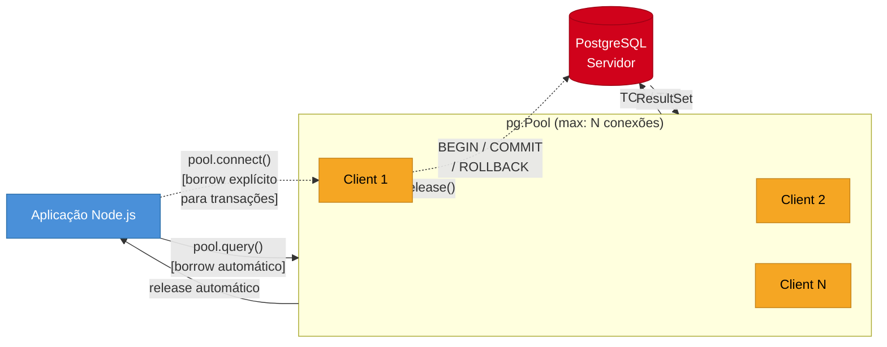

# PostgreSQL com node-postgres

> [!abstract] TL;DR
> `pg` (node-postgres) é o cliente de referência para PostgreSQL em [[Node.js]]: maduro, amplamente suportado e com API estável. A peça central em produção é o `pg.Pool`, que gerencia um conjunto de conexões reutilizáveis e evita o custo de abrir e fechar conexões a cada query. Transações exigem um `pg.Client` explícito retirado do pool — o `Pool` não garante que queries consecutivas caiam na mesma conexão. `postgres.js` (também chamada de `postgres`) é a alternativa moderna com tagged template literals, type safety nativa, menor overhead e API mais ergonômica para novos projetos. A escolha entre os dois raramente é um gargalo — mas entender pool sizing, connection leaks e graceful shutdown é o que separa um setup amador de um setup de produção.

## O que é

`pg` (node-postgres) é o driver PostgreSQL mais antigo e difundido do ecossistema Node.js. Ele expõe dois primitivos fundamentais:

- **`pg.Client`**: conexão única e direta com o banco. Você cria, conecta, usa e fecha. Ideal para transações, onde é necessário garantir que múltiplas queries rodem na mesma conexão.
- **`pg.Pool`**: gerenciador de um conjunto de `pg.Client`s. Abre novas conexões sob demanda até o limite configurado (`max`), reutiliza conexões ociosas, e devolve erros quando o pool está esgotado. É o primitivo correto para qualquer código de aplicação fora de transações.

`postgres.js` é uma biblioteca independente (não relacionada ao pacote `pg`) que reimagina o driver com tagged template literals, sem a necessidade de objetos parametrizados separados — a interpolação na string `sql` já é tratada como parâmetro seguro automaticamente.

## Como funciona



### `pg.Pool` vs `pg.Client`

| Aspecto | `pg.Pool` | `pg.Client` |
|---|---|---|
| Conexões | Múltiplas, reutilizadas | Uma única conexão |
| Caso de uso principal | Queries normais de aplicação | Transações explícitas |
| Gerenciamento | Automático (borrow/release) | Manual (connect/release) |
| Thread-safe (conceito Node) | Sim — event loop serializa | Sim |
| Risco de leak | Baixo se `pool.query()` usado | Alto se `client.release()` esquecido |

**Regra prática:** use `pool.query()` para 95% dos casos. Somente pegue um `client` explícito do pool quando precisar de uma transação (`BEGIN / COMMIT / ROLLBACK`) ou de múltiplas queries que precisam compartilhar estado de sessão (ex.: `SET LOCAL`).

### Ciclo de vida da conexão no Pool

```
Requisição chega
     │
     ▼
pool.query() chamado
     │
     ├── conexão ociosa disponível? ──→ reutiliza
     │
     ├── total < max? ──────────────→ abre nova conexão
     │
     └── pool cheio e todas ocupadas ─→ aguarda (connectionTimeoutMillis)
                                              │
                                              └── timeout esgotado → erro
```

Após a query completar, a conexão retorna automaticamente ao pool quando `pool.query()` é usado. Com um `client` explícito, `client.release()` precisa ser chamado manualmente — inclusive no `catch` e `finally`.

### Configuração do Pool

As opções mais relevantes para produção:

| Opção | Padrão | Descrição |
|---|---|---|
| `max` | 10 | Número máximo de conexões abertas simultaneamente |
| `min` | 0 | Conexões mínimas sempre abertas (warm pool) |
| `idleTimeoutMillis` | 10000 | Tempo (ms) para fechar conexão ociosa |
| `connectionTimeoutMillis` | 0 (sem timeout) | Tempo máximo de espera por uma conexão livre |
| `allowExitOnIdle` | false | Permite o processo Node.js encerrar quando pool está ocioso |

**Pool sizing:** a fórmula clássica é `(núcleos_de_CPU × 2) + 1`. Para aplicações I/O-bound (como a maioria das APIs Node), o banco geralmente aguenta mais conexões que isso, mas o PostgreSQL impõe seu próprio limite (`max_connections`, padrão 100). Em produção com múltiplas instâncias da aplicação, o total de conexões abertas é `instâncias × max` — essa conta é crítica para não estourar o `max_connections` do servidor.

---

## Snippets

### Snippet 1 — Configuração de Pool com variáveis de ambiente

```typescript
import { Pool } from 'pg';
import os from 'os';

// Pool sizing: (CPUs * 2) + 1 como ponto de partida
// Ajuste conforme max_connections do PostgreSQL e número de instâncias
const POOL_SIZE = os.cpus().length * 2 + 1;

export const pool = new Pool({
  host: process.env.PGHOST ?? 'localhost',
  port: parseInt(process.env.PGPORT ?? '5432', 10),
  database: process.env.PGDATABASE,
  user: process.env.PGUSER,
  password: process.env.PGPASSWORD,
  ssl: process.env.NODE_ENV === 'production'
    ? { rejectUnauthorized: true }
    : false,
  max: parseInt(process.env.DB_POOL_MAX ?? String(POOL_SIZE), 10),
  min: parseInt(process.env.DB_POOL_MIN ?? '2', 10),
  idleTimeoutMillis: 30_000,       // fecha conexões ociosas após 30s
  connectionTimeoutMillis: 5_000,  // erro se não conseguir conexão em 5s
  allowExitOnIdle: false,          // mantém processo vivo enquanto há conexões
});

// Monitoramento básico de saúde do pool
pool.on('error', (err) => {
  console.error('Unexpected error on idle pg client', err);
});

pool.on('connect', () => {
  console.debug(`[pg] new connection established (total: ${pool.totalCount})`);
});
```

> [!tip] Variáveis de ambiente padrão do `pg`
> O `pg` lê automaticamente as variáveis de ambiente `PGHOST`, `PGPORT`, `PGDATABASE`, `PGUSER` e `PGPASSWORD` se não forem passadas explicitamente. Isso facilita integração com secrets managers e sistemas 12-factor.

---

### Snippet 2 — Query parametrizada (prevenção de SQL injection)

```typescript
import { pool } from './db';

interface User {
  id: number;
  name: string;
  email: string;
  created_at: Date;
}

// CORRETO: $1, $2 são placeholders parametrizados
// O pg envia os valores separadamente — o banco nunca interpreta a string
export async function findUserByEmail(email: string): Promise<User | null> {
  const result = await pool.query<User>(
    'SELECT id, name, email, created_at FROM users WHERE email = $1',
    [email],
  );
  return result.rows[0] ?? null;
}

// Múltiplos parâmetros
export async function findUsersByStatus(
  status: string,
  limit: number,
  offset: number,
): Promise<User[]> {
  const result = await pool.query<User>(
    `SELECT id, name, email, created_at
     FROM users
     WHERE status = $1
     ORDER BY created_at DESC
     LIMIT $2 OFFSET $3`,
    [status, limit, offset],
  );
  return result.rows;
}

// ERRADO — NUNCA faça isso:
// pool.query(`SELECT * FROM users WHERE email = '${email}'`) // SQL injection!
```

> [!danger] SQL injection por interpolação de string
> Concatenar ou interpolar variáveis diretamente na string da query é a porta de entrada mais comum para SQL injection. Sempre use os placeholders `$1`, `$2`, ... do `pg`. O driver envia os parâmetros como dados separados da query — o banco nunca os executa como SQL.

---

### Snippet 3 — Transação com `BEGIN/COMMIT/ROLLBACK`

```typescript
import { pool } from './db';

interface TransferParams {
  fromAccountId: number;
  toAccountId: number;
  amount: number;
}

export async function transferFunds({
  fromAccountId,
  toAccountId,
  amount,
}: TransferParams): Promise<void> {
  // Pega um client explícito do pool
  // IMPORTANTE: transações exigem a mesma conexão física do início ao fim
  const client = await pool.connect();

  try {
    await client.query('BEGIN');

    // Verifica saldo com FOR UPDATE para evitar race condition
    const { rows } = await client.query<{ balance: number }>(
      'SELECT balance FROM accounts WHERE id = $1 FOR UPDATE',
      [fromAccountId],
    );

    if (!rows[0] || rows[0].balance < amount) {
      throw new Error('Saldo insuficiente');
    }

    // Debita a origem
    await client.query(
      'UPDATE accounts SET balance = balance - $1 WHERE id = $2',
      [amount, fromAccountId],
    );

    // Credita o destino
    await client.query(
      'UPDATE accounts SET balance = balance + $1 WHERE id = $2',
      [amount, toAccountId],
    );

    // Registra o histórico
    await client.query(
      `INSERT INTO transfers (from_account_id, to_account_id, amount, created_at)
       VALUES ($1, $2, $3, NOW())`,
      [fromAccountId, toAccountId, amount],
    );

    await client.query('COMMIT');
  } catch (err) {
    // Rollback em qualquer erro — deixa o banco em estado consistente
    await client.query('ROLLBACK');
    throw err;
  } finally {
    // CRÍTICO: sempre libera o client de volta ao pool
    // Sem isso, o pool fica com uma conexão "pendurada" para sempre
    client.release();
  }
}
```

> [!warning] `client.release()` no `finally`, não no `try`
> Se `client.release()` estiver apenas no bloco `try`, qualquer erro antes dele vaza a conexão de volta para o pool. Sempre use `finally` para garantir que a liberação ocorra independentemente do resultado.

---

### Snippet 4 — `postgres.js` com tagged template literals

```typescript
import postgres from 'postgres';

// Conexão com postgres.js
// A string de template é tratada como query parametrizada automaticamente
const sql = postgres({
  host: process.env.PGHOST ?? 'localhost',
  port: parseInt(process.env.PGPORT ?? '5432', 10),
  database: process.env.PGDATABASE,
  username: process.env.PGUSER,
  password: process.env.PGPASSWORD,
  ssl: process.env.NODE_ENV === 'production' ? 'require' : false,
  max: 10,
  idle_timeout: 20,         // segundos (não ms como no pg)
  connect_timeout: 10,
  transform: postgres.camel, // snake_case → camelCase automático
});

interface User {
  id: number;
  name: string;
  email: string;
  createdAt: Date; // camelCase via transform
}

// Query simples — interpolação segura por design
export async function findUser(userId: number): Promise<User | undefined> {
  const [user] = await sql<User[]>`
    SELECT id, name, email, created_at
    FROM users
    WHERE id = ${userId}
  `;
  return user;
}

// Inserção com retorno
export async function createUser(
  name: string,
  email: string,
): Promise<User> {
  const [newUser] = await sql<User[]>`
    INSERT INTO users (name, email, created_at)
    VALUES (${name}, ${email}, NOW())
    RETURNING id, name, email, created_at
  `;
  return newUser;
}

// Transação com postgres.js
export async function transferWithPostgres(
  fromId: number,
  toId: number,
  amount: number,
): Promise<void> {
  await sql.begin(async (tx) => {
    await tx`UPDATE accounts SET balance = balance - ${amount} WHERE id = ${fromId}`;
    await tx`UPDATE accounts SET balance = balance + ${amount} WHERE id = ${toId}`;
  });
  // Se qualquer query lançar, sql.begin faz ROLLBACK automaticamente
}
```

---

### Snippet 5 — Graceful shutdown fechando o pool

```typescript
import { pool } from './db';
import { createServer } from 'http';
import app from './app'; // Express/Fastify/etc

const server = createServer(app);

server.listen(process.env.PORT ?? 3000, () => {
  console.log('Server listening');
});

// Graceful shutdown handler
async function shutdown(signal: string): Promise<void> {
  console.log(`Received ${signal}. Starting graceful shutdown...`);

  // 1. Para de aceitar novas conexões HTTP
  server.close(async (err) => {
    if (err) {
      console.error('Error closing HTTP server:', err);
      process.exit(1);
    }

    try {
      // 2. Aguarda queries em andamento e fecha o pool
      await pool.end();
      console.log('Database pool closed gracefully');
      process.exit(0);
    } catch (poolErr) {
      console.error('Error closing database pool:', poolErr);
      process.exit(1);
    }
  });

  // 3. Timeout forçado — se em 10s não fechou, encerra mesmo assim
  setTimeout(() => {
    console.error('Graceful shutdown timeout. Forcing exit.');
    process.exit(1);
  }, 10_000).unref();
}

process.on('SIGTERM', () => shutdown('SIGTERM'));
process.on('SIGINT', () => shutdown('SIGINT'));
```

> [!warning] Não fechar o pool em graceful shutdown
> Sem `await pool.end()`, o processo Node.js encerra abruptamente enquanto o PostgreSQL ainda tem conexões abertas do lado do servidor. O PostgreSQL detecta a desconexão limpa via TCP FIN, mas transações em andamento podem ficar abertas até o `tcp_keepalives_idle` expirar. Em ambientes Kubernetes com rolling deploys, isso pode acumular conexões zumbis no servidor.

---

## Armadilhas comuns

> [!danger] Pool exausto — a armadilha silenciosa de produção
> **O que acontece:** Com `connectionTimeoutMillis: 0` (padrão), uma aplicação com pool exausto simplesmente aguarda indefinidamente por uma conexão livre. Requisições HTTP ficam presas, latência dispara e nenhum erro é logado — parece um "travamento" sem causa aparente.
>
> **Por quê:** O padrão zero de `connectionTimeoutMillis` foi pensado para cenários de uso simples onde esperar é preferível a falhar, mas em produção com alta concorrência, cria silêncio total quando o pool está saturado.
>
> **Como evitar:** Sempre configure `connectionTimeoutMillis: 5000` a `10000`. Monitore `pool.totalCount`, `pool.idleCount` e `pool.waitingCount` como métricas de alerta — quando `waitingCount > 0` com frequência, o pool está subdimensionado.

> [!danger] Connection leak por `client.release()` esquecido
> **O que acontece:** Com `max: 10`, apenas 10 chamadas a `pool.connect()` sem `client.release()` correspondente são suficientes para travar toda a aplicação. Queries seguintes penduram aguardando conexões que nunca voltam.
>
> **Por quê:** Cada `pool.connect()` retira uma conexão do pool. Se o código lança exceção antes do `client.release()`, a conexão nunca retorna — mesmo que o `try` termine.
>
> **Como evitar:** Sempre coloque `client.release()` no bloco `finally`, nunca só no `try`. Em desenvolvimento, configure `allowExitOnIdle: true` — se o processo não encerrar quando deveria, há um client não liberado em algum lugar.

> [!warning] Múltiplas queries em sequência não garantem a mesma conexão no Pool
> **O que acontece:** Variáveis de sessão (`SET`, `SET LOCAL`), advisory locks e estados de transação não persistem entre chamadas consecutivas a `pool.query()`.
>
> **Por quê:** Cada `pool.query()` faz borrow de uma conexão, executa e devolve. A próxima chamada pode pegar uma conexão fisicamente diferente do pool — sem nenhum aviso.
>
> **Como evitar:** Para qualquer coisa que precise de estado de sessão contínuo, use `pool.connect()` e um `client` explícito, que garante a mesma conexão durante toda a sequência.

> [!warning] `ssl: false` em produção
> **O que acontece:** Dados sensíveis — queries, parâmetros, resultados — trafegam em texto plano entre a aplicação e o banco.
>
> **Por quê:** O padrão do `pg` é sem SSL para facilitar setup de desenvolvimento. Sem configuração explícita, produção herda esse padrão.
>
> **Como evitar:** Sempre configure `ssl: { rejectUnauthorized: true }` para produção. Em desenvolvimento local com PostgreSQL em Docker, `ssl: false` é aceitável e esperado.

> [!warning] Não configurar `min` resulta em cold start nas primeiras requisições
> **O que acontece:** As primeiras requisições após um deploy ou scale-up têm latência extra de 30–100ms por conexão, o que pode violar SLOs de latência e causar timeouts em cascata durante picos de tráfego.
>
> **Por quê:** Com `min: 0` (padrão), o pool começa vazio. Cada nova requisição precisa estabelecer handshake TCP + autenticação PostgreSQL antes de executar a query.
>
> **Como evitar:** Configure `min: 2` ou superior para manter conexões aquecidas. O valor ideal é o número de conexões que o serviço normalmente usa em carga baixa.

> [!danger] Interpolação de string direta — SQL injection garantida
> **O que acontece:** Qualquer valor controlado pelo usuário injetado diretamente na string SQL pode executar SQL arbitrário — incluindo `DROP TABLE`, exfiltração de dados ou escalada de privilégios.
>
> **Por quê:** Construir queries com template literals ou concatenação (`"SELECT * FROM users WHERE id = " + userId`) mistura dados e código SQL antes de o banco ver a query. Não há separação entre estrutura e valor.
>
> **Como evitar:** Use sempre os placeholders `$1`, `$2`, ... do `pg` ou a interpolação segura do `postgres.js`. Isso se aplica inclusive a nomes de tabelas e colunas — se precisar de nomes dinâmicos, use uma allowlist explícita no código.

---

## Casos práticos

### Cenário 1 — API REST com pool compartilhado

Uma API Express de usuários que expõe endpoints de leitura e escrita. O pool é inicializado uma vez no módulo `db.ts` e importado por todos os handlers — não há necessidade de abrir novas conexões por requisição.

```typescript
// src/db.ts — módulo singleton do pool
import { Pool } from 'pg';

export const pool = new Pool({
  host: process.env.PGHOST ?? 'localhost',
  port: Number(process.env.PGPORT ?? 5432),
  database: process.env.PGDATABASE,
  user: process.env.PGUSER,
  password: process.env.PGPASSWORD,
  ssl: process.env.NODE_ENV === 'production'
    ? { rejectUnauthorized: true }
    : false,
  max: 10,
  min: 2,
  idleTimeoutMillis: 30_000,
  connectionTimeoutMillis: 5_000,
});

// src/routes/users.ts — endpoint Express usando pool compartilhado
import { Router, Request, Response } from 'express';
import { pool } from '../db';

interface User {
  id: number;
  name: string;
  email: string;
  created_at: Date;
}

const router = Router();

// GET /users?status=active&page=1&limit=20
router.get('/', async (req: Request, res: Response) => {
  const { status = 'active', page = '1', limit = '20' } = req.query;
  const offset = (Number(page) - 1) * Number(limit);

  try {
    const result = await pool.query<User>(
      `SELECT id, name, email, created_at
       FROM users
       WHERE status = $1
       ORDER BY created_at DESC
       LIMIT $2 OFFSET $3`,
      [status, Number(limit), offset],
    );

    res.json({
      data: result.rows,
      meta: {
        page: Number(page),
        limit: Number(limit),
        total: result.rowCount,
      },
    });
  } catch (err) {
    console.error('[GET /users] Database error:', err);
    res.status(500).json({ error: 'Internal server error' });
  }
});

// POST /users — inserção com RETURNING para evitar segundo round-trip
router.post('/', async (req: Request, res: Response) => {
  const { name, email } = req.body as { name: string; email: string };

  if (!name || !email) {
    return res.status(400).json({ error: 'name and email are required' });
  }

  try {
    const result = await pool.query<User>(
      `INSERT INTO users (name, email, created_at)
       VALUES ($1, $2, NOW())
       RETURNING id, name, email, created_at`,
      [name, email],
    );

    res.status(201).json(result.rows[0]);
  } catch (err: any) {
    // unique_violation = código 23505 no PostgreSQL
    if (err.code === '23505') {
      return res.status(409).json({ error: 'Email already in use' });
    }
    console.error('[POST /users] Database error:', err);
    res.status(500).json({ error: 'Internal server error' });
  }
});

export default router;
```

> [!tip] RETURNING elimina um round-trip desnecessário
> Em vez de fazer `INSERT` e depois `SELECT` para obter o registro criado, o PostgreSQL suporta `RETURNING` na própria instrução `INSERT`. Isso reduz latência e garante que os dados retornados reflitam exatamente o que foi persistido, incluindo defaults e triggers.

---

### Cenário 2 — Worker de background com transação

Um worker que processa jobs de uma fila no banco de dados. Cada job é marcado como `processing`, executado, e então marcado como `done` — tudo dentro de uma transação, garantindo que um job nunca fique em estado inconsistente se o processo cair no meio.

```typescript
// src/workers/job-processor.ts
import { pool } from '../db';

interface Job {
  id: number;
  type: string;
  payload: Record<string, unknown>;
  attempts: number;
}

const MAX_ATTEMPTS = 3;
const POLLING_INTERVAL_MS = 2_000;

async function processNextJob(): Promise<boolean> {
  // Pega um client explícito do pool — transações exigem a mesma conexão física
  const client = await pool.connect();

  try {
    await client.query('BEGIN');

    // FOR UPDATE SKIP LOCKED: pega o próximo job disponível sem bloquear outros workers
    // Essencial em deploys com múltiplas instâncias para evitar job duplicado
    const { rows } = await client.query<Job>(
      `SELECT id, type, payload, attempts
       FROM jobs
       WHERE status = 'pending'
         AND attempts < $1
         AND scheduled_at <= NOW()
       ORDER BY scheduled_at ASC
       LIMIT 1
       FOR UPDATE SKIP LOCKED`,
      [MAX_ATTEMPTS],
    );

    if (rows.length === 0) {
      await client.query('ROLLBACK');
      return false; // fila vazia
    }

    const job = rows[0];

    // Marca o job como em processamento antes de executar
    await client.query(
      `UPDATE jobs
       SET status = 'processing', started_at = NOW(), attempts = attempts + 1
       WHERE id = $1`,
      [job.id],
    );

    await client.query('COMMIT');

    // Executa o job FORA da transação para não manter lock durante I/O longo
    await executeJob(job);

    // Marca como concluído em uma transação separada
    await pool.query(
      `UPDATE jobs
       SET status = 'done', finished_at = NOW()
       WHERE id = $1`,
      [job.id],
    );

    return true;
  } catch (err) {
    // Rollback na transação de claim (se ainda aberta)
    try { await client.query('ROLLBACK'); } catch { /* já fechada */ }

    // Marca job como falho para retry posterior
    try {
      await pool.query(
        `UPDATE jobs
         SET status = 'failed', error = $1, finished_at = NOW()
         WHERE id = $2`,
        [(err as Error).message, /* id perdido se commit não ocorreu */],
      );
    } catch { /* falha ao marcar falha — log e segue */ }

    console.error('[job-processor] Error processing job:', err);
    return false;
  } finally {
    // CRÍTICO: sempre libera o client, mesmo em erro
    client.release();
  }
}

async function executeJob(job: Job): Promise<void> {
  // Dispatcher por tipo de job
  switch (job.type) {
    case 'send_email':
      // await emailService.send(job.payload);
      break;
    case 'generate_report':
      // await reportService.generate(job.payload);
      break;
    default:
      throw new Error(`Unknown job type: ${job.type}`);
  }
}

// Loop de polling principal
async function startWorker(): Promise<void> {
  console.log('[job-processor] Worker started');

  while (true) {
    const hadWork = await processNextJob();

    if (!hadWork) {
      // Fila vazia — aguarda antes do próximo poll
      await new Promise((resolve) => setTimeout(resolve, POLLING_INTERVAL_MS));
    }
    // Se havia trabalho, processa imediatamente o próximo sem esperar
  }
}

startWorker().catch((err) => {
  console.error('[job-processor] Fatal error, exiting:', err);
  process.exit(1);
});
```

> [!tip] `FOR UPDATE SKIP LOCKED` — o padrão correto para workers concorrentes
> `SELECT ... FOR UPDATE` sem `SKIP LOCKED` bloqueia todos os outros workers enquanto um job está sendo processado. Com `SKIP LOCKED`, cada worker pula jobs já bloqueados e vai direto ao próximo disponível, permitindo N workers processarem N jobs em paralelo sem contenção.

---

## O que vem a seguir

Dominar o `pg` com pool e transações é a fundação da camada de dados em Node.js. O próximo passo natural é adicionar cache com Redis para reduzir carga no banco, entender padrões de resiliência para lidar com falhas de rede e banco, e explorar ORMs que abstraem essas operações de baixo nível:

- [[03-Dominios/Tecnologia/Node/Integrações/02 - Redis e ioredis|Redis e ioredis]] — cache, sessões e pub/sub com ioredis
- [[03-Dominios/Tecnologia/Node/Integrações/09 - Padrões de resiliência - retry, circuit breaker e bulkhead|Padrões de resiliência]] — retry, circuit breaker e bulkhead para integrações externas
- [[03-Dominios/Tecnologia/Node/ORMs e banco de dados/index|ORMs e banco de dados]] — Sequelize, Prisma, TypeORM e Drizzle sobre o `pg`

---

## Comparativo: `pg` vs `postgres.js` vs `pg-promise`

| Critério | `pg` (node-postgres) | `postgres.js` | `pg-promise` |
|---|---|---|---|
| **DX (ergonomia)** | Verboso, API manual | Excelente (tagged templates) | Boa, helpers convenientes |
| **Type safety** | Manual (genérico `<T>`) | Boa (inferência parcial) | Manual |
| **Transações** | Manual (`BEGIN/COMMIT`) | `sql.begin()` automático | `db.tx()` automático |
| **Performance** | Boa, battle-tested | Excelente (menor overhead) | Boa |
| **Pool nativo** | `pg.Pool` embutido | Embutido | Via `pg.Pool` (wrapper) |
| **Tamanho (bundle)** | Médio (~185KB) | Menor (~120KB) | Maior (depende do pg) |
| **Maturidade** | Alta (2010+) | Média-alta (2019+) | Alta (2015+) |
| **Suporte a Prepared Statements** | Sim (manual) | Sim (automático) | Sim (manual) |
| **Migrações** | Externo (node-pg-migrate) | Externo | Externo |
| **Adoção** | Dominante (referência) | Crescendo rapidamente | Nicho |
| **Ideal para** | Projetos existentes, interop máxima | Novos projetos, DX moderna | Projetos que já usam helpers `pg-promise` |

**Quando usar `pg`:** projeto já existente, equipe familiarizada, máxima compatibilidade com o ecossistema (ORMs como Sequelize e TypeORM usam `pg` internamente), ou quando você precisa de controle granular.

**Quando usar `postgres.js`:** novo projeto, preferência por DX, tagged templates mais legíveis, transform `camelCase` automático, ou quando performance de throughput é crítica.

**Quando usar `pg-promise`:** se o projeto já usa e a equipe conhece bem os helpers. Não há razão forte para migrar para `postgres.js` só por migrar.

---

## Em entrevista

### "How do you configure a connection pool for a production PostgreSQL workload?"

In production, I configure `pg.Pool` with explicit sizing based on available CPU cores and the PostgreSQL server's `max_connections` limit. A common starting formula is `(cpus * 2) + 1`, but the real constraint is the total connections across all application instances — if you have 5 replicas each with `max: 10`, you're opening 50 connections to Postgres, which can exhaust a default `max_connections: 100` server quickly. I always set `connectionTimeoutMillis` to something between 5000 and 10000 milliseconds, because the default of zero means requests will wait indefinitely when the pool is exhausted, making the issue invisible in logs. For idle connections, `idleTimeoutMillis: 30000` keeps the pool from holding resources unnecessarily between traffic spikes. I also instrument `pool.totalCount`, `pool.idleCount`, and `pool.waitingCount` as metrics so I can alert when the pool is consistently near capacity — that's usually a sign the pool size or the number of replicas needs adjusting.

### "What's the difference between Pool and Client in node-postgres, and when would you use each?"

`pg.Pool` manages a collection of reusable connections and is the right primitive for the vast majority of application code — you call `pool.query()` and the library handles borrowing and returning a connection automatically. `pg.Client` is a single, dedicated connection that you manage manually: you call `client.connect()`, run your queries, and must call `client.release()` to return it to the pool. The critical distinction is that `pool.query()` does not guarantee that two consecutive calls will use the same physical connection, which means session-level state — transaction context, `SET LOCAL` variables, advisory locks — does not persist across separate `pool.query()` calls. Whenever I need a transaction (`BEGIN / COMMIT / ROLLBACK`), I explicitly acquire a `client` from the pool with `pool.connect()`, run all the transactional queries on that same client, and release it in a `finally` block. Forgetting `client.release()` is the most common source of connection leaks in Node.js PostgreSQL applications, so the `finally` pattern is non-negotiable.

### "How does node-postgres prevent SQL injection?"

`pg` uses PostgreSQL's native wire protocol for parameterized queries, which means query text and parameter values are sent as separate messages to the server — the database never concatenates them. When you write `pool.query('SELECT * FROM users WHERE id = $1', [userId])`, the `$1` placeholder is a protocol-level parameter, not a string substitution that happens in JavaScript. PostgreSQL receives the query template and the value array independently, parses the query once, and binds the value as a typed datum — there is no code path where the value could be interpreted as SQL syntax. This is fundamentally different from escaping, which is error-prone and language-specific. The protection breaks down only if a developer bypasses the parameterization API and builds query strings with string concatenation or template literals — which is why code review and linting rules against dynamic SQL construction are important. `postgres.js` takes this further by making the tagged template literal itself the parameterization mechanism, so interpolating a variable into `sql\`SELECT * FROM users WHERE email = ${email}\`` is always safe.

### "What are the trade-offs between `pg` and `postgres.js`?"

`pg` is the battle-tested reference driver that has been around since 2010 and underpins most of the Node.js PostgreSQL ecosystem, including Sequelize, TypeORM, and many migration tools. Its API is explicit and low-level, which means more boilerplate — you construct `{ text, values }` objects manually and work with raw result arrays. `postgres.js` was designed with developer experience as a first-class concern: the tagged template literal syntax makes queries look clean and natural, the library automatically handles camelCase transformation from snake_case column names, and transactions use a higher-level `sql.begin()` callback that rolls back automatically on error. From a performance perspective, `postgres.js` has a smaller runtime footprint and processes results with less overhead than `pg`. The trade-off is ecosystem integration — if you are adding a database driver to a project that already uses tooling built on top of `pg`, switching to `postgres.js` may require adapters or parallel setups. For greenfield projects in 2025 and beyond, `postgres.js` is generally the better choice for DX; for brownfield projects or maximum ecosystem compatibility, `pg` remains the safer default.

---

## Vocabulário

| Termo | Definição |
|---|---|
| **connection pool** | Conjunto de conexões de banco de dados pré-abertas e reutilizáveis. Em vez de abrir e fechar uma conexão por query (caro), o pool empresta uma conexão existente, executa a query e a devolve. Reduz latência e overhead de handshake TCP + autenticação PostgreSQL. |
| **prepared statement** | Query enviada ao PostgreSQL em duas etapas: primeiro o servidor analisa e planeja a query (parse + plan), depois executa com os valores. Economiza o custo de parse/plan em execuções repetidas da mesma query. O `pg` suporta named prepared statements; o `postgres.js` usa prepared statements automaticamente. |
| **parameterized query** | Query com placeholders (`$1`, `$2`, ...) onde os valores são enviados separadamente da estrutura SQL. Mecanismo primário de prevenção de SQL injection no `pg`. |
| **idle timeout** | Tempo máximo que uma conexão pode ficar aberta no pool sem ser usada. Configurado via `idleTimeoutMillis` no `pg`. Após esse período, a conexão é fechada para liberar recursos no servidor PostgreSQL. |
| **connection timeout** | Tempo máximo que a aplicação aguarda por uma conexão livre no pool. Configurado via `connectionTimeoutMillis`. Com valor zero (padrão), a espera é indefinida — uma armadilha de produção. |
| **`pg.Pool`** | Classe do pacote `pg` que gerencia um conjunto de conexões PostgreSQL reutilizáveis. Expõe `pool.query()` (borrow automático), `pool.connect()` (borrow explícito de `pg.Client`) e `pool.end()` (encerramento gracioso). |
| **`pg.Client`** | Conexão única e direta com o PostgreSQL gerenciada pelo pacote `pg`. Necessária para transações, pois garante que múltiplas queries rodem na mesma conexão física. Deve ser liberada com `client.release()` após o uso. |
| **`client.release()`** | Método que devolve um `pg.Client` ao pool de onde ele foi retirado via `pool.connect()`. Não chamar `client.release()` resulta em connection leak — a conexão fica "ocupada" no pool indefinidamente, eventualmente esgotando o pool inteiro. |
| **graceful shutdown** | Processo controlado de encerramento da aplicação: parar de aceitar novas requisições, aguardar as em andamento completarem, e fechar recursos (incluindo o pool de banco de dados) antes de encerrar o processo. Evita transações abertas e conexões zumbis no servidor PostgreSQL. |
| **connection leak** | Situação em que uma conexão é retirada do pool (`pool.connect()`) mas nunca devolvida (`client.release()`). Com o tempo, todas as conexões do pool ficam "vazadas" e a aplicação trava ao tentar executar qualquer query. |

---

## Veja também

- [[Node.js]] — tronco da trilha Node Senior
- [[03-Dominios/Tecnologia/Node/Integrações/index|Integrações]] — galho 9: todas as integrações externas
- [[03-Dominios/Tecnologia/Node/ORMs e banco de dados/index|ORMs e banco de dados]] — galho 6: Sequelize, Prisma, TypeORM, Drizzle
- [[03-Dominios/Tecnologia/Node/Integrações/02 - Redis e ioredis]] — cache e pub/sub com ioredis
- [[03-Dominios/Tecnologia/Node/Integrações/09 - Padrões de resiliência - retry, circuit breaker e bulkhead]] — resiliência em integrações
