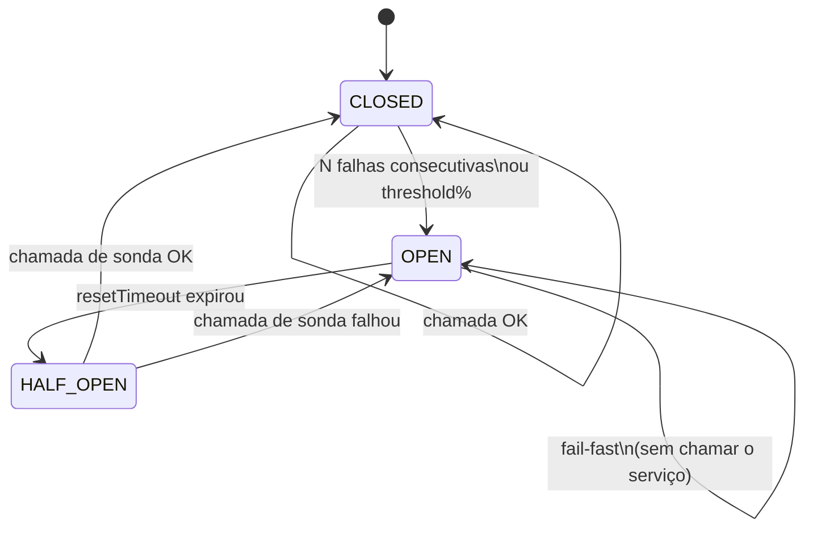

# Padrões de resiliência - retry, circuit breaker e bulkhead

> [!abstract] TL;DR
> Três padrões complementares protegem sistemas distribuídos contra falhas em cascata. **Retry com backoff exponencial + jitter** reintenta chamadas falhas com espera crescente e aleatoriedade — o jitter elimina o _thundering herd_, onde centenas de clientes reintentam ao mesmo tempo e derrubam o serviço que estava se recuperando.
>
> **Circuit breaker** implementa uma máquina de estados (closed → open → half-open): após N falhas consecutivas abre o circuito e falha rápido sem chamar o serviço, evitando desperdício de recursos; após um timeout entra em half-open para testar se o serviço voltou.
>
> **Bulkhead** isola domínios de falha com semáforos ou pools de concorrência — se o serviço A sobrecarregar seu slot, o serviço B continua operando normalmente no próprio slot. A biblioteca [`cockatiel`](https://github.com/connor4312/cockatiel) cobre os três padrões e permite compô-los com `Policy.wrap()`; [`opossum`](https://github.com/nodeshift/opossum) é especializado em circuit breaker com uma API orientada a eventos.
>
> Veja [[03-Dominios/Tecnologia/Node/Integrações/index|Integrações]] para o contexto completo do galho.

## Como funciona

### Máquina de estados do circuit breaker

O circuit breaker transita entre três estados:

```
CLOSED ──(N falhas consecutivas)──► OPEN
  ▲                                    │
  │                                    │
  │                             (resetTimeout)
  │                                    │
  └──(chamada ok em half-open)── HALF-OPEN
```

- **Closed**: estado normal; todas as chamadas passam. O breaker conta falhas.
- **Open**: o circuito está aberto; chamadas retornam imediatamente com erro (fail-fast) sem tocar o serviço downstream. Um timer (`resetTimeout`) conta o tempo de espera.
- **Half-open**: após o timer expirar, o breaker permite **uma** chamada de teste. Se ela tiver sucesso, volta para closed; se falhar, volta para open e reinicia o timer.

A transição closed → open é disparada quando a porcentagem de falhas em uma janela deslizante ultrapassa `errorThresholdPercentage`. Isso evita que uma única falha esporádica abra o circuito.

### Retry com backoff exponencial e jitter

O retry simples com intervalo fixo é perigoso: se 500 instâncias falharem ao mesmo tempo, todas retentarão no mesmo instante, criando um pico que derruba o serviço novamente (_thundering herd_).

O **backoff exponencial** aumenta o intervalo a cada tentativa: `delay = initialDelay * exponent^attempt`. O **jitter** adiciona aleatoriedade: `delay = random(0, initialDelay * exponent^attempt)`. Isso dispersa as retentativas ao longo do tempo e alivia a pressão sobre o serviço em recuperação.

O `cockatiel` expõe isso via `ExponentialBackoff` com as opções `initialDelay`, `maxDelay` e `exponent`. A condição de retry é configurada com `Policy.handleAll()` (qualquer erro/exceção) ou `Policy.handleWhenResult(fn)` (rejeitar resultados específicos, como status HTTP 503).

### Bulkhead com semáforo de concorrência

O bulkhead (antepara) separa recursos em compartimentos estanques. Implementado como semáforo: só `maxConcurrent` chamadas rodam em paralelo; até `maxQueue` chamadas aguardam na fila; o restante é rejeitado imediatamente com `BulkheadRejectedError`.

Sem bulkhead, um serviço lento pode esgotar todas as threads/event-loop slots disponíveis e derrubar funcionalidades não relacionadas. Com bulkhead, o serviço A tem seu próprio semáforo e o serviço B não é afetado pela lentidão de A.



### Timeout como quarta política de resiliência

Timeout é o padrão mais simples e o mais frequentemente esquecido. Uma chamada sem timeout pode ficar pendente indefinidamente, consumindo uma slot de concorrência (bulkhead) e eventualmente disparando falsos positivos no circuit breaker quando o timeout do framework finalmente mata a conexão — muitas vezes depois de 2 minutos ou mais.

O timeout deve ser configurado em três níveis distintos:

| Nível | O que configura | Ferramenta |
|---|---|---|
| **Conexão TCP** | Quanto tempo aguardar o handshake TCP | `undici connectTimeout`, `got timeout.connect` |
| **Primero byte** | Quanto tempo aguardar os headers da resposta | `undici headersTimeout`, `got timeout.response` |
| **Body completo** | Quanto tempo para receber o body inteiro | `undici bodyTimeout`, `got timeout.send` |
| **Operação total** | Deadline absoluto para toda a operação | `AbortSignal.timeout(ms)` |

Em `cockatiel`, o timeout é uma política separada: `timeout(ms, TimeoutStrategy.Cooperative)` usa um `AbortController` interno para sinalizar cancelamento, enquanto `TimeoutStrategy.Aggressive` lança imediatamente sem esperar a chamada cooperar. Sempre prefira `Cooperative` quando a função downstream respeita `AbortSignal`.

A relação entre timeout e retry é crítica: o timeout do `retry` deve ser **maior** que o timeout de cada tentativa individual, e o timeout total de toda a operação deve acomodar `maxAttempts * (callTimeout + maxDelay)`. Um timeout total de 5s com retry de 3 tentativas e 2s por chamada é matematicamente impossível de cumprir — a primeira tentativa já estoura o orçamento.

### O conceito de antifragilidade e o trade-off de cada padrão

Resiliência não é o mesmo que robustez. Um sistema robusto resiste a falhas; um sistema resiliente se recupera delas. Os três padrões têm compromissos distintos que devem ser balanceados:

- **Retry** aumenta a probabilidade de sucesso de chamadas individuais ao custo de latência adicional e possível carga duplicada no serviço downstream.
- **Circuit breaker** protege o serviço downstream e preserva recursos locais ao custo de falhas rápidas durante o período de recuperação — aceitável apenas se há fallback.
- **Bulkhead** preserva a disponibilidade de funcionalidades não relacionadas ao custo de rejeitar requisições válidas quando o compartimento está cheio — exige decisão de produto sobre o que rejeitar.

A composição `Policy.wrap(retry, circuitBreaker, bulkhead)` não é gratuita: cada camada adiciona overhead de CPU e lógica condicional por request. Em endpoints de ultra-baixa latência (< 1ms de processamento), o overhead da política pode ser relevante. Nesses casos, implemente as políticas apenas no caminho crítico (ex: chamadas a serviços externos) e deixe chamadas internas (banco local) sem o overhead completo.

## Snippets

### Snippet 1 — Retry com `cockatiel`

```typescript
import { retry, ExponentialBackoff, Policy } from 'cockatiel';

// Política de retry: até 5 tentativas com backoff exponencial + jitter
const retryPolicy = retry(Policy.handleAll(), {
  maxAttempts: 5,
  backoff: new ExponentialBackoff({
    initialDelay: 100,   // 100ms na primeira retentativa
    maxDelay: 30_000,    // nunca esperar mais de 30s
    exponent: 2,         // dobra a cada tentativa
  }),
});

// Executa uma chamada HTTP com retry automático
async function fetchWithRetry(url: string): Promise<Response> {
  return retryPolicy.execute(() => fetch(url));
}

// Uso: retry apenas em status 5xx (erros do servidor, não do cliente)
const retryOn5xx = retry(
  Policy.handleWhenResult((res) => res instanceof Response && res.status >= 500),
  { maxAttempts: 3, backoff: new ExponentialBackoff({ initialDelay: 200, maxDelay: 5_000 }) },
);

async function fetchApi(url: string): Promise<Response> {
  const response = await retryOn5xx.execute(() => fetch(url));
  return response;
}
```

### Snippet 2 — Circuit breaker com `opossum`

```typescript
import CircuitBreaker from 'opossum';

// Função que será protegida pelo circuit breaker
async function callPaymentService(orderId: string): Promise<{ status: string }> {
  const res = await fetch(`https://payments.example.com/orders/${orderId}`);
  if (!res.ok) throw new Error(`Payment service error: ${res.status}`);
  return res.json() as Promise<{ status: string }>;
}

const breaker = new CircuitBreaker(callPaymentService, {
  timeout: 3000,                   // 3s para considerar a chamada como falha
  errorThresholdPercentage: 50,    // abre se >= 50% das chamadas falharem
  resetTimeout: 10_000,            // 10s em open antes de tentar half-open
  volumeThreshold: 5,              // mínimo de chamadas para ativar o breaker
});

// Fallback executado quando o circuito está aberto
breaker.fallback((orderId: string) => ({
  status: 'pending',
  message: `Payment service unavailable for order ${orderId}`,
}));

// Monitoramento de estado
breaker.on('open', () => console.warn('[breaker] Payment service circuit OPEN'));
breaker.on('halfOpen', () => console.info('[breaker] Payment service circuit HALF-OPEN'));
breaker.on('close', () => console.info('[breaker] Payment service circuit CLOSED'));

// Chamada protegida
async function processOrder(orderId: string) {
  const result = await breaker.fire(orderId);
  return result;
}
```

### Snippet 3 — Bulkhead com `cockatiel`

```typescript
import { bulkhead, BulkheadRejectedError } from 'cockatiel';

// No máximo 10 chamadas simultâneas; fila de até 20; o resto é rejeitado
const paymentBulkhead = bulkhead(10, 20);
// Sem fila: rejeita imediatamente se já há 5 chamadas ativas
const criticalBulkhead = bulkhead(5, 0);

async function callExternalApi(id: string): Promise<string> {
  return `result-${id}`;
}

async function protectedCall(id: string): Promise<string | null> {
  try {
    // execute() envolve a chamada dentro do semáforo
    return await paymentBulkhead.execute(() => callExternalApi(id));
  } catch (err) {
    if (err instanceof BulkheadRejectedError) {
      console.warn(`[bulkhead] Request rejected for id=${id}: semaphore full`);
      return null;
    }
    throw err;
  }
}

// Demonstração: disparar 35 chamadas; 10 ativas + 20 na fila + 5 rejeitadas
async function demonstrateBulkhead() {
  const results = await Promise.allSettled(
    Array.from({ length: 35 }, (_, i) => protectedCall(String(i))),
  );
  const rejected = results.filter((r) => r.status === 'fulfilled' && r.value === null).length;
  console.info(`Rejected by bulkhead: ${rejected}`);
}

demonstrateBulkhead().catch(console.error);
```

### Snippet 4 — Composição de políticas com `cockatiel`

```typescript
import { retry, circuitBreaker, ConsecutiveBreaker, ExponentialBackoff, bulkhead, Policy } from 'cockatiel';

// 1. Retry: 4 tentativas com backoff exponencial
const retryPolicy = retry(Policy.handleAll(), {
  maxAttempts: 4,
  backoff: new ExponentialBackoff({ initialDelay: 150, maxDelay: 10_000 }),
});

// 2. Circuit breaker: abre após 3 falhas em 30s, aguarda 15s antes de half-open
const cbPolicy = circuitBreaker(Policy.handleAll(), {
  halfOpenAfter: 15_000,
  breaker: new ConsecutiveBreaker(3),
});

// 3. Bulkhead: 8 slots paralelos, fila de 16
const bhPolicy = bulkhead(8, 16);

// Composição: wrap aplica as políticas de fora para dentro
// ordem de execução: retry → circuitBreaker → bulkhead → chamada real
// retry é o mais externo porque deve envolver o circuitBreaker
const resilientPolicy = Policy.wrap(retryPolicy, cbPolicy, bhPolicy);

async function fetchData(endpoint: string): Promise<unknown> {
  const response = await resilientPolicy.execute(async () => {
    const res = await fetch(endpoint);
    if (!res.ok) throw new Error(`HTTP ${res.status}`);
    return res.json();
  });
  return response;
}

// Uso em produção
async function getUser(userId: string) {
  return fetchData(`https://api.example.com/users/${userId}`);
}
```

### Snippet 5 — Timeout com `AbortController`

```typescript
import { retry, ExponentialBackoff, Policy } from 'cockatiel';

// Timeout como política independente: cancela a chamada após N milissegundos
// Funciona com fetch, grpc, qualquer API que aceite AbortSignal

// Abordagem 1: AbortSignal.timeout (Node 18+, mais limpo)
async function fetchWithNativeTimeout(url: string, timeoutMs = 5000): Promise<unknown> {
  const signal = AbortSignal.timeout(timeoutMs);
  const res = await fetch(url, { signal });
  if (!res.ok) throw new Error(`HTTP ${res.status}`);
  return res.json();
}

// Abordagem 2: AbortController manual (compatível com Node 16+)
async function fetchWithManualTimeout(url: string, timeoutMs = 5000): Promise<unknown> {
  const controller = new AbortController();
  const timerId = setTimeout(() => controller.abort(new Error(`Timeout after ${timeoutMs}ms`)), timeoutMs);

  try {
    const res = await fetch(url, { signal: controller.signal });
    if (!res.ok) throw new Error(`HTTP ${res.status}`);
    return await res.json();
  } finally {
    clearTimeout(timerId); // sempre limpa o timer para evitar memory leak
  }
}

// Composição: timeout + retry via cockatiel
const retryWithTimeout = retry(Policy.handleAll(), {
  maxAttempts: 3,
  backoff: new ExponentialBackoff({ initialDelay: 100, maxDelay: 3000 }),
});

async function resilientFetch(url: string): Promise<unknown> {
  return retryWithTimeout.execute(() => fetchWithNativeTimeout(url, 4000));
}
```

## Casos práticos

### Cenário 1 — Checkout protegido com circuit breaker para o serviço de pagamentos

Um e-commerce processa 2.000 checkouts por minuto. O serviço de pagamentos (Stripe, PagSeguro) tem SLA de 99.5% — ou seja, pode ficar fora por até 2h/mês. Sem circuit breaker, quando o serviço de pagamentos cai, cada request de checkout espera 30s de timeout antes de falhar, esgotando as conexões disponíveis e derrubando o servidor inteiro (incluindo navegação e login). Com `opossum`, o breaker monitora a taxa de erro: após 50% de falhas em um volume mínimo de 5 chamadas, abre o circuito. O fallback retorna `{ status: 'pending', message: 'Pagamento em análise — você receberá e-mail de confirmação' }`. O checkout continua funcionando em modo degradado: o pedido é salvo com status `payment_pending`, uma BullMQ job é enfileirada para retentar o pagamento quando o circuito fechar. O evento `'open'` do breaker dispara um alerta no PagerDuty. Resultado: falha contida no domínio de pagamentos, sem derrubar navegação ou estoque.

### Cenário 2 — Pipeline de enriquecimento com bulkhead e retry isolando três APIs externas

Um serviço de CRM enriquece perfis de leads consultando três APIs: Clearbit (dados de empresa), Hunter.io (e-mail) e IPinfo (geolocalização). As três são chamadas em paralelo por lead. Sem bulkhead, se o Clearbit ficar lento (20s de response time), os slots de concorrência do Node ficam ocupados com chamadas Clearbit pendentes; Hunter.io e IPinfo — que respondem em 200ms — ficam aguardando. Com três bulkheads separados (`clearbitBulkhead(5)`, `hunterBulkhead(10)`, `ipinfoBulkhead(20)`), o Clearbit lento fica confinado nos seus 5 slots — Hunter e IPinfo continuam processando normalmente. O retry com `ExponentialBackoff` (3 tentativas, 200ms..1.6s) trata os erros 429 do rate limiting. A composição `Policy.wrap(retry, circuitBreaker, bulkhead)` garante que falhas sustentadas do Clearbit abram o circuito (fail-fast em vez de timeout), enquanto falhas pontuais são cobertas pelo retry.

## Armadilhas comuns

> [!danger] Retry sem jitter causa thundering herd
> Se todas as instâncias do serviço falharem ao mesmo tempo (ex: restart de um serviço downstream), o backoff exponencial sem jitter fará **todas** retentarem no exato mesmo instante. Resultado: pico de carga imediato que derruba o serviço que estava se recuperando. Use sempre `jitter: true` ou uma implementação manual com `Math.random()`.

> [!danger] Retry em operações não idempotentes causa duplicação de dados
> Nunca faça retry automático em `POST` sem um **idempotency key**. Se a requisição chegou ao servidor mas a resposta foi perdida na rede, o retry criará um segundo registro (pedido duplicado, cobrança duplicada). Use retry apenas em operações idempotentes (`GET`, `PUT`) ou em `POST` que aceitem `Idempotency-Key` no header.

> [!warning] Circuit breaker sem half-open nunca se recupera
> Um circuit breaker que só transita entre closed e open fica preso em open para sempre após um surto de falhas. O estado half-open é obrigatório: ele permite uma chamada de sonda após o `resetTimeout` para verificar se o serviço se recuperou. Certifique-se de configurar `resetTimeout` com um valor razoável (10–60s dependendo do SLA do serviço).

> [!warning] Bulkhead sem `maxQueue` deixa a fila crescer sem limite
> `bulkhead(10)` sem segundo argumento pode acumular milhares de requisições na fila se o serviço ficar lento, consumindo memória indefinidamente. Sempre defina `maxQueue` explicitamente. Para cenários de real-time onde requisições velhas são inúteis, use `bulkhead(N, 0)` para rejeitar imediatamente qualquer requisição além da capacidade ativa.

> [!warning] Não monitorar o estado do circuit breaker é falha silenciosa
> Um circuit breaker aberto retorna respostas degradadas (fallback) sem lançar exceção. Se você não monitora o evento `'open'`, pode ter o sistema operando em modo degradado por horas sem alertas. Registre logs/métricas nos eventos `open`, `halfOpen` e `close`. Integre com seu APM (Datadog, New Relic, OpenTelemetry) para criar alertas quando o circuito abrir.

### Snippet 6 — Monitoramento de circuit breaker com métricas Prometheus

```typescript
import CircuitBreaker from 'opossum';
import client from 'prom-client';

// Cria o circuit breaker
async function callExternalService(payload: unknown): Promise<unknown> {
  const res = await fetch('https://external.example.com/api', {
    method: 'POST',
    body: JSON.stringify(payload),
    headers: { 'Content-Type': 'application/json' },
    signal: AbortSignal.timeout(5_000),
  });
  if (!res.ok) throw new Error(`External service error: ${res.status}`);
  return res.json();
}

const breaker = new CircuitBreaker(callExternalService, {
  timeout: 5_000,
  errorThresholdPercentage: 50,
  resetTimeout: 15_000,
  volumeThreshold: 10,
});

// Métricas Prometheus
const breakerStateGauge = new client.Gauge({
  name: 'circuit_breaker_state',
  help: 'Estado do circuit breaker: 0=closed, 1=open, 2=half-open',
  labelNames: ['service'],
});

const breakerRequestsTotal = new client.Counter({
  name: 'circuit_breaker_requests_total',
  help: 'Total de requests por resultado do circuit breaker',
  labelNames: ['service', 'result'],
});

// Atualiza métricas nos eventos do circuit breaker
breaker.on('success', () => breakerRequestsTotal.inc({ service: 'external', result: 'success' }));
breaker.on('failure', () => breakerRequestsTotal.inc({ service: 'external', result: 'failure' }));
breaker.on('timeout', () => breakerRequestsTotal.inc({ service: 'external', result: 'timeout' }));
breaker.on('reject', () => breakerRequestsTotal.inc({ service: 'external', result: 'rejected' }));
breaker.on('fallback', () => breakerRequestsTotal.inc({ service: 'external', result: 'fallback' }));

breaker.on('open', () => {
  breakerStateGauge.set({ service: 'external' }, 1);
  console.error('[circuit-breaker] OPEN — external service failing');
});

breaker.on('halfOpen', () => {
  breakerStateGauge.set({ service: 'external' }, 2);
  console.info('[circuit-breaker] HALF-OPEN — probing recovery');
});

breaker.on('close', () => {
  breakerStateGauge.set({ service: 'external' }, 0);
  console.info('[circuit-breaker] CLOSED — external service recovered');
});

// Expõe métricas no endpoint /metrics (para Prometheus scrape)
// app.get('/metrics', async (req, res) => {
//   res.set('Content-Type', client.register.contentType);
//   res.end(await client.register.metrics());
// });
```

> [!danger] Retry em chamadas que alteraram estado remoto sem idempotency key
> Se o request chegou ao servidor e foi processado, mas a resposta de rede foi perdida, o cliente recebe um erro de timeout ou `ECONNRESET`. O retry vai reenviar a mesma chamada — mas o servidor já executou a operação. Sem `Idempotency-Key`, isso resulta em cobranças duplicadas, pedidos duplicados ou envios duplicados de e-mail. O padrão correto é: (1) gerar um UUID v4 antes de enviar; (2) enviar o header `Idempotency-Key: <uuid>` em todo `POST`/`PATCH` com retry; (3) o servidor armazena o par `(key, response)` com TTL de 24h e retorna o resultado cacheado em reenvios.

> [!warning] Circuit breaker com threshold muito baixo causa flapping
> Um `errorThresholdPercentage: 10` com `volumeThreshold: 5` em alta variância abre o circuito ao primeiro sinal de instabilidade. Em serviços com SLA de 99.5%, 0.5% de falha é esperado — o breaker não deve abrir para isso. Calibre os thresholds com base nos dados reais de SLA do serviço downstream: se o SLA é 99%, configure `errorThresholdPercentage: 30` e `volumeThreshold: 20` para só abrir em situações de degradação real.

## Comparação: cockatiel vs opossum vs implementação manual

| Critério | `cockatiel` | `opossum` | Implementação manual |
|---|---|---|---|
| Retry com backoff | Nativo (`ExponentialBackoff`) | Não tem | Trabalhoso e propenso a bug |
| Circuit breaker | Nativo (`circuitBreaker`) | Especialidade principal | Muito complexo de fazer certo |
| Bulkhead/semáforo | Nativo (`bulkhead`) | Não tem | Simples com `p-limit` |
| Composição de políticas | `Policy.wrap()` elegante | Não tem | Manual e frágil |
| Monitoramento/eventos | Eventos por política | Eventos ricos no CB | Você implementa tudo |
| Tamanho do bundle | ~15 KB | ~12 KB | 0 KB |
| API | Standalone functions + `Policy.wrap()` | Orientada a eventos | Qualquer coisa |
| Typescript | Excelente suporte | Tipos incluídos | Você define |
| Melhor para | Composição de múltiplas políticas | Somente circuit breaker robusto | Aprender ou caso muito específico |

## Em entrevista

**Q: What is the difference between a retry and a circuit breaker? When should you use each?**

Retry and circuit breaker are complementary patterns that operate at different timescales. Retry handles transient failures — short-lived issues like a brief network hiccup, a pod restart, or an occasional timeout — by re-executing the call after a delay. Circuit breaker handles sustained failures — when a downstream service is down for an extended period — by stopping all calls immediately rather than letting each one timeout.

The key insight is that retry alone is dangerous without a circuit breaker: if the downstream service is down for 5 minutes and you have 1000 requests per second, each retrying 3 times with a 2s delay, you'll generate an enormous load of failed requests that wastes threads, connections, and memory. The circuit breaker acts as a fuse: after N failures, it opens and all subsequent calls fail fast (microseconds instead of seconds), preserving system resources. Once the service recovers, the half-open state allows a probe request to confirm recovery before resuming normal traffic.

**Q: How does the bulkhead pattern isolate failures? Can you give a concrete example?**

Bulkhead is named after the watertight compartments in a ship's hull — if one compartment floods, the others remain dry and the ship stays afloat. In software, it means allocating separate resource pools (thread pools, connection pools, or semaphores) to different dependencies so that one misbehaving dependency cannot exhaust the shared pool and bring down unrelated functionality.

Consider a Node.js API that calls three services: User Service, Payment Service, and Notification Service. Without bulkhead, if Payment Service becomes slow (10s response time), concurrent requests accumulate in the event loop. With enough load, all available concurrency slots are occupied waiting for payment responses, and even fast requests to User Service start timing out. With bulkhead, Payment Service gets its own semaphore of 10 concurrent slots — when those are full, excess requests are rejected immediately with a clear error, while User Service and Notification Service continue operating normally with their own semaphores. The failure is contained to the payment domain.

**Q: Why is jitter essential in exponential backoff? What happens without it?**

Without jitter, exponential backoff creates a phenomenon called the thundering herd problem. Imagine 500 client instances all receive errors at the same time — a common scenario during a service restart or brief outage. All 500 clients schedule their first retry at exactly `initialDelay` milliseconds. This synchronized retry wave hits the recovering service all at once, potentially overwhelming it before it finishes starting up, causing another wave of failures and retries.

Jitter breaks this synchronization by randomizing each client's wait time. With full jitter, the delay becomes `random(0, initialDelay * 2^attempt)`, spreading retries across the entire backoff window. With 500 clients and a 1-second backoff window, retries arrive roughly uniformly at about 500/1000ms = 0.5 requests per millisecond — a gentle ramp that gives the service time to recover. AWS Engineering's 2015 blog post "Exponential Backoff And Jitter" demonstrated empirically that full jitter dramatically reduces both total wait time and load on the recovering service compared to fixed or unjittered backoff.

**Q: What is the correct order to compose retry, circuit breaker, and bulkhead? Why does order matter?**

The correct execution order from inside out is: **bulkhead → circuit breaker → retry**. In `cockatiel`'s `Policy.wrap()`, the outermost policy (first argument) wraps all others, so the call is: `Policy.wrap(retry, circuitBreaker, bulkhead)`.

Order matters because each policy has a different responsibility boundary. The bulkhead should be innermost (closest to the actual call) because it limits concurrent executions of the real operation — we want the bulkhead to count only actual in-flight requests, not retries-in-progress waiting at the circuit breaker. The circuit breaker wraps the bulkhead: when the circuit is open, it short-circuits before even acquiring a bulkhead slot, which is correct behavior. Retry is outermost because it needs to re-execute the entire pipeline (check circuit breaker state, acquire semaphore, make the call) on each attempt. If retry were inside the circuit breaker, a failed call would retry without checking whether the circuit has opened after the first failure, defeating the purpose of the circuit breaker entirely.

**Q: How do you distinguish between errors that should trigger a retry versus errors that should not?**

Not all errors are equal from a retry perspective. Retryable errors are those caused by transient conditions that are likely to resolve on their own: network timeouts (`ETIMEDOUT`, `ECONNRESET`), server-side overload responses (`503 Service Unavailable`, `504 Gateway Timeout`), and rate limiting (`429 Too Many Requests` with a `Retry-After` header). Non-retryable errors represent permanent failures or client mistakes: `400 Bad Request` (the payload is wrong and will always be wrong), `401 Unauthorized` (the token is invalid — retrying won't fix authentication), `403 Forbidden`, and `404 Not Found`. Business logic errors — invalid data, validation failures — are also non-retryable. The `cockatiel` `Policy.handleWhenResult()` accepts a predicate that classifies responses: `(res) => res instanceof Response && [429, 503, 504].includes(res.status)` retries only on specific status codes. For `429`, you should additionally read the `Retry-After` header and use it as the minimum delay for the next attempt, overriding the default backoff calculation.

**Q: How would you test that your circuit breaker configuration is correct?**

Testing circuit breakers requires simulating the three state transitions: closed → open, open → half-open, and half-open → closed or open. The fundamental approach is to stub or mock the function wrapped by the circuit breaker and control what it returns. For the closed → open transition, inject enough failures to exceed `volumeThreshold` and `errorThresholdPercentage` and assert that the next call returns the fallback value. For the open state, advance the test clock (using fake timers from Vitest/Jest) past `resetTimeout` and assert the circuit moves to half-open. For recovery, make the probe call succeed and verify the circuit moves back to closed. The event emitter pattern in `opossum` makes this testable: subscribe to `'open'`, `'halfOpen'`, and `'close'` events and assert they fire in the correct sequence. An integration test that uses the real `fetch` against a local mock server (using `msw` in Node mode) validates the full stack without network risk.

## Vocabulário

| Termo | Definição |
|---|---|
| **retry** | Padrão que reexecuta uma operação falha após um intervalo de espera, com limite de tentativas configurável |
| **exponential backoff** | Estratégia de espera onde o intervalo cresce exponencialmente a cada tentativa: `delay = base * exponent^attempt` |
| **jitter** | Aleatoriedade adicionada ao backoff para dessincronizar retentativas de múltiplos clientes e evitar o thundering herd |
| **thundering herd** | Pico de carga causado por múltiplos clientes retentando simultaneamente, potencialmente derrubando o serviço em recuperação |
| **circuit breaker** | Padrão que monitora falhas e abre o circuito (fail-fast) quando a taxa de falhas excede um threshold, protegendo o serviço downstream |
| **closed state** | Estado normal do circuit breaker; todas as chamadas passam; falhas são contadas |
| **open state** | Estado de falha do circuit breaker; chamadas retornam erro imediatamente sem tocar o serviço downstream |
| **half-open state** | Estado de sonda do circuit breaker; uma chamada de teste é permitida para verificar se o serviço se recuperou |
| **fallback** | Resposta alternativa executada quando o circuito está aberto ou quando todas as tentativas de retry falharam |
| **bulkhead** | Padrão que isola recursos em compartimentos separados (semáforos/pools), evitando que a falha de um serviço afete outros |
| **semaphore** | Primitiva de controle de concorrência que limita o número de execuções simultâneas de uma operação |
| **concurrency limit** | Número máximo de chamadas paralelas permitidas por um bulkhead antes de começar a enfileirar ou rejeitar requisições |
| **idempotent** | Operação que produz o mesmo resultado independente de quantas vezes é executada — segura para retry automático |
| **resetTimeout** | Tempo que o circuit breaker permanece em estado open antes de transitar para half-open e tentar recuperação |
| **errorThresholdPercentage** | Porcentagem de falhas em uma janela de tempo que dispara a abertura do circuit breaker |
| **volumeThreshold** | Número mínimo de chamadas que devem ocorrer em uma janela antes de o circuit breaker começar a avaliar o threshold de erro — evita abrir o circuito por ruído em baixo volume |
| **idempotency key** | Identificador único (UUID) enviado no header da requisição para permitir que o servidor retorne o resultado cacheado em reenvios, evitando efeitos colaterais duplicados em operações não-idempotentes |
| **fail-fast** | Comportamento do circuit breaker aberto: retornar erro imediatamente (microssegundos) sem tentar a chamada ao serviço downstream, preservando recursos locais e aliviando o serviço em recuperação |
| **sliding window** | Janela temporal deslizante (últimos N segundos ou últimas N chamadas) usada pelo circuit breaker para calcular a taxa de erro; mais precisa que uma janela fixa para detectar degradação em tempo real |
| **cooperative timeout** | Estratégia de timeout que sinaliza cancelamento via `AbortSignal` e aguarda que a operação coopere; contrasta com timeout agressivo que lança imediatamente sem aguardar limpeza de recursos |
| **p-limit** | Biblioteca minimalista de controle de concorrência (`npm install p-limit`) que limita o número de Promises em execução simultânea — alternativa mais simples ao `bulkhead` do cockatiel para cenários sem necessidade de fila configurável |

## Observabilidade dos padrões de resiliência

Resiliência sem observabilidade é cega. Os três padrões expõem pontos de instrumentação distintos:

| Padrão | Evento-chave | Métrica recomendada |
|---|---|---|
| Retry | `beforeRetry` | `retries_total{service, attempt, status_code}` |
| Circuit breaker | `open`, `halfOpen`, `close` | `circuit_breaker_state{service}` (gauge: 0/1/2) |
| Bulkhead | `BulkheadRejectedError` | `bulkhead_rejected_total{service}` |
| Timeout | `AbortError` | `timeout_total{service, phase}` |

Um dashboard de resiliência útil mostra: (1) taxa de retry por serviço externo — alto `retries_total` indica instabilidade sistêmica; (2) frequência de abertura de circuito — `circuit_breaker_state` como série temporal revela quando e por quanto tempo o circuito ficou aberto; (3) taxa de rejeição de bulkhead — picos em `bulkhead_rejected_total` indicam que a capacidade está subdimensionada ou que o serviço downstream está degradando. Combine essas métricas com traces distribuídos (OpenTelemetry) para correlacionar abertura de circuito com latência de endpoints específicos e identificar a causa raiz de cascata de falhas.

## O que vem a seguir

- **[[03-Dominios/Tecnologia/Node/Integrações/10 - Cheatsheet e decision tree de integrações|Cheatsheet e decision tree]]** — os padrões de resiliência são a última peça antes do cheatsheet final: o decision tree consolida quando combinar retry, circuit breaker e bulkhead com cada protocolo estudado no galho.
- **OpenTelemetry + traces de resiliência** — instrumentar `cockatiel` e `opossum` com spans OpenTelemetry para rastrear quando circuitos abrem, quantas tentativas de retry ocorrem por operação e qual a latência de cada política — visibilidade essencial em produção.
- **Chaos Engineering com Chaos Toolkit** — explorar como injetar falhas deliberadas (latência, falhas de rede, crashes de pod) para validar que os padrões de resiliência se comportam como esperado sob condições controladas antes de chegarem em produção.

## Veja também

- [[03-Dominios/Tecnologia/Node/Integrações/index|Integrações]]
- [[Node.js]]
- [[03-Dominios/Tecnologia/Node/Integrações/08 - Clientes HTTP - fetch, axios, got e undici]] — os clientes HTTP são onde os padrões de resiliência se aplicam na prática; retry, circuit breaker e bulkhead envolvem chamadas `fetch`, `axios`, `got` e `undici`
- [[03-Dominios/Tecnologia/Node/Integrações/03 - BullMQ - filas de tarefas]] — o retry do BullMQ cobre a camada de job; para chamadas a APIs externas dentro do worker, use cockatiel/opossum
- [cockatiel — documentação e exemplos](https://github.com/connor4312/cockatiel)
- [opossum — documentação oficial](https://nodeshift.dev/opossum/)
- [AWS Engineering: Exponential Backoff And Jitter](https://aws.amazon.com/blogs/architecture/exponential-backoff-and-jitter/)
- [Microsoft Cloud Design Patterns: Retry](https://learn.microsoft.com/en-us/azure/architecture/patterns/retry)
- [Martin Fowler: Circuit Breaker](https://martinfowler.com/bliki/CircuitBreaker.html)
