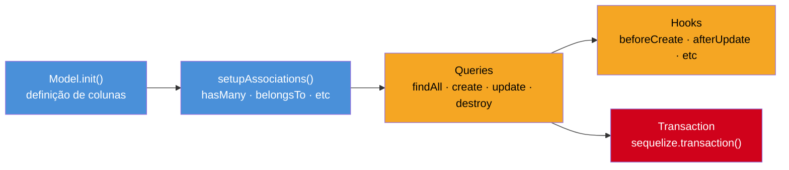

# Sequelize - queries e associações

> [!abstract] TL;DR
> O Sequelize v7 é o ORM mais antigo do ecossistema Node.js — battle-tested desde 2011 e com suporte TypeScript melhorado na versão 7 via decorators embutidos em `@sequelize/core/decorators-legacy` e tipos nativos. O modelo de definição usa classes que estendem `Model` (API nativa) ou decorators embutidos via `@sequelize/core/decorators-legacy`; associações são declaradas com `HasMany`, `BelongsTo`, `HasOne` e `BelongsToMany`. Eager loading com `include` é a solução para evitar N+1 queries — passar `required: false` controla se o join é LEFT ou INNER, e aninhar `include` em mais de 3 níveis é sinal de problema de modelagem. Em 2026, o Sequelize ainda é relevante para projetos legacy e equipes que já dominam sua API, mas Prisma e Drizzle são preferidos para projetos novos pela DX superior e melhor type safety.

## Ciclo de vida de um Model Sequelize



## O que é

O Sequelize é o ORM mais antigo do ecossistema [[Node.js]], lançado em 2011 quando callbacks eram o padrão absoluto. Ao longo de mais de uma década evoluiu por Promises, async/await e, na versão 7 (2025), chegou a um suporte TypeScript muito mais robusto — com tipos embutidos sem necessidade de `@types/sequelize` e remoção de métodos deprecated que acumulavam desde a era legada.

Suporta os principais bancos de dados relacionais:

- **PostgreSQL** (dialeto mais completo, incluindo `JSONB`, arrays, full-text search)
- **MySQL** e **MariaDB**
- **SQLite** (ótimo para testes e desenvolvimento local)
- **Microsoft SQL Server** (diferencial em relação a Drizzle e Prisma, que têm suporte mais limitado)

O núcleo do Sequelize é baseado em modelos: classes TypeScript que mapeiam tabelas. A partir desses modelos, o ORM gera SQL para todas as operações CRUD, gerencia pool de conexões e suporta transações.

---

## Como funciona

### Definição de models

Há dois estilos de definição de modelos no ecossistema Sequelize em 2026:

**Estilo 1 — API nativa do Sequelize v7** (sem dependência extra):

```typescript
// models/user.ts — Sequelize v7 nativo
import {
  DataTypes,
  Model,
  InferAttributes,
  InferCreationAttributes,
  CreationOptional,
  NonAttribute,
} from '@sequelize/core';
import { sequelize } from '../database';
import type { Post } from './post';

class User extends Model<
  InferAttributes<User, { omit: 'posts' }>,
  InferCreationAttributes<User, { omit: 'posts' }>
> {
  declare id: CreationOptional<number>;
  declare name: string;
  declare email: string;
  declare passwordHash: string;
  declare role: 'admin' | 'user';
  declare createdAt: CreationOptional<Date>;
  declare updatedAt: CreationOptional<Date>;

  // Associação — NonAttribute evita que apareça nos InferAttributes
  declare posts?: NonAttribute<Post[]>;
}

User.init(
  {
    id: {
      type: DataTypes.INTEGER.UNSIGNED,
      autoIncrement: true,
      primaryKey: true,
    },
    name: {
      type: DataTypes.STRING(100),
      allowNull: false,
      validate: {
        notEmpty: true,
        len: [2, 100],
      },
    },
    email: {
      type: DataTypes.STRING,
      allowNull: false,
      unique: true,
      validate: {
        isEmail: true,
      },
    },
    passwordHash: {
      type: DataTypes.STRING,
      allowNull: false,
    },
    role: {
      type: DataTypes.ENUM('admin', 'user'),
      defaultValue: 'user',
    },
    createdAt: DataTypes.DATE,
    updatedAt: DataTypes.DATE,
  },
  {
    sequelize,
    tableName: 'users',
    modelName: 'User',
  }
);

export { User };
```

**Estilo 2 — decorators embutidos do v7** (via `@sequelize/core/decorators-legacy`, mais próximo do TypeORM):

```typescript
// models/user.ts — Sequelize v7 com built-in decorators
import {
  Table,
  Attribute,
  NotNull,
  HasMany,
  Default,
  CreatedAt,
  UpdatedAt,
  PrimaryKey,
  AutoIncrement,
} from '@sequelize/core/decorators-legacy';
import { DataTypes, Model } from '@sequelize/core';
import { Post } from './post';

@Table({ tableName: 'users', timestamps: true })
export class User extends Model {
  @PrimaryKey
  @AutoIncrement
  @Attribute(DataTypes.INTEGER)
  declare id: number;

  @NotNull
  @Attribute(DataTypes.STRING(100))
  declare name: string;

  @NotNull
  @Attribute(DataTypes.STRING)
  declare email: string;

  @NotNull
  @Attribute(DataTypes.STRING)
  declare passwordHash: string;

  @Default('user')
  @Attribute(DataTypes.ENUM('admin', 'user'))
  declare role: 'admin' | 'user';

  // Metadados extras em JSONB — útil no PostgreSQL
  @Attribute(DataTypes.JSONB)
  declare metadata: Record<string, unknown> | null;

  @HasMany(() => Post, 'userId')
  declare posts: Post[];

  @CreatedAt
  declare createdAt: Date;

  @UpdatedAt
  declare updatedAt: Date;
}
```

**Tipos de coluna mais usados:**

| `DataTypes` | PostgreSQL real | Uso típico |
|-------------|-----------------|------------|
| `STRING(n)` | `VARCHAR(n)` | Texto curto |
| `TEXT` | `TEXT` | Texto longo |
| `INTEGER` | `INTEGER` | Número inteiro |
| `FLOAT` | `FLOAT8` | Ponto flutuante |
| `DECIMAL(p,s)` | `NUMERIC(p,s)` | Valores monetários |
| `BOOLEAN` | `BOOLEAN` | true/false |
| `DATE` | `TIMESTAMPTZ` | Data + hora com fuso |
| `DATEONLY` | `DATE` | Só data |
| `JSONB` | `JSONB` | Objeto JSON indexável |
| `UUID` | `UUID` | Identificador único |
| `ARRAY(T)` | `T[]` | Array nativo do Postgres |
| `ENUM(...)` | `ENUM` | Conjunto fixo de valores |

---

### Associações (relacionamentos)

O Sequelize usa quatro tipos de associação para mapear relacionamentos entre tabelas:

```typescript
// associations/index.ts — configuração central das associações
import { User } from '../models/user';
import { Post } from '../models/post';
import { Tag } from '../models/tag';
import { PostTag } from '../models/post-tag';
import { Profile } from '../models/profile';

export function setupAssociations(): void {
  // 1:1 — User tem exatamente um Profile
  User.hasOne(Profile, { foreignKey: 'userId', as: 'profile' });
  Profile.belongsTo(User, { foreignKey: 'userId', as: 'user' });

  // 1:N — User tem muitos Posts
  User.hasMany(Post, { foreignKey: 'authorId', as: 'posts' });
  Post.belongsTo(User, { foreignKey: 'authorId', as: 'author' });

  // N:M — Post tem muitas Tags (via tabela pivot PostTag)
  Post.belongsToMany(Tag, {
    through: PostTag,
    foreignKey: 'postId',
    otherKey: 'tagId',
    as: 'tags',
  });
  Tag.belongsToMany(Post, {
    through: PostTag,
    foreignKey: 'tagId',
    otherKey: 'postId',
    as: 'posts',
  });
}
```

**Regra importante:** associações são sempre declaradas **em pares** — `HasMany` de um lado e `BelongsTo` do outro. Omitir um lado não gera erro imediato mas causa problemas em `include`.

**Associações polimórficas** — o Sequelize não as suporta nativamente de forma elegante. A workaround usual é usar uma coluna `resourceType` + `resourceId`, mas isso quebra a integridade referencial no banco. Em 2026, se você precisa de polimorfismo, TypeORM ou uma tabela pivot explícita são alternativas mais limpas. **Evite** a abordagem polimórfica no Sequelize para código novo.

---

### Queries CRUD

```typescript
// queries/user-queries.ts
import { Op } from '@sequelize/core';
import { User } from '../models/user';
import { Post } from '../models/post';

// ── LEITURA ──────────────────────────────────────────────────────────────────

// Buscar todos (com filtro, ordenação e paginação)
const users = await User.findAll({
  where: {
    role: 'user',
    createdAt: { [Op.gte]: new Date('2025-01-01') },
  },
  order: [['name', 'ASC']],
  limit: 20,
  offset: 0,
  attributes: ['id', 'name', 'email'], // SELECT parcial
});

// Buscar um pelo PK
const user = await User.findByPk(42);

// Buscar um com condição
const admin = await User.findOne({
  where: { email: 'admin@example.com', role: 'admin' },
});

// Buscar ou criar (retorna [instância, booleano criado])
const [newUser, created] = await User.findOrCreate({
  where: { email: 'novo@example.com' },
  defaults: { name: 'Novo Usuário', passwordHash: '...', role: 'user' },
});

// ── ESCRITA ───────────────────────────────────────────────────────────────────

// Criar
const createdUser = await User.create({
  name: 'Maria',
  email: 'maria@example.com',
  passwordHash: 'hashed',
  role: 'user',
});

// Atualizar (retorna [linhasAfetadas, instânciasAtualizadas])
const [count] = await User.update(
  { role: 'admin' },
  { where: { id: 42 } }
);

// Deletar
const deletedCount = await User.destroy({ where: { id: 42 } });

// Upsert — insert ou update se já existir (baseado em unique constraints)
const [instance, wasCreated] = await User.upsert({
  email: 'maria@example.com',
  name: 'Maria Atualizada',
  passwordHash: 'novo-hash',
  role: 'user',
});
```

**Operadores (`Op`) mais usados:**

| Operador | SQL equivalente | Exemplo |
|----------|-----------------|---------|
| `Op.eq` | `= value` | `{ age: { [Op.eq]: 18 } }` |
| `Op.ne` | `!= value` | `{ status: { [Op.ne]: 'deleted' } }` |
| `Op.gt` / `Op.gte` | `> / >=` | `{ score: { [Op.gte]: 90 } }` |
| `Op.lt` / `Op.lte` | `< / <=` | `{ price: { [Op.lte]: 100 } }` |
| `Op.like` | `LIKE 'pattern'` | `{ name: { [Op.like]: 'Jo%' } }` |
| `Op.iLike` | `ILIKE` (Postgres) | `{ name: { [Op.iLike]: '%jose%' } }` |
| `Op.in` | `IN (...)` | `{ id: { [Op.in]: [1, 2, 3] } }` |
| `Op.notIn` | `NOT IN (...)` | `{ status: { [Op.notIn]: ['deleted'] } }` |
| `Op.between` | `BETWEEN a AND b` | `{ age: { [Op.between]: [18, 65] } }` |
| `Op.or` | `OR` | `{ [Op.or]: [{ a: 1 }, { b: 2 }] }` |
| `Op.and` | `AND` | `{ [Op.and]: [{ a: 1 }, { b: 2 }] }` |

---

### Eager loading e include

Eager loading é a técnica de carregar modelos associados junto com a query principal, evitando N+1 queries. No Sequelize, usa-se a opção `include`.

```typescript
// eager-loading/post-queries.ts
import { Op } from '@sequelize/core';
import { Post } from '../models/post';
import { User } from '../models/user';
import { Tag } from '../models/tag';
import { Comment } from '../models/comment';

// Básico: trazer posts com seus autores (LEFT JOIN)
const posts = await Post.findAll({
  include: [
    {
      model: User,
      as: 'author',
      attributes: ['id', 'name', 'email'], // evita trazer passwordHash etc.
    },
  ],
  order: [['createdAt', 'DESC']],
  limit: 10,
});

// Intermediário: filtrar posts que tenham comentários (INNER JOIN implícito)
const postsWithComments = await Post.findAll({
  include: [
    {
      model: Comment,
      as: 'comments',
      required: true,        // ← true = INNER JOIN, false = LEFT JOIN (padrão)
      where: { approved: true },
      attributes: ['id', 'body'],
    },
  ],
});

// Avançado: include aninhado (3 níveis — limite recomendado)
const richPosts = await Post.findAll({
  include: [
    {
      model: User,
      as: 'author',
      attributes: ['id', 'name'],
    },
    {
      model: Tag,
      as: 'tags',
      through: { attributes: [] }, // omite colunas da tabela pivot
      where: { active: true },
      required: false,             // LEFT JOIN — posts sem tags também aparecem
    },
    {
      model: Comment,
      as: 'comments',
      required: false,
      include: [
        {
          model: User,
          as: 'author',
          attributes: ['id', 'name'],
        },
      ],
    },
  ],
});
```

**`required: false` vs `required: true`:**
- `required: false` → `LEFT JOIN` — o registro pai aparece mesmo sem filhos correspondentes
- `required: true` → `INNER JOIN` — só retorna pais que tenham filhos que satisfaçam o filtro

Omitir `required` quando há `where` no `include` gera um INNER JOIN implícito — esse é um dos bugs mais silenciosos do Sequelize (ver [[#Armadilhas comuns]]).

**Performance com `include` profundo:** 3+ níveis de `include` geram JOINs em cascata que podem causar produto cartesiano no resultado. Para listas grandes, prefira duas queries separadas e combine em memória, ou use subqueries com `{ separate: true }`.

Para o problema de N+1 e quando usar DataLoader como alternativa, veja [[06 - N+1 queries - detecção e DataLoader]].

---

### Transações

O Sequelize oferece dois modos de transação:

```typescript
// transactions/managed-transaction.ts
import { sequelize } from '../database';
import { User } from '../models/user';
import { Account } from '../models/account';

// Transação GERENCIADA (managed): commit/rollback automático
// Recomendado para a maioria dos casos
async function transferFunds(
  fromUserId: number,
  toUserId: number,
  amount: number
): Promise<void> {
  await sequelize.transaction(async (t) => {
    // Todas as operações recebem { transaction: t }
    const fromAccount = await Account.findOne({
      where: { userId: fromUserId },
      transaction: t,
      lock: t.LOCK.UPDATE, // SELECT FOR UPDATE
    });

    const toAccount = await Account.findOne({
      where: { userId: toUserId },
      transaction: t,
    });

    if (!fromAccount || !toAccount) throw new Error('Account not found');
    if (fromAccount.balance < amount) throw new Error('Insufficient funds');

    await fromAccount.decrement('balance', { by: amount, transaction: t });
    await toAccount.increment('balance', { by: amount, transaction: t });
    // Se qualquer linha acima lançar erro → rollback automático
  });
  // Se chegou aqui → commit automático
}

// Transação NÃO GERENCIADA (unmanaged): commit/rollback manual
// Use quando precisar de controle granular (ex: savepoints)
async function batchCreateUsers(users: Array<{ name: string; email: string }>) {
  const t = await sequelize.startUnmanagedTransaction();
  try {
    const created = await User.bulkCreate(users, { transaction: t });
    await t.commit();
    return created;
  } catch (error) {
    await t.rollback();
    throw error;
  }
}
```

Para patterns avançados de transação, isolamento e integração com filas, veja [[08 - Transações - gerenciamento manual vs automático]].

---

### Hooks e lifecycle

Hooks são callbacks executados antes ou depois de eventos no ciclo de vida de uma instância. São úteis para lógica transversal sem poluir o código de negócio:

> [!warning] Hooks em Sequelize v7
> Os métodos estáticos `User.beforeCreate(...)`, `User.afterCreate(...)` etc. estão **deprecated** no Sequelize v7. A forma preferida é declarar os hooks na opção `hooks` dentro de `Model.init()`:
>
> ```typescript
> // v7: hooks definidos no Model.init()
> User.init({ /* ... colunas */ }, {
>   sequelize,
>   hooks: {
>     beforeCreate: async (user) => {
>       if (user.password) {
>         user.password = await bcrypt.hash(user.password, 10);
>       }
>     },
>   },
> });
> ```
>
> O exemplo abaixo usa a API legada (ainda funcional em v7, mas que será removida em versões futuras).

```typescript
// models/user.ts — adicionando hooks ao modelo User
import bcrypt from 'bcryptjs';
import { User } from './user';
import { AuditLog } from './audit-log';

// Hash de senha antes de criar ou atualizar
User.beforeCreate(async (user) => {
  if (user.passwordHash) {
    user.passwordHash = await bcrypt.hash(user.passwordHash, 12);
  }
});

User.beforeUpdate(async (user) => {
  if (user.changed('passwordHash') && user.passwordHash) {
    user.passwordHash = await bcrypt.hash(user.passwordHash, 12);
  }
});

// Audit log após operações críticas
User.afterCreate(async (user, options) => {
  await AuditLog.create(
    {
      action: 'user.created',
      resourceId: user.id,
      resourceType: 'User',
      meta: { email: user.email },
    },
    { transaction: options.transaction } // ← IMPORTANTE: propagar transação
  );
});

User.beforeDestroy(async (user) => {
  // Soft-delete: arquivar dados antes de remover
  await AuditLog.create({
    action: 'user.deleted',
    resourceId: user.id,
    resourceType: 'User',
    meta: { email: user.email },
  });
});
```

**Hooks disponíveis:**

| Evento | Antes | Depois |
|--------|-------|--------|
| Criar | `beforeCreate`, `beforeBulkCreate` | `afterCreate`, `afterBulkCreate` |
| Atualizar | `beforeUpdate`, `beforeBulkUpdate` | `afterUpdate`, `afterBulkUpdate` |
| Deletar | `beforeDestroy`, `beforeBulkDestroy` | `afterDestroy`, `afterBulkDestroy` |
| Validar | `beforeValidate` | `afterValidate` |
| Salvar | `beforeSave` | `afterSave` |

> [!warning] Hooks e transações
> Sempre propague a `options.transaction` para operações dentro de hooks. Se o hook criar um registro sem a transação, a operação não participa do rollback e você terá dados inconsistentes no banco mesmo após falha.

---

## Quando usar

O Sequelize ainda faz sentido em cenários específicos:

- **Projetos legacy com Sequelize v5/v6**: migrar para outro ORM tem custo alto (reescrever modelos, queries, migrations, testes) sem benefício claro para código que já funciona. Atualizar para v7 é viável e incremental.
- **Equipes que já dominam a API**: se o time conhece `findAll`, `include`, `Op` e hooks, o custo de troca para Prisma ou Drizzle inclui onboarding real.
- **Suporte a MSSQL como requisito**: o Drizzle tem suporte limitado a SQL Server, e o Prisma tem caveats em features avançadas. O Sequelize é a opção mais madura para Microsoft SQL Server no ecossistema Node.
- **Migração gradual impossível**: se o projeto não pode migrar de ORM de uma vez, o Sequelize v7 permite convivência com código legado.

**Quando não usar:**
- Projeto novo com equipe sem experiência prévia em Sequelize: prefira Prisma (DX superior) ou Drizzle (performance e type safety)
- Edge runtimes (Cloudflare Workers, Vercel Edge): o Sequelize não suporta — use Drizzle ou Prisma Accelerate
- Times que precisam de type safety rigoroso nas queries sem overhead de configuração

---

## Casos práticos

### Cenário A — Migração de modelo v6 para v7 com TypeScript estrito

API legada com Sequelize v6 precisa de melhor type safety. O time quer pegar erros de schema em build time sem reescrever todas as queries.

```typescript
// src/models/order.ts — Sequelize v7 com tipos nativos
import {
  DataTypes,
  Model,
  InferAttributes,
  InferCreationAttributes,
  CreationOptional,
  NonAttribute,
  Op,
} from '@sequelize/core';
import { sequelize } from '../database';
import type { OrderItem } from './order-item';

class Order extends Model<
  InferAttributes<Order, { omit: 'items' }>,
  InferCreationAttributes<Order, { omit: 'items' }>
> {
  declare id: CreationOptional<number>;
  declare userId: number;
  declare status: 'pending' | 'processing' | 'shipped' | 'delivered' | 'cancelled';
  declare totalAmount: number;
  declare createdAt: CreationOptional<Date>;
  declare updatedAt: CreationOptional<Date>;

  declare items?: NonAttribute<OrderItem[]>;
}

Order.init(
  {
    id: { type: DataTypes.INTEGER.UNSIGNED, autoIncrement: true, primaryKey: true },
    userId: { type: DataTypes.INTEGER.UNSIGNED, allowNull: false },
    status: {
      type: DataTypes.ENUM('pending', 'processing', 'shipped', 'delivered', 'cancelled'),
      defaultValue: 'pending',
    },
    totalAmount: {
      type: DataTypes.DECIMAL(10, 2),
      allowNull: false,
      validate: { min: 0 },
    },
    createdAt: DataTypes.DATE,
    updatedAt: DataTypes.DATE,
  },
  { sequelize, tableName: 'orders', modelName: 'Order' }
);

// Uso — tipo inferido automaticamente; TypeScript rejeita campos inválidos
const pedidosPendentes = await Order.findAll({
  where: {
    status: 'pending',
    createdAt: { [Op.lt]: new Date(Date.now() - 7 * 24 * 60 * 60 * 1000) },
  },
  order: [['createdAt', 'ASC']],
  limit: 50,
});
// pedidosPendentes[0].status → 'pending' | 'processing' | ... (tipado!)
```

---

### Cenário B — Relatório com associações em 3 níveis e controle de N+1

API de e-commerce precisa gerar relatório de pedidos com itens e produto de cada item. O desafio é evitar N+1 sem explodir a memória com dados desnecessários.

```typescript
// src/reports/order-report.ts
import { Order } from '../models/order';
import { OrderItem } from '../models/order-item';
import { Product } from '../models/product';
import { User } from '../models/user';

interface OrderReportRow {
  orderId: number;
  customerName: string;
  productName: string;
  quantity: number;
  unitPrice: number;
  lineTotal: number;
}

async function getOrderReport(startDate: Date, endDate: Date): Promise<OrderReportRow[]> {
  // include em 3 níveis — 3 queries otimizadas, sem N+1
  const orders = await Order.findAll({
    where: {
      status: 'delivered',
      createdAt: { [Op.between]: [startDate, endDate] },
    },
    attributes: ['id'],                    // evita colunas desnecessárias de Order
    include: [
      {
        model: User,
        as: 'customer',
        attributes: ['id', 'name'],        // só o que o relatório precisa
        required: true,                    // INNER JOIN — exclui pedidos sem usuário
      },
      {
        model: OrderItem,
        as: 'items',
        attributes: ['id', 'quantity', 'unitPrice'],
        required: true,
        include: [
          {
            model: Product,
            as: 'product',
            attributes: ['id', 'name'],
          },
        ],
      },
    ],
    order: [['createdAt', 'DESC']],
    limit: 500,
    subQuery: false, // evita subquery desnecessária com include + limit
  });

  // Flatten para linhas do relatório
  return orders.flatMap((order) =>
    order.items!.map((item) => ({
      orderId: order.id,
      customerName: order.customer!.name,
      productName: item.product!.name,
      quantity: item.quantity,
      unitPrice: Number(item.unitPrice),
      lineTotal: item.quantity * Number(item.unitPrice),
    }))
  );
}
```

---

## Armadilhas comuns

> [!warning] Armadilha 1 — Lazy loading acidental (N+1)
> O Sequelize **não faz lazy loading automático** como alguns ORMs — mas o padrão de buscar instâncias e depois acessar associações em loop gera N+1 manualmente: cada chamada a `getAuthor()` dentro de um `for` dispara uma nova query SELECT individual contra o banco.

```typescript
// ❌ ERRADO — N+1: 1 query para posts + N queries para cada autor
const posts = await Post.findAll({ limit: 50 });

for (const post of posts) {
  // Cada chamada a getAuthor() dispara uma nova query SELECT
  const author = await post.getAuthor();
  console.log(`${post.title} — ${author.name}`);
}
```

```typescript
// ✅ CORRETO — eager loading: 1 query com JOIN (ou 2 queries otimizadas)
const posts = await Post.findAll({
  limit: 50,
  include: [{ model: User, as: 'author', attributes: ['id', 'name'] }],
});

for (const post of posts) {
  // post.author já está carregado, sem queries adicionais
  console.log(`${post.title} — ${post.author.name}`);
}
```

> [!warning] Armadilha 2 — `include` + `where` sem `required: false` gerando INNER JOIN silencioso
> Quando você adiciona um `where` dentro de um `include` sem declarar `required: false` explicitamente, o Sequelize gera um INNER JOIN implícito — filtrando registros pai que não tenham filhos correspondentes. O comportamento muda silenciosamente dependendo da presença do `where`, o que causa bugs difíceis de rastrear em produção.

```typescript
// ❌ ERRADO — retorna só posts que TÊM comentários aprovados
// (INNER JOIN implícito quando há `where` no include)
const posts = await Post.findAll({
  include: [
    {
      model: Comment,
      as: 'comments',
      where: { approved: true }, // ← gera INNER JOIN sem required explícito
    },
  ],
});
```

```typescript
// ✅ CORRETO — retorna todos os posts, com ou sem comentários aprovados
const posts = await Post.findAll({
  include: [
    {
      model: Comment,
      as: 'comments',
      where: { approved: true },
      required: false, // ← LEFT JOIN explícito
    },
  ],
});
```

> [!warning] Armadilha 3 — `destroy()` sem `where` deletando toda a tabela
> Chamar `User.destroy({})` ou `User.destroy({ where: {} })` apaga **todos** os registros da tabela sem confirmação ou aviso. O Sequelize executa o DELETE sem cláusula WHERE. Em APIs com endpoints de deleção em massa, qualquer bug no payload que resulte em `where: {}` limpa a tabela inteira em produção.

```typescript
// ❌ PERIGO — deleta TODOS os registros da tabela users
await User.destroy({});
// ou
await User.destroy({ where: {} }); // também deleta tudo
```

```typescript
// ✅ CORRETO — sempre especifique o critério
await User.destroy({ where: { id: userId } });

// Para operações em massa com intenção explícita, use truncate
await User.truncate(); // deixa claro que é para limpar tudo
```

> [!danger] Proteção contra `destroy()` acidental
> Configure `sequelize.define` com `{ paranoid: true }` para soft delete automático (adiciona `deletedAt` em vez de deletar fisicamente). Veja a armadilha 5.

> [!warning] Armadilha 4 — `Op.like` com padrão `%text%` em produção causando full scan
> Usar `Op.like` com o padrão iniciando por `%` (como `%searchTerm%`) impede o uso de índice B-tree porque o banco não sabe por qual caractere a string começa. Em tabelas com milhões de registros, isso força um full table scan a cada busca — uma das causas mais comuns de lentidão silenciosa em APIs com busca textual no Sequelize.

```typescript
// ❌ PROBLEMA — full table scan em tabelas grandes com padrão prefixado por %
const users = await User.findAll({
  where: {
    name: { [Op.like]: `%${searchTerm}%` }, // índice não é usado
  },
});
```

```typescript
// ✅ OPÇÃO 1 — padrão sem % no início usa índice em colunas com B-tree
const users = await User.findAll({
  where: {
    name: { [Op.like]: `${searchTerm}%` }, // índice é usado
  },
});

// ✅ OPÇÃO 2 — full-text search no PostgreSQL para busca de texto real
// sequelize.escape() previne SQL injection ao escapar o valor do usuário
const users = await User.findAll({
  where: sequelize.literal(
    `to_tsvector('portuguese', name) @@ plainto_tsquery('portuguese', ${sequelize.escape(searchTerm)})`
  ),
});
```

> [!warning] Armadilha 5 — `timestamps: false` + `paranoid: true` gerando conflito
> O `paranoid: true` requer que o Sequelize tenha acesso às colunas `updatedAt` e `deletedAt` para funcionar. Se você combina `timestamps: false` com `paranoid: true`, o ORM tenta usar `deletedAt` mas a coluna não existe no schema — o resultado é um erro em runtime que só aparece na primeira operação de deleção real, não em testes simples.

```typescript
// ❌ CONFLITO — paranoid requer updatedAt e deletedAt; timestamps: false remove ambos
@Table({ tableName: 'posts', timestamps: false, paranoid: true })
// Resultado: Sequelize tenta usar deletedAt mas a coluna não existe → erro em runtime
```

```typescript
// ✅ CORRETO — paranoid exige timestamps habilitado
@Table({ tableName: 'posts', timestamps: true, paranoid: true })
// ou com nomes customizados:
@Table({
  tableName: 'posts',
  timestamps: true,
  paranoid: true,
  createdAt: 'created_at',
  updatedAt: 'updated_at',
  deletedAt: 'deleted_at',
})
```

---

## Em entrevista

**When to use Sequelize vs alternatives:** Sequelize is the right choice when maintaining a legacy codebase that already uses it — migrating to Prisma or Drizzle carries a real cost in model rewrites, migrations, and team retraining that rarely pays off for stable code. For new projects in 2026, I would default to Prisma for its superior DX and auto-generated type safety, or Drizzle if the team has strong SQL knowledge and needs edge runtime support or minimal runtime overhead.

**Eager loading to avoid N+1:** The most common N+1 pattern in Sequelize is fetching a list of records and then calling association methods (like `getAuthor()`) inside a loop, which fires one query per iteration. The fix is to use `include` in the original `findAll` call so the ORM joins the data in a single query (or at most two optimized queries with `separate: true`). In code review, any loop over Sequelize instances that accesses an association is a N+1 red flag.

**The `required` option in `include`:** One subtle but critical behavior is that adding a `where` clause inside `include` implicitly generates an INNER JOIN, filtering out parent records with no matching children. This surprises developers who expect a LEFT JOIN by default. The explicit `required: false` should always be set when the intent is to optionally load associations — treating it as optional instead of letting the ORM decide keeps the behavior explicit and reviewable.

**Migrations strategy:** In production, I never use `sequelize.sync({ force: true })` or even `{ alter: true }` — those are development tools only. The correct approach is Sequelize CLI migrations: each schema change is a versioned migration file committed to git, reviewed in PRs, and applied in a controlled deployment step. Migration files are immutable once merged to main; fixes go in new migration files.

---

## Vocabulário PT→EN

| Português | Inglês |
|-----------|--------|
| associação | association |
| carregamento antecipado | eager loading |
| carregamento preguiçoso | lazy loading |
| gancho de ciclo de vida | lifecycle hook |
| transação gerenciada | managed transaction |
| transação não gerenciada | unmanaged transaction |
| chave estrangeira | foreign key |
| tabela pivot / tabela de junção | junction table / pivot table |
| deleção suave | soft delete |
| escopo de query | query scope |
| validação inline | inline validation |
| produto cartesiano | cartesian product |
| índice de banco de dados | database index |
| operador de comparação | comparison operator |

---

## O que vem a seguir

O Sequelize cobre a maior parte dos projetos legados em Node.js, mas para projetos novos o ecossistema evoluiu. [[03 - Prisma - schema-first e type safety]] apresenta o modelo schema-first que elimina a necessidade de sincronizar tipos manualmente entre o modelo e o banco. Para entender o problema de N+1 — que afeta diretamente o `include` aninhado do Sequelize — [[06 - N+1 queries - detecção e DataLoader]] mostra como detectar e resolver o problema em qualquer ORM. Transações complexas, com locks pessimistas e isolamento configurável, são aprofundadas em [[08 - Transações - gerenciamento manual vs automático]].

---

## Fontes

- [Sequelize v7 — Documentação oficial](https://sequelize.org/docs/v7/)
- [Sequelize v7 — Decorators (built-in)](https://sequelize.org/docs/v7/models/defining-models/#with-decorators)
- [Sequelize v7 — Getting Started](https://sequelize.org/docs/v7/getting-started/)
- [Sequelize v7 — Associations](https://sequelize.org/docs/v7/associations/basics/)
- [Sequelize v7 — Eager Loading](https://sequelize.org/docs/v7/querying/eager-loading/)
- [Sequelize v7 — Transactions](https://sequelize.org/docs/v7/querying/transactions/)
- [Sequelize v7 — Hooks](https://sequelize.org/docs/v7/other-topics/hooks/)

---

## Veja também

- [[Node.js]]
- [[03-Dominios/Tecnologia/Node/ORMs e banco de dados/index]]
- [[01 - Panorama de ORMs]]
- [[03-Dominios/Tecnologia/Node/ORMs e banco de dados/03 - Prisma - schema-first e type safety]]
- [[03-Dominios/Tecnologia/Node/ORMs e banco de dados/04 - TypeORM - decorators ao estilo JPA]]
- [[03-Dominios/Tecnologia/Node/Frameworks e arquitetura/06 - Hono e edge runtimes]]
- [[06 - N+1 queries - detecção e DataLoader]]
- [[08 - Transações - gerenciamento manual vs automático]]
