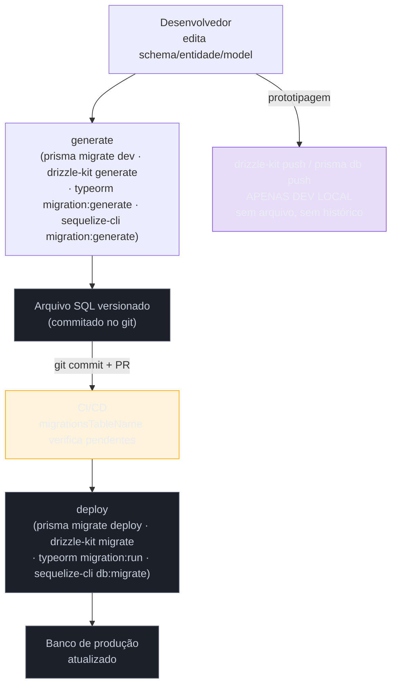

# Migrations e versionamento de schema

> [!abstract] TL;DR
> Uma **migration** é um script SQL versionado e ordenado que transforma o schema do banco de um estado A para um estado B — o equivalente de um commit de git, mas para a estrutura do banco de dados. Sem migrations, o schema deriva silenciosamente entre ambientes (dev, staging, prod), tornando o deploy imprevisível e o rollback impossível. A dicotomia central do ecossistema Node é **generate + migrate** (produção) vs **push** (desenvolvimento local): nunca misture os dois fora do laptop. Todos os ORMs principais — Prisma, Drizzle, TypeORM, Sequelize — implementam o padrão de duas formas ligeiramente diferentes, mas compartilham as mesmas primitivas: arquivo de migration em disco, tabela de controle no banco, e comandos `up`/`down`. Veja o panorama completo do ecossistema em [[03-Dominios/Tecnologia/Node/ORMs e banco de dados/index]].

## Fluxo de migrations: dev vs produção



## O que é

Uma **migration de banco de dados** é um script versionado e ordenado que descreve uma transformação exata do schema: cria tabela, adiciona coluna, altera tipo, remove índice. Cada arquivo tem um timestamp ou número sequencial que garante a ordem de aplicação. O conjunto de migrations aplicadas representa o histórico completo de todas as mudanças estruturais do banco desde o início do projeto.

### Schema drift

**Schema drift** acontece quando diferentes instâncias do banco (máquina de um dev, servidor de CI, staging, produção) ficam fora de sincronia porque as mudanças foram aplicadas manualmente ou de forma inconsistente. Em equipes sem migrations, o DBA aplica um `ALTER TABLE` em produção que ninguém mais tem, o novo dev cria a tabela com um campo a menos, e staging tem um índice que produção não tem. O resultado é um deploy que passa em staging e quebra em produção — ou pior, não quebra mas silenciosamente retorna dados errados.

### Por que commitar os arquivos de migration no git

Os arquivos de migration devem ser commitados no repositório pelos mesmos motivos pelos quais se commitam testes:

- **Reprodutibilidade:** qualquer dev faz `git clone` + `migrate` e tem o banco idêntico ao de produção.
- **Auditabilidade:** o histórico do git mostra quando cada mudança de schema foi introduzida, por quem e em qual PR.
- **Rollback:** se uma migration introduzir um bug, é possível reverter o deploy e rodar `migrate:undo` para desfazer a mudança estrutural.
- **Code review:** a migration acompanha as mudanças de código no mesmo PR, facilitando a revisão de impacto.
- **Onboarding:** novos membros do time configuram o banco do zero sem depender de dumps manuais ou documentação desatualizada.

> [!tip] Migrations como contrato de equipe
> Tratar o arquivo de migration como código de produção — revisado, testado e commitado — é o que separa equipes que deployam com confiança de equipes que têm medo de sexta à tarde.

## Como funciona

### Fluxo generate + migrate (produção)

O fluxo canônico tem quatro passos:

1. Modifique o schema TypeScript (arquivo `.prisma`, entidade TypeORM, schema Drizzle ou model Sequelize).
2. Rode o comando **generate** — a ferramenta compara o schema atual com o estado registrado no banco e gera um arquivo SQL de diff.
3. **Commite o arquivo gerado** junto com as mudanças de código no mesmo PR.
4. No ambiente-alvo (CI, staging, produção), rode o comando **migrate** — ele aplica apenas os arquivos ainda não aplicados, registrando cada um na tabela de controle.

**Prisma:**

```bash
# Desenvolvimento local: gera a migration e aplica imediatamente
npx prisma migrate dev --name add-email-verified-to-users

# Produção/CI: aplica as migrations pendentes sem interação
npx prisma migrate deploy
```

**Drizzle:**

```bash
# Gera o arquivo de migration SQL a partir do schema TypeScript
npx drizzle-kit generate

# Aplica as migrations pendentes no banco configurado em drizzle.config.ts
npx drizzle-kit migrate

# Desenvolvimento local APENAS: sincroniza o schema sem gerar arquivo de migration
# NUNCA use em CI, staging ou produção — destrói o histórico de versionamento
npx drizzle-kit push
```

### Migrations em TypeORM

O TypeORM gera migrations a partir da comparação entre as entidades anotadas e o estado atual do banco. O arquivo gerado implementa `MigrationInterface` com dois métodos obrigatórios: `up()` para aplicar a mudança e `down()` para revertê-la.

```bash
# Gera a migration comparando entidades com o banco
npx typeorm migration:generate src/migrations/AddEmailVerifiedToUsers -d src/data-source.ts

# Aplica todas as migrations pendentes
npx typeorm migration:run -d src/data-source.ts

# Reverte a última migration aplicada
npx typeorm migration:revert -d src/data-source.ts
```

Estrutura de uma migration TypeORM:

```typescript
import { MigrationInterface, QueryRunner } from "typeorm";

export class AddEmailVerifiedToUsers1715500000000 implements MigrationInterface {
  name = "AddEmailVerifiedToUsers1715500000000";

  public async up(queryRunner: QueryRunner): Promise<void> {
    await queryRunner.query(`
      ALTER TABLE "users"
      ADD COLUMN "email_verified" BOOLEAN NOT NULL DEFAULT FALSE
    `);
  }

  public async down(queryRunner: QueryRunner): Promise<void> {
    await queryRunner.query(`
      ALTER TABLE "users"
      DROP COLUMN "email_verified"
    `);
  }
}
```

O TypeORM registra cada migration aplicada na tabela `typeorm_migrations` (nome configurável via `migrationsTableName`). Se o arquivo de migration não existir mais no disco, o registro no banco fica órfão — outra razão para nunca deletar arquivos de migration já aplicados. Cada classe de migration deve ter um nome único; o timestamp no nome da classe garante isso automaticamente quando gerado pela CLI.

### Migrations em Sequelize

O Sequelize usa o `sequelize-cli` para gerar e executar migrations. A estrutura exporta funções `up` e `down` que recebem `queryInterface` como parâmetro.

```bash
# Gera o arquivo de migration (estrutura vazia para preencher manualmente)
npx sequelize-cli migration:generate --name add-email-verified-to-users

# Aplica todas as migrations pendentes
npx sequelize-cli db:migrate

# Reverte a última migration aplicada
npx sequelize-cli db:migrate:undo

# Reverte todas as migrations (cuidado em produção)
npx sequelize-cli db:migrate:undo:all
```

Estrutura de uma migration Sequelize:

```javascript
"use strict";

/** @type {import('sequelize-cli').Migration} */
module.exports = {
  async up(queryInterface, Sequelize) {
    await queryInterface.addColumn("users", "email_verified", {
      type: Sequelize.BOOLEAN,
      allowNull: false,
      defaultValue: false,
    });
  },

  async down(queryInterface, Sequelize) {
    await queryInterface.removeColumn("users", "email_verified");
  },
};
```

O Sequelize registra as migrations aplicadas na tabela `SequelizeMeta` (nome configurável). Cada linha contém apenas o nome do arquivo — se o arquivo for renomeado, o Sequelize não reconhece a migration como aplicada e tenta reaplicá-la.

> [!tip] Convenção de nomes no Sequelize
> O `sequelize-cli` prefixar o arquivo com um timestamp Unix (`20240512120000-add-email-verified.js`). Nunca renomeie esses arquivos após commitar — o `SequelizeMeta` armazena o nome exato, e qualquer diferença quebra o rastreamento.

### Rollback e estratégias de reversão

Nem toda migration é reversível. Antes de escrever o `down()`, classifique a mudança:

**1. Reversão segura** — adicionar uma coluna nullable é trivialmente reversível: o `down()` remove a coluna. Nenhum dado é perdido porque a coluna não tinha constraint de NOT NULL.

```typescript
// TypeORM — up: adiciona coluna nullable | down: remove coluna
public async up(queryRunner: QueryRunner): Promise<void> {
  await queryRunner.query(
    `ALTER TABLE "users" ADD COLUMN "nickname" VARCHAR(100)`
  );
}

public async down(queryRunner: QueryRunner): Promise<void> {
  await queryRunner.query(
    `ALTER TABLE "users" DROP COLUMN "nickname"`
  );
}
```

**2. Migration de dados** — renomear uma coluna requer copiar os dados antes de remover a coluna antiga. Deve ser feito em múltiplas migrations para manter a compatibilidade com o app durante o deploy.

**3. Irreversível** — `DROP TABLE` com dados, `DROP COLUMN` com dados críticos, ou mudanças de tipo que destroem informação. O `down()` deve lançar um erro explícito para evitar que alguém acione o rollback sem perceber que os dados serão perdidos:

```typescript
// TypeORM — migration irreversível: down() explicita a impossibilidade
public async up(queryRunner: QueryRunner): Promise<void> {
  await queryRunner.query(`DROP TABLE "audit_logs"`);
}

public async down(queryRunner: QueryRunner): Promise<void> {
  throw new Error(
    "Migration irreversível: a tabela audit_logs foi removida permanentemente. " +
    "Restaure a partir de backup se necessário."
  );
}
```

No Prisma, o `down()` não é gerado automaticamente — `prisma migrate deploy` é unidirecional. Para rollback, é necessário criar uma nova migration que reverte a mudança manualmente.

### Padrão expand-and-contract — três migrations separadas

O padrão **expand-and-contract** (também chamado parallel change) é a técnica canônica para executar mudanças de schema sem downtime. Divide a mudança em três fases deployadas separadamente:

**Fase 1 — Expand (expansão):** adiciona a nova estrutura sem remover a antiga. O schema suporta simultaneamente a versão antiga e a nova do app.

```sql
-- Migration 1: adiciona full_name como nullable
-- Deploy junto com a versão do app que COMEÇA a escrever full_name
ALTER TABLE "users" ADD COLUMN "full_name" VARCHAR(255);
```

**Fase 2 — Migrate data (migração de dados):** preenche os dados existentes na nova estrutura. Pode ser feita como migration separada ou script de backfill assíncrono para tabelas grandes.

```sql
-- Migration 2: backfill dos registros existentes
-- Deploy após confirmar que 100% das instâncias estão na versão nova
UPDATE "users"
SET "full_name" = first_name || ' ' || last_name
WHERE "full_name" IS NULL;
```

**Fase 3 — Contract (contração):** remove a estrutura antiga e adiciona constraints finais. Só é seguro após confirmar que nenhuma instância da versão antiga está em execução.

```sql
-- Migration 3: adiciona NOT NULL e remove colunas antigas
-- Deploy em uma release posterior, após validação completa
ALTER TABLE "users" ALTER COLUMN "full_name" SET NOT NULL;
ALTER TABLE "users" DROP COLUMN "first_name";
ALTER TABLE "users" DROP COLUMN "last_name";
```

> [!important] Cada fase é uma release separada
> As três migrations devem ser commitadas e deployadas em três releases distintas, não em uma única. Comprimir as três fases em um único deploy elimina a janela de coexistência e causa downtime imediato nas instâncias antigas.

### Checklist de deploy com migrations

1. **Execute migrations antes de iniciar a nova versão do app** — o código novo pode depender de colunas que ainda não existem se a ordem for invertida.
2. **Torne as migrations backward-compatible com a versão anterior do app** — durante o deploy rolling, instâncias da versão antiga e nova rodam simultaneamente; o schema deve suportar ambas.
3. **Nunca edite um arquivo de migration já aplicado** — a tabela de controle registra o hash ou nome do arquivo; editar cria dessincronização entre o arquivo em disco e o estado registrado no banco.
4. **Teste o rollback em staging antes de produção** — `db:migrate:undo` em staging verifica se o `down()` está correto antes de ser necessário em emergência.
5. **Garanta que apenas uma instância aplique migrations por vez** — em deploys com múltiplas réplicas, use advisory locks (Postgres `pg_advisory_lock`) ou configure o migration runner para ser idempotente e executado por apenas um pod (init container Kubernetes, por exemplo).

## Quando usar

A regra de ouro: **`push` é para desenvolvimento local apenas**. Em qualquer ambiente compartilhado, use sempre o fluxo generate + migrate.

| Ambiente        | Comando recomendado                                      | Motivo                                                          |
| --------------- | -------------------------------------------------------- | --------------------------------------------------------------- |
| Dev local       | `prisma migrate dev` / `drizzle-kit generate` + `migrate` (ou `drizzle-kit push`) | Permite iteração rápida; arquivo de migration é gerado e commitado |
| CI (testes)     | `prisma migrate deploy` / `drizzle-kit migrate`          | Aplica migrations existentes; nunca gera novas                  |
| Staging         | `prisma migrate deploy` / `drizzle-kit migrate`          | Valida as migrations antes de chegar em produção                |
| Produção        | `prisma migrate deploy` / `drizzle-kit migrate`          | Apenas aplica; nunca gera; idempotente                          |

> [!warning] Nunca use `prisma db push` ou `drizzle-kit push` em CI/staging/produção
> Esses comandos sincronizam o schema sem criar arquivos de migration, destruindo o histórico de versionamento. Se usados em produção, o banco fica em um estado que não pode ser reproduzido ou revertido de forma controlada. Use-os apenas para prototipagem local.

## Casos práticos

### Cenário A — Pipeline CI/CD com Prisma Migrate no GitHub Actions

Time usa Prisma + PostgreSQL + GitHub Actions. Migration deve rodar no container de app antes de iniciar o servidor, garantindo que o schema está atualizado antes de qualquer request.

```yaml
# .github/workflows/deploy.yml
name: Deploy

on:
  push:
    branches: [main]

jobs:
  deploy:
    runs-on: ubuntu-latest
    steps:
      - uses: actions/checkout@v4

      - name: Setup Node.js
        uses: actions/setup-node@v4
        with:
          node-version: '22'
          cache: 'npm'

      - name: Install dependencies
        run: npm ci

      # Em staging: apply migrations no banco de staging primeiro
      - name: Apply migrations (staging)
        env:
          DATABASE_URL: ${{ secrets.STAGING_DATABASE_URL }}
        run: npx prisma migrate deploy

      - name: Run integration tests
        env:
          DATABASE_URL: ${{ secrets.STAGING_DATABASE_URL }}
        run: npm run test:integration

      # Só aplica em produção após staging validado
      - name: Apply migrations (production)
        env:
          DATABASE_URL: ${{ secrets.PROD_DATABASE_URL }}
        run: npx prisma migrate deploy

      - name: Deploy application
        run: ./scripts/deploy.sh
```

```typescript
// Também: migration rodando no boot do app (alternativa ao pipeline separado)
// src/server.ts
import { execSync } from 'child_process';
import { createServer } from './app';

async function bootstrap() {
  // Garante migrations aplicadas antes de receber requests
  console.log('Running pending migrations...');
  execSync('npx prisma migrate deploy', { stdio: 'inherit' });

  const app = createServer();
  app.listen(3000, () => console.log('Server ready on :3000'));
}

bootstrap().catch((err) => {
  console.error('Startup failed:', err);
  process.exit(1);
});
```

---

### Cenário B — Expand-and-contract: renomear coluna sem downtime no TypeORM

Coluna `first_name` + `last_name` em `users` precisa ser consolidada em `full_name`. Deploy em produção com múltiplas réplicas — não pode ter downtime. Solução: 3 migrations em 3 deploys separados.

```typescript
// Migration 1 (Deploy A): adiciona full_name nullable
// src/migrations/1715500001000-AddFullNameToUsers.ts
import { MigrationInterface, QueryRunner } from 'typeorm';

export class AddFullNameToUsers1715500001000 implements MigrationInterface {
  public async up(queryRunner: QueryRunner): Promise<void> {
    await queryRunner.query(`
      ALTER TABLE "users" ADD COLUMN "full_name" VARCHAR(255)
    `);
    // Versão nova começa a escrever full_name, versão antiga ignora
  }

  public async down(queryRunner: QueryRunner): Promise<void> {
    await queryRunner.query(`
      ALTER TABLE "users" DROP COLUMN "full_name"
    `);
  }
}
```

```typescript
// Migration 2 (Deploy B): backfill dos dados existentes
// Executado após 100% das instâncias estarem na versão nova
// src/migrations/1715500002000-BackfillFullName.ts
export class BackfillFullName1715500002000 implements MigrationInterface {
  public async up(queryRunner: QueryRunner): Promise<void> {
    // Backfill em batches para não bloquear a tabela
    await queryRunner.query(`
      UPDATE "users"
      SET "full_name" = TRIM(first_name || ' ' || COALESCE(last_name, ''))
      WHERE "full_name" IS NULL
    `);
  }

  public async down(queryRunner: QueryRunner): Promise<void> {
    await queryRunner.query(`
      UPDATE "users" SET "full_name" = NULL
    `);
  }
}
```

```typescript
// Migration 3 (Deploy C): adiciona NOT NULL e remove colunas antigas
// Executado em deploy posterior, após validação completa
// src/migrations/1715500003000-DropOldNameColumns.ts
export class DropOldNameColumns1715500003000 implements MigrationInterface {
  public async up(queryRunner: QueryRunner): Promise<void> {
    await queryRunner.query(`
      ALTER TABLE "users" ALTER COLUMN "full_name" SET NOT NULL;
      ALTER TABLE "users" DROP COLUMN "first_name";
      ALTER TABLE "users" DROP COLUMN "last_name";
    `);
  }

  public async down(queryRunner: QueryRunner): Promise<void> {
    throw new Error(
      'Migration irreversível: first_name e last_name foram removidos com dados. ' +
      'Restaure a partir de backup e abra uma nova migration de reversão.'
    );
  }
}
```

**Resultado:** 3 deploys separados sem downtime. As instâncias antigas continuam funcionando durante Deploy A e B porque `full_name` é nullable e as colunas antigas ainda existem.

## Armadilhas comuns

> [!warning] Editar uma migration já aplicada
> Ao editar um arquivo de migration que já foi aplicado em qualquer ambiente, o hash registrado na tabela de controle diverge do hash do arquivo atual. No próximo `migrate`, a ferramenta pode recusar a execução, reaplicar a migration (causando erro de "coluna já existe") ou ignorar silenciosamente a mudança — dependendo do ORM. A solução correta é sempre criar uma **nova migration** para corrigir o estado.

> [!danger] Usar `push` no pipeline de CI/CD
> `prisma db push`, `typeorm synchronize: true` ou qualquer mecanismo de sincronização automática de schema em CI/CD destroem o histórico de migrations. O banco no CI fica em um estado que não corresponde a nenhuma migration em disco, quebrando `migrate:deploy` na próxima execução. Em TypeORM, `synchronize: true` é especialmente perigoso porque pode executar `DROP COLUMN` automaticamente se uma propriedade for removida da entidade.

> [!warning] Migrations não backward-compatible causando downtime
> Em deploys rolling (Kubernetes, ECS), a versão antiga e nova do app rodam simultaneamente por alguns minutos. Se a migration remover ou renomear uma coluna que a versão antiga ainda lê, as instâncias antigas passam a retornar erro. A solução é o padrão de três migrations separadas:

```sql
-- Migration 1: adiciona a nova coluna como nullable (versão antiga ignora, versão nova começa a preencher)
ALTER TABLE "users" ADD COLUMN "full_name" VARCHAR(255);

-- Migration 2 (após deploy completo da versão nova): backfill dos dados existentes
UPDATE "users" SET "full_name" = first_name || ' ' || last_name WHERE "full_name" IS NULL;

-- Migration 3 (após confirmar que nenhuma instância usa as colunas antigas): adiciona NOT NULL e remove colunas antigas
ALTER TABLE "users" ALTER COLUMN "full_name" SET NOT NULL;
ALTER TABLE "users" DROP COLUMN "first_name";
ALTER TABLE "users" DROP COLUMN "last_name";
```

> [!note] Três migrations, não uma
> Cada passo acima deve ser uma migration separada, commitada e deployada individualmente. Combinar os três em uma única migration garante que as colunas antigas serão removidas no mesmo deploy em que são criadas, causando downtime imediato nas instâncias antigas que ainda estão ativas.

## Em entrevista

### "How do you manage database schema changes across environments?"

> We use a migration-based workflow where every schema change is captured as a versioned SQL file committed to the repository alongside the application code. In local development, we run the ORM's `generate` command to produce the migration file from the schema diff, then commit it. In CI, staging, and production, we only run `migrate deploy` — which applies pending migrations without generating new ones. This ensures every environment goes through the exact same sequence of schema transformations, making the state fully reproducible. We never use schema push or `synchronize: true` outside of a developer's local machine, because those bypass the migration history and make rollback impossible. For zero-downtime deployments, migrations must be applied before the new app version starts, and they must be backward-compatible with the previous version so that both versions can run against the same schema simultaneously during a rolling deploy.

### "What makes a migration backward-compatible and why does it matter for zero-downtime deployments?"

> A backward-compatible migration is one where the schema after the migration still supports the previous version of the application without errors. This matters because in a rolling deployment, old and new application instances run simultaneously against the same database — sometimes for several minutes. If you drop a column that the old version still reads, those instances will throw errors until they are replaced. The pattern to achieve backward compatibility is to split a breaking change into three separate migrations deployed across multiple releases: first, add the new column as nullable (old version ignores it, new version writes to it); second, backfill existing rows with the correct data; third, only after confirming no old instances remain, add the NOT NULL constraint and drop the old column. This expand-and-contract pattern is the industry-standard approach to schema evolution in systems that require high availability.

## O que vem a seguir

Migrations garantem que o schema está correto antes do código rodar, mas o código em si também precisa de padrões robustos. [[08 - Transações - gerenciamento manual vs automático]] explora como garantir atomicidade em operações de dados críticos — especialmente relevante quando uma migration de backfill precisa ser executada transacionalmente. Para o panorama de qual ORM usar em qual projeto, incluindo como cada um trata o ciclo de migrations, [[10 - Cheatsheet e decision tree de ORMs]] consolida os comandos side-by-side. O padrão expand-and-contract desta nota conecta diretamente com o problema de paginação em [[09 - Paginação - offset, cursor e keyset]] — migrações que adicionam índices em tabelas grandes precisam do mesmo cuidado com backfill incremental.

## Vocabulário PT→EN

| Português                    | English                              |
| ---------------------------- | ------------------------------------ |
| Migration / migração         | Migration                            |
| Versionamento de schema      | Schema versioning                    |
| Deriva de schema             | Schema drift                         |
| Rollback de migration        | Migration rollback                   |
| Deploy sem downtime          | Zero-downtime deployment             |
| Executor de migrations       | Migration runner                     |
| Trava consultiva             | Advisory lock                        |
| Mudança compatível com versão anterior | Backward-compatible change |
| Expandir e contrair          | Expand and contract (pattern)        |
| Preenchimento retroativo     | Backfill                             |
| Migration irreversível       | Irreversible migration               |
| Tabela de controle           | Migration tracking table             |

## Fontes

- [Prisma Migrate — documentação oficial](https://www.prisma.io/docs/orm/prisma-migrate)
- [Drizzle Kit — migrations](https://orm.drizzle.team/docs/migrations)
- [TypeORM — Migrations](https://typeorm.io/migrations)
- [Sequelize — Migrations](https://sequelize.org/docs/v6/other-topics/migrations/)
