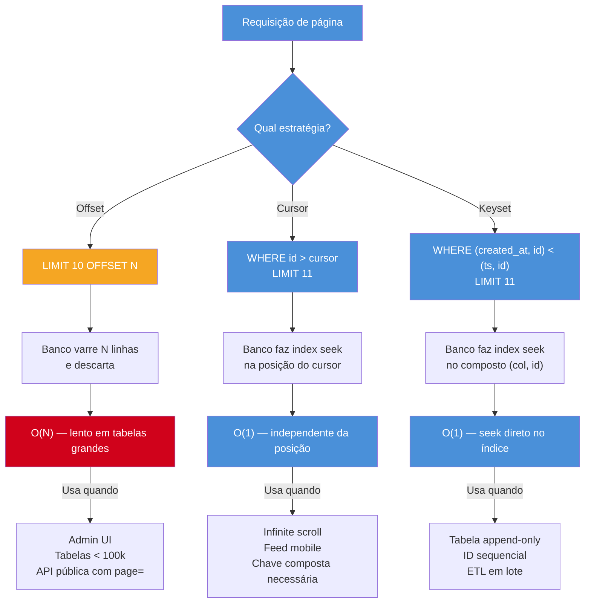

# Paginação - offset, cursor e keyset

> [!abstract] TL;DR
> Offset pagination é simples mas degrada em tabelas grandes: `OFFSET N` força o banco a varrer N linhas antes de retornar qualquer resultado (O(N)). Cursor pagination usa um ponteiro opaco para a última linha vista, mantendo O(1) independentemente da posição na tabela. Keyset pagination filtra diretamente em colunas indexadas (`WHERE id > last_id`), sendo a estratégia mais rápida para tabelas com inserções frequentes. Cada ORM tem suporte nativo: Prisma via `cursor` + `skip: 1`, Sequelize via `limit`/`offset` e `Op.gt`, TypeORM via `findAndCount` e QueryBuilder, Drizzle via `.where(gt(...))`. Decisão: offset para admin UIs com acesso aleatório a páginas, cursor/keyset para infinite scroll e feeds.

## Mapa de estratégias de paginação



## Como funciona

### Conceitos fundamentais

**Offset pagination**

A estratégia mais comum e mais simples. O banco descarta os primeiros N resultados e retorna os próximos K.

```sql
SELECT * FROM users ORDER BY id LIMIT 10 OFFSET 990;
```

O problema fundamental: o banco precisa identificar e varrer as 990 linhas antes de retornar as 10 desejadas. Em PostgreSQL, isso significa leitura de índice ou heap sequencial até a linha 1000 — o custo cresce linearmente com o offset.

- Use case: admin UIs, tabelas pequenas (menos de 100k linhas), situações onde o usuário precisa acessar uma página arbitrária diretamente.

**Cursor pagination**

Usa um token opaco que codifica a posição da última linha vista. Internamente, o banco filtra a partir desse ponto em vez de contar e descartar.

```sql
SELECT * FROM posts WHERE id > 42 ORDER BY id LIMIT 10;
```

Estável: inserções e deleções entre requisições não deslocam os resultados porque a âncora é posicional, não numérica. Limitação: não é possível pular para uma página arbitrária — a navegação é estritamente linear (próximo / anterior).

**Keyset pagination**

Filtra diretamente nas colunas indexadas, suportando chaves compostas para desempate quando a coluna de ordenação não é única.

```sql
SELECT * FROM events
WHERE (created_at, id) < ($last_created_at, $last_id)
ORDER BY created_at DESC, id DESC
LIMIT 10;
```

Quando o índice composto existe, o banco usa uma única operação de seek — O(1) independentemente do tamanho da tabela. É a estratégia mais performática para tabelas append-only com IDs sequenciais ou timestamps.

**Comparação**

| Estratégia | Performance em tabelas grandes | Acesso aleatório | Estável com inserts |
|---|---|---|---|
| Offset | ❌ O(N) | ✅ sim | ❌ não |
| Cursor | ✅ O(1) | ❌ não | ✅ sim |
| Keyset | ✅ O(1) | ❌ não | ✅ sim |

### Paginação em Prisma

**Offset com contagem total:**

```typescript
async function listarUsuariosOffset(pagina: number, porPagina: number) {
  const [usuarios, total] = await prisma.$transaction([
    prisma.user.findMany({
      skip: (pagina - 1) * porPagina,
      take: porPagina,
      orderBy: { createdAt: 'desc' },
    }),
    prisma.user.count(),
  ]);
  return { usuarios, total, paginas: Math.ceil(total / porPagina) };
}
```

**Cursor (Prisma nativo):**

```typescript
async function listarPostsCursor(cursor?: string, limite = 10) {
  const posts = await prisma.post.findMany({
    take: limite + 1, // busca 1 a mais para detectar hasNextPage
    ...(cursor && {
      cursor: { id: cursor },
      skip: 1, // pula o próprio cursor
    }),
    orderBy: { id: 'asc' },
    select: { id: true, title: true, createdAt: true },
  });

  const hasNextPage = posts.length > limite;
  if (hasNextPage) posts.pop();

  return {
    posts,
    nextCursor: hasNextPage ? posts[posts.length - 1].id : null,
  };
}
```

> [!tip] Cursor no Prisma é o valor bruto
> O Prisma cursor usa o campo como opaque pointer — passe o valor bruto (string/int), não um token base64 codificado. O encoding fica na camada de API se necessário.

### Paginação em TypeORM

**Offset com `findAndCount`:**

```typescript
async function listarProdutosOffset(pagina: number, porPagina: number) {
  const [produtos, total] = await productRepository.findAndCount({
    skip: (pagina - 1) * porPagina,
    take: porPagina,
    order: { createdAt: 'DESC' },
  });
  return { produtos, total, paginas: Math.ceil(total / porPagina) };
}
```

**Keyset com QueryBuilder:**

```typescript
async function listarProdutosKeyset(lastId?: number, limite = 10) {
  const qb = productRepository
    .createQueryBuilder('p')
    .orderBy('p.id', 'ASC')
    .take(limite + 1);

  if (lastId !== undefined) {
    qb.where('p.id > :lastId', { lastId });
  }

  const produtos = await qb.getMany();
  const hasNextPage = produtos.length > limite;
  if (hasNextPage) produtos.pop();

  return {
    produtos,
    nextId: hasNextPage ? produtos[produtos.length - 1].id : null,
  };
}
```

### Paginação em Sequelize

**Offset com `findAndCountAll`:**

```typescript
async function listarOrdensOffset(pagina: number, porPagina: number) {
  const { rows: ordens, count: total } = await Order.findAndCountAll({
    limit: porPagina,
    offset: (pagina - 1) * porPagina,
    order: [['createdAt', 'DESC']],
  });
  return { ordens, total, paginas: Math.ceil(total / porPagina) };
}
```

**Keyset com `Op.gt`:**

```typescript
import { Op } from 'sequelize';

async function listarOrdensKeyset(lastId?: number, limite = 10) {
  const ordens = await Order.findAll({
    limit: limite + 1,
    where: lastId !== undefined ? { id: { [Op.gt]: lastId } } : {},
    order: [['id', 'ASC']],
  });

  const hasNextPage = ordens.length > limite;
  if (hasNextPage) ordens.pop();

  return {
    ordens,
    nextId: hasNextPage ? ordens[ordens.length - 1].id : null,
  };
}
```

### Paginação em Drizzle

**Offset:**

```typescript
import { desc, count } from 'drizzle-orm';

async function listarEventosOffset(pagina: number, porPagina: number) {
  const [eventos, [{ total }]] = await Promise.all([
    db
      .select()
      .from(events)
      .orderBy(desc(events.createdAt))
      .limit(porPagina)
      .offset((pagina - 1) * porPagina),
    db.select({ total: count() }).from(events),
  ]);
  return { eventos, total, paginas: Math.ceil(total / porPagina) };
}
```

**Keyset:**

```typescript
import { gt } from 'drizzle-orm';

async function listarEventosKeyset(lastId?: number, limite = 10) {
  const eventos = await db
    .select()
    .from(events)
    .where(lastId !== undefined ? gt(events.id, lastId) : undefined)
    .orderBy(asc(events.id))
    .limit(limite + 1);

  const hasNextPage = eventos.length > limite;
  if (hasNextPage) eventos.pop();

  return {
    eventos,
    nextId: hasNextPage ? eventos[eventos.length - 1].id : null,
  };
}
```

> [!tip] `undefined` em `.where()` no Drizzle (≥ 0.29)
> No Drizzle ORM ≥ 0.29, passe `undefined` para `.where()` para omitir o filtro — o ORM ignora cláusulas `undefined` automaticamente, eliminando condicionais de string.

### Comparação de planos de execução

Para entender o custo real de cada estratégia, nada melhor do que `EXPLAIN ANALYZE` direto no PostgreSQL. Os três exemplos abaixo usam uma tabela `events` com 5 milhões de linhas e índice em `(created_at DESC, id DESC)`.

**Offset pagination — página 5.000 (posição 50.000)**

```sql
EXPLAIN ANALYZE
SELECT id, action, created_at
FROM events
ORDER BY created_at DESC, id DESC
LIMIT 10 OFFSET 50000;
```

Saída típica:

```
Limit  (cost=14821.43..14821.46 rows=10 width=40) (actual time=312.847..312.851 rows=10 loops=1)
  ->  Index Scan using events_created_at_id_idx on events
        (cost=0.56..7410718.32 rows=5000000 width=40)
        (actual time=0.091..289.432 rows=50010 loops=1)
Planning Time: 0.231 ms
Execution Time: 312.892 ms
```

O plano mostra **Index Scan** — o PostgreSQL usa o índice, mas precisa atravessar 50.010 entradas para descartar 50.000 e retornar 10. O tempo cresce linearmente: offset 500.000 → ~3 segundos.

**Cursor pagination — posição equivalente via `id > cursor`**

```sql
EXPLAIN ANALYZE
SELECT id, action, created_at
FROM events
WHERE id > 49990
ORDER BY id ASC
LIMIT 10;
```

Saída típica:

```
Limit  (cost=0.56..1.18 rows=10 width=40) (actual time=0.041..0.058 rows=10 loops=1)
  ->  Index Scan using events_pkey on events
        (cost=0.56..309721.56 rows=4999990 width=40)
        (actual time=0.039..0.051 rows=10 loops=1)
        Index Cond: (id > 49990)
Planning Time: 0.118 ms
Execution Time: 0.073 ms
```

O plano mostra **Index Scan com `Index Cond`** — o banco faz um único seek na posição do cursor e lê as 10 linhas seguintes. Custo fixo: 0,07 ms independentemente de estar na posição 10 ou 5.000.000.

**Keyset pagination — chave composta `(created_at, id)`**

```sql
EXPLAIN ANALYZE
SELECT id, action, created_at
FROM events
WHERE (created_at, id) < ('2026-01-15 10:30:00', 49991)
ORDER BY created_at DESC, id DESC
LIMIT 10;
```

Saída típica:

```
Limit  (cost=0.56..1.63 rows=10 width=40) (actual time=0.048..0.067 rows=10 loops=1)
  ->  Index Scan Backward using events_created_at_id_idx on events
        (cost=0.56..532114.32 rows=4999990 width=40)
        (actual time=0.045..0.060 rows=10 loops=1)
        Index Cond: (ROW(created_at, id) < ROW('2026-01-15 10:30:00', 49991))
Planning Time: 0.156 ms
Execution Time: 0.081 ms
```

O plano mostra **Index Scan Backward** — leitura reversa do índice composto, seek direto na tupla `(created_at, id)`. O PostgreSQL não precisa nem varrer nem contar: salta diretamente para a posição.

> [!tip] Bitmap Heap Scan — quando aparece e por quê
> Se a query não tiver índice cobrindo `ORDER BY`, o PostgreSQL pode recorrer a um **Bitmap Heap Scan**: primeiro gera um bitmap de rowids candidatos, depois lê do heap em ordem de disco. É mais eficiente que Seq Scan, mas significativamente mais lento que Index Scan. Se você ver Bitmap Heap Scan num `EXPLAIN` de paginação, verifique se o índice composto cobre tanto a coluna de filtro quanto a de ordenação.

### Estratégia híbrida — offset no topo, keyset no fundo

Nem sempre é necessário escolher uma única estratégia. Uma abordagem pragmática em APIs REST públicas combina offset nas primeiras páginas (onde o custo ainda é baixo) e keyset nas profundidades onde offset fica proibitivo.

A lógica é simples: defina um limiar (por exemplo, `page <= 100` → offset; `page > 100` → keyset). A API expõe `page=` para compatibilidade com clientes existentes, mas internamente troca o mecanismo:

```typescript
interface PaginationConfig {
  offsetThreshold: number; // página máxima que usa offset
  pageSize: number;
}

interface PageRequest {
  page?: number;       // cliente usa page= (offset)
  cursor?: string;     // cliente usa cursor= (keyset interno)
}

async function listProducts(
  req: PageRequest,
  config: PaginationConfig = { offsetThreshold: 100, pageSize: 20 },
) {
  const { pageSize, offsetThreshold } = config;

  // Página dentro do limiar seguro → offset normal
  if (req.page !== undefined && req.page <= offsetThreshold) {
    const [items, total] = await prisma.$transaction([
      prisma.product.findMany({
        skip: (req.page - 1) * pageSize,
        take: pageSize,
        orderBy: { id: 'asc' },
      }),
      prisma.product.count(),
    ]);
    return { items, total, strategy: 'offset' };
  }

  // Fora do limiar ou cursor explícito → keyset via cursor
  const lastId = req.cursor ? parseInt(req.cursor, 10) : undefined;
  const items = await prisma.product.findMany({
    take: pageSize + 1,
    ...(lastId && { cursor: { id: lastId }, skip: 1 }),
    orderBy: { id: 'asc' },
  });

  const hasNext = items.length > pageSize;
  if (hasNext) items.pop();

  return {
    items,
    nextCursor: hasNext ? String(items[items.length - 1].id) : null,
    strategy: 'keyset',
  };
}
```

O campo `strategy` no retorno é opcional mas útil para logging e debugging — permite rastrear em produção qual caminho cada requisição tomou. A troca de mecanismo é transparente para o cliente quando ele usa `page=`; se ele cruzar o limiar, a API retorna `nextCursor` em vez de `nextPage` e o cliente precisa migrar para o modo cursor.

> [!warning] Consistência entre páginas na transição offset→keyset
> Na página exata do limiar, há um risco de lacuna ou duplicação se inserts ocorrerem entre as requisições. Documente o comportamento e, se o contexto exigir consistência absoluta, use um snapshot de transação (`REPEATABLE READ`) ou restrinja a transição apenas para dados históricos imutáveis (eventos de auditoria, logs).

## Quando usar

| Caso de uso | Estratégia recomendada | Motivo |
|---|---|---|
| Admin UI com acesso a página arbitrária | Offset | Random access necessário |
| Feed de posts / timeline | Cursor ou Keyset | Estável, O(1) |
| Tabela < 100k linhas | Offset | Diferença de performance negligível |
| Export em lote (ETL, relatório) | Keyset | Predictable memory, sem drift |
| API pública com `page=` | Offset | Expectativa de devs externos |
| Infinite scroll mobile | Cursor | Token opaco, simples de implementar |
| Tabela append-only com ID sequencial | Keyset | Mais simples que cursor, mesma performance |

## Casos práticos

### Cenário A — API REST com cursor pagination e múltiplas colunas de ordenação

Um feed de eventos de auditoria precisa paginar por `(created_at DESC, id DESC)` para suportar inserções frequentes sem drift. O cliente recebe um `nextCursor` opaco; o servidor decodifica e filtra. Implementação com Prisma:

```typescript
// types.ts
interface AuditCursor {
  createdAt: string; // ISO string
  id: string;
}

// audit.service.ts
import { prisma } from './prisma-client';

export async function listAuditEvents(
  encodedCursor?: string,
  limit = 20,
): Promise<{ events: AuditEvent[]; nextCursor: string | null }> {
  let cursorFilter: object | undefined;

  if (encodedCursor) {
    const decoded: AuditCursor = JSON.parse(
      Buffer.from(encodedCursor, 'base64').toString('utf8'),
    );
    cursorFilter = {
      OR: [
        { createdAt: { lt: new Date(decoded.createdAt) } },
        {
          createdAt: { equals: new Date(decoded.createdAt) },
          id: { lt: decoded.id },
        },
      ],
    };
  }

  const events = await prisma.auditEvent.findMany({
    where: cursorFilter,
    orderBy: [{ createdAt: 'desc' }, { id: 'desc' }],
    take: limit + 1,
    select: { id: true, action: true, userId: true, createdAt: true },
  });

  const hasNextPage = events.length > limit;
  if (hasNextPage) events.pop();

  let nextCursor: string | null = null;
  if (hasNextPage) {
    const last = events[events.length - 1];
    const payload: AuditCursor = {
      createdAt: last.createdAt.toISOString(),
      id: last.id,
    };
    nextCursor = Buffer.from(JSON.stringify(payload)).toString('base64');
  }

  return { events, nextCursor };
}
```

O cursor composto `(createdAt, id)` garante ordenação estável mesmo quando dois eventos têm o mesmo timestamp. O encoding base64 mantém o cursor opaco — o cliente não sabe que internamente é um par de valores.

### Cenário B — Exportação em lote com keyset e Drizzle

Um job de ETL precisa exportar 2 milhões de registros de `orders` para um bucket S3 sem estourar memória. Keyset pagination com `id` sequencial processa em batches de 1000 sem drift nem full table scan:

```typescript
import { gt, asc, eq } from 'drizzle-orm';
import { db } from './db';
import { orders } from './schema';
import { uploadToS3 } from './s3-client';

async function exportOrdersToS3(batchSize = 1000): Promise<void> {
  let lastId: number | undefined;
  let totalExported = 0;
  let batchNumber = 0;

  while (true) {
    const batch = await db
      .select({
        id: orders.id,
        customerId: orders.customerId,
        total: orders.total,
        status: orders.status,
        createdAt: orders.createdAt,
      })
      .from(orders)
      .where(lastId !== undefined ? gt(orders.id, lastId) : undefined)
      .orderBy(asc(orders.id))
      .limit(batchSize);

    if (batch.length === 0) break;

    const csv = batch.map(row =>
      `${row.id},${row.customerId},${row.total},${row.status},${row.createdAt.toISOString()}`
    ).join('\n');

    await uploadToS3(`orders/batch-${String(batchNumber).padStart(6, '0')}.csv`, csv);

    lastId = batch[batch.length - 1].id;
    totalExported += batch.length;
    batchNumber++;

    console.log(`Exported ${totalExported} orders (last id: ${lastId})`);
  }

  console.log(`Export complete: ${totalExported} orders in ${batchNumber} batches`);
}
```

O `while (true)` com break em `batch.length === 0` é idiomático para keyset: quando não há mais registros, o loop termina naturalmente. Cada iteração usa `gt(orders.id, lastId)` — sem `OFFSET`, sem scan acumulado, sem vazamento de memória.

## O que vem a seguir

Você conhece agora os três modelos de paginação e sabe escolher entre eles. O próximo passo natural é o **[[03-Dominios/Tecnologia/Node/ORMs e banco de dados/10 - Cheatsheet e decision tree de ORMs|10 - Cheatsheet e decision tree de ORMs]]** — um resumo consolidado de todos os padrões do galho, incluindo N+1, migrations, transações e paginação, útil como referência rápida antes de entrevistas.

Se você quer aprofundar o lado de performance de queries, volte à **[[03-Dominios/Tecnologia/Node/ORMs e banco de dados/06 - N+1 queries - detecção e DataLoader|06 - N+1 queries - detecção e DataLoader]]** — o problema N+1 em associações segue a mesma lógica do N+1 fetch pattern que usamos aqui para detectar `hasNextPage`.

Para entender como locking e isolation levels interagem com leituras paginadas em contextos de alta concorrência, veja **[[03-Dominios/Tecnologia/Node/ORMs e banco de dados/08 - Transações - gerenciamento manual vs automático|08 - Transações]]**.

## Armadilhas comuns

> [!danger] COUNT(*) em cursor pagination anula o ganho de performance
> `COUNT(*)` realiza um full table scan e anula completamente o benefício de O(1) do cursor. Cursor pagination não tem total de páginas por design — use estimativas via `EXPLAIN`, estatísticas da tabela, ou simplesmente omita o total da resposta.

> [!danger] Ordenação sem índice transforma keyset/cursor em O(N)
> Keyset e cursor pagination sobre uma coluna sem índice forçam o banco a fazer um full table scan para encontrar o ponto de corte. Sempre crie o índice antes de adotar essas estratégias: `CREATE INDEX ON tabela (coluna_sort)` ou `CREATE INDEX ON tabela (coluna_sort, id)` para chave composta.

> [!danger] OFFSET em tabelas grandes é lento por design
> `OFFSET 50000 LIMIT 10` instrui o banco a ler 50.010 linhas e descartar 50.000. Em PostgreSQL com 1 milhão de linhas e sem índice cobrindo a ordenação, isso pode levar mais de 1 segundo — e o custo cresce linearmente com o offset.

> [!danger] Cursor instável com colunas não únicas quebra a paginação
> Um cursor baseado apenas em `created_at` quebra silenciosamente quando múltiplas linhas têm o mesmo timestamp: algumas linhas serão puladas ou repetidas entre páginas. Sempre use um tiebreaker — defina o keyset como `(created_at, id)` para garantir ordenação determinística e estável.

> [!danger] Esquecer `take: limite + 1` força um COUNT extra
> Sem buscar N+1 itens, a única forma de saber se existe uma próxima página é executar um `COUNT(*)` separado — que é caro e inconsistente com reads concorrentes. O padrão canônico é: busque `limite + 1`, verifique `length > limite`, remova o último item com `.pop()`, e use o ID do último item retornado como `nextCursor`.

## Em entrevista

**Q: "Why does OFFSET pagination degrade at scale, and what would you use instead?"**

OFFSET pagination forces the database to perform a full table scan up to the offset position — fetching `OFFSET 50000 LIMIT 10` reads 50,010 rows and discards 50,000 of them, making it O(N) relative to the offset value. On large tables this translates to multi-second query times even with indexes on the sort column, because the database must traverse the index to count rows rather than seek directly to a position. For high-traffic or large-dataset scenarios I would switch to cursor-based or keyset pagination, both of which are O(1) regardless of how deep into the dataset the client is. Keyset pagination in particular — filtering on an indexed column with `WHERE id > last_id` — leverages a single index seek and is ideal for append-heavy tables with sequential IDs. The trade-off is losing random page access, which is acceptable for feeds and infinite scroll but not for admin UIs requiring arbitrary page jumps.

**Q: "How does cursor pagination work, and what are its trade-offs?"**

Cursor pagination encodes the position of the last-seen row into an opaque token — the raw primary key or composite key value, optionally base64-encoded at the API layer for opacity — which the client sends back on the next request to anchor the query at that exact position. Because the query filters from a known row forward rather than counting and skipping, it delivers stable results even when rows are inserted or deleted between requests, and the query cost stays constant regardless of how many pages have already been consumed. The primary trade-off is that there is no random access: the client cannot jump to page 5 without having traversed pages 1 through 4, and there is no meaningful concept of a total page count. Implementing `hasNextPage` correctly requires the N+1 fetch pattern — requesting one extra item, checking if it exists, and popping it before returning the response — to avoid an expensive COUNT query. This model is well-suited for infinite scroll and social feeds but a poor fit for UIs where users expect to navigate directly to a specific page number.

## Vocabulário

| Termo | Definição |
|---|---|
| **offset pagination** | Estratégia de paginação que usa `LIMIT` e `OFFSET` SQL; simples mas O(N) em datasets grandes |
| **cursor pagination** | Paginação baseada em um token opaco que aponta para a última linha vista; O(1) e estável |
| **keyset pagination** | Filtragem direta em colunas indexadas (`WHERE col > last_val`); também chamado de seek method |
| **opaque cursor** | Token enviado ao cliente que codifica a posição no dataset sem expor detalhes internos (ex.: ID, timestamp) |
| **hasNextPage** | Flag booleana que indica se existe uma próxima página; detectada via N+1 fetch pattern |
| **tiebreaker** | Coluna secundária (geralmente `id`) usada para desambiguar linhas com o mesmo valor na coluna de ordenação primária |
| **full table scan** | Leitura de todas as linhas de uma tabela; o que acontece quando OFFSET é alto ou falta índice na ordenação |
| **N+1 fetch pattern** | Buscar `limite + 1` itens para detectar `hasNextPage` sem executar um COUNT separado |
| **índice composto** | Índice em múltiplas colunas (ex.: `(created_at, id)`); essencial para keyset pagination com tiebreaker |
| **stable pagination** | Propriedade de cursor/keyset: inserts e deletes entre páginas não causam linhas duplicadas ou puladas |
| **infinite scroll** | Padrão de UX que carrega mais conteúdo conforme o usuário rola; caso de uso canônico para cursor pagination |
| **seek method** | Outro nome para keyset pagination; referência ao seek de índice que o banco executa internamente |
| **findAndCount / findAndCountAll** | Métodos de ORM (TypeORM / Sequelize) que executam SELECT e COUNT em uma única chamada |
| **drift de paginação** | Fenômeno em offset pagination onde inserts/deletes causam repetição ou omissão de linhas entre páginas |

## Veja também

- `[[ORMs e banco de dados]]` — MOC do galho
- `[[06 - N+1 queries - detecção e DataLoader]]` — N+1 em associações, mesmo padrão de N+1 fetch
- `[[08 - Transações - gerenciamento manual vs automático]]` — transações e locking em contexto de leitura
- `[[10 - Cheatsheet e decision tree de ORMs]]` — próxima nota

## Fontes

- [Prisma Pagination docs](https://www.prisma.io/docs/orm/prisma-client/queries/pagination) — cursor e offset nativos
- [Sequelize Pagination](https://sequelize.org/docs/v7/querying/operators/) — `findAndCountAll`, `Op.gt`
- [TypeORM findAndCount](https://typeorm.io/find-options#basic-options) — `findAndCount`, QueryBuilder com `skip`/`take`
- [Drizzle ORM — Filtering](https://orm.drizzle.team/docs/select#filtering) — `gt`, `lt`, `where` com `undefined`
- [Use the index, Luke — Seek Method](https://use-the-index-luke.com/sql/partial-results/fetch-next-page) — explicação clássica de keyset pagination
- [DataLoader GitHub](https://github.com/graphql/dataloader) — batching e N+1 fetch pattern
