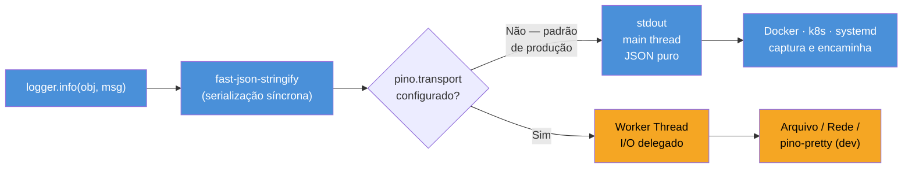

# Logging estruturado com pino

> [!abstract] TL;DR
> Logging estruturado significa emitir cada entrada de log como um objeto JSON com campos padronizados — em vez de texto livre — para que ferramentas de agregação (Datadog, Loki, CloudWatch) possam indexar, filtrar e alertar sem parsing frágil de regex.
> Pino é o logger mais rápido do ecossistema Node.js: quando usado com `pino.transport()`, delega a serialização e a escrita em disco a uma worker thread, mantendo o event loop livre; sem transport, escreve no stdout do main thread com serialização ultra-rápida via fast-json-stringify.
> Cada log de produção deve carregar pelo menos: `timestamp`, `level`, `msg`, `requestId`, `service` e `version` — sem `requestId` é impossível correlacionar logs de uma única requisição num sistema com alta concorrência.
> Dados sensíveis (senhas, tokens, CPFs) jamais devem aparecer em logs; use a opção `redact` do pino para remover campos automaticamente antes de qualquer I/O.

Esta nota aprofunda o pilar de *logs* introduzido em [[01 - Os três pilares - logs, métricas e traces]] e faz parte do galho [[03-Dominios/Tecnologia/Node/Observability e produção/index]].

---

## O que é

**Logging estruturado** é a prática de emitir cada entrada de log como um documento estruturado (normalmente JSON) em vez de uma string de texto livre.

### Texto livre vs. JSON estruturado

Log de texto livre (ruim em produção):

```
[2026-05-08T12:34:56Z] ERROR: User 42 failed to login after 3 attempts from 203.0.113.5
```

Log estruturado (produção-ready):

```json
{
  "level": 50,
  "time": "2026-05-08T12:34:56.123Z",
  "msg": "Login failed",
  "service": "auth-service",
  "version": "1.4.2",
  "requestId": "req-abc-123",
  "userId": 42,
  "attempts": 3,
  "ip": "203.0.113.5"
}
```

> [!note] `level` é um número por padrão
> Por padrão, pino emite `level` como número inteiro (10=trace, 20=debug, 30=info, 40=warn, 50=error, 60=fatal). Para emitir o label textual (`"error"`, `"info"`, etc.), é necessário configurar a opção `formatters.level`.

Com JSON, qualquer sistema de agregação consegue filtrar por `userId`, contar `attempts`, agrupar por `ip` — sem expressão regular. Com texto livre, cada sistema precisa escrever seu próprio parser e qualquer mudança de formato quebra as dashboards.

### Por que pino?

Pino é o logger mais rápido do ecossistema Node.js. Em benchmarks independentes, supera winston e bunyan por 2x–5x em throughput de mensagens por segundo. O segredo está na arquitetura:

- O processo principal serializa objetos JSON via fast-json-stringify (extremamente rápido) e escreve no stdout.
- Com `pino.transport()`, a formatação e a escrita em arquivo/rede são delegadas a uma worker thread, liberando o event loop do I/O de disco.
- Sem transport, pino ainda é muito mais rápido que winston/bunyan por usar fast-json-stringify em vez de `JSON.stringify` e manter a API minimalista.



---

## Por que importa

Em produção, logs servem a três propósitos críticos:

1. **Diagnóstico pós-incidente**: quando um bug ocorre às 3h, você precisa encontrar a causa raiz lendo logs. Sem estrutura, a investigação vira busca de agulha em palheiro.
2. **Alertas em tempo real**: ferramentas como Datadog e Loki permitem criar alertas baseados em campos — "alerta se `level: error` para `service: payment` ultrapassar 10/min". Isso é impossível com texto livre.
3. **Correlação de requisição**: num sistema com centenas de requisições simultâneas, o campo `requestId` é o fio que liga todos os logs de uma única transação — do recebimento da requisição até a resposta, passando por chamadas a banco e serviços externos.

> [!warning] Custo de logs não estruturados
> Logs de texto livre são comuns em código legado e scripts rápidos, mas em produção geram custos ocultos: pipelines de ingestão mais caros (parsing CPU-intensivo), alertas menos confiáveis e investigações de incidente mais longas. A migração para logging estruturado costuma reduzir o MTTR (Mean Time to Resolve) de incidentes em 30–50%.

---

## Como funciona

### Instalação e setup básico

```bash
# pino 9.x requer Node 18+
npm install pino
npm install pino-pretty --save-dev   # apenas para desenvolvimento
```

```typescript
// src/logger.ts
import pino from 'pino';

// Logger mínimo para desenvolvimento
const logger = pino({
  level: process.env.LOG_LEVEL ?? 'info',
});

logger.info('Server starting');
// → {"level":30,"time":1715167496123,"pid":1234,"hostname":"srv-01","msg":"Server starting"}

export default logger;
```

Para desenvolvimento, pino-pretty formata o JSON de forma legível. **Nunca use pino-pretty em produção** — ele adiciona overhead de CPU e rompe o pipeline de ingestão JSON.

```typescript
// src/logger.ts — versão desenvolvimento
import pino from 'pino';

const isDev = process.env.NODE_ENV !== 'production';

const logger = pino(
  { level: process.env.LOG_LEVEL ?? 'info' },
  isDev
    ? pino.transport({ target: 'pino-pretty', options: { colorize: true } })
    : process.stdout, // produção: JSON puro para stdout
);

export default logger;
```

### Níveis de log e quando usar cada um

Pino define seis níveis nativos. Cada nível tem um valor numérico interno; apenas mensagens com valor ≥ ao nível configurado são emitidas.

| Nível   | Valor | Quando usar                                                                      |
| ------- | ----- | -------------------------------------------------------------------------------- |
| `trace` | 10    | Detalhes extremamente granulares — loop interno, cada iteração. Desativado em prod. |
| `debug` | 20    | Informações de diagnóstico úteis em desenvolvimento — valores de variáveis, fluxo interno. |
| `info`  | 30    | Eventos normais de negócio — requisição recebida, usuário autenticado, pedido criado. |
| `warn`  | 40    | Situação anormal mas recuperável — retry de banco, fallback acionado, config ausente com default. |
| `error` | 50    | Erro que impediu uma operação — exceção não tratada, falha de I/O, validação crítica. |
| `fatal` | 60    | Erro que torna o processo inoperante — use antes de `process.exit(1)`. |

> [!tip] Regra prática de nível em produção
> Configure `LOG_LEVEL=info` em produção. Nível `debug` em produção pode triplicar o volume de logs e adicionar latência mensurável em rotas de alta frequência. Reserve `debug` para ambientes de staging ou investigações pontuais com tempo limitado.

### Redação e campos obrigatórios

Todo log de produção deve carregar um conjunto mínimo de campos para ser rastreável e correlacionável:

| Campo        | Tipo     | Descrição                                                      |
| ------------ | -------- | -------------------------------------------------------------- |
| `time`       | ISO 8601 | Gerado automaticamente pelo pino                               |
| `level`      | number   | Valor numérico do nível (30=info, 50=error…); string exige `formatters.level` |
| `msg`        | string   | Mensagem humano-legível, imutável entre ocorrências            |
| `requestId`  | string   | UUID ou trace ID da requisição                                 |
| `service`    | string   | Nome do serviço — `auth-service`, `payment-api`               |
| `version`    | string   | Versão do serviço — permite correlacionar com deploy           |

```typescript
// src/logger.ts — produção completa
import pino from 'pino';
import { name, version } from '../package.json' with { type: 'json' };

const logger = pino({
  level: process.env.LOG_LEVEL ?? 'info',

  // Campos base presentes em TODOS os logs
  base: {
    service: name,
    version,
    env: process.env.NODE_ENV ?? 'development',
  },

  // Redação automática de campos sensíveis
  redact: [
    'req.headers.authorization',
    'req.headers.cookie',
    'body.password',
    'body.token',
    'body.cpf',
    '*.creditCard',
  ],

  // Produção: JSON para stdout (capturado pelo runtime — Docker, k8s)
  transport:
    process.env.NODE_ENV === 'production'
      ? undefined
      : { target: 'pino-pretty', options: { colorize: true } },
});

export default logger;
```

### Serializers e redação de dados sensíveis

Pino oferece dois mecanismos complementares para controlar o que vai para o log:

**1. `redact` (mais simples)** — remove ou mascara campos por caminho JSON antes de qualquer serialização:

```typescript
const logger = pino({
  redact: {
    paths: ['req.headers.authorization', 'body.password'],
    censor: '[REDACTED]', // padrão: '[Redacted]'
    remove: false,        // true = remove o campo, false = substitui pelo censor
  },
});
```

**2. Serializers (mais flexível)** — transforma o valor de um campo antes de serializar. Ideal para normalizar objetos complexos como req/res do HTTP nativo:

```typescript
import pino from 'pino';
import { IncomingMessage, ServerResponse } from 'http';

const logger = pino({
  serializers: {
    // Serializer padrão do pino para req HTTP
    req: pino.stdSerializers.req,
    // Serializer padrão para res HTTP
    res: pino.stdSerializers.res,
    // Serializer customizado para erros — inclui stack trace
    err: pino.stdSerializers.err,
    // Serializer custom: mascara senha em corpo de requisição
    body: (body: Record<string, unknown>) => {
      if (!body) return body;
      const safe = { ...body };
      if ('password' in safe) safe.password = '[REDACTED]';
      if ('token' in safe) safe.token = '[REDACTED]';
      return safe;
    },
  },
});
```

> [!danger] Nunca confie apenas em sanitização manual
> É fácil esquecer um campo. Use `redact` como camada de segurança automática e aplique serializers apenas para transformações estruturais. As duas abordagens são complementares, não alternativas.

---

## Casos práticos

### Cenário 1: API Fastify com requestId automático por requisição

Fastify usa pino internamente — você passa o logger base na criação do app e o framework cria automaticamente um child logger por requisição com o `requestId` injetado. Nenhum código de correlação manual necessário.

A integração mais comum em APIs Node.js modernas é via Fastify (que usa pino internamente) ou pino-http para Express.

```bash
npm install pino-http
npm install fastify @fastify/cors   # ou apenas fastify
```

```typescript
// src/app.ts — Fastify com pino integrado
import Fastify from 'fastify';
import { randomUUID } from 'crypto';
import logger from './logger';

const app = Fastify({
  // Passa o logger base; Fastify cria child logger por requisição automaticamente
  logger,

  // Gera requestId para cada requisição recebida
  genReqId: (req) =>
    (req.headers['x-request-id'] as string) ?? randomUUID(),

  // Por padrão, Fastify usa 'reqId'; esta opção renomeia para 'requestId'
  requestIdLogLabel: 'requestId',
});

// Rota de exemplo: child logger já tem requestId injetado
app.get('/users/:id', async (req, reply) => {
  // req.log é um child logger com { requestId } já incluído (via requestIdLogLabel)
  req.log.info({ userId: req.params.id }, 'Fetching user');

  try {
    const user = await fetchUser(req.params.id);
    req.log.info({ userId: user.id }, 'User fetched successfully');
    return user;
  } catch (err) {
    // Loga o erro com stack trace completo via serializer err
    req.log.error({ err }, 'Failed to fetch user');
    throw err;
  }
});

export default app;
```

### Cenário 2: Jobs de background com child loggers e tratamento de chamadas externas

Fora do contexto HTTP — em jobs de processamento, filas, ou scripts — não há um `req.log` pronto. A solução é criar child loggers manualmente: cada operação de negócio ganha um child com o contexto relevante (orderId, userId), e todos os logs daquela operação carregam esses campos automaticamente sem repetição.

Child loggers herdam todos os campos do pai e adicionam campos extras. São a forma correta de criar contexto por requisição, por job, ou por módulo:

```typescript
// Criação manual de child logger (sem Fastify)
import logger from './logger';

function processOrder(orderId: string, userId: string) {
  // Todas as mensagens dentro desta função terão orderId e userId
  const log = logger.child({ orderId, userId, operation: 'processOrder' });

  log.info('Order processing started');

  try {
    // ... lógica de negócio
    log.info({ amount: 199.9 }, 'Payment authorized');
    log.info('Order processing completed');
  } catch (err) {
    log.error({ err }, 'Order processing failed');
    throw err;
  }
}
```

### Logging de erros com stack trace

```typescript
import logger from './logger';

async function callExternalAPI(url: string) {
  try {
    const response = await fetch(url);
    if (!response.ok) {
      // warn para erros recuperáveis (ex: retry vai acontecer)
      logger.warn(
        { statusCode: response.status, url },
        'External API returned non-2xx',
      );
    }
    return response.json();
  } catch (err) {
    // error para falhas que impactam a operação
    // passa err como campo para o serializer capturar stack trace
    logger.error(
      { err, url },
      'External API call failed',
    );
    throw err;
  }
}
```

> [!info] Por que `{ err }` e não `err` como segundo argumento?
> A assinatura `logger.error(err, msg)` funciona, mas `logger.error({ err }, msg)` é preferível porque garante que o serializer `err` seja aplicado (capturando `stack`, `message`, `type`) e mantém o padrão de passar um objeto de contexto como primeiro argumento.

---

## Armadilhas comuns

> [!warning] Nível `debug` em produção
> **O que acontece:** O volume de logs pode multiplicar 5x–10x, com custo adicional de armazenamento, ingestão e CPU de serialização. Em rotas com milhares de req/s, os microssegundos extras por log se somam e aparecem no P99 de latência.
> **Por quê:** `debug` emite dados de diagnóstico muito mais granulares que `info` — variáveis internas, fluxos e valores que não têm valor operacional em produção mas geram ruído e custo.
> **Como evitar:** Configure `LOG_LEVEL=info` como padrão de produção. Use `debug` apenas em investigações controladas com TTL definido: ative por 15 minutos em uma instância, colete os dados, desative.

> [!warning] Dados sensíveis em logs
> **O que acontece:** Senhas, tokens JWT, CPFs e cookies de sessão aparecem em texto plano nos logs — que são exportados para S3, replicados para staging e acessados por equipes de SRE. Uma violação de LGPD via log já custou multas milionárias a empresas brasileiras.
> **Por quê:** Em sistemas sem `redact`, qualquer campo do objeto de contexto vai diretamente para o JSON de saída. Um `logger.info({ body: req.body }, 'Request')` pode expor a senha do usuário se o corpo incluir o campo `password`.
> **Como evitar:** Configure `redact` no pino com os caminhos de campos sensíveis (`body.password`, `req.headers.authorization`, `body.cpf`). Combine com serializers para transformações estruturais. As duas abordagens são complementares — `redact` é a rede de segurança automática.

> [!warning] Log sem `requestId`
> **O que acontece:** Em sistemas com 100 req/s, os logs de diferentes requisições se intercalam no arquivo de saída. Sem um campo de correlação, é impossível responder "o que aconteceu nessa requisição específica?".
> **Por quê:** Node.js é single-threaded com event loop — não há isolamento de thread por requisição. Todos os logs vão para o mesmo stream, interleaved pelo scheduler assíncrono.
> **Como evitar:** Sempre injete `requestId` em cada log via child logger ou mixin do pino. O `requestId` é o fio que permite filtrar `requestId: "req-abc-123"` e reconstruir toda a história de uma transação — incluindo chamadas a serviços externos e queries de banco.

> [!warning] `console.log` em vez de pino
> **O que acontece:** `console.log` em Node.js é síncrono — bloqueia o event loop até o write do sistema operacional completar. Em projetos com muito logging, a migração para pino frequentemente reduz 10–20ms no P99 de latência.
> **Por quê:** `console.log` usa `process.stdout.write` síncrono, que aguarda o syscall completar antes de continuar. Pino com transport delega esse I/O a uma worker thread, liberando o event loop imediatamente.
> **Como evitar:** Use pino como logger padrão do projeto desde o início. Para migrar código legado, faça uma busca global por `console.log/warn/error` e substitua por chamadas ao logger configurado.

> [!warning] pino-pretty em produção
> **O que acontece:** O pipeline de ingestão quebra — parsers JSON esperam JSON puro, mas pino-pretty emite ANSI codes de cor. Além disso, o overhead de formatação adiciona CPU extra e aumenta o tamanho dos logs.
> **Por quê:** pino-pretty reformata o JSON em saída colorida e legível para humanos — útil em desenvolvimento, destruidor em produção onde a saída é consumida por máquinas.
> **Como evitar:** Condicione pino-pretty por variável de ambiente: `isDev ? pino.transport({ target: 'pino-pretty' }) : process.stdout`. Nunca comite configuração com pino-pretty incondicional.

---

## O que vem a seguir

Com o logger estruturado configurado e os campos obrigatórios garantidos, o próximo passo é propagar o `requestId` automaticamente por toda a cadeia assíncrona — sem passar como parâmetro em cada função. Depois, conectar os logs ao sistema de tracing para que `traceId` e `requestId` sejam a mesma chave de busca.

- [[03 - Correlation IDs e context propagation]] — `AsyncLocalStorage` para propagar `requestId` automaticamente por toda a async chain; mixin do pino que lê o store sem nenhuma chamada explícita
- [[01 - Os três pilares - logs, métricas e traces]] — como logs se encaixam no triângulo de diagnóstico junto com métricas e traces
- [[04 - Métricas com prom-client]] — o complemento ao logging: Counters e Histograms para dashboards de latência e taxa de erro
- [[06 - Tracing distribuído com OpenTelemetry]] — como correlacionar logs pino com spans OTel via `traceId` no mixin

## Em entrevista

**"How does pino achieve better performance than winston or bunyan?"**

Pino achieves its performance advantage through two mechanisms. First, it uses fast-json-stringify — a schema-aware serializer — instead of the generic `JSON.stringify`, which is significantly faster for structured objects. Second, when using pino's transport API (`pino.transport()`), log formatting and file I/O happen in a dedicated worker thread via Node.js worker_threads, keeping the main thread free to handle incoming requests; without a transport, pino writes directly to stdout on the main thread but still achieves high throughput due to fast-json-stringify. In benchmarks, this architecture allows pino to process 2x to 5x more log entries per second compared to synchronous loggers like winston at equivalent log volumes.

**"Why is structured logging important in a distributed system?"**

In a distributed system with multiple services and hundreds of concurrent requests, plain text logs are nearly impossible to correlate and query at scale. Structured JSON logs allow observability platforms like Datadog, Grafana Loki, or AWS CloudWatch to index specific fields — such as `requestId`, `userId`, or `service` — enabling queries like "show me all logs for request X across every microservice it touched" or "alert me when the error rate for the payment service exceeds 1%". Without structure, every query requires brittle regex parsing that breaks whenever the log message format changes.

**"How do you handle sensitive data in logs?"**

The safest approach is defense in depth: first, configure pino's built-in `redact` option with a list of JSON paths that should never reach the log sink — for example `req.headers.authorization`, `body.password`, and `body.cpf`. Pino applies this redaction before any I/O, so the sensitive value never touches the transport layer. Second, use custom serializers for complex objects like request bodies to ensure only safe fields are logged. Third, implement log review in your CI pipeline or security scanning tools to catch accidental additions of sensitive fields. The key insight is that `redact` is declarative and applied automatically — unlike manual sanitization, it cannot be forgotten when a developer adds a new field.

---

## Vocabulário

| Português               | English                  | Notas                                                             |
| ----------------------- | ------------------------ | ----------------------------------------------------------------- |
| Logging estruturado     | Structured logging       | Logs em formato JSON com campos padronizados                      |
| Nível de log            | Log level                | Hierarquia: trace < debug < info < warn < error < fatal           |
| Serializador            | Serializer               | Função que transforma um objeto antes de serializar para JSON     |
| Redação / Mascaramento  | Redaction / Masking      | Remoção ou substituição de campos sensíveis nos logs              |
| Transporte              | Transport                | Destino do log — arquivo, stdout, rede; worker thread no pino     |
| Correlação              | Correlation              | Capacidade de ligar múltiplos logs a uma única transação          |
| Identificador de requisição | Request ID / Trace ID | Campo que permite rastrear uma req através de múltiplos serviços  |
| Agregação de logs       | Log aggregation          | Coleta centralizada de logs de múltiplas instâncias/serviços      |
| Campo obrigatório       | Required / Mandatory field | Campo que deve estar presente em todo log de produção           |
| Logger filho            | Child logger             | Logger que herda campos do pai e adiciona contexto adicional      |
| Ingestão                | Ingestion                | Pipeline de coleta e indexação de logs por plataformas de observability |
| Saída estruturada       | Structured output        | JSON puro emitido para stdout, capturado pelo runtime (Docker/k8s) |

---

## Fontes

- [Pino — Official Documentation](https://getpino.io/) — Documentação oficial com API reference, guias de transport e benchmarks.
- [Pino GitHub Repository](https://github.com/pinojs/pino) — Código-fonte, exemplos e benchmarks comparativos com winston e bunyan.
- [Fastify Logging Guide](https://fastify.dev/docs/latest/Reference/Logging/) — Como Fastify integra pino nativamente e injeta requestId por requisição.
- [pino-http — GitHub](https://github.com/pinojs/pino-http) — Middleware pino para Express e outros frameworks HTTP.
