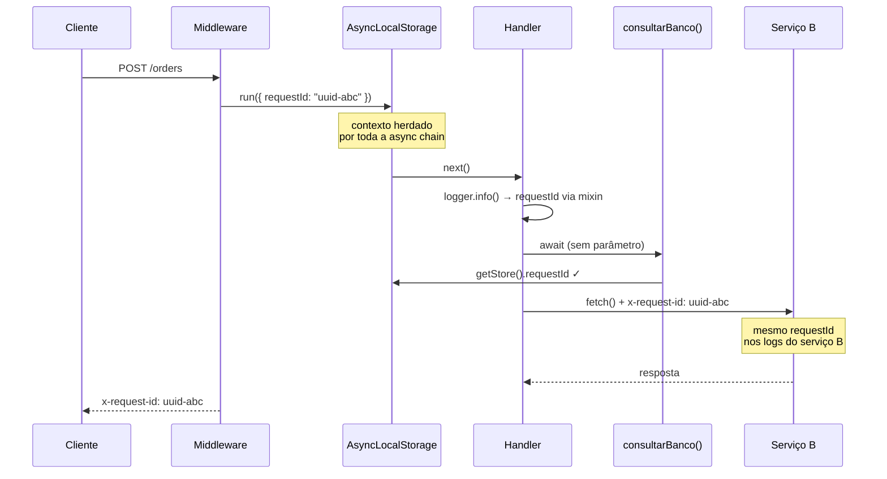

# Correlation IDs e context propagation

> [!abstract] TL;DR
> Um **correlation ID** é um identificador único gerado no início de cada requisição e carregado por todos os logs, métricas e traces produzidos durante aquele ciclo de vida — sem ele, logs de 200 requisições concorrentes se misturam e rastrear um bug vira arqueologia.
> `AsyncLocalStorage` (estável no Node 16+, módulo `node:async_hooks`) é o mecanismo nativo para propagar contexto de forma transparente por toda a cadeia assíncrona sem passar o ID como parâmetro em cada função.
> O padrão moderno é gerar o ID no middleware de entrada (ou reutilizar o `traceId` do header W3C `traceparent`), armazená-lo no `AsyncLocalStorage` e lê-lo em serializers do pino e em spans do OpenTelemetry.
> Em microsserviços, o ID deve ser encaminhado nos headers das chamadas HTTP de saída (`x-request-id` ou `traceparent`) para que o serviço downstream possa continuar o mesmo "fio" de observabilidade.

Esta nota aprofunda a correlação entre os três pilares apresentados em [[02 - Logging estruturado com pino]] e faz parte do galho [[03-Dominios/Tecnologia/Node/Observability e produção/index]]. A integração completa com spans é detalhada em [[06 - Tracing distribuído com OpenTelemetry]].

---

## O que é

Em um servidor Node.js que atende dezenas de requisições simultâneas, todas compartilham o mesmo processo. Os logs de todas essas requisições são escritos no mesmo stream de saída — e sem algum campo de correlação, o resultado é um entrelaçamento caótico:

```
[12:00:01.001] INFO  Recebendo requisição POST /orders
[12:00:01.002] INFO  Recebendo requisição GET  /users/42
[12:00:01.010] INFO  Consultando banco de dados
[12:00:01.015] INFO  Consultando banco de dados
[12:00:01.050] ERROR Timeout ao conectar no banco
[12:00:01.055] INFO  Usuário encontrado
```

Qual requisição sofreu o timeout? Qual era o payload? Quem foi o usuário? Impossível saber sem olhar o código, adivinhar, ou ter um sistema de tríagem manual caro.

Um **correlation ID** (também chamado de _request ID_, _trace ID_ ou _context ID_ dependendo do contexto) é um identificador único atribuído a cada requisição no momento em que ela entra no sistema. Esse ID é então:

- **embutido em todos os logs** produzidos durante o processamento daquela requisição;
- **incluído em métricas** como label para permitir drill-down;
- **associado a spans de tracing** como `traceId`;
- **propagado nos headers HTTP** de chamadas a serviços downstream.

Com o correlation ID, o log acima se transforma em:

```json
{"time":"12:00:01.001","requestId":"a1b2c3","msg":"Recebendo requisição POST /orders"}
{"time":"12:00:01.002","requestId":"d4e5f6","msg":"Recebendo requisição GET /users/42"}
{"time":"12:00:01.010","requestId":"a1b2c3","msg":"Consultando banco de dados"}
{"time":"12:00:01.015","requestId":"d4e5f6","msg":"Consultando banco de dados"}
{"time":"12:00:01.050","requestId":"a1b2c3","level":"error","msg":"Timeout ao conectar no banco"}
{"time":"12:00:01.055","requestId":"d4e5f6","msg":"Usuário encontrado"}
```

Agora `jq 'select(.requestId=="a1b2c3")'` isola imediatamente os 3 eventos do POST /orders com problema.

---

## Por que importa

### O pesadelo dos microsserviços sem correlação

Em um sistema monolítico, um stack trace já localiza o problema. Em uma arquitetura de microsserviços com dez serviços, uma única operação de negócio pode gerar logs em quatro serviços diferentes, cada um com seu próprio sistema de logging, cada um com timestamps ligeiramente diferentes (NTP drift), cada um com sua própria noção de "o que aconteceu".

Sem correlation IDs, o SRE de plantão olha para um dashboard mostrando erro 500 no `checkout-service` às 03:47 e precisa:

1. Identificar em qual instância do `checkout-service` ocorreu o erro;
2. Puxar os logs daquela instância naquele intervalo de tempo;
3. Adivinhar qual `order-service` foi chamado e quando;
4. Cruzar manualmente os timestamps;
5. Torcer para que os clocks estejam sincronizados.

Isso pode levar 30-60 minutos. Com correlation IDs, é uma query: `traceId:abc123`.

### Por que o Node precisa de uma solução explícita

Em linguagens com thread-por-request (Java, PHP tradicional), é trivial guardar o correlation ID em uma variável local à thread (ThreadLocal). Em Node.js, que é single-threaded com event loop, não existe "thread local" — uma async chain pode passar por dezenas de callbacks e microtasks, e a stack original se perde.

Antes do `AsyncLocalStorage`, as soluções eram gambiarras: `cls-hooked` (baseado no API `domain`, depreciado), passar o ID explicitamente em todos os parâmetros, ou usar objetos globais mutáveis (perigo de vazamento entre requisições).

### Relevância em entrevistas

Correlation IDs aparecem em perguntas sobre:

- "Como você implementaria distributed tracing do zero?"
- "Como você garantiria que logs de uma mesma requisição possam ser filtrados?"
- "O que é context propagation em microsserviços?"

---

## Como funciona

O fluxo completo de propagação: o middleware gera um `requestId`, armazena no `AsyncLocalStorage`, e toda a cadeia assíncrona downstream — handlers, funções de serviço, chamadas a banco — lê esse ID sem recebê-lo como parâmetro. Nas chamadas para outros serviços, o ID viaja no header HTTP para que o serviço B continue o mesmo "fio".



### AsyncLocalStorage — o mecanismo nativo

`AsyncLocalStorage` é uma classe disponível em `node:async_hooks`. Disponível desde Node 12.17 (experimental), sem flag desde Node 14, **estável desde Node 16**. Para produção, exija Node 16+. Ela implementa um storage que é automaticamente **herdado por toda a cadeia assíncrona** iniciada dentro de um `run()`, sem necessidade de passar o contexto como parâmetro.

```typescript
// context-store.ts
import { AsyncLocalStorage } from 'node:async_hooks';

export interface RequestContext {
  requestId: string;
  userId?: string;
  startTime: number;
  traceId?: string; // preenchido pelo otel-bridge após o span ser criado
}

// Uma única instância por módulo — é thread-safe por design do Node
export const asyncLocalStorage = new AsyncLocalStorage<RequestContext>();

// Helpers convenientes
export function getStore(): RequestContext | undefined {
  return asyncLocalStorage.getStore();
}

export function getRequestId(): string {
  return asyncLocalStorage.getStore()?.requestId ?? 'no-context';
}
```

O padrão de uso é `store.run(context, callback)`: tudo que for executado dentro de `callback` — incluindo todas as Promises e callbacks assíncronos que nascerem daí — enxerga o mesmo objeto `context` via `getStore()`.

```typescript
// Exemplo básico de run() e getStore()
import { asyncLocalStorage, getRequestId } from './context-store';

async function consultarBanco(): Promise<string> {
  // Não precisa receber requestId como parâmetro
  const requestId = getRequestId();
  console.log(`[${requestId}] Executando query`);
  await new Promise(resolve => setTimeout(resolve, 10)); // simula I/O
  console.log(`[${requestId}] Query concluída`);
  return 'resultado';
}

async function processarRequisicao(requestId: string): Promise<void> {
  const context = { requestId, startTime: Date.now() };

  await asyncLocalStorage.run(context, async () => {
    // Tudo aqui dentro — e em qualquer async que nascer aqui — herda o contexto
    console.log(`[${getRequestId()}] Iniciando processamento`);
    const resultado = await consultarBanco(); // contexto propagado automaticamente
    console.log(`[${getRequestId()}] Resultado: ${resultado}`);
  });
}

// Simulação de duas requisições concorrentes
Promise.all([
  processarRequisicao('req-aaa'),
  processarRequisicao('req-bbb'),
]);
// Saída (intercalada, mas IDs corretos):
// [req-aaa] Iniciando processamento
// [req-bbb] Iniciando processamento
// [req-aaa] Executando query
// [req-bbb] Executando query
// [req-aaa] Query concluída
// [req-bbb] Query concluída
// [req-aaa] Resultado: resultado
// [req-bbb] Resultado: resultado
```

O ponto crucial: `consultarBanco` não recebe `requestId` como parâmetro e mesmo assim o exibe corretamente para cada requisição, sem nenhuma variável global.

### Geração e injeção do correlation ID

O correlation ID deve ser gerado **antes** de qualquer trabalho assíncrono. O local correto é o middleware de entrada HTTP, que é o primeiro código a rodar para cada requisição.

Estratégias de geração:

| Estratégia | Prós | Contras |
|---|---|---|
| `crypto.randomUUID()` | Nativo, sem dependência | 36 chars com hifens |
| `nanoid()` | Compacto (21 chars), URL-safe | Dependência extra |
| Reutilizar `traceId` do OTel | Correlação automática com spans | Depende do OTel estar ativo |
| Extrair do header `traceparent` | Compatível com W3C TraceContext | Requer parsing do header |

O header `traceparent` segue o formato W3C TraceContext:

```
traceparent: 00-{traceId-32hex}-{spanId-16hex}-{flags-2hex}
              00-4bf92f3577b34da6a3ce929d0e0e4736-00f067aa0ba902b7-01
```

Na prática, o middleware verifica na seguinte ordem:

1. Existe `traceparent` no request? → extrai o `traceId` (16 bytes / 32 hex chars);
2. Existe `x-request-id`? → usa como correlation ID;
3. Nenhum dos dois? → gera um novo UUID.

```typescript
// middleware/correlation-id.ts
import { randomUUID } from 'node:crypto';

/**
 * Extrai o traceId de um header W3C traceparent.
 * Formato: 00-{traceId}-{spanId}-{flags}
 */
const HEX_32 = /^[0-9a-f]{32}$/

export function extractTraceId(traceparent: string | undefined): string | null {
  if (!traceparent) return null;
  const parts = traceparent.split('-');
  // versão(0) + traceId(1) + spanId(2) + flags(3)
  if (parts.length !== 4 || !HEX_32.test(parts[1])) return null;
  return parts[1];
}

export function resolveCorrelationId(headers: Record<string, string | string[] | undefined>): string {
  const traceparent = headers['traceparent'] as string | undefined;
  const requestId = headers['x-request-id'] as string | undefined;

  return extractTraceId(traceparent) ?? requestId ?? randomUUID();
}
```

### Propagação automática com AsyncLocalStorage

Uma vez que o contexto está no `AsyncLocalStorage`, ele se propaga automaticamente para `Promise.then`, `await`, `setTimeout`, `setImmediate`, e callbacks de I/O do Node — tudo que usa a maquinaria de async hooks internamente.

```typescript
// Demonstração: contexto disponível em toda a cadeia async
import { asyncLocalStorage, getRequestId } from './context-store';
import { randomUUID } from 'node:crypto';

async function nivel3(): Promise<void> {
  // Três níveis de async abaixo do run() — ainda funciona
  await new Promise(resolve => setImmediate(resolve));
  console.log(`nivel3 — requestId: ${getRequestId()}`);
}

async function nivel2(): Promise<void> {
  await new Promise(resolve => setTimeout(resolve, 5));
  await nivel3();
  console.log(`nivel2 — requestId: ${getRequestId()}`);
}

async function nivel1(): Promise<void> {
  await nivel2();
  console.log(`nivel1 — requestId: ${getRequestId()}`);
}

asyncLocalStorage.run({ requestId: randomUUID(), startTime: Date.now() }, async () => {
  await nivel1();
});
```

**Armadilha com `Promise.all`**: cada branch do `Promise.all` herda o mesmo contexto do ponto de criação, então funciona corretamente. O problema seria se você chamar `asyncLocalStorage.run()` dentro de um dos branches para criar um sub-contexto — os outros branches não seriam afetados (o que geralmente é o comportamento desejado).

```typescript
// Promise.all propaga corretamente o contexto pai
asyncLocalStorage.run({ requestId: 'req-xyz', startTime: Date.now() }, async () => {
  await Promise.all([
    consultarUsuario(),    // vê requestId: req-xyz
    consultarProdutos(),   // vê requestId: req-xyz
    consultarEstoque(),    // vê requestId: req-xyz
  ]);
});
```

### Integração com logs, métricas e traces

O verdadeiro poder do `AsyncLocalStorage` aparece quando os três pilares de observabilidade passam a ler o correlation ID de forma automática:

**Pino via mixin**: o campo `requestId` é injetado em cada log sem chamadas explícitas.

```typescript
// logger.ts
import pino from 'pino';
import { getStore } from './context-store';

export const logger = pino({
  level: process.env.LOG_LEVEL ?? 'info',
  mixin() {
    // Chamado toda vez que um log é emitido
    const store = getStore();
    if (!store) return {};
    return {
      requestId: store.requestId,
      userId: store.userId,
    };
  },
});
```

**OpenTelemetry**: ao criar um span, o `traceId` do span ativo pode ser sincronizado com o `requestId` do store para que logs e traces sejam correlacionáveis por ID.

```typescript
// otel-bridge.ts
import { trace } from '@opentelemetry/api';
import { getStore } from './context-store';

export function enrichSpanWithRequestId(): void {
  const store = getStore();
  if (!store) return;

  const activeSpan = trace.getActiveSpan();
  if (activeSpan) {
    activeSpan.setAttribute('app.requestId', store.requestId);
    // Também podemos adicionar o traceId ao store para aparecer nos logs
    // Adicionado uma vez no setup, antes de qualquer leitura concorrente —
    // diferente da mutação durante o handler (ver Armadilhas)
    const traceId = activeSpan.spanContext().traceId;
    store.traceId = traceId;
  }
}
```

Com isso, uma entrada de log contém `requestId` (gerado pelo app), e o sistema de tracing contém `app.requestId` como atributo do span — permitindo navegar de um log para o span correspondente.

---

## Casos práticos

### Cenário 1: Middleware Express com AsyncLocalStorage

O middleware deve ser o primeiro da cadeia — antes de qualquer lógica de negócio — para garantir que o contexto esteja disponível desde o instante zero da requisição. Ele resolve o `requestId` na ordem de prioridade: `traceparent` W3C > `x-request-id` > novo UUID gerado localmente.

Middleware completo para Express que integra todas as peças:

```typescript
// middleware/request-context.middleware.ts
import { Request, Response, NextFunction } from 'express';
import { randomUUID } from 'node:crypto';
import { asyncLocalStorage, RequestContext } from '../context-store';
import { logger } from '../logger';

/**
 * Extrai o traceId do header W3C traceparent.
 * Formato: 00-{32hex traceId}-{16hex spanId}-{2hex flags}
 */
const HEX_32 = /^[0-9a-f]{32}$/

function extractTraceId(traceparent: string | undefined): string | null {
  if (!traceparent) return null;
  const parts = traceparent.split('-');
  if (parts.length !== 4 || !HEX_32.test(parts[1])) return null;
  return parts[1];
}

export function requestContextMiddleware(
  req: Request,
  res: Response,
  next: NextFunction,
): void {
  // 1. Resolver o correlation ID: traceparent > x-request-id > novo UUID
  const traceparent = req.headers['traceparent'] as string | undefined;
  const incomingRequestId = req.headers['x-request-id'] as string | undefined;
  const requestId = extractTraceId(traceparent) ?? incomingRequestId ?? randomUUID();

  // 2. Montar o contexto da requisição
  const context: RequestContext = {
    requestId,
    startTime: Date.now(),
    userId: undefined, // será preenchido pelo middleware de autenticação
  };

  // 3. Rodar toda a cadeia de handlers dentro do AsyncLocalStorage
  asyncLocalStorage.run(context, () => {
    // 4. Expor o ID no header de resposta para o cliente e serviços downstream
    res.setHeader('x-request-id', requestId);

    // 5. Log de início da requisição (requestId já vem do mixin do pino)
    logger.info({ method: req.method, path: req.path }, 'Request received');

    // 6. Log de fim com duração ao fechar a resposta
    // Context propagates through event emitter listeners registered inside run()
    // Verified behavior on Node 18+; test on older versions if targeting Node 16
    res.on('finish', () => {
      // getStore() works here on Node 18+
      const duration = Date.now() - context.startTime;
      logger.info(
        { method: req.method, path: req.path, status: res.statusCode, duration },
        'Request completed',
      );
    });

    next();
  });
}
```

Registro no app Express:

```typescript
// app.ts
import express from 'express';
import { requestContextMiddleware } from './middleware/request-context.middleware';
import { logger } from './logger';

const app = express();

// Deve ser o PRIMEIRO middleware — antes de qualquer lógica de negócio
app.use(requestContextMiddleware);
app.use(express.json());

app.get('/orders/:id', async (req, res) => {
  // Não precisa passar requestId — o pino injeta automaticamente via mixin
  logger.info({ orderId: req.params.id }, 'Fetching order');
  // ... lógica de negócio
  res.json({ orderId: req.params.id, status: 'ok' });
});

app.listen(3000, () => logger.info('Server running on :3000'));
```

### Cenário 2: Hook Fastify com onRequest — variação sem Express

Fastify usa o hook `onRequest` no lugar de middleware. A lógica é idêntica, mas o Fastify já injeta `req.id` automaticamente — o que significa que você pode usar `req.id` como `requestId` sem precisar extrair ou gerar manualmente, a menos que queira reutilizar o `traceId` de um header W3C `traceparent` de entrada.

```typescript
// plugin/request-context.plugin.ts
import fp from 'fastify-plugin';
import { FastifyPluginAsync } from 'fastify';
import { randomUUID } from 'node:crypto';
import { asyncLocalStorage, RequestContext } from '../context-store';
import { logger } from '../logger';

const HEX_32 = /^[0-9a-f]{32}$/;

function extractTraceId(traceparent: string | undefined): string | null {
  if (!traceparent) return null;
  const parts = traceparent.split('-');
  if (parts.length !== 4 || !HEX_32.test(parts[1])) return null;
  return parts[1];
}

const requestContextPlugin: FastifyPluginAsync = async (app) => {
  app.addHook('onRequest', (req, reply, done) => {
    // 1. Resolver o requestId: traceparent W3C > x-request-id > Fastify req.id
    const traceparent = req.headers['traceparent'] as string | undefined;
    const incoming = req.headers['x-request-id'] as string | undefined;
    const requestId = extractTraceId(traceparent) ?? incoming ?? req.id;

    // 2. Montar contexto e iniciar o store
    const context: RequestContext = { requestId, startTime: Date.now() };

    asyncLocalStorage.run(context, () => {
      // 3. Expor no header de resposta
      reply.header('x-request-id', requestId);
      done();
    });
  });

  app.addHook('onResponse', (req, reply, done) => {
    // getStore() ainda disponível pois o mesmo run() ainda está ativo
    const store = asyncLocalStorage.getStore();
    if (store) {
      logger.info(
        {
          method: req.method,
          url: req.url,
          statusCode: reply.statusCode,
          durationMs: Date.now() - store.startTime,
        },
        'Request completed',
      );
    }
    done();
  });
};

export default fp(requestContextPlugin);
```

Registro no app Fastify:

```typescript
// app.ts
import Fastify from 'fastify';
import requestContextPlugin from './plugin/request-context.plugin';

const app = Fastify({ logger: false }); // pino gerenciado pelo nosso módulo

// Registrar antes de qualquer outra rota ou plugin
await app.register(requestContextPlugin);

app.get('/orders/:id', async (req) => {
  // logger.info já injeta requestId automaticamente via mixin
  logger.info({ orderId: req.params.id }, 'Fetching order');
  // ...
  return { orderId: req.params.id };
});
```

A diferença-chave em relação ao Express: `asyncLocalStorage.run()` chama `done()` de dentro do callback — garantindo que todo o processamento posterior do Fastify aconteça dentro do contexto ativo.

---

## Propagação para serviços downstream

Quando o serviço A chama o serviço B, o correlation ID deve ser incluído nos headers da requisição de saída. Dessa forma, o serviço B pode extrair o mesmo ID e continuar o "fio" de observabilidade sem gerar um novo ID.

```typescript
// http-client.ts
import { getRequestId } from './context-store';

/**
 * Wrapper sobre fetch que propaga automaticamente o correlation ID
 * para serviços downstream via x-request-id.
 */
export async function fetchWithCorrelation(
  url: string,
  options: RequestInit = {},
): Promise<Response> {
  const requestId = getRequestId();

  const headers = new Headers(options.headers);
  headers.set('x-request-id', requestId);
  // Se você usar W3C TraceContext, propague também o traceparent
  // headers.set('traceparent', buildTraceparent(requestId));

  return fetch(url, { ...options, headers });
}

// Uso em qualquer parte do código — sem passar requestId como parâmetro
async function buscarEstoque(produtoId: string): Promise<number> {
  const response = await fetchWithCorrelation(
    `https://estoque-service/produtos/${produtoId}`,
  );
  const data = await response.json();
  return data.quantidade;
}
```

Com esse padrão, o log do `estoque-service` terá o mesmo `requestId` que o log do serviço que o chamou, permitindo que uma query `requestId:abc123` retorne logs de todos os serviços envolvidos em uma única operação de negócio.

---

## Armadilhas comuns

> [!warning] Gerar o ID após código assíncrono
> **O que acontece:** Qualquer código executado antes do `asyncLocalStorage.run()` chama `getStore()` e recebe `undefined` — o contexto não existe ainda. Logs emitidos nesses pontos ficam sem `requestId`.
> **Por quê:** `AsyncLocalStorage` propaga o contexto apenas para chains que nascem *dentro* do `run()`. Código que já estava em execução antes do `run()` não é afetado retroativamente.
> **Como evitar:** O `asyncLocalStorage.run()` deve ser o primeiro passo do middleware — antes de qualquer `await`, autenticação ou leitura de body.

```typescript
// ERRADO — o run() começa depois do primeiro await
app.use(async (req, res, next) => {
  await autenticarToken(req); // contexto ainda não existe aqui!
  const requestId = randomUUID();
  asyncLocalStorage.run({ requestId, startTime: Date.now() }, () => next());
});

// CORRETO — o run() é o primeiro passo
app.use((req, res, next) => {
  const requestId = randomUUID();
  asyncLocalStorage.run({ requestId, startTime: Date.now() }, () => next());
});
```

> [!warning] Não propagar o ID nos headers de saída
> **O que acontece:** O serviço downstream gera um novo `requestId`, quebrando o "fio" de observabilidade. Uma query `requestId:abc123` no Datadog retorna logs apenas do serviço A — os do serviço B não aparecem porque têm outro ID.
> **Por quê:** `AsyncLocalStorage` é local ao processo. Para cruzar a fronteira do processo, o ID precisa viajar explicitamente no header HTTP de cada chamada de saída.
> **Como evitar:** Crie um wrapper sobre `fetch`/`axios`/`got` que lê `getRequestId()` do store e injeta automaticamente o header `x-request-id` em todas as chamadas de saída.

> [!warning] Usar `cls-hooked` ou `domain` em vez de `AsyncLocalStorage`
> **O que acontece:** Comportamentos imprevisíveis com Promises modernas — contexto vazando entre requisições, IDs trocados, ou context `undefined` em pontos onde deveria existir.
> **Por quê:** `domain` está marcado como depreciado desde Node 4 e não funciona corretamente com a maquinaria de async hooks moderna. `cls-hooked` é construído sobre `domain` e herda todos esses problemas.
> **Como evitar:** Use `AsyncLocalStorage` de `node:async_hooks` — é a API oficial, mantida pela equipe do Node, estável desde Node 16, e sem dependências externas.

> [!warning] Confundir `requestId` com `traceId` (W3C traceparent)
> **O que acontece:** Você mantém dois IDs separados — um no seu app (`x-request-id`) e um no sistema de tracing (`traceId` do span OTel) — e não consegue navegar de um log para o span correspondente ou vice-versa.
> **Por quê:** `requestId` (header `x-request-id`) é um identificador interno do app, formato livre. `traceId` é parte do header W3C `traceparent` (128 bits / 32 hex chars), padronizado entre Jaeger, Zipkin, Datadog. São conceitos relacionados mas por default têm valores distintos.
> **Como evitar:** Use o `traceId` do OpenTelemetry como `requestId` do app — extraia-o do header `traceparent` de entrada ou do span ativo criado pelo OTel. Assim um único ID funciona tanto nos logs quanto nas ferramentas de tracing.

> [!warning] Modificar o store diretamente pode causar vazamento entre branches
> **O que acontece:** A modificação de um campo do store em um branch assíncrono é visível em todos os outros branches que compartilham o mesmo objeto — pois `getStore()` retorna uma referência, não uma cópia.
> **Por quê:** `AsyncLocalStorage` copia a *referência* ao objeto de contexto para cada branch, não o objeto em si. Mutações são compartilhadas por todos que apontam para o mesmo objeto.
> **Como evitar:** Para criar sub-contextos isolados, use `asyncLocalStorage.run({ ...getStore(), userId: '42' }, callback)` — cria um novo objeto com os campos do pai mais os novos, sem afetar o contexto original.

---

## O que vem a seguir

Com os correlation IDs propagando automaticamente por `AsyncLocalStorage`, o próximo passo é conectar esse contexto ao sistema de tracing distribuído — fazendo com que logs e spans compartilhem o mesmo `traceId` e sejam correlacionáveis por uma única query em qualquer ferramenta de observabilidade.

- [[06 - Tracing distribuído com OpenTelemetry]] — integração completa do `traceId` OTel com o `requestId` da aplicação; como o `otel-bridge` sincroniza os dois IDs
- [[02 - Logging estruturado com pino]] — mixin do pino que lê `requestId` do `AsyncLocalStorage` automaticamente; `redact` e serializers que garantem campos obrigatórios em cada log
- [[04 - Métricas com prom-client]] — como evitar usar o `requestId` como label de métrica (alta cardinalidade) e o que usar no lugar
- [[01 - Os três pilares - logs, métricas e traces]] — o triângulo de diagnóstico que o correlation ID une: alerta (métrica) → trace → log

## Em entrevista

**What is a correlation ID and why is it important?**
A correlation ID is a unique identifier, typically a UUID or a W3C trace ID, that is generated at the entry point of a request and attached to every log entry, metric label, and trace span produced during that request's lifecycle. Without it, in a high-concurrency Node.js server, log entries from hundreds of concurrent requests are interleaved in the same output stream, making it impossible to isolate the sequence of events that led to a specific error.

**Why is AsyncLocalStorage the modern approach for context propagation in Node.js?**
`AsyncLocalStorage`, available natively in `node:async_hooks` since Node 16, provides a per-async-chain storage that is automatically inherited by all child Promises, callbacks, and async operations that are spawned within an `asyncLocalStorage.run()` call. This means the correlation ID can be stored once at the request boundary and read anywhere downstream — in service functions, database clients, logger serializers — without passing it as a function parameter, which would pollute every function signature in the codebase. Older approaches like `domain` or the `cls-hooked` library are deprecated and should not be used.

**How do you propagate context across microservice boundaries?**
When service A makes an outgoing HTTP call to service B, it must include the correlation ID in the request headers — typically as `x-request-id` for internal convention, or as `traceparent` if following the W3C TraceContext standard. Service B's request middleware then extracts the incoming ID instead of generating a new one, stores it in its own `AsyncLocalStorage`, and continues producing logs and spans with the same ID. This creates a unified thread of observability across all services involved in a single business operation, which can then be queried by a single `requestId` in a log aggregation tool like Datadog or Loki.

---

## Vocabulário

| Português | English |
|---|---|
| Correlação (de logs/traces) | Correlation |
| Propagação de contexto | Context propagation |
| Armazenamento local assíncrono | Async local storage |
| Cabeçalho HTTP | HTTP header |
| Middleware de entrada | Ingress middleware |
| Rastreamento distribuído | Distributed tracing |
| Âncora de contexto | Context anchor |
| Contexto W3C TraceContext | W3C TraceContext |
| Identificador de requisição | Request ID / correlation ID |
| Serializer de log | Log serializer |
| Cadeia assíncrona | Async chain |
| Herança de contexto | Context inheritance |

---

## Fontes

- [Node.js Docs — AsyncLocalStorage](https://nodejs.org/api/async_context.html#class-asynclocalstorage)
- [W3C TraceContext Specification](https://www.w3.org/TR/trace-context/)
- [OpenTelemetry Context Propagation](https://opentelemetry.io/docs/concepts/context-propagation/)
- [Pino — mixin option](https://getpino.io/#/docs/api?id=mixin-function)
