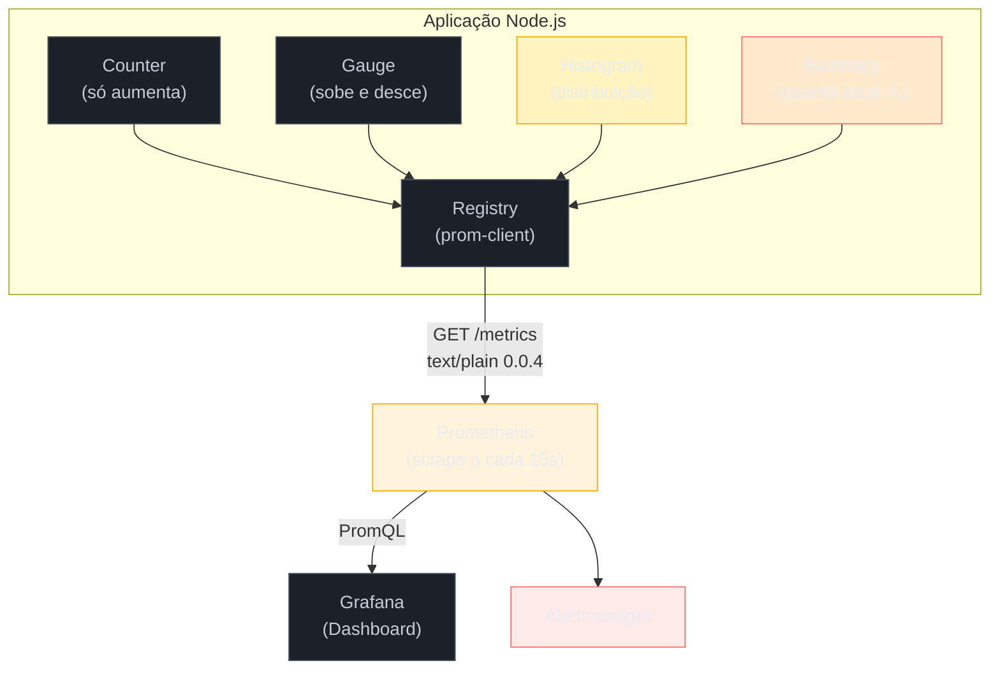

# Métricas com prom-client

> [!abstract] TL;DR
> `prom-client` é a biblioteca oficial da comunidade Node.js para expor métricas no formato Prometheus — instale, crie um `Registry`, chame `collectDefaultMetrics()` e exponha `/metrics`. Os quatro tipos de métrica cobrem casos distintos: Counter (contagem acumulada), Gauge (valor instantâneo), Histogram (distribuição) e Summary (quantis client-side, evite em múltiplas instâncias). Histograms são a ferramenta certa para latência — permitem calcular p50/p95/p99 via `histogram_quantile` no PromQL sem guardar cada observação individual. Alta cardinalidade em labels é o erro mais comum e mais destrutivo: usar `userId` ou `traceId` como label pode causar OOM no Prometheus em minutos.

Esta nota faz parte do [[03-Dominios/Tecnologia/Node/Observability e produção/index]] e detalha instrumentação de métricas. Leia [[01 - Os três pilares - logs, métricas e traces]] antes para entender o contexto dos três pilares. A nota seguinte, [[05 - Node-specific metrics - event loop lag, GC, heap]], expande as métricas de runtime incluídas por `collectDefaultMetrics`.

## Pipeline prom-client → Prometheus → Grafana

A aplicação nunca empurra dados: ela apenas mantém estado em memória e responde quando o Prometheus pergunta. Counter e Gauge são os primitivos mais seguros de usar; Histogram exige cuidado com a escolha de buckets; Summary (vermelho no diagrama) nunca deve ser usado em ambientes multi-pod — quantis calculados por instância não podem ser agregados de forma matematicamente correta.



## O que é

**Prometheus** é um sistema de monitoramento e banco de dados de séries temporais open-source, criado pela SoundCloud em 2012 e hoje parte da CNCF. Ele coleta métricas via **modelo pull (scrape)**: o servidor Prometheus faz HTTP GET periodicamente no endpoint `/metrics` de cada serviço. Isso é diferente do modelo push (Statsd, Datadog Agent), onde o serviço envia métricas ativamente para um coletor externo.

**prom-client** é a biblioteca Node.js que implementa o cliente Prometheus: ela mantém o estado das métricas em memória, expõe o formato de texto esperado pelo Prometheus e inclui coleta automática de métricas do runtime Node.js.

**Grafana** é a camada de visualização: consome os dados do Prometheus via PromQL e renderiza dashboards. A combinação Prometheus + Grafana + prom-client é o stack de observability de métricas mais comum no ecossistema Node.js, presente em projetos como NestJS (plugin nativo), Fastify (plugin oficial) e Express (middleware customizado).

### Os quatro tipos de métrica Prometheus

| Tipo | Quando usar | Exemplo real |
|---|---|---|
| **Counter** | Contagem que só sobe (reinicia apenas com restart do processo) | Total de requisições HTTP, total de erros, total de jobs processados |
| **Gauge** | Valor que sobe e desce livremente | Conexões ativas, tamanho da fila, uso de memória heap, temperatura |
| **Histogram** | Distribuição de valores observados em buckets predefinidos | Duração de requisições HTTP, tamanho de payloads, tempo de query no banco |
| **Summary** | Quantis calculados client-side sobre uma janela deslizante | Duração de operações em ambiente de instância única (use Histogram de preferência) |

> [!info] Histogram vs Summary
> A diferença prática mais importante: **Histogram** permite agregar percentis entre múltiplas instâncias via PromQL (`histogram_quantile`). **Summary** calcula quantis no processo Node — em ambientes com 10 instâncias do serviço, cada instância mantém seu próprio resumo e você não consegue calcular o p99 global corretamente. Use Histogram para latência em produção com múltiplas instâncias.

## Por que importa

### O modelo scrape vs push

No modelo **push** (Statsd, Datadog Agent), cada evento é enviado em tempo real para um agregador externo. Isso gera overhead de rede por evento e cria acoplamento entre o serviço e o coletor — se o coletor estiver indisponível, você perde métricas ou precisa de buffer local.

No modelo **scrape** (Prometheus), o serviço acumula estado em memória e o Prometheus coleta sob demanda a cada intervalo (tipicamente 15s). As vantagens:
- Zero overhead de rede por evento — apenas uma escrita em memória
- O serviço não sabe quem o consome — desacoplamento completo
- Prometheus controla o ritmo — se o serviço estiver lento, o scrape timeout detecta o problema
- Service discovery automático via Kubernetes, Consul, etc.

A desvantagem do modelo scrape é a resolução temporal: com scrape de 15s, você não detecta spikes sub-segundo. Para esse caso, histograms com `rate()` no PromQL ainda entregam a tendência corretamente.

### Por que prom-client + Prometheus + Grafana

A tríade é o padrão de facto por razões práticas:

1. **Ecossistema maduro**: `prom-client` tem tipos TypeScript nativos, suporte a ESM e CJS, e integração com todos os frameworks Node principais
2. **Métricas de runtime incluídas**: `collectDefaultMetrics()` instrumenta automaticamente heap size, GC duration, event loop lag, handles ativos — coisas que você pagaria caro para implementar manualmente
3. **PromQL é expressivo**: calcular p99, taxa de erros por rota, saturação de conexões — tudo com queries de 1–2 linhas
4. **Grafana tem dashboards prontos**: o dashboard `1860` (Node.js dashboard) do Grafana Labs funciona com zero configuração além do `collectDefaultMetrics`
5. **Kubernetes-native**: Prometheus Operator transforma CRDs em configuração de scrape automático

## Como funciona

### Instalação e setup do registro

```bash
npm install prom-client
# prom-client 15.x inclui tipos TypeScript nativos — não precisa @types/prom-client
```

A abstração central é o `Registry`: um container que mantém todas as métricas registradas e sabe serializá-las no formato Prometheus. Por padrão, `prom-client` exporta um `register` global singleton — use-o para evitar duplicação de métricas entre módulos.

```typescript
// src/metrics/registry.ts
import {
  Registry,
  collectDefaultMetrics,
  Counter,
  Gauge,
  Histogram,
} from 'prom-client';

// Usando o singleton global (recomendado na maioria dos casos)
import { register } from 'prom-client';

// Habilita coleta automática de métricas do runtime Node.js:
// - nodejs_heap_size_total_bytes / nodejs_heap_size_used_bytes
// - nodejs_gc_duration_seconds (por tipo de GC: minor, major, incremental)
// - nodejs_eventloop_lag_seconds / nodejs_eventloop_lag_p99_seconds
// - nodejs_active_handles_total / nodejs_active_requests_total
// - process_cpu_seconds_total / process_resident_memory_bytes
collectDefaultMetrics({ register });

export { register };
```

> [!warning] Registry duplicado
> Se você instanciar `new Registry()` em mais de um módulo sem compartilhar a referência, vai ter múltiplos registros não sincronizados. O singleton `register` exportado pelo `prom-client` resolve isso. Se precisar de um registro isolado (ex: testes), crie um `new Registry()` e passe-o explicitamente para cada métrica via opção `registers: [myRegistry]`.

O endpoint `/metrics` precisa retornar o conteúdo do registro com o Content-Type correto:

```typescript
// src/routes/metrics.ts (Express)
import { Router } from 'express';
import { register } from '../metrics/registry';

const router = Router();

router.get('/metrics', async (req, res) => {
  res.setHeader('Content-Type', register.contentType);
  // register.contentType === 'text/plain; version=0.0.4; charset=utf-8'
  res.end(await register.metrics());
});

export default router;
```

### Counter e Gauge

**Counter** é a métrica mais simples: começa em zero, só aumenta, e reinicia quando o processo reinicia. Use para contar eventos: requisições recebidas, erros ocorridos, jobs enfileirados, emails enviados.

```typescript
// src/metrics/counters.ts
import { Counter } from 'prom-client';
import { register } from './registry';

// Counter simples (sem labels)
export const jobsProcessed = new Counter({
  name: 'jobs_processed_total',
  help: 'Total de jobs processados com sucesso',
  registers: [register],
});

// Counter com labels — permite filtrar/agrupar no PromQL
export const httpRequestsTotal = new Counter({
  name: 'http_requests_total',
  help: 'Total de requisições HTTP recebidas',
  labelNames: ['method', 'route', 'status_code'] as const,
  registers: [register],
});

// Uso:
jobsProcessed.inc();                    // incrementa 1
jobsProcessed.inc(5);                   // incrementa 5
httpRequestsTotal.inc({ method: 'GET', route: '/users', status_code: '200' });
```

**Gauge** representa um valor instantâneo que pode subir e descer. Use para estados: conexões ativas, tamanho da fila, temperatura, uso de memória customizado, número de usuários online.

```typescript
// src/metrics/gauges.ts
import { Gauge } from 'prom-client';
import { register } from './registry';

export const activeConnections = new Gauge({
  name: 'active_connections',
  help: 'Número de conexões WebSocket ativas no momento',
  registers: [register],
});

export const queueSize = new Gauge({
  name: 'job_queue_size',
  help: 'Número de jobs aguardando processamento na fila',
  labelNames: ['queue_name'] as const,
  registers: [register],
});

// Uso:
activeConnections.inc();                // nova conexão
activeConnections.dec();                // conexão encerrada
activeConnections.set(42);             // valor absoluto (útil para sync com fonte externa)

queueSize.set({ queue_name: 'email' }, 15);
queueSize.set({ queue_name: 'sms' }, 3);
```

A diferença crítica: se o processo restartar, o Counter volta para zero (e você vê isso como uma queda no gráfico de `rate()`), enquanto o Gauge pode ser re-setado para o valor atual na primeira coleta.

### Histogram — latência e distribuição

O Histogram é a métrica mais importante para SLOs de latência. Ele divide os valores observados em **buckets** (intervalos) cumulativos e conta quantos valores caem em cada bucket. Isso permite calcular percentis no PromQL com `histogram_quantile` — sem guardar cada observação individual.

**Por que histograms > médias para latência:**

A média mascara bimodal distributions. Se 95% das requisições levam 10ms e 5% levam 2000ms, a média é ~110ms — um número que não representa a experiência de nenhum usuário. O p99 (percentil 99) mostra que 1% das requisições leva >2000ms — isso é o que o usuário "azarado" experimenta, e é o que você precisa otimizar para cumprir o SLO.

```typescript
// src/metrics/histograms.ts
import { Histogram } from 'prom-client';
import { register } from './registry';

// Buckets em segundos para latência HTTP
// Escolha buckets que fazem sentido para o seu domínio:
// - APIs internas rápidas: [0.001, 0.005, 0.01, 0.025, 0.05, 0.1, 0.25, 0.5]
// - APIs públicas gerais: [0.005, 0.01, 0.025, 0.05, 0.1, 0.25, 0.5, 1, 2.5, 5]
// - Processamento pesado: [0.1, 0.25, 0.5, 1, 2.5, 5, 10, 30, 60]
export const httpRequestDurationSeconds = new Histogram({
  name: 'http_request_duration_seconds',
  help: 'Duração das requisições HTTP em segundos',
  labelNames: ['method', 'route', 'status_code'] as const,
  buckets: [0.005, 0.01, 0.025, 0.05, 0.1, 0.25, 0.5, 1, 2.5, 5],
  registers: [register],
});

// Uso com observe() — valor já calculado:
httpRequestDurationSeconds.observe(
  { method: 'GET', route: '/users', status_code: '200' },
  0.042  // 42ms em segundos
);

// Uso com startTimer() — mais conveniente e menos propenso a erro:
async function handleRequest(route: string) {
  const endTimer = httpRequestDurationSeconds.startTimer({
    method: 'GET',
    route,
  });

  try {
    const result = await processRequest();
    endTimer({ status_code: '200' });  // chama endTimer com labels adicionais
    return result;
  } catch (err) {
    endTimer({ status_code: '500' });
    throw err;
  }
}
```

**Calculando p99 no PromQL:**

```promql
# p99 de latência por rota — últimos 5 minutos
histogram_quantile(
  0.99,
  sum(rate(http_request_duration_seconds_bucket[5m])) by (le, route)
)

# p50, p95, p99 de latência global
histogram_quantile(0.50, sum(rate(http_request_duration_seconds_bucket[5m])) by (le))
histogram_quantile(0.95, sum(rate(http_request_duration_seconds_bucket[5m])) by (le))
histogram_quantile(0.99, sum(rate(http_request_duration_seconds_bucket[5m])) by (le))

# Taxa de erro por rota (4xx + 5xx)
sum(rate(http_requests_total{status_code=~"[45].."}[5m])) by (route)
/
sum(rate(http_requests_total[5m])) by (route)
```

> [!tip] `startTimer()` vs `observe()`
> Prefira `startTimer()` para medir duração de operações assíncronas. Ele captura `process.hrtime()` internamente (resolução de nanosegundos) e retorna uma função que, quando chamada, calcula o delta e chama `observe()` automaticamente. Isso evita o erro de passar valores em milissegundos quando a métrica espera segundos.

### Labels e cardinalidade

Labels (rótulos) transformam uma métrica escalar em uma série multidimensional. Com labels `{method, route, status_code}`, você pode fatiar `http_requests_total` por rota, por método, por status, ou qualquer combinação — tudo com a mesma métrica.

**Cardinalidade** é o número de combinações de valores de labels possíveis. Alta cardinalidade = muitas séries temporais = alto uso de memória no Prometheus.

```typescript
// CORRETO — cardinalidade controlada
// method: ~5 valores (GET, POST, PUT, PATCH, DELETE)
// route: ~50 valores (rotas da aplicação)
// status_code: ~10 valores (200, 201, 400, 401, 403, 404, 409, 422, 500, 503)
// Total de séries: 5 × 50 × 10 = 2.500 séries — OK
const httpRequestsTotal = new Counter({
  name: 'http_requests_total',
  help: 'Total de requisições HTTP',
  labelNames: ['method', 'route', 'status_code'],
  registers: [register],
});

// httpRequestsTotal.inc({ method: 'GET', route: '/users', status_code: '200' });
```

```typescript
// ERRADO — alta cardinalidade causa OOM
// userId pode ter milhões de valores únicos
// Cada usuário único cria uma nova série no Prometheus
const requestsByUser = new Counter({
  name: 'http_requests_by_user_total',
  help: 'Total de requisições por usuário',
  labelNames: ['user_id'],  // ← ARMADILHA: nunca use IDs como label
  registers: [register],
});

// requestsByUser.inc({ user_id: req.user.id }); // NÃO FAÇA ISSO
```

```typescript
// CORRETO — se precisar rastrear por usuário, use logs estruturados
// Métricas: contagem agregada por papel/tier
const requestsByUserTier = new Counter({
  name: 'http_requests_by_tier_total',
  help: 'Total de requisições por tier de usuário',
  labelNames: ['tier'],  // 'free', 'pro', 'enterprise' — baixa cardinalidade
  registers: [register],
});
```

**Labels recomendados para métricas HTTP:**
- `method`: verbo HTTP (`GET`, `POST`, etc.) — ~5 valores
- `route`: padrão de rota normalizado (`/users/:id`, não `/users/123`) — ~50 valores
- `status_code`: código HTTP como string (`'200'`, `'404'`) — ~10 valores
- `service`: nome do serviço dependente (para métricas de chamadas externas)

> [!warning] Normalizar rotas é obrigatório
> Nunca use `req.url` diretamente como label de rota. `/users/123`, `/users/456` e `/users/789` são três rotas diferentes para o Prometheus, cada uma criando sua própria série. Use o padrão de rota do framework: `req.route.path` no Express, `req.routerPath` no Fastify.

## Casos práticos

### Cenário 1: API REST no Express — middleware de métricas HTTP

O middleware abaixo é um exemplo production-ready para Express. Ele registra `http_requests_total` (Counter) e `http_request_duration_seconds` (Histogram) com labels corretos e expõe o endpoint `/metrics`. O ponto-chave está no `res.on('finish')`: o evento dispara após o handler enviar a resposta, garantindo que o `status_code` final (que pode mudar durante o processamento) seja capturado corretamente.

```typescript
// src/middleware/metrics.middleware.ts
import { Request, Response, NextFunction, Router } from 'express';
import {
  Counter,
  Histogram,
  register,
  collectDefaultMetrics,
} from 'prom-client';

// Inicializar métricas de runtime do Node.js (heap, GC, event loop)
collectDefaultMetrics({ register });

// Counter: total de requisições com labels method/route/status_code
const httpRequestsTotal = new Counter({
  name: 'http_requests_total',
  help: 'Total de requisições HTTP recebidas',
  labelNames: ['method', 'route', 'status_code'] as const,
  registers: [register],
});

// Histogram: duração em segundos com buckets adequados para APIs HTTP
const httpRequestDurationSeconds = new Histogram({
  name: 'http_request_duration_seconds',
  help: 'Duração das requisições HTTP em segundos',
  labelNames: ['method', 'route', 'status_code'] as const,
  buckets: [0.005, 0.01, 0.025, 0.05, 0.1, 0.25, 0.5, 1, 2.5, 5],
  registers: [register],
});

// Middleware de instrumentação — registra em cada resposta
export function metricsMiddleware(
  req: Request,
  res: Response,
  next: NextFunction
): void {
  const endTimer = httpRequestDurationSeconds.startTimer();

  res.on('finish', () => {
    // req.route?.path normaliza '/users/:id' — evita alta cardinalidade
    const route = req.route?.path ?? req.path ?? 'unknown';
    const labels = {
      method: req.method,
      route,
      status_code: String(res.statusCode),
    };

    httpRequestsTotal.inc(labels);
    endTimer(labels);
  });

  next();
}

// Router com endpoint /metrics
export function metricsRouter(): Router {
  const router = Router();

  router.get('/metrics', async (_req: Request, res: Response) => {
    res.setHeader('Content-Type', register.contentType);
    res.end(await register.metrics());
  });

  return router;
}
```

```typescript
// src/app.ts — integrando o middleware e o router
import express from 'express';
import { metricsMiddleware, metricsRouter } from './middleware/metrics.middleware';

const app = express();

// Middleware antes de todas as rotas para capturar 100% das requisições
app.use(metricsMiddleware);

// Endpoint /metrics — nota: também é capturado pelo middleware acima; adicione exclusão em metricsMiddleware se necessário
app.use(metricsRouter());

// Rotas da aplicação
app.get('/users', async (req, res) => {
  const users = await fetchUsers();
  res.json(users);
});

app.get('/users/:id', async (req, res) => {
  const user = await fetchUser(req.params.id);
  if (!user) return res.status(404).json({ error: 'not found' });
  res.json(user);
});

app.listen(3000, () => {
  console.log('Server running on :3000');
  console.log('Metrics available at :3000/metrics');
});
```

**Queries PromQL para o dashboard:**

```promql
# Taxa de requisições por rota (req/s, média dos últimos 5 min)
sum(rate(http_requests_total[5m])) by (route, method)

# p99 de latência por rota
histogram_quantile(
  0.99,
  sum(rate(http_request_duration_seconds_bucket[5m])) by (le, route)
)

# Taxa de erro HTTP (status 4xx + 5xx) por rota
sum(rate(http_requests_total{status_code=~"[45].."}[5m])) by (route)
/
sum(rate(http_requests_total[5m])) by (route)

# Latência média (usar com cautela — prefira percentis)
rate(http_request_duration_seconds_sum[5m])
/
rate(http_request_duration_seconds_count[5m])

# Heap usado pelo Node.js (do collectDefaultMetrics)
nodejs_heap_size_used_bytes / nodejs_heap_size_total_bytes
```

> [!tip] Versão Fastify
> O Fastify tem o plugin oficial `@fastify/metrics` que integra prom-client com zero boilerplate. Para Express sem framework, o middleware acima é o padrão recomendado. NestJS tem `@willsoto/nestjs-prometheus` ou `nestjs-prometheus` — ambos criam decorators para registrar métricas com injeção de dependência.

### Cenário 2: Worker de jobs — throughput, profundidade de fila e latência de processamento

Em workers que processam jobs de uma fila (BullMQ, RabbitMQ, SQS), o trio recomendado é Counter (jobs concluídos e falhos), Gauge (profundidade atual da fila) e Histogram (duração do processamento). Essas três métricas respondem em tempo real às perguntas mais importantes de operação: "quantos jobs por segundo estamos processando?", "a fila está acumulando mais rápido do que processamos?" e "o processamento está mais lento que o esperado?".

```typescript
// src/workers/job-worker.ts
import { Counter, Gauge, Histogram, register, collectDefaultMetrics } from 'prom-client';

collectDefaultMetrics({ register });

// Counter: total de jobs por tipo e status de conclusão
const jobsTotal = new Counter({
  name: 'worker_jobs_total',
  help: 'Total de jobs processados',
  labelNames: ['job_type', 'status'] as const, // status: 'success' | 'failed'
  registers: [register],
});

// Gauge: profundidade atual da fila — sobe quando jobs chegam, desce quando processados
// Usar .set() em vez de .inc()/.dec() quando possível — evita drift em caso de restart
const queueDepth = new Gauge({
  name: 'worker_queue_depth',
  help: 'Número de jobs aguardando processamento',
  labelNames: ['queue_name'] as const,
  registers: [register],
});

// Histogram: duração do processamento por tipo de job
// Buckets amplos: sub-segundo até 5 minutos (jobs batch podem ser lentos)
const jobDurationSeconds = new Histogram({
  name: 'worker_job_duration_seconds',
  help: 'Duração de processamento de jobs em segundos',
  labelNames: ['job_type'] as const,
  buckets: [0.1, 0.5, 1, 2.5, 5, 10, 30, 60, 120, 300],
  registers: [register],
});

// Handler de job: inicia timer antes do processamento, registra status no finally
async function processJob(jobType: string, payload: unknown): Promise<void> {
  const endTimer = jobDurationSeconds.startTimer({ job_type: jobType });

  try {
    queueDepth.dec({ queue_name: jobType }); // job saiu da fila

    await runJobLogic(jobType, payload);

    jobsTotal.inc({ job_type: jobType, status: 'success' });
    endTimer(); // registra duração no Histogram via process.hrtime()
  } catch (err) {
    jobsTotal.inc({ job_type: jobType, status: 'failed' });
    endTimer(); // também registra duração em caso de falha
    throw err;
  }
}

// Sync periódico da profundidade real da fila via consulta ao broker
// Mais confiável que incrementar/decrementar manualmente (evita drift)
async function syncQueueDepths(getQueueSize: (name: string) => Promise<number>): Promise<void> {
  const queues = ['email', 'pdf-generation', 'image-resize'];
  for (const queue of queues) {
    const size = await getQueueSize(queue);
    queueDepth.set({ queue_name: queue }, size);
  }
}

// Atualiza profundidade a cada 15s (alinhado ao intervalo de scrape do Prometheus)
setInterval(() => syncQueueDepths(getQueueSizeFromBroker), 15_000).unref();
```

**Queries PromQL para monitorar workers:**

```promql
# Taxa de jobs processados com sucesso por tipo (jobs/s)
sum(rate(worker_jobs_total{status="success"}[5m])) by (job_type)

# Taxa de falha por tipo de job (ratio 0–1)
sum(rate(worker_jobs_total{status="failed"}[5m])) by (job_type)
/ sum(rate(worker_jobs_total[5m])) by (job_type)

# p95 de duração de processamento por tipo
histogram_quantile(
  0.95,
  sum(rate(worker_job_duration_seconds_bucket[5m])) by (le, job_type)
)

# Profundidade das filas por nome — útil para detectar acúmulo
max(worker_queue_depth) by (queue_name)

# Alerta: fila acumulando (profundidade crescendo há mais de 10 min)
increase(worker_queue_depth[10m]) > 50
```

## O que vem a seguir

Com as métricas de aplicação no lugar, o passo natural é olhar para os sinais que Node.js expõe sobre sua própria saúde interna: [[05 - Node-specific metrics - event loop lag, GC, heap]] detalha o que `collectDefaultMetrics()` realmente coleta e por que um event loop com lag de 100 ms silencia toda a aplicação — algo que nenhuma métrica de negócio revela por si só. Para conectar esses números a requisições específicas que falharam ou ficaram lentas, [[06 - Tracing distribuído com OpenTelemetry]] introduz o terceiro pilar da observabilidade. E quando os gráficos indicam lentidão mas a origem ainda é misteriosa, [[07 - Profiling avançado com clinic.js]] fornece as ferramentas para olhar dentro do processo em tempo real, sem precisar de métricas instrumentadas.

## Armadilhas comuns

> [!warning] Alta cardinalidade em labels
> **O que acontece:** O Prometheus carrega todas as séries ativas em memória. Usar `user_id` como label com 1 milhão de usuários ativos cria 1 milhão de séries para um único Counter — o servidor de métricas vai a OOM em minutos, sem aviso prévio. O processo morre e você perde dados históricos.
>
> **Por quê:** Cada combinação única de valores de labels gera uma série temporal distinta no TSDB do Prometheus. O custo de memória é linear no número de séries × janela de retenção. Um label com 10⁶ valores únicos multiplica o uso de memória de toda a instância por esse fator.
>
> **Como evitar:** Mantenha labels com no máximo ~100 valores distintos (absoluto: ~1.000). Use logs estruturados para rastrear dados por entidade individual. Para contagens por usuário, agrupe por `tier` (`free`, `pro`, `enterprise`) em vez de `user_id`. A regra prática: se um label pode conter um ID, UUID ou hash, ele não deve ser label.

> [!warning] Buckets inadequados para o domínio
> **O que acontece:** Se mais de 90% das observações caírem no último bucket, `histogram_quantile` produz percentis imprecisos — o PromQL só consegue interpolar dentro dos intervalos definidos. O p99 calculado pode ser artificialmente limitado ao valor do último bucket, mascarando a degradação real.
>
> **Por quê:** Os buckets padrão do prom-client (`[0.005, 0.01, 0.025, 0.05, 0.1, 0.25, 0.5, 1, 2.5, 5, 10]`) funcionam para APIs HTTP gerais, mas são inadequados para domínios específicos: APIs de ML/LLM com p99 de 30s, APIs ultra-rápidas internas com p99 de 5ms, ou jobs batch de duração em minutos.
>
> **Como evitar:** Analise a distribuição real de latência em staging antes de ir para produção. Para APIs de ML, adicione `[10, 20, 30, 60, 120]`; para APIs ultra-rápidas, use `[0.001, 0.002, 0.005, 0.01, 0.025, 0.05]`. Se os buckets estiverem errados após o deploy, a correção exige rollout — dados históricos com buckets incorretos não podem ser retroativamente recalculados.

> [!warning] Omitir `collectDefaultMetrics()`
> **O que acontece:** Você perde ~20 métricas de runtime Node.js: event loop lag, duração e frequência de GC, uso de heap, handles ativos. O endpoint `/metrics` funciona normalmente, mas expõe apenas as métricas instrumentadas manualmente — você está voando às cegas sobre a saúde interna do runtime.
>
> **Por quê:** `collectDefaultMetrics()` é opcional e silenciosa: sem ela, o prom-client simplesmente não coleta nada sobre o runtime. Event loop bloqueado a 300ms, heap em 95% de uso, GC major rodando 10x por minuto — nada disso aparece em nenhum gráfico.
>
> **Como evitar:** Chame `collectDefaultMetrics({ register })` uma única vez no entry point da aplicação, antes de registrar qualquer outra métrica. O dashboard padrão do Grafana (`id: 1860`) depende dessas métricas — sem `collectDefaultMetrics`, o dashboard fica vazio na maioria dos painéis.

> [!warning] Registry duplicado entre módulos
> **O que acontece:** O endpoint `/metrics` expõe apenas as métricas do registry que o handler usa. Métricas registradas em outros registries simplesmente não aparecem na resposta. Pior: registrar o mesmo nome em dois registries diferentes em alguns contextos gera `"A metric with the name X has already been registered"`, quebrando o boot da aplicação.
>
> **Por quê:** Se dois módulos criam `new Registry()` independentemente, cada um tem seu próprio registro isolado. Sem compartilhar a referência, os dois registries nunca se comunicam — o scrape do Prometheus enxerga apenas metade das métricas, silenciosamente.
>
> **Como evitar:** Compartilhe o singleton global `import { register } from 'prom-client'` via um módulo centralizado (`src/metrics/registry.ts`). Se precisar de registries isolados para testes, crie `new Registry()` explicitamente e passe-o em `registers: [myRegistry]` para cada métrica — nunca em paralelo com o singleton global.

## Em entrevista

**Explaining the four metric types:** "Prometheus has four metric types with distinct semantics. A Counter is a monotonically increasing value that resets only on process restart — use it for total request counts or error counts. A Gauge represents an arbitrary value that can increase or decrease, like active connections or queue depth. A Histogram records observations in predefined buckets and allows calculating percentiles like p99 across multiple instances using PromQL's `histogram_quantile` function. A Summary also computes quantiles but does so client-side per process, which makes it unsuitable for horizontally scaled services because you cannot accurately aggregate quantiles across multiple instances."

**On histograms vs summaries for latency:** "For latency SLOs in distributed systems, I always use Histograms over Summaries. Histograms store bucket counts that are additive across instances — you can `sum()` the bucket series from 10 pods and compute the fleet-wide p99. Summaries compute quantiles inside the process using a streaming algorithm over a sliding time window, so each instance has its own p99 that cannot be merged with others. The tradeoff is that Histograms require you to define buckets upfront, so you need to know your latency distribution in advance to choose meaningful bucket boundaries."

**On high cardinality:** "High label cardinality is one of the most dangerous mistakes in Prometheus instrumentation. Prometheus stores each unique combination of label values as a separate time series in memory. If you use a label like `user_id` with millions of possible values, you create millions of time series for a single metric, which will exhaust the Prometheus server's memory within minutes. The rule of thumb is to keep label cardinality below a few hundred unique values per label, and to use structured logs instead of metric labels whenever you need to track data at the individual entity level."

## Vocabulário

| Português | English |
|---|---|
| contador | counter |
| medidor / indicador | gauge |
| histograma | histogram |
| sumário | summary |
| cardinalidade | cardinality |
| rótulo | label |
| intervalo de coleta / scrape interval | scrape interval |
| endpoint de métricas | metrics endpoint |
| quantil / percentil | quantile / percentile |
| séries temporais | time series |
| bucket (intervalo do histograma) | bucket |
| taxa (eventos por segundo) | rate |
| coletar métricas padrão | collect default metrics |
| registro de métricas | metrics registry |

## Fontes

- [prom-client — repositório oficial no GitHub](https://github.com/siimon/prom-client) — README completo com exemplos de todos os tipos de métrica e opções de configuração
- [Prometheus docs — Metric types](https://prometheus.io/docs/concepts/metric_types/) — especificação oficial dos quatro tipos com semântica formal
- [Prometheus docs — Histograms and Summaries](https://prometheus.io/docs/practices/histograms/) — guia de boas práticas com explicação detalhada sobre quando usar cada tipo e como escolher buckets
- [Grafana Dashboard 1860 — Node.js Application Dashboard](https://grafana.com/grafana/dashboards/1860) — dashboard pré-construído que funciona com `collectDefaultMetrics` sem configuração adicional
- [PromQL — histogram_quantile function](https://prometheus.io/docs/prometheus/latest/querying/functions/#histogram_quantile) — documentação da função com exemplos de aggregation por labels
