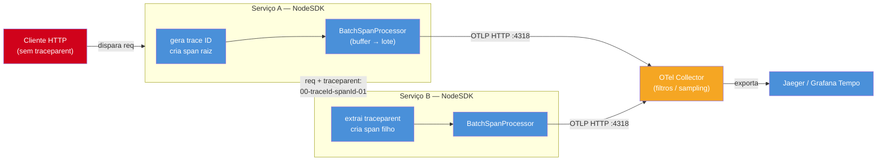

# Tracing distribuído com OpenTelemetry

> [!abstract] TL;DR
> - **Distributed tracing** reconstrói o caminho completo de uma requisição através de múltiplos serviços, mostrando onde o tempo foi gasto e onde os erros ocorreram — o que logs e métricas isolados não conseguem revelar.
> - Um **trace** é uma árvore de **spans**; cada span representa uma operação com nome, horário de início/fim, atributos e status. Spans filhos são linkados ao pai via **context propagation** (header `traceparent` no formato W3C TraceContext).
> - **OpenTelemetry** (OTel) é o padrão CNCF graduado para instrumentação vendor-neutral: um único SDK produz dados compatíveis com Jaeger, Zipkin, Grafana Tempo, Datadog, Honeycomb e qualquer backend OTLP.
> - O arquivo `tracing.ts` **deve ser importado antes de qualquer outro módulo** — ele instala os patches de auto-instrumentação em tempo de load; se você importar `express` antes, os spans de requisição HTTP não serão gerados.
> - **Sampling** é obrigatório em produção: `ALWAYS_ON` com tráfego real cria volume absurdo; use `TraceIdRatioBased(0.1)` (10%) ou `ParentBasedSampler` para respeitar a decisão do serviço upstream.

O tracing distribuído é o terceiro pilar da observabilidade — o que permite responder "onde o tempo foi gasto?" em vez de apenas "quantos erros aconteceram?". Enquanto logs registram eventos pontuais e métricas agregam comportamento ao longo do tempo, traces reconstroem o fluxo completo de uma requisição, cruzando processos e serviços. OpenTelemetry é hoje o padrão da indústria para capturar e exportar esses dados de forma vendor-neutral.

## Pipeline de tracing: do SDK ao backend

O span não existe sozinho: ele percorre um pipeline de processamento antes de chegar ao Jaeger ou Grafana Tempo. Entender cada etapa é crucial para debugar por que spans não aparecem ou chegam incompletos.



O header `traceparent` é o fio condutor: Serviço A gera o trace ID, propaga via header para Serviço B, que cria um span filho usando o mesmo trace ID. No backend, os dois spans aparecem como uma única árvore. Se o `traceparent` for perdido ou malformado em qualquer hop, o trace se parte em fragmentos órfãos.

## O que é

**OpenTelemetry** (OTel) é um projeto de código aberto graduado pela CNCF (_Cloud Native Computing Foundation_) que define APIs, SDKs e protocolos para coleta de sinais de observabilidade — traces, métricas e logs. A principal vantagem é ser **vendor-neutral**: você instrumenta seu código uma vez e pode enviar os dados para qualquer backend (Jaeger, Zipkin, Grafana Tempo, Datadog, Honeycomb, New Relic) apenas trocando o exporter.

### Conceitos centrais

Um **trace** é a representação completa do ciclo de vida de uma requisição distribuída — do ponto de entrada até a resposta final. Estruturalmente, um trace é uma **árvore de spans**.

Um **span** é a unidade básica de trabalho: uma operação com nome, timestamps de início e fim, atributos (chave-valor), eventos e status. Cada span pertence a exatamente um trace e pode ter um span pai, formando a hierarquia pai-filho que define o grafo de execução.

**Context propagation** é o mecanismo que carrega o contexto do trace entre processos. O padrão W3C TraceContext define o header HTTP `traceparent` com o seguinte formato:

```
traceparent: 00-<traceId-32hex>-<spanId-16hex>-<flags-2hex>
```

Exemplo real:

```
traceparent: 00-4bf92f3577b34da6a3ce929d0e0e4736-00f067aa0ba902b7-01
```

Os campos são:
- `00` — versão do formato (sempre `00` hoje)
- `4bf92f3577b34da6a3ce929d0e0e4736` — trace ID (128 bits, 32 hex chars)
- `00f067aa0ba902b7` — span ID do chamador (64 bits, 16 hex chars)
- `01` — flags (bit 0 = sampled)

Quando o serviço downstream recebe esse header, ele extrai o trace ID e o span ID do pai e cria seu próprio span como filho — mantendo o mesmo fio através de múltiplos serviços. Dentro de um único processo Node.js, essa propagação acontece automaticamente via `AsyncLocalStorage`, sem necessidade de passar contexto manualmente entre funções.

## Como funciona

### Arquitetura

O pipeline de tracing no OpenTelemetry segue esta sequência:

```
Aplicação Node.js
      │
      ▼
  SDK (NodeSDK)          ← você configura aqui: instrumentações, sampler, exporter
      │
      ▼
  SpanProcessor          ← processa spans antes de exportar
  (SimpleSpanProcessor   ← síncrono, para dev
   BatchSpanProcessor)   ← assíncrono com buffer, para produção
      │
      ▼
  Exporter               ← destino dos dados
  (OTLP HTTP/gRPC        ← protocolo padrão, envia para Collector ou backend direto
   Console               ← stdout, útil para debug local
   Zipkin / Jaeger)      ← exporters legados (menos recomendados)
      │
      ▼
  OTel Collector         ← processo separado (opcional mas recomendado)
  (recebe, processa,
   filtra, exporta)
      │
      ▼
  Backend de traces
  (Jaeger / Zipkin / Grafana Tempo / Datadog / Honeycomb)
```

O **OTel Collector** é um componente opcional mas fortemente recomendado em produção. Ele age como intermediário entre a aplicação e o backend final, permitindo: agregar dados de múltiplos serviços, aplicar sampling tail-based, transformar atributos, filtrar traces desnecessários, e trocar o backend sem tocar no código da aplicação.

### Setup com NodeSDK

O arquivo `tracing.ts` deve ser o primeiro código executado na aplicação. Em Node.js, use `--require ./tracing.js` na linha de comando (ou `NODE_OPTIONS='--require ./tracing.js'`) para garantir que os patches de instrumentação sejam aplicados antes de qualquer import de módulo instrumentado.

Versão mínima para desenvolvimento (com `ConsoleSpanExporter`):

```typescript
// tracing.ts - setup mínimo para desenvolvimento
import { NodeSDK } from '@opentelemetry/sdk-node';
import { ConsoleSpanExporter, SimpleSpanProcessor } from '@opentelemetry/sdk-trace-node';
import { getNodeAutoInstrumentations } from '@opentelemetry/auto-instrumentations-node';

const sdk = new NodeSDK({
  spanProcessor: new SimpleSpanProcessor(new ConsoleSpanExporter()),
  instrumentations: [getNodeAutoInstrumentations()],
});

sdk.start();

process.on('SIGTERM', () => {
  sdk.shutdown().finally(() => process.exit(0)); // simplificado — veja exemplo completo em Casos práticos
});
```

Versão com OTLPTraceExporter para envio ao Collector ou backend:

```typescript
// tracing.ts - DEVE ser o primeiro arquivo importado
import { NodeSDK } from '@opentelemetry/sdk-node';
import { getNodeAutoInstrumentations } from '@opentelemetry/auto-instrumentations-node';
import { OTLPTraceExporter } from '@opentelemetry/exporter-trace-otlp-http';
import { SimpleSpanProcessor } from '@opentelemetry/sdk-trace-node';
import { ParentBasedSampler, TraceIdRatioBased } from '@opentelemetry/sdk-trace-base';

const exporter = new OTLPTraceExporter({
  url: process.env.OTEL_EXPORTER_OTLP_ENDPOINT ?? 'http://localhost:4318/v1/traces',
});

const sdk = new NodeSDK({
  spanProcessor: new SimpleSpanProcessor(exporter),
  instrumentations: [getNodeAutoInstrumentations()],
  sampler: new ParentBasedSampler({
    root: new TraceIdRatioBased(Number(process.env.OTEL_SAMPLE_RATIO ?? '0.1')),
  }),
});

sdk.start();

process.on('SIGTERM', () => {
  sdk.shutdown().finally(() => process.exit(0)); // simplificado — veja exemplo completo em Casos práticos
});
```

Para usar em `package.json` ou `.env`:

```jsonc
// package.json
{
  "scripts": {
    "start": "node --require ./dist/tracing.js dist/index.js",
    "dev": "ts-node --require ./src/tracing.ts src/index.ts"
  }
}
```

Variáveis de ambiente úteis:

```bash
OTEL_SERVICE_NAME=meu-servico
OTEL_EXPORTER_OTLP_ENDPOINT=http://otel-collector:4318
OTEL_TRACES_SAMPLER=parentbased_traceidratio
OTEL_TRACES_SAMPLER_ARG=0.1
OTEL_SAMPLE_RATIO=0.1
```

### Auto-instrumentação

O pacote `@opentelemetry/auto-instrumentations-node` instala automaticamente instrumentações para os módulos mais comuns do ecossistema Node.js. Ao chamar `getNodeAutoInstrumentations()`, o SDK patcha os módulos em tempo de load e injeta criação de spans sem nenhuma modificação no código da aplicação.

Módulos cobertos pela auto-instrumentação (seleção):

| Categoria | Módulos |
|---|---|
| HTTP | `http`, `https`, `node:http` |
| Frameworks | `express`, `fastify`, `koa`, `hapi`, `nestjs` |
| Banco de dados | `pg`, `mysql`, `mysql2`, `mongodb`, `mongoose` |
| Cache | `redis`, `ioredis`, `memcached` |
| Filas | `amqplib` (RabbitMQ), `kafkajs` |
| DNS | `dns` |
| gRPC | `@grpc/grpc-js` |

É possível desabilitar instrumentações específicas ou configurá-las individualmente:

```typescript
import { getNodeAutoInstrumentations } from '@opentelemetry/auto-instrumentations-node';

const instrumentations = getNodeAutoInstrumentations({
  // desabilitar instrumentação de DNS (gera muito ruído)
  '@opentelemetry/instrumentation-dns': { enabled: false },
  // configurar instrumentação do Express para capturar o nome da rota
  '@opentelemetry/instrumentation-express': {
    enabled: true,
    requestHook: (span, info) => {
      span.setAttribute('http.route', info.route);
    },
  },
  // limitar quais queries SQL são capturadas
  '@opentelemetry/instrumentation-pg': {
    enabled: true,
    addSqlCommenterCommentToQueries: true,
    enhancedDatabaseReporting: false, // não capturar valores dos parâmetros
  },
});
```

### Spans manuais

Auto-instrumentação captura operações de infraestrutura (HTTP, banco, cache), mas a lógica de negócio — "processou o pedido", "validou o pagamento", "enviou o e-mail" — precisa de spans manuais para aparecer no trace.

O padrão correto usa `startActiveSpan` com bloco try/catch/finally:

```typescript
import { trace, SpanStatusCode, SpanKind } from '@opentelemetry/api';

const tracer = trace.getTracer('order-service', '1.0.0');

async function processOrder(orderId: string): Promise<OrderResult> {
  return tracer.startActiveSpan('processOrder', async (span) => {
    try {
      // Atributos de negócio — aparecem nos detalhes do span no Jaeger/Tempo
      span.setAttribute('order.id', orderId);
      span.setAttribute('service.component', 'order-processor');

      const order = await fetchOrder(orderId);
      span.setAttribute('order.customer_id', order.customerId);
      span.setAttribute('order.item_count', order.items.length);
      span.setAttribute('order.total_cents', order.totalCents);

      const result = await fulfillOrder(order);
      span.setAttribute('order.fulfillment_id', result.fulfillmentId);

      return result;
    } catch (err) {
      // Registrar a exceção associa o stack trace ao span
      span.recordException(err as Error);
      // Marcar o span como erro — aparece em vermelho no Jaeger
      span.setStatus({
        code: SpanStatusCode.ERROR,
        message: (err as Error).message,
      });
      throw err;
    } finally {
      // OBRIGATÓRIO: todo span iniciado deve ser finalizado
      span.end();
    }
  });
}
```

Para spans aninhados (sub-operações dentro de um span ativo):

```typescript
async function fulfillOrder(order: Order): Promise<FulfillmentResult> {
  // startActiveSpan automaticamente cria este span como filho do span ativo atual
  return tracer.startActiveSpan('fulfillOrder', async (span) => {
    try {
      span.setAttribute('fulfillment.warehouse', order.warehouseId);

      // Criar evento no span (timestamp + atributos, sem criar span filho)
      span.addEvent('inventory_checked', {
        'inventory.available': true,
        'inventory.reserved_units': order.items.length,
      });

      const shipment = await createShipment(order);
      span.setAttribute('shipment.tracking_number', shipment.trackingNumber);

      return { fulfillmentId: shipment.id, trackingNumber: shipment.trackingNumber };
    } catch (err) {
      span.recordException(err as Error);
      span.setStatus({ code: SpanStatusCode.ERROR, message: (err as Error).message });
      throw err;
    } finally {
      span.end();
    }
  });
}
```

### Sampling

Sampling é a decisão de "vou registrar este trace ou descartar?". Sem sampling, um serviço com 1.000 req/s geraria 1.000 traces por segundo — volume proibitivo para armazenar e consultar.

OpenTelemetry suporta os seguintes samplers built-in:

| Sampler | Comportamento | Uso recomendado |
|---|---|---|
| `AlwaysOnSampler` | 100% dos traces registrados | Desenvolvimento e debug local |
| `AlwaysOffSampler` | 0% — descarta tudo | Testes de carga onde tracing é irrelevante |
| `TraceIdRatioBased(ratio)` | Probabilístico baseado no trace ID | Produção com baixo overhead |
| `ParentBasedSampler` | Respeita decisão do span pai; usa sampler raiz para novos traces | Produção — recomendado |

O `ParentBasedSampler` é o mais importante: ele garante que se o serviço upstream decidiu amostrar um trace, todos os serviços downstream também o farão — evitando traces parciais onde apenas parte da árvore foi registrada.

```typescript
import {
  ParentBasedSampler,
  TraceIdRatioBased,
  AlwaysOnSampler,
} from '@opentelemetry/sdk-trace-base';

// Produção: 10% de novos traces, mas sempre completa traces iniciados upstream
const productionSampler = new ParentBasedSampler({
  root: new TraceIdRatioBased(0.1),
});

// Desenvolvimento: 100%
const devSampler = new AlwaysOnSampler();

const sampler = process.env.NODE_ENV === 'production' ? productionSampler : devSampler;
```

Via variáveis de ambiente (sem modificar código):

```bash
# Sampler baseado em ratio de 10%
OTEL_TRACES_SAMPLER=parentbased_traceidratio
OTEL_TRACES_SAMPLER_ARG=0.1

# Samplers disponíveis:
# always_on, always_off, traceidratio, parentbased_always_on,
# parentbased_always_off, parentbased_traceidratio
```

## Casos práticos

### Cenário 1: Serviço de pagamentos com spans de negócio e propagação de contexto

Auto-instrumentação cobre HTTP e banco de dados, mas lógica de negócio — verificação de fraude, cobrança no gateway, registro de auditoria — precisa de spans manuais. O padrão abaixo cria uma hierarquia de spans que aparece no Jaeger como uma árvore: `payment.process` como raiz, com `payment.fraud_check` e `payment.charge_gateway` como filhos.

O ponto crítico é o bloco `try/catch/finally` com `span.recordException()` + `span.setStatus(ERROR)` + `span.end()` no `finally`. Qualquer desvio desse padrão resulta em spans vazando memória ou chegando ao backend sem status de erro — tornando silenciosos os problemas que você mais precisa detectar.

```typescript
// src/services/payment-service.ts
import { trace, context, propagation, SpanStatusCode, SpanKind } from '@opentelemetry/api';
import { ATTR_DB_SYSTEM, ATTR_DB_OPERATION } from '@opentelemetry/semantic-conventions';

const tracer = trace.getTracer('payment-service', '1.0.0');

interface PaymentRequest {
  orderId: string;
  customerId: string;
  amountCents: number;
  currency: string;
}

interface PaymentResult {
  transactionId: string;
  status: 'approved' | 'declined';
}

export async function processPayment(req: PaymentRequest): Promise<PaymentResult> {
  return tracer.startActiveSpan(
    'payment.process',
    {
      kind: SpanKind.INTERNAL,
      attributes: {
        'payment.order_id': req.orderId,
        'payment.customer_id': req.customerId,
        'payment.amount_cents': req.amountCents,
        'payment.currency': req.currency,
      },
    },
    async (span) => {
      try {
        // Verificar fraude — cria span filho automaticamente por ser startActiveSpan
        const fraudScore = await checkFraud(req);
        span.setAttribute('payment.fraud_score', fraudScore);

        if (fraudScore > 0.8) {
          span.setAttribute('payment.blocked_reason', 'high_fraud_score');
          span.setStatus({ code: SpanStatusCode.ERROR, message: 'Transação bloqueada por risco de fraude' });
          return { transactionId: '', status: 'declined' };
        }

        // Cobrar no gateway
        const result = await chargeGateway(req);
        span.setAttribute('payment.transaction_id', result.transactionId);
        span.setAttribute('payment.gateway_response', result.status);

        if (result.status !== 'approved') {
          span.setStatus({ code: SpanStatusCode.ERROR, message: `Gateway recusou: ${result.status}` });
        }

        return result;
      } catch (err) {
        span.recordException(err as Error);
        span.setStatus({
          code: SpanStatusCode.ERROR,
          message: (err as Error).message,
        });
        throw err;
      } finally {
        span.end(); // Sempre, sempre, sempre
      }
    }
  );
}

async function checkFraud(req: PaymentRequest): Promise<number> {
  return tracer.startActiveSpan('payment.fraud_check', async (span) => {
    try {
      span.setAttribute('fraud.model_version', 'v2.3');
      // Evento no span: snapshot de decisão sem criar span filho
      span.addEvent('fraud_model_invoked', {
        'fraud.order_id': req.orderId,
        'fraud.amount_cents': req.amountCents,
      });
      const score = Math.random(); // placeholder — lógica real aqui
      span.setAttribute('fraud.score', score);
      return score;
    } catch (err) {
      span.recordException(err as Error);
      span.setStatus({ code: SpanStatusCode.ERROR, message: (err as Error).message });
      throw err;
    } finally {
      span.end();
    }
  });
}
```

**O que aparece no Jaeger:**
- Span raiz: `payment.process` com atributos `payment.order_id`, `payment.amount_cents`, `payment.fraud_score`
- Span filho: `payment.fraud_check` com `fraud.model_version`, `fraud.score`
- Em caso de erro: ícone vermelho em cada span afetado, com stack trace clicável

### Cenário 2: Stack local com Jaeger + tracing.ts de produção

Este é o setup recomendado para desenvolvimento local e para um serviço Node.js em produção. O `tracing.ts` de produção usa `BatchSpanProcessor` (buffer de spans com flush periódico, zero overhead por span) e `ParentBasedSampler` (respeita a decisão upstream). O Docker Compose sobe Jaeger all-in-one com endpoint OTLP na porta 4318.

```typescript
// src/tracing.ts
// ATENÇÃO: Este arquivo DEVE ser o primeiro a ser importado/executado.
// Use: node --require ./dist/tracing.js dist/index.js
import { NodeSDK } from '@opentelemetry/sdk-node';
import { getNodeAutoInstrumentations } from '@opentelemetry/auto-instrumentations-node';
import { OTLPTraceExporter } from '@opentelemetry/exporter-trace-otlp-http';
import {
  SimpleSpanProcessor,
  BatchSpanProcessor,
  ConsoleSpanExporter,
} from '@opentelemetry/sdk-trace-node';
import {
  ParentBasedSampler,
  TraceIdRatioBased,
  AlwaysOnSampler,
} from '@opentelemetry/sdk-trace-base';
import { Resource } from '@opentelemetry/resources';
import { ATTR_SERVICE_NAME, ATTR_SERVICE_VERSION } from '@opentelemetry/semantic-conventions';

const isDev = process.env.NODE_ENV !== 'production';
const serviceName = process.env.OTEL_SERVICE_NAME ?? 'unknown-service';
const serviceVersion = process.env.npm_package_version ?? '0.0.0';
const sampleRatio = Number(process.env.OTEL_SAMPLE_RATIO ?? (isDev ? '1.0' : '0.1'));

// Resource identifica o serviço em todos os backends
const resource = new Resource({
  [ATTR_SERVICE_NAME]: serviceName,
  [ATTR_SERVICE_VERSION]: serviceVersion,
  'deployment.environment': process.env.NODE_ENV ?? 'development',
});

// Escolher exporter conforme ambiente
const spanProcessor = isDev
  ? new SimpleSpanProcessor(new ConsoleSpanExporter())
  : new BatchSpanProcessor(
      new OTLPTraceExporter({
        url: process.env.OTEL_EXPORTER_OTLP_ENDPOINT ?? 'http://localhost:4318/v1/traces',
        headers: {
          // Adicionar auth headers se o backend exigir (ex: Honeycomb)
          ...(process.env.OTEL_EXPORTER_OTLP_HEADERS
            ? Object.fromEntries(
                process.env.OTEL_EXPORTER_OTLP_HEADERS.split(',').map((h) => h.split('='))
              )
            : {}),
        },
      }),
      {
        // Configurações do BatchSpanProcessor para produção
        maxQueueSize: 2048,
        maxExportBatchSize: 512,
        scheduledDelayMillis: 5000,
        exportTimeoutMillis: 30000,
      }
    );

const sampler = new ParentBasedSampler({
  root: isDev ? new AlwaysOnSampler() : new TraceIdRatioBased(sampleRatio),
});

const sdk = new NodeSDK({
  resource,
  spanProcessor,
  sampler,
  instrumentations: [
    getNodeAutoInstrumentations({
      '@opentelemetry/instrumentation-dns': { enabled: false },
      '@opentelemetry/instrumentation-fs': { enabled: false }, // muito verboso
    }),
  ],
});

sdk.start();

// Graceful shutdown — essencial para não perder spans em buffer no BatchSpanProcessor
const shutdown = () => {
  sdk
    .shutdown()
    .then(() => {
      console.log('OpenTelemetry SDK encerrado com sucesso');
      process.exit(0);
    })
    .catch((err) => {
      console.error('Erro ao encerrar OpenTelemetry SDK', err);
      process.exit(1);
    });
};

process.on('SIGTERM', shutdown);
process.on('SIGINT', shutdown);
```

**Docker Compose para stack local:**

```yaml
# docker-compose.yml
version: '3.8'

services:
  jaeger:
    image: jaegertracing/all-in-one:1.57
    ports:
      - '16686:16686'   # UI do Jaeger
      - '4317:4317'     # OTLP gRPC
      - '4318:4318'     # OTLP HTTP
      - '14268:14268'   # Jaeger HTTP (legado)
    environment:
      COLLECTOR_OTLP_ENABLED: 'true'
    networks:
      - observability

  otel-collector:
    image: otel/opentelemetry-collector-contrib:0.99.0
    command: ['--config=/etc/otelcol/config.yaml']
    volumes:
      - ./otel-collector-config.yaml:/etc/otelcol/config.yaml
    ports:
      - '4317'    # OTLP gRPC (interno)
      - '4318'    # OTLP HTTP (interno)
    depends_on:
      - jaeger
    networks:
      - observability

  app:
    build: .
    environment:
      NODE_ENV: development
      OTEL_SERVICE_NAME: meu-servico
      OTEL_EXPORTER_OTLP_ENDPOINT: http://otel-collector:4318/v1/traces
      OTEL_SAMPLE_RATIO: '1.0'
    depends_on:
      - otel-collector
    networks:
      - observability

networks:
  observability:
    driver: bridge
```

Acesse a UI do Jaeger em `http://localhost:16686` para visualizar os traces após subir o stack.

## O que vem a seguir

Com os três pilares — logs, métricas e traces — operacionais, o próximo passo é extrair diagnósticos mais profundos quando os gráficos indicam lentidão mas os spans não revelam onde o tempo vai. [[07 - Profiling avançado com clinic.js]] mostra como olhar para dentro do processo: onde o CPU passa o tempo, quais funções geram mais alocação e onde o event loop fica bloqueado. Para o cenário em que a latência é alta mas os spans mostram tempo esperando — não processando —, [[08 - Detecção e diagnóstico de memory leaks]] investiga por que GC pressure pode estar consumindo ciclos de CPU. E quando o serviço precisa desligar de forma controlada sem perder spans em buffer no `BatchSpanProcessor`, [[09 - Graceful shutdown profundo]] cobre o ciclo de vida completo do processo incluindo flush de telemetria.

## Em entrevista

**What is distributed tracing and why does it matter?**

Distributed tracing is a technique for tracking a single request as it flows through multiple services in a distributed system. Each service creates one or more spans — timestamped records of work performed — and links them together using a shared trace ID that is propagated via HTTP headers. The result is a tree of spans that visually reconstructs the request's entire journey, showing which service was slow, where an error originated, and how latency compounds across service boundaries. Without distributed tracing, debugging a slow request in a microservices architecture means correlating logs from five different services by hand, which is error-prone and time-consuming.

**How does OpenTelemetry work in a Node.js application?**

OpenTelemetry provides a Node.js SDK that instruments your application through two mechanisms: automatic and manual. The auto-instrumentation package patches popular modules like Express, pg, redis, and the built-in HTTP client at module load time, creating spans for every incoming request, outgoing HTTP call, and database query without any code changes. Manual instrumentation lets you add business-level spans using `tracer.startActiveSpan()`, attach custom attributes like order IDs or customer tiers, and record exceptions with full stack traces. The SDK sends this data to a backend — Jaeger, Grafana Tempo, or a commercial provider — via the OTLP protocol, which means you can switch backends without changing your instrumentation code. The key constraint is that the SDK initialization file must be loaded before any other module, because the patches are applied at import time.

**When and how do you use sampling in production?**

Sampling is the practice of recording only a fraction of traces to control storage costs and query performance. In development, you typically use `AlwaysOnSampler` to capture everything. In production, `TraceIdRatioBased(0.1)` records 10% of traces probabilistically — enough to detect trends and catch most errors, at one-tenth the cost. The more sophisticated choice is `ParentBasedSampler`, which wraps the ratio sampler as its "root" decision but defers to the upstream service's sampling decision for inbound requests. This ensures trace completeness: if Service A decided to sample a trace and propagated that decision via the `traceparent` header's sampled flag, Service B will also record its spans for that trace rather than creating an orphan fragment. The correct sampling ratio depends on traffic volume and budget — a service handling 10,000 req/s might use 1% (100 traces/s), while a low-traffic internal service might safely use 100%.

## Vocabulário

**Span**: unidade básica de trabalho em um trace. Representa uma operação nomeada com timestamps de início e fim, atributos chave-valor, eventos e status (OK, ERROR, UNSET). Todo span pertence a um trace e pode ter um span pai.

**Trace**: coleção de spans relacionados que representam o caminho completo de uma requisição através de um ou mais serviços. Identificado por um trace ID único de 128 bits (32 hex chars). Estruturalmente é uma árvore de spans.

**Context propagation**: mecanismo de transporte do trace ID e span ID entre processos (via headers HTTP) e entre funções assíncronas dentro do mesmo processo (via `AsyncLocalStorage`). Sem propagação, spans de serviços diferentes não podem ser correlacionados em um único trace.

**W3C TraceContext**: padrão W3C (recomendação desde 2021) que define o formato do header `traceparent` para propagação de contexto entre serviços HTTP. Substituiu formatos proprietários como B3 (Zipkin) e X-B3 (Google). OpenTelemetry usa TraceContext por padrão.

**OTLP** (OpenTelemetry Protocol): protocolo binário baseado em Protocol Buffers para transmissão de traces, métricas e logs entre SDKs, Collectors e backends. Suporta transporte via gRPC (porta 4317) e HTTP/JSON (porta 4318). É o protocolo nativo do ecossistema OTel.

**Exporter**: componente que serializa spans e os envia para um destino específico. Exemplos: `OTLPTraceExporter` (para OTel Collector ou backend OTLP), `ConsoleSpanExporter` (stdout, para debug), `ZipkinExporter`, `JaegerExporter`. Trocar o exporter é a principal forma de mudar de backend sem alterar instrumentação.

**Collector**: processo separado (daemon ou sidecar) que recebe dados dos SDKs, aplica transformações (filtros, atributos, sampling tail-based) e os exporta para um ou mais backends. O `otelcol-contrib` é a distribuição oficial com suporte a dezenas de receivers, processors e exporters.

**Sampler**: componente do SDK que decide, para cada novo trace, se ele será registrado ou descartado. Roda localmente, antes de qualquer exportação. Tipos principais: `AlwaysOnSampler`, `AlwaysOffSampler`, `TraceIdRatioBased`, `ParentBasedSampler`.

**Instrumentation library**: biblioteca que adiciona instrumentação a um módulo específico (ex: `@opentelemetry/instrumentation-express`). Funciona patchando o módulo alvo em tempo de load para injetar criação de spans, propagação de contexto e coleta de atributos automaticamente.

**SpanProcessor**: componente que processa spans antes de exportá-los. `SimpleSpanProcessor` exporta um span de cada vez ao ser finalizado (adequado para dev). `BatchSpanProcessor` acumula spans em buffer e exporta em lotes (adequado para produção, menor overhead).

## Armadilhas comuns

> [!warning] `tracing.ts` deve ser o PRIMEIRO import — sem exceção
> **O que acontece:** Os patches de auto-instrumentação nunca são aplicados a módulos já carregados. Se `express` ou `pg` foi importado antes do SDK inicializar, nenhum span de requisição HTTP ou query SQL será gerado — o endpoint `/metrics` e os traces de negócio funcionam, mas metade do trace está ausente. Você descobre isso quando o Jaeger mostra spans de negócio mas nenhum span de banco de dados.
>
> **Por quê:** `getNodeAutoInstrumentations()` registra patches que são aplicados quando o módulo alvo é importado pela primeira vez. Módulos já em memória não são retroativamente patchados. Imports circulares e re-exports transitivoss podem causar esse problema silenciosamente.
>
> **Como evitar:** Use `--require ./dist/tracing.js` como flag do Node ou `NODE_OPTIONS='--require ./tracing.js'` — isso garante que o SDK rode antes de qualquer código da aplicação, independente da ordem de imports. Nunca confie em `import './tracing'` no topo de `index.ts` — a resolução de módulos do Node pode reordenar os imports.

> [!warning] `startActiveSpan` vs `startSpan` — não são intercambiáveis
> **O que acontece:** Spans criados dentro do callback de `startSpan` (em vez de `startActiveSpan`) não são automaticamente filhos do span atual — eles aparecem como spans órfãos no trace, desconectados da hierarquia. O trace fica fragmentado: você vê os spans, mas eles não formam uma árvore coerente.
>
> **Por quê:** `startActiveSpan` define o span criado como o "span ativo" atual no `AsyncLocalStorage`, fazendo com que todos os spans criados dentro do callback se tornem automaticamente filhos. `startSpan` cria um span mas não o ativa no contexto — spans posteriores não têm referência ao pai.
>
> **Como evitar:** Use `startActiveSpan` em quase todos os casos. A única exceção válida para `startSpan` é quando você precisa de controle explícito sobre o contexto pai — por exemplo, para criar spans filhos de um contexto propagado manualmente via `context.with()`.

> [!warning] Nunca esqueça de chamar `span.end()`
> **O que acontece:** O SDK mantém referências a spans abertos em memória. Em código assíncrono com alto volume, spans não finalizados causam vazamento de memória progressivo — o heap cresce continuamente e o processo vai a OOM horas ou dias depois, sem relação aparente com o tracing.
>
> **Por quê:** Ao contrário de conexões de banco de dados com timeout automático, spans abertos nunca são coletados pelo GC — o SDK segura a referência deliberadamente, esperando que o código chame `.end()`. Em fluxos com `throw`, um `span.end()` fora do bloco `finally` é simplesmente ignorado.
>
> **Como evitar:** Sempre coloque `span.end()` no bloco `finally` — não no `try` nem no `catch`. O `finally` executa independente de exceção ou retorno normal. Use o callback de `startActiveSpan` (que também exige `span.end()` manual) apenas quando o bloco try/catch/finally for explícito.

> [!warning] `ALWAYS_ON` em produção cria volume insustentável
> **O que acontece:** Um serviço com 500 req/s com `AlwaysOnSampler` gera 500 traces/s — 43 milhões de traces/dia. Backends como Jaeger sem retenção configurada enchem o disco em horas. Mesmo com retenção, o custo de armazenamento e a latência de queries no backend se tornam proibitivos rapidamente.
>
> **Por quê:** `AlwaysOnSampler` é o default do SDK e faz sentido em desenvolvimento, onde você quer ver 100% dos traces. Em produção com tráfego real, a decisão de sampling precisa ser explícita e proporcional ao volume e ao orçamento de armazenamento.
>
> **Como evitar:** Em produção, use `TraceIdRatioBased(0.1)` (10%) ou menor como ponto de partida, sempre envolvido em `ParentBasedSampler` para respeitar a decisão upstream. Configure `OTEL_TRACES_SAMPLER=parentbased_traceidratio` e `OTEL_TRACES_SAMPLER_ARG=0.1` via variáveis de ambiente — sem tocar no código.

> [!warning] Auto-instrumentação patcheia módulos no import — não depois
> **O que acontece:** Parecido com a armadilha do primeiro import, mas com uma causa diferente: imports circulares ou arquivos que importam dependências instrumentadas fora de funções (no nível de módulo) podem fazer com que o módulo alvo seja carregado antes do SDK, mesmo que `tracing.ts` seja o primeiro arquivo na linha de comando.
>
> **Por quê:** O sistema de módulos do Node.js executa o código de cada módulo apenas uma vez, na primeira importação. Se um módulo A importa `express` e módulo A é importado por B, que é importado transitivamente antes de `tracing.ts` — mesmo que `tracing.ts` venha primeiro no `index.ts` — o patch não acontece.
>
> **Como evitar:** A solução definitiva é `--require ./tracing.js` como flag do Node (ou `NODE_OPTIONS`), não um `import` no topo de um arquivo. Isso garante execução antes do início do grafo de módulos da aplicação. Em monorepos, verifique se o entry point correto está sendo carregado com `--require`.

> [!tip] `BatchSpanProcessor` em produção, `SimpleSpanProcessor` em dev
> `SimpleSpanProcessor` exporta cada span imediatamente ao ser finalizado — bom para ver traces em tempo real durante desenvolvimento, mas gera overhead de I/O em produção. `BatchSpanProcessor` acumula spans e exporta em lotes a cada N segundos ou quando o buffer enche, com muito menor impacto na latência da aplicação. Configure `scheduledDelayMillis` e `maxExportBatchSize` conforme o volume de tráfego esperado.

## Veja também

- [[03-Dominios/Tecnologia/Node/Observability e produção/index]] — MOC do galho 5
- [[01 - Os três pilares - logs, métricas e traces]] — visão geral de observabilidade: logs, métricas e traces como pilares complementares
- [[03 - Correlation IDs e context propagation]] — propagação de contexto manual com `AsyncLocalStorage` antes de usar OTel
- [[Node.js]] — tronco principal do domínio

## Fontes

- [OpenTelemetry JavaScript — documentação oficial](https://opentelemetry.io/docs/languages/js/) — referência completa da API, SDK e convenções semânticas para JavaScript/TypeScript
- [OpenTelemetry Node.js — Getting Started](https://opentelemetry.io/docs/languages/js/getting-started/nodejs/) — guia oficial de instalação e configuração do NodeSDK
- [W3C TraceContext Recommendation](https://www.w3.org/TR/trace-context/) — especificação do header `traceparent` e propagação de contexto entre serviços
- [OpenTelemetry Semantic Conventions](https://opentelemetry.io/docs/specs/semconv/) — convenções de nomenclatura para atributos de spans (HTTP, banco de dados, mensageria, etc.)
- [OTel Collector — documentação](https://opentelemetry.io/docs/collector/) — guia do Collector para pipelines de observabilidade em produção
