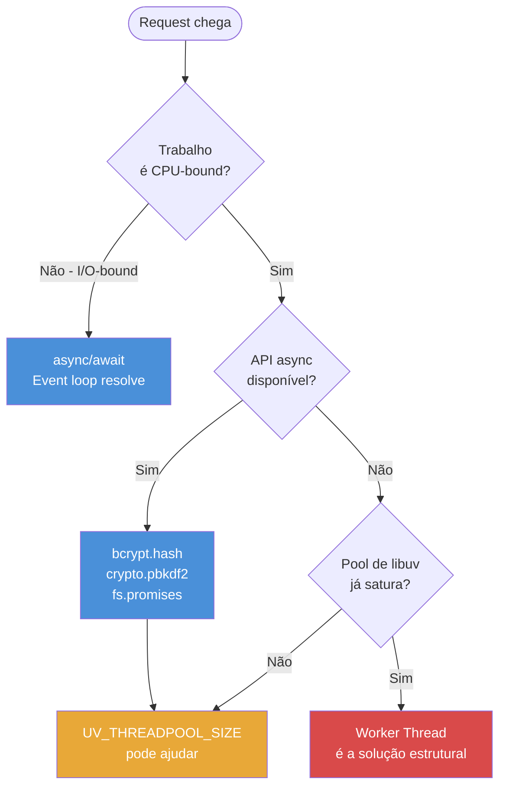

# Por que paralelismo em Node

> [!abstract] TL;DR
> Node é single-thread e isso geralmente está certo — o event loop resolve a imensa maioria dos workloads I/O-bound com eficiência notável. Mas há casos onde paralelismo é a única saída: trabalho CPU-bound persistente, event loop lag que não cede com otimização, throughput cronicamente limitado. Antes de paralelizar, considere streaming, paginação, refatoração do algoritmo ou filas de background. Quando essas alternativas falham, há 3 ferramentas: Worker Threads, Cluster, e `child_process` — a escolha depende do problema, não do que parece mais familiar.

---

## O que é

Paralelismo no contexto Node significa executar trabalho **simultaneamente** em outras threads ou processos, fora do event loop principal.

Essa definição importa porque é diferente de **concorrência** — que é o que `async/await` e o event loop fazem. Concorrência significa *alternar* entre tarefas: o event loop processa um callback, suspende enquanto I/O aguarda, retoma outro callback. Em nenhum momento duas linhas de JavaScript executam ao mesmo tempo na thread principal.

Paralelismo quebra essa restrição ao mover trabalho para fora da thread JS:

| Mecanismo | O que é | Fronteira |
|---|---|---|
| **Worker Threads** | Threads JS separadas no mesmo processo | Memória compartilhável via `SharedArrayBuffer`; comunicação via `postMessage` |
| **Cluster** | Múltiplos processos Node compartilhando a mesma porta TCP | Processos independentes; o SO distribui as conexões |
| **`child_process`** | Processo externo independente | Totalmente isolado; comunica via stdin/stdout/IPC |

As três ferramentas são cobertas em detalhe nas notas seguintes do galho. Esta nota responde a pergunta anterior: *por que você precisaria de qualquer uma delas*.

---

## Por que importa

Node.js tem um design deliberado: single-threaded. A aposta é que a maioria dos servidores web passa mais tempo esperando I/O (banco de dados, rede, disco) do que executando JavaScript. Essa aposta está correta para a maioria dos casos — e é por isso que Node escala bem com `async/await` sem precisar de threads.

O problema surge quando um serviço tem trabalho genuinamente **CPU-bound**: o event loop não pode "esperar" por um cálculo da mesma forma que espera por um banco de dados. Enquanto o cálculo roda, a thread JS está ocupada. Nenhum outro callback executa.

Sem o entendimento de paralelismo, o padrão de debugging vai na direção errada:

- Tentar resolver bloqueio de CPU com `async/await` — não funciona. Como demonstrado em [[09 - async-await - o que é, o que não é]], `async` não cria uma thread separada. Código síncrono dentro de um handler `async` ainda bloqueia o event loop.
- Aumentar réplicas no orquestrador sem entender a causa raiz — pode funcionar, mas é caro e mascara o problema estrutural.
- Mover para uma linguagem "mais rápida" sem evidência de que o gargalo é o runtime — decisão irreversível baseada em hipótese.

Saber reconhecer CPU-bound vs I/O-bound, e conhecer as 3 ferramentas de paralelismo, é o que diferencia uma análise de causa raiz de um debugging por tentativa e erro.

---

## Como funciona

Pense no event loop como um atendente único em um balcão: incrivelmente eficiente enquanto a tarefa é "encaminhar o pedido para a cozinha e avisar quando estiver pronto" (I/O-bound), mas completamente travado quando precisa preparar a refeição por conta própria (CPU-bound). O diagrama abaixo mostra o caminho de decisão — de um request que chega até a ferramenta de paralelismo certa, passando pelas alternativas mais simples.



### CPU-bound vs I/O-bound: a distinção central

A distinção mais importante para decidir quando paralelizar:

**I/O-bound:** o trabalho é esperar. O programa envia um request ao banco de dados, ao sistema de arquivos, a uma API externa — e aguarda a resposta. A thread JS fica livre durante a espera. O event loop + `async/await` resolvem isso perfeitamente. Paralelismo via Worker Threads geralmente não ajuda aqui e pode piorar (mais context switches, mais overhead de coordenação).

**CPU-bound:** o trabalho é computação. Hashing de senha, processamento de imagem, compressão, inferência de modelos de ML, parsing de CSV de 500 mil linhas em memória. A thread JS fica ocupada executando JavaScript. O event loop não consegue "liberar" a thread para I/O porque não há I/O aguardando — só cálculo.

O sinal diagnóstico é o event loop lag — coberto em detalhes em [[10 - Bloqueio do event loop - sintomas e causas]]. Em condições normais: lag de 0-5ms. Com CPU-bound persistente: lag de centenas de milissegundos ou segundos. A latência sobe em **todos** os endpoints simultaneamente — não apenas no endpoint responsável pelo cálculo.

### O exemplo concreto: bcrypt sob carga

Imagine um servidor de autenticação que usa `bcrypt.hashSync` para criar hashes de senha:

```javascript
// ❌ Problema — bcrypt síncrono bloqueia o event loop
app.post('/register', (req, res) => {
  const { password } = req.body;

  // hashSync executa em JavaScript puro na thread principal
  // Dependendo do cost factor, pode levar 200-400ms
  const hash = bcrypt.hashSync(password, 12);

  await db.users.create({ password: hash });
  res.json({ ok: true });
});
```

Com 10 requisições de registro concorrentes, o event loop fica efetivamente bloqueado de forma contínua. Todos os outros endpoints — incluindo `GET /health` — passam a responder com latência de segundos, independente de quão simples sejam.

**Antes de ir direto para Worker Thread**, há opções de menor complexidade para testar:

```javascript
// Opção 1 — usar a API async do bcrypt (usa o thread pool de libuv)
app.post('/register', async (req, res) => {
  const { password } = req.body;

  // bcrypt.hash usa callbacks internamente — a operação vai para o thread pool
  const hash = await bcrypt.hash(password, 12);

  await db.users.create({ password: hash });
  res.json({ ok: true });
});
```

A API async do bcrypt (e do `crypto.pbkdf2`, `crypto.randomBytes`, etc.) usa o **thread pool de libuv** — as 4 threads nativas que Node mantém por padrão. Isso remove o trabalho da thread JS. Se ainda saturar (muitas requisições concorrentes de registro), o próximo passo é aumentar o pool:

```bash
# Aumentar o thread pool de 4 para 16 threads
UV_THREADPOOL_SIZE=16 node server.js
```

Se mesmo com pool ampliado o CPU usage de cada thread do pool for persistentemente alto, aí sim Worker Thread dedicado é a solução estrutural — porque o problema não é o número de threads, mas o tempo de CPU por operação.

```javascript
// Opção 2 — Worker Thread dedicado (quando o pool ainda satura)
// worker-bcrypt.js
const { workerData, parentPort } = require('worker_threads');
const bcrypt = require('bcrypt');

async function run() {
  const hash = await bcrypt.hash(workerData.password, workerData.rounds);
  parentPort.postMessage({ hash });
}

run().catch((err) => parentPort.postMessage({ error: err.message }));

// handler principal
import { Worker } from 'worker_threads';

function hashNoWorker(password, rounds) {
  return new Promise((resolve, reject) => {
    const worker = new Worker('./worker-bcrypt.js', {
      workerData: { password, rounds },
    });
    worker.once('message', ({ hash, error }) => {
      if (error) reject(new Error(error));
      else resolve(hash);
    });
    worker.once('error', reject);
  });
}

app.post('/register', async (req, res) => {
  const hash = await hashNoWorker(req.body.password, 12);
  await db.users.create({ password: hash });
  res.json({ ok: true });
  // Thread principal livre durante todo o hashing
});
```

O padrão acima cria um Worker por request — funcional, mas não ideal para alta carga (overhead de criação de thread por request). A próxima evolução é um **pool de workers** reutilizáveis, coberto em [[06 - Pool de workers - pattern de produção]].

---

## Na prática

O padrão de raciocínio recomendado antes de qualquer decisão de paralelismo:

### Passo 1 — Medir antes de qualquer coisa

"Tá lento" sem medição é hipótese, não diagnóstico. Metrificar:

- **Event loop lag** (`perf_hooks.monitorEventLoopDelay`, Clinic.js) — o sinal mais direto de bloqueio de thread
- **Percentis de latência por endpoint** (p50, p95, p99) — latência conjunta aponta para event loop; latência isolada aponta para lógica local
- **CPU usage** por thread — distingue thread pool saturado de loop JS bloqueado

Sem esses números, qualquer solução é um palpite. Mais contexto de diagnóstico em [[10 - Bloqueio do event loop - sintomas e causas]].

### Passo 2 — Tentar alternativas antes de paralelizar

Paralelismo adiciona complexidade real: coordenação entre threads/processos, serialização de dados, tratamento de erros cruzados, debugging mais difícil. Há alternativas que resolvem muitos casos com menos custo:

| Alternativa | Quando usar |
|---|---|
| **Streaming** | Dados grandes que podem ser processados em chunks — evita `JSON.parse` de payload inteiro |
| **Paginação** | Listas grandes que podem ser retornadas em partes |
| **Refatoração do algoritmo** | Complexidade O(n²) que pode virar O(n log n); evita a causa raiz |
| **API async em vez de sync** | Trocar `crypto.pbkdf2Sync` por `crypto.pbkdf2`; `fs.readFileSync` por `fs.promises.readFile` |
| **Aumentar `UV_THREADPOOL_SIZE`** | Quando o gargalo é o pool de libuv saturado, não o loop JS |
| **Fila de background** (BullMQ, etc.) | Trabalho que não precisa de resposta imediata; desacopla o request do processamento |

Essas alternativas não são "workarounds inferiores" — frequentemente são a solução correta. Paralelismo é para quando elas falham.

### Passo 3 — Escolher a ferramenta certa

Quando paralelismo é inevitável, a ferramenta certa depende do problema:

- **Worker Threads** — CPU-bound dentro do processo Node; acesso à memória compartilhada possível; mesma codebase
- **Cluster** — escalar um servidor HTTP para usar todos os cores da máquina; o SO distribui as conexões TCP
- **`child_process`** — rodar ferramenta externa (ImageMagick, ffmpeg, script Python) ou spawnar processo Node isolado

A decision tree completa está em [[11 - Decision tree - qual ferramenta para qual problema]].

---

## Casos práticos

### Cenário 1 — Servidor de autenticação com bcrypt

Uma API de registro de usuários começa a apresentar p99 de latência de 3+ segundos em *todos* os endpoints — não apenas no `/register`. O diagnóstico via `perf_hooks.monitorEventLoopDelay` confirma event loop lag de 300-400ms. A causa raiz: `bcrypt.hashSync` rodando na thread JS com cost factor 12.

A progressão de solução, do menor ao maior custo de implementação:

```javascript
// Passo 1 — trocar pela API async do bcrypt (usa thread pool de libuv)
// Remove o trabalho da thread JS; resolve para cargas moderadas
app.post('/register', async (req, res) => {
  const hash = await bcrypt.hash(req.body.password, 12);
  await db.users.create({ password: hash });
  res.json({ ok: true });
});

// Passo 2 — se bcrypt.hash ainda saturar sob carga, ampliar o pool
// UV_THREADPOOL_SIZE=16 node server.js

// Passo 3 — Worker Thread dedicado (quando pool saturado E CPU alto por thread)
// worker-bcrypt.js
import { workerData, parentPort } from 'node:worker_threads';
import bcrypt from 'bcrypt';
const hash = await bcrypt.hash(workerData.password, workerData.rounds);
parentPort.postMessage({ hash });

// No handler principal:
import { Worker } from 'node:worker_threads';

function hashWithWorker(password, rounds) {
  return new Promise((resolve, reject) => {
    const w = new Worker('./worker-bcrypt.js', { workerData: { password, rounds } });
    w.once('message', ({ hash }) => resolve(hash));
    w.once('error', reject);
  });
}

app.post('/register', async (req, res) => {
  const hash = await hashWithWorker(req.body.password, 12);
  await db.users.create({ password: hash });
  res.json({ ok: true }); // Thread principal livre durante todo o hashing
});
```

Cada passo exige nova medição de event loop lag para confirmar melhora — sem medir, não há evidência de quando parar. Para alta carga, criar um `new Worker()` por request tem overhead de criação de thread; o próximo passo seria um **pool de workers reutilizáveis**, coberto em [[06 - Pool de workers - pattern de produção]].

### Cenário 2 — Parser de CSV bloqueando o event loop

Um endpoint de importação recebe um arquivo CSV com 500 mil linhas e parseia tudo em memória com `csv-parse/sync`. O handler trava o event loop por 8-12 segundos — todos os outros endpoints param de responder nesse intervalo.

```javascript
// ❌ Antes — parser síncrono na thread principal
app.post('/import', async (req, res) => {
  const file = await fs.promises.readFile(req.file.path);
  const rows = parseCsvSync(file); // 8-12 segundos bloqueando a thread JS
  await db.records.bulkCreate(rows);
  res.json({ imported: rows.length });
});

// ✓ Depois — parsing em Worker Thread; event loop principal fica livre
// csv-worker.js
import { workerData, parentPort } from 'node:worker_threads';
import { parseCsvSync } from './csv-utils.js';
import fs from 'node:fs';

const file = fs.readFileSync(workerData.filePath);
const rows = parseCsvSync(file);
parentPort.postMessage({ rows });

// No handler principal:
import { Worker } from 'node:worker_threads';

app.post('/import', async (req, res) => {
  const { rows } = await new Promise((resolve, reject) => {
    const w = new Worker('./csv-worker.js', {
      workerData: { filePath: req.file.path },
    });
    w.once('message', resolve);
    w.once('error', reject);
  });

  await db.records.bulkCreate(rows);
  res.json({ imported: rows.length });
});
```

Os 8-12 segundos de parsing continuam existindo — mas agora ocorrem em outra thread JS, sem impactar o event loop principal. O endpoint `GET /health` e todos os demais continuam respondendo normalmente durante o processo.

---

## Armadilhas comuns

> [!warning] Paralelizar sem medir
> **O que acontece:** Worker Threads são adicionadas como primeira resposta a "a API está lenta", sem antes identificar a causa do bottleneck. **Por quê:** Worker Threads adicionam complexidade real — thread management, serialização via `postMessage`, tratamento de erros em contextos separados. Se o bottleneck for I/O (query lenta, paginação ausente, dependência externa), Worker Thread não ajuda e pode piorar a latência por overhead de coordenação. **Como evitar:** A sequência correta é sempre: medir event loop lag → identificar o tipo de bottleneck → selecionar a solução mínima. Ferramentas de diagnóstico em [[10 - Bloqueio do event loop - sintomas e causas]].

> [!warning] Confundir CPU-bound com I/O-bound
> **O que acontece:** Um handler faz `await db.query()` e depois processa resultados em memória. O dev assume que o banco está lento e tenta otimizar a query. **Por quê:** O event loop lag pode disparar *depois* que a query retorna — apontando para CPU-bound no processamento em memória, não para I/O lento. Paralelizar I/O via Worker Threads é tipicamente pior que `async/await` puro: há overhead de serialização entre threads, e o I/O vai para o kernel de qualquer forma. **Como evitar:** Medir separadamente a latência da query e o tempo de processamento pós-query. Se o lag começa após o `await db.query()`, o bottleneck é CPU — e Worker Thread é a candidata, não otimização de query.

> [!warning] UV_THREADPOOL_SIZE não resolve todo CPU-bound
> **O que acontece:** `UV_THREADPOOL_SIZE` é aumentado esperando-se que código JavaScript pesado seja acelerado — mas a latência não muda. **Por quê:** `UV_THREADPOOL_SIZE` controla apenas o pool de threads *nativas* de libuv, usado por `crypto.pbkdf2`, `fs.promises.*`, `dns.lookup`, `zlib` async. Código JavaScript síncrono próprio — loops, parsers customizados, algoritmos de cálculo — roda na thread JS, não no pool de libuv. `UV_THREADPOOL_SIZE=100` não tem efeito sobre esse código. **Como evitar:** Distinguir se o trabalho pesado é uma API Node que usa o pool de libuv (→ `UV_THREADPOOL_SIZE` pode ajudar) ou JavaScript puro síncrono (→ precisa de Worker Thread para sair da thread JS principal).

---

## Em entrevista

### Frase pronta (em inglês)

> "Node is single-threaded by design, and that's the right choice for most I/O-bound workloads. But when you have genuine CPU-bound work — image processing, hashing, ML inference, compression — single-thread becomes the bottleneck. The signal is event loop lag that persists across optimization attempts. The structural fix is parallelism, but Node has three different parallelism tools — Worker Threads for shared-memory threads within the same process, Cluster for sharing an HTTP port across multiple Node processes so the OS distributes connections, and `child_process` for spawning external commands or isolated Node processes. Choosing the right one matters more than knowing they exist. And before reaching for any of them, I'd validate that streaming, pagination, algorithm refactoring, or background queues don't solve the problem with less complexity."

### Vocabulário técnico

| PT-BR | EN |
|---|---|
| paralelismo | parallelism |
| concorrência | concurrency |
| trabalho de CPU / limitado por CPU | CPU-bound work |
| limitado por I/O | I/O-bound |
| atraso do event loop | event loop lag |
| pool de threads | thread pool |
| processo | process |
| thread | thread |
| thread principal | main thread |
| serialização | serialization |
| overhead de coordenação | coordination overhead |

### Perguntas frequentes em entrevista

**"Por que Node não cria uma thread por request como Java/Go?"** Por design deliberado: threads têm custo fixo de memória e o context switching tem overhead. Para workloads I/O-bound (a maioria dos servidores web), um único event loop com I/O assíncrono escala com menos recursos. O custo é que workloads CPU-bound precisam de tratamento explícito — o que exige mais conhecimento do runtime mas resulta em sistemas mais previsíveis.

**"Quando você escolheria Worker Threads vs Cluster?"** Worker Threads para CPU-bound dentro de um processo: processamento de imagem, hashing, computação pesada que precisa de resultado para devolver ao handler. Cluster para escalar um servidor HTTP para usar múltiplos cores: réplicas do processo inteiro, cada uma com seu event loop, o SO distribuindo conexões TCP entre elas. São soluções para problemas diferentes.

**"Async/await não resolve CPU-bound?"** Não. `async/await` é açúcar sintático sobre Promises — gerencia quando a thread JS espera por I/O. Código síncrono dentro de um handler `async` ainda roda na thread JS e ainda bloqueia o event loop. A distinção completa está em [[09 - async-await - o que é, o que não é]].

---

## Veja também

- [[02 - As 3 ferramentas - Worker Threads, Cluster, child_process]] — visão panorâmica das 3 ferramentas com comparação de trade-offs
- [[03 - Worker Threads - fundamentos]] — como criar, comunicar e destruir Worker Threads
- [[11 - Decision tree - qual ferramenta para qual problema]] — fluxograma de decisão com critérios objetivos
- [[03-Dominios/Tecnologia/Node/Runtime e Event Loop/index]] — galho 1: o modelo mental de base que esta nota pressupõe
- [[09 - async-await - o que é, o que não é]] — galho 1: por que `async` não resolve CPU-bound
- [[10 - Bloqueio do event loop - sintomas e causas]] — galho 1: como diagnosticar e confirmar bloqueio
- [[Node.js]] — tronco da trilha Node Senior

---

## O que vem a seguir

Agora que o *porquê* do paralelismo está estabelecido — e o caminho de diagnóstico antes de paralelizar está claro — a próxima etapa é conhecer as 3 ferramentas disponíveis e entender quando cada uma faz sentido.

- [[02 - As 3 ferramentas - Worker Threads, Cluster, child_process]] — panorama comparativo dos 3 modelos: shared-memory, shared-port e separate-process; tabela de decisão canônica
- [[11 - Decision tree - qual ferramenta para qual problema]] — fluxograma de decisão com critérios objetivos para escolher entre Worker Threads, Cluster e child_process

---

## Fontes

- [Don't Block the Event Loop (or the Worker Pool) — Node.js Guides](https://nodejs.org/en/docs/guides/dont-block-the-event-loop)
