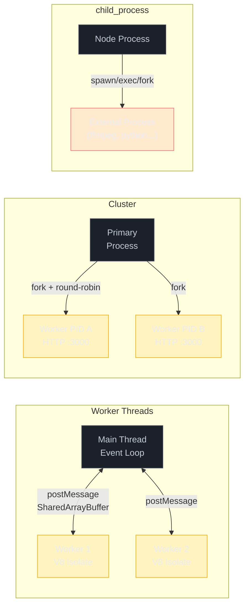

# As 3 ferramentas: Worker Threads, Cluster, child_process

> [!abstract] TL;DR
> Node tem 3 ferramentas para paralelizar: **Worker Threads** (threads JS no mesmo processo, mensagens ou memória compartilhada), **Cluster** (múltiplos processos compartilhando a mesma porta HTTP via round-robin do kernel), **child_process** (processo externo independente — qualquer comando — com IPC opcional via `fork`). Cada uma resolve um problema diferente. Escolher a errada é fonte clássica de complexidade desnecessária.

---

## O que é

Node tem 3 ferramentas nativas para paralelismo. Não são variações do mesmo mecanismo — são **modelos distintos**, cada um refletindo uma estratégia diferente de isolamento, comunicação e custo de criação.

### 1. Shared-memory model — Worker Threads

O módulo `worker_threads` cria múltiplas **threads JavaScript dentro do mesmo processo**. Cada thread tem seu próprio V8 e seu próprio event loop, mas compartilham o mesmo espaço de processo.

Comunicação entre threads pode ocorrer de dois modos:

- **Clonagem via `postMessage`**: os dados são serializados com o algoritmo structured clone e copiados para a outra thread. Seguro, sem condições de corrida, mas com overhead proporcional ao tamanho dos dados.
- **Memória compartilhada via `SharedArrayBuffer`**: ambas as threads acessam o mesmo bloco de memória sem cópia. Zero overhead de serialização, mas requer coordenação explícita (ex.: `Atomics`) para evitar condições de corrida.
- **Transferência de posse via `transferList`**: um `ArrayBuffer` pode ser transferido (zero-copy) para a outra thread, tornando o original inutilizável — útil para passar grandes blocos de bytes sem custo de cópia e sem compartilhamento.

A documentação oficial sintetiza: Workers são úteis apenas para **trabalho CPU-intensivo**. Para I/O intensivo, o modelo assíncrono nativo do Node é mais eficiente do que criar threads.

### 2. Shared-port model — Cluster

O módulo `cluster` bifurca o processo atual em múltiplos **processos Node independentes** que todos escutam na **mesma porta TCP**. O processo primário (`primary`) faz `cluster.fork()` para cada worker; os workers são processos Node completos, cada um com seu event loop e heap separados.

A distribuição de conexões entre os workers é feita por round-robin pelo processo primário (padrão em todas as plataformas exceto Windows). O primário aceita as conexões e as passa para os workers em revezamento.

Cada worker compartilha o mesmo código e a mesma porta, mas **não compartilha estado em memória**. Sessões em memória, caches locais, contadores — cada worker tem a sua cópia independente.

Comunicação entre primário e workers existe via IPC built-in, mas é um canal de mensagens, não memória compartilhada.

### 3. Separate-process model — child_process

O módulo `child_process` spawna um **processo externo completamente independente** — pode ser qualquer comando do sistema operacional, não apenas Node. O processo filho tem seu próprio espaço de memória, seu próprio ambiente, e roda fora do controle do runtime Node.

O módulo oferece 4 funções principais, com trade-offs distintos:

| Função | Shell? | Output | Uso típico |
|---|---|---|---|
| `spawn` | Não (padrão) | Streams | Dados grandes; processos de longa duração |
| `exec` | Sim | Buffer (callback) | Comandos com pipes/redirecionamento; output pequeno |
| `execFile` | Não (padrão) | Buffer (callback) | Como `exec` mas sem shell; mais seguro para input externo |
| `fork` | Não | IPC | Processo Node filho com canal de mensagens bidirecional |

`fork` é um caso especial: spawna especificamente um processo Node e estabelece um canal IPC automático. É o único método de `child_process` com suporte a `child.send()` / `process.on('message')`.

---

## Por que importa

A distinção entre os três modelos é o que permite escolher a ferramenta certa. Confundir os modelos leva a soluções que adicionam complexidade sem resolver o problema real:

**"Tenho um endpoint CPU-bound. Vou usar Cluster para escalar."** Cluster cria N cópias do mesmo processo. Se cada cópia tem o mesmo problema CPU-bound dentro do handler, você agora tem N processos com o mesmo gargalo — não paralelizou o trabalho, só multiplicou os recursos consumidos. O trabalho dentro de um único request continua bloqueando o event loop daquele worker.

**"Quero rodar um script Python. Vou usar Worker Thread."** Worker Threads executam apenas JavaScript. Não há como rodar um binário externo dentro de um Worker Thread. A ferramenta correta é `child_process.spawn`.

**"Quero spawnar um processo Node filho isolado. Vou usar `cluster.fork`."** `cluster.fork` é uma especialização que compartilha porta TCP. Para um processo Node filho isolado sem compartilhamento de porta, a ferramenta correta é `child_process.fork`.

Cada ferramenta resolve uma classe diferente de problema. A decisão acontece **antes** de escrever código.

---

## Como funciona

Os três modelos de paralelismo do Node são como três formas distintas de expandir a capacidade de um restaurante: Worker Threads é como treinar cozinheiros adicionais dentro da mesma cozinha (mesma memória, mesma infraestrutura); Cluster é como abrir filiais do mesmo restaurante em endereços diferentes mas com o mesmo cardápio (processos independentes compartilhando a mesma porta TCP); `child_process` é como terceirizar uma etapa para outro estabelecimento especializado (processo externo completamente isolado). O diagrama abaixo compara os três modelos lado a lado.



### Tabela canônica

Esta é a tabela central para decisões de paralelismo em Node:

| Ferramenta | Modelo | Isolamento | Custo de criação | IPC / Comunicação | Uso típico |
|---|---|---|---|---|---|
| `Worker Thread` | Shared-memory | Thread (mesma heap em SAB possível) | ~ms | `postMessage` / `SharedArrayBuffer` | CPU-bound dentro de um handler |
| `Cluster` | Shared-port | Processo (memória separada) | ~100ms | IPC built-in (canal de mensagens) | Escalar servidor HTTP por CPU |
| `child_process.spawn` | Separate-process | Processo (totalmente isolado) | ~100ms | stdio (streams) | Rodar comando externo arbitrário |
| `child_process.exec` | Separate-process | Processo (totalmente isolado) | ~100ms | stdio (buffer + callback) | Comando curto com shell; output pequeno |
| `child_process.fork` | Separate-process | Processo (totalmente isolado) | ~100ms | IPC built-in (`send`/`message`) | Processo Node filho isolado com mensagens |

### Exemplos de código

**Worker Thread — CPU-bound dentro do processo:**

```javascript
// main.js
import { Worker } from 'node:worker_threads';

function runWorker(data) {
  return new Promise((resolve, reject) => {
    const worker = new Worker('./cpu-worker.js', { workerData: data });
    worker.once('message', resolve);
    worker.once('error', reject);
  });
}

app.get('/compute', async (req, res) => {
  const result = await runWorker({ input: req.query.n });
  res.json({ result });
});
```

```javascript
// cpu-worker.js
import { workerData, parentPort } from 'node:worker_threads';

// Trabalho CPU-bound aqui — não bloqueia o event loop principal
const result = heavyComputation(workerData.input);
parentPort.postMessage(result);
```

**Cluster — múltiplas réplicas do servidor HTTP:**

```javascript
import cluster from 'node:cluster';
import { cpus } from 'node:os';
import { createServer } from 'node:http';

if (cluster.isPrimary) {
  const numCPUs = cpus().length;
  for (let i = 0; i < numCPUs; i++) {
    cluster.fork(); // Spawna N workers, todos escutam na mesma porta
  }
  cluster.on('exit', (worker) => {
    console.log(`Worker ${worker.process.pid} morreu — relançando`);
    cluster.fork();
  });
} else {
  // Cada worker é um processo Node independente
  createServer((req, res) => res.end('ok')).listen(3000);
}
```

**child_process.spawn — comando externo com streaming:**

```javascript
import { spawn } from 'node:child_process';

// Rodar ffmpeg — qualquer binário do sistema
const ffmpeg = spawn('ffmpeg', ['-i', 'input.mp4', 'output.webm']);

ffmpeg.stdout.on('data', (chunk) => process.stdout.write(chunk));
ffmpeg.stderr.on('data', (chunk) => process.stderr.write(chunk));
ffmpeg.on('close', (code) => console.log(`Concluído com código ${code}`));
```

**child_process.fork — processo Node filho com IPC:**

```javascript
// main.js
import { fork } from 'node:child_process';

const child = fork('./worker-process.js');

child.send({ task: 'processar', payload: dados });
child.on('message', (result) => {
  console.log('Resultado recebido:', result);
  child.disconnect();
});
```

```javascript
// worker-process.js
process.on('message', ({ task, payload }) => {
  const result = processarDados(payload);
  process.send({ result });
});
```

---

## Na prática

### A regra mental

Antes de escolher uma ferramenta, responda a uma dessas perguntas:

> **"O que exatamente estou tentando paralelizar?"**

| Situação | Ferramenta |
|---|---|
| Tenho trabalho CPU-bound e quero paralelizá-lo **dentro do mesmo processo** | `Worker Thread` |
| Quero rodar **N cópias do meu servidor HTTP** em uma máquina, usando todos os cores | `Cluster` (ou orquestrador externo) |
| Quero rodar `ffmpeg`, `imagemagick`, `python`, ou qualquer **outro comando** | `child_process.spawn` |
| Quero um **processo Node filho isolado** com canal de mensagens | `child_process.fork` |
| Tenho um **comando curto com pipes** e output pequeno | `child_process.exec` |

### Quando Cluster vs. orquestrador externo

Em produção, `Cluster` compete com orquestradores como PM2, Kubernetes, e Docker Compose. A regra prática:

- **Cluster faz sentido** em ambientes de processo único onde você quer saturar os cores da máquina sem infraestrutura adicional. Simples de configurar, zero dependências.
- **Orquestrador faz sentido** quando você já tem Kubernetes ou PM2, ou quando precisa de saúde de processo, rolling restarts, e escalonamento horizontal automático. Não vale reimplementar isso dentro do processo.

### Criar Worker por request vs. pool de Workers

Criar um `new Worker()` por request funciona mas tem overhead de ~ms por criação de thread. Para alta carga, um **pool de Workers reutilizáveis** é a solução de produção — Workers ficam em espera e recebem tarefas por fila. Coberto em detalhe em [[06 - Pool de workers - pattern de produção]].

---

## Casos práticos

### Cenário 1 — API de geração de relatórios em PDF com Worker Thread pool

Um servidor Express usa `pdfkit` para gerar relatórios em PDF sob demanda. Cada geração leva 1-3 segundos de CPU puro — sem I/O significativo, só serialização de dados para formato PDF. Com tráfego moderado, o event loop lag sobe para centenas de milissegundos e todos os endpoints ficam lentos.

A solução é um **pool de Worker Threads** — Workers ficam em espera e recebem tarefas por fila, evitando o overhead de criar um novo Worker por request.

```javascript
// pdf-worker.js — roda em Worker Thread separado
import { workerData, parentPort } from 'node:worker_threads';
import PDFDocument from 'pdfkit';

function gerarPDF(dados) {
  return new Promise((resolve) => {
    const doc = new PDFDocument();
    const chunks = [];

    doc.on('data', (chunk) => chunks.push(chunk));
    doc.on('end', () => resolve(Buffer.concat(chunks)));

    doc.fontSize(18).text(dados.titulo, { align: 'center' });
    dados.secoes.forEach(({ heading, body }) => {
      doc.moveDown().fontSize(14).text(heading);
      doc.fontSize(11).text(body);
    });
    doc.end();
  });
}

const pdf = await gerarPDF(workerData);
parentPort.postMessage(pdf, [pdf.buffer]); // transferência zero-copy via transferList
```

```javascript
// pdf-pool.js — pool simples de workers reutilizáveis
import { Worker } from 'node:worker_threads';
import { cpus } from 'node:os';

const POOL_SIZE = cpus().length;
const workers = [];
const queue = [];

for (let i = 0; i < POOL_SIZE; i++) {
  const w = new Worker('./pdf-worker.js', { workerData: {} });
  w.idle = true;
  workers.push(w);
}

export function gerarPDFAsync(dados) {
  return new Promise((resolve, reject) => {
    const idleWorker = workers.find((w) => w.idle);
    if (idleWorker) {
      idleWorker.idle = false;
      idleWorker.postMessage(dados);
      idleWorker.once('message', (pdf) => {
        idleWorker.idle = true;
        processQueue(); // próximo da fila
        resolve(pdf);
      });
      idleWorker.once('error', reject);
    } else {
      queue.push({ dados, resolve, reject });
    }
  });
}

function processQueue() {
  if (queue.length === 0) return;
  const { dados, resolve, reject } = queue.shift();
  gerarPDFAsync(dados).then(resolve).catch(reject);
}

// No handler Express:
app.post('/relatorio', async (req, res) => {
  const pdf = await gerarPDFAsync(req.body);
  res.set('Content-Type', 'application/pdf');
  res.send(pdf); // event loop principal nunca bloqueou
});
```

Com o pool, Workers são reutilizados entre requests — o overhead de criação de thread ocorre apenas uma vez, durante a inicialização do servidor.

### Cenário 2 — Pipeline de transcodificação de vídeo com child_process.spawn

Um endpoint recebe upload de vídeo e precisa transcodificá-lo para WebM usando `ffmpeg`. Como `ffmpeg` é um binário externo — Node não pode rodá-lo em Worker Thread — a ferramenta correta é `child_process.spawn`. O progresso é lido via stderr e enviado ao cliente em streaming.

```javascript
import { spawn } from 'node:child_process';
import path from 'node:path';
import fs from 'node:fs';

app.post('/transcode', async (req, res) => {
  const inputPath = req.file.path;
  const outputPath = path.join('uploads', `${Date.now()}.webm`);

  // Resposta em streaming — cliente recebe progresso em tempo real
  res.setHeader('Content-Type', 'text/event-stream');
  res.setHeader('Cache-Control', 'no-cache');
  res.flushHeaders();

  const ffmpeg = spawn('ffmpeg', [
    '-i', inputPath,
    '-c:v', 'libvpx-vp9',
    '-b:v', '0',
    '-crf', '30',
    outputPath,
  ]);

  // ffmpeg envia progresso via stderr (ex: "frame=120 fps=24 time=00:00:05.00")
  ffmpeg.stderr.on('data', (chunk) => {
    const line = chunk.toString();
    const match = line.match(/time=(\d+:\d+:\d+\.\d+)/);
    if (match) {
      res.write(`data: ${JSON.stringify({ time: match[1] })}\n\n`);
    }
  });

  ffmpeg.on('close', (code) => {
    if (code === 0) {
      res.write(`data: ${JSON.stringify({ done: true, output: outputPath })}\n\n`);
    } else {
      res.write(`data: ${JSON.stringify({ error: `ffmpeg saiu com código ${code}` })}\n\n`);
    }
    res.end();
    fs.unlink(inputPath, () => {}); // limpa o arquivo temporário
  });

  ffmpeg.on('error', (err) => {
    res.write(`data: ${JSON.stringify({ error: err.message })}\n\n`);
    res.end();
  });
});
```

`spawn` sem `shell: true` passa os argumentos diretamente ao processo — sem risco de injeção de comandos via `outputPath` ou `inputPath`. O processo de transcodificação roda completamente fora do runtime Node; o event loop principal permanece livre.

---

## Armadilhas comuns

> [!warning] Usar Cluster para CPU-bound em handler
> **O que acontece:** Cluster é adicionado esperando que CPU-bound dentro de handlers seja resolvido — mas a latência não melhora por request. **Por quê:** Cluster cria N réplicas do processo. Se o problema é CPU-bound dentro de um único request (ex: parsing pesado de JSON), cada worker bloqueia **seu próprio** event loop com o mesmo trabalho. O problema foi multiplicado, não resolvido. Cluster é para escalonamento horizontal de I/O — mais conexões HTTP distribuídas entre workers — não para paralelizar cálculo dentro de um request. **Como evitar:** Usar Worker Thread para CPU-bound dentro de um handler. Reservar Cluster para escalar conexões HTTP por CPU na mesma máquina.

> [!warning] Tentar rodar comando externo em Worker Thread
> **O que acontece:** Um binário externo (`ffmpeg`, `python`, `imagemagick`) é chamado de dentro de um Worker Thread — e falha. **Por quê:** Worker Threads executam apenas JavaScript dentro do runtime V8. Não há API para rodar binários do sistema operacional de dentro de um Worker Thread. **Como evitar:** Para qualquer processo externo, usar `child_process.spawn` (streams, dados grandes) ou `child_process.exec` (output pequeno, shell necessário). Worker Thread é para código JavaScript pesado que precisa rodar fora da thread principal.

> [!warning] Confundir cluster.fork com child_process.fork
> **O que acontece:** `cluster.fork()` é usado para spawnar um processo Node genérico de trabalho, ou `child_process.fork()` é usado tentando compartilhar uma porta HTTP. **Por quê:** São superficialmente similares — ambos criam processos Node filhos com IPC — mas com propósitos distintos. `cluster.fork()` é especialização de `child_process.fork` com compartilhamento de porta TCP: o processo filho herda o socket do servidor do primário. `child_process.fork()` cria um processo Node filho genérico com IPC, sem compartilhamento de porta. **Como evitar:** Usar `cluster.fork` apenas para servidores HTTP que precisam escalar por CPU. Usar `child_process.fork` para qualquer processo Node filho isolado com comunicação via mensagens.

> [!warning] Decidir sem entender o tipo de problema
> **O que acontece:** Worker Threads são implementadas sem diagnóstico — a latência não muda porque o bottleneck era I/O, não CPU. O código agora tem complexidade de threading sem benefício. **Por quê:** A sequência que gera dívida técnica: "a API está lenta" → "vou usar Workers" → implementar → latência igual → código complexificado sem ganho. **Como evitar:** Diagnosticar primeiro: medir event loop lag, identificar se o bottleneck é CPU ou I/O, tentar alternativas simples (streaming, paginação, API async, `UV_THREADPOOL_SIZE`). A sequência completa está em [[01 - Por que paralelismo em Node]].

> [!warning] Passar input não sanitizado para exec
> **O que acontece:** Input de usuário é interpolado diretamente na string de comando passada ao `exec` — abrindo vetor de command injection. **Por quê:** `child_process.exec` spawna um shell e passa a string como comando. Se `req.body.filename` contiver `; rm -rf /`, o shell vai executar os dois comandos. **Como evitar:** Preferir `spawn` ou `execFile` com argumentos como array separado — sem shell, sem injeção. Quando `exec` for inevitável (pipes de shell), sanitizar e validar rigorosamente qualquer input externo antes de interpolar.

---

## Em entrevista

### Frase pronta (em inglês)

> "Node has three parallelism tools, each solving a different problem. Worker Threads give you multiple JS threads in the same process — shared-memory model with message passing via `postMessage` or zero-copy access via `SharedArrayBuffer`. Cluster forks multiple processes that share an HTTP port via kernel round-robin — useful for scaling a web server across CPUs on a single host. `child_process` spawns external processes — `spawn` and `exec` for arbitrary OS commands, `fork` for Node children with a built-in IPC channel. The decision rule: CPU-bound work inside a handler → Worker Thread; HTTP scaling across cores → Cluster or an orchestrator; external command → spawn or exec; isolated Node child with messaging → fork. Picking the wrong tool is a classic source of unnecessary complexity."

### Vocabulário técnico

| PT-BR | EN |
|---|---|
| thread | thread |
| processo | process |
| modelo de memória compartilhada | shared-memory model |
| porta compartilhada | shared port |
| processo separado | separate process |
| comunicação interprocess | inter-process communication (IPC) |
| bifurcar | fork |
| spawnar | spawn |
| clonagem estruturada | structured clone |
| transferência de posse | ownership transfer |
| round-robin | round-robin |
| canal de mensagens | message channel |

### Perguntas frequentes em entrevista

**"Qual a diferença entre Worker Threads e Cluster?"** Worker Threads são threads dentro do mesmo processo — compartilham memória possível via `SharedArrayBuffer`, custo de criação em milissegundos, ideais para CPU-bound. Cluster são processos completos separados que compartilham uma porta TCP — custo de ~100ms por fork, sem memória compartilhada, ideais para escalar um servidor HTTP por cores da máquina.

**"Quando você usaria `child_process.fork` em vez de `child_process.spawn`?"** `fork` quando o processo filho é Node e você precisa de comunicação bidirecional via mensagens (`child.send` / `process.on('message')`). `spawn` quando o processo filho é qualquer outro comando — binário do sistema, script shell, programa em outra linguagem.

**"Cluster resolve CPU-bound?"** Não para um request individual. Se um handler bloqueia o event loop por 500ms de cálculo, Cluster cria N workers que individualmente bloqueiam por 500ms. Para CPU-bound dentro de um handler, a ferramenta é Worker Thread — que paraleliza o cálculo sem bloquear o event loop principal.

**"Worker Threads ajudam com I/O-bound?"** Não. Para I/O-bound, o event loop assíncrono nativo é mais eficiente do que criar threads. Workers adicionam overhead de serialização de dados sem benefício — o I/O vai para o kernel de qualquer forma.

---

## Veja também

- [[01 - Por que paralelismo em Node]] — quando usar qualquer uma dessas ferramentas e a sequência de diagnóstico
- [[03 - Worker Threads - fundamentos]] — como criar, comunicar e encerrar Worker Threads
- [[07 - Cluster - escalando HTTP por CPU]] — Cluster em profundidade: fork, eventos, graceful restart
- [[08 - child_process com exec e spawn]] — diferenças práticas, streaming de output, segurança
- [[09 - child_process com fork - Node child com IPC]] — IPC bidirecional com processo Node filho
- [[11 - Decision tree - qual ferramenta para qual problema]] — fluxograma de decisão com critérios objetivos
- [[Node.js]] — tronco da trilha Node Senior

---

## O que vem a seguir

Com o mapa dos três modelos em mãos — shared-memory, shared-port e separate-process — é hora de ir fundo em cada ferramenta individualmente. O próximo passo natural é Worker Threads, que resolve o caso mais frequente em produção: CPU-bound dentro de um handler.

- [[03 - Worker Threads - fundamentos]] — como criar, comunicar (postMessage vs SharedArrayBuffer vs transferList) e encerrar Worker Threads com segurança
- [[07 - Cluster - escalando HTTP por CPU]] — Cluster em profundidade: fork, eventos, graceful restart e quando Cluster perde para um orquestrador externo
- [[08 - child_process com exec e spawn]] — diferenças práticas entre spawn, exec e execFile, streaming de output e segurança contra command injection

---

## Fontes

- [Worker Threads — Node.js API](https://nodejs.org/api/worker_threads.html)
- [Cluster — Node.js API](https://nodejs.org/api/cluster.html)
- [Child Process — Node.js API](https://nodejs.org/api/child_process.html)
