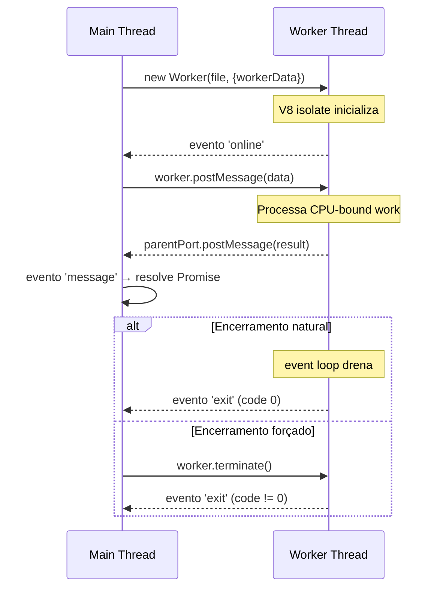

# Worker Threads: fundamentos

> [!abstract] TL;DR
> Worker Thread é uma thread JS adicional no mesmo processo Node. Criada via `new Worker(filePath, { workerData })`, comunica com a thread main via `parentPort`. Custo de criação de ~ms (vs ~100ms de um processo). Eventos do ciclo de vida: `online`, `message`, `error`, `exit`. Encerramento explícito via `await worker.terminate()` ou natural quando o worker termina o trabalho.

---

## O que é

Uma Worker Thread é uma **thread JavaScript isolada** rodando dentro do mesmo processo Node. Ela possui:

- **V8 isolate próprio** — contexto JavaScript completamente separado do main thread
- **Event loop próprio** — processa suas próprias operações de I/O e microtasks independentemente
- **Heap separada** — memória alocada no worker não é visível diretamente no main thread (exceto via `SharedArrayBuffer`)

O mecanismo está disponível no módulo `node:worker_threads` desde Node 12 (estável). O ponto de entrada é a classe `Worker`:

```javascript
import { Worker } from 'node:worker_threads';
```

A diferença-chave para os outros modelos de paralelismo: Worker Threads **ficam dentro do mesmo processo**, compartilham o mesmo PID, e podem compartilhar blocos de memória via `SharedArrayBuffer`. Processos (Cluster, child_process) têm espaços de memória completamente separados.

---

## Por que importa

Node é single-threaded por design, e isso é correto para a maioria dos workloads I/O-bound. O event loop assíncrono resolve conexões HTTP, queries de banco de dados e leitura de arquivos sem precisar de threads adicionais.

O problema aparece com trabalho genuinamente **CPU-bound**: hashing de senha, compressão, processamento de imagem, parsing de CSV de 500 mil linhas, inferência de modelos. Nesses casos, a thread JS fica ocupada com computação — o event loop não consegue processar outros callbacks durante esse tempo. Todos os outros endpoints ficam com latência alta até o cálculo terminar.

Worker Threads resolvem esse problema ao mover o trabalho CPU-bound para uma thread JS separada, liberando o event loop principal para continuar processando requests, timers, e operações de I/O.

**Por que não simplesmente subir mais réplicas no orquestrador?**

Subir réplicas no Kubernetes ou PM2 escala conexões HTTP entre instâncias do processo, mas não resolve CPU-bound *dentro de um handler em um único request*. Cada réplica ainda tem um único event loop. Worker Threads paralelizam o trabalho dentro do processo, com footprint menor (uma thread vs. um processo completo) e custo de criação mais baixo (~ms vs. ~100ms).

Worker Threads são a resposta para CPU-bound dentro de um processo. Cluster e child_process respondem a outros problemas — cobertos em [[02 - As 3 ferramentas - Worker Threads, Cluster, child_process]].

---

## Como funciona



### Propriedades estáticas do módulo

Antes dos exemplos de código, os quatro símbolos exportados pelo módulo que todo código de Worker Thread usa:

| Símbolo | Tipo | Descrição |
|---|---|---|
| `isMainThread` | `boolean` | `true` se o código está rodando na thread principal; `false` dentro de um worker |
| `workerData` | `any` | Cópia (structured clone) dos dados passados ao construtor do Worker; `null` no main thread |
| `parentPort` | `MessagePort \| null` | Canal de comunicação com a thread que criou este worker; `null` no main thread |
| `threadId` | `number` | ID único da thread atual; `0` no main thread, número sequencial nos workers |

### Modo 1 — Arquivo separado (padrão de produção)

O padrão mais comum e recomendado: `main.js` cria o worker e `worker.js` contém o trabalho pesado.

```javascript
// main.js
import { Worker } from 'node:worker_threads';

const w = new Worker('./worker.js', { workerData: { input: 42 } });

w.on('message', (msg) => console.log('resultado:', msg));  // resultado: 84
w.on('error', (err) => console.error('erro no worker:', err));
w.on('exit', (code) => console.log('worker encerrou com código', code));
```

```javascript
// worker.js
import { parentPort, workerData } from 'node:worker_threads';

const result = workerData.input * 2;
parentPort.postMessage(result);
// Após postMessage, o worker encerra naturalmente (sem mais callbacks pendentes)
```

Fluxo:
1. `new Worker('./worker.js', { workerData: ... })` — cria a thread, clona `workerData`
2. O evento `'online'` é emitido quando o worker começa a executar código
3. `parentPort.postMessage(result)` — worker envia resultado para o main thread
4. `worker.on('message', ...)` — main thread recebe o resultado
5. Sem mais código a executar no worker, o event loop do worker drena e o thread encerra
6. O evento `'exit'` é emitido com código `0` (sucesso)

### Modo 2 — Inline com `isMainThread` (mesmo arquivo)

Útil para scripts pequenos ou exemplos. O mesmo arquivo detecta em qual thread está rodando:

```javascript
import { Worker, isMainThread, parentPort, workerData } from 'node:worker_threads';

if (isMainThread) {
  // Este bloco roda apenas na thread principal
  const w = new Worker(new URL(import.meta.url), { workerData: { input: 42 } });
  w.on('message', (msg) => console.log('resultado:', msg));
  w.on('error', console.error);
  w.on('exit', (code) => {
    if (code !== 0) console.error('Worker encerrou com erro, código:', code);
  });
} else {
  // Este bloco roda apenas dentro do worker
  parentPort.postMessage(workerData.input * 2);
}
```

> [!warning] Inline vs. arquivo separado
> O modo inline economiza um arquivo mas dificulta tooling: linters, type checkers e test runners têm dificuldade com o branch duplo no mesmo módulo. Em código de produção, arquivos separados são mais fáceis de testar, tipar e depurar individualmente.

### Modo 3 — Lifecycle completo com todos os eventos

```javascript
import { Worker } from 'node:worker_threads';

const w = new Worker('./cpu-worker.js', { workerData: { n: 1000000 } });

w.on('online', () => {
  console.log('worker iniciado');
  // Opcional: enviar dados adicionais após o worker estar online
  w.postMessage({ command: 'start' });
});

w.on('message', (result) => {
  console.log('resultado recebido:', result);
});

w.on('messageerror', (err) => {
  // Emitido quando o structured clone falha ao desserializar a mensagem recebida
  console.error('falha na desserialização da mensagem:', err);
});

w.on('error', (err) => {
  // Emitido em exceção não tratada no worker
  // O worker é automaticamente terminado após 'error'
  console.error('exceção no worker:', err);
});

w.on('exit', (code) => {
  // Último evento emitido, após 'error' ou encerramento natural
  // code === 0: encerramento limpo
  // code !== 0: encerramento por erro ou terminate()
  console.log(`worker encerrou, código: ${code}`);
});
```

Ordem garantida dos eventos em encerramento normal: `online` → (zero ou mais `message`) → `exit`.

Em erro não tratado: `online` → `error` → `exit`.

### Modo 4 — Terminate explícito

Quando o worker não se encerra sozinho (loop infinito, aguardando mensagens indefinidamente), o main thread pode forçar o encerramento:

```javascript
import { Worker } from 'node:worker_threads';

const w = new Worker('./long-running-worker.js');

// Terminar após 5 segundos se o worker não encerrou sozinho
const timeout = setTimeout(async () => {
  const exitCode = await w.terminate();
  console.log('worker terminado forçadamente, código de saída:', exitCode);
}, 5000);

w.on('exit', () => clearTimeout(timeout));
```

`w.terminate()` retorna uma `Promise` que resolve com o código de saída quando o evento `'exit'` é emitido.

> [!warning] terminate() é forçado
> `terminate()` é semanticamente equivalente a `SIGKILL` — não há cleanup, não há `finally` executando no worker. Se o worker estava escrevendo em arquivo ou banco de dados, a operação pode ficar parcialmente executada. Prefira encerramento cooperativo via mensagem.

### Modo 5 — threadId como identificador de debug

```javascript
// main.js
import { Worker, threadId } from 'node:worker_threads';

console.log('main thread ID:', threadId); // 0

const w1 = new Worker('./worker.js');
const w2 = new Worker('./worker.js');
// w1.threadId e w2.threadId são sequenciais e únicos por processo
```

```javascript
// worker.js
import { threadId, parentPort } from 'node:worker_threads';

console.log('worker thread ID:', threadId); // 1, 2, etc.
parentPort.postMessage({ threadId, result: 'done' });
```

`threadId` é útil para logs e rastreamento: identificar qual worker gerou um resultado ou qual thread lançou um erro em ambiente com múltiplos workers.

---

## Na prática

### Padrão de produção: wrapping em Promise

O padrão mais comum é encapsular o worker em uma Promise para integrar com `async/await`:

```javascript
// run-worker.js
import { Worker } from 'node:worker_threads';

export function runWorker(workerFile, data) {
  return new Promise((resolve, reject) => {
    const w = new Worker(workerFile, { workerData: data });
    w.once('message', resolve);
    w.once('error', reject);
    w.once('exit', (code) => {
      if (code !== 0) {
        reject(new Error(`Worker encerrou com código ${code}`));
      }
    });
  });
}
```

```javascript
// handler
import { runWorker } from './run-worker.js';

app.get('/compute', async (req, res) => {
  try {
    const result = await runWorker('./cpu-worker.js', { n: req.query.n });
    res.json({ result });
  } catch (err) {
    res.status(500).json({ error: err.message });
  }
});
```

### Encerramento cooperativo (preferido a terminate)

Em vez de `terminate()`, enviar uma mensagem de encerramento e deixar o worker se fechar limpo:

```javascript
// main.js
w.postMessage({ command: 'shutdown' });
// O worker processa tarefas pendentes, então encerra sozinho

// worker.js
import { parentPort } from 'node:worker_threads';

parentPort.on('message', async ({ command, data }) => {
  if (command === 'shutdown') {
    // Finalizar operações pendentes se necessário
    parentPort.close(); // Fecha o canal — worker encerra quando event loop drena
    return;
  }
  const result = await processData(data);
  parentPort.postMessage(result);
});
```

### `unref()` para workers de fundo não-críticos

Por padrão, um worker ativo impede o processo de encerrar. Se o worker é para trabalho de fundo e não deve bloquear o encerramento da aplicação:

```javascript
const w = new Worker('./background-monitor.js');
w.unref(); // Processo pode encerrar sem esperar este worker
```

`w.ref()` reverte para o comportamento padrão (bloquear encerramento enquanto o worker estiver ativo).

### Criar por request vs. pool de workers

Criar `new Worker()` por request tem overhead de ~ms por thread criada. Para alta carga, isso acumula:

| Estratégia | Custo de criação | Recomendado para |
|---|---|---|
| Worker por request | ~ms por request | Carga baixa, trabalho esporádico |
| Pool de workers | Uma vez na inicialização | Alta carga, CPU-bound recorrente |

Em produção, a estratégia padrão é manter um pool de workers reutilizáveis. Coberto em detalhe em [[06 - Pool de workers - pattern de produção]].

---

## Casos práticos

### 1. Processamento de imagem por request

Em APIs de upload de imagem, redimensionamento e conversão de formato são operações CPU-bound que bloqueiam o event loop. A solução é empacotar o processamento em um Worker Thread e expor uma interface baseada em Promise para o handler Express. O buffer da imagem é transferido via `transferList` — zero cópia em ambos os sentidos.

```javascript
// image-worker.js
import { parentPort, workerData } from 'node:worker_threads';
import sharp from 'sharp';

const { imageBuffer, width, height, format } = workerData;

try {
  const processed = await sharp(Buffer.from(imageBuffer))
    .resize(width, height, { fit: 'cover' })
    .toFormat(format)
    .toBuffer();

  // Devolve o ArrayBuffer para zero-copy no caminho de volta
  const ab = processed.buffer.slice(
    processed.byteOffset,
    processed.byteOffset + processed.byteLength
  );
  parentPort.postMessage(ab, [ab]);
} catch (err) {
  parentPort.postMessage({ error: err.message });
}
```

```javascript
// process-image.js — wrapper Promise com padrão de produção
import { Worker } from 'node:worker_threads';
import { fileURLToPath } from 'node:url';
import path from 'node:path';

const __dirname = path.dirname(fileURLToPath(import.meta.url));

export function processImage(imageBuffer, options = {}) {
  return new Promise((resolve, reject) => {
    const { width = 800, height = 600, format = 'webp' } = options;

    const worker = new Worker(path.join(__dirname, 'image-worker.js'), {
      workerData: { imageBuffer, width, height, format },
      transferList: [imageBuffer],   // transferência zero-copy para o worker
    });

    worker.once('message', (result) => {
      if (result?.error) reject(new Error(result.error));
      else resolve(Buffer.from(result));
    });
    worker.once('error', reject);
    worker.once('exit', (code) => {
      if (code !== 0) reject(new Error(`Image worker encerrou com código ${code}`));
    });
  });
}
```

```javascript
// app.js — handler Express
import express from 'express';
import multer from 'multer';
import { processImage } from './process-image.js';

const app = express();
const upload = multer({ storage: multer.memoryStorage() });

app.post('/upload', upload.single('image'), async (req, res) => {
  try {
    const ab = req.file.buffer.buffer.slice(
      req.file.buffer.byteOffset,
      req.file.buffer.byteOffset + req.file.buffer.byteLength
    );
    const processado = await processImage(ab, { width: 1200, height: 800, format: 'webp' });
    res.set('Content-Type', 'image/webp').send(processado);
  } catch (err) {
    res.status(500).json({ error: 'Falha no processamento', detail: err.message });
  }
});
```

O event loop permanece disponível para outros requests enquanto o Worker Thread redimensiona a imagem. Com 10 uploads simultâneos, 10 workers processam em paralelo — o handler Express não bloqueia nenhum deles.

### 2. Parser de JSON grande

Validar e transformar um arquivo JSONL de 50 mil registros dentro do handler bloquearia o event loop por segundos. Aqui o `workerData` carrega o path do arquivo em vez de um buffer — o worker lê e processa de forma autônoma, devolvendo apenas o resumo.

```javascript
// json-parser-worker.js
import { parentPort, workerData } from 'node:worker_threads';
import fs from 'node:fs/promises';

const { filePath, schema } = workerData;

try {
  const raw = await fs.readFile(filePath, 'utf-8');
  const lines = raw.split('\n').filter(Boolean);

  const valid = [];
  const invalid = [];

  for (const line of lines) {
    try {
      const record = JSON.parse(line);
      if (schema.required.every((k) => k in record)) {
        valid.push(record);
      } else {
        invalid.push({ line, reason: 'missing required fields' });
      }
    } catch {
      invalid.push({ line, reason: 'invalid JSON' });
    }
  }

  parentPort.postMessage({ valid, invalid, total: lines.length });
} catch (err) {
  parentPort.postMessage({ error: err.message });
}
```

```javascript
// parse-json-file.js — wrapper Promise
import { Worker } from 'node:worker_threads';
import { fileURLToPath } from 'node:url';
import path from 'node:path';

const __dirname = path.dirname(fileURLToPath(import.meta.url));

export function parseJsonFile(filePath, schema) {
  return new Promise((resolve, reject) => {
    const worker = new Worker(
      path.join(__dirname, 'json-parser-worker.js'),
      { workerData: { filePath, schema } }
    );

    worker.once('message', (result) => {
      if (result.error) reject(new Error(result.error));
      else resolve(result);
    });
    worker.once('error', reject);
    worker.once('exit', (code) => {
      if (code !== 0) reject(new Error(`JSON worker encerrou com código ${code}`));
    });
  });
}
```

```javascript
// handler de importação
app.post('/import', async (req, res) => {
  const { filePath } = req.body;
  const schema = { required: ['id', 'name', 'email'] };

  try {
    const { valid, invalid, total } = await parseJsonFile(filePath, schema);
    res.json({
      total,
      imported: valid.length,
      rejected: invalid.length,
      errors: invalid.slice(0, 10), // amostra para diagnóstico
    });
  } catch (err) {
    res.status(500).json({ error: err.message });
  }
});
```

Com 50 mil registros, o parse leva ~300-500ms — tempo todo isolado no Worker Thread. Health checks, métricas e outros endpoints continuam respondendo normalmente durante esse processamento.

---

## Armadilhas comuns

> [!warning] Armadilha 1 — Não tratar o evento `'error'`
> Sem o handler `'error'`, exceções não tratadas no worker caem no `process.on('uncaughtException')` do main thread. Em Node 22+, `uncaughtException` sem handler é **fatal por padrão** — o processo encerra. Em versões anteriores, pode silenciar o erro completamente. Sempre registre `w.on('error', ...)` imediatamente após criar o worker.

```javascript
// ❌ Sem handler de error
const w = new Worker('./worker.js');
w.on('message', handleResult);

// ✓ Sempre registrar handler de error
const w = new Worker('./worker.js');
w.on('message', handleResult);
w.on('error', (err) => {
  console.error('worker error:', err);
  // Decidir: recriar worker? logar e continuar? encerrar processo?
});
```

> [!warning] Armadilha 2 — Usar `terminate()` sem cooperação
> `terminate()` é equivalente a `SIGKILL` — interrompe a thread imediatamente sem executar `finally`, `cleanup`, ou fechar recursos abertos (arquivos, conexões, streams parciais). Em workers com I/O em progresso, pode deixar dados em estado inconsistente. Use encerramento cooperativo via mensagem; `terminate()` é último recurso.

```javascript
// ❌ terminate() em worker com I/O em progresso
const w = new Worker('./file-writer.js');
await w.terminate(); // Escrita parcial no arquivo — estado corrompido

// ✓ Enviar sinal de shutdown e aguardar confirmação
w.postMessage({ command: 'shutdown' });
await new Promise((resolve) => w.once('exit', resolve));
```

> [!warning] Armadilha 3 — Passar dados que falham no structured clone
> `workerData` e `postMessage` usam **structured clone** — funções e símbolos causam `DataCloneError` em runtime (não em compilação). Instâncias de classe são ainda mais traiçoeiras: são clonadas sem erro, mas o prototype some. O receptor recebe um plain object e falha ao chamar métodos. Serialize para POJO explicitamente antes de enviar.

```javascript
// ❌ Funções não são clonáveis
new Worker('./worker.js', { workerData: { fn: () => {} } });
// DataCloneError: fn could not be cloned

// ❌ Instâncias de classes — prototype é perdido silenciosamente
new Worker('./worker.js', { workerData: new MyClass() });
// Worker recebe { ...props } sem nenhum método

// ✓ Passar apenas dados primitivos e estruturas clonáveis
new Worker('./worker.js', {
  workerData: { n: 42, config: { timeout: 5000 }, items: [1, 2, 3] }
});
```

Tipos clonáveis: primitivos, `Array`, `Object` (dados puros), `ArrayBuffer`, `TypedArray`, `Map`, `Set`, `Date`, `RegExp`. Tipos NÃO clonáveis: funções, classes com métodos, `WeakMap`, refs DOM, streams.

O mecanismo completo de comunicação (structured clone, transferList, SharedArrayBuffer) é coberto em [[04 - Comunicação entre workers - postMessage e MessageChannel]].

> [!warning] Armadilha 4 — Confundir Worker Thread com Web Worker do browser
> As APIs são intencionalmente similares mas não são portáveis entre si. Código escrito para Web Workers não roda diretamente em Node Worker Threads sem adaptação, e vice-versa.

| Aspecto | Node Worker Thread | Browser Web Worker |
|---|---|---|
| Import | `node:worker_threads` | Nativo no browser |
| `parentPort` | Sim | `self` / `DedicatedWorkerGlobalScope` |
| `workerData` | Via construtor | Via `postMessage` inicial |
| `SharedArrayBuffer` | Sim (sem COOP/COEP obrigatório) | Requer COOP + COEP headers |
| `require` / `import` | Sim (Node modules) | Não (sem bundler) |
| Acesso a Node APIs | Sim (`fs`, `crypto`, etc.) | Não |

---

## O que vem a seguir

Com o ciclo de vida de um Worker Thread claro — como criá-lo, controlar os eventos e encerrar corretamente —, os próximos passos entram no *como* os dados transitam entre threads e como sustentar esse padrão sob carga real. Criar workers por request funciona para carga baixa, mas escalar exige entender o custo de cada cópia de dados e quando reutilizar threads em vez de criar novas.

- [[04 - Comunicação entre workers - postMessage e MessageChannel]] — structured clone em detalhe, quando usar `transferList` para zero-copy e como `MessageChannel` desacopla workers entre si sem passar pelo main thread
- [[05 - Memória compartilhada - SharedArrayBuffer e Atomics]] — memória verdadeiramente compartilhada entre threads: sem cópia, com coordenação via operações atômicas
- [[06 - Pool de workers - pattern de produção]] — manter workers reutilizáveis para alta carga, eliminando o custo de criação a cada request

---

## Em entrevista

### Frase pronta (em inglês)

> "A Worker Thread is an additional JS thread in the same Node process — separate V8 isolate, separate event loop, separate heap. You create one with `new Worker(filePath, { workerData })`. The worker communicates with the main thread via `parentPort.postMessage`, and the main thread listens with `worker.on('message')`. Lifecycle events are `online`, `message`, `messageerror`, `error`, and `exit` — in that order, with `exit` always being last. Workers cost about a millisecond to create, versus around 100 milliseconds for a process — so they're cheap enough for per-request use, though pooling is the production pattern. One thing I always emphasize: always register an `'error'` handler on your worker, or uncaught exceptions inside it will bubble up to the main thread's `uncaughtException` handler — which in Node 22 is fatal by default."

### Vocabulário técnico

| PT-BR | EN |
|---|---|
| thread de trabalho | Worker Thread |
| thread principal | main thread |
| porta-pai | parentPort |
| dados do worker | workerData |
| terminar / encerrar forçado | terminate |
| isolado V8 | V8 isolate |
| thread leve | lightweight thread |
| clonagem estruturada | structured clone |
| ciclo de vida | lifecycle |
| encerramento cooperativo | cooperative shutdown |
| referência de event loop | event loop reference |

### Perguntas frequentes em entrevista

**"O que é `parentPort` e quem pode usá-lo?"** `parentPort` é o `MessagePort` que conecta o worker à thread que o criou. Só existe dentro de um worker — é `null` no main thread. O worker usa `parentPort.postMessage(data)` para enviar dados ao main; o main usa `worker.postMessage(data)` para enviar ao worker (recebido via `parentPort.on('message', ...)`).

**"Qual a diferença entre `workerData` e `postMessage`?"** `workerData` é passado uma única vez na criação do worker via construtor — é estático, não pode ser alterado depois. `postMessage` permite troca de mensagens dinâmica durante todo o ciclo de vida do worker em ambas as direções. Use `workerData` para configuração e input inicial; `postMessage` para comunicação contínua.

**"O que acontece se eu não chamar `terminate()` e o worker nunca encerrar?"** O processo Node não encerra enquanto houver workers ativos (a menos que `unref()` tenha sido chamado). Um worker "travado" — esperando por mensagem que nunca vem, ou em loop infinito — mantém o processo vivo indefinidamente. A solução é garantir que o worker encerra sozinho após o trabalho, ou usar encerramento cooperativo via mensagem + fallback de timeout com `terminate()`.

**"Por que não usar `terminate()` como primeira opção?"** `terminate()` é equivalente semanticamente a `SIGKILL`: nenhum cleanup é executado no worker. Operações de I/O em progresso ficam parcialmente executadas, arquivos podem ficar corrompidos, conexões podem ficar abertas. Em workers que realizam I/O ou acesso a banco de dados, `terminate()` é um último recurso — não o mecanismo primário de encerramento.

---

## Veja também

- [[01 - Por que paralelismo em Node]] — quando Worker Threads são necessárias e a sequência de diagnóstico
- [[02 - As 3 ferramentas - Worker Threads, Cluster, child_process]] — comparação dos 3 modelos de paralelismo
- [[04 - Comunicação entre workers - postMessage e MessageChannel]] — structured clone em detalhe, transferList, MessageChannel bidirecional
- [[05 - Memória compartilhada - SharedArrayBuffer e Atomics]] — zero-copy entre threads com coordenação via Atomics
- [[06 - Pool de workers - pattern de produção]] — manter workers reutilizáveis para alta carga
- [[Node.js]] — tronco da trilha Node Senior

---

## Fontes

- [Worker Threads — Node.js oficial](https://nodejs.org/api/worker_threads.html)
