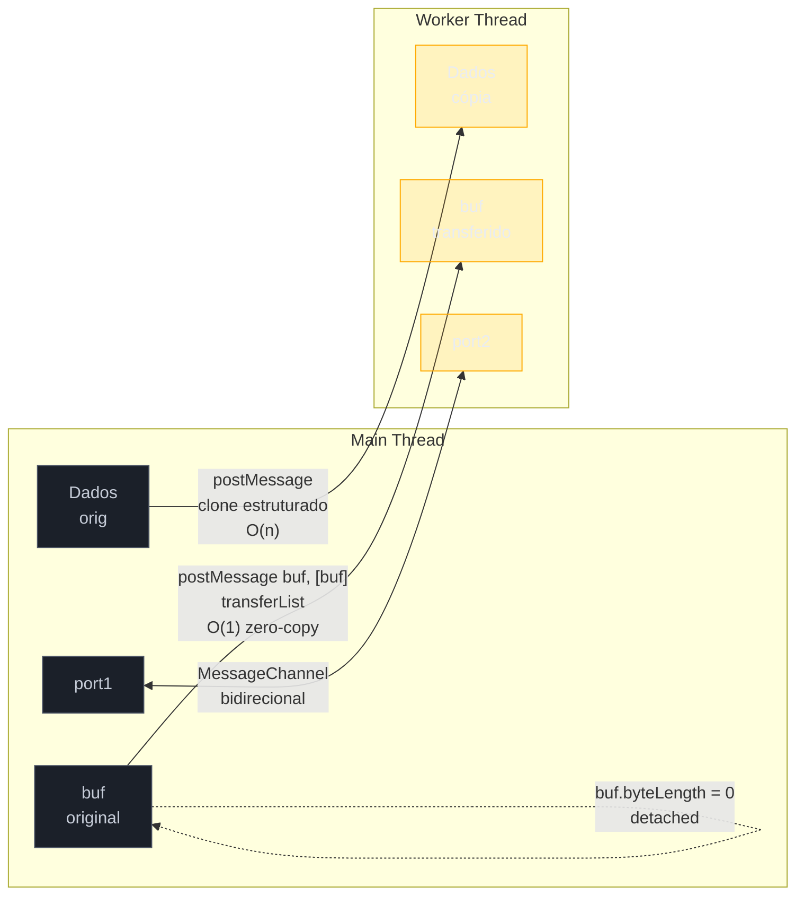

# Comunicação entre workers: postMessage e MessageChannel

> [!abstract] TL;DR
> Workers comunicam via `postMessage`, que clona o payload usando o algoritmo de clone estruturado. Para evitar cópia de buffers grandes, use `transferList` — o `ArrayBuffer` é movido (referência transferida; original fica detached). `MessageChannel` cria canais bidirecionais separados do `parentPort`, essencial para arquiteturas com múltiplos workers se comunicando entre si.

---

## O que é

Quando você cria uma Worker Thread, dois lados precisam conversar: o main thread e o worker. O mecanismo central é `postMessage` — disponível tanto no objeto `Worker` (no main thread) quanto em `parentPort` (dentro do worker). O mesmo mecanismo serve para comunicação entre dois workers via `MessageChannel`.

```javascript
// Assinaturas
worker.postMessage(value[, transferList])  // main → worker
parentPort.postMessage(value[, transferList])  // worker → main
port.postMessage(value[, transferList])  // qualquer MessagePort
```

Toda mensagem atravessa o **algoritmo de clone estruturado**: o runtime serializa o valor, transmite os bytes entre threads, e desserializa do outro lado. O resultado é uma cópia profunda — não uma referência compartilhada.

`MessageChannel` cria um par de portas vinculadas (`port1`, `port2`). Uma mensagem enviada por `port1` chega em `port2`, e vice-versa. Você pode transferir uma das portas para um worker, estabelecendo um canal direto que não passa pelo `parentPort`.

---

## Por que importa

O canal padrão de um worker (via `parentPort`) é simples e suficiente para muitos casos. O problema aparece em dois cenários:

**1. Payloads grandes.** Clone estruturado copia bytes. Enviar um `ArrayBuffer` de 100 MB de volta do worker para o main faz uma cópia de 100 MB na memória — o heap do processo cresce o dobro por alguns milissegundos. Com processamento de imagem, áudio ou buffers de ML, isso se torna o gargalo mais rápido que a própria computação. `transferList` resolve isso com custo zero de cópia.

**2. Arquiteturas multi-worker.** Se o main thread atua como broker entre cinco workers — recebendo de um, enviando para outro — ele vira um funil. `MessageChannel` permite que workers se comuniquem diretamente entre si, sem passar pelo event loop principal. O main thread cria o canal e distribui as portas; depois sai do caminho.

---

## Como funciona



### Algoritmo de clone estruturado

O clone estruturado é o protocolo de serialização usado internamente pelo `postMessage`. Ele suporta a maioria dos tipos JavaScript comuns, mas tem limites importantes.

**Tipos suportados (clonados automaticamente):**

| Categoria | Tipos |
|---|---|
| Primitivos | `string`, `number`, `boolean`, `null`, `undefined`, `BigInt` |
| Coleções | `Array`, `Map`, `Set`, `Object` (literal) |
| Datas e padrões | `Date`, `RegExp` |
| Erros | `Error`, `TypeError`, `RangeError`, `ReferenceError`, `SyntaxError`, `URIError` |
| Buffers | `ArrayBuffer`, `TypedArray` (`Uint8Array`, `Float32Array` etc.), `DataView` |
| Node.js | `Buffer` (veja caveat abaixo) |

**Tipos não suportados (causam `DataCloneError`):**

| Tipo | O que acontece |
|---|---|
| `function` | Lança `DataCloneError` em runtime |
| `symbol` | Lança `DataCloneError` em runtime |
| Nós DOM | Lança `DataCloneError` (não existe no Node, mas vale saber) |
| Instâncias de classe | **Clonadas como plain object** — prototype é perdido |
| Getters / setters | Perdidos; apenas o valor em tempo de clone é copiado |
| Propriedades não-enumeráveis | Perdidas silenciosamente |
| Referências circulares | Preservadas corretamente |

```javascript
// ✅ Funciona — tipos primitivos e coleções
worker.postMessage({
  name: 'Ada',
  born: new Date('1815-12-10'),
  tags: new Set(['math', 'computing']),
  counts: new Map([['errors', 0]]),
});

// ✅ Funciona — ArrayBuffer clonado (cópia completa dos bytes)
const buf = new ArrayBuffer(1024);
worker.postMessage(buf);

// ❌ Falha em runtime — funções não são clonáveis
worker.postMessage({ greet: () => 'hello' });
// DataCloneError: () => 'hello' could not be cloned

// ⚠️ Executa, mas perde prototype — armadilha silenciosa
class Ponto { constructor(x, y) { this.x = x; this.y = y; } distancia() { return Math.sqrt(this.x**2 + this.y**2); } }
worker.postMessage(new Ponto(3, 4));
// Worker recebe { x: 3, y: 4 } — sem o método distancia()
```

---

### transferList para zero-copy

Quando um `ArrayBuffer` (ou `MessagePort`) é listado em `transferList`, ele é **movido** entre threads — não copiado. O runtime transfere a propriedade do buffer: o lado emissor perde acesso imediato, e o receptor ganha o mesmo bloco de memória.

```javascript
// main.js
import { Worker } from 'node:worker_threads';

const w = new Worker('./worker.js');

const buf = new ArrayBuffer(100_000_000); // 100 MB
console.log('antes:', buf.byteLength);    // 100000000

// Segundo argumento: array de objetos a transferir
w.postMessage(buf, [buf]);

console.log('depois:', buf.byteLength);   // 0 — buf está detached
// Qualquer acesso a buf agora lança TypeError
```

```javascript
// worker.js
import { parentPort } from 'node:worker_threads';

parentPort.on('message', (buf) => {
  // buf aqui é o mesmo ArrayBuffer — zero cópia
  const view = new Uint8Array(buf);
  // ... processamento ...
  // Devolver ao main: transfere de volta
  parentPort.postMessage(buf, [buf]);
});
```

**Caveat importante com `Buffer` do Node.js.** Buffers criados pelo pool interno do Node (`Buffer.from()`, `Buffer.allocUnsafe()`) não podem ser transferidos — são clonados mesmo que listados em `transferList`. Para garantir transferência, use `Buffer.alloc()` ou `Buffer.allocUnsafeSlow()`, que alocam fora do pool.

```javascript
// Sempre clonado (usa pool interno) — transferList ignorado
const pooled = Buffer.from('dados');
w.postMessage(pooled, [pooled.buffer]); // silenciosamente clona

// Pode ser transferido
const standalone = Buffer.allocUnsafeSlow(1024);
w.postMessage(standalone, [standalone.buffer]); // transferido
```

**Tipos transferíveis no Node:**

| Tipo | Transferível | Observação |
|---|---|---|
| `ArrayBuffer` | Sim | Detached no emissor após transferência |
| `MessagePort` | Sim | Canal passa de uma thread para outra |
| `FileHandle` | Sim | Handle de arquivo passa para o receptor |
| `SharedArrayBuffer` | Não | Compartilhado por referência — não precisa transferir |
| `TypedArray` | Indiretamente | Transfira o `.buffer` subjacente |

---

### MessageChannel para canais bidirecionais

`MessageChannel` cria um par de `MessagePort`s interligados. Qualquer mensagem enviada por `port1` chega em `port2`, e vice-versa. A porta pode ser transferida para um worker via `postMessage`, estabelecendo um canal dedicado.

```javascript
// main.js
import { Worker, MessageChannel } from 'node:worker_threads';

const w = new Worker('./worker.js');
const { port1, port2 } = new MessageChannel();

// Transfere port2 para o worker (porta passa de thread para o worker)
w.postMessage({ port: port2 }, [port2]);

// Main usa port1 para conversar pelo canal dedicado
port1.on('message', (msg) => {
  console.log('worker diz:', msg);
});

port1.postMessage('olá pelo canal dedicado');
```

```javascript
// worker.js
import { parentPort } from 'node:worker_threads';

// Recebe a porta pelo canal padrão (parentPort)
parentPort.once('message', ({ port }) => {
  // Agora usa o canal dedicado para comunicação subsequente
  port.on('message', (msg) => {
    console.log('main diz:', msg);        // olá pelo canal dedicado
    port.postMessage('olá de volta');
  });
});
```

**Padrão broker — workers comunicando entre si:**

```javascript
// main.js: distribui portas entre dois workers e sai do caminho
import { Worker, MessageChannel } from 'node:worker_threads';

const { port1, port2 } = new MessageChannel();

const wA = new Worker('./worker-a.js');
const wB = new Worker('./worker-b.js');

// Cada worker recebe sua porta
wA.postMessage({ port: port1 }, [port1]);
wB.postMessage({ port: port2 }, [port2]);

// Deste ponto, wA e wB conversam diretamente — main não está no caminho
```

```javascript
// worker-a.js
import { parentPort } from 'node:worker_threads';

parentPort.once('message', ({ port }) => {
  port.postMessage({ resultado: 42 });

  port.on('message', (msg) => {
    console.log('worker-b respondeu:', msg);
    port.close(); // importante: fechar após uso
  });
});
```

```javascript
// worker-b.js
import { parentPort } from 'node:worker_threads';

parentPort.once('message', ({ port }) => {
  port.on('message', (msg) => {
    console.log('worker-a enviou:', msg);
    port.postMessage({ confirmado: true });
    port.close();
  });
});
```

---

### Tabela de decisão: clonar vs. transferir vs. falha

| Situação | Mecanismo | Custo | Resultado no emissor |
|---|---|---|---|
| String, number, Date, Map, Set | Clone estruturado | O(n) serialização | Cópia independente |
| `ArrayBuffer` sem `transferList` | Clone estruturado | O(n) cópia de bytes | Original intacto |
| `ArrayBuffer` com `transferList` | Transferência | O(1) | Original detached |
| `MessagePort` | Transferência obrigatória | O(1) | Original inutilizável |
| `SharedArrayBuffer` | Referência compartilhada | O(1) | Mesmo bloco em ambos |
| `function` | — | — | `DataCloneError` |
| Instância de classe | Clone parcial | O(n) | Cópia sem prototype |

---

## Na prática

**Processamento de imagem e áudio.** Um pipeline típico: main recebe um buffer de requisição HTTP, transfere para um worker via `transferList`, o worker processa (redimensiona, comprime, aplica filtro), transfere de volta. Sem cópia de bytes em nenhum dos dois sentidos. A latência extra de serialização some — apenas o processamento real conta.

```javascript
// Padrão: recebe → transfere → processa → devolve
async function processarImagem(imageBuffer) {
  return new Promise((resolve, reject) => {
    const worker = new Worker('./image-worker.js');
    // Transfere o buffer — zero cópia
    worker.postMessage(imageBuffer, [imageBuffer]);
    worker.once('message', (processado) => {
      resolve(processado);
      worker.terminate();
    });
    worker.once('error', reject);
  });
}
```

**JSON.stringify vs. clone estruturado.** Para payloads pequenos com tipos simples (arrays de números, objetos planos), `JSON.stringify` + `JSON.parse` pode ser mais rápido que o clone estruturado, porque o engine otimiza parsing de JSON. Clone estruturado é mais rápido para objetos grandes com estruturas ricas (`Map`, `Set`, `Date`, referências circulares).

**Canais de controle separados.** Um padrão comum em pools de workers: além do canal de dados (onde os buffers circulam), criar um `MessageChannel` separado só para mensagens de controle (`pause`, `flush`, `shutdown`). Os dois canais são independentes — uma mensagem de controle urgente não espera na fila atrás de um buffer de 50 MB.

```javascript
// Padrão: canal de dados + canal de controle separados
import { Worker, MessageChannel } from 'node:worker_threads';

function criarWorkerComControle(script) {
  const dataChannel = new MessageChannel();
  const ctrlChannel = new MessageChannel();

  const worker = new Worker(script);

  // Envia as duas portas de uma vez — ambas transferidas
  worker.postMessage(
    { dataPort: dataChannel.port2, ctrlPort: ctrlChannel.port2 },
    [dataChannel.port2, ctrlChannel.port2]
  );

  return {
    // Canal de dados: envia payloads pesados
    sendData: (buf) => dataChannel.port1.postMessage(buf, [buf]),
    onData: (fn) => dataChannel.port1.on('message', fn),
    // Canal de controle: mensagens leves, alta prioridade
    sendCtrl: (cmd) => ctrlChannel.port1.postMessage(cmd),
    onCtrl: (fn) => ctrlChannel.port1.on('message', fn),
    shutdown: () => {
      dataChannel.port1.close();
      ctrlChannel.port1.close();
      return worker.terminate();
    },
  };
}
```

**Tratando erros de clone (`messageerror`).** Além do evento `message`, `MessagePort` e `Worker` emitem `messageerror` quando a desserialização de uma mensagem recebida falha. Isso é raro mas acontece quando o receptor não consegue reconstruir o objeto (por exemplo, um `MessagePort` já fechado que chegou em `transferList`). Registrar o handler evita que erros silenciosos passem despercebidos:

```javascript
const w = new Worker('./worker.js');

w.on('message', (msg) => {
  // mensagem desserializada com sucesso
});

w.on('messageerror', (err) => {
  // falha na desserialização do lado do receptor
  console.error('falha ao deserializar mensagem recebida do worker:', err);
});
```

---

## Casos práticos

### 1. Pipeline de análise de áudio com zero-copy

Em serviços de processamento de áudio (podcasts, reconhecimento de voz, transcrição), o servidor recebe grandes buffers via HTTP e precisa analisá-los sem duplicar a memória. O padrão completo é: receber o `ArrayBuffer`, transferi-lo ao worker (zero-copy), o worker processa e devolve os resultados via `transferList`. Nenhum byte é copiado em nenhum dos dois sentidos.

```javascript
// audio-analyzer-worker.js
import { parentPort } from 'node:worker_threads';

parentPort.once('message', ({ audioBuffer }) => {
  // Acesso direto ao ArrayBuffer transferido — zero cópia, mesmo bloco de memória
  const float32 = new Float32Array(audioBuffer);

  // Análise: calcular RMS (Root Mean Square) por janela de 1024 amostras
  const windowSize = 1024;
  const rmsValues = [];

  for (let i = 0; i < float32.length; i += windowSize) {
    const window = float32.slice(i, i + windowSize);
    const sumSquares = window.reduce((acc, val) => acc + val * val, 0);
    rmsValues.push(Math.sqrt(sumSquares / window.length));
  }

  // Empacotar resultado como Float32Array e devolver via transferList — zero-copy de volta
  const result = new Float32Array(rmsValues);
  parentPort.postMessage(
    { rms: result.buffer, windowCount: rmsValues.length },
    [result.buffer]
  );
});
```

```javascript
// analyze-audio.js — wrapper com transferList nos dois sentidos
import { Worker } from 'node:worker_threads';
import { fileURLToPath } from 'node:url';
import path from 'node:path';

const __dirname = path.dirname(fileURLToPath(import.meta.url));

export function analyzeAudio(audioArrayBuffer) {
  return new Promise((resolve, reject) => {
    const worker = new Worker(
      path.join(__dirname, 'audio-analyzer-worker.js')
    );

    // Transfere o buffer — zero-copy para o worker; audioArrayBuffer fica detached
    worker.postMessage({ audioBuffer: audioArrayBuffer }, [audioArrayBuffer]);

    worker.once('message', ({ rms, windowCount }) => {
      // rms é o buffer transferido de volta — também zero-copy
      resolve({
        rmsValues: new Float32Array(rms),
        windowCount,
      });
    });

    worker.once('error', reject);
    worker.once('exit', (code) => {
      if (code !== 0) reject(new Error(`Audio worker encerrou com código ${code}`));
    });
  });
}
```

```javascript
// handler Express
app.post('/analyze', express.raw({ type: 'audio/*', limit: '50mb' }), async (req, res) => {
  // req.body é Buffer — extrair o ArrayBuffer subjacente
  const audioBuffer = req.body.buffer.slice(
    req.body.byteOffset,
    req.body.byteOffset + req.body.byteLength
  );

  const { rmsValues, windowCount } = await analyzeAudio(audioBuffer);

  res.json({
    windowCount,
    peakRms: Math.max(...rmsValues),
    avgRms: rmsValues.reduce((a, b) => a + b, 0) / rmsValues.length,
  });
});
```

Um arquivo de áudio de 50 MB processado desta forma usa ~50 MB de heap total — sem `transferList` seriam ~150 MB (original + cópia no worker + resultado de volta). A diferença se torna crítica sob carga concorrente.

### 2. Sistema de broker com canais separados por MessageChannel

Em arquiteturas com múltiplos workers especializados, o main thread tipicamente atua como dispatcher. `MessageChannel` permite que um worker de banco e um worker de cache se comuniquem diretamente para operações de write-through — sem que cada mensagem precise atravessar o event loop do main thread.

```javascript
// db-worker.js — worker de banco de dados
import { parentPort } from 'node:worker_threads';

let cachePort = null;

parentPort.on('message', ({ type, payload, port }) => {
  if (type === 'init') {
    // Recebe a porta do canal direto com o cache worker
    cachePort = port;

    cachePort.on('message', ({ type: cacheType, key, value }) => {
      if (cacheType === 'cache-miss') {
        // Cache não tem o dado — DB worker busca e preenche o cache diretamente
        const data = queryDatabase(key);
        cachePort.postMessage({ type: 'fill-cache', key, value: data });
        parentPort.postMessage({ type: 'result', key, value: data });
      } else if (cacheType === 'cache-hit') {
        // Cache respondeu — repassar ao main
        parentPort.postMessage({ type: 'result', key, value });
      }
    });
    return;
  }

  if (type === 'query') {
    // Consulta o cache primeiro via canal direto
    cachePort.postMessage({ type: 'get', key: payload.key });
  }
});

function queryDatabase(key) {
  // Simulação — em produção: pool de conexões (pg, mysql2, etc.)
  return { id: key, data: `resultado-${key}`, ts: Date.now() };
}
```

```javascript
// cache-worker.js — worker de cache em memória
import { parentPort } from 'node:worker_threads';

const cache = new Map();
let dbPort = null;

parentPort.on('message', ({ type, port }) => {
  if (type === 'init') {
    dbPort = port;

    // Canal direto: responde requests do DB worker
    dbPort.on('message', ({ type: msgType, key, value }) => {
      if (msgType === 'get') {
        const cached = cache.get(key);
        if (cached) {
          dbPort.postMessage({ type: 'cache-hit', key, value: cached });
        } else {
          dbPort.postMessage({ type: 'cache-miss', key });
        }
      } else if (msgType === 'fill-cache') {
        // DB worker preencheu — atualizar cache
        cache.set(key, value);
      }
    });
  }
});
```

```javascript
// main.js — orquestrador: cria canal e distribui portas; depois sai do caminho
import { Worker, MessageChannel } from 'node:worker_threads';

const { port1: dbSide, port2: cacheSide } = new MessageChannel();

const dbWorker = new Worker('./db-worker.js');
const cacheWorker = new Worker('./cache-worker.js');

// Distribui as portas — ambas são transferidas (não copiadas)
dbWorker.postMessage({ type: 'init', port: dbSide }, [dbSide]);
cacheWorker.postMessage({ type: 'init', port: cacheSide }, [cacheSide]);

// A partir daqui, DB e cache conversam diretamente via MessageChannel
// Main thread só despacha queries e recebe resultados
dbWorker.postMessage({ type: 'query', payload: { key: 'user:42' } });

dbWorker.on('message', ({ type, key, value }) => {
  if (type === 'result') {
    console.log(`Resultado para ${key}:`, value);
  }
});
```

O ponto crítico: quando o cache worker responde a um cache-miss, a mensagem vai diretamente de um worker ao outro — sem passar pelo event loop do main thread. Em sistemas com centenas de queries por segundo, isso elimina o main thread como gargalo centralizado para operações de coordenação entre workers.

---

## Armadilhas comuns

> [!warning] Armadilha 1 — Esquecer `transferList` em buffers grandes
> `postMessage(buf)` sem `[buf]` faz uma cópia silenciosa de tudo. Com imagens ou buffers de ML de 50-200 MB, o heap cresce, o GC pressiona, e a latência sobe. Não há aviso em runtime — o código funciona, mas é lento. Sempre inspecione o que está sendo enviado antes de assumir que é zero-copy.

> [!warning] Armadilha 2 — Enviar funções ou instâncias de classe
> `postMessage({ fn: () => {} })` lança `DataCloneError` em runtime — não em tempo de compilação, não em testes unitários simples que não chegam a serializar. Instâncias de classe são ainda mais traiçoeiras: o clone acontece sem erro, mas o prototype some. O receptor recebe um plain object e falha mais tarde, ao tentar chamar um método. Sempre serialize explicitamente: converta para POJOs antes de enviar.

> [!warning] Armadilha 3 — `MessagePort` sem `port.close()`
> Cada `MessagePort` ativo mantém o event loop vivo (equivalente a um ref count). Um worker que termina o trabalho mas não chama `port.close()` não encerra — o runtime espera por mais mensagens. Em um pool de workers com muita rotatividade, isso vaza file descriptors e memória. Sempre feche portas no shutdown do worker.

> [!warning] Armadilha 4 — `Buffer` do pool não é transferível
> `Buffer.from('dados').buffer` aponta para o pool compartilhado interno do Node. Listá-lo em `transferList` não transfere — é clonado silenciosamente. Se o código depende de zero-copy de `Buffer`, use `Buffer.allocUnsafeSlow()` para alocar fora do pool. O problema não gera erro; só desperdiça memória e tempo.

> [!tip] Dica — `markAsUntransferable()` para objetos que não devem sair
> Se um objeto precisa ser enviável por `postMessage` mas nunca transferido (por exemplo, um buffer que o worker ainda precisa usar), marque-o explicitamente: `worker_threads.markAsUntransferable(buf)`. Qualquer tentativa de listá-lo em `transferList` lança erro imediatamente — melhor que falhar silenciosamente.

---

## O que vem a seguir

Você já entende como dados trafegam entre threads — clone estruturado para tipos genéricos, `transferList` para zero-copy de buffers, `MessageChannel` para canais dedicados. O próximo passo natural é eliminar a cópia completamente: `SharedArrayBuffer` deixa as duas threads acessarem o mesmo bloco de memória simultaneamente, mas isso exige coordenação explícita para evitar race conditions. Depois, o padrão de pool reúne tudo: workers reutilizáveis que recebem trabalho via canais e distribuem carga com backpressure controlado.

- [[05 - Memória compartilhada - SharedArrayBuffer e Atomics]] — memória verdadeiramente compartilhada entre threads, sem cópia em nenhuma direção, com coordenação via operações atômicas e `Atomics.wait`/`Atomics.notify`
- [[06 - Pool de workers - pattern de produção]] — manter workers reutilizáveis com fila de tarefas, backpressure e health check; o pattern canônico para carga real

---

## Em entrevista

> [!quote] Frase pronta (inglês)
> "Communication between Worker Threads goes through `postMessage`, which uses the structured clone algorithm to deep-copy the payload. That means most JS values work — primitives, plain objects, Maps, Sets, Buffers — but functions and class instances don't survive. For zero-copy of large buffers, the second argument is `transferList`: the `ArrayBuffer` is moved instead of copied, leaving the original detached on the sender side. For multi-worker architectures, `MessageChannel` creates a dedicated bidirectional channel that you can transfer to a worker, letting workers talk to each other without going through main."

**Vocabulário técnico:**

| Português | Inglês |
|---|---|
| clone estruturado | structured clone |
| zero-cópia | zero-copy |
| transferir referência | transfer ownership |
| buffer destacado | detached buffer |
| canal de mensagem | message channel |
| postar mensagem | post message |
| lista de transferência | transfer list |

**Perguntas frequentes em entrevista:**

- *"Por que `postMessage` não aceita funções?"* — Funções são closures que capturam o contexto de execução da thread original. Não é possível serializar o escopo léxico e o ambiente de variáveis para outra thread com contexto independente.
- *"Qual a diferença entre `SharedArrayBuffer` e `ArrayBuffer` com `transferList`?"* — `SharedArrayBuffer` é acessado pelas duas threads simultaneamente (risco de race condition, requer `Atomics`). `ArrayBuffer` com `transferList` passa a propriedade — apenas uma thread acessa de cada vez.
- *"Quando usar `MessageChannel` em vez de `parentPort`?"* — Quando você quer múltiplos canais independentes (dados vs. controle), quando dois workers precisam se comunicar diretamente, ou quando um worker precisa se comunicar com múltiplos consumidores diferentes.

---

## Veja também

- [[03 - Worker Threads - fundamentos]]
- [[05 - Memória compartilhada - SharedArrayBuffer e Atomics]]
- [[06 - Pool de workers - pattern de produção]]
- [[Node.js]]

---

## Fontes

- [worker.postMessage(value, transferList) — Node.js oficial](https://nodejs.org/api/worker_threads.html#workerpostmessagevalue-transferlist)
- [Structured clone algorithm — MDN](https://developer.mozilla.org/en-US/docs/Web/API/Web_Workers_API/Structured_clone_algorithm)
