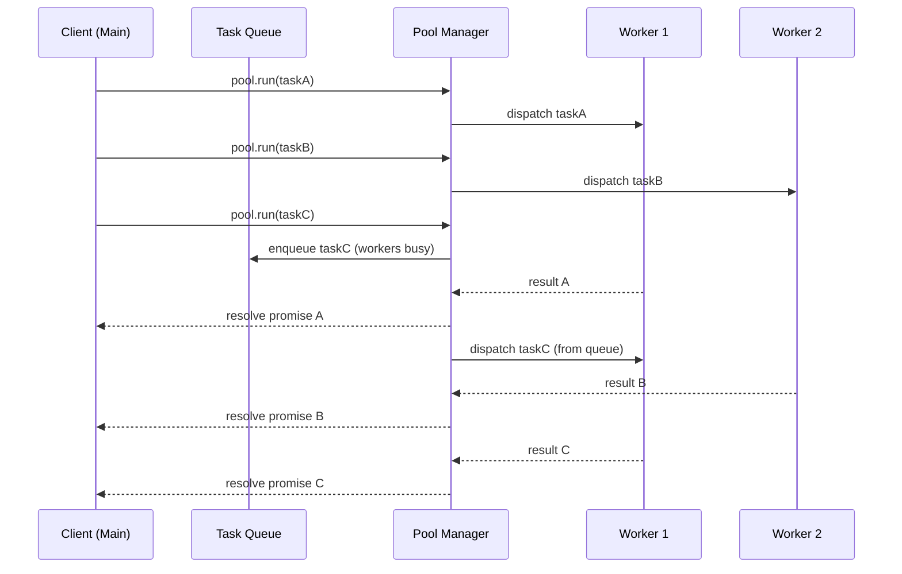

# Pool de workers: pattern de produção

> [!abstract] TL;DR
> Em produção, criar um Worker por task é caro: o custo de spawn (~alguns ms) se acumula em escala, e o GC tem que limpar constantemente workers terminados. O pattern canônico é o **pool**: N workers mantidos vivos que recebem tasks via queue. `piscina` (por Matteo Collina) é a lib de referência no ecossistema Node — trata sizing, queueing, idleTimeout, métricas e graceful shutdown. Implementação manual é instrutiva para entender o pattern, mas tem edge cases sutis que `piscina` resolve. Sempre conecte `pool.destroy()` ao handler de `SIGTERM`.

---

## O que é

Um **worker pool** é uma abstração que mantém um conjunto fixo de N workers vivos e despacha tasks para eles via uma fila interna. Quando um worker conclui uma task, ele fica disponível para a próxima — sem ser destruído e recriado.

O modelo é análogo a um pool de conexões de banco de dados: em vez de abrir e fechar uma conexão por query, o pool mantém conexões abertas e as empresta conforme necessário. A mesma lógica se aplica a workers: o custo de inicialização é pago uma vez, e a reutilização amortiza esse custo ao longo de muitas tasks.

```
Main thread
    │
    ├─ task A ──► [Worker 1] ──► resultado A
    ├─ task B ──► [Worker 2] ──► resultado B
    ├─ task C ──► [Worker 3] ──► resultado C  ← pool de tamanho 3
    └─ task D ──► [Queue]    ──► aguarda worker livre
                      │
                      └──► [Worker 1] ──► resultado D  (após A terminar)
```

A queue absorve picos de carga temporários — tasks que chegam enquanto todos os workers estão ocupados ficam pendentes em vez de serem rejeitadas ou causarem criação de novos workers.

---

## Por que importa

### O custo invisível de spawn-por-task

Criar um Worker não é gratuito. Cada instância precisa:

- inicializar um isolate V8 separado
- carregar e compilar o módulo do worker
- alocar memória para heap, stack e estruturas internas

Na prática, isso custa alguns milissegundos por criação. Em um servidor que processa 1.000 requests/s, cada um disparando um Worker, esse custo se torna o gargalo dominante — não a lógica de negócio.

Além disso, workers terminados não desaparecem instantaneamente: o GC precisa coletar os objetos associados, o que cria pressão de memória e pausas de GC intermitentes.

### Por que não usar apenas async/await

`async/await` é ideal para operações I/O-bound: enquanto aguarda uma resposta de banco ou de rede, o event loop processa outras tarefas. Mas operações CPU-bound não liberam o event loop — elas travam a thread principal inteira.

Pool de workers é a resposta para **CPU-bound work**: mova o trabalho pesado para threads separadas, mantenha o event loop livre para I/O e coordenação.

---

## Como funciona



> A analogia é a fila de caixa de um banco: há N caixas abertas (workers). Clientes que chegam quando todos estão ocupados esperam na fila — mas ninguém abre um caixa novo para cada cliente. Quando um caixa termina de atender, ele chama o próximo da fila.

### 1. Implementação manual mínima

A implementação abaixo é didática — serve para entender o mecanismo antes de usar `piscina`. Tem limitações deliberadas que serão apontadas.

```javascript
// pool.js
import { Worker } from 'node:worker_threads';

class WorkerPool {
  constructor(file, size) {
    this.workers = Array.from({ length: size }, () => new Worker(file));
    this.idle = [...this.workers];
    this.queue = [];
  }

  run(data) {
    return new Promise((resolve, reject) => {
      const task = { data, resolve, reject };
      if (this.idle.length) {
        this.#dispatch(task);
      } else {
        this.queue.push(task);
      }
    });
  }

  #dispatch(task) {
    const worker = this.idle.pop();

    worker.once('message', (result) => {
      task.resolve(result);
      if (this.queue.length) {
        this.#dispatch(this.queue.shift());
      } else {
        this.idle.push(worker);
      }
    });

    // Tratamento de erro: sem isso, um crash no worker trava a task
    worker.once('error', (err) => {
      task.reject(err);
    });

    worker.postMessage(task.data);
  }

  async shutdown() {
    await Promise.all(this.workers.map((w) => w.terminate()));
  }
}

export { WorkerPool };
```

```javascript
// worker.js
import { parentPort } from 'node:worker_threads';

parentPort.on('message', (data) => {
  // Simulação de trabalho CPU-bound
  const result = data.numbers.reduce((acc, n) => acc + n * n, 0);
  parentPort.postMessage({ result });
});
```

```javascript
// main.js
import { WorkerPool } from './pool.js';

const pool = new WorkerPool(
  new URL('./worker.js', import.meta.url).pathname,
  4 // tamanho do pool = número de CPUs disponíveis
);

const results = await Promise.all([
  pool.run({ numbers: [1, 2, 3, 4] }),
  pool.run({ numbers: [5, 6, 7, 8] }),
  pool.run({ numbers: [9, 10, 11, 12] }),
  pool.run({ numbers: [13, 14, 15, 16] }),
  pool.run({ numbers: [17, 18, 19, 20] }), // vai para a queue
]);

console.log(results); // [{ result: 30 }, { result: 174 }, ...]

await pool.shutdown();
```

> [!warning] Limitações desta implementação
> Esta versão didática tem lacunas intencionais:
> - Sem `maxQueue`: a fila pode crescer sem limite, causando OOM sob carga extrema.
> - Sem re-spawn: se um worker crasha com `exit code !== 0`, ele sai do pool permanentemente.
> - Sem métricas: não há forma de observar utilização, tamanho de fila ou throughput.
> - Sem timeout por task: uma task presa bloqueia o worker indefinidamente.
>
> `piscina` resolve todos esses casos.

### 2. Usando `piscina`

`piscina` é a biblioteca de referência para worker pools em Node.js, mantida por Matteo Collina (membro do TSC do Node.js).

```bash
npm install piscina
```

O worker precisa exportar a função (ou funções) que o pool vai executar:

```javascript
// worker.js — formato piscina
export default function processNumbers({ numbers }) {
  return numbers.reduce((acc, n) => acc + n * n, 0);
}

// Ou exportar múltiplas funções nomeadas:
export function sum({ numbers }) {
  return numbers.reduce((a, b) => a + b, 0);
}

export function squaredSum({ numbers }) {
  return numbers.reduce((acc, n) => acc + n * n, 0);
}
```

```javascript
// main.js
import Piscina from 'piscina';
import { availableParallelism } from 'node:os';

const pool = new Piscina({
  filename: new URL('./worker.js', import.meta.url).href,

  // Sizing do pool
  minThreads: 2,                        // mantém pelo menos 2 workers vivos
  maxThreads: availableParallelism(),   // não excede CPUs disponíveis

  // Controle de fila
  maxQueue: 'auto',   // quadrado de maxThreads; rejeita com erro se exceder

  // Gestão de inatividade
  idleTimeout: 30_000, // workers parados por 30s são terminados (libera RAM)

  // Tarefas simultâneas por worker (padrão: 1)
  concurrentTasksPerWorker: 1,
});

// Executar task com a função default do worker
const result = await pool.run({ numbers: [1, 2, 3, 4] });
console.log(result); // 30

// Executar função nomeada específica
const total = await pool.run({ numbers: [1, 2, 3, 4] }, { name: 'sum' });
console.log(total); // 10

// Cancelamento via AbortController
const controller = new AbortController();
const promise = pool.run({ numbers: [1, 2, 3] }, { signal: controller.signal });
controller.abort(); // cancela se ainda estiver na fila
```

### 3. Backpressure e controle de fila

Sob carga extrema, a fila pode crescer indefinidamente. `piscina` expõe mecanismos para detectar e reagir a isso:

```javascript
// Verificar pressão antes de enfileirar
if (pool.queueSize >= pool.options.maxQueue) {
  // Rejeitar a task, retornar HTTP 503, etc.
  throw new Error('Pool está sobrecarregado — tente novamente');
}

// Ou usar os eventos de drenagem
pool.on('drain', () => {
  console.log('Fila drenada — pool disponível');
  // Retomar ingestão de tasks
});

// pool.needsDrain: boolean — true quando fila está cheia
if (!pool.needsDrain) {
  await pool.run(task);
}
```

### 4. Graceful shutdown

Encerrar o processo sem esperar tasks em andamento causa perda de trabalho e potencial corrupção de estado:

```javascript
// shutdown.js — padrão de produção
import Piscina from 'piscina';

const pool = new Piscina({
  filename: new URL('./worker.js', import.meta.url).href,
  maxThreads: availableParallelism(),
  closeTimeout: 30_000, // espera até 30s pelas tasks em andamento
});

async function gracefulShutdown(signal) {
  console.log(`Recebido ${signal} — iniciando graceful shutdown`);
  try {
    // close() aguarda tasks em andamento; destroy() interrompe imediatamente
    await pool.close();
    console.log('Pool encerrado com sucesso');
    process.exit(0);
  } catch (err) {
    console.error('Erro durante shutdown:', err);
    process.exit(1);
  }
}

process.on('SIGTERM', () => gracefulShutdown('SIGTERM'));
process.on('SIGINT',  () => gracefulShutdown('SIGINT'));
```

> [!tip] `close()` vs `destroy()`
> - `pool.close()`: aguarda tasks em andamento concluírem antes de terminar workers. Usar em SIGTERM (shutdown controlado).
> - `pool.destroy()`: termina workers imediatamente, rejeita tasks pendentes. Usar em SIGKILL equivalente ou quando `close()` atingir timeout.

### 5. Métricas e observabilidade

```javascript
// Snapshot de métricas do pool
function poolMetrics(pool) {
  return {
    // Throughput
    completed: pool.completed,          // tasks finalizadas desde a criação

    // Estado atual
    threads: pool.threads.length,       // workers ativos agora
    queueSize: pool.queueSize,          // tasks aguardando na fila
    needsDrain: pool.needsDrain,        // fila cheia?

    // Utilização (0.0–1.0)
    utilization: pool.utilization,      // razão tempo-real / capacidade-total

    // Histogramas de latência (objeto com p50, p75, p99, max, etc.)
    runTime: {
      p50: pool.runTime.percentile(50),
      p99: pool.runTime.percentile(99),
    },
    waitTime: {
      p50: pool.waitTime.percentile(50),
      p99: pool.waitTime.percentile(99),
    },
  };
}

// Expor via endpoint de health check, Prometheus, etc.
setInterval(() => {
  const metrics = poolMetrics(pool);
  console.log(JSON.stringify(metrics));
}, 10_000);
```

---

## Na prática

### Sizing do pool

O ponto de partida padrão é `maxThreads = availableParallelism()` — um thread por CPU lógica. Isso garante que há paralelismo real sem custo de context switching excessivo.

Ajustes situacionais:

| Cenário | Ajuste |
|---|---|
| Tasks com I/O interno (ex: leitura de arquivo no worker) | `maxThreads` pode ser `2× CPUs` — workers ficam bloqueados esperando I/O |
| Tasks puramente CPU-bound | `maxThreads = CPUs` — context switching adicional só piora |
| Servidor compartilhado (ex: container com 0.5 CPU) | `maxThreads = 1` ou `2` no máximo |
| Tasks muito curtas (< 1ms) | Reavaliar se pool é necessário — overhead de postMessage pode dominar |

### `idleTimeout` e economia de memória

Cada worker consome entre 20–60 MB de heap V8, dependendo do que carrega. Em apps com picos de carga seguidos de períodos de baixa atividade, manter `maxThreads` workers vivos o tempo todo é desperdício.

`idleTimeout` resolve isso: workers que ficam inativos por mais de N milissegundos são terminados. O pool re-spawna conforme a demanda volta.

```javascript
const pool = new Piscina({
  filename: new URL('./worker.js', import.meta.url).href,
  minThreads: 1,      // sempre mantém 1 worker pronto
  maxThreads: 8,      // pode crescer até 8 sob carga
  idleTimeout: 60_000 // derruba workers ociosos após 1 minuto
});
```

### Idempotência das tasks

Workers podem crashar mid-task por erros não capturados. `piscina` re-spawna o worker, mas a task que estava sendo processada é perdida (a Promise rejeita). Se a task tinha side effects (escrita em banco, envio de email, publicação em fila), esses efeitos podem ter acontecido parcialmente.

Regra de produção: **tasks de worker devem ser idempotentes**. Se a task for executada duas vezes com os mesmos inputs, o resultado deve ser o mesmo e sem efeitos duplicados. Isso permite retry seguro após falha.

---

## Casos práticos

Os exemplos da seção "Na prática" mostraram o _sizing_ e a idempotência. Aqui vai além: dois cenários de produção com código completo e tratamento de borda.

### Cenário 1 — Servidor de geração de PDFs sob demanda

Uma API HTTP recebe requisições de geração de relatórios em PDF. O processo é CPU-bound (template → HTML → PDF via biblioteca nativa). Criar um Worker por requisição é inviável sob carga — o pool amortiza o custo de spawn e protege o servidor de OOM via `maxQueue`.

```javascript
// pdf-worker.js — exporta função para piscina
export default async function generatePdf({ templateId, data }) {
  // Simula renderização CPU-bound (em prod: puppeteer, wkhtmltopdf, PDFKit etc.)
  const html = renderTemplate(templateId, data);
  const pdfBytes = await htmlToPdf(html);
  return pdfBytes;
}

function renderTemplate(templateId, data) {
  // Expansão de template — CPU-bound
  return `<html><body>${JSON.stringify(data)}</body></html>`;
}

async function htmlToPdf(html) {
  // Simulação de trabalho pesado
  await new Promise(r => setTimeout(r, 50));
  return Buffer.from(`PDF:${html.length}`);
}
```

```javascript
// server.js — pool com proteção contra sobrecarga
import http from 'node:http';
import Piscina from 'piscina';
import { availableParallelism } from 'node:os';

const pool = new Piscina({
  filename: new URL('./pdf-worker.js', import.meta.url).href,

  minThreads: 2,                          // sempre prontos para resposta rápida
  maxThreads: availableParallelism(),     // limite por CPU real disponível
  maxQueue: availableParallelism() * 4,  // fila de no máximo 4× o pool
  idleTimeout: 30_000,                   // libera workers ociosos após 30s
});

const server = http.createServer(async (req, res) => {
  if (req.method !== 'POST' || req.url !== '/pdf') {
    res.writeHead(404).end();
    return;
  }

  // Coleta body JSON
  const body = await new Promise((resolve, reject) => {
    let data = '';
    req.on('data', chunk => (data += chunk));
    req.on('end', () => {
      try { resolve(JSON.parse(data)); }
      catch (e) { reject(e); }
    });
  });

  // Verifica backpressure ANTES de enfileirar
  if (pool.needsDrain) {
    res.writeHead(503, { 'Content-Type': 'application/json' })
       .end(JSON.stringify({
         error: 'Service overloaded — retry after a moment',
         queueSize: pool.queueSize,
         utilization: pool.utilization.toFixed(2),
       }));
    return;
  }

  try {
    const pdfBytes = await pool.run({
      templateId: body.templateId,
      data: body.data,
    });

    res.writeHead(200, {
      'Content-Type': 'application/pdf',
      'Content-Length': pdfBytes.byteLength,
    }).end(Buffer.from(pdfBytes));

  } catch (err) {
    // ERR_QUEUE_FULL pode acontecer em race entre needsDrain check e pool.run
    const isQueueFull = err.message?.includes('queue');
    res.writeHead(isQueueFull ? 503 : 500, { 'Content-Type': 'application/json' })
       .end(JSON.stringify({ error: err.message }));
  }
});

// Graceful shutdown obrigatório
async function shutdown(signal) {
  console.log(`${signal}: fechando pool e servidor`);
  server.close();
  await pool.close();   // aguarda PDFs em andamento
  process.exit(0);
}

process.on('SIGTERM', () => shutdown('SIGTERM'));
process.on('SIGINT',  () => shutdown('SIGINT'));

server.listen(3000, () => console.log('PDF server on :3000'));
```

O padrão `needsDrain` antes do `pool.run` é preferível a capturar `ERR_QUEUE_FULL` como fluxo normal — é mais rápido e evita o custo de criar objetos de erro. O HTTP 503 com os campos `queueSize` e `utilization` na resposta facilita o diagnóstico pelo cliente.

---

### Cenário 2 — Pool com tarefas heterogêneas (OCR + compressão)

Em vez de criar dois pools separados (um para OCR, outro para compressão), um único pool com workers que exportam múltiplas funções serve ambos os casos. Isso amortiza o custo de memória e simplifica o gerenciamento de shutdown.

```javascript
// media-worker.js — múltiplas funções no mesmo worker
import sharp from 'sharp'; // exemplo: biblioteca de imagens nativa

/**
 * OCR simulado (em prod: tesseract.js, google-cloud/vision etc.)
 */
export async function ocr({ imageBuffer, language }) {
  // Pré-processamento com sharp (CPU-bound: resize, grayscale, threshold)
  const processed = await sharp(Buffer.from(imageBuffer))
    .grayscale()
    .resize({ width: 1200, withoutEnlargement: true })
    .toBuffer();

  // Simula extração de texto (em prod: Tesseract WASM ou binding nativo)
  await new Promise(r => setTimeout(r, 80));
  return { text: `[OCR result lang=${language} bytes=${processed.byteLength}]` };
}

/**
 * Compressão de imagem para múltiplos formatos
 */
export async function compress({ imageBuffer, quality, format }) {
  const validFormats = ['webp', 'jpeg', 'avif', 'png'];
  if (!validFormats.includes(format)) {
    throw new Error(`Formato inválido: ${format}. Use: ${validFormats.join(', ')}`);
  }

  const compressed = await sharp(Buffer.from(imageBuffer))
    [format]({ quality: quality ?? 80 })
    .toBuffer();

  return {
    buffer: compressed,
    format,
    originalSize: imageBuffer.byteLength,
    compressedSize: compressed.byteLength,
    ratio: (compressed.byteLength / imageBuffer.byteLength).toFixed(2),
  };
}
```

```javascript
// main.js — pool único para OCR e compressão + endpoint /health
import Piscina from 'piscina';
import { availableParallelism } from 'node:os';

const pool = new Piscina({
  filename: new URL('./media-worker.js', import.meta.url).href,
  minThreads: 2,
  maxThreads: availableParallelism(),
  maxQueue: 'auto',
  idleTimeout: 60_000,
});

// Uso: pool.run(data, { name: 'ocr' }) ou pool.run(data, { name: 'compress' })
async function processDocument(imageBuffer) {
  // Dispara OCR e compressão em paralelo — pool decide quais workers servem cada uma
  const [ocrResult, webpResult, avifResult] = await Promise.all([
    pool.run({ imageBuffer, language: 'por' }, { name: 'ocr' }),
    pool.run({ imageBuffer, quality: 85, format: 'webp' }, { name: 'compress' }),
    pool.run({ imageBuffer, quality: 70, format: 'avif' }, { name: 'compress' }),
  ]);

  return { ocrResult, webpResult, avifResult };
}

// Endpoint /health com métricas do pool
function getPoolHealth() {
  return {
    status: pool.needsDrain ? 'degraded' : 'ok',
    workers: {
      active: pool.threads.length,
      max: pool.options.maxThreads,
    },
    queue: {
      size: pool.queueSize,
      limit: pool.options.maxQueue,
      needsDrain: pool.needsDrain,
    },
    throughput: {
      completed: pool.completed,
      utilization: pool.utilization.toFixed(3),
    },
    latency: {
      runTime_p99_ms: pool.runTime.percentile(99).toFixed(1),
      waitTime_p99_ms: pool.waitTime.percentile(99).toFixed(1),
    },
  };
}

// Simula processamento de documentos
import fs from 'node:fs';
const img = fs.readFileSync('./sample.jpg'); // em prod: stream, S3, etc.

const result = await processDocument(img);
console.log('OCR:', result.ocrResult.text);
console.log('WebP ratio:', result.webpResult.ratio);
console.log('Pool health:', getPoolHealth());

await pool.close();
```

A vantagem de funções nomeadas num worker único é que o pool balanceia automaticamente entre OCR e compressão — se 3 das 4 CPUs estão ocupadas com OCR e chega uma compressão, o quarto worker pega imediatamente. Com dois pools separados, você teria que projetar o split de CPUs antecipadamente (ou aceitar que um pool pode estar idle enquanto o outro está congestionado).

---

## Armadilhas comuns

> [!danger] Pool sem `maxQueue`
> Sem limite de fila, cada task que chega quando todos os workers estão ocupados é enfileirada. Sob carga extrema, a fila cresce sem limite até esgotar a memória do processo. Use `maxQueue: 'auto'` ou um número explícito, e trate o erro `ERR_QUEUE_FULL` no caller.
>
> ```javascript
> try {
>   await pool.run(task);
> } catch (err) {
>   if (err.message.includes('queue')) {
>     // Retornar 503, adicionar backpressure upstream, etc.
>   }
>   throw err;
> }
> ```

> [!danger] Esquecer `pool.close()` em SIGTERM
> Processos que recebem SIGTERM e terminam imediatamente perdem todas as tasks em andamento — trabalho que já consumiu CPU e pode ter iniciado side effects. Sempre conecte o graceful shutdown. Em containers Kubernetes, o `terminationGracePeriodSeconds` deve ser maior que o `closeTimeout` do pool.

> [!danger] Tasks com side effects sem idempotência
> Se um worker crasha após iniciar uma operação de escrita mas antes de confirmá-la, `piscina` vai re-spawnar o worker e rejeitar a task — mas o estado externo (banco, fila, arquivo) pode estar corrompido. Design defensivo: use transações, idempotency keys, ou separe a lógica de escrita da lógica de cálculo.

> [!danger] `maxThreads` muito alto em ambientes com CPU limitada
> Em containers com limite de CPU (ex: `0.5` vCPU), criar 8 workers não melhora throughput — cria context switching entre threads que brigam pelo mesmo recurso. Use `availableParallelism()` como base, mas verifique o ambiente real de execução.

> [!warning] Worker que carrega módulos pesados + `idleTimeout` curto
> Se o `idleTimeout` for curto e os módulos carregados pelo worker forem grandes (ex: TensorFlow.js, Sharp), o pool vai destruir e recriar workers frequentemente, pagando o custo de carregamento toda vez. Ajuste o `idleTimeout` para ser maior que o intervalo típico entre bursts de tasks.

---

## O que vem a seguir

O pool de workers resolve o problema de **uma máquina, múltiplas CPUs**. Quando o sistema precisa crescer além de um único processo — seja por múltiplas instâncias num mesmo servidor ou por orquestração em containers — a próxima camada é o [[07 - Cluster - escalando HTTP por CPU]], que usa o módulo nativo `cluster` para forking de processos com compartilhamento de porta.

Para aplicações que crescem para múltiplos hosts, o panorama muda: [[10 - Cluster vs PM2 vs Kubernetes - quem orquestra]] mapeia quem faz o quê em cada nível da hierarquia de orquestração — processo, máquina, cluster. E se a dúvida for qual ferramenta usar para um problema específico, [[11 - Decision tree - qual ferramenta para qual problema]] oferece o mapa de decisão direto.

## Em entrevista

> [!quote] Frase pronta (EN)
> "In production, you don't create a Worker per task — the spawn cost adds up and the garbage collector has to clean up dead workers constantly. The canonical pattern is a worker pool: a fixed number of workers kept alive, with a queue of pending tasks. The reference implementation is `piscina`, by Matteo Collina — it handles thread management, queueing, idle timeout, and graceful shutdown. The interesting tuning knob is `maxThreads`, typically set to the number of CPU cores via `availableParallelism()`. Always wire `pool.close()` to your SIGTERM handler so in-flight tasks complete before shutdown."

### Vocabulário técnico

| PT-BR | EN |
|---|---|
| pool de workers | worker pool |
| fila de tarefas | task queue |
| concorrência limitada | bounded concurrency |
| encerramento gracioso | graceful shutdown |
| tempo limite de inatividade | idle timeout |
| contrapressão | backpressure |
| spawn de worker | worker spawn |
| amortização de custo | cost amortization |

### Perguntas frequentes em entrevista

**"Por que não simplesmente usar `Promise.all` com `async/await`?"** `Promise.all` com `async/await` não cria paralelismo real para código CPU-bound — tudo ainda roda na mesma thread do event loop. Workers criam threads do sistema operacional reais, com isolates V8 separados. O pool gerencia essas threads de forma eficiente.

**"Como você faria o sizing do pool?"** Ponto de partida: `availableParallelism()` (equivalente a `os.cpus().length`). Para tasks com I/O interno, pode dobrar. Para containers, verificar o limite de CPU real e não o total da máquina. Medir `utilization` e `waitTime.p99` em produção para ajustar.

**"O que acontece se um worker crasha?"** `piscina` detecta a saída inesperada via evento `exit`, re-spawna um novo worker automaticamente, e rejeita a Promise da task que estava em andamento. O pool se recupera, mas a task perdida precisa de tratamento no caller (retry com backoff, circuit breaker, log de erro).

**"Como você previne memory leak com pools?"** Usar `idleTimeout` para matar workers ociosos, `maxQueue` para não acumular tasks na memória, e conectar `pool.close()` ao lifecycle do processo. Monitorar `pool.threads.length` e `pool.queueSize` via métricas.

---

## Fontes

- [piscina — repositório oficial (GitHub)](https://github.com/piscinajs/piscina) — código, changelog e exemplos da biblioteca de referência para worker pools em Node.js; mantida por Matteo Collina (TSC do Node.js)
- [Node.js Docs — worker_threads](https://nodejs.org/api/worker_threads.html) — API oficial de Worker Threads: `Worker`, `parentPort`, `workerData`, `MessageChannel`, `SharedArrayBuffer`

## Veja também

- [[03 - Worker Threads - fundamentos]] — base para entender o que o pool gerencia
- [[04 - Comunicação entre workers - postMessage e MessageChannel]] — como dados fluem entre main e workers
- [[05 - Memória compartilhada - SharedArrayBuffer e Atomics]] — alternativa ao postMessage para dados grandes
- [[10 - Cluster vs PM2 vs Kubernetes - quem orquestra]] — orquestração no nível de processo (acima do pool)
- [[12 - Armadilhas, regras práticas, cheatsheet]] — consolidado de gotchas
- [[Node.js]] — tronco do domínio
