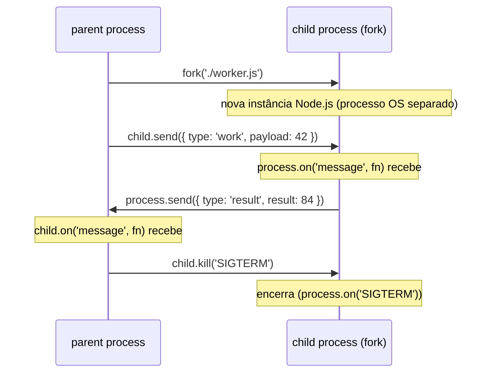

# child_process com fork: Node child com IPC

> [!abstract] TL;DR
> `fork('./worker.js')` cria um processo Node.js filho com canal IPC built-in — comunicação bidirecional via `child.send()` (pai) e `process.send()` (filho). Diferente de Worker Thread: isolamento total de memória, event loop separado, V8 isolate separado, custo de criação maior (~100ms). Em 2026, Worker Threads cobrem a maioria dos casos. `fork` ainda ganha em quatro cenários específicos: isolamento total de memória, native modules incompatíveis com Worker, supervisor tree, e processos descartáveis que podem crashar sem afetar o pai.

---

## Diagrama



## O que é

`child_process.fork` é uma especialização de `spawn` que cria um processo Node.js filho com canal IPC (Inter-Process Communication) built-in. O canal é estabelecido automaticamente — sem configuração manual de `stdio`.

Cada lado da comunicação usa a mesma API:

- **No pai:** `child.send(mensagem)` para enviar, `child.on('message', fn)` para receber
- **No filho:** `process.send(mensagem)` para enviar, `process.on('message', fn)` para receber

O canal é bidirecional e persiste enquanto ambos os processos estiverem rodando e `child.connected` for `true`.

```
fork('./worker.js')
      │
      ▼
┌─────────────────────────────────────┐
│  parent process (Node.js)           │
│  child.send({ type: 'work' })  ──►  │  IPC channel (pipe)
│  child.on('message', fn)       ◄──  │
└─────────────────────────────────────┘
             │ separate OS process
             ▼
┌─────────────────────────────────────┐
│  child process (Node.js)            │
│  process.on('message', fn)     ◄──  │  mesma serialização JSON
│  process.send({ result: 42 })  ──►  │
└─────────────────────────────────────┘
```

> [!note] Especialização, não duplicação
> `fork` não copia o estado do processo pai como `fork(2)` do POSIX faz em C. Ele lança uma **nova instância do Node.js** que executa o módulo especificado do zero. A memória não é compartilhada.

---

## Por que importa

Em 2026, Worker Threads são a ferramenta padrão para paralelismo CPU-bound em Node — memória compartilhada opcional via `SharedArrayBuffer`, custo de criação menor, mesma API de eventos. Então por que `fork` ainda existe?

Porque isolamento e Worker Threads são conceitos opostos por design. Quando você **precisa** que o processo filho seja completamente separado — memória, handles de arquivo, módulos nativos — um Worker Thread não resolve. `fork` resolve.

Saber exatamente quando preferir `fork` sobre Worker Thread é o tipo de decision-making que aparece em entrevistas sênior e em code reviews de sistemas de alta confiabilidade.

---

## Como funciona

### Comunicação básica: pai e filho

```javascript
// parent.js
import { fork } from 'node:child_process';

const child = fork('./worker.js');

// Enviar mensagem para o filho
child.send({ type: 'work', payload: 42 });

// Receber resposta do filho
child.on('message', (msg) => {
  console.log('from child:', msg);
  // { type: 'result', result: 84 }
});

// Monitorar ciclo de vida
child.on('exit', (code, signal) => {
  console.log(`child exited — code: ${code}, signal: ${signal}`);
});

child.on('error', (err) => {
  console.error('child error:', err);
});
```

```javascript
// worker.js
process.on('message', (msg) => {
  if (msg.type === 'work') {
    const result = msg.payload * 2;
    process.send({ type: 'result', result });
  }
});

// Opcional: encerrar depois de responder
process.on('message', (msg) => {
  if (msg.type === 'shutdown') process.exit(0);
});
```

### Ciclo de vida e cleanup

```javascript
// parent.js — com cleanup correto
import { fork } from 'node:child_process';

const child = fork('./worker.js');

// Desconectar IPC sem encerrar o processo
// (útil para deixar o filho continuar de forma independente)
child.disconnect();
console.log(child.connected); // false

// Enviar sinal de encerramento
child.kill('SIGTERM'); // padrão

// Evitar zombies quando o pai encerra
process.on('exit', () => {
  if (!child.killed) child.kill();
});

process.on('SIGTERM', () => {
  child.kill();
  process.exit(0);
});
```

### Serialização: JSON vs advanced

Por padrão, as mensagens são serializadas via JSON — o que significa que `Date`, `Map`, `Set`, `RegExp` e `undefined` não chegam como foram enviados.

```javascript
// ❌ JSON (padrão) — perde tipos especiais
const child = fork('./worker.js');
child.send({ date: new Date(), map: new Map([['a', 1]]) });
// child recebe: { date: "2026-05-07T...", map: {} }  ← Map virou objeto vazio

// ✓ advanced — preserva Date, Map, Set, TypedArray, Buffer
const child = fork('./worker.js', [], {
  serialization: 'advanced',
});
child.send({ date: new Date(), map: new Map([['a', 1]]) });
// child recebe: { date: Date object, map: Map { 'a' => 1 } }
```

> [!warning] `serialization: 'advanced'` usa V8 structured clone
> Structured clone suporta mais tipos que JSON, mas ainda não serializa funções, proxies, ou referências circulares com classes customizadas. Tente serializar explicitamente dados complexos antes de enviar.

### Opções relevantes de fork

| Opção | Padrão | Descrição |
|---|---|---|
| `execPath` | `process.execPath` | Executável Node a usar no filho |
| `execArgv` | `process.execArgv` | Flags do Node para o filho (ex.: `['--max-old-space-size=512']`) |
| `silent` | `false` | `true` → stdin/stdout/stderr do filho piped para o pai |
| `stdio` | `['inherit','inherit','inherit','ipc']` | Deve conter exatamente um `'ipc'` |
| `serialization` | `'json'` | `'json'` ou `'advanced'` (V8 structured clone) |
| `detached` | `false` | Filho pode continuar após o pai encerrar |
| `env` | `process.env` | Variáveis de ambiente do filho |
| `signal` | — | `AbortSignal` para cancelamento controlado |

---

## fork vs Worker Thread — tabela comparativa

| Aspecto | `child_process.fork` | `Worker Threads` |
|---|---|---|
| **Memória** | Isolamento total — processos separados | Isolamento por padrão, `SharedArrayBuffer` opcional |
| **Event loop** | Separado por processo | Separado por thread |
| **V8 isolate** | Separado — GC e heap independentes | Separado — GC e heap independentes |
| **Custo de criação** | ~100ms (novo processo OS) | ~1–5ms (nova thread) |
| **IPC** | `child.send()` / `process.send()` — JSON ou structured clone | `postMessage()` — structured clone com transferables |
| **Memória compartilhada** | Não — comunicação apenas via IPC | Sim — `SharedArrayBuffer` + `Atomics` |
| **Native modules (N-API)** | Suporte total | Alguns addons antigos não são thread-safe |
| **Crash do filho** | Pai sobrevive — filho é processo separado | Worker com erro não derruba o main thread |
| **Uso típico** | Isolamento de segurança, supervisor tree, subprocesso descartável | CPU-bound, offloading de cálculo, processamento paralelo |

### A distinção crucial: fork vs cluster.fork

```javascript
// child_process.fork — propósito geral, IPC bidirecional
import { fork } from 'node:child_process';
const worker = fork('./task-worker.js');
worker.send({ job: 'process-image', file: 'photo.jpg' });

// cluster.fork — especialização para HTTP, compartilha porta TCP
import cluster from 'node:cluster';
cluster.fork(); // filho recebe connections do master via IPC interno
```

**`child_process.fork`** cria um processo filho Node genérico com IPC. Você controla completamente o protocolo de mensagens.

**`cluster.fork`** é uma especialização que:
- Usa `child_process.fork` internamente
- Compartilha a porta de escuta TCP entre o master e os workers
- O master distribui conexões HTTP recebidas entre os workers automaticamente

Mesmo nome, semântica completamente diferente. Confundir os dois em entrevista é um red flag imediato para posições sênior.

---

## Na prática: 4 casos onde fork ainda ganha

### 1. Isolamento total de memória (security boundary, multi-tenancy)

Quando você executa código de tenants diferentes ou código não-confiável, Worker Threads compartilham o mesmo processo OS — um crash de thread bem-posicionado pode corromper o estado do processo. Um processo filho `fork`-ado está separado no nível do OS.

```javascript
// Executar código de tenant em processo isolado
import { fork } from 'node:child_process';

function runTenantCode(tenantId, code) {
  const child = fork('./sandbox-runner.js', [tenantId], {
    env: {
      ...process.env,
      TENANT_ID: tenantId,
      MAX_MEMORY: '128',
    },
    execArgv: ['--max-old-space-size=128'], // limitar memória do filho
  });

  // Protocolo simples: enviar código, receber resultado
  child.send({ type: 'execute', code });

  return new Promise((resolve, reject) => {
    const timer = setTimeout(() => {
      child.kill('SIGKILL');
      reject(new Error('Tenant code timeout'));
    }, 5000);

    child.on('message', (msg) => {
      clearTimeout(timer);
      if (msg.type === 'result') resolve(msg.value);
      else reject(new Error(msg.error));
    });

    child.on('exit', (code) => {
      clearTimeout(timer);
      if (code !== 0) reject(new Error(`Process exited with code ${code}`));
    });
  });
}
```

### 2. Native modules incompatíveis com Worker Threads

Alguns N-API addons (especialmente addons legados) não são thread-safe. Carregar esses módulos em Worker Threads causa comportamento indefinido ou crashes. Em `fork`, cada processo tem seu próprio isolate — sem compartilhamento de estado nativo.

```javascript
// Hipotético: addon legado não thread-safe
// Em Worker Thread → crash/undefined behavior
// Em fork → seguro, processo separado

const child = fork('./native-addon-worker.js');
// native-addon-worker.js pode import() addons legados sem risco
child.send({ type: 'process', data: buffer });
```

### 3. Supervisor tree (Erlang-style)

O padrão de supervisor tree — em que um processo pai monitora filhos e os reinicia quando falham — é idiomático em sistemas de alta disponibilidade. `fork` habilita esse padrão nativamente: o pai sobrevive ao crash do filho e pode respawnar.

```javascript
// Supervisor simples
import { fork } from 'node:child_process';

const WORKER_MODULE = './service-worker.js';
let restarts = 0;
const MAX_RESTARTS = 5;
const RESTART_WINDOW_MS = 60_000;
let windowStart = Date.now();

function spawnWorker() {
  const child = fork(WORKER_MODULE);

  child.on('exit', (code, signal) => {
    const now = Date.now();

    // Resetar contador se janela de 60s passou
    if (now - windowStart > RESTART_WINDOW_MS) {
      restarts = 0;
      windowStart = now;
    }

    if (code === 0) {
      console.log('Worker encerrou normalmente');
      return;
    }

    restarts++;
    if (restarts > MAX_RESTARTS) {
      console.error(`Worker falhou ${MAX_RESTARTS}x em ${RESTART_WINDOW_MS}ms — abortando`);
      process.exit(1);
    }

    const delay = Math.min(100 * 2 ** restarts, 30_000); // backoff exponencial
    console.warn(`Worker crashou (código ${code}). Restart ${restarts}/${MAX_RESTARTS} em ${delay}ms`);
    setTimeout(spawnWorker, delay);
  });

  child.on('error', (err) => {
    console.error('Erro ao spawnar worker:', err);
  });

  return child;
}

spawnWorker();
```

### 4. Processo descartável que pode crashar sem afetar o pai

Parsing de arquivos não-confiáveis, execução de queries experimentais, operações que lidam com input adversarial — qualquer coisa que possa acionar um bug no código ou no runtime. Isolar em `fork` significa que um crash não derruba o processo principal.

```javascript
// Processar upload de arquivo potencialmente malformado em processo isolado
import { fork } from 'node:child_process';

function parseUntrustedFile(filePath) {
  return new Promise((resolve, reject) => {
    const child = fork('./file-parser.js', [], {
      execArgv: ['--max-old-space-size=256'],
    });

    child.send({ type: 'parse', path: filePath });

    child.on('message', (msg) => {
      child.kill();
      if (msg.type === 'ok') resolve(msg.data);
      else reject(new Error(msg.error));
    });

    child.on('exit', (code) => {
      // Se o parser crashou (SIGSEGV de native module, OOM, etc.)
      // o processo pai está intacto
      if (code !== 0) reject(new Error(`Parser crashed: exit ${code}`));
    });
  });
}
```

---

## Casos práticos

### Caso 1 — Sandbox para código de tenant (multi-tenancy)

Uma plataforma de automação deixa usuários escreverem scripts JavaScript que rodam no backend. Rodar esses scripts no processo principal ou em Worker Threads é arriscado: um script que entra em loop infinito ou lança exceção não capturada pode derrubar o servidor. `fork` com timeout e limite de memória isola o risco.

```javascript
// sandbox-runner.js — executado como filho isolado
const { code, timeout } = JSON.parse(process.env.SANDBOX_CONFIG);

// Limitar tempo de execução
const timer = setTimeout(() => {
  process.send({ type: 'error', error: 'timeout' });
  process.exit(1);
}, timeout);

try {
  // Usar Function() em vez de eval para escopo limpo (sem closure do módulo)
  const fn = new Function(code);
  const result = fn();
  clearTimeout(timer);
  process.send({ type: 'result', result: String(result) });
} catch (err) {
  clearTimeout(timer);
  process.send({ type: 'error', error: err.message });
} finally {
  process.exit(0);
}
```

```javascript
// orchestrator.js — processo pai que spawn-a o sandbox
import { fork } from 'node:child_process';

function runTenantCode(tenantId, code, timeoutMs = 5000) {
  return new Promise((resolve, reject) => {
    const child = fork('./sandbox-runner.js', [], {
      env: {
        ...process.env,
        SANDBOX_CONFIG: JSON.stringify({ code, timeout: timeoutMs }),
      },
      execArgv: ['--max-old-space-size=64'], // limita heap do filho a 64 MB
    });

    const timer = setTimeout(() => {
      child.kill('SIGKILL');
      reject(new Error(`Tenant ${tenantId}: timeout`));
    }, timeoutMs + 500); // 500ms de margem sobre o timeout interno

    child.on('message', (msg) => {
      clearTimeout(timer);
      if (msg.type === 'result') resolve(msg.result);
      else reject(new Error(msg.error));
    });

    child.on('exit', (code) => {
      clearTimeout(timer);
      if (code !== 0) reject(new Error(`Sandbox exited with code ${code}`));
    });
  });
}
```

**Por que não Worker Thread aqui:** Um Worker que trava em loop síncrono bloqueia sua thread e pode degradar o pool. Um processo filho que trava é isolado ao nível do OS — `SIGKILL` o elimina sem afetar o pai.

---

### Caso 2 — Supervisor tree com backoff exponencial

Um serviço de processamento de filas precisa de um worker sempre rodando. O worker pode crashar por erro não-antecipado, OOM ou bug em dependency. O processo supervisor monitora e reinicia com backoff exponencial para evitar restart-storm.

```javascript
// supervisor.js
import { fork } from 'node:child_process';

const MODULE = './queue-worker.js';
const MAX_RESTARTS = 10;
const WINDOW_MS = 60_000;

let restarts = 0;
let windowStart = Date.now();
let currentWorker = null;

function spawnWorker() {
  currentWorker = fork(MODULE);

  currentWorker.on('exit', (code, signal) => {
    if (signal === 'SIGTERM' || code === 0) {
      console.log('Worker encerrou normalmente');
      return;
    }

    const now = Date.now();
    if (now - windowStart > WINDOW_MS) {
      restarts = 0;
      windowStart = now;
    }

    restarts++;
    console.warn(`Worker crashou (code=${code}). Restart ${restarts}/${MAX_RESTARTS}`);

    if (restarts > MAX_RESTARTS) {
      console.error('Limite de restarts atingido — supervisor encerrando');
      process.exit(1);
    }

    const delay = Math.min(200 * 2 ** restarts, 30_000); // backoff: 400ms → 30s
    setTimeout(spawnWorker, delay);
  });

  currentWorker.on('error', (err) => {
    console.error('Erro no worker:', err.message);
  });
}

spawnWorker();

// Graceful shutdown do supervisor
process.on('SIGTERM', () => {
  if (currentWorker && !currentWorker.killed) {
    currentWorker.kill('SIGTERM');
  }
  process.exit(0);
});
```

**O que o backoff resolve:** sem ele, um worker que crasha imediatamente em startup (ex: variável de ambiente faltando) cria um loop de restart que consome CPU continuamente. O backoff exponencial dá tempo para o problema ser corrigido ou o alerta ser acionado.

---

## Armadilhas comuns

> [!warning] Zombie processes quando o pai crasha sem cleanup
> **O que acontece:** filhos `fork`-ados continuam rodando como processos órfãos quando o pai encerra abruptamente — consumindo memória e file descriptors. Em serviços que reiniciam frequentemente (durante desenvolvimento, em deployments), isso acumula ao longo do tempo.
>
> **Por quê:** `fork` cria processos OS independentes. Quando o pai morre por exceção não capturada, `SIGKILL` externo ou OOM, os filhos não recebem nenhum sinal automático — continuam rodando sem supervisão.
>
> **Como evitar:** registrar cleanup em todos os sinais relevantes do processo pai, mantendo um Set dos filhos ativos.
> ```javascript
> // ❌ — sem cleanup, filhos viram zumbis
> const child = fork('./worker.js');
>
> // ✓ — registrar cleanup em todos os sinais relevantes
> const children = new Set();
>
> function spawnChild(module) {
>   const child = fork(module);
>   children.add(child);
>   child.on('exit', () => children.delete(child));
>   return child;
> }
>
> function killAll() {
>   for (const child of children) {
>     if (!child.killed) child.kill('SIGTERM');
>   }
> }
>
> process.on('exit', killAll);
> process.on('SIGTERM', () => { killAll(); process.exit(0); });
> process.on('SIGINT',  () => { killAll(); process.exit(0); });
> process.on('uncaughtException', (err) => {
>   console.error(err);
>   killAll();
>   process.exit(1);
> });
> ```

> [!warning] `child.send()` com dados não-serializáveis — fail silencioso
> **O que acontece:** a mensagem não é entregue ao filho e nenhum erro visível é lançado. O comportamento dificulta o debugging porque o código continua rodando normalmente — apenas sem a comunicação esperada.
>
> **Por quê:** se você tenta enviar uma função, um `Symbol`, um objeto com referência circular, ou um `Proxy` via `child.send()` com `serialization: 'json'`, o Node lança `TypeError` — mas apenas se você escutar o evento `'error'` no ChildProcess ou passar callback. Sem listener, o erro é silencioso.
>
> **Como evitar:** sempre passar callback para `child.send()` ou usar `serialization: 'advanced'` para tipos que vão além de JSON.
> ```javascript
> // ❌ — TypeError silencioso
> const child = fork('./worker.js');
> child.send({ fn: () => {} }); // função não é serializável via JSON
>
> // ✓ — com callback para capturar erro de send
> child.send({ fn: () => {} }, (err) => {
>   if (err) console.error('send falhou:', err.message);
> });
>
> // ✓ — alternativa: serializar dados explicitamente antes de enviar
> child.send({ data: JSON.stringify(serializableData) });
> ```

> [!warning] Confundir `child_process.fork` com `cluster.fork`
> **O que acontece:** o código parece funcionar mas não faz o que o desenvolvedor espera. Usar `child_process.fork` esperando distribuição de connections HTTP não funciona. Usar `cluster.fork` esperando IPC customizável também não — o cluster tem protocolo interno fixo.
>
> **Por quê:** os dois têm o mesmo nome (`fork`) mas semântica completamente diferente. `child_process.fork` é propósito geral, IPC bidirecional customizável. `cluster.fork` é especializado para compartilhamento de porta TCP entre workers HTTP, com protocolo de distribuição de conexões gerenciado pelo master.
>
> **Como evitar:** memorizar a distinção pelo import — o namespace diferente (`node:child_process` vs `node:cluster`) é o sinal.
> ```javascript
> import { fork } from 'node:child_process'; // IPC genérico, propósito geral
> import cluster from 'node:cluster';
> cluster.fork(); // worker HTTP, compartilha porta
>
> // Sintomas de confusão:
> // — usar child_process.fork esperando distribuição de connections HTTP (não acontece)
> // — usar cluster.fork esperando protocolo IPC customizável (cluster tem protocolo interno fixo)
> ```

> [!warning] Custo de criação alto sem reuso — spawn-on-demand sem pool
> **O que acontece:** o throughput cai drasticamente em workloads com muitas tarefas pequenas. Com 1000 itens, isso significa 1000 processos criados sequencialmente — o overhead domina o tempo total de execução.
>
> **Por quê:** `fork` cria um novo processo OS a cada chamada (~100ms de overhead). Para workloads que processam muitas tarefas pequenas, criar um processo por tarefa é proibitivo. Diferente de Worker Threads (~1–5ms), o overhead de criação de processo não é amortizável sem reuso explícito.
>
> **Como evitar:** reusar processos filhos enviando múltiplas mensagens para o mesmo filho, ou usar um pool de processos pré-criados.
> ```javascript
> // ❌ — processo novo para cada item → overhead acumulado
> for (const item of bigList) {
>   const child = fork('./worker.js');
>   child.send({ item });
>   // esperar resposta e descartar → O(n) processos criados
> }
>
> // ✓ — reuso: enviar múltiplas mensagens para o mesmo filho
> const child = fork('./worker.js');
>
> for (const item of bigList) {
>   child.send({ item });
> }
>
> // ✓ — ou pool de processos para controle de concorrência
> // (ver [[06 - Pool de workers - pattern de produção]] para o padrão de pool)
> ```

---

## Em entrevista

### Frase pronta (em inglês)

> "Node's `child_process.fork` creates a full child Node.js process with a built-in IPC channel — you communicate bidirectionally via `child.send()` on the parent side and `process.send()` on the child side. It's a specialization of `spawn`, so you get full process isolation: separate memory, separate event loop, separate V8 isolate. The tradeoff is creation cost — around a hundred milliseconds versus a few milliseconds for Worker Threads. In 2026, Worker Threads are the default for CPU-bound parallelism. But `fork` still wins in four specific cases: when you need full memory isolation as a security boundary — like running untrusted tenant code — when you're dealing with native addons that aren't thread-safe, when you're building an Erlang-style supervisor tree where the parent needs to outlive and restart failing children, and when you want a disposable process that can crash without affecting the parent. One thing I always flag in code reviews: `child_process.fork` and `cluster.fork` have the same name but completely different semantics — cluster.fork is a specialization that shares an HTTP listening socket across workers."

### Vocabulário técnico

| PT-BR | EN |
|---|---|
| bifurcar processo | fork a process |
| comunicação interprocesso | inter-process communication (IPC) |
| isolamento de memória | memory isolation |
| processo filho | child process |
| árvore de supervisão | supervisor tree |
| canal IPC | IPC channel |
| serialização de mensagem | message serialization |
| processo órfão / zumbi | orphan process / zombie process |
| custo de criação | spawn overhead / creation cost |
| reinicialização com backoff | restart with exponential backoff |
| processo descartável | disposable process / sandboxed process |

### Perguntas frequentes em entrevista

**"Qual a diferença entre `fork` e Worker Threads?"** — Processo OS separado vs thread no mesmo processo. `fork` dá isolamento total (~100ms de criação); Worker Thread é mais leve (~1–5ms) com `SharedArrayBuffer` opcional. Para CPU-bound, prefira Worker. Para isolamento de segurança ou native modules legados, use `fork`.

**"Qual a diferença entre `child_process.fork` e `cluster.fork`?"** — `child_process.fork` é propósito geral com IPC customizável. `cluster.fork` usa `child_process.fork` internamente mas adiciona compartilhamento de porta TCP para distribuição de connections HTTP. Mesmo nome, semântica completamente diferente.

**"O que acontece com processos filhos quando o pai crasha?"** — Sem cleanup, viram processos órfãos. Solução: registrar handlers em `process.on('exit')`, `SIGTERM`, e `uncaughtException` para encerrar todos os filhos antes de sair.

---

## O que vem a seguir

Conhecendo Worker Threads, Cluster e as três APIs de `child_process`, você tem o conjunto completo de ferramentas de paralelismo do Node. A próxima decisão é saber **quando usar qual** — e como essas ferramentas se encaixam em arquiteturas de produção com orquestradores. A nota `[[10 - Cluster vs PM2 vs Kubernetes - quem orquestra]]` fecha esse ciclo: a evolução histórica de Cluster → PM2 → K8s, o erro clássico de rodar cluster dentro de um pod, e o raciocínio para 2026. Se você quer um artefato de consulta rápida antes de uma entrevista, vá direto para `[[11 - Decision tree - qual ferramenta para qual problema]]` — a árvore completa com tabela problema→ferramenta→razão.

---

## Fontes

- [Node.js Docs — `child_process.fork()`](https://nodejs.org/api/child_process.html#child_processforkmodulepath-args-options) — opções completas, serialização, stdio e ciclo de vida
- [Node.js Docs — `serialization: 'advanced'`](https://nodejs.org/api/child_process.html#advanced-serialization) — V8 structured clone vs JSON no canal IPC

---

## Veja também

- [[03 - Worker Threads - fundamentos]] — alternativa moderna, custo menor, memória compartilhada opcional
- [[07 - Cluster - escalando HTTP por CPU]] — `cluster.fork`: o nome parecido com semântica diferente
- [[08 - child_process com exec e spawn]] — as outras APIs do módulo `child_process`
- [[11 - Decision tree - qual ferramenta para qual problema]] — quando usar cada ferramenta
- [[Node.js]] — tronco da trilha Node Senior
