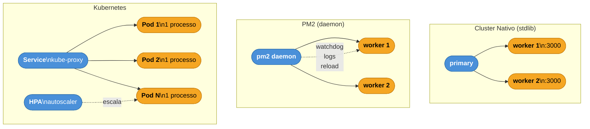

# Cluster vs PM2 vs Kubernetes: quem orquestra

> [!abstract] TL;DR
> Cluster nativo brilhou em ~2014–2018 quando deploys eram em VMs single-host. PM2 ofereceu cluster + watchdog + logs e dominou o ciclo ~2018–2020. Hoje (2026), Kubernetes, ECS e Nomad fazem o fork em escala diferente: 1 pod por core, autoscaling horizontal, rolling updates declarativos. Cluster nativo virou raro em prod nova — use orquestrador. Cluster nativo só faz sentido em single-VM deploys ou em scripts/CLIs.

---

## Diagrama



## O que é

Três ferramentas, três camadas de abstração para o mesmo problema central: aproveitar múltiplos processos (e múltiplos hosts) para servir mais tráfego.

### Cluster nativo (`node:cluster`)

API stdlib do Node, existe desde a versão 0.8 (2012). Permite que um processo **primary** crie processos filhos (**workers**) que compartilham a mesma porta TCP via file descriptor compartilhado. O primary não atende requisições — ele gerencia o ciclo de vida dos workers. A comunicação é via IPC (pipes Unix/named pipes no Windows).

```
Primary (gerencia)
  ├── Worker 1  ┐
  ├── Worker 2  ├── todos escutam :3000
  ├── Worker 3  │
  └── Worker 4  ┘
```

Não há health check automático, não há log agregado, não há restart automático — tudo isso precisa ser implementado pelo desenvolvedor.

### PM2

Daemon process manager open-source lançado em 2014 pela Keymetrics (hoje pm2.io). Internamente, PM2 em modo cluster usa a mesma API `node:cluster` — mas empacota em cima dela uma série de features que o cluster nativo não tem:

- **Watchdog automático**: reinicia workers que morrem (sem código extra)
- **Zero-downtime reload**: `pm2 reload app` envia SIGINT a um worker, aguarda novas conexões drenarem, sobe substituto, repete
- **Log management**: stdout/stderr de todos os workers agregados com timestamps
- **Monitoramento**: `pm2 monit` mostra CPU/memória por processo em tempo real
- **Startup script**: `pm2 startup` gera systemd/init.d para sobreviver a reboots
- **Ecosystem file**: `ecosystem.config.js` declara instâncias, variáveis de ambiente, limites de memória

```javascript
// ecosystem.config.js — exemplo genérico
module.exports = {
  apps: [{
    name: 'api',
    script: './src/server.js',
    instances: 'max',        // fork um worker por core
    exec_mode: 'cluster',
    max_memory_restart: '512M',
    env_production: {
      NODE_ENV: 'production',
      PORT: 3000
    }
  }]
};
```

```bash
pm2 start ecosystem.config.js --env production
pm2 reload api          # zero-downtime reload
pm2 logs api            # tail de todos os workers
pm2 monit               # dashboard interativo
```

### Kubernetes (e equivalentes: ECS, Nomad, Fly.io)

Orquestrador de containers que opera em uma camada radicalmente diferente. O Kubernetes não sabe que o processo dentro do container é Node.js — ele gerencia **pods** (unidade mínima: 1 ou mais containers). Em prod Node, o padrão é:

- **1 pod = 1 processo Node** (sem cluster interno)
- **N réplicas** controladas por um `Deployment` ou `ReplicaSet`
- **kube-proxy / Ingress** distribui tráfego entre pods (load balancing)
- **HPA** (Horizontal Pod Autoscaler) escala réplicas com base em CPU/memória/métricas customizadas
- **Rolling update** declarativo: ao atualizar a imagem, K8s sobe pods novos antes de derrubar os velhos

```yaml
# Deployment genérico — exemplo ilustrativo
apiVersion: apps/v1
kind: Deployment
metadata:
  name: api
spec:
  replicas: 4
  strategy:
    type: RollingUpdate
    rollingUpdate:
      maxSurge: 1
      maxUnavailable: 0
  selector:
    matchLabels:
      app: api
  template:
    metadata:
      labels:
        app: api
    spec:
      containers:
        - name: api
          image: myrepo/api:v1.2.3
          ports:
            - containerPort: 3000
          resources:
            requests:
              cpu: "250m"
              memory: "256Mi"
            limits:
              cpu: "1000m"
              memory: "512Mi"
          readinessProbe:
            httpGet:
              path: /health
              port: 3000
            initialDelaySeconds: 5
            periodSeconds: 10
```

---

## Por que importa

Muitas equipes chegam ao K8s carregando hábitos do passado PM2/cluster e acabam com configurações redundantes sem perceber:

> **1 pod com `cluster.fork()` × 4 workers × 4 réplicas K8s = 16 processos**

Isso não é necessariamente errado, mas é raramente intencional. O custo: 16 heaps Node separadas, 16 event loops, overhead de IPC dentro do pod, e complexidade de debug aumentada — sem ganho de throughput proporcional em cargas I/O-bound típicas.

Entender a evolução histórica das três abordagens permite:

1. **Não adicionar cluster onde o orquestrador já orquestra** — o erro mais comum em migrações de VPS para K8s
2. **Saber quando PM2 ainda é a escolha certa** — VPS simples, sem infraestrutura de container, custo operacional baixo
3. **Dimensionar pods corretamente** — se cada pod tem 2 vCPUs, faz sentido rodar 2 workers cluster internamente; se tem 0.5 vCPU, não
4. **Responder em entrevista** com contexto histórico, não apenas com "use K8s"

---

## Como funciona: comparação por camada

### Cluster nativo — o que acontece internamente

1. `cluster.fork()` chama `child_process.fork()` internamente — cada worker é um processo Unix separado
2. O primary cria o socket TCP e o passa como handle para os workers via IPC (file descriptor sharing)
3. No Linux, o Node implementa round-robin próprio (`SCHED_RR`) para distribuir conexões — evita a distribuição desigual do `SO_REUSEPORT` nativo
4. No Windows, o kernel distribui via IOCP
5. Comunicação primary ↔ worker via `process.send()` / `cluster.on('message')`
6. `cluster.isMaster` foi depreciado no Node v16 — use `cluster.isPrimary`

```javascript
import cluster from 'node:cluster';
import { availableParallelism } from 'node:os';
import { createServer } from 'node:http';

if (cluster.isPrimary) {
  const numCPUs = availableParallelism();
  for (let i = 0; i < numCPUs; i++) cluster.fork();

  cluster.on('exit', (worker, code, signal) => {
    // Watchdog manual — PM2 faz isso automaticamente
    if (!worker.exitedAfterDisconnect) {
      console.log(`Worker ${worker.id} morreu. Reiniciando...`);
      cluster.fork();
    }
  });
} else {
  createServer((req, res) => {
    res.writeHead(200);
    res.end('ok');
  }).listen(3000);
}
```

### PM2 — o que acontece internamente

PM2 roda como **daemon** separado do processo Node da aplicação. Quando você executa `pm2 start`, o daemon PM2 lê o ecosystem file, faz o fork dos workers (usando `node:cluster` ou `child_process.fork` dependendo do `exec_mode`), e mantém um registro de estado em `~/.pm2/`.

O **zero-downtime reload** (`pm2 reload`) funciona assim:

1. Envia `SIGINT` (ou `SIGUSR2`, configurável) para um worker
2. O worker deve capturar o sinal e fechar o servidor graciosamente (parar de aceitar novas conexões, aguardar as atuais terminarem)
3. PM2 aguarda o worker morrer (com timeout)
4. Sobe um novo worker
5. Repete para cada worker

> [!warning] Armadilha do reload
> Se a aplicação não captura `SIGINT` e fecha conexões graciosamente, o reload zero-downtime **não é zero-downtime de fato** — requisições em voo são cortadas. Sempre teste o graceful shutdown antes de depender disso em prod.

### Kubernetes — o que acontece internamente

O K8s não gerencia processos dentro do container — gerencia o **container em si**. O health check é via **readiness probe** e **liveness probe** (HTTP, TCP ou exec), não via monitoramento de processo. O rolling update funciona assim:

1. Uma nova imagem é referenciada no Deployment
2. K8s cria `maxSurge` pods novos com a nova imagem
3. Aguarda que os novos pods passem no readiness probe
4. Remove pods antigos (`maxUnavailable` controla quantos podem ficar indisponíveis)
5. Repete até todos os pods estarem na nova versão

O kube-proxy distribui tráfego via iptables/IPVS para os endpoints do Service. O Ingress controller (nginx, traefik, etc.) faz o roteamento externo.

---

## Tabela comparativa

| Aspecto | Cluster nativo | PM2 | Kubernetes |
|---|---|---|---|
| **Granularidade** | Processo dentro da VM | Processo dentro da VM | Container/pod |
| **Escala** | 1 VM | 1 VM | N nós (cluster de máquinas) |
| **Autoscaling** | Manual | Manual (via scripts) | HPA automático |
| **Health check** | Manual (evento `exit`) | Automático (watchdog) | Readiness + liveness probe |
| **Rolling update** | Manual | `pm2 reload` | Declarativo no Deployment |
| **Logs** | `stdout` por processo | Agregado com timestamp | Coletado por DaemonSet (Fluentd, etc.) |
| **Config** | Código JavaScript | `ecosystem.config.js` | YAML declarativo |
| **Restart em crash** | Manual | Automático | Automático (restart policy) |
| **Multi-host** | Não | Não | Sim (nó worker pool) |
| **State management** | Aplicação | Aplicação | Aplicação + PersistentVolume |
| **Curva de adoção** | Baixa | Baixa-média | Alta |
| **Use case 2026** | Dev local, single-VM pequeno, scripts | VPS simples, single-VM prod | Qualquer empresa médio porte+ |

---

## Na prática (2026)

### Quando usar Kubernetes (ou ECS / Nomad / Fly.io)

O default em qualquer empresa de médio porte com mais de 2-3 serviços em prod. O investimento na curva de aprendizado paga quando:

- Múltiplos serviços precisam escalar de forma independente
- O time precisa de rolling updates sem downtime planejado
- A carga é variável e autoscaling poupa custo
- Existe necessidade de namespaces/RBAC por time
- CI/CD atualiza imagens automaticamente

Em 2026, managed K8s (GKE, EKS, AKS) removeu boa parte do overhead operacional de gerenciar o control plane.

### Quando usar PM2

Ainda faz sentido em cenários específicos:

- **VPS pequeno sem container** (Hetzner, Linode, Digital Ocean droplet de $5-20/mês) — o overhead de K8s não se justifica
- **Deploy de projeto solo ou pequena equipe** onde simplicidade operacional importa mais que capacidade de escala
- **Aplicações internas** que nunca precisarão escalar além de 1 máquina
- **Ambientes de staging/dev** em VM simples
- **Transição**: quando o time ainda não tem expertise em container, PM2 é um passo intermediário responsável

```bash
# Fluxo PM2 típico em VPS
pm2 start ecosystem.config.js --env production
pm2 save              # persiste lista de processos
pm2 startup           # gera script systemd para sobreviver reboot
```

### Quando usar Cluster nativo

Em 2026, casos legítimos são estreitos:

- **Dev local** para testar comportamento multi-worker (race conditions, IPC, state compartilhado)
- **Scripts/CLIs** que precisam paralelizar trabalho HTTP sem infraestrutura extra
- **Single-VM de SaaS muito pequeno** onde PM2 seria overkill mas vale aproveitar os cores
- **Dentro de pods K8s com vCPU alta** — se um pod tem 4+ vCPUs disponíveis, rodar 4 workers cluster pode fazer sentido para saturar a CPU disponível por pod; a decisão depende do perfil de carga (CPU-bound vs I/O-bound)
- **Compreensão de base**: qualquer dev Node sênior deve conhecer a API — PM2 usa ela internamente

> [!tip] Regra prática
> Se você está configurando um novo serviço em prod em 2026 e não tem razão explícita para VPS simples, pule cluster nativo e PM2 — vá direto para container + orquestrador. O setup inicial é mais trabalhoso, mas o modelo operacional escala melhor.

---

## Casos práticos

### Caso 1 — Migração de VPS com PM2 para K8s: o erro mais comum

Uma startup tem um servidor Express rodando em PM2 com `instances: 4` em um droplet. Ao migrar para K8s, o time simplesmente coloca o mesmo `ecosystem.config.js` no Dockerfile e usa `pm2-runtime`. O resultado é 4 réplicas K8s × 4 workers PM2 = 16 processos Node com memória proporcional — sem ganho de throughput equivalente.

```dockerfile
# ❌ Antipadrão: PM2 dentro de container K8s
FROM node:22-alpine
WORKDIR /app
COPY . .
RUN npm ci --omit=dev
# PM2 dentro de container já orquestrado = duplicação de gerenciamento
CMD ["npx", "pm2-runtime", "ecosystem.config.js"]
```

```dockerfile
# ✓ Padrão correto: 1 processo por container, K8s orquestra réplicas
FROM node:22-alpine
WORKDIR /app
COPY . .
RUN npm ci --omit=dev
# K8s gerencia scaling via spec.replicas e HPA
CMD ["node", "src/server.js"]
```

```yaml
# Deployment — K8s gerencia as 4 réplicas
apiVersion: apps/v1
kind: Deployment
metadata:
  name: api
spec:
  replicas: 4
  selector:
    matchLabels:
      app: api
  template:
    spec:
      containers:
        - name: api
          image: myrepo/api:v1.2.3
          resources:
            requests: { cpu: "250m", memory: "256Mi" }
            limits:   { cpu: "1000m", memory: "512Mi" }
          readinessProbe:
            httpGet: { path: /health, port: 3000 }
```

**O que K8s faz que PM2 dentro de container não faz:** health check por pod (não por worker interno), rolling update com zero-downtime nativo, HPA que escala com base em CPU/custom metrics, e restart automático por restart policy — tudo sem código extra na aplicação.

---

### Caso 2 — Single-VM com PM2: ecosystem file de produção

Para um SaaS solo ou pequena equipe rodando numa VM sem container runtime, PM2 é a escolha mais pragmática: cluster + watchdog + logs + reload zero-downtime em uma ferramenta.

```javascript
// ecosystem.config.cjs — configuração de produção
module.exports = {
  apps: [{
    name: 'api',
    script: './src/server.js',

    // Cluster mode: 1 worker por core disponível
    instances: 'max',
    exec_mode: 'cluster',

    // Restart automático se memória exceder 512 MB
    max_memory_restart: '512M',

    // Log management
    out_file: '/var/log/app/out.log',
    error_file: '/var/log/app/err.log',
    time: true,  // timestamp em cada linha de log

    // Variáveis de ambiente por ambiente
    env_production: {
      NODE_ENV: 'production',
      PORT: 3000,
    },
    env_staging: {
      NODE_ENV: 'staging',
      PORT: 3001,
    },

    // Graceful shutdown: esperar até 10s antes de force-kill
    kill_timeout: 10000,

    // Número máximo de restarts em loop
    max_restarts: 10,
    min_uptime: '5s',  // se cair antes de 5s, conta como crash
  }]
};
```

```bash
# Deploy workflow com PM2
pm2 start ecosystem.config.cjs --env production
pm2 save            # persiste na lista de processos (~/.pm2/dump.pm2)
pm2 startup         # gera systemd unit para sobreviver reboot

# Zero-downtime deploy (nova versão de código)
git pull origin main
npm ci --omit=dev
pm2 reload api      # envia SIGINT worker a worker, espera drain, sobe novo

# Monitoramento
pm2 monit           # dashboard CPU/memória por worker
pm2 logs api        # tail de stdout/stderr de todos os workers
```

**Pré-requisito para `pm2 reload` funcionar de verdade:** a aplicação deve capturar `SIGINT` e fechar o servidor graciosamente — drenando conexões em voo antes de encerrar. Sem isso, `pm2 reload` corta requisições em andamento.

```javascript
// graceful shutdown necessário para pm2 reload funcionar
process.on('SIGINT', async () => {
  await server.close(); // para de aceitar novas conexões, drena existentes
  process.exit(0);
});
```

---

## Armadilhas comuns

> [!warning] Cluster + K8s sem pensar — overhead inútil
> **O que acontece:** 4 réplicas × 4 workers PM2 = 16 processos Node com 4× a memória necessária, e o K8s não consegue fazer health check por worker individualmente — só por pod. O scaling horizontal do HPA também fica distorcido: a métrica de CPU por pod já inclui múltiplos workers internos.
>
> **Por quê:** o erro mais comum na migração VPS → K8s é mover o `ecosystem.config.js` para dentro do Dockerfile e rodar PM2 dentro do container. O K8s já gerencia réplicas, health checks e restarts — o PM2 duplica essas responsabilidades sem agregar valor.
>
> **Como evitar:** 1 processo por container, K8s orquestra réplicas via `spec.replicas` e HPA.
> ```dockerfile
> # Antipadrão: PM2 dentro de container K8s
> CMD ["pm2-runtime", "ecosystem.config.js"]
>
> # Padrão correto: 1 processo por container, K8s orquestra réplicas
> CMD ["node", "src/server.js"]
> ```

> [!warning] Estado em worker — funciona em dev, quebra em prod
> **O que acontece:** em dev single-worker tudo funciona. Em prod com cluster ou múltiplas réplicas K8s, o usuário que fez login no worker 1 não vai encontrar a sessão no worker 3. Bugs intermitentes que dependem de qual processo atende a requisição são notoriamente difíceis de debugar.
>
> **Por quê:** workers são processos separados. Sessões em memória, cache local, contadores in-process — tudo isso não é compartilhado entre workers. O load balancer (cluster ou kube-proxy) não garante sticky routing por padrão.
>
> **Como evitar:** externalizar todo estado que precise sobreviver ao processo ou ser visível por múltiplos workers.
> ```javascript
> // Antipadrão: sessão em memória local
> const sessions = new Map(); // não compartilhado entre workers!
>
> // Padrão: sessão em store externo
> import session from 'express-session';
> import RedisStore from 'connect-redis';
> app.use(session({ store: new RedisStore({ client: redisClient }) }));
> ```

> [!warning] Confiar em PM2 graceful reload sem testar
> **O que acontece:** requisições em voo são cortadas durante o reload. Pior: se o servidor tem conexões keep-alive longas (WebSocket, SSE, streaming), o worker pode nunca morrer — e o PM2 vai force-kill após o `kill_timeout`, garantindo corte de conexões.
>
> **Por quê:** `pm2 reload` envia `SIGINT` para o worker e aguarda ele morrer antes de subir o substituto. Se a aplicação não captura o sinal e fecha conexões graciosamente, o zero-downtime prometido não acontece — é só uma reinicialização sequencial com janela de erro.
>
> **Como evitar:** implementar graceful shutdown e testar com carga real antes de confiar em prod.
> ```javascript
> // Handler de graceful shutdown necessário para pm2 reload funcionar
> process.on('SIGINT', async () => {
>   console.log('Recebeu SIGINT — fechando servidor graciosamente');
>   await server.close(() => {
>     console.log('Servidor fechado');
>     process.exit(0);
>   });
>   // Safety: force exit se o close demorar demais
>   setTimeout(() => process.exit(1), 10_000);
> });
> ```

> [!warning] Migrar para K8s sem reescrever lógica stateful
> **O que acontece:** bugs intermitentes que só aparecem durante deployments — difíceis de reproduzir, invisíveis em staging com réplica única. Em produção com tráfego real, podem afetar uma fração dos usuários por minutos a cada deploy.
>
> **Por quê:** a mesma lógica de sessões em memória da armadilha anterior, mas amplificada: em K8s com rolling update, durante o deploy coexistem pods da versão antiga e nova. Uma requisição pode bater no pod novo (sem sessão) depois do login ter ocorrido no pod antigo. Sticky sessions sem store externo não funcionam de forma confiável sob rolling update.
>
> **Como evitar:** a regra de ouro é a mesma — externalizar estado. Redis para sessões, banco para dados persistentes. Testar o rolling update deliberadamente em staging com `kubectl rollout restart deployment/api` antes de ir para prod.

> [!warning] `cluster.isMaster` — API depreciada
> **O que acontece:** o código funciona hoje, mas emite `DeprecationWarning` no console e corre risco de quebrar em versão futura do Node que remova a API. Em projetos que acumulam warnings, o sinal se perde no ruído.
>
> **Por quê:** `cluster.isMaster` e `cluster.setupMaster()` foram depreciados no Node v16.0.0 como parte da mudança de terminologia "master/slave" → "primary/worker". A remoção definitiva está na roadmap do Node.
>
> **Como evitar:** substituir por `cluster.isPrimary` e `cluster.setupPrimary()` — substituição direta, sem mudança de comportamento.
> ```javascript
> // ❌ Depreciado desde Node v16
> if (cluster.isMaster) { /* ... */ }
> cluster.setupMaster({ exec: './worker.js' });
>
> // ✓ API atual
> if (cluster.isPrimary) { /* ... */ }
> cluster.setupPrimary({ exec: './worker.js' });
> ```

---

## Em entrevista

### Frases prontas em inglês

**Sobre a evolução histórica:**

> "Native cluster was the standard approach for utilizing all CPU cores on a single VM, roughly between 2014 and 2018. PM2 then became the go-to because it added process supervision, log aggregation, and zero-downtime reloads on top of the native cluster API. By 2020 onward, container orchestrators like Kubernetes took over that responsibility at a higher level of abstraction — one process per container, with the orchestrator managing replicas, health checks, and rolling updates declaratively."

**Sobre redundância cluster + K8s:**

> "A common mistake when migrating from a VPS to Kubernetes is running PM2 inside the container. You end up with, say, four pod replicas each running four PM2 workers — sixteen Node processes — when Kubernetes is already doing the replica management for you. The right model in K8s is one process per container, stateless, with the orchestrator handling scaling."

**Sobre quando ainda usar cluster:**

> "Native cluster still makes sense in a few specific scenarios: single-VM deployments where you don't have a container runtime, local development to test multi-worker behavior, or occasionally inside a pod that has several vCPUs available and a CPU-bound workload that benefits from intra-pod parallelism."

**Sobre state e workers:**

> "Any state that lives in process memory — sessions, local caches, in-flight counters — breaks in a multi-worker or multi-replica setup. The fix is always externalizing state: Redis for sessions, a proper cache layer, or a database. This is true whether you're using native cluster, PM2, or Kubernetes replicas."

**Sobre graceful shutdown:**

> "Zero-downtime reload in PM2 and rolling updates in Kubernetes both depend on the process handling shutdown signals correctly. If your server doesn't implement a graceful SIGINT handler that drains in-flight connections, you're not actually achieving zero downtime — you're just hoping the timing works out."

### Vocabulário técnico (PT-BR → EN)

| PT-BR | EN |
|---|---|
| orquestrador | orchestrator |
| réplica | replica |
| autoscaling | autoscaling / horizontal pod autoscaler (HPA) |
| atualização contínua | rolling update |
| balanceamento de carga | load balancing |
| processo sem estado | stateless process |
| reload sem downtime | zero-downtime reload |
| sonda de prontidão | readiness probe |
| sonda de vivacidade | liveness probe |
| escalonamento horizontal | horizontal scaling |
| escalonamento vertical | vertical scaling |
| processo daemon | daemon process |
| watchdog | watchdog / process supervisor |
| ciclo de vida do processo | process lifecycle |

---

## Linha do tempo resumida

```
2012  node:cluster API (v0.8)
2014  PM2 lançado — cluster + watchdog + logs em 1 ferramenta
2016  Docker + container workflows ganham adoção
2018  K8s v1.10 — virou padrão de facto para orquestração
2019  ECS (AWS), AKS (Azure), GKE (Google) chegam a maturidade
2020  PM2 dominante em VPS, K8s dominante em cloud/médio porte
2022  Fly.io, Render, Railway popularizam deploy container sem K8s puro
2026  Default nova empresa médio porte: container + K8s ou PaaS container.
      PM2: ainda relevante em VPS simples.
      Cluster nativo: dev local, scripts, casos específicos.
```

---

## O que vem a seguir

Com o panorama Cluster → PM2 → K8s claro, a última peça antes de fechar o galho é ter um artefato de referência rápida para consulta em entrevistas e code reviews. A nota `[[11 - Decision tree - qual ferramenta para qual problema]]` sintetiza todos os critérios de decisão do galho em um único fluxograma + tabela problema→ferramenta→razão. E se você quiser revisar as armadilhas mais comuns do domínio de uma só vez — incluindo as de Cluster, PM2 e K8s — a `[[12 - Armadilhas, regras práticas, cheatsheet]]` tem o top 10 consolidado com exemplos de código.

---

## Fontes

- [PM2 Docs — Ecosystem File](https://pm2.keymetrics.io/docs/usage/application-declaration/) — referência completa das opções do `ecosystem.config.js`
- [Kubernetes Docs — Deployments](https://kubernetes.io/docs/concepts/workloads/controllers/deployment/) — spec de Deployment, rolling update e readiness probe
- [Node.js Docs — `cluster.isPrimary`](https://nodejs.org/api/cluster.html#clusterisprimary) — migração de `isMaster` (depreciado v16) para `isPrimary`

---

## Veja também

- `[[07 - Cluster - escalando HTTP por CPU]]` — API cluster em detalhe, port sharing, exemplos de código
- `[[11 - Decision tree - qual ferramenta para qual problema]]` — árvore de decisão completa
- `[[12 - Armadilhas, regras práticas, cheatsheet]]` — cheatsheet geral do domínio
- `[[Node.js]]` — nota tronco do domínio Node
