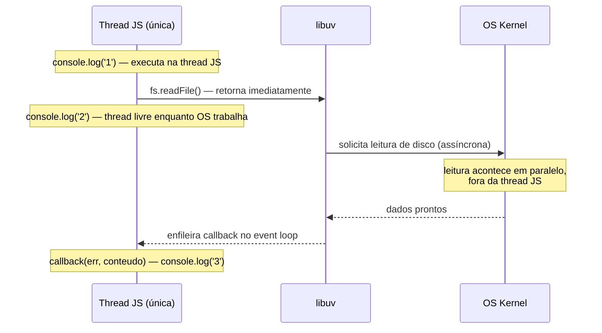

# Single-thread e non-blocking I/O

> [!abstract] TL;DR
> Node.js é single-thread: existe uma única thread que executa código JavaScript. Mesmo assim, ele atende milhares de conexões simultâneas porque I/O (disco, rede, banco) é delegado ao sistema operacional via libuv. A thread JS não fica bloqueada esperando — ela registra um callback e volta a processar outras tarefas. O I/O acontece em paralelo, no OS; o JS permanece sequencial.

## O que é

Imagine que você precisa atender 10.000 clientes simultâneos com um único atendente. Parece impossível — até você perceber que 99% do tempo cada cliente está *esperando*: esperando o banco processar o pagamento, esperando o arquivo ser lido, esperando a API externa responder. O atendente só precisa estar ocupado de verdade quando há algo a fazer. Essa é a aposta do Node.

**Single-threaded** significa que existe exatamente uma thread responsável por executar código JavaScript no processo Node.js. Não há execução paralela de código JS — se duas requisições chegam ao mesmo tempo, uma aguarda a outra completar o trecho JS atual. Mas, na prática, esse trecho é minúsculo: registrar um I/O e passar adiante.

**Non-blocking I/O** é o complemento que torna isso viável. Chamadas de I/O (leitura de arquivo, consulta de banco, requisição HTTP) retornam imediatamente sem bloquear a thread. O Node registra um callback, delega a operação ao sistema operacional via libuv, e a thread JS fica imediatamente livre para a próxima requisição. O resultado chega como evento — quando o OS terminar, o callback entra na fila do event loop.

Esses dois conceitos se complementam: o modelo só funciona porque o I/O não retém a thread. Se `readFile` bloqueasse, a única thread ficaria parada esperando e nenhuma outra requisição seria processada nesse intervalo.

A definição oficial da documentação do Node.js resume bem:

> "The event loop is what allows Node.js to perform non-blocking I/O operations — despite the fact that a single JavaScript thread is used by default — by offloading operations to the system kernel whenever possible."
>
> — [Node.js Docs — The Node.js Event Loop](https://nodejs.org/en/learn/asynchronous-work/event-loop-timers-and-nexttick)

## Por que importa

A pergunta clássica em entrevista — e a confusão mais comum entre devs vindos de outras stacks — é:

> "Se Node é single-thread, como ele aguenta milhares de requisições simultâneas?"

A resposta revela o trade-off central do Node e exige entender a distinção entre dois tipos de trabalho:

| Tipo de trabalho | Descrição | Node se sai... |
|---|---|---|
| **I/O-bound** | A maior parte do tempo é gasta esperando disco, rede ou banco | Muito bem — a thread JS fica livre enquanto o OS trabalha |
| **CPU-bound** | A maior parte do tempo é gasta em cálculo puro (criptografia pesada, compressão, ML) | Mal — a thread JS fica ocupada e bloqueia tudo mais |

Node foi projetado para o caso I/O-bound. Servidores web, APIs REST, gateways, BFFs (Backend for Frontend), proxies — esses perfis passam >90% do tempo aguardando respostas externas. É exatamente aqui que o modelo brilha.

O trade-off oposto também precisa ser claro: uma operação CPU-bound longa — digamos, um loop de 2 segundos processando uma imagem — congela a thread JS e impede que qualquer outra requisição seja atendida nesse intervalo. Para esse caso existem [[02 - V8, libuv e thread pool|Worker Threads]] e processos filhos.

## Como funciona

### Fluxo básico — fs.readFile

O exemplo mais direto do modelo non-blocking:

```javascript
const fs = require('node:fs');

console.log('1 — antes de readFile'); // executa imediatamente

fs.readFile('./dados.json', 'utf8', (err, conteudo) => {
  // Este callback SÓ é chamado depois que o OS termina de ler o arquivo.
  // Pode levar milissegundos ou segundos — não importa.
  if (err) throw err;
  console.log('3 — arquivo lido, tamanho:', conteudo.length);
});

console.log('2 — depois de readFile'); // executa ANTES do callback
```

Saída esperada:

```
1 — antes de readFile
2 — depois de readFile
3 — arquivo lido, tamanho: <N>
```

A linha `2` imprime antes da linha `3` porque `fs.readFile` retorna imediatamente após registrar a operação. A thread JS não espera. O OS faz a leitura em paralelo e, quando termina, coloca o callback na fila do event loop.

### Comparação com a versão bloqueante

```javascript
const fs = require('node:fs');

console.log('1 — antes de readFileSync');

// readFileSync BLOQUEIA a thread JS até o arquivo ser lido por completo.
// Durante esse tempo, nenhuma outra requisição é atendida.
const conteudo = fs.readFileSync('./dados.json', 'utf8');

console.log('2 — arquivo lido, tamanho:', conteudo.length);
console.log('3 — depois de readFileSync');
```

Saída esperada:

```
1 — antes de readFileSync
2 — arquivo lido, tamanho: <N>
3 — depois de readFileSync
```

Agora tudo é sequencial. `readFileSync` trava a thread até o I/O terminar. Em um servidor web, isso significa que todas as outras requisições pendentes ficam congeladas enquanto esse arquivo é lido.

### Diagrama — o que acontece por baixo



A thread JS nunca para. Ela registra, processa outras coisas, e retoma o callback quando o OS sinaliza que terminou.

## Na prática

### Comparação com o modelo thread-per-request

Em servidores como Apache (modo prefork) ou Tomcat (configuração padrão), cada requisição recebe sua própria thread do pool:

```
Modelo thread-per-request (Apache prefork / Tomcat default):

Req 1 ──► Thread 1 [======= aguarda DB =======] ──► responde
Req 2 ──► Thread 2 [===== aguarda arquivo =====] ──► responde
Req 3 ──► Thread 3 [======= aguarda API =======] ──► responde
Req 4 ──► Thread 4 [aguarda ...]
...
Req N ──► aguarda thread disponível no pool
```

Cada thread consome memória de stack mesmo quando está bloqueada esperando I/O. Uma thread Java, por padrão, reserva entre 256 KB e 512 KB de stack. Com 1.000 conexões simultâneas, isso representa entre 256 MB e 512 MB só de overhead de stacks — antes de qualquer dado da aplicação.

```
Modelo Node.js (event loop + non-blocking I/O):

Req 1 ──► registra I/O ──► (OS trabalha) ──► callback na fila
Req 2 ──► registra I/O ──► (OS trabalha) ──► callback na fila
Req 3 ──► registra I/O ──► (OS trabalha) ──► callback na fila
...
Req N ──► registra I/O ──► (OS trabalha) ──► callback na fila

Thread JS: processa callbacks conforme chegam — uma de cada vez, sem bloqueio
```

Uma conexão inativa em Node não retém uma thread — ela consome apenas alguns bytes no objeto de socket do event loop.

### Quando cada modelo ganha

**Node ganha em:**
- APIs REST de alta concorrência (padrão observado em libs do ecossistema: Express, Fastify, NestJS)
- Gateways e proxies reversos
- Servidores de WebSocket / real-time (chat, notificações, dashboards ao vivo)
- BFFs que agregam múltiplas APIs downstream
- Caso típico em microserviços I/O-bound: o serviço passa >80% do tempo aguardando respostas de outros serviços ou do banco

**Thread-per-request ganha em:**
- Aplicações CPU-bound intensas (processamento de imagem, transcodificação de vídeo, ML)
- Workloads onde cada requisição faz computação pesada e continuada
- Ambientes onde Virtual Threads (Java 21+) ou goroutines (Go) entregam concorrência sem o overhead de threads nativas

> Imagine um servidor que processa uploads de imagem com redimensionamento em tempo real. Para cada upload, ele executa um algoritmo pesado de compressão. Nesse cenário, a única thread JS ficaria ocupada com o CPU durante cada requisição, e as demais ficariam na fila esperando. Aqui, Go ou Java com Virtual Threads seriam escolhas mais adequadas.

## Casos práticos

### Cenário 1 — API de gateway com alta concorrência

Um gateway que agrega 5 microserviços diferentes: cada requisição faz 5 chamadas HTTP paralelas (para serviços de usuário, produto, estoque, preço e recomendações) e aguarda todas antes de responder.

```javascript
import { createServer } from 'node:http';

createServer(async (req, res) => {
  if (req.url !== '/produto') return res.end();

  // 5 chamadas paralelas — a thread JS não bloqueia em nenhuma delas
  const [usuario, produto, estoque, preco, recos] = await Promise.all([
    fetch('http://users-svc/me').then(r => r.json()),
    fetch('http://catalog-svc/item/42').then(r => r.json()),
    fetch('http://inventory-svc/42').then(r => r.json()),
    fetch('http://pricing-svc/42').then(r => r.json()),
    fetch('http://reco-svc/42').then(r => r.json()),
  ]);

  res.writeHead(200, { 'Content-Type': 'application/json' });
  res.end(JSON.stringify({ usuario, produto, estoque, preco, recos }));
}).listen(3000);
```

Enquanto as 5 requisições aguardam resposta dos microserviços (latência típica: 20–200 ms cada), a thread JS está livre. Outras requisições ao gateway são processadas normalmente. Com `Promise.all`, as 5 chamadas correm em paralelo do ponto de vista do OS — o Node registra todos os I/Os de uma vez e aguarda o retorno via event loop.

### Cenário 2 — `readFileSync` bloqueante em handler de produção

Um antipadrão clássico descoberto em revisão de código: `readFileSync` dentro de um handler HTTP.

```javascript
// ❌ Bug de produção: readFileSync em handler HTTP
app.get('/config', (req, res) => {
  // Lê o arquivo de forma bloqueante a cada requisição
  const config = JSON.parse(fs.readFileSync('./config.json', 'utf8'));
  res.json(config);
});
```

Com 100 requisições simultâneas chegando, cada uma bloqueia a thread JS para ler o arquivo. O resultado observável: latência de `GET /config` dispara para centenas de milissegundos, mas — o detalhe que confunde — a latência de *todos os outros endpoints* também sobe, mesmo que não usem arquivo algum. Esse sintoma de **latência cruzada** (todos os endpoints sofrendo juntos) é a assinatura do bloqueio do event loop, não de lentidão de banco ou rede.

A correção: carregar a config uma vez no startup (ou usar `fs.promises.readFile` com cache) e servir do cache em memória.

## Armadilhas comuns

> [!warning] `async`/`await` não cria nova thread
> `async`/`await` é açúcar sintático sobre Promises — não cria thread alguma. O código ainda roda na mesma thread JS única. A ilusão de paralelismo vem do fato de que operações I/O são delegadas ao OS, não de que `async` distribui trabalho entre threads.
>
> ```javascript
> // Isso NÃO cria uma thread nova — o await apenas suspende e devolve o controle ao event loop
> async function buscaDados() {
>   const resultado = await fetch('https://api.exemplo.com/dados'); // I/O delegado ao OS
>   return resultado.json(); // executa de volta na thread JS quando pronto
> }
> ```
>
> Ver [[09 - async-await - o que é, o que não é]] para a distinção completa com exemplos de execução passo a passo.

> [!warning] Nem todo I/O em Node é non-blocking — o sufixo `Sync` é armadilha
> Node oferece versões síncronas de muitas APIs — e elas existem intencionalmente (úteis em scripts de inicialização). O sufixo `Sync` é o sinal de alerta:
>
> ```javascript
> // Bloqueia a thread JS — NUNCA use em handler de produção
> const dados = fs.readFileSync('./config.json', 'utf8');
> const enderecos = require('node:dns').lookupSync('exemplo.com');
> ```
>
> Usar `readFileSync` ou qualquer `*Sync` dentro de um handler HTTP trava o event loop para todas as conexões ativas. Em produção, o sintoma é latência súbita em *todos* os endpoints simultaneamente — não apenas no endpoint com o `Sync`. Ver [[10 - Bloqueio do event loop - sintomas e causas]].

> [!warning] Single-threaded ≠ single-process internamente
> Node é single-threaded para código JS, mas o processo usa mais threads internamente. libuv mantém um thread pool (4 threads por padrão, configurável via `UV_THREADPOOL_SIZE`) para operações que o kernel não suporta assincronamente — certas operações de filesystem e DNS. O código JS nunca interage diretamente com esse pool; é um detalhe de implementação. Ver [[02 - V8, libuv e thread pool]].

## Em entrevista

### Frase pronta (inglês)

> "Node.js uses a single-threaded event loop with non-blocking I/O. The JS thread never blocks on I/O — it delegates to the OS via libuv and registers a callback. This is what allows a single process to handle thousands of concurrent connections without thread-per-request overhead."

Use essa frase como abertura quando perguntarem "How does Node.js handle concurrency?" ou "Explain Node.js's threading model." Em seguida, esteja pronto para aprofundar qualquer ponto: o que acontece com CPU-bound, como o event loop organiza os callbacks, ou por que `async`/`await` não cria threads.

### Vocabulário de entrevista

| Termo em inglês | Equivalente / contexto |
|---|---|
| **single thread** | thread única — a única thread que executa código JS |
| **non-blocking I/O** | I/O não-bloqueante — chamadas de I/O retornam imediatamente |
| **event-driven model** | modelo orientado a eventos — o fluxo é guiado por callbacks enfileirados pelo event loop |
| **concurrent connections** | conexões concorrentes — múltiplas conexões ativas simultaneamente sem uma thread por conexão |
| **callback** | função registrada para execução futura quando uma operação assíncrona completa |
| **libuv** | biblioteca C que implementa o event loop e abstrai I/O assíncrono cross-platform |
| **thread pool** | pool de threads interno do libuv para operações sem suporte nativo assíncrono no kernel |

### Perguntas de follow-up comuns

- *"What happens when you have a CPU-intensive operation in Node?"* → A thread JS fica ocupada, novas requisições não são processadas. Solução: Worker Threads, child_process, ou offload para serviço separado.
- *"Is Node.js truly single-threaded?"* → Para código JS, sim. Internamente, libuv usa um thread pool para operações específicas — mas o JS nunca interage com essas threads diretamente.
- *"When would you NOT use Node.js?"* → CPU-bound workloads — image processing, video transcoding, ML inference — onde Go, Rust ou Java com Virtual Threads são mais adequados.

## O que vem a seguir

Esta nota estabelece o modelo mental de base: uma thread JS, I/O não-bloqueante, sistema operacional paralelo. Mas o modelo levanta uma pergunta imediata — *o que exatamente executa o JavaScript e o que gerencia esse I/O?*

A próxima nota, [[02 - V8, libuv e thread pool]], responde isso: V8 é o motor que compila e executa JS; libuv é a biblioteca C que implementa o event loop e abstrai I/O assíncrono; e existe um thread pool interno que lida com operações que o kernel não suporta de forma verdadeiramente assíncrona. Entender esses três componentes é o que separa "sei que Node é single-thread" de "entendo por que e quando esse modelo falha".

## Fontes

- [The Node.js Event Loop — Node.js Docs](https://nodejs.org/en/learn/asynchronous-work/event-loop-timers-and-nexttick)
- [Don't Block the Event Loop — Node.js Docs](https://nodejs.org/en/docs/guides/dont-block-the-event-loop)

## Veja também

- [[02 - V8, libuv e thread pool]] — como V8 e libuv dividem o trabalho; o que o thread pool realmente faz
- [[09 - async-await - o que é, o que não é]] — por que `async` não cria threads; o que `await` realmente faz
- [[10 - Bloqueio do event loop - sintomas e causas]] — como detectar e corrigir código que trava a thread JS
- [[Node.js]] — tronco: panorama completo do runtime (V8, fases do event loop, streams, frameworks)
- [[JavaScript Fundamentals]] — fundamentos JS: call stack, heap, event loop básico
