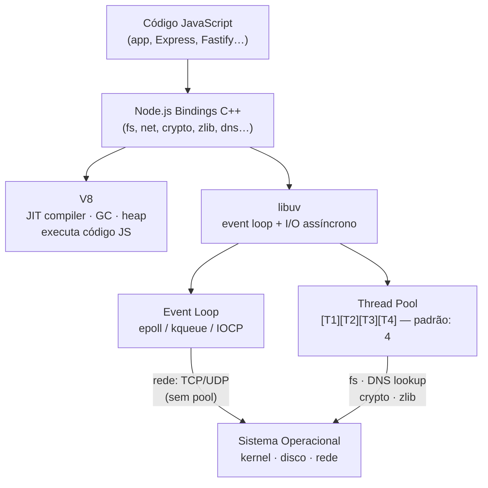

# V8, libuv e thread pool

> [!abstract] TL;DR
> Node.js é a composição de três camadas: V8 (motor JavaScript, executa e compila JS), libuv (biblioteca C que implementa o event loop, file I/O assíncrono e o thread pool) e bindings C++ (a cola entre JS e o mundo nativo). O thread pool tem 4 threads por padrão — e apenas um subconjunto específico de APIs o usa: file system, DNS lookup, crypto e compressão (zlib). Rede (TCP/UDP/HTTP) não passa pelo pool — vai direto ao kernel via epoll, kqueue ou IOCP.

## O que é

Por que `fs.readFile` de 100 arquivos simultâneos satura um servidor Node enquanto 100 requisições HTTP externas não causam problema algum? A resposta está na arquitetura interna: Node não é monolítico — é a composição de três componentes com modelos de concorrência radicalmente diferentes.

### V8 — motor JavaScript

V8 é o engine JavaScript desenvolvido pelo Google para o Chrome. Ele é responsável por:

- **Parsear e compilar** código JavaScript para bytecode e depois para código nativo via JIT (Just-In-Time compilation)
- **Gerenciar memória** — alocação no heap, garbage collection (GC), geração jovem e velha
- **Executar** o código compilado na única thread JavaScript do processo

V8 não sabe nada sobre rede, disco ou sistemas operacionais. Ele executa JavaScript — ponto. Qualquer interação com o mundo externo passa pelas outras camadas.

### libuv — event loop e I/O assíncrono

libuv é uma biblioteca C criada originalmente para o Node.js, hoje usada em outros runtimes. Ela fornece:

- **Event loop** — o mecanismo que mantém o processo vivo e despacha callbacks
- **Abstração cross-platform** de I/O assíncrono (Linux: epoll; macOS/BSD: kqueue; Windows: IOCP)
- **Thread pool** — um conjunto de threads nativas para operações que o kernel não suporta de forma assíncrona nativa
- **Timers, sinais, pipes, sockets** — primitivas de I/O abstraídas sobre a plataforma subjacente

O design central do libuv separa dois mundos:

| Tipo de I/O | Mecanismo | Threads usadas |
|---|---|---|
| Rede (TCP, UDP) | epoll / kqueue / IOCP | Zero (kernel faz o trabalho) |
| Arquivo (filesystem) | Thread pool | 1 thread do pool por operação |
| DNS lookup (`dns.lookup`) | Thread pool | 1 thread do pool por chamada |

Essa distinção é a mais importante da nota — e a mais mal-compreendida.

### Bindings C++ — a ponte

Os bindings são módulos C++ compilados que expõem funcionalidades nativas ao JavaScript. Eles são a cola entre o mundo JS (V8) e as APIs do sistema operacional acessadas via libuv. Quando `fs.readFile` é chamado em JS, o binding correspondente traduz a chamada para uma requisição libuv, que a agenda para o kernel ou para o thread pool.

O Node.js core é essencialmente uma coleção curada desses bindings (para `fs`, `net`, `crypto`, `zlib`, etc.) mais a inicialização do V8 e do event loop.

## Por que importa

Compreender essa arquitetura revela um fato não óbvio: **paralelismo acontece em dois lugares diferentes dentro do mesmo processo Node**, com capacidades radicalmente diferentes:

```
Dois lugares de paralelismo em um processo Node.js:

1. Kernel (via epoll/kqueue/IOCP)
   └─► Capacidade: praticamente ilimitada
   └─► Usado por: rede, HTTP, WebSocket, sockets
   └─► A thread JS apenas registra e aguarda notificação

2. Thread pool (libuv)
   └─► Capacidade: UV_THREADPOOL_SIZE (padrão: 4)
   └─► Usado por: file system, DNS lookup, crypto, zlib
   └─► Operações bloqueiam uma thread do pool enquanto executam
```

A confusão clássica: um dev assume que Node escala tão bem para I/O de arquivo quanto para I/O de rede. Em produção, uma rota que faz muitos `fs.readFile` paralelos satura o pool de 4 threads e cria uma fila invisível — enquanto uma rota equivalente com requisições HTTP externas escala sem gargalo visível, pois usa o kernel.

Entender os dois lugares de paralelismo também desfaz o mito de que "aumentar o UV_THREADPOOL_SIZE sempre resolve" — o pool é limitado por design, e cada thread adicional tem custo de context switching.

## Como funciona

### Diagrama das camadas



### Quais APIs usam o thread pool

A tabela abaixo resolve a dúvida que aparece em entrevistas e em debugging de performance:

| API / módulo | Usa thread pool? | Por quê |
|---|---|---|
| `fs.readFile`, `fs.writeFile`, `fs.stat`… | **Sim** | Não há primitiva de file I/O assíncrona universal no kernel |
| `dns.lookup()` | **Sim** | Usa `getaddrinfo` da libc, que é bloqueante |
| `dns.resolve()`, `dns.resolve4()`… | **Não** | Usa sockets UDP direto — assíncrono via event loop |
| `crypto.pbkdf2`, `crypto.scrypt` | **Sim** | CPU-bound; delegado ao pool para não bloquear thread JS |
| `crypto.randomBytes`, `crypto.randomFill` | **Sim** | Operação de entropia pode bloquear |
| `crypto.generateKeyPair` | **Sim** | Computação intensiva |
| `zlib.gzip`, `zlib.deflate`… | **Sim** | Compressão é CPU-bound |
| `net.createServer`, `http.get`… | **Não** | TCP/UDP usa epoll/kqueue/IOCP — puro event loop |
| `fetch`, `http.request` | **Não** | Rede via sockets não-bloqueantes |
| `setTimeout`, `setInterval` | **Não** | Timers do event loop |
| Worker Threads (código do usuário) | **Não** | Threads separadas, não o pool do libuv |

### Configurando o tamanho do pool

```bash
# Aumentar o pool antes de iniciar o processo
UV_THREADPOOL_SIZE=8 node app.js

# Via script npm
# package.json:
# "scripts": { "start": "UV_THREADPOOL_SIZE=8 node server.js" }
```

```javascript
// Verificar o tamanho atual em runtime (leitura do env)
console.log('Thread pool size:', process.env.UV_THREADPOOL_SIZE ?? '4 (padrão)');
```

O valor deve ser definido **antes** de o processo iniciar. O máximo suportado pelo libuv é 1024. Valores acima do número de logical cores para tarefas CPU-bound trazem context switching sem benefício real.

### Visualizando a saturação do pool

```javascript
// Exemplo hipotético: 10 operações pbkdf2 simultâneas com pool default de 4
const crypto = require('node:crypto');

function hashSenha(senha) {
  return new Promise((resolve, reject) => {
    const inicio = Date.now();
    crypto.pbkdf2(senha, 'salt', 100_000, 64, 'sha512', (err, derivedKey) => {
      if (err) return reject(err);
      console.log(`hash em ${Date.now() - inicio}ms`);
      resolve(derivedKey);
    });
  });
}

// Com UV_THREADPOOL_SIZE=4 (padrão):
// As 4 primeiras operações iniciam imediatamente.
// As demais aguardam na fila do pool — latência visível no log.
const promessas = Array.from({ length: 10 }, (_, i) => hashSenha(`senha${i}`));
Promise.all(promessas).then(() => console.log('Todas concluídas'));
```

Execute o mesmo exemplo com `UV_THREADPOOL_SIZE=10` e observe a redução de latência das últimas operações.

## Na prática

Caso típico em servidores que expõem endpoints de autenticação: uma rota de login usa `crypto.pbkdf2` para verificar senhas. Com alto volume de logins simultâneos — imagine um servidor web recebendo 50 requisições de autenticação por segundo —, as primeiras 4 chamadas de `pbkdf2` entram no pool imediatamente; as demais ficam na fila. A latência de cada login sobe linearmente com o tamanho da fila, mesmo que o event loop e a rede estejam ociosos.

Aumentar `UV_THREADPOOL_SIZE` para 16 resolve o gargalo nesse cenário hipotético (assumindo CPU com cores suficientes). O diagnóstico é possível observando que a latência da rota de login escala com concorrência, mas rotas de rede pura (proxy, read-through cache) não apresentam o mesmo comportamento — sinal direto de saturação de pool versus saturação de kernel/rede.

Para operações de hashing de senha em alta escala, outra abordagem é delegar o trabalho para Worker Threads com seu próprio pool controlado, ou usar um serviço dedicado, isolando o gargalo da aplicação principal.

## Casos práticos

### Cenário 1 — Saturação do thread pool com upload + crypto

Um servidor de upload que recebe arquivos, calcula checksum SHA-256 com `crypto.createHash` e move o arquivo para S3. Parece simples — mas `crypto.createHash` usa o thread pool.

```javascript
import { createReadStream } from 'node:fs';
import { createHash } from 'node:crypto';

// ✅ Forma correta: streaming com createHash (síncrono por chunk, não usa o pool)
async function hashStream(filePath) {
  return new Promise((resolve, reject) => {
    const hash = createHash('sha256');
    const stream = createReadStream(filePath);
    stream.on('data', chunk => hash.update(chunk));
    stream.on('end', () => resolve(hash.digest('hex')));
    stream.on('error', reject);
  });
}

// ❌ Problema: usar crypto.pbkdf2 ou crypto.scrypt para derivação de chave
// em cada upload satura o pool rapidamente sob carga
import { scrypt } from 'node:crypto';
import { promisify } from 'node:util';
const scryptAsync = promisify(scrypt);

// 4 uploads paralelos esgotam o pool; o 5º fica em fila esperando
const key = await scryptAsync(password, salt, 64); // ocupa 1 thread do pool
```

O comportamento observável: com pool default de 4 e 10 uploads paralelos, 6 ficam em fila aguardando threads livres. O event loop está ocioso, a rede está ociosa — o gargalo é invisível sem medir o pool.

### Cenário 2 — `dns.lookup` vs `dns.resolve` e a armadilha silenciosa

```javascript
import dns from 'node:dns/promises';

// ❌ Usa thread pool — um lookup por thread; 4 lookups simultâneos esgotam o pool
const addr1 = await dns.lookup('api.exemplo.com');

// ✅ Usa sockets UDP via event loop — escalável sem limitar no pool
const addr2 = await dns.resolve4('api.exemplo.com');
```

Em serviços que fazem muitos lookups DNS (service discovery, validação de IP, resolução dinâmica de hosts), trocar `dns.lookup` por `dns.resolve4`/`dns.resolve6` elimina um gargalo invisível. A diferença: `lookup` chama `getaddrinfo` da libc (bloqueante, pool), enquanto `resolve` usa sockets UDP (non-blocking, event loop).

## Armadilhas comuns

> [!warning] `UV_THREADPOOL_SIZE` ignorada se setada tarde demais
> A variável precisa estar no ambiente **antes** de qualquer módulo que use o pool ser carregado — ou seja, antes de invocar o processo Node.
>
> ```javascript
> // ❌ Tarde demais: o pool já foi criado antes desse código executar
> process.env.UV_THREADPOOL_SIZE = '16';
> const crypto = require('node:crypto'); // pool criado com tamanho anterior
>
> // ✅ Correto: definir na invocação do processo
> // $ UV_THREADPOOL_SIZE=16 node server.js
> ```
>
> Setá-la via `process.env` dentro do JS pode funcionar se feita antes de qualquer `require` que acione o pool — mas isso depende de timing de inicialização, o que é frágil em projetos reais com `require` de módulos na raiz.

> [!warning] Mais threads no pool nem sempre significa mais performance
> Aumentar `UV_THREADPOOL_SIZE` tem retorno decrescente:
>
> - Para **CPU-bound** (crypto, zlib): mais threads do que logical cores causa context switching excessivo — o kernel alterna mais do que executa trabalho útil.
> - Para **I/O-bound** (filesystem): o gargalo frequentemente é o disco, não o número de threads. Adicionar threads não acelera leitura de um SSD saturado.
> - Cada thread adicional custa ~1 MB de stack no Linux por padrão.
>
> A recomendação da documentação do Node.js é focar em **task partitioning** — dividir operações longas em partes menores — antes de aumentar o pool.

> [!warning] Rede não usa o thread pool — confundir os dois leva a diagnóstico errado
> Um erro comum em debugging: assumir que `http.request`, `fetch` ou conexões TCP/UDP usam o thread pool. Não usam — usam epoll/kqueue/IOCP diretamente no kernel.
>
> Isso significa que aumentar `UV_THREADPOOL_SIZE` não ajuda em nada se o gargalo for rede. O sinal para distinguir: saturação de pool manifesta como *latência crescente com concorrência* em rotas específicas que usam fs/crypto; saturação de rede manifesta de forma diferente (erros de conexão, timeout, RTT alto). Ver [[07 - I-O assíncrono - kernel vs thread pool]] para o deep dive.

## Em entrevista

### Frase pronta (inglês)

> "Node is composed of V8 for JavaScript execution, libuv for async I/O and event loop, and a small set of C++ bindings to glue them. libuv has a thread pool — default size 4, configurable via UV_THREADPOOL_SIZE — used for file system, DNS lookup, crypto, and compression. Network I/O does not use the pool; it goes directly to the OS via epoll, kqueue, or IOCP."

Use essa frase quando perguntarem "Walk me through Node.js architecture" ou "What is libuv?" ou "Does Node.js have threads?". É uma resposta completa e tecnicamente precisa que demonstra entendimento da camada interna.

### Vocabulário de entrevista

| Termo em inglês | Contexto / como usar |
|---|---|
| **engine** (motor) | "V8 is the JavaScript engine embedded in Node" — distingue o runtime JS do resto |
| **thread pool** (pool de threads) | "libuv's thread pool handles file I/O and crypto" — especifica o que usa o pool |
| **binding layer** (camada de ligação) | "C++ bindings bridge JS and native APIs" — explica como V8 acessa o SO |
| **cross-platform** | "libuv abstracts epoll, kqueue, and IOCP behind a single cross-platform API" |
| **epoll / kqueue / IOCP** | Mecanismos de notificação assíncrona de I/O no Linux, macOS e Windows, respectivamente |
| **JIT compilation** | "V8 uses JIT to compile JavaScript to native machine code at runtime" |
| **context switching** | "Too many threads cause excessive context switching, reducing throughput" |

### Perguntas de follow-up comuns

- *"Does `fs.readFile` use the thread pool?"* → Sim. File system operations usam o pool por padrão. Rede não.
- *"Why doesn't network I/O use the thread pool?"* → O kernel oferece mecanismos nativos de notificação assíncrona para sockets (epoll/kqueue/IOCP). File I/O não tem equivalente portável, então libuv usa threads.
- *"What's the maximum UV_THREADPOOL_SIZE?"* → 1024, mas na prática o limite útil é o número de logical cores para CPU-bound e um múltiplo disso para I/O-bound.
- *"How do Worker Threads relate to the thread pool?"* → São diferentes. O thread pool do libuv é interno, gerenciado por libuv para APIs específicas. Worker Threads são threads JS completas criadas explicitamente pelo código da aplicação, com seu próprio event loop e contexto V8.

## O que vem a seguir

Esta nota explicou *o que compõe* o Node: V8 executa JS, libuv gerencia I/O e o thread pool, bindings fazem a ponte. A próxima pergunta natural é: *como o V8 organiza o que está sendo executado?*

A nota [[03 - Call stack, heap e queues]] entra no V8: a call stack (execução frame a frame), o heap (memória alocada, gerações do GC), e as filas que o event loop drena — microtasks antes de macrotasks. Compreender essas estruturas é o que permite prever a ordem de execução de código assíncrono complexo.

## Fontes

- [libuv Design Overview — libuv docs](https://docs.libuv.org/en/v1.x/design.html)
- [V8 — The Chrome V8 JavaScript Engine](https://v8.dev/)
- [Node.js — About Node.js](https://nodejs.org/en/about)

## Veja também

- [[01 - Single-thread e non-blocking I-O]] — o modelo de concorrência que torna esse design necessário; por que uma única thread JS funciona
- [[03 - Call stack, heap e queues]] — o que o V8 gerencia: call stack e heap; as filas que o event loop drena
- [[07 - I-O assíncrono - kernel vs thread pool]] — o deep dive na distinção kernel vs pool; quando cada um é usado e como medir
- [[Node.js]] — tronco: panorama completo do runtime com diagrama de arquitetura e links para toda a trilha
