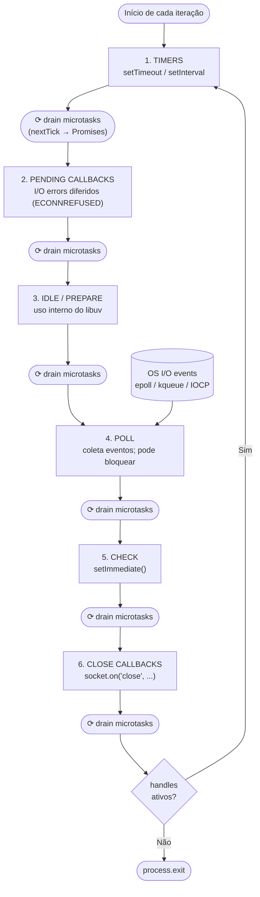

# As fases do event loop

> [!abstract] TL;DR
> O event loop do Node.js roda em seis fases por iteração: **timers**, **pending callbacks**, **idle/prepare**, **poll**, **check** e **close callbacks** — nessa ordem, de forma circular. Entre cada fase, todas as microtasks pendentes são drenadas (primeiro `process.nextTick`, depois Promises e `queueMicrotask`). A fase `poll` é o coração: ela coleta novos eventos de I/O do sistema operacional e pode **bloquear** a thread esperando I/O quando não há trabalho agendado — é o que mantém servidores HTTP vivos.

## Por que `setImmediate` às vezes ganha de `setTimeout(fn, 0)`?

Você registra dois callbacks quase simultaneamente e não consegue prever qual vai disparar primeiro. Não é bug nem condição de corrida — é consequência direta de onde cada um cai no ciclo de seis fases que o libuv executa em loop. Sem entender essa sequência, você está adivinhando.

## O que é

O event loop é o mecanismo que permite ao Node.js executar operações assíncronas em uma única thread JavaScript. Implementado pelo **libuv**, ele não é uma fila única — é um ciclo estruturado em **seis fases distintas**, cada uma com seu próprio tipo de trabalho e sua própria fila de callbacks.

Cada passagem completa pelo ciclo — executando todas as seis fases em sequência — é chamada de **iteração** ou **tick** do event loop. O nome "tick" vem do comportamento de relógio: o loop avança fase a fase, iteração a iteração, enquanto houver trabalho ou o processo estiver ativo.

### timers — execução de callbacks agendados por tempo

A fase **timers** executa os callbacks de `setTimeout()` e `setInterval()` cujo threshold de tempo já expirou. O libuv verifica se o delay mínimo especificado passou; se passou, o callback é elegível para execução nesta fase.

Importante: o threshold é um **mínimo**, não um máximo. Um callback com `setTimeout(fn, 100)` nunca roda antes de 100ms, mas pode rodar bem depois — dependendo do que estava acontecendo em outras fases quando o timer expirou. Se a fase `poll` estava processando um callback longo, o timer vai esperar a poll terminar antes de ser executado na próxima iteração.

O delay mínimo efetivo para `setTimeout(fn, 0)` no Node.js é **1ms** (comportamento interno do libuv), não zero. Esse detalhe é relevante para entender por que `setImmediate` pode vencer uma corrida com `setTimeout(fn, 0)`.

### pending callbacks — callbacks de I/O diferidos

A fase **pending callbacks** executa callbacks de I/O que foram diferidos para a próxima iteração do loop. O caso mais comum são erros de operações de rede como TCP — por exemplo, `ECONNREFUSED` em algumas plataformas é reportado via pending callback em vez de diretamente na fase poll.

Na grande maioria das aplicações, esta fase passa rapidamente sem executar nada. Ela existe para acomodar casos onde o SO reporta condições de erro de forma assíncrona com um tick extra de delay.

### idle, prepare — uso exclusivamente interno

As fases **idle** e **prepare** são de uso exclusivo do libuv internamente. Código JavaScript não pode agendar trabalho diretamente nessas fases. O libuv usa essas fases para preparar operações internas antes da fase poll — por exemplo, calcular o timeout correto para o I/O polling.

Na documentação oficial do Node.js, essas fases são mencionadas apenas como "only used internally". Para fins práticos em entrevistas e debugging, o que importa é saber que elas existem na sequência, mas não interagem com código de aplicação.

### poll — o coração do event loop

A fase **poll** é a mais importante e a mais complexa. Ela tem dois comportamentos distintos dependendo do estado do sistema:

**Quando a poll queue não está vazia:** O event loop itera pelos callbacks na fila e os executa sincronicamente, um por um, até a fila esvaziar ou atingir um limite máximo do sistema operacional. Esses são os callbacks de I/O "prontos" — `fs.readFile` completou, uma conexão TCP chegou, dados chegaram num socket.

**Quando a poll queue está vazia:** O event loop entra no modo de espera. Ele usa mecanismos do OS (`epoll` no Linux, `kqueue` no macOS/BSD, `IOCP` no Windows) para bloquear a thread eficientemente aguardando novos eventos de I/O. O tempo máximo de bloqueio é calculado pelo libuv com base no timer mais próximo que está pendente:

- Se há um timer agendado que vai expirar em Xms, o poll bloqueia por no máximo Xms
- Se há scripts `setImmediate()` agendados, o poll não bloqueia — passa direto para a fase **check**
- Se não há timers nem `setImmediate()` nem handles ativos, o loop **encerra**

Esse comportamento de bloqueio eficiente é o que torna Node.js econômico em termos de CPU: um servidor HTTP em idle não fica em busy-wait — ele fica dormindo no `epoll_wait` do kernel, consumindo praticamente zero CPU, até uma conexão chegar.

### check — execução de setImmediate

A fase **check** executa todos os callbacks registrados via `setImmediate()`. Esta fase existe imediatamente após a fase poll, o que garante que `setImmediate` sempre execute **depois** de qualquer I/O que completou na mesma iteração.

Esse posicionamento é deliberado: `setImmediate` foi projetado para executar "logo após a fase de I/O atual terminar", antes que o loop volte para verificar timers. Daí o comportamento determinístico dentro de um callback de I/O: `setImmediate` sempre vence `setTimeout(fn, 0)` quando ambos são agendados de dentro de um callback de `fs.readFile`, `http.request`, etc.

### close callbacks — limpeza de handles

A fase **close callbacks** executa callbacks registrados para o evento `close` de handles que foram fechados abruptamente. O exemplo canônico é `socket.on('close', ...)` — quando um socket é destruído via `socket.destroy()` (não via `socket.end()`), o callback `close` é enfileirado aqui.

Se um handle for fechado graciosamente (via `end()`), o evento `close` pode ser emitido diretamente, sem passar por esta fase. A fase close callbacks cobre especificamente os fechamentos abruptos.

## Por que importa

Sem entender as fases, vários comportamentos do Node.js parecem arbitrários ou quebrados:

**"`setImmediate` roda antes de `setTimeout(fn, 0)` dentro de I/O"** — só faz sentido sabendo que `setImmediate` pertence à fase **check**, que vem logo após a fase **poll** onde o callback de I/O executou. O timer, por sua vez, só é verificado na fase **timers** da próxima iteração.

**"`process.nextTick` tem prioridade sobre tudo, inclusive Promises"** — porque `nextTick` não é uma fase do event loop: é uma microtask drenada entre fases, com prioridade máxima sobre as demais microtasks (Promises, `queueMicrotask`).

**"Meu servidor não encerra mesmo sem requisições pendentes"** — porque algum handle está ativo (um `setInterval`, um socket aberto, um timer), mantendo o loop vivo na fase poll.

**"Meu timer de 100ms está disparando com 150ms de delay"** — porque a fase poll estava ocupada executando um callback de I/O quando o timer expirou. O timer só é verificado na fase timers, e a fase timers só começa na próxima iteração.

Conhecer as fases transforma comportamento aparentemente mágico em consequências previsíveis de uma sequência fixa.

## Como funciona

### Diagrama — as seis fases em ciclo



**Legenda:**
- `⟳ drain microtasks` = drena `process.nextTick` completamente, depois drena Promise/`queueMicrotask` completamente
- A drenagem acontece entre **cada fase**, não entre callbacks da mesma fase
- Se uma microtask agendar outra microtask, ela também é drenada antes do loop avançar

### Exemplo 1 — contexto de I/O: ordem determinística

```javascript
// Dentro de um callback de I/O, a ordem setImmediate vs setTimeout é DETERMINÍSTICA
const fs = require('node:fs');

fs.readFile(__filename, () => {
  // Estamos aqui: dentro da fase POLL, executando callback de I/O
  // O loop acabou de sair da poll e vai para CHECK antes de voltar para TIMERS

  setTimeout(() => {
    console.log('timeout');    // fase TIMERS — próxima iteração
  }, 0);

  setImmediate(() => {
    console.log('immediate');  // fase CHECK — ainda nesta iteração
  });

  process.nextTick(() => {
    console.log('nextTick');   // microtask — drena ANTES de qualquer fase
  });

  Promise.resolve().then(() => {
    console.log('promise');    // microtask — drena após nextTick, antes de CHECK
  });
});
```

Saída garantida (sempre nesta ordem):

```
nextTick
promise
immediate
timeout
```

Fluxo detalhado:
1. `fs.readFile` completa → callback entra na fila da fase **poll**
2. Fase poll executa o callback → quatro itens são agendados
3. Callback termina → call stack esvazia → microtasks são drenadas:
   - `process.nextTick` drena primeiro → imprime `nextTick`
   - Promise resolve drena depois → imprime `promise`
4. Event loop avança para fase **check** → executa `setImmediate` → imprime `immediate`
5. Microtasks drenadas novamente (nenhuma pendente)
6. Fase **close callbacks** (nada)
7. Nova iteração → fase **timers** → executa `setTimeout` → imprime `timeout`

### Exemplo 2 — fora de contexto de I/O: ordem indeterminada

```javascript
// Fora de qualquer callback de I/O, a ordem setImmediate vs setTimeout(fn, 0)
// É NÃO DETERMINÍSTICA — depende de quanto tempo levou para o Node inicializar

setTimeout(() => {
  console.log('timeout');    // pode sair primeiro OU segundo
}, 0);

setImmediate(() => {
  console.log('immediate');  // pode sair primeiro OU segundo
});
```

Saída possível (varia entre execuções):

```
timeout
immediate
```

ou:

```
immediate
timeout
```

Por quê? Quando o event loop inicia, ele entra na fase **timers**. Se o Node levou mais de 1ms para inicializar (o delay mínimo efetivo de `setTimeout(fn, 0)`), o timer já expirou e `timeout` executa primeiro. Se levou menos, o timer não expirou ainda, a fase timers não executa nada, a poll passa para check e `immediate` executa primeiro. O tempo de startup do processo introduz essa variabilidade.

### Exemplo 3 — drenagem de microtasks entre fases (não entre callbacks)

```javascript
// Demonstração: microtasks drenam entre FASES, não entre cada callback da mesma fase

setTimeout(() => {
  console.log('timer 1');
  process.nextTick(() => console.log('nextTick do timer 1'));
}, 0);

setTimeout(() => {
  console.log('timer 2');
  process.nextTick(() => console.log('nextTick do timer 2'));
}, 0);
```

Saída esperada:

```
timer 1
timer 2
nextTick do timer 1
nextTick do timer 2
```

Não:

```
timer 1
nextTick do timer 1   ← ERRADO: microtasks não drenam entre callbacks da mesma fase
timer 2
nextTick do timer 2   ← ERRADO
```

Ambos os `setTimeout` estão na fase **timers** da mesma iteração. Os dois callbacks executam completamente. Só quando a fase timers termina inteira é que as microtasks são drenadas — e as duas aparecem juntas, na ordem em que foram enfileiradas.

> [!info] Mudança no Node.js 11
> Antes do Node.js 11 (lançado em outubro de 2018), o comportamento era diferente: microtasks eram drenadas apenas entre iterações completas do loop, não entre fases. A partir do Node.js 11, o comportamento foi alinhado com o dos browsers: microtasks drenam entre cada fase. Se estiver mantendo código para Node.js <= 10, esse detalhe é relevante.

### Exemplo 4 — poll blocking e por que servidores ficam vivos

```javascript
const http = require('node:http');

const server = http.createServer((req, res) => {
  res.end('ok');
});

server.listen(3000, () => {
  console.log('Server listening on port 3000');
  // A partir daqui, o processo NUNCA encerra sozinho.
  // Por quê? O server.listen() registra um handle TCP ativo.
  // Na fase poll, o libuv faz epoll_wait()/kqueue() esperando conexões.
  // Enquanto o handle TCP estiver ativo, o loop nunca determina que
  // não há trabalho — ele sempre volta para poll e bloqueia esperando.
});

// Sem nenhuma outra linha de código, o processo permanece vivo indefinidamente.
// Para encerrar: server.close() → remove o handle → loop pode finalizar
```

Contraste com um script sem handles ativos:

```javascript
// Este script encerra naturalmente após ~0ms
setTimeout(() => {
  console.log('executou');
  // Nenhum handle ativo após isso — o loop verifica e encerra
}, 100);

// Fluxo:
// 1. Código síncrono termina
// 2. Poll bloqueia por 100ms (o único timer pendente)
// 3. Fase timers executa o callback
// 4. Loop verifica: nenhum handle ou timer ativo → process.exit(0)
```

## Na prática

### Poll phase e o "loop alive check"

O event loop mantém uma contagem interna de **handles** e **requests** ativos. Um handle é qualquer recurso que pode produzir eventos enquanto estiver ativo: timers, sockets, servidores TCP, file watchers. Um request é uma operação única em andamento (uma leitura de arquivo, uma conexão sendo estabelecida).

O loop encerra quando essa contagem chega a zero e a phase poll determina que não há trabalho futuro. Isso explica comportamentos práticos:

- `setInterval(fn, 1000)` mantém o processo vivo — cria um timer handle ativo
- `server.listen()` mantém o processo vivo — cria um TCP handle ativo
- `fs.readFile(path, cb)` cria um request ativo durante a leitura, mas encerra quando completa
- `server.unref()` — desregistra o handle da contagem "alive check" sem fechar o servidor. O processo pode encerrar mesmo com o servidor aberto, se não houver outro handle ativo

```javascript
// server.unref() — útil em CLIs que não devem ficar vivas por causa de um servidor
const server = http.createServer(handleRequest);
server.listen(0); // porta aleatória
server.unref();   // o servidor existe, mas não impede o processo de encerrar

// O processo vai encerrar quando o código principal terminar,
// mesmo com o servidor ainda registrado
```

### Calculando o timeout da poll

O libuv calcula dinamicamente quanto tempo a fase poll pode bloquear antes de precisar avançar. O cálculo considera:

1. Se há callbacks `setImmediate()` agendados → timeout = 0 (não bloqueia)
2. Se há timers pendentes → timeout = tempo até o próximo timer expirar
3. Se há handles ativos mas nenhum timer → timeout = indefinido (bloqueia até evento)
4. Se não há nada → loop encerra (não chega a bloquear)

Esse mecanismo garante que `setTimeout(fn, 100)` dispare com precisão razoável: a poll sabe que deve sair em no máximo 100ms para que a fase timers execute o callback.

### Diagnóstico: qual fase está bloqueando?

Quando um timer de 50ms está disparando com 200ms de delay, a causa mais comum é um callback de I/O ou outro callback de alguma fase anterior que está executando código síncrono longo. Para diagnosticar:

```javascript
// Instrumentação simples: medir lag do event loop
const INTERVAL_MS = 50;
let lastTime = Date.now();

setInterval(() => {
  const now = Date.now();
  const lag = now - lastTime - INTERVAL_MS;
  if (lag > 10) {
    console.warn(`Event loop lag: ${lag}ms`);
  }
  lastTime = now;
}, INTERVAL_MS);
```

Lag consistente acima de alguns milissegundos indica código bloqueante em alguma das fases. A nota [[10 - Bloqueio do event loop - sintomas e causas]] aprofunda o diagnóstico.

## Casos práticos

### Cenário 1 — Timer de 50ms disparando com 200ms de delay em produção

Um endpoint de relatório usava `fs.readFileSync` para carregar um template grande. Outro serviço dependia de um `setInterval(flush, 50)` para fazer flush de métricas. Os flushes passaram a atrasar 150ms+ em carga.

A causa: `readFileSync` bloqueava a thread JS durante a leitura. Durante esse bloqueio, a fase **timers** não executava — ela só corre quando a call stack esvazia. O intervalo de 50ms se tornava 200ms+ sempre que um relatório era gerado.

```javascript
// ❌ Bloqueio síncrono na fase poll → atrasa todos os timers
app.get('/report', (req, res) => {
  const template = fs.readFileSync('./template.html', 'utf8'); // bloqueia a thread!
  res.send(render(template, data));
});

// ✅ Versão async: libera a thread durante I/O, timers disparam normalmente
app.get('/report', async (req, res) => {
  const template = await fs.promises.readFile('./template.html', 'utf8');
  res.send(render(template, data));
});
```

**O que mudou:** com `readFile` assíncrono, a thread JS fica livre durante a leitura — a fase poll bloqueia eficientemente no kernel, timers continuam disparando na frequência certa.

### Cenário 2 — Servidor que não encerrava em testes automatizados

A suite de testes criava um servidor HTTP para testes de integração, mas o processo de teste nunca encerrava — forçando `process.exit()` no `afterAll`.

A causa: `server.listen()` registra um TCP handle ativo. O event loop mantinha o processo vivo esperando conexões que nunca chegariam. A suite esquecia de chamar `server.close()` no teardown.

```javascript
// ❌ Handle ativo impede o processo de encerrar
beforeAll(() => {
  server = app.listen(3000);
});

// afterAll sem server.close() → processo trava, Jest timeout

// ✅ Fechar o servidor no teardown libera o handle
afterAll((done) => {
  server.close(done); // fecha o handle TCP → loop pode finalizar
});

// Alternativa: server.unref() se o servidor deve existir mas não impedir encerramento
server.unref(); // desregistra da contagem de handles "alive"
```

## Armadilhas comuns

> [!warning] Microtasks drenam entre fases, não entre callbacks da mesma fase
> O erro conceitual mais comum: imaginar que cada callback de `setTimeout` drena suas microtasks imediatamente após. Não é assim — a drenagem ocorre quando **a fase inteira termina**.
>
> ```javascript
> for (let i = 0; i < 3; i++) {
>   setTimeout(() => {
>     console.log(`timer ${i}`);
>     process.nextTick(() => console.log(`  → nextTick após timer ${i}`));
>   }, 0);
> }
> // Saída REAL:   timer 0, timer 1, timer 2, → nextTick 0, → nextTick 1, → nextTick 2
> // Saída ERRADA: timer 0, → nextTick 0, timer 1, → nextTick 1 ← NÃO ACONTECE
> ```
>
> Se a ordem importa para sua lógica, não dependa de intercalação; use `Promise.all` ou estruture o código para não depender dessa sequência.

> [!warning] "macrotask queue" do browser não mapeia para nenhuma fila única do Node
> A poll queue é **interna à fase poll** — contém callbacks de I/O que o kernel reportou como prontos. No Node há filas distintas por fase: fila de timers, fila de pending callbacks, fila de poll, fila de check (setImmediate). "Macrotask queue" é uma abstração de browser que o libuv não usa.
>
> A distinção importa em debugging: um callback via `setImmediate` não está na mesma fila que um `fs.readFile`. Eles executam em fases diferentes, com microtasks potencialmente drenadas entre eles.

> [!warning] `setImmediate` vs `setTimeout(fn, 0)` fora de I/O — ordem não garantida
> Dentro de callbacks de I/O, `setImmediate` sempre vence — ele pertence à fase **check**, que vem logo após **poll**. Mas em código de top-level ou em timers aninhados, a ordem depende do tempo de startup do processo.
>
> ```javascript
> // FRÁGIL em top-level: pode sair em qualquer ordem
> setTimeout(() => console.log('timeout'), 0);
> setImmediate(() => console.log('immediate'));
>
> // DETERMINÍSTICO dentro de I/O: setImmediate sempre primeiro
> fs.readFile(path, () => {
>   setTimeout(() => console.log('timeout'), 0);   // próxima iteração (timers)
>   setImmediate(() => console.log('immediate'));   // esta iteração (check) ← sempre primeiro
> });
> ```

> [!warning] `process.nextTick` recursivo paralisa o event loop inteiro
> `nextTick` não é uma fase — é microtask com prioridade máxima. Se um `nextTick` agenda outro `nextTick`, a fila nunca esvazia e **nenhuma fase executa**.
>
> ```javascript
> // ❌ PARALISAÇÃO: o processo parece vivo mas nada mais executa
> function bloquear() { process.nextTick(bloquear); }
> bloquear();
> setTimeout(() => console.log('nunca imprime'), 0); // nunca alcançado
> ```
>
> O mesmo vale para Promises encadeadas recursivamente. Use `setImmediate` quando precisar de trabalho fatiado que libera o loop entre fatias.

## Em entrevista

### Frase pronta (inglês)

> "The Node.js event loop runs in six phases per iteration: timers, pending callbacks, idle/prepare, poll, check, and close callbacks. The poll phase is the most interesting — it picks up new I/O events from the OS using `epoll`, `kqueue`, or `IOCP` depending on the platform, and it can block waiting for I/O until the nearest timer is due. Between every phase, microtasks are drained — first all `process.nextTick` callbacks, then all Promise and `queueMicrotask` callbacks. That's why `process.nextTick` and Promise callbacks are higher priority than any timer or I/O callback, and why `setImmediate` always beats `setTimeout(fn, 0)` when both are scheduled from inside an I/O callback."

Use essa frase ao responder:
- *"Walk me through the Node.js event loop"*
- *"What are the phases of the event loop?"*
- *"Why does `setImmediate` run before `setTimeout(fn, 0)` sometimes?"*
- *"How does Node handle thousands of concurrent connections on one thread?"*

### Vocabulário de entrevista

| Termo em inglês | Contexto / tradução |
|---|---|
| **event loop phase** | fase do event loop — uma das seis etapas da iteração (timers, pending callbacks, idle/prepare, poll, check, close callbacks) |
| **loop iteration / tick** | iteração do loop — uma passagem completa pelas seis fases |
| **drain microtasks** | drenar microtasks — executar completamente a fila de microtasks (nextTick → Promises) antes de avançar de fase |
| **poll phase** | fase poll — fase que coleta eventos de I/O do OS; pode bloquear aguardando I/O |
| **block waiting for I/O** | bloquear esperando I/O — comportamento da fase poll quando não há trabalho; o kernel notifica quando eventos chegam |
| **handle** | handle — recurso ativo que pode produzir eventos (server, socket, timer); mantém o loop vivo enquanto ativo |
| **epoll / kqueue / IOCP** | mecanismos de I/O polling do OS: epoll (Linux), kqueue (macOS/BSD), IOCP (Windows) |
| **non-deterministic ordering** | ordem não determinística — quando `setImmediate` vs `setTimeout(fn, 0)` em top-level pode variar entre execuções |
| **timer threshold** | threshold do timer — o delay mínimo de um `setTimeout`/`setInterval`; o timer só dispara quando esse mínimo passou |
| **starve the event loop** | faminar o event loop — impedir que outras fases executem bloqueando o loop em microtasks ou código síncrono |

### Perguntas de follow-up comuns

- *"What happens if there's nothing to do in the poll phase?"* → O loop calcula o timeout com base no próximo timer. Se não há timers nem `setImmediate`, e há handles ativos (como um servidor TCP), a poll bloqueia indefinidamente até um evento de I/O chegar. Se não há handles ativos, o processo encerra.

- *"Why is `process.nextTick` not in the event loop diagram?"* → Porque `nextTick` não é uma fase — é uma microtask drenada entre fases. Ele não tem um "slot" no ciclo; ele sempre corre entre a fase atual e a próxima.

- *"What's the difference between `setImmediate` and `process.nextTick`?"* → `setImmediate` é a fase **check** — próxima fase após poll na iteração atual. `process.nextTick` é microtask — drena antes da próxima fase, qualquer que seja ela. `nextTick` tem prioridade maior que `setImmediate`.

- *"How does the event loop keep a server alive?"* → `server.listen()` registra um TCP handle ativo. O loop só encerra quando a contagem de handles ativos chega a zero. Enquanto o servidor estiver ouvindo, há sempre um handle ativo, a fase poll sempre tem uma razão para continuar, e o processo nunca encerra.

- *"Can you block the event loop from JavaScript code?"* → Sim, de duas formas: código síncrono longo (um loop de computação ocupando a call stack) ou microtasks recursivas (um `process.nextTick` que agenda outro `nextTick`). Em ambos os casos, nenhuma outra fase executa durante o bloqueio.

## O que vem a seguir

Agora que você conhece as seis fases e o ciclo completo, a próxima camada é entender a **fila de microtasks com precisão cirúrgica**: por que `process.nextTick` tem prioridade maior que `Promise.then`? O que `queueMicrotask` traz de diferente? E quando microtasks agendadas dentro de microtasks disparam?

A nota [[05 - Microtasks - nextTick, queueMicrotask, Promise.then]] responde essas perguntas com exemplos de casos de borda — incluindo o padrão de recursão que paralisa servidores em produção e como `async/await` se encaixa nessa fila.

## Veja também

- [[03 - Call stack, heap e queues]] — as estruturas de memória que o event loop manipula: call stack, heap, microtask queue e macrotask queue
- [[05 - Microtasks - nextTick, queueMicrotask, Promise.then]] — deep dive na drenagem de microtasks: ordem de prioridade, casos de borda, recursão perigosa
- [[06 - Macrotasks e timers - setTimeout, setInterval, setImmediate]] — comportamento detalhado dos timers: jitter, drift, coalescing, e comparação completa das APIs
- [[07 - I-O assíncrono - kernel vs thread pool]] — o que acontece dentro da fase poll: como epoll/kqueue/IOCP notificam o libuv e quais operações usam o thread pool vs I/O assíncrono nativo do kernel
- [[10 - Bloqueio do event loop - sintomas e causas]] — como identificar e corrigir quando uma das fases está bloqueando o loop em produção
- [[Node.js]] — tronco: panorama completo do runtime com diagrama de arquitetura e links para toda a trilha

## Fontes

- [Node.js — The Node.js Event Loop](https://nodejs.org/en/learn/asynchronous-work/event-loop-timers-and-nexttick) — documentação oficial das fases do event loop, timers e `process.nextTick`
- [libuv — Design overview](https://docs.libuv.org/en/v1.x/design.html) — especificação do loop de I/O do libuv, com detalhes sobre epoll/kqueue/IOCP e a estrutura de handles e requests
- [Don't Block the Event Loop (or the Worker Pool)](https://nodejs.org/en/learn/best-practices/dont-block-the-event-loop) — guia oficial Node.js sobre o custo de bloquear cada fase e como evitar starvation
