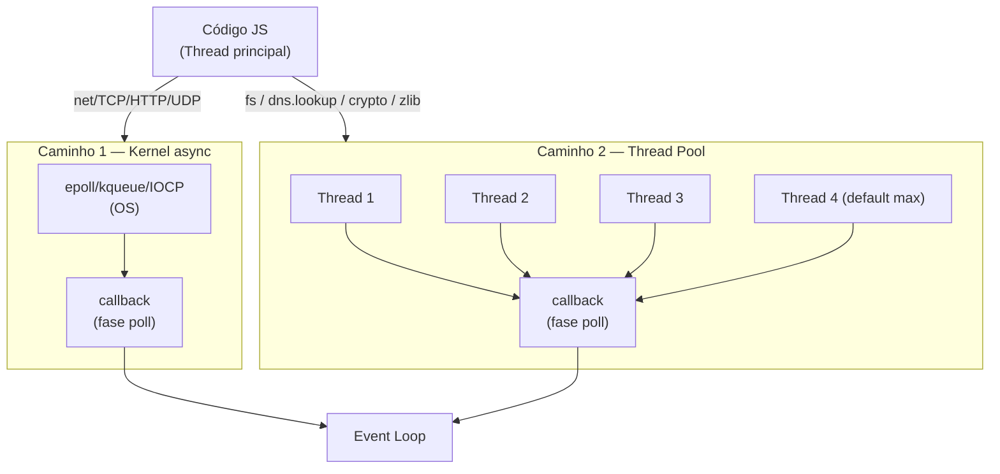

# I/O assíncrono: kernel vs thread pool

> [!abstract] TL;DR
> Nem todo I/O no Node.js passa pelo thread pool. Network I/O — TCP, HTTP, UDP — usa **primitivas async do kernel** (epoll no Linux, kqueue no macOS/BSD, IOCP no Windows) e não consome nenhuma thread. File I/O (`fs`), DNS lookup (`dns.lookup`), crypto (`pbkdf2`, `scrypt`) e compressão (zlib) usam o **thread pool de libuv**, que tem apenas 4 threads por padrão. A implicação prática: você pode abrir um milhão de conexões TCP sem saturar nada; 5 operações de `crypto.pbkdf2` concorrentes já travam o pool.

## Por que 5 `crypto.pbkdf2` simultâneos travam mais o Node.js do que 5.000 conexões TCP?

Isso parece paradoxal para quem acha que Node.js "é async por natureza". A verdade é que existem **dois mecanismos completamente diferentes** por baixo — e um deles é muito mais limitado que o outro. Sem entender essa distinção, você vai diagnosticar o problema errado em produção.

## O que é

Node.js é frequentemente descrito como "assíncrono por natureza" — mas há uma distinção crucial que a maioria das explicações superficiais ignora: **o mecanismo que implementa essa assincronicidade varia dependendo do tipo de I/O**.

Existem dois caminhos completamente distintos:

### Caminho 1 — I/O pelo kernel (kernel-level async I/O)

O sistema operacional oferece mecanismos para monitorar múltiplos descritores de arquivo (sockets, pipes) de forma não bloqueante a partir de **uma única thread**. O processo registra interesse em um evento ("avise quando esse socket tiver dados"), o kernel coloca o processo em espera sem consumir CPU, e acorda o processo quando o evento ocorre.

Cada OS tem sua implementação:

| Sistema Operacional | Mecanismo | Introduzido |
|---|---|---|
| Linux | **epoll** | Kernel 2.5.44 (2002) |
| macOS / BSD | **kqueue** | FreeBSD 4.1 (2000) |
| Windows | **IOCP** (I/O Completion Ports) | Windows NT 3.5 (1994) |

**Como o epoll funciona, em linhas gerais:**

1. O processo cria um file descriptor especial via `epoll_create()`
2. Para cada socket que quer monitorar, chama `epoll_ctl()` registrando interesse ("me avise quando esse fd ficar legível")
3. Chama `epoll_wait()` — que bloqueia a thread sem consumir CPU até que algum dos fds monitorados tenha evento
4. O kernel acorda a thread com a lista de fds prontos
5. O processo processa os callbacks e volta para `epoll_wait()`

Esse ciclo é exatamente o **poll phase** do event loop do libuv. Uma única chamada a `epoll_wait()` pode retornar dezenas de sockets prontos de uma vez — a thread processa todos, despacha os callbacks, e volta a dormir.

libuv abstrai as três APIs (`epoll`, `kqueue`, `IOCP`) numa interface unificada. O event loop do Node.js usa essa abstração para monitorar **todos** os sockets de rede. Resultado: 10.000 conexões TCP abertas simultaneamente consomem praticamente zero threads adicionais — apenas registros no kernel.

### Caminho 2 — Thread pool (worker pool)

O histórico do POSIX tem uma limitação: **file I/O nunca ganhou uma API assíncrona real no kernel**. As chamadas de sistema para ler e escrever em disco (`read()`, `write()`, `open()`) são bloqueantes — enquanto o disco busca os dados, a thread que fez a chamada fica bloqueada esperando.

A solução do libuv foi pragmática: **thread pool**. Operações que não têm suporte async nativo no kernel são delegadas a threads de trabalho que podem bloquear sem travar a thread principal do JavaScript.

Como o pool funciona:

1. Quando você chama `fs.readFile()`, o Node registra a operação via `uv_queue_work()`
2. Uma thread do pool pega a tarefa e faz a chamada bloqueante ao kernel (`read()`)
3. A thread fica parada até o disco responder
4. Quando o dado chega, a thread marca a tarefa como concluída e notifica o event loop
5. O event loop, na próxima fase `poll`, despacha o callback com o resultado

O pool tem 4 threads por padrão. Isso não é um número mágico — é um valor conservador que funciona bem na maioria dos casos, mas satura rapidamente sob carga real. Com 4 threads, a quinta operação de `fs.readFile` fica em fila enquanto as quatro anteriores não terminarem.

## Por que importa

A distinção kernel vs thread pool é o fundamento para entender dois padrões opostos de escala no Node.js:

- **Escala de rede**: praticamente ilimitada (bounded por memória RAM, não por threads)
- **Escala de file I/O / crypto / DNS**: limitada ao tamanho do pool (4 por padrão)

É por isso que o Node.js é excelente como proxy, API gateway ou servidor de WebSockets — e pode ser surpreendentemente ruim como processador de arquivos ou serviço de hashing intensivo sem configuração adequada.

Sem entender essa divisão, comportamentos como "thread pool exausto" parecem magia negra. Sintomas típicos de saturação do pool:

- Operações de `fs` que normalmente completam em milissegundos começam a demorar segundos
- `dns.lookup` começa a enfileirar requisições DNS (causando timeouts em cascata)
- Operações de crypto ficam lentas mesmo sem CPU alto no processo principal
- O event loop parece travado, mas `top` mostra baixo uso de CPU

**O engano mais comum**: desenvolvedores monitoram uso de CPU e, ao ver valores baixos, concluem que "o Node está bem". Mas o bottleneck pode ser no pool — threads bloqueadas em I/O de disco ou em hashing intensivo, enquanto a CPU principal espera os callbacks.

A raiz da confusão é que, do ponto de vista do JavaScript, toda operação parece idêntica: você chama uma função com callback e recebe o resultado de forma assíncrona. A diferença entre `net.createConnection()` e `fs.readFile()` é invisível no código JS — mas é profundamente diferente embaixo.

> [!info] Regra prática rápida
> Se a operação envolve **rede** (TCP, UDP, HTTP, WebSocket) → kernel, não satura. Se a operação envolve **disco, DNS, crypto ou compressão** → thread pool, pode saturar com apenas 5 chamadas concorrentes.

### Diagrama — os dois caminhos de I/O



**Diferença-chave:** Kernel async escala com zero threads extras. Thread pool escala só até o limite de threads configurado — 4 por padrão.

## Como funciona

### Modelo mental

```
JS (single thread)
       │
       ▼
  libuv event loop
       │
       ├──── Rede (TCP/UDP/HTTP) ──────► Kernel (epoll/kqueue/IOCP)
       │                                        │
       │                                        │ notifica quando pronto
       │                                        ▼
       │                                  event loop ──► callback JS
       │
       └──── File I/O / DNS / Crypto ──► Thread Pool (4 threads)
                                                │
                                       thread faz syscall bloqueante
                                                │
                                        resposta do kernel/disco
                                                │
                                        marca como concluído
                                                │
                                          event loop ──► callback JS
```

O ponto crítico do diagrama: ambos os caminhos terminam no event loop despachando o callback para o JavaScript. A diferença está em **quantos recursos consomem enquanto esperam** — zero threads para rede, uma thread por operação para o pool.

### A tabela canônica

| API | Mecanismo | Thread pool? | Escala |
|---|---|---|---|
| `net.Socket`, `http.request`, `https.request` | kernel (epoll/kqueue/IOCP) | não | milhões de conexões |
| `dgram.createSocket` (UDP) | kernel | não | milhões |
| `fs.readFile`, `fs.writeFile`, `fs.stat` | thread pool | **sim** | ~4 paralelas |
| `fs.createReadStream` (stream) | thread pool | **sim** | ~4 paralelas |
| `dns.lookup`, `dns.lookupService` | thread pool (via `getaddrinfo`) | **sim** | ~4 paralelas |
| `dns.resolve`, `dns.resolve4`, `dns.resolve6` | kernel (socket UDP) | não | milhões |
| `crypto.pbkdf2`, `crypto.scrypt` | thread pool | **sim** | ~4 paralelas |
| `crypto.randomBytes` (callback) | thread pool | **sim** | ~4 paralelas |
| `crypto.randomBytes` (síncrono) | thread principal | não (bloqueia!) | 1 por vez |
| `zlib.deflate`, `zlib.inflate` | thread pool | **sim** | ~4 paralelas |
| `child_process.exec`, `spawn` | processo separado | não | centenas |

### Experimento: saturando o pool

O código abaixo demonstra a saturação do pool com operações de crypto. Com 4 threads (padrão), as 8 chamadas não executam em paralelo real — ficam em fila de 4.

```javascript
// satura-pool.js
const crypto = require('crypto');

function medirPbkdf2(id) {
  const inicio = Date.now();
  return new Promise((resolve) => {
    crypto.pbkdf2('senha', 'sal', 100_000, 64, 'sha512', () => {
      const duracao = Date.now() - inicio;
      console.log(`pbkdf2 #${id} concluiu em ${duracao}ms`);
      resolve();
    });
  });
}

async function main() {
  const inicio = Date.now();
  console.log(`UV_THREADPOOL_SIZE = ${process.env.UV_THREADPOOL_SIZE || 4}`);

  // 8 operações concorrentes
  await Promise.all(
    Array.from({ length: 8 }, (_, i) => medirPbkdf2(i + 1))
  );

  console.log(`Total: ${Date.now() - inicio}ms`);
}

main();
```

**Resultado com pool padrão (4 threads):**

```
UV_THREADPOOL_SIZE = 4
pbkdf2 #1 concluiu em ~1200ms
pbkdf2 #2 concluiu em ~1200ms
pbkdf2 #3 concluiu em ~1200ms
pbkdf2 #4 concluiu em ~1200ms
pbkdf2 #5 concluiu em ~2400ms   ← esperou o lote anterior
pbkdf2 #6 concluiu em ~2400ms
pbkdf2 #7 concluiu em ~2400ms
pbkdf2 #8 concluiu em ~2400ms
Total: ~2400ms
```

**Resultado com pool aumentado (8 threads):**

```bash
UV_THREADPOOL_SIZE=8 node satura-pool.js
```

```
UV_THREADPOOL_SIZE = 8
pbkdf2 #1 concluiu em ~1200ms
pbkdf2 #2 concluiu em ~1200ms
...
pbkdf2 #8 concluiu em ~1200ms   ← todas executaram em paralelo
Total: ~1200ms
```

> [!warning] UV_THREADPOOL_SIZE deve ser setada antes de qualquer import
> A variável precisa estar no ambiente **antes** de o processo Node iniciar — ou ao menos antes que qualquer módulo registre handles no pool. Setar via `process.env.UV_THREADPOOL_SIZE = '8'` dentro do código JS pode não ter efeito se o pool já foi inicializado.

### O limite máximo do pool

libuv aceita `UV_THREADPOOL_SIZE` de até **1024** (aumentado de 128 na versão 1.30.0). Cada thread consome cerca de 8 MB de stack (desde libuv 1.45.0). Um pool de 128 threads consome ~1 GB apenas em stacks — dimensione com critério.

Para operações CPU-bound (crypto, zlib), aumentar além do número de CPUs lógicas não traz ganho — as threads vão disputar os mesmos cores. Para operações I/O-bound que realmente bloqueiam em disco, mais threads ajudam porque cada thread pode estar bloqueada esperando o disco enquanto outras trabalham.

## Na prática

### Cenário: API de upload com bcrypt

Imagine uma API REST que recebe uploads de imagem e, na mesma requisição, autentica o usuário verificando a senha com bcrypt.

bcrypt — como `crypto.pbkdf2` — usa o thread pool. Com 4 uploads concorrentes, as 4 threads estão ocupadas com bcrypt. O quinto upload chega e a operação de bcrypt fica enfileirada. O mesmo pool que está sendo usado para bcrypt é o pool que `fs.readFile` usa para gravar o upload em disco. Resultado: tudo trava — autenticação lenta, escrita de arquivo lenta, e do ponto de vista do cliente, a API "travou".

**Soluções comuns:**

1. **Subir `UV_THREADPOOL_SIZE`** (rápido, mas aumenta consumo de memória)
   ```bash
   UV_THREADPOOL_SIZE=16 node server.js
   ```

2. **Mover bcrypt para um Worker Thread** (isola o custo do pool principal)
   ```javascript
   // bcrypt-worker.js
   const { workerData, parentPort } = require('worker_threads');
   const bcrypt = require('bcrypt');

   bcrypt.compare(workerData.senha, workerData.hash)
     .then(resultado => parentPort.postMessage(resultado));
   ```

3. **Separar serviços** — autenticação num microserviço dedicado, uploads noutro

4. **Usar `dns.resolve4` em vez de `dns.lookup`** para evitar pressão adicional no pool durante resolução de nomes de endpoints externos

> [!tip] Preview — galho 2
> Worker Threads (nota futura no galho de paralelismo) são a solução canônica para operações CPU-bound: cada Worker Thread tem **seu próprio thread pool libuv**, isolado do pool principal. Mover bcrypt para um Worker Thread significa que o pool principal fica livre para file I/O e outros usos.

## Casos práticos

### Cenário 1 — Saturação do pool por DNS: API lenta sem motivo aparente

Um serviço de proxy reverso fazia chamadas HTTP para 10 backends externos em paralelo. Em carga, as respostas começaram a atrasar 2-3 segundos — muito além do tempo de resposta dos backends.

A causa: cada `http.request` com hostname invoca `dns.lookup` internamente (que usa o thread pool via `getaddrinfo`). Com 10 chamadas paralelas e pool de 4 threads, 6 ficavam em fila esperando resolução DNS.

```javascript
// ❌ 10 chamadas paralelas → 10 dns.lookup simultâneos → pool satura
const resultados = await Promise.all(
  backends.map(url => fetch(url)) // cada fetch com hostname → dns.lookup no pool
);

// ✅ Cache DNS manual: resolve uma vez e reutiliza o IP
const cache = new Map();
async function fetchComCache(url) {
  const parsed = new URL(url);
  if (!cache.has(parsed.hostname)) {
    const [addr] = await dns.promises.resolve4(parsed.hostname); // UDP, não pool
    cache.set(parsed.hostname, addr);
  }
  const ip = cache.get(parsed.hostname);
  return fetch(url.replace(parsed.hostname, ip), {
    headers: { host: parsed.hostname } // SNI correto
  });
}
```

### Cenário 2 — Crypto exaurindo o pool em endpoint de login

Um endpoint de autenticação usava `bcrypt.hash` (que internamente usa `crypto`) para hashear senhas. Em carga com 20 requests simultâneos, as latências explodiram de 200ms para 4-5 segundos.

Com pool de 4 threads e bcrypt usando todas, os outros 16 requests (incluindo operações de `fs` e outros) ficavam em fila.

```javascript
// ❌ bcrypt + pool padrão: 5+ hashes simultâneos degradam tudo no processo
app.post('/login', async (req, res) => {
  const hash = await bcrypt.hash(req.body.senha, 12); // usa thread pool
  // ... 20 requests simultâneos → 4 no pool, 16 esperando
});

// ✅ Worker Thread para isolar crypto do pool principal
const { Worker } = require('worker_threads');
// Cada Worker tem seu próprio pool libuv — não compete com o principal
async function hashNoWorker(senha) {
  return new Promise((resolve, reject) => {
    const worker = new Worker('./bcrypt-worker.js', { workerData: senha });
    worker.once('message', resolve);
    worker.once('error', reject);
  });
}
```

## Armadilhas comuns

> [!warning] `dns.lookup` usa o thread pool — saturação invisível em APIs que fazem muitas chamadas HTTP
> Toda `http.request`/`https.request` com hostname invoca `dns.lookup` internamente via `getaddrinfo` (chamada bloqueante do SO). 10 chamadas HTTP paralelas = 10 `dns.lookup` no pool. Com pool de 4 threads, 6 ficam em fila.
>
> Use `dns.resolve4` (que usa UDP socket, não pool) + cache manual para evitar o problema em código que faz muitas chamadas a serviços externos.

> [!warning] `UV_THREADPOOL_SIZE` deve estar no ambiente antes do processo iniciar — não via `process.env`
> O libuv lê o tamanho do pool na inicialização. Modificar `process.env.UV_THREADPOOL_SIZE` no código não tem efeito se o pool já foi criado (o que acontece no primeiro import de qualquer módulo nativo).
>
> ```bash
> # ✅ Correto: variável no ambiente do processo
> UV_THREADPOOL_SIZE=16 node server.js
> # Ou em systemd: Environment=UV_THREADPOOL_SIZE=16
> # ❌ Errado: process.env.UV_THREADPOOL_SIZE = '16' dentro do código
> ```
>
> Se usar `dotenv`, garanta que `require('dotenv').config()` é a primeira linha do entry point — antes de qualquer `require` de módulo nativo.

> [!warning] fs, dns.lookup, crypto e zlib compartilham **o mesmo pool** — operações de tipos diferentes competem
> Não há pools separados por tipo de operação. Crypto intenso atrasa file I/O e vice-versa. Um arquivo de 1 GB lido com `fs.readFile` mantém uma thread ocupada durante toda a transferência — use `fs.createReadStream` com chunks para liberar a thread entre leituras.
>
> Monitorar pool como um todo (não por tipo de operação) é o diagnóstico correto: se latência de `fs` sobe sem CPU alto, verifique se há crypto ou compressão intensos rodando no mesmo processo.

## Em entrevista

### Frase pronta (inglês)

> "Node's async I/O comes in two flavors. Network I/O — TCP, HTTP — uses the OS's kernel-level async primitives: epoll on Linux, kqueue on macOS, IOCP on Windows. These are extremely scalable; you can have millions of open sockets without touching any threads. File I/O is different — POSIX doesn't have a real async file API, so libuv uses a thread pool, default size 4. DNS lookup, crypto, and zlib also use the pool. The implication: an app heavy on file ops or crypto can saturate the pool with just 5 concurrent operations, while the same app doing TCP scales effortlessly. The fix is usually raising UV_THREADPOOL_SIZE or moving CPU-heavy work to Worker Threads."

### Variações e perguntas de acompanhamento

**"Por que Node.js escala bem para HTTP mas não para file I/O intensivo?"**

Porque HTTP usa epoll/kqueue — mecanismos kernel que monitoram milhares de sockets com zero threads. File I/O usa o thread pool, limitado a 4 por padrão. Scale de rede é limitado por memória; scale de file I/O é limitado pelo pool.

**"Por que `dns.lookup` usa o thread pool mas `dns.resolve4` não?"**

`dns.lookup` chama `getaddrinfo()` do glibc, que é uma chamada de sistema bloqueante que respeita `/etc/hosts` e `/etc/nsswitch.conf`. Não tem API async kernel para isso. `dns.resolve4` faz uma query DNS real via socket UDP — que o kernel monitora com epoll/kqueue como qualquer outro socket.

**"Como você detectaria saturação do thread pool em produção?"**

Metricamente: latência de operações de `fs` e `crypto` aumentando sem CPU alto, event loop lag crescendo mesmo com poucos requests, filas de callbacks acumulando. Ferramentas: `clinic.js`, `node --prof`, métricas de latência p99 de operações específicas, e o módulo `event-loop-lag`.

**"Qual o risco de setar `UV_THREADPOOL_SIZE=1024`?"**

Cada thread de trabalho do libuv reserva 8 MB de stack. Um pool de 1024 threads consume ~8 GB só em stacks — potencialmente mais do que a RAM disponível. Para operações CPU-bound (crypto, zlib), threads além do número de CPUs lógicas não trazem ganho e adicionam overhead de context switching. A regra prática: para I/O-bound, pode ir até 2-4x o número de CPUs; para CPU-bound, fique no número de CPUs ou menos.

**"Por que `http.request` pode saturar o pool mesmo sem `fs`?"**

Porque `http.request` com hostname (não IP) chama `dns.lookup` internamente, que usa o pool via `getaddrinfo`. Uma API que faz 10 chamadas HTTP simultâneas para serviços externos está, silenciosamente, fazendo 10 `dns.lookup` simultâneos — potencialmente saturando o pool antes de qualquer operação de arquivo.

### Vocabulário técnico

| Português | Inglês |
|---|---|
| I/O do kernel | kernel-level I/O |
| Saturação do pool | pool saturation |
| Resolução DNS | DNS lookup / DNS resolution |
| Primitivas async do OS | OS async primitives |
| Thread de trabalho | worker thread |
| Pool de threads | thread pool |
| Descritores de arquivo | file descriptors |
| Chamada bloqueante | blocking system call |

## O que vem a seguir

Agora que você entende os dois caminhos de I/O, a próxima fronteira é **Promises por dentro** — o mecanismo JS que conecta as operações async (sejam de kernel ou de pool) ao código que as consome. Como o motor de Promises do V8 agenda os callbacks na microtask queue? O que acontece com uma Promise rejeitada sem `.catch()`?

A nota [[08 - Promises por dentro]] explica a máquina de estados da Promise, o executor síncrono, e por que `async/await` é apenas açúcar sintático sobre esse mecanismo.

## Veja também

- [[02 - V8, libuv e thread pool]] — introdução ao pool e à arquitetura do libuv
- [[04 - As fases do event loop]] — como o event loop integra os callbacks de I/O
- [[10 - Bloqueio do event loop - sintomas e causas]] — o que acontece quando pool ou loop travam
- [[Node.js]] — tronco central; contexto macro da plataforma

## Fontes

- [libuv — Design overview: I/O](https://docs.libuv.org/en/v1.x/design.html) — especificação do mecanismo de I/O do libuv, incluindo epoll/kqueue/IOCP e o thread pool
- [Node.js — Don't Block the Event Loop (or the Worker Pool)](https://nodejs.org/en/learn/best-practices/dont-block-the-event-loop) — lista oficial de operações que usam o pool e estratégias para evitar saturação
- [Node.js — dns.lookup vs dns.resolve](https://nodejs.org/api/dns.html#dnslookuphostname-options-callback) — documentação oficial explicando a diferença de implementação entre as duas APIs de DNS
