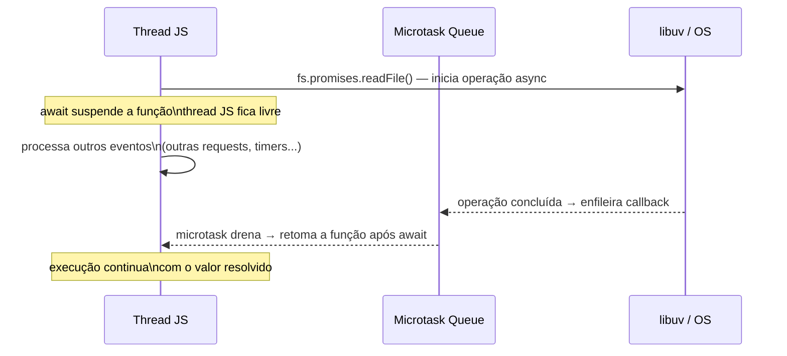

# async/await: o que é, o que não é

> [!abstract] TL;DR
> `async/await` é açúcar sintático sobre Promises — **não cria threads, não paraleliza, não evita bloqueio**. Uma função `async` sempre retorna uma Promise. `await` pausa a execução da função até a promise liquidar, mas a thread JS fica livre para processar outros eventos durante essa pausa. Para executar operações assíncronas em paralelo, use `Promise.all`. Para descarregar trabalho CPU-bound, use Worker Threads.

---

## Por que um handler `async` com código síncrono pesado bloqueia o servidor inteiro?

A resposta surpreende quem aprende `async/await` pelos tutoriais: `async` não cria thread, não paraleliza, não evita bloqueio. É açúcar sintático sobre Promises — e Promises também rodam na mesma thread JS. Entender o que `await` realmente faz (e o que ele *não* faz) é o que separa diagnóstico correto de chute.

## O que é

### `async`: a função que sempre retorna Promise

A palavra-chave `async` transforma qualquer função em uma **função assíncrona**. O efeito é simples e preciso: a função sempre retorna uma Promise, independente do que esteja dentro dela.

```javascript
async function saudacao() {
  return 'olá';
}

saudacao(); // Promise { 'olá' } — não a string diretamente
```

As equivalências exatas:

| Dentro da função async | O que a promise faz |
|---|---|
| `return value` | `Promise.resolve(value)` |
| `throw error` | `Promise.reject(error)` |
| Função retorna sem `return` | `Promise.resolve(undefined)` |

Se você retornar uma Promise de dentro de uma função `async`, o motor não encapsula promise dentro de promise — ele adota a promise interna:

```javascript
async function f() {
  return Promise.resolve(42); // mesma coisa que: return 42
}

f().then(console.log); // 42 — não Promise { 42 }
```

### `await`: pausa sem bloquear

`await` só pode ser usado dentro de uma função `async` (ou no nível de módulo com ES Modules). Ele pausa a execução da função até que a promise à direita se **liquide** (settle) — seja fulfillada ou rejeitada.

```javascript
async function buscarDados() {
  console.log('antes do await');
  const dados = await fetch('/api/dados'); // pausa aqui
  console.log('depois do await');         // continua quando fetch resolver
  return dados.json();
}
```

Durante a pausa, a thread JS não fica bloqueada esperando. O controle retorna ao event loop, que pode processar outras callbacks, timers, eventos de I/O — qualquer trabalho pendente. Quando a promise liquidar, a continuação da função é enfileirada como **microtask** e retoma assim que o frame atual terminar.

### `await` em valor não-Promise

`await` funciona com qualquer valor, não apenas promises. Se o valor não for uma promise (ou thenable), ele é automaticamente envolvido em `Promise.resolve(value)`:

```javascript
async function exemplo() {
  const x = await 42;     // mesmo que: await Promise.resolve(42)
  const y = await 'texto'; // mesmo que: await Promise.resolve('texto')
  console.log(x, y); // 42 'texto'
}
```

O comportamento é correto, mas desnecessário para valores síncronos — é açúcar que não adiciona valor nesses casos.

### Top-level await (ES Modules)

Em módulos ES (`.mjs` ou `"type": "module"` no `package.json`), `await` pode ser usado no nível do módulo, fora de qualquer função `async`:

```javascript
// arquivo.mjs
const config = await import('./config.json', { assert: { type: 'json' } });
console.log(config); // aguarda o import antes de continuar
```

Em CommonJS (`.cjs` ou padrão do Node), isso não funciona — é necessário embrulhar em uma IIFE async.

---

## O mito central: `async` não é performance

> [!warning] O mito mais comum em entrevistas de Node.js
> "Usei `async/await`, então minha rota é performática."
>
> **Errado.** `async` é uma declaração sobre o *tipo de retorno* da função — não sobre o que acontece *dentro* dela.

### O exemplo do gatilho desta trilha

```javascript
// Parece correto. Tem async. Mas bloqueia o event loop.
app.get('/users', async (req, res) => {
  const result = heavyProcessing(data);  // CPU-bound síncrono
  res.json(result);
});
```

`heavyProcessing` é código síncrono. Não importa que o handler seja `async` — enquanto `heavyProcessing` roda, a thread JS está 100% ocupada. Nenhuma outra request pode ser processada. O event loop inteiro espera.

A `async` aqui serve apenas para permitir o uso de `await` dentro do handler. Ela não cria uma thread separada, não enfileira o trabalho em background, não "torna async" o que é síncrono.

### O que `async` faz vs o que não faz

| Afirmação | Verdadeiro? |
|---|---|
| Função `async` sempre retorna Promise | Sim |
| `await` pausa a função sem bloquear a thread | Sim |
| `async` cria uma nova thread para a função | **Não** |
| `async` evita bloqueio de código CPU-bound | **Não** |
| `async` paraleliza operações dentro da função | **Não** |
| `await` em série paraleliza as operações | **Não** |

O modelo mental correto: `async/await` é uma forma de escrever código que *espera por I/O* de forma legível. Para I/O (rede, disco, banco de dados), funciona perfeitamente — a thread fica livre enquanto o sistema operacional ou libuv faz o trabalho pesado. Para CPU, não ajuda em nada.

### Diagrama — o que `await` faz na thread JS



**Chave:** durante o `await`, a thread JS processa outros eventos — é o que permite concorrência. Se o código *dentro* da função async for síncrono pesado, não há `await` para liberar a thread.

---

## Como funciona

### Sequencial vs paralelo: o padrão mais importante

O erro mais comum com `async/await` em código de produção:

```javascript
// RUIM — sequencial sem necessidade
// Tempo total: tempo(A) + tempo(B) + tempo(C)
async function buscarDados() {
  const usuario = await fetch('/api/usuario');
  const pedidos = await fetch('/api/pedidos');
  const config  = await fetch('/api/config');
  return { usuario, pedidos, config };
}
```

Cada `await` aguarda o anterior terminar antes de disparar o próximo. As três requisições acontecem uma após a outra, mesmo sem nenhuma dependência entre elas.

```javascript
// BOM — paralelo com Promise.all
// Tempo total: max(tempo(A), tempo(B), tempo(C))
async function buscarDados() {
  const [usuario, pedidos, config] = await Promise.all([
    fetch('/api/usuario'),
    fetch('/api/pedidos'),
    fetch('/api/config'),
  ]);
  return { usuario, pedidos, config };
}
```

`Promise.all` dispara as três promises ao mesmo tempo. O `await` aguarda que todas liquidem. O tempo total é o da mais lenta — não a soma de todas.

> [!tip] Regra prática
> Se duas ou mais operações assíncronas não dependem uma da outra, use `Promise.all`. `await` em série é correto apenas quando cada operação depende do resultado da anterior.

### Os quatro combinadores de Promise

```javascript
// Promise.all — falha rápido, retorna array de valores
const [a, b, c] = await Promise.all([opA(), opB(), opC()]);
// Se qualquer uma rejeitar, Promise.all rejeita imediatamente

// Promise.allSettled — aguarda todas, retorna status de cada uma
const resultados = await Promise.allSettled([opA(), opB(), opC()]);
// resultados[0] = { status: 'fulfilled', value: ... }
//              ou { status: 'rejected', reason: ... }

// Promise.race — retorna quando a primeira liquidar (fulfilled ou rejected)
const primeiro = await Promise.race([opA(), opB(), opC()]);

// Promise.any — retorna quando a primeira fulfillada (ignora rejects)
const primeiroSucesso = await Promise.any([opA(), opB(), opC()]);
// Se todas rejeitarem, lança AggregateError
```

Tabela comparativa:

| Combinador | Falha rápida? | Aguarda todas? | Retorna | Quando usar |
|---|---|---|---|---|
| `Promise.all` | Sim (1ª rejeição) | Não | Array de valores | Todas precisam ter sucesso |
| `Promise.allSettled` | Não | Sim | Array de `{status, value\|reason}` | Tolerante a falhas parciais |
| `Promise.race` | — | Não | 1ª promise settled | Timeout, primeira resposta |
| `Promise.any` | Não | Não | 1º valor fulfillado | Fallback, redundância |

### Async iterators: `for await...of`

Quando cada item de uma coleção retorna uma promise (ou quando a coleção em si é assíncrona, como um stream), use `for await...of`:

```javascript
// Processar chunks de um stream do Node.js
async function processarStream(stream) {
  for await (const chunk of stream) {
    await processarChunk(chunk);
  }
}

// Consumir um gerador assíncrono
async function* gerarItens() {
  for (const id of ids) {
    yield await buscarItem(id); // cada next() retorna Promise
  }
}

for await (const item of gerarItens()) {
  console.log(item);
}
```

A semântica é: a cada iteração, espera o `next()` do iterador resolver antes de avançar. Combina bem com streams do Node (que implementam `Symbol.asyncIterator` desde o Node 10).

---

## Na prática

### APIs com múltiplos fetches independentes

O padrão mais observado em handlers Express/Fastify que fazem N chamadas a serviços internos:

```javascript
// Handler de página de perfil — 3 fontes independentes
app.get('/perfil/:id', async (req, res) => {
  const { id } = req.params;

  const [usuario, conquistas, atividade] = await Promise.all([
    db.usuarios.findById(id),
    db.conquistas.findByUsuario(id),
    db.atividade.findRecente(id),
  ]);

  res.json({ usuario, conquistas, atividade });
});
```

Tempo de resposta dominado pela query mais lenta, não pela soma das três.

### APIs tolerantes a falha parcial

Quando parte dos dados é opcional e a API deve responder mesmo que algumas fontes falhem:

```javascript
app.get('/dashboard', async (req, res) => {
  const resultados = await Promise.allSettled([
    buscarMetricasPrincipais(),   // crítico
    buscarAlertas(),               // opcional
    buscarNotificacoes(),          // opcional
  ]);

  const [metricas, alertas, notificacoes] = resultados;

  res.json({
    metricas: metricas.status === 'fulfilled'
      ? metricas.value
      : null,
    alertas: alertas.status === 'fulfilled'
      ? alertas.value
      : [],
    notificacoes: notificacoes.status === 'fulfilled'
      ? notificacoes.value
      : [],
  });
});
```

### Timeout de operação

Padrão clássico com `Promise.race` (ainda encontrado em codebases legados):

```javascript
// Padrão antigo — ainda válido, mas verboso
function comTimeout(promise, ms) {
  const timeout = new Promise((_, reject) =>
    setTimeout(() => reject(new Error(`Timeout após ${ms}ms`)), ms)
  );
  return Promise.race([promise, timeout]);
}

const resultado = await comTimeout(fetchExterno(), 3000);
```

Em 2026, prefira `AbortSignal.timeout()` — mais integrado com a plataforma, cancela a operação em vez de apenas rejeitar:

```javascript
// Padrão moderno — cancela o fetch quando expira
const resposta = await fetch('/api/dados', {
  signal: AbortSignal.timeout(3000),
});
```

---

## Casos práticos

### Cenário 1 — `await` em série quando as operações são independentes: latência 3× mais alta

Um endpoint de dashboard fazia três chamadas a serviços externos em sequência. P50 de 900ms, P95 de 2.5s — muito além do SLO.

```javascript
// ❌ Antes: sequencial — tempo total = soma dos três (300ms + 400ms + 200ms = 900ms)
async function buscarDashboard(userId) {
  const perfil   = await buscarPerfil(userId);   // 300ms
  const pedidos  = await buscarPedidos(userId);  // 400ms (espera perfil)
  const config   = await buscarConfig(userId);   // 200ms (espera pedidos)
  return { perfil, pedidos, config };
}

// ✅ Depois: paralelo — tempo total = max dos três (~400ms)
async function buscarDashboard(userId) {
  const [perfil, pedidos, config] = await Promise.all([
    buscarPerfil(userId),
    buscarPedidos(userId),
    buscarConfig(userId),
  ]);
  return { perfil, pedidos, config };
}
```

**Impacto:** P50 caiu de 900ms para ~420ms, P95 caiu de 2.5s para ~700ms.

### Cenário 2 — Handler Express `async` sem captura de erros: requests travadas

Em uma API Express 4, erros em handlers `async` não chegavam ao middleware de erro — as requests simplesmente não respondiam e expiravam no timeout do cliente.

```javascript
// ❌ Rejeição em handler async não é roteada para o Express automaticamente
app.get('/usuario/:id', async (req, res) => {
  const user = await buscarUsuario(req.params.id); // pode rejeitar
  res.json(user);
  // Se buscarUsuario rejeitar, o Express 4 não captura — request fica pendurada
});

// ✅ Wrapper que captura a rejeição e passa para next()
const asyncHandler = (fn) => (req, res, next) =>
  Promise.resolve(fn(req, res, next)).catch(next);

app.get('/usuario/:id', asyncHandler(async (req, res) => {
  const user = await buscarUsuario(req.params.id);
  res.json(user);
}));
// Alternativa: usar Express 5 (GA 2024) ou `express-async-errors`
```

## Armadilhas comuns

> [!warning] `await` em série em loop é O(n) sequencial — use `Promise.all` para operações independentes
> Cada `await` dentro de um `for...of` pausa até o anterior terminar. Para 100 itens independentes, o tempo é a soma de todos — não o máximo. `Promise.all` dispara todos em paralelo.
>
> ```javascript
> // ❌ Sequencial: 100 itens × 200ms = 20 segundos
> for (const item of itens) await processar(item);
> // ✅ Paralelo: max(200ms, 200ms...) ≈ 200ms + overhead
> await Promise.all(itens.map(processar));
> // ⚠️ Para listas grandes: limitar concorrência com p-limit
> ```
>
> O loop `await` em série só é correto quando cada item depende do resultado do anterior.

> [!warning] `async` não protege contra bloqueio de CPU — `await` sem I/O não libera a thread
> `async` declara que a função retorna Promise — não que o código dentro é assíncrono. Código síncrono pesado dentro de uma função `async` bloqueia a thread JS exatamente como faria fora dela.
>
> ```javascript
> // ❌ async não ajuda aqui: calcularAgregados bloqueia a thread inteira
> app.post('/relatorio', async (req, res) => {
>   const resultado = calcularAgregados(req.body); // 800ms síncronos
>   res.json(resultado); // todas as outras requests esperam 800ms
> });
> // ✅ Para CPU-bound: Worker Threads (galho 2 — Paralelismo)
> ```

> [!warning] `async` em handler Express 4 não captura erros automaticamente — requests ficam penduradas
> No Express 4, handlers `async` que rejeitam não propagam o erro para o middleware de erro. O Express espera `next(err)` — que nunca é chamado em caso de rejeição de promise.
>
> Use um wrapper `asyncHandler`, a biblioteca `express-async-errors`, ou migre para Express 5 / Fastify / NestJS (todos capturam handlers async nativamente).

---

## Em entrevista

### Frase pronta (em inglês)

> "`async/await` is syntactic sugar over Promises. An `async` function always returns a Promise; `await` pauses the function until the awaited Promise settles, but the JS thread is free during that pause to handle other work. The most common misconception in Node interviews is that `async` makes code 'performant' or 'parallel' — it doesn't. If your async handler does CPU-bound synchronous work, the entire event loop blocks for that duration and every other request has to wait. To actually parallelize asynchronous work, use `Promise.all` or `Promise.allSettled`. To offload CPU work, use Worker Threads."

### Perguntas frequentes e respostas diretas

**"Qual a diferença entre `async/await` e Promises?"**
Nenhuma diferença de comportamento — `async/await` é açúcar sintático. Por baixo, o motor converte para encadeamento de Promises. A diferença é legibilidade: `async/await` elimina `.then()` encadeados e torna o fluxo linear.

**"Por que usar `Promise.all` em vez de vários `await`s em série?"**
Operações em série tomam `soma(tempos)`. Operações em paralelo com `Promise.all` tomam `max(tempos)`. Para operações independentes, o paralelo é sempre mais rápido.

**"O que acontece se uma promise em `Promise.all` rejeitar?"**
`Promise.all` rejeita imediatamente com o motivo da primeira rejeição. As outras promises continuam rodando, mas seus resultados são ignorados. Se você precisa do resultado de todas — incluindo as falhas — use `Promise.allSettled`.

**"Pode usar `await` fora de uma função `async`?"**
Sim, em ES Modules (top-level await). Não em CommonJS. Em CommonJS é necessário embrulhar em `(async () => { ... })()`.

**"Como lidar com erros em `async/await`?"**
`try/catch` dentro da função async captura rejeições de qualquer `await` dentro do bloco. No ponto de chamada, `.catch()` ou `try/catch` em volta do `await` da chamada. Em handlers de frameworks, verificar se o framework captura automaticamente (Fastify/NestJS/Express 5 sim; Express 4 não).

### Vocabulário técnico

| PT-BR | EN |
|---|---|
| açúcar sintático | syntactic sugar |
| liquidar / liquidada | settle / settled |
| pausar a função | pause the function |
| paralelizar | parallelize |
| trabalho de CPU / trabalho CPU-bound | CPU-bound work |
| iterador assíncrono | async iterator |
| falha rápida | fail-fast |
| concorrência | concurrency |
| thread principal | main thread / event loop thread |

---

## O que vem a seguir

`async/await` é a interface mais confortável para código assíncrono no Node.js — mas ela não elimina o risco real: **código síncrono dentro de uma função async ainda bloqueia a thread**. A próxima nota, [[10 - Bloqueio do event loop - sintomas e causas]], sai do "como escrever código async correto" e entra no "como diagnosticar quando a thread já foi bloqueada": quais sintomas aparecem em produção, como medir o lag do event loop, e quando a solução é mover trabalho para Worker Threads ou processos separados.

## Fontes

- [MDN — async function](https://developer.mozilla.org/en-US/docs/Web/JavaScript/Reference/Statements/async_function)
- [MDN — await](https://developer.mozilla.org/en-US/docs/Web/JavaScript/Reference/Operators/await)
- [Node.js Docs — Don't Block the Event Loop (and the Worker Pool)](https://nodejs.org/en/docs/guides/dont-block-the-event-loop)

## Veja também

- [[08 - Promises por dentro]] — estados, microtask queue, encadeamento: o substrato que `async/await` abstrai
- [[10 - Bloqueio do event loop - sintomas e causas]] — o que acontece quando código síncrono pesado domina a thread
- [[Node.js]] — tronco da trilha Node Senior
