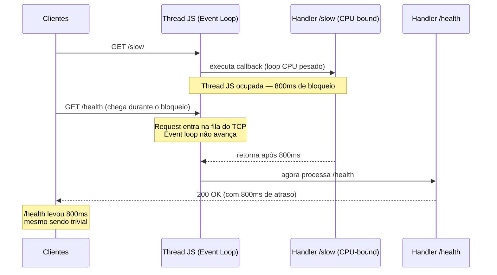

# Bloqueio do event loop: sintomas e causas

> [!abstract] TL;DR
> Sintomas de event loop bloqueado: latência geral subindo em todos os endpoints ao mesmo tempo, requests travadas em conjunto, healthcheck timeoutando. Causas canônicas: CPU-bound síncrono em handler, sync APIs (`fs.readFileSync`, `crypto.pbkdf2Sync`), regex catastróficas (ReDoS), `JSON.parse` de payload gigante, thread pool saturado. O diagnóstico começa pelo padrão: se a lentidão é **isolada por endpoint**, o problema é lógica local; se é **conjunta e correlacionada**, o event loop está bloqueado. A métrica-chave é o **event loop lag** — o atraso entre um callback ser agendado e realmente executar; em condições normais, <5ms; com bloqueio, centenas de milissegundos.

---

## Por que isso acontece em produção?

O time de backend vê: p99 de `/api/users` subindo de 20ms para 800ms. Primeiro suspeito: query no banco. DBA verifica — todas as queries dentro do normal. SRE checa DNS, rede, CPU — tudo tranquilo. Enquanto isso, `/api/products` também está lento, e o healthcheck começa a falhar intermitentemente.

Três endpoints diferentes, nenhuma dependência óbvia entre eles. O que está errado?

Resposta: um único endpoint de importação de CSV em `/api/import` estava rodando `JSON.parse` em payloads de 10MB — bloqueando a thread JavaScript por ~800ms por request. Como Node.js tem **uma única thread JS**, esse bloqueio atrasa todos os outros callbacks: outros handlers, timers, healthchecks. A lentidão correlacionada é a assinatura do bloqueio de event loop.

## O que é

"Event loop bloqueado" significa que a thread JavaScript está executando código síncrono — e não termina. Enquanto isso acontece, o loop não avança para a próxima iteração.

Node.js opera em uma única thread JavaScript. O event loop é o mecanismo que orquestra callbacks de I/O, timers, Promises e outros eventos nessa thread. Em condições normais, cada callback é executado rapidamente e a thread volta a ficar disponível para processar o próximo evento.

Quando um callback demora — seja por um loop custoso, uma regex exponencial, ou uma API síncrona de I/O — **nenhum outro callback pode executar até que aquele termine**. Requests HTTP que chegam durante esse período ficam na fila do TCP stack do OS. Timers que deveriam disparar atrasam. Healthchecks não respondem.

```
  Thread JS ocupada
  │
  │  app.get('/slow', handler)  ← bloqueando há 800ms
  │  ─────────────────────────────────────────────────
  │  GET /health    ← na fila, esperando
  │  GET /users/42  ← na fila, esperando
  │  timer (100ms)  ← na fila, esperando
  ▼
  event loop travado
```

O ponto crucial: **nenhuma** das requests em espera tem relação com a causa do bloqueio. Um handler em `/slow` atrasa `/health`, `/users/42`, e qualquer outro endpoint. Isso cria o padrão de latência correlacionada — a assinatura mais clara de um loop bloqueado.



---

## Por que importa

Sem esse modelo mental, o debugging de "backend lento" pode durar horas na direção errada.

Quando a latência sobe em um único endpoint, a intuição aponta para aquele handler — e está correta. Mas quando **todos os endpoints ficam lentos ao mesmo tempo**, a intuição falha: parece problema de infraestrutura (rede, banco, DNS), quando o culpado é um único handler em outro endpoint bloqueando a thread inteira.

O padrão real em produção é em **ondas**: latência normal → pico em todos os endpoints → volta ao normal → novo pico. Cada pico corresponde a uma requisição que acertou o caminho lento. Com tráfego alto, os picos se sobrepõem e a latência parece cronicamente alta.

Reconhecer esse padrão antes de abrir o painel do banco de dados economiza tempo. A pergunta-chave ao investigar: "a lentidão é isolada (um endpoint) ou conjunta (todos simultaneamente)?"

---

## Como funciona — sintomas detalhados

### Latência conjunta (não isolada)

O sintoma mais característico: `p99` e `p95` de **todos** os endpoints sobem ao mesmo tempo. Se o monitoramento mostra `/api/users`, `/api/products` e `/api/health` todos com latência elevada na mesma janela de tempo, o event loop é o suspeito principal.

Latência isolada por endpoint → problema naquele handler (query lenta, lógica ruim, dependência externa). Latência conjunta → event loop bloqueado.

### Healthcheck falhando

`GET /health` é o endpoint mais simples — retorna `200 OK` com um JSON mínimo. Se ele começa a timeout sob carga, a causa quase nunca é o próprio handler de health. É o event loop ocupado com outro callback.

Load balancers e orquestradores como Kubernetes interpretam healthcheck timeout como instância doente e iniciam reinicializações. O resultado prático: o container reinicia, o problema some momentaneamente, volta com o tráfego, e o ciclo se repete — sem nenhum log de erro óbvio.

### Conexões TCP sendo encerradas

O OS mantém conexões TCP abertas enquanto há dados sendo trocados dentro do timeout configurado. Quando o Node não responde porque o event loop está ocupado, conexões idle atingem o timeout e são encerradas pelo cliente ou pelo SO.

Em logs de servidor, isso aparece como `ECONNRESET` ou `socket hang up` no lado do cliente — que podem ser erroneamente atribuídos a problemas de rede.

### Event loop lag disparando

Node.js expõe métricas de event loop lag via `perf_hooks` e ferramentas como Clinic.js ou `node --prof`. Lag é o atraso entre o momento em que um callback é agendado e o momento em que realmente executa.

Em condições normais: lag de 0-5ms. Com bloqueio: lag de centenas de milissegundos ou segundos. Essa métrica é o sinal mais direto de que a thread JS está ocupada.

```javascript
const { monitorEventLoopDelay } = require('perf_hooks');

const h = monitorEventLoopDelay({ resolution: 20 });
h.enable();

setInterval(() => {
  console.log('p99 lag:', h.percentile(99) / 1e6, 'ms');
}, 5000);
```

---

## Causas canônicas

### 1. CPU-bound em handler

O caso mais direto: um loop custoso ou algoritmo de alta complexidade executando na thread JS dentro de um handler HTTP.

```javascript
app.get('/slow', (req, res) => {
  // Loop de 1 bilhão de iterações — bloqueia por vários segundos
  let sum = 0;
  for (let i = 0; i < 1e9; i++) sum += i;
  res.json({ sum });
});

app.get('/health', (req, res) => {
  // Este handler nunca responde enquanto /slow estiver executando
  res.json({ status: 'ok' });
});
```

Exemplos reais: ordenação de arrays grandes sem paginação, cálculos de hash em JavaScript puro, processamento de CSV linha a linha em memória, geração de relatórios sem streaming.

A solução estrutural é mover o trabalho para um Worker Thread (galho 2) ou particionar com `setImmediate` para ceder o loop entre chunks.

### 2. Sync APIs

Node.js expõe versões síncronas de várias APIs que são absolutamente corretas em scripts de linha de comando ou no startup da aplicação, mas fatais em handlers HTTP.

```javascript
// ❌ Em handler HTTP — bloqueia a thread inteira
app.get('/config', (req, res) => {
  const data = fs.readFileSync('./config.json', 'utf8');  // bloqueia
  res.json(JSON.parse(data));
});

// ❌ Igualmente problemático
app.post('/signup', async (req, res) => {
  const hash = crypto.pbkdf2Sync(            // bloqueia por ~100ms
    req.body.password, salt, 100000, 64, 'sha512'
  );
  // ...
});
```

As sync APIs que mais aparecem em incidents:

| API síncrona | Assíncrona correta |
|---|---|
| `fs.readFileSync` | `fs.promises.readFile` |
| `fs.writeFileSync` | `fs.promises.writeFile` |
| `crypto.pbkdf2Sync` | `crypto.pbkdf2` (callback) |
| `crypto.randomBytesSync` | `crypto.randomBytes` |
| `zlib.deflateSync` | `zlib.deflate` |
| `child_process.execSync` | `child_process.exec` |

A regra: no startup (`server.js`, carregamento de config), sync é aceitável. Em qualquer handler ou middleware, nunca.

**Particionamento com `setImmediate`:** quando o trabalho CPU-bound é inevitavelmente síncrono e não pode ir para Worker Thread (ex: migração legada), é possível ceder o loop entre chunks usando `setImmediate`. Cada chunk executa em uma iteração do loop, permitindo que outros eventos sejam processados entre eles:

```javascript
// Processar 10.000 itens sem bloquear por mais de ~5ms por vez
async function processarEmChunks(itens, tamanhoBatch = 500) {
  for (let i = 0; i < itens.length; i += tamanhoBatch) {
    const batch = itens.slice(i, i + tamanhoBatch);
    batch.forEach(processarItem);
    await new Promise(resolve => setImmediate(resolve)); // cede o loop
  }
}
```

O custo: o tempo total aumenta (cada `setImmediate` introduz ~1ms de overhead). O benefício: outros callbacks executam entre os batches, mantendo o healthcheck e outros handlers responsivos.

### 3. Regex catastrófica (ReDoS)

ReDoS — *Regular Expression Denial of Service* — é o bloqueio mais perigoso porque vem de entrada de usuário. Um padrão de regex vulnerável, quando confrontado com input especialmente construído, pode levar **minutos** para retornar `false`.

O mecanismo é o **backtracking catastrófico**: o engine de regex tenta um caminho de casamento, falha, volta ao ponto de bifurcação, tenta outro caminho, falha de novo, e assim por diante. Com quantificadores aninhados, o número de caminhos cresce exponencialmente com o tamanho da string.

```javascript
// ❌ Padrão vulnerável — quantificadores aninhados
const vulnerable = /^(a+)+$/;

// Com string de 25 'a' seguidos de 'b', pode levar segundos:
vulnerable.test('aaaaaaaaaaaaaaaaaaaaaaaab'); // ⚠️ bloqueia

// ❌ Outro padrão clássico vulnerável
const alsoVulnerable = /(\/.+)+$/;
// Ataque: string de 50 '/' seguidos de '\n'
```

O caso real mais conhecido é o do `moment.js`: o padrão `/D[oD]?(\[[^\[\]]*\]|\s+)+MMMM?/` com uma string de 31 espaços causava **22 segundos de bloqueio**. A correção foi remover um único `+`.

Padrões que indicam vulnerabilidade:
- Quantificadores dentro de quantificadores: `(a+)+`, `(a*)*`
- Alternativas sobrepostas dentro de quantificador: `(a|aa)+`
- Backreferences com quantificadores: `(a.*)\1+`

Mitigações:
- Usar `safe-regex` ou `vuln-regex-detector` no CI para detectar padrões vulneráveis
- Preferir `String.prototype.indexOf` ou `includes` para correspondências simples
- Usar `node-re2` (Google's RE2 engine) — garantia de tempo linear, sem backtracking

```javascript
// ✅ Usando RE2 — tempo linear garantido
const RE2 = require('re2');
const safe = new RE2('^(a+)+$');
safe.test('aaaaaaaaaaaaaaaaaaaaaaaab'); // rápido, sempre
```

### 4. `JSON.parse` de payload gigante

`JSON.parse` é síncrono e O(n) no tamanho do input. Para payloads pequenos, o custo é desprezível. Para payloads grandes, pode bloquear por centenas de milissegundos ou segundos.

```javascript
// Construindo um objeto profundamente aninhado (~2^21 nós)
let obj = { a: 1 };
for (let i = 0; i < 20; i++) {
  obj = { obj1: obj, obj2: obj };
}

const jsonStr = JSON.stringify(obj); // ~0.7s de bloqueio
JSON.parse(jsonStr);                 // ~1.3s de bloqueio
```

O cenário de produção mais comum: APIs que aceitam payloads JSON arbitrariamente grandes sem validação de tamanho no middleware. Um cliente (ou atacante) envia um body de 50MB; o Express faz `JSON.parse` e a thread para por segundos.

Mitigações:
- Limitar o tamanho do body no middleware: `express.json({ limit: '1mb' })`
- Para payloads grandes que são legítimos (import de dados, batch), usar `JSONStream` ou `bfj` para parsing assíncrono via stream
- Combinar com streaming do galho 3 da trilha

```javascript
// ✅ Limite explícito de body size
app.use(express.json({ limit: '512kb' }));

// ✅ Para payloads grandes legítimos — streaming
const JSONStream = require('JSONStream');

app.post('/import', (req, res) => {
  const parser = JSONStream.parse('*');
  req.pipe(parser);
  parser.on('data', (item) => processItem(item));
  parser.on('end', () => res.json({ ok: true }));
});
```

### 5. Thread pool saturado

Este é o caso mais sutil porque **o event loop em si não está bloqueado** — mas o comportamento externo parece idêntico.

O thread pool de libuv tem 4 threads por padrão (`UV_THREADPOOL_SIZE=4`). Operações que usam o pool: `fs.*` async, `crypto.*` async, `dns.lookup`, e operações de compressão. Quando mais de 4 dessas operações rodam em paralelo, as extras ficam em fila esperando uma thread livre.

```javascript
// Simulando saturação do pool (pool default = 4 threads)
// Fazendo 8 leituras simultâneas de arquivos grandes

async function handleRequest(req, res) {
  const files = await Promise.all([
    fs.promises.readFile('file1.dat'),  // thread 1
    fs.promises.readFile('file2.dat'),  // thread 2
    fs.promises.readFile('file3.dat'),  // thread 3
    fs.promises.readFile('file4.dat'),  // thread 4
    fs.promises.readFile('file5.dat'),  // ⏳ esperando
    fs.promises.readFile('file6.dat'),  // ⏳ esperando
    fs.promises.readFile('file7.dat'),  // ⏳ esperando
    fs.promises.readFile('file8.dat'),  // ⏳ esperando
  ]);
  res.send('done');
}
```

O evento loop não está travado — outros callbacks JS executam normalmente. Mas as 4 últimas `readFile` só começam quando uma thread livre. Requisições que dependem dessas operações ficam pendentes, e o efeito externo é indistinguível de um loop bloqueado: requests parecem travadas.

Mitigações:
- Aumentar `UV_THREADPOOL_SIZE` no ambiente: `UV_THREADPOOL_SIZE=16 node server.js`
- Limitar concorrência de operações de pool com filas (pacote `p-limit`)
- Para crypto pesado, considerar Worker Threads dedicados

```javascript
// ✅ Limitando concorrência de operações de pool
const pLimit = require('p-limit');
const limit = pLimit(3); // max 3 simultâneas

const results = await Promise.all(
  files.map(f => limit(() => fs.promises.readFile(f)))
);
```

---

## Como reproduzir

Script de demonstração usando `autocannon` para medir o impacto de um bloqueio real:

```javascript
// server-demo.js
const express = require('express');
const app = express();

// Endpoint normal — deve responder em <5ms
app.get('/health', (req, res) => {
  res.json({ status: 'ok', ts: Date.now() });
});

// Endpoint bloqueante — bloqueia a thread por ~500ms
app.get('/heavy', (req, res) => {
  const start = Date.now();
  // Simulando trabalho CPU-bound
  let x = 0;
  while (Date.now() - start < 500) {
    x += Math.random();
  }
  res.json({ x });
});

app.listen(3000);
```

```bash
# Terminal 1 — monitorar /health sob carga em /heavy
npx autocannon -c 20 -d 30 http://localhost:3000/heavy &
npx autocannon -c 5 -d 30 http://localhost:3000/health
```

O resultado: `/health` — que deveria responder em <5ms — começa a reportar p99 de 400-600ms. Toda a latência vem do `/heavy` bloqueando a thread compartilhada.

Para comparação, adicionar monitoramento de event loop lag ao mesmo servidor revela o problema em números:

```javascript
const { monitorEventLoopDelay } = require('perf_hooks');
const h = monitorEventLoopDelay({ resolution: 20 });
h.enable();

setInterval(() => {
  console.log(`Event loop lag p99: ${(h.percentile(99) / 1e6).toFixed(1)}ms`);
  h.reset();
}, 2000);
// Com /heavy sob carga: lag p99 > 450ms
// Sem /heavy: lag p99 < 1ms
```

Essa métrica confirma o diagnóstico: se o lag sobe enquanto a CPU do processo também sobe (visible em `top` ou dashboards), o trabalho está na thread JS. Se o lag sobe mas a CPU está normal, o pool está saturado ou há I/O pendente de kernel.

---

## Casos práticos

### Cenário 1 — Importação de CSV derruba latência de todos os endpoints

Uma API de e-commerce recebia uploads de catálogo de produtos. O handler deserializava o JSON completo com `JSON.parse`, processava cada item em memória e salvava no banco. Com payloads de 5MB (~2000 produtos), `JSON.parse` bloqueava a thread por ~300ms por request.

Com 10 importações concorrentes, o event loop ficava efetivamente bloqueado de forma contínua. Todos os outros endpoints — incluindo healthchecks — respondiam com latência de segundos. O Kubernetes interpretou os healthchecks como falha e reiniciou os pods, o que não resolveu nada.

O diagnóstico correto veio ao correlacionar: "quando as métricas de `/api/import` disparam, a latência de `/api/products` e `/api/health` também sobe". A equipe estava investigando os endpoints "lentos" — que não tinham nenhum bug.

**Solução:** limite de `1mb` no `express.json()` + reprocessamento via `JSONStream` para grandes imports + fila de jobs assíncronos.

### Cenário 2 — `crypto.pbkdf2Sync` em endpoint de login causa travamento sob pico

Em um sistema de autenticação, o endpoint `/api/login` usava `crypto.pbkdf2Sync` com 100.000 iterações para verificar senhas. Com tempo de ~120ms por verificação, operação correta de segurança.

Com uma campanha de marketing que trouxe 50 logins simultâneos em 5 segundos, `pbkdf2Sync` bloqueou a thread JavaScript em cadeia: 50 chamadas × 120ms = 6 segundos de bloqueio contínuo. O site inteiro parou.

```javascript
// ❌ pbkdf2Sync bloqueia a thread — 120ms × concorrência
const hash = crypto.pbkdf2Sync(password, salt, 100000, 64, 'sha512');

// ✅ pbkdf2 usa o thread pool — não bloqueia a thread JS
const hash = await new Promise((resolve, reject) =>
  crypto.pbkdf2(password, salt, 100000, 64, 'sha512',
    (err, key) => err ? reject(err) : resolve(key))
);
// Atenção: com muitos logins simultâneos, o pool (4 threads default)
// ainda pode saturar — aumentar UV_THREADPOOL_SIZE=16 ou usar bcrypt
```

## Armadilhas comuns

> [!warning] Regex em entrada de usuário sem validação é vetor de ReDoS
> Qualquer campo de formulário usado com `.test()`, `.match()`, ou construtor `RegExp` com padrões vulneráveis pode bloquear a thread por minutos com input especialmente construído. Quantificadores aninhados (`(a+)+`, `(a|aa)+`) são o padrão mais perigoso.
>
> ```javascript
> // ❌ Padrão vulnerável — 25 'a' + 'b' pode levar segundos
> /^(a+)+$/.test('aaaaaaaaaaaaaaaaaaaaaaaab');
> // ✅ Usar validator.js (padrões seguros) ou limitar tamanho antes de testar
> ```
>
> Use `safe-regex` no CI para detectar padrões vulneráveis, ou substitua por `node-re2` (Google RE2 — tempo linear garantido).

> [!warning] `fs.readFileSync` no startup é OK; em handler, é fatal — não copiar o padrão
> `fs.readFileSync` antes de `app.listen` bloqueia uma vez, sem requests para atrasar. Em um handler HTTP, bloqueia a thread para cada request de todos os clientes simultâneos.
>
> ```javascript
> // ✅ Startup — aceitável
> const config = JSON.parse(fs.readFileSync('./config.json', 'utf8'));
> // ❌ Handler — bloqueia todos os clientes por cada leitura
> app.get('/settings', (req, res) => {
>   const s = fs.readFileSync('./settings.json'); // nunca em handler
> });
> ```

> [!warning] Middleware de logging que serializa o body inteiro bloqueia antes do handler executar
> Logar `JSON.stringify(req.body)` em um middleware global serializa o payload completo de cada request na thread JS. Com payloads de 50MB, o bloqueio ocorre antes que o handler principal sequer comece.
>
> Solução: logar apenas metadados (`content-length`, campos específicos, truncar strings acima de N bytes). Nunca serializar o corpo completo em middleware síncrono.

> [!warning] `child_process.execSync` em handlers bloqueia a thread pelo tempo de execução do processo filho
> Integrações com ferramentas externas (ImageMagick, ffmpeg, scripts shell) são tentadoras de implementar com `execSync` pela simplicidade. O problema: a thread JS espera o processo filho terminar — qualquer outra request espera junto.
>
> ```javascript
> // ❌ Bloqueia a thread pelo tempo do convert (pode ser vários segundos)
> app.post('/thumbnail', (req, res) => {
>   child_process.execSync(`convert ${inputPath} -resize 200x200 ${outputPath}`);
>   res.json({ path: outputPath });
> });
>
> // ✅ Versão assíncrona — thread JS fica livre durante o processo
> const execAsync = require('util').promisify(require('child_process').exec);
> app.post('/thumbnail', async (req, res) => {
>   await execAsync(`convert ${inputPath} -resize 200x200 ${outputPath}`);
>   res.json({ path: outputPath });
> });
> ```
>
> Atenção ao command injection: nunca interpolar `req.body` ou `req.params` diretamente em strings de comando. Use `execFile` com array de argumentos em vez de `exec` com string.

---

## Em entrevista

> [!tip] Frase pronta (EN)
> "Symptoms of a blocked event loop are surprisingly consistent: latency rises across all endpoints simultaneously, healthchecks start timing out, and TCP connections start dropping. Common causes: CPU-bound work in a handler — loops, catastrophic regex, `JSON.parse` on huge payloads — and synchronous I/O APIs like `fs.readFileSync` or `crypto.pbkdf2Sync`. Thread pool saturation is the subtler cousin: file I/O or crypto in callback mode that exceeds the default 4 threads creates a queue, so requests appear blocked even though the event loop itself is fine. The structural fix is to move heavy work to Worker Threads or to stream the data."

### Vocabulário técnico

| PT-BR | EN |
|---|---|
| Bloqueio do loop | Event loop blocking |
| Regex catastrófica | Catastrophic regex / ReDoS |
| Saturação do pool | Thread pool saturation |
| Latência conjunta | Correlated latency |
| Backtracking catastrófico | Catastrophic backtracking |
| Particionamento de tarefa | Task partitioning |
| Trabalho CPU-intensivo | CPU-bound work |

### Perguntas frequentes em entrevista

**"Por que o healthcheck falha quando outro endpoint está lento?"** Porque Node.js tem uma única thread JavaScript. Quando essa thread está executando código síncrono em um handler, nenhum outro callback — incluindo o handler do healthcheck — pode executar. O healthcheck não tem prioridade especial; ele espera na fila como qualquer outro evento.

**"Como você diagnosticaria um event loop bloqueado em produção?"** Primeiro, verificar se a latência é isolada ou conjunta. Se conjunta, medir o event loop lag com `perf_hooks` ou Clinic.js. Identificar qual endpoint ou middleware coincide temporalmente com os picos. Checar presença de sync APIs, regex com input de usuário, e tamanho de payloads.

**"Qual a diferença entre loop bloqueado e pool saturado?"** No loop bloqueado, a thread JS em si está ocupada — nenhum callback JavaScript pode executar. No pool saturado, a thread JS está livre (callbacks JS executam normalmente), mas operações que dependem do thread pool ficam em fila aguardando threads de I/O disponíveis. O sintoma externo parece similar (requests lentas), mas o diagnóstico e a solução são diferentes.

---

## O que vem a seguir

Saber identificar o bloqueio pelo padrão de latência correlacionada é o primeiro passo. O segundo é **confirmar o diagnóstico com instrumentação real**: medir o event loop lag, gerar flame graphs, e identificar qual função específica está consumindo a thread. A próxima nota, [[11 - Diagnóstico do event loop]], cobre exatamente isso — `perf_hooks`, Clinic.js, `node --prof`, e como interpretar os resultados para apontar o culpado.

## Fontes

- [Node.js Docs — Don't Block the Event Loop (and the Worker Pool)](https://nodejs.org/en/docs/guides/dont-block-the-event-loop)
- [Node.js — perf_hooks monitorEventLoopDelay](https://nodejs.org/api/perf_hooks.html#perf_hooksmonitoreventloopdelayoptions)
- [OWASP — ReDoS (Regular Expression Denial of Service)](https://owasp.org/www-community/attacks/ReDoS)

## Veja também

- [[04 - As fases do event loop]] — como o loop processa callbacks por fase; entender as fases ajuda a localizar em qual ponto o bloqueio ocorre
- [[07 - I-O assíncrono - kernel vs thread pool]] — detalhe sobre quando o kernel lida com I/O diretamente (epoll/kqueue) vs. quando usa o thread pool de libuv
- [[09 - async-await - o que é, o que não é]] — por que `async/await` não resolve bloqueio: código async ainda bloqueia se executar trabalho CPU-bound
- [[11 - Diagnóstico do event loop]] — ferramentas e técnicas para confirmar bloqueio em produção: Clinic.js, `perf_hooks`, flame graphs
- [[Node.js]] — tronco do domínio; seção Troubleshooting aponta para esta nota como referência canônica
