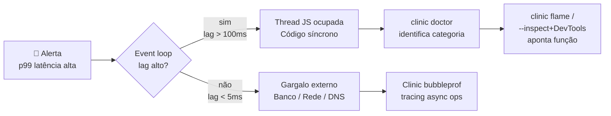

# Diagnóstico do event loop

> [!abstract] TL;DR
> Para diagnosticar o event loop em camadas: `perf_hooks.monitorEventLoopDelay` para métrica contínua exportável ao Prometheus; `process.hrtime.bigint()` para medir handlers individuais; `--inspect` + Chrome DevTools para CPU profile pontual via flame chart; `clinic.js doctor` para análise estruturada em prosa (CPU, event loop, GC, I/O). `autocannon` para reproduzir carga real. A ordem prática: métrica contínua detecta o problema → `clinic doctor` identifica a categoria → `--inspect` ou `clinic flame` aponta a função exata. Event loop lag p99 > 100ms é o limiar de alerta padrão.

---

## Como você descobre que o event loop está bloqueado?

Você recebe um alerta: p99 de latência subiu para 800ms em toda a aplicação. Você verifica banco de dados, rede, memória — tudo normal. O que falta é a métrica que diz diretamente o que a thread JavaScript está fazendo.

`perf_hooks.monitorEventLoopDelay` mede o atraso entre o momento em que um tick do loop deveria executar e o momento em que realmente executa. Se esse atraso (o **lag**) está alto, a thread está ocupada com código síncrono. Se o lag está normal mas a latência HTTP está alta, o gargalo é I/O externo — banco, rede, DNS.

Essa distinção — lag alto vs. lag normal — determina onde você olha. Sem a métrica, você pode gastar horas otimizando o banco de dados quando o problema é uma regex catastrófica num middleware.

## O que é

"Event loop lag" — ou atraso do event loop — é o tempo entre o momento em que uma iteração (tick) do loop *deveria* começar e o momento em que ela *de fato* começa.

Em condições normais, esse intervalo é de poucos microssegundos: o loop verifica filas, despacha callbacks, e volta. Quando a thread JavaScript fica ocupada com código síncrono custoso, os ticks seguintes são postergados. O lag acumula. Quanto mais sobe, mais a thread está sobrecarregada.

```
Tick esperado   Tick esperado   Tick esperado
    │               │               │
────┼───────────────┼───────────────┼──────  (ideal)
    │               │               │

    │          [código síncrono bloqueia]
────┼─────────────────────────────────────┼──  (real)
    │                                     │
   t=0                                  t=150ms  ← lag = 150ms
```



A resolução típica de monitoramento é de 10–50 ms. Valores de p99 abaixo de 50 ms são considerados saudáveis para a maioria das APIs. Acima de 100 ms o impacto em latência de usuário é perceptível. Acima de 500 ms o serviço provavelmente já está respondendo com timeouts para parte das requisições.

O mecanismo interno é simples: `monitorEventLoopDelay` agenda um timer para disparar a cada N ms (o valor de `resolution`). Se o loop estiver livre, o timer dispara próximo ao tempo planejado. Se a thread estiver ocupada, o timer dispara atrasado — esse atraso é o lag medido. A API armazena esses atrasos em um histograma de alta resolução (HdrHistogram), o que permite percentis precisos sem overhead significativo.

---

## Por que importa

Sem métrica objetiva, "a app está lenta" é uma hipótese. Com métrica, é um diagnóstico.

O event loop lag é o sinal mais direto de que a thread JavaScript está bloqueada. Outros sinais — como latência HTTP elevada — são consequências. Rastrear só a consequência leva a otimizações no lugar errado (banco de dados, rede) quando o problema real é CPU-bound no handler.

Além disso, o lag tem uma propriedade importante: afeta *todos* os endpoints ao mesmo tempo. Um endpoint lento por causa de query pesada só prejudica a si próprio. Um handler que bloqueia a thread prejudica o healthcheck, os endpoints adjacentes, e os timers internos do framework simultaneamente. Isso torna o lag um discriminador eficaz entre problema local e problema sistêmico.

Em produção, a ausência de monitoramento do lag significa descobrir o problema pela primeira vez quando o usuário reclama — e sem dados históricos para correlacionar com um deploy ou pico de carga.

Um ponto que costuma surpreender: frameworks como Express e Fastify não expõem lag do event loop por padrão. A métrica precisa ser instrumentada explicitamente. Bibliotecas como `prom-client` expõem um conjunto padrão de métricas Node.js (via `collectDefaultMetrics()`), mas mesmo assim é recomendável configurar o `resolution` e os thresholds de alerta explicitamente — os defaults costumam ser conservadores demais para produção.

---

## Como funciona

### 1. `monitorEventLoopDelay` — métrica contínua

A API `perf_hooks.monitorEventLoopDelay` cria um `IntervalHistogram` que amostra o atraso do loop em intervalos regulares. O parâmetro `resolution` define o intervalo de amostragem em milissegundos (padrão: 10 ms).

Todos os valores retornados estão em **nanossegundos**. Para converter para milissegundos, divida por `1e6`.

```typescript
import { monitorEventLoopDelay } from 'node:perf_hooks';

const h = monitorEventLoopDelay({ resolution: 50 }); // amostra a cada 50ms
h.enable();

setInterval(() => {
  const p50 = h.percentile(50) / 1e6;   // ns → ms
  const p99 = h.percentile(99) / 1e6;
  const max = h.max / 1e6;

  console.log(`event_loop_lag  p50=${p50.toFixed(2)}ms  p99=${p99.toFixed(2)}ms  max=${max.toFixed(2)}ms`);

  h.reset(); // zera o histograma para a próxima janela
}, 10_000);
```

> [!warning] `enable()` e `reset()` são obrigatórios
> Sem `enable()` o histograma não coleta nada. Sem `reset()` periódico, os percentis acumulam toda a história da aplicação e perdem significado estatístico para a janela atual.

**Integração com Prometheus** (padrão de produção):

```typescript
import { monitorEventLoopDelay } from 'node:perf_hooks';
import { Gauge, register } from 'prom-client';

const h = monitorEventLoopDelay({ resolution: 20 });
h.enable();

const lagGauge = new Gauge({
  name: 'nodejs_event_loop_lag_seconds',
  help: 'Event loop lag p99 em segundos',
  collect() {
    // chamado a cada scrape do Prometheus
    this.set(h.percentile(99) / 1e9); // ns → s
    h.reset();
  },
});

// Expose /metrics com register.metrics()
```

O gauge `nodejs_event_loop_lag_seconds` é o padrão adotado pela maioria das bibliotecas de métricas Node.js (como `prom-client`). Alertar quando p99 ultrapassa 0.1 s (100 ms) é um ponto de partida razoável.

---

### 2. `process.hrtime.bigint()` — medir handler específico

Quando já se sabe *qual* endpoint está lento, medir o tempo de execução do handler com precisão de nanosegundos:

```typescript
import type { Request, Response, NextFunction } from 'express';

// Middleware de timing por request
app.use((req: Request, res: Response, next: NextFunction) => {
  const start = process.hrtime.bigint();

  res.on('finish', () => {
    const elapsedNs = process.hrtime.bigint() - start;
    const elapsedMs = Number(elapsedNs) / 1e6;

    logger.info({
      method: req.method,
      url: req.url,
      status: res.statusCode,
      durationMs: elapsedMs.toFixed(3),
    });

    if (elapsedMs > 100) {
      logger.warn({ url: req.url, durationMs: elapsedMs }, 'handler lento detectado');
    }
  });

  next();
});
```

`process.hrtime.bigint()` retorna um `BigInt` em nanossegundos com resolução de relógio monotônico — não sofre com ajustes de NTP ou saltos do `Date.now()`. Subtração direta de dois `BigInt` dá o tempo decorrido sem risco de overflow para durações práticas.

> [!tip] Por que `bigint` e não `hrtime` clássico?
> `process.hrtime()` retorna `[seconds, nanoseconds]` como array — requer aritmética manual. `process.hrtime.bigint()` retorna um único `BigInt` e a subtração é direta. Disponível desde Node.js 10.7.

---

### 3. `--inspect` + Chrome DevTools — CPU profile

Quando as métricas indicam problema mas não apontam onde, o CPU profile identifica a função exata.

**Procedimento:**

```bash
# 1. Iniciar o processo com o inspector ligado (apenas loopback por segurança)
node --inspect=127.0.0.1:9229 app.js

# 2. No Chrome, abrir:
#    chrome://inspect
#    → clicar em "inspect" no target listado

# 3. Na aba "Profiler":
#    → clicar "Start" para iniciar gravação

# 4. Em outro terminal, aplicar carga com autocannon (ver seção 5)

# 5. Parar a gravação (Stop)
#    → analisar o flame chart gerado
```

**Lendo o flame chart:**

- Eixo horizontal = tempo total de CPU consumido.
- Eixo vertical = pilha de chamadas (topo = a função que está executando de fato).
- As barras mais largas no topo são os gargalos — funções que consomem mais CPU no hot path.
- Funções de runtime do Node.js aparecem com nome de módulo entre parênteses (ex: `(anonymous)` em closures inline).

> [!caution] `--inspect` em produção
> O protocolo Chrome DevTools expõe a memória e o código do processo. Em produção: sempre use `--inspect=127.0.0.1` (nunca `0.0.0.0`), acesse via SSH tunnel, e desative assim que o profile for coletado. Nunca deixe a porta 9229 exposta à internet.

---

### 4. `clinic.js` — análise estruturada

`clinic.js` é um toolkit da NearForm que coleta dados do processo Node.js durante load e gera um relatório HTML com diagnóstico em prosa. É o atalho mais rápido para identificar a *categoria* do problema antes de cavar mais fundo.

**Ferramentas dentro do clinic:**

| Ferramenta | O que faz |
|---|---|
| `doctor` | Diagnóstico geral: identifica se o problema é CPU, event loop, GC, ou I/O. Gera recomendações em texto. |
| `bubbleprof` | Mapeia operações assíncronas e o tempo que cada uma passa aguardando. Útil para I/O estrangulado. |
| `flame` | Flame chart interativo a partir de samples do V8 — alternativa mais rica que o DevTools para análise offline. |
| `heapprofiler` | Análise de alocação de memória — útil para memory leaks. |

**Fluxo com `doctor`:**

```bash
# 1. Instalar globalmente (ou usar npx)
npm install -g clinic

# 2. Envolver o comando de inicialização do processo com clinic doctor
clinic doctor -- node app.js

# 3. Em outro terminal, aplicar carga real
npx autocannon -c 100 -d 30 http://localhost:3000

# 4. Encerrar o processo (Ctrl+C)
#    clinic processa os dados e abre o relatório HTML automaticamente
```

O relatório classifica o problema em uma de quatro categorias e explica o raciocínio. Exemplos de diagnóstico:

- *"Your event loop is being delayed by CPU intensive operations."* → procurar código síncrono custoso.
- *"Your event loop is being delayed by I/O operations in your thread pool."* → thread pool saturado, considerar `UV_THREADPOOL_SIZE`.
- *"Your garbage collector is running too frequently."* → alocação excessiva, memory pressure.
- *"No significant bottleneck detected."* → o problema pode ser externo (banco, rede).

> [!warning] `clinic doctor` exige carga real
> Sem load aplicado enquanto o processo roda, o relatório mostra o processo ocioso e o diagnóstico é "sem bottleneck". O valor vem de rodar o doctor *simultaneamente* com autocannon ou a suite de load habitual.

---

### 5. `autocannon` — gerar carga

`autocannon` é o gerador de carga padrão do ecossistema Node.js. Reproduz carga HTTP controlada para acionar os cenários de diagnóstico acima.

```bash
# Básico: 100 conexões concorrentes, 30 segundos
npx autocannon -c 100 -d 30 http://localhost:3000

# Com tabela de latência estendida (todos os percentis)
npx autocannon -c 100 -d 30 -l http://localhost:3000/endpoint

# Simular pipelining HTTP/1.1
npx autocannon -c 50 -d 20 -p 10 http://localhost:3000

# Limitar taxa para não derrubar o serviço (100 req/s)
npx autocannon -c 10 -d 30 -R 100 http://localhost:3000
```

**Saída típica:**

```
┌─────────┬──────┬──────┬───────┬──────┬─────────┬─────────┬──────────┐
│ Stat    │ 2.5% │ 50%  │ 97.5% │ 99%  │ Avg     │ Stdev   │ Max      │
├─────────┼──────┼──────┼───────┼──────┼─────────┼─────────┼──────────┤
│ Latency │ 8 ms │ 12ms │ 31 ms │ 45ms │ 13.2 ms │ 5.47 ms │ 312.3 ms │
└─────────┴──────┴──────┴───────┴──────┴─────────┴─────────┴──────────┘

Req/Sec:  8230
Bytes/Sec: 1.4 MB
```

Os percentis de latência (p50, p99) são os números que devem ser correlacionados com o lag do event loop medido pelo `monitorEventLoopDelay`.

---

### Tabela comparativa das ferramentas

| Ferramenta | Nível | Uso principal | Quando usar |
|---|---|---|---|
| `monitorEventLoopDelay` | Produção | Métrica contínua exportada a Prometheus | Sempre — baseline permanente |
| `process.hrtime.bigint()` | Produção | Timing de handler/middleware específico | Quando sabe qual endpoint é suspeito |
| `--inspect` + DevTools | Dev / Pré-prod | CPU profile + flame chart | Quando lag alto, causa desconhecida |
| `clinic.js doctor` | Dev / Pré-prod | Diagnóstico estruturado por categoria | Primeiro passo do deep dive |
| `clinic.js flame` | Dev / Pré-prod | Flame chart offline, mais rico | Após `doctor` apontar CPU |
| `clinic.js bubbleprof` | Dev / Pré-prod | Mapa de async operations | Após `doctor` apontar I/O |
| `autocannon` | Dev / Pré-prod | Geração de carga HTTP | Sempre que rodar clinic ou --inspect |

---

## Casos práticos

### Estratégia em produção

O monitoramento contínuo deve estar sempre ativo:

```typescript
// bootstrap.ts — executado na inicialização da aplicação
import { monitorEventLoopDelay } from 'node:perf_hooks';
import { Gauge } from 'prom-client';

export function initEventLoopMonitoring() {
  const h = monitorEventLoopDelay({ resolution: 20 });
  h.enable();

  // Gauge coletado a cada scrape do Prometheus
  new Gauge({
    name: 'nodejs_event_loop_lag_p99_seconds',
    help: 'Event loop lag p99 em segundos (janela de scrape)',
    collect() {
      this.set(h.percentile(99) / 1e9); // nanosegundos → segundos
      h.reset();
    },
  });

  // Alerta recomendado: p99 > 0.1 por 2 minutos consecutivos
  return h; // manter referência — sem isso o GC pode coletar o objeto
}
```

**Fluxo de resposta a incidente:**

1. **Alerta dispara** — `nodejs_event_loop_lag_p99_seconds` > 0.1 em produção por 2 min consecutivos.
2. **Correlacionar** — verificar nos gráficos se o pico coincide com deploy, spike de tráfego, ou operação batch agendada.
3. **Checar RPS e p99 de latência HTTP** — se o lag subiu mas o RPS não, a origem pode ser uma tarefa interna (cron, batch de limpeza).
4. **Reproduzir em pré-prod** — `clinic doctor -- node app.js` + `autocannon -c 100 -d 60` replicando o perfil de carga.
5. **Identificar categoria** — o relatório do `doctor` aponta CPU, event loop, GC, ou I/O.
6. **Aprofundar** — se CPU: `clinic flame` ou `--inspect` + DevTools para identificar a função exata no flame chart. Se I/O: `clinic bubbleprof` para mapear o tempo gasto em operações assíncronas pendentes.
7. **Verificar fix** — repetir autocannon com a correção aplicada e comparar p99 de lag antes/depois.

### `--inspect` em produção (quando necessário)

Usar apenas como último recurso, com cuidado:

```bash
# Via SSH tunnel — nunca expor diretamente
# Na máquina remota:
node --inspect=127.0.0.1:9229 app.js

# No laptop local:
ssh -L 9229:127.0.0.1:9229 usuario@servidor

# Abrir chrome://inspect no browser local
# A conexão passa pelo tunnel SSH — a porta 9229 nunca fica exposta
```

> [!note] Custo de `--inspect` em produção
> Habilitar o inspector tem custo mensurável em throughput — o V8 entra em modo menos otimizado para algumas otimizações especulativas que conflitam com o debugger. O custo varia por workload, mas pode ser 5–15% em aplicações CPU-intensivas. Avaliar se o impacto é aceitável antes de ligar em instância de produção com tráfego real. Uma alternativa é redirecionar parte do tráfego para uma instância isolada com inspector ligado.

### Escolhendo entre `clinic flame` e `--inspect` + DevTools

Ambos geram flame charts, mas têm características diferentes:

| Aspecto | `clinic flame` | `--inspect` + DevTools |
|---|---|---|
| Coleta de dados | Salva samples em arquivo, analisa offline | Gravação ao vivo, interativo |
| Overhead | Baixo (sampling periódico) | Médio (instrumentação V8) |
| Integração | Embutida no fluxo `clinic` | Requer processo com `--inspect` |
| Formato | HTML interativo offline | Dentro do DevTools |
| Melhor para | Análise pós-execução, compartilhar com equipe | Exploração interativa, iteração rápida |

Para a maioria dos fluxos de diagnóstico, `clinic flame` é mais prático: coleta dados durante o run com `autocannon`, gera o relatório ao encerrar o processo, e pode ser compartilhado como arquivo HTML sem precisar replicar o ambiente.

### Cenário 2 — Diagnóstico completo de regressão de performance após deploy

Um deploy na sexta-feira trouxe um pico sustentado de latência. O alerta Prometheus disparou: `nodejs_event_loop_lag_p99_seconds` > 0.3 por 10 minutos.

**Passo 1 — confirmar que é evento loop, não I/O:**
```bash
# No dashboard: lag subiu junto com a latência? Ou lag está baixo?
# Lag > 100ms → thread JS ocupada. Lag < 5ms → banco/rede.
```

**Passo 2 — reproduzir em pré-prod com clinic:**
```bash
# Replica o perfil de tráfego da sexta — ~150 conexões
clinic doctor -- node server.js &
npx autocannon -c 150 -d 60 http://localhost:3000/api/relatorio
# Encerrar o servidor → clinic gera report.html
```

**Passo 3 — ler o diagnóstico:** O relatório mostrou: `"I/O operations in your thread pool are taking too long"`. Não era CPU — era pool saturado.

**Causa identificada:** o novo endpoint `/api/relatorio` fazia 12 leituras de arquivo por request (config + templates + dados). Com 150 conexões concorrentes, o pool de 4 threads ficava permanentemente saturado.

**Solução:** cache das leituras em memória para arquivos estáticos + `UV_THREADPOOL_SIZE=16` para produção. P99 de lag voltou a <5ms.

---

## Armadilhas comuns

> [!warning] Esquecer `enable()` — histograma coletará zero amostras, silenciosamente
> `monitorEventLoopDelay()` cria o histograma mas não começa a coletar até `h.enable()` ser chamado. Sem chamada, todos os percentis retornam `0` — sem erro, sem aviso.
>
> ```typescript
> const h = monitorEventLoopDelay({ resolution: 20 });
> h.enable(); // ← obrigatório; sem isso, h.percentile(99) sempre retorna 0
> ```

> [!warning] Omitir `reset()` — p99 vira média histórica, não reflete a janela atual
> Sem `h.reset()` periódico, o histograma acumula todas as amostras desde o boot. O p99 reportado após 24h de uptime é o p99 de toda a vida da aplicação — um pico às 03h00 contamina os percentis do dia inteiro. Reset deve ocorrer a cada janela de coleta (ex: a cada scrape Prometheus ou a cada `setInterval`).

> [!warning] `--inspect` com `0.0.0.0` expõe execução de código arbitrário ao processo
> Por padrão, `node --inspect app.js` escuta em `0.0.0.0:9229` — acessível de qualquer interface de rede. O protocolo Chrome DevTools permite ler heap, variáveis, e executar código arbitrário no processo. Em produção, sempre `--inspect=127.0.0.1:9229` e acesso via SSH tunnel.

> [!warning] `clinic doctor` sem carga real produz relatório "sem bottleneck" inútil
> O `doctor` analisa o comportamento do processo *sob estresse*. Sem `autocannon` ou load equivalente rodando em paralelo, o processo está ocioso e o diagnóstico não encontra nada — silenciosamente correto sobre um estado que não é o relevante.

> [!warning] Lag baixo com latência HTTP alta indica I/O externo — não otimize o event loop
> Event loop lag mede a thread JS. Uma aplicação pode ter p99 de latência HTTP de 800ms com lag de 5ms — o tempo extra é banco de dados, rede, ou DNS. Otimizar o event loop nesse caso não resolve nada. Correlacionar lag + latência HTTP antes de decidir onde agir.

---

## Em entrevista

### Frase pronta (EN)

> "Diagnostics for event loop issues come in layers. For continuous metrics, `perf_hooks.monitorEventLoopDelay` exposes a histogram of event loop lag — typically exported to Prometheus with an alert when p99 crosses 100 milliseconds. For per-request timing, `process.hrtime.bigint()` in middleware gives nanosecond-precision measurements without the caveats of `Date.now()`. For deep dives, `node --inspect` plus Chrome DevTools gives a CPU profile and flame chart that pinpoints the blocking function. For structured analysis, `clinic.js doctor` runs your app under load and produces a prose diagnosis — CPU, event loop, GC, or I/O. And to actually generate the load, `autocannon`."

### Como estruturar a resposta

Ao ser perguntado "como você diagnosticaria um event loop lento?", estruturar em camadas:

1. **Detectar** — métrica contínua (`monitorEventLoopDelay` + Prometheus). "Sem isso em produção, você descobre o problema depois do usuário."
2. **Classificar** — `clinic doctor` com carga real diz a *categoria* do problema (CPU, GC, I/O, event loop delay isolado).
3. **Localizar** — `clinic flame` ou `--inspect` + DevTools aponta a *função* específica no flame chart.
4. **Reproduzir** — `autocannon` para gerar carga controlada em cada etapa, sem depender de tráfego real.

Uma boa resposta também menciona o que *não* fazer: não assumir que latência HTTP alta é sinônimo de event loop bloqueado (pode ser I/O externo), não rodar `--inspect` sem tunnel SSH em produção, e não confiar em `clinic doctor` sem load aplicado.

**Pergunta frequente em entrevista: "Qual a diferença entre `Date.now()` e `process.hrtime.bigint()` para medir performance?"**

`Date.now()` retorna milissegundos wall-clock — pode sofrer saltos por ajuste de NTP, resolução de ~1ms no OS. `process.hrtime.bigint()` retorna nanossegundos de relógio monotônico — nunca salta para trás, resolução de ~100ns no Linux. Para medir durações curtas (< 10ms) com precisão, `hrtime.bigint()` é obrigatório. Para timestamps de eventos (logs, auditoria), `Date.now()` é correto. A confusão mais comum: usar `Date.now()` para medir o tempo de um handler e concluir que "todos os handlers demoram 1ms" quando na verdade a resolução do relógio está mascarando variações de 0.1-0.9ms.

### Vocabulário técnico (PT-BR ↔ EN)

| PT-BR | EN |
|---|---|
| atraso do event loop | event loop lag |
| perfil de CPU | CPU profile |
| gráfico de chamas | flame chart |
| teste de carga | load test |
| histograma | histogram |
| janela de amostragem | sampling window |
| monitor de intervalo | interval histogram |
| resolução de amostragem | sampling resolution |
| relógio monotônico | monotonic clock |
| saturação do pool de threads | thread pool saturation |
| inspetor / protocolo de depuração | inspector / debug protocol |
| análise pós-execução | post-mortem analysis |
| comparar percentis antes/depois | compare p99 before/after |
| overhead de instrumentação | instrumentation overhead |
| profiling contínuo em produção | continuous profiling in production |

**Perguntas comuns:**

**"O que é um flame chart e como você lê um?"** Flame chart é a visualização de CPU profile com tempo no eixo horizontal e pilha de chamadas no eixo vertical. Cada barra representa uma função; largura = tempo de CPU consumido. Funções largas no topo da pilha são os gargalos reais. Funções estreitas em camadas inferiores são overhead de infraestrutura (V8 runtime, Node internals). O objetivo é encontrar a função de *código da aplicação* mais larga no topo — essa é onde o tempo está sendo gasto.

---

## O que vem a seguir

Identificar e localizar o bloqueio fecha o ciclo de diagnóstico — mas o galho de Runtime tem mais uma parada: um consolidado de regras práticas e cheatsheet de referência rápida. A próxima nota, [[12 - Armadilhas, regras práticas, cheatsheet]], sintetiza todos os anti-patterns do galho em forma de lista de verificação, com as regras de ouro que emergem das notas anteriores numa forma consultável rapidamente.

## Fontes

- [Node.js — perf_hooks monitorEventLoopDelay](https://nodejs.org/api/perf_hooks.html#perf_hooksmonitoreventloopdelayoptions)
- [Clinic.js — documentação oficial](https://clinicjs.org/documentation/)
- [Node.js — process.hrtime.bigint()](https://nodejs.org/api/process.html#processhrtimebigint)
- [autocannon — repositório oficial](https://github.com/mcollina/autocannon)
- [Node.js — Guia de diagnóstico oficial](https://nodejs.org/en/docs/guides/diagnostics)

## Veja também

- [[10 - Bloqueio do event loop - sintomas e causas]] — causas do bloqueio que o diagnóstico vai encontrar; contexto para interpretar o que `clinic doctor` relata.
- [[12 - Armadilhas, regras práticas, cheatsheet]] — consolidação de todos os padrões e anti-patterns do galho em forma de checklist consultável.
- [[07 - I-O assíncrono - kernel vs thread pool]] — para entender por que thread pool saturation aparece como "event loop lento" no diagnóstico mesmo sendo um problema diferente.
- [[Node.js]] — tronco: visão panorâmica de todos os galhos.

> [!note] Observability avançado
> Profiling contínuo em produção (flame graphs via `0x`, continuous profiling com Pyroscope, distributed tracing com OpenTelemetry) será coberto no Galho 5 — Observability. As ferramentas desta nota são suficientes para diagnóstico pontual e monitoramento básico.
>
> **Fronteira desta nota vs. Galho 5:**
> - Esta nota: diagnóstico pontual, métricas de event loop lag, ferramentas de profiling para desenvolvimento e pré-prod.
> - Galho 5 (Observability): profiling contínuo em produção com amostragem de baixo overhead (async-profiler, Pyroscope), distributed tracing com OpenTelemetry para correlacionar lag com traces de request, alertas avançados e SLOs baseados em event loop lag em vez de latência HTTP.
>
> A distinção prática: quando você precisa diagnosticar um incidente (agora, sob pressão), use as ferramentas desta nota. Quando você quer instrumentação permanente que detecta regressões antes do incidente, Galho 5 é o destino.
