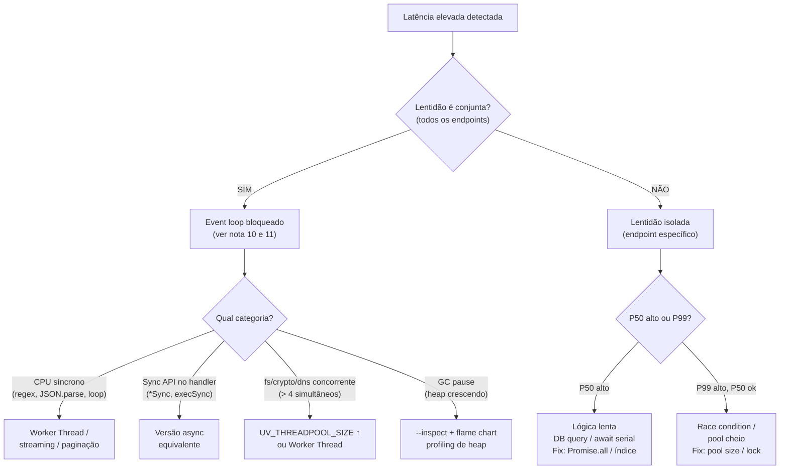

# Armadilhas, regras práticas, cheatsheet

> [!abstract] TL;DR
> Nota de fechamento da sub-trilha [[03-Dominios/Tecnologia/Node/Runtime e Event Loop/index]]. Agrega as 10 armadilhas mais críticas (com exemplo e fix), tabela de timer/fase, decision tree de "minha request está lenta", vocabulário PT→EN com 22 termos, e ponteiros para os próximos galhos. Use como referência rápida após percorrer as 11 notas anteriores. Regras de ouro: nunca use `*Sync` em handlers, nunca recorra em `nextTick`, meça event loop lag antes de otimizar, e trate latência conjunta diferente de latência isolada.

---

## O Node.js pune o que parece inocente

Você escreve `fs.readFileSync('./config.json')` no topo de um handler porque é simples e "funciona em dev". Funciona mesmo — até o primeiro deploy com 50 usuários simultâneos. Nesse momento, cada request bloqueia a thread JS lendo o arquivo, e as outras 49 esperam na fila.

Ou você usa `process.nextTick` num loop de processamento porque "é eficiente". Funciona — até entrar em recursão e o event loop parar de avançar para sempre.

Esta nota agrega os padrões que aparecem repetidamente em incidents de produção Node.js: os que parecem inofensivos em isolamento mas escalam de forma desastrosa. Use como checklist de code review, onboarding de time, ou referência rápida durante um incident.

## Top 10 armadilhas

### 1. Recursão em `process.nextTick` → starvation

`nextTickQueue` é drenada **completamente** antes de qualquer outra fase. Recursão nela impede o event loop de avançar para sempre.

```javascript
// ERRADO — loop infinito, event loop nunca avança
function loop() {
  process.nextTick(loop);
}
loop();
```

**Fix:** use `setImmediate` — cede controle ao event loop após cada iteração.

```javascript
function loop() {
  setImmediate(loop); // event loop avança entre cada chamada
}
```

---

### 2. CPU-bound síncrono em handler async → bloqueia tudo

Código síncrono pesado na thread JS congela todos os endpoints enquanto roda. Não importa quantos `await` existem no handler: o trecho síncrono bloqueia.

```javascript
// ERRADO — hash lento bloqueia a thread JS
app.post('/login', async (req, res) => {
  const hash = crypto.pbkdf2Sync(req.body.senha, salt, 100_000, 64, 'sha512');
  res.json({ ok: true });
});
```

**Fix:** use a versão async (`crypto.pbkdf2`) ou mova para Worker Thread (galho 2).

```javascript
const hash = await pbkdf2(req.body.senha, salt, 100_000, 64, 'sha512');
```

---

### 3. `Promise.all` em lista grande sem limite → satura recursos

`Promise.all` dispara todas as promises ao mesmo tempo. Com listas grandes, isso abre centenas de conexões, esgota o thread pool ou sobrecarrega serviços externos.

```javascript
// ERRADO — dispara 500 queries ao mesmo tempo
const resultados = await Promise.all(ids.map(id => buscarUsuario(id)));
```

**Fix:** use `p-limit` ou processe em batches com um loop serial controlado.

```javascript
import pLimit from 'p-limit';
const limit = pLimit(10); // máximo 10 concorrentes
const resultados = await Promise.all(ids.map(id => limit(() => buscarUsuario(id))));
```

---

### 4. `await` sequencial onde paralelo cabe → lentidão escondida

`await` serial executa uma operação de cada vez. Se as operações são independentes, o tempo total é a soma dos tempos individuais — poderia ser o máximo.

```javascript
// ERRADO — espera A terminar para começar B
const usuario = await buscarUsuario(id);
const pedidos = await buscarPedidos(id);
```

**Fix:** `Promise.all` quando as operações são independentes entre si.

```javascript
const [usuario, pedidos] = await Promise.all([buscarUsuario(id), buscarPedidos(id)]);
```

---

### 5. `setInterval` reentrante → callbacks empilhados

Se o callback demora mais que o intervalo, o próximo disparo começa antes do anterior terminar. Os callbacks se acumulam e causam drift progressivo.

```javascript
// ERRADO — se relatorio() demora >1s, os callbacks se acumulam
setInterval(() => gerarRelatorio(), 1000);
```

**Fix:** `setTimeout` recursivo — o próximo intervalo só começa após o callback terminar.

```javascript
async function agendarRelatorio() {
  await gerarRelatorio();
  setTimeout(agendarRelatorio, 1000); // próximo começa após terminar
}
agendarRelatorio();
```

---

### 6. `unhandledRejection` não tratado → processo termina silencioso

A partir do Node 15+, promises rejeitadas sem handler encerram o processo por padrão. Sem handler global, o encerramento pode acontecer sem log claro.

```javascript
// ERRADO — rejeição silenciosa que mata o processo em Node 15+
async function tarefa() {
  throw new Error('falhou');
}
tarefa(); // sem await, sem .catch()
```

**Fix:** handler global que loga antes de encerrar.

```javascript
process.on('unhandledRejection', (reason, promise) => {
  console.error('Promise não tratada:', reason);
  process.exit(1);
});
```

---

### 7. Sync APIs em handler de produção → trava o event loop

`fs.readFileSync`, `crypto.pbkdf2Sync`, `JSON.parse` de payloads grandes — qualquer operação síncrona demorada trava a thread JS para todas as requisições ativas.

```javascript
// ERRADO — bloqueia o event loop enquanto o arquivo é lido
app.get('/config', (req, res) => {
  const cfg = fs.readFileSync('./config.json', 'utf8'); // trava tudo
  res.json(JSON.parse(cfg));
});
```

**Fix:** versão async + streaming para payloads grandes.

```javascript
app.get('/config', async (req, res) => {
  const cfg = await fs.promises.readFile('./config.json', 'utf8');
  res.json(JSON.parse(cfg));
});
```

---

### 8. Thread pool exausto por I/O ou crypto concorrentes → timeouts

O thread pool do libuv tem apenas 4 threads por padrão. File I/O, `dns.lookup`, crypto e zlib concorrentes disputam essas 4 vagas. Quando todas estão ocupadas, novos pedidos esperam na fila — causando timeouts sem erro óbvio nos logs.

```javascript
// ERRADO — 20 hashes concorrentes travam o pool (apenas 4 threads)
const hashes = await Promise.all(
  senhas.map(s => util.promisify(crypto.pbkdf2)(s, salt, 100_000, 64, 'sha512'))
);
```

**Fix:** aumentar `UV_THREADPOOL_SIZE` ou mover para Worker Thread.

```bash
UV_THREADPOOL_SIZE=16 node server.js
```

---

### 9. Regex catastrófica em input do usuário → ReDoS

Certas expressões regulares têm backtracking exponencial quando o input não faz match. Um atacante pode travar a thread JS com um payload cuidadosamente construído.

```javascript
// ERRADO — regex com backtracking catastrófico em input não controlado
const RE = /^(a+)+$/;
RE.test('aaaaaaaaaaaaaaaaaaaaaaaab'); // pode levar segundos ou minutos
```

**Fix:** validar com biblioteca (zod/joi), limitar tamanho do input, usar regex sem backtracking excessivo.

```javascript
import { z } from 'zod';
const schema = z.string().max(100).regex(/^[a-z]+$/);
schema.parse(req.body.campo); // valida e lança se inválido
```

---

### 10. Timer com closure pesado nunca limpo → memory leak

Closures capturadas por timers mantêm objetos no heap vivos. Se `clearTimeout`/`clearInterval` não for chamado no cleanup, os objetos nunca são coletados pelo GC.

```javascript
// ERRADO — timer criado sem limpar; closure prende objeto grande
function iniciar(dados) {
  const intervalo = setInterval(() => processar(dados), 5000);
  // intervalo nunca é limpo; dados fica preso no heap
}
```

**Fix:** guardar referência e limpar no cleanup (evento de desconexão, shutdown, etc.).

```javascript
function iniciar(dados) {
  const intervalo = setInterval(() => processar(dados), 5000);
  return () => clearInterval(intervalo); // retorna função de cleanup
}
```

---

## Cheatsheet — timer e fase

| API | Tipo | Fase do event loop | Quando usar |
|---|---|---|---|
| `process.nextTick` | microtask (nextTickQueue) | entre fases (prioridade máxima) | deferir mínimo; prioridade acima de Promises; evitar recursão |
| `queueMicrotask` | microtask (microtask queue) | entre fases | padrão portável (web/Bun/Deno); após código síncrono |
| `Promise.then` | microtask (microtask queue) | entre fases | após uma promise resolver; mesmo nível que queueMicrotask |
| `setTimeout(fn, ms)` | macrotask | timers | delay com tempo mínimo; ms=0 efetivamente 1ms |
| `setInterval(fn, ms)` | macrotask | timers | repetição periódica; preferir setTimeout recursivo em produção |
| `setImmediate(fn)` | macrotask | check | após I/O da iteração atual; antes do próximo timer |

**Ordem de prioridade em cada ponto de drenagem:**

```
nextTickQueue (toda) → microtask queue (toda) → próxima fase do event loop
```

**Sequência das fases:**

```
timers → pending callbacks → idle/prepare → poll → check → close callbacks → (repete)
```

---

## Decision tree — "minha request está lenta"



---

## Vocabulário PT→EN

Compilado de toda a sub-trilha. Mínimo necessário para entrevistas internacionais em inglês.

| Termo PT | Termo EN | Nota de contexto |
|---|---|---|
| loop de eventos | event loop | mecanismo central do Node; ciclo de fases do libuv |
| thread única | single thread | única thread que executa código JS |
| I/O não-bloqueante | non-blocking I/O | chamadas retornam imediatamente; callback notifica quando pronto |
| microtarefa | microtask | executa entre fases; nextTick, queueMicrotask, Promise.then |
| macrotarefa | macrotask | agendada numa fase; setTimeout, setInterval, setImmediate |
| esgotamento de fila | queue starvation | recursão em nextTick impede avanço do event loop |
| pool de threads | thread pool | 4 threads libuv para fs, crypto, dns.lookup, zlib |
| async no kernel | kernel async I/O | epoll/kqueue/IOCP — rede não consome threads |
| epoll / kqueue / IOCP | epoll / kqueue / IOCP | mecanismos de polling assíncrono de I/O no Linux/macOS/Windows |
| aguardar | await | pausa a função async; libera a thread JS durante a espera |
| promise liquidada | Promise settled | estado final: fulfilled ou rejected; imutável |
| iterador assíncrono | async iterator | `for await...of`; consome streams/geradores async |
| atraso do event loop | event loop lag | atraso entre tick planejado e tick real; indica bloqueio |
| gráfico de chamas | flame chart | visualização de CPU profile; eixo X = tempo, eixo Y = call stack |
| negação de serviço por regex | ReDoS | ataque via regex com backtracking catastrófico |
| backtracking catastrófico | catastrophic backtracking | complexidade exponencial em regex com alternativas sobrepostas |
| ligado à CPU | CPU-bound | workload onde o gargalo é processamento, não I/O |
| ligado a I/O | I/O-bound | workload onde o gargalo é disco/rede/banco |
| fila de callbacks | callback queue | fila geral de macrotasks pendentes |
| desvio de timer | timer drift | acúmulo de atraso progressivo em setInterval reentrante |
| coletor de lixo | garbage collector (GC) | V8 gerencia heap; pausa a thread em certas fases |
| histograma | histogram | estrutura de dados para percentis de latência (HdrHistogram) |

---

## Casos práticos

### Cenário 1 — Code review bloqueou deploy: 3 armadilhas no mesmo handler

Durante code review de um feature de geração de relatórios, 3 problemas foram identificados no mesmo handler antes do merge:

```javascript
// ❌ Handler original — 3 armadilhas em 15 linhas
app.post('/relatorio', async (req, res) => {
  const config = fs.readFileSync('./config.json'); // armadilha 7: sync API
  const dados = await buscarDados(req.body.filtros);

  // armadilha 4: await serial em operações independentes
  const usuarios = await buscarUsuarios(dados.ids);
  const produtos = await buscarProdutos(dados.skus);

  // armadilha 3: Promise.all sem limite em lista potencialmente grande
  const detalhes = await Promise.all(
    dados.ids.map(id => buscarDetalheCompleto(id)) // pode ser 500 ids
  );
  res.json({ config, usuarios, produtos, detalhes });
});

// ✅ Handler corrigido
import pLimit from 'p-limit';
const limit = pLimit(10);

// Carregar config uma vez no startup, não por request
const config = JSON.parse(await fs.promises.readFile('./config.json', 'utf8'));

app.post('/relatorio', async (req, res) => {
  const dados = await buscarDados(req.body.filtros);

  // Paralelo onde seguro
  const [usuarios, produtos] = await Promise.all([
    buscarUsuarios(dados.ids),
    buscarProdutos(dados.skus),
  ]);

  // Concorrência limitada para lista grande
  const detalhes = await Promise.all(
    dados.ids.map(id => limit(() => buscarDetalheCompleto(id)))
  );
  res.json({ config, usuarios, produtos, detalhes });
});
```

### Cenário 2 — Cheatsheet de timer usado em onboarding de dev júnior

Em um onboarding, um dev júnior perguntou: "quando devo usar `setImmediate` em vez de `setTimeout(fn, 0)`?". A resposta veio pela tabela de timer/fase desta nota:

- Dentro de callback de I/O: `setImmediate` é determinístico — dispara na fase `check` da iteração atual.
- `setTimeout(fn, 0)` depende da fase `timers` — pode ou não ser antes do `setImmediate` dependendo do contexto.
- Para yield do event loop (ceder entre chunks de processamento): `setImmediate` é o padrão seguro.
- Para delay mínimo garantido (N ms): `setTimeout`.

Três semanas depois, o mesmo dev identificou um `setInterval` reentrante num serviço de relatórios e aplicou o fix do item 5 da lista de armadilhas.

## Armadilhas comuns

> [!warning] O mais silencioso: closures em timers não limpos → memory leak progressivo
> Timers que capturam closures com objetos grandes (arrays, buffers, conexões) e nunca são limpos mantêm esses objetos vivos no heap indefinidamente. O GC não consegue coletar porque a referência existe no closure. Sintoma: RSS do processo crescendo lentamente sem `OutOfMemory` imediato.
>
> ```javascript
> // ❌ closure captura `dados` (pode ser MB); intervalo nunca é limpo
> setInterval(() => processar(dados), 1000);
> // ✅ retornar cleanup — obrigatório em módulos com lifecycle
> const id = setInterval(() => processar(dados), 1000);
> return () => clearInterval(id);
> ```

> [!warning] `process.nextTick` recursivo → starvation completo do event loop
> `nextTickQueue` drena **inteira** antes de qualquer fase do loop avançar. Recursão nela é um loop infinito dentro do próprio mecanismo de drenagem — o loop para de processar I/O, timers, e qualquer outro evento.
>
> ```javascript
> // ❌ Event loop congela
> function loop() { process.nextTick(loop); }
> loop();
> // ✅ setImmediate cede uma iteração do loop por chamada
> function loop() { setImmediate(loop); }
> ```

> [!warning] `await` serial é O(n) — use `Promise.all` para operações independentes
> Cada `await` pausa a função até a promise resolver antes de iniciar a próxima. Para N operações independentes com duração D, o tempo total é N×D. `Promise.all` inicia todas ao mesmo tempo; o tempo total é max(D₁, D₂, ..., Dₙ).
>
> O anti-pattern é especialmente perigoso quando mascarado por um `for...of` — parece explícito mas na prática é sequencial: `for (const id of ids) await buscar(id)`.

## Como explicar em inglês

> [!tip] Frase pronta (EN)
> "Node.js has one JavaScript thread, so any synchronous code — CPU-bound work, sync I/O APIs, catastrophic regex — blocks every other request while it runs. The key distinction to make in an incident is: correlated latency across all endpoints points to an event loop block; isolated latency on one endpoint points to a problem in that handler specifically. The rule of thumb: never use `*Sync` APIs in request handlers, never recurse in `process.nextTick`, and always measure event loop lag before assuming a performance problem is in the database."

### Vocabulário PT↔EN

| PT-BR | EN |
|---|---|
| loop de eventos | event loop |
| microtarefa | microtask |
| macrotarefa | macrotask |
| fila de nextTick | nextTick queue |
| pool de threads | thread pool |
| bloqueio do loop | event loop blocking |
| starvation de fila | queue starvation |
| desvio de timer | timer drift |
| latência conjunta | correlated latency |
| ponteiro de limpeza | cleanup reference |

## O que vem a seguir

Esta nota fecha o galho de Runtime e Event Loop. Os próximos galhos constroem sobre o que você aprendeu aqui:

- **Galho 2 — Paralelismo**: quando o código síncronamente pesado não tem alternativa async — [[Worker Threads]], cluster, child_process. A solução estrutural para CPU-bound.
- **Galho 3 — Streams**: quando o dado é grande demais para caber em memória. A solução estrutural para `JSON.parse` de payloads grandes e I/O de alto volume.
- **Galho 5 — Observability**: instrumentação permanente em produção — profiling contínuo, alertas de event loop lag, distributed tracing com OpenTelemetry.

## Fontes

- [Node.js Docs — Don't Block the Event Loop](https://nodejs.org/en/docs/guides/dont-block-the-event-loop)
- [p-limit — npm](https://www.npmjs.com/package/p-limit)
- [Clinic.js — documentação](https://clinicjs.org/documentation/)
- [OWASP — ReDoS](https://owasp.org/www-community/attacks/ReDoS)

## Próximos galhos

### Galho 2 — Paralelismo (quando o bloqueio é estrutural)

Quando o problema é CPU-bound e não pode ser resolvido com async/await: **Worker Threads**, cluster e child_process. Worker Threads permite JS verdadeiramente paralelo em múltiplas threads dentro do mesmo processo.

- Acesse quando: CPU-bound inevitável, processamento de imagem, criptografia pesada, parsing de arquivos grandes.
- Wikilink: `[[Paralelismo]]` (a criar)

### Galho 3 — Streams (quando o dado é grande)

Para processar dados grandes sem carregar tudo na memória e sem bloquear: **Streams Node.js**. Readable, Writable, Transform, pipeline.

- Acesse quando: upload/download de arquivos, parsing de CSV/JSON grandes, proxying de dados, compressão on-the-fly.
- Wikilink: `[[Streams]]` (a criar)

### Galho 5 — Observability (quando você precisa enxergar em produção)

Profiling, logging estruturado, métricas e tracing distribuído. `perf_hooks`, Clinic.js, Prometheus, OpenTelemetry.

- Acesse quando: latência inexplicável em produção, necessidade de alertas de event loop lag, rastreamento entre serviços.
- Wikilink: `[[Observability]]` (a criar)

---

## Regras práticas de bolso

- **Nunca use `*Sync` em handlers de servidor** — `readFileSync`, `writeFileSync`, `pbkdf2Sync` etc. Aceitável apenas no startup, antes de `app.listen`.
- **Nunca recorra em `process.nextTick`** — use `setImmediate` se precisar de yield; o `nextTickQueue` drena inteiro antes do loop avançar.
- **`Promise.all` é padrão; `await` serial é exceção** — use serial só quando uma operação depende do resultado da anterior.
- **Limite concorrência em `Promise.all` com listas grandes** — use `p-limit` ou batches; conexões ilimitadas ao banco derrubam o pool.
- **`setImmediate` > `setTimeout(fn, 0)` dentro de callbacks de I/O** — mais determinístico quanto à fase do loop.
- **`UV_THREADPOOL_SIZE` padrão é 4** — eleve antes de escalar fs/crypto concorrentes; `UV_THREADPOOL_SIZE=16` no ambiente.
- **Meça antes de otimizar** — `monitorEventLoopDelay` + percentis (P50, P99) são o ponto de partida.
- **Latência conjunta = event loop; latência isolada = handler** — essa distinção economiza horas de debugging de banco de dados que não é o problema.
- **Guarde referências de timers para limpeza** — sem `clearInterval`/`clearTimeout`, closures vazam memória indefinidamente.
- **Nunca ignore `unhandledRejection`** — Node 15+ encerra o processo; registre um handler global que loga e chama `process.exit(1)`.
- **`async` em handler Express 4 não captura erros automaticamente** — use um wrapper `asyncHandler` ou migre para Express 5 / Fastify.

---

## Veja também

- [[03-Dominios/Tecnologia/Node/Runtime e Event Loop/index]] — MOC do galho; visão geral e rotas de leitura
- [[Node.js]] — tronco: panorama completo do runtime
- [[01 - Single-thread e non-blocking I-O]] — single thread, I/O-bound vs CPU-bound
- [[02 - V8, libuv e thread pool]] — V8, libuv, bindings C++, thread pool
- [[03 - Call stack, heap e queues]] — call stack, heap, microtask queue, macrotask queue
- [[04 - As fases do event loop]] — 6 fases em detalhe: timers, poll, check, etc.
- [[05 - Microtasks - nextTick, queueMicrotask, Promise.then]] — hierarquia de microtasks e starvation
- [[06 - Macrotasks e timers - setTimeout, setInterval, setImmediate]] — macrotasks, drift, setImmediate
- [[07 - I-O assíncrono - kernel vs thread pool]] — epoll/kqueue/IOCP vs thread pool; dns.lookup
- [[08 - Promises por dentro]] — estados, executor síncrono, .then como microtask
- [[09 - async-await - o que é, o que não é]] — await não cria thread; paralelismo com Promise.all
- [[10 - Bloqueio do event loop - sintomas e causas]] — latência conjunta, ReDoS, sync APIs
- [[11 - Diagnóstico do event loop]] — perf_hooks, Clinic.js, flame chart, autocannon
