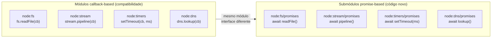

# Promise-based core APIs

> [!abstract] TL;DR
> Node.js expõe versões Promise-based dos módulos core via submódulos `node:fs/promises`, `node:stream/promises`, `node:timers/promises`, `node:readline/promises` e `node:dns/promises` — use-os sempre que escrever código async/await em vez de misturar callbacks no meio de promises. `stream/promises.pipeline()` é a forma correta de encadear streams sem vazar listeners em caso de erro; `.pipe()` manual não faz cleanup automático. O prefixo `node:` nos imports é recomendado desde Node 14.18.0 para distinguir módulos core de pacotes npm com o mesmo nome.

---

## Por que você não deveria usar `fs.readFile(cb)` em código moderno?

Você escreve `async function lerConfig()` e dentro dela chama `fs.readFile('./config.json', 'utf8', callback)`. O callback vai receber `err` e `data` — mas você está em uma função `async`. Como propaga o erro? Como retorna o dado? A resposta envolve wrapping manual com `util.promisify` ou uma `new Promise()` — código boilerplate que deveria ser desnecessário.

O Node.js resolveu isso adicionando submódulos promise-based aos módulos core. Em vez de `fs.readFile(cb)`, você usa `import { readFile } from 'node:fs/promises'` e faz `await readFile(...)` — integração direta com `try/catch` e `async/await`, sem adapters.

## O que é

O Node.js nasceu com um modelo de I/O baseado em callbacks (padrão `(err, data) => {}`). Com a popularização de `async/await` no ES2017+, usar callbacks diretamente em código moderno cria incompatibilidades de fluxo de controle, exige wrappers (`util.promisify`) e torna o tratamento de erros mais verboso.

Para resolver isso sem quebrar compatibilidade retroativa, o Node.js adicionou **submódulos promise-based** aos módulos core existentes — acessíveis como `node:fs/promises`, `node:timers/promises`, etc. Estes submódulos expõem as mesmas operações que os módulos originais, mas com uma interface baseada em `Promise` (e, em alguns casos, async generators ou `AsyncIterable`).

**Por que isso importa:**
- Evita instalar pacotes externos (`graceful-fs`, `p-timeout`, `readline-sync`) para operações que o core já cobre.
- Permite usar `try/catch` para tratamento de erros em I/O, em vez de verificar `err` em callbacks.
- Integra naturalmente com `async/await` e `for await...of`.
- `util.promisify` ainda funciona, mas é mais verboso e não suporta recursos avançados como `FileHandle`.



## Como funciona

### node:fs/promises

Disponível como `fs.promises` desde Node 10.1.0 (experimental), estável em Node 11.14.0/10.17.0; o subpath `node:fs/promises` foi adicionado em Node 14.0.0. Cobre operações de arquivo e diretório com interface promise.

**Operações principais:** `readFile`, `writeFile`, `appendFile`, `unlink`, `rename`, `mkdir`, `rm`, `stat`, `access`, `readdir`, `copyFile`, `open`.

```js
import { readFile, writeFile, mkdir, rm } from 'node:fs/promises';

// leitura com encoding (retorna string)
const content = await readFile('./config.json', 'utf8');
const config = JSON.parse(content);

// escrita atômica: escreve no temp, renomeia — evita arquivo corrompido em crash
await writeFile('./output.json', JSON.stringify(config, null, 2), 'utf8');

// criação recursiva de diretório (não lança se já existe)
await mkdir('./logs/2026/05', { recursive: true });

// remoção recursiva (equivalente a rm -rf)
await rm('./tmp', { recursive: true, force: true });
```

**FileHandle API** — para leitura/escrita granular sem carregar o arquivo inteiro na memória:

```js
import { open } from 'node:fs/promises';

const fh = await open('./data.bin', 'r');
try {
  const buf = Buffer.alloc(128);
  const { bytesRead } = await fh.read(buf, 0, 128, 0);
  console.log('bytes lidos:', bytesRead);
} finally {
  await fh.close();  // sempre fechar em finally
}
```

### node:stream/promises

Disponível desde Node 15.0.0. Dois utilitários críticos: `pipeline` e `finished`.

**`pipeline(...streams)`** — encadeia streams com cleanup automático. Se qualquer stream emitir `'error'`, todos os outros são destruídos e a promise rejeita. O `.pipe()` manual não faz isso: um erro no meio da cadeia pode deixar streams anteriores rodando indefinidamente, vazando memória.

```js
import { createReadStream, createWriteStream } from 'node:fs';
import { createGzip } from 'node:zlib';
import { pipeline } from 'node:stream/promises';

// ✅ pipeline: cleanup automático em erro, promise-based
await pipeline(
  createReadStream('./arquivo-grande.log'),
  createGzip(),
  createWriteStream('./arquivo-grande.log.gz')
);

// Se createGzip() lançar um erro, createReadStream() é destruído automaticamente
// Sem vazamento de file descriptor
```

**`finished(stream)`** — aguarda um stream terminar (`'end'`/`'finish'`) ou errar (`'error'`/`'close'`). Útil quando você apenas quer saber quando um stream terminou sem encadeá-lo com `pipeline`.

```js
import { finished } from 'node:stream/promises';
import { createWriteStream } from 'node:fs';

const ws = createWriteStream('./output.txt');
ws.write('linha 1\n');
ws.write('linha 2\n');
ws.end();

await finished(ws);  // aguarda o flush completo para o disco
console.log('arquivo gravado com sucesso');
```

### node:timers/promises

Disponível desde Node 15.0.0. Três funções: `setTimeout`, `setInterval` (async generator) e `setImmediate`.

```js
import { setTimeout, setInterval, setImmediate } from 'node:timers/promises';

// delay: espera 500ms e continua
await setTimeout(500);
console.log('500ms depois');

// delay com valor de retorno (útil para testes)
const result = await setTimeout(100, 'done');  // resolve com 'done' após 100ms
console.log(result);  // 'done'

// setImmediate: resolve na check phase da próxima iteração do event loop
await setImmediate();
console.log('após a check phase atual');
```

**`setInterval` como async generator** — gera ticks em intervalos regulares sem acumular callback hell:

```js
import { setInterval, setTimeout } from 'node:timers/promises';

const TIMEOUT_MS = 2000;
const start = Date.now();

// polling: verifica condição a cada 200ms, para com break ou timeout
for await (const _ of setInterval(200)) {
  const status = await verificarServico();  // função hipotética
  if (status === 'ready') {
    console.log('serviço pronto');
    break;
  }
  if (Date.now() - start > TIMEOUT_MS) {
    throw new Error('timeout aguardando serviço');
  }
}
// Nota: para cancelamento externo com AbortController, envolva em try/catch
// para capturar o AbortError que o generator lança ao ser abortado
```

### node:readline/promises

Disponível desde Node 17.0.0. Substitui `readline` callback-based para leitura de stdin e de arquivos linha a linha.

**Input interativo com `question()`:**

```js
import { createInterface } from 'node:readline/promises';
import { stdin, stdout } from 'node:process';

const rl = createInterface({ input: stdin, output: stdout });

const nome = await rl.question('Seu nome: ');
const idade = await rl.question('Sua idade: ');

console.log(`Olá, ${nome}! Você tem ${idade} anos.`);
rl.close();  // sempre fechar para o processo terminar
```

**Leitura de arquivo linha a linha sem carregar tudo na memória:**

```js
import { createInterface } from 'node:readline/promises';
import { createReadStream } from 'node:fs';

const rl = createInterface({
  input: createReadStream('./grande.csv'),
  crlfDelay: Infinity  // trata \r\n como uma única quebra de linha
});

let linhas = 0;
for await (const linha of rl) {
  linhas++;
  // processa cada linha individualmente — memória O(1), não O(n)
}
console.log(`Total de linhas: ${linhas}`);
```

### node:dns/promises

Disponível desde Node 10.6.0. Evita o padrão callback de `dns.lookup` e `dns.resolve`.

```js
import { lookup, resolve, resolve4, reverse } from 'node:dns/promises';

// lookup: usa o resolvedor do SO (considera /etc/hosts e nsswitch.conf)
const { address, family } = await lookup('nodejs.org');
console.log(`${address} (IPv${family})`);

// resolve4: consulta DNS diretamente (bypassa /etc/hosts)
const enderecos = await resolve4('nodejs.org');
console.log(enderecos);  // ['104.20.22.46', ...]

// reverse: PTR lookup
const hostnames = await reverse('8.8.8.8');
console.log(hostnames);  // ['dns.google']
```

## Quando usar

**Sempre prefira os submódulos promise-based** em código moderno com `async/await`. As versões callback ainda existem por compatibilidade retroativa, mas não há motivo para usá-las em código novo.

| Necessidade | Módulo recomendado | Evitar |
|---|---|---|
| Leitura/escrita de arquivo | `node:fs/promises` | `fs.readFile(cb)` |
| Encadeamento de streams | `node:stream/promises.pipeline` | `.pipe()` manual |
| Delay async | `node:timers/promises.setTimeout` | `new Promise(r => setTimeout(r, ms))` |
| Polling com intervalo | `node:timers/promises.setInterval` | `setInterval` + flag global |
| Input CLI interativo | `node:readline/promises` | `readline` + `question` callback |
| Resolução DNS | `node:dns/promises` | `dns.lookup(cb)` |

**Quando `util.promisify` ainda faz sentido:**
- Funções de terceiros que seguem o padrão `(err, result) => {}` e não têm equivalente promise nativo.
- Migração incremental de código callback legado.
- A função retorna múltiplos valores via callback — `promisify` retorna apenas o primeiro; nesse caso, você precisa de uma `new Promise()` manual.

**Sobre o prefixo `node:`:** o prefixo é obrigatório quando há pacotes npm com o mesmo nome (ex: existe um pacote `events` no npm que sombrearia `require('events')`). A partir de Node 14.18.0, `node:fs`, `node:stream`, etc. são a forma canônica. Em ambientes com bare specifiers sem o prefixo, o Node resolve módulos core primeiro — mas o prefixo elimina a ambiguidade.

**Sobre AbortController com timers/promises:** `setTimeout` e `setInterval` de `node:timers/promises` aceitam um terceiro argumento `{ signal }`. Isso permite cancelar um timer a partir de qualquer ponto da aplicação — útil em operações de polling que precisam encerrar quando um sinal de shutdown chega, sem precisar manter uma referência ao timer ID.

```js
const ac = new AbortController();
process.on('SIGTERM', () => ac.abort());
await timersPromises.setTimeout(5000, undefined, { signal: ac.signal }); // cancela no SIGTERM
```

## Casos práticos

### Cenário 1 — Migração de callback hell para promise-based em script de importação

Um script de ETL leia arquivos CSV e salvava no banco usando callbacks aninhados — três níveis de `fs.readFile(cb)` dentro de `db.query(cb)` dentro de um `for` loop. A lógica era correta mas ilegível e o tratamento de erro era inconsistente.

A migração foi linear:

```js
// Antes: callbacks aninhados
fs.readFile(path, 'utf8', (err, data) => {
  if (err) return callback(err);
  const rows = parse(data);
  db.query('INSERT ...', rows, (err2) => {
    if (err2) return callback(err2);
    callback(null, rows.length);
  });
});

// Depois: promise-based — flat, um try/catch, legível
import { readFile } from 'node:fs/promises';
const data = await readFile(path, 'utf8');
const rows = parse(data);
await db.promise().query('INSERT ...', rows);
return rows.length;
```

Dois erros de tratamento foram encontrados durante a migração: um path de callback que não chamava `callback(err)` em um edge case, e outro que chamava `callback` duas vezes. Com `async/await`, o `try/catch` cobre todos os caminhos.

### Cenário 2 — `pipeline()` evita vazamento de file descriptors em serviço de compressão

Um serviço de exportação comprimia logs sob demanda usando `.pipe()`. Em produção com > 200 exports simultâneos, o processo atingia o limite de file descriptors do OS (`EMFILE: too many open files`).

A causa: quando a compressão falhava (arquivo corrompido, disco cheio), `.pipe()` não destruía os streams upstream — eles ficavam abertos até o GC rodar. A troca para `pipeline()` resolveu:

```js
// ❌ Antes: file descriptor leak em falha
read.pipe(gzip).pipe(write);
gzip.on('error', (e) => { /* read e write ainda abertos */ });

// ✅ Depois: todos os streams destruídos ao falhar
await pipeline(read, gzip, write);
// Na falha: a promise rejeita E todos os streams são destruídos
```

## Armadilhas comuns

> [!warning] `await fs.readFile(cb)` silencia o callback — importar do módulo raiz retorna `undefined`
> `fs.readFile` da importação padrão (`import fs from 'node:fs'`) é callback-based e retorna `void`. Fazer `await` de `void` resolve imediatamente com `undefined`, sem erro. O callback ainda executa mais tarde — criando uma race condition silenciosa.
>
> ```js
> // ❌ Silencioso: content = undefined, callback executa depois
> import fs from 'node:fs';
> const content = await fs.readFile('./config.json', 'utf8');
> // ✅ Correto: importar do submódulo /promises
> import { readFile } from 'node:fs/promises';
> const content = await readFile('./config.json', 'utf8');
> ```

> [!warning] `.pipe()` não destrói streams em erro — use `pipeline()` para evitar file descriptor leak
> Quando um stream no meio de uma cadeia `.pipe()` emite `'error'`, os streams upstream e downstream não são automaticamente destruídos. Em serviços de longa duração, cada falha acumula file descriptors abertos até o processo atingir `EMFILE`.
>
> `stream/promises.pipeline()` registra handlers de erro em todos os streams e os destrói em caso de falha antes de rejeitar a promise.

> [!warning] Não fechar `readline.Interface` → processo nunca termina
> `readline.createInterface` com `input: stdin` mantém o processo vivo enquanto o interface existir. Sem `rl.close()` após o último `question()`, o processo fica suspenso. Use `try/finally` para garantir o fechamento mesmo em caso de erro.

## Em entrevista

**Q: Why does Node.js have both callback-based and promise-based versions of its core modules, and which should you prefer?**

Node.js was designed around callbacks long before Promises existed in JavaScript, so the original core APIs (like `fs.readFile`) use the error-first callback convention. Rather than breaking those APIs — which would be a major semver-breaking change affecting millions of codebases — Node added parallel `promises` submodules accessible at paths like `node:fs/promises` and `node:timers/promises`. In modern code you should always prefer the promise-based submodules because they compose naturally with `async/await`, allow standard `try/catch` error handling, and avoid the callback pyramid of doom that makes async control flow hard to follow.

**Q: What is the difference between `stream/promises.pipeline()` and the manual `.pipe()` approach, and why does it matter in production?**

The core difference is error handling and resource cleanup. When you manually chain streams with `.pipe()`, an error emitted by a middle stream — like a gzip transform failing — does not automatically destroy the upstream readable or downstream writable streams. Those streams remain open, holding file descriptors and emitting events that nobody is listening to, which is a classic resource leak. `stream/promises.pipeline()` registers its own error handlers across all streams in the chain and ensures that if any stream fails, all others are properly destroyed before the returned promise rejects. In a long-running server that processes many files, a leak from manual `.pipe()` usage will accumulate open file handles until the process hits OS limits.

**Q: How does `node:timers/promises.setInterval` differ from the callback-based `setInterval`, and when would you use it?**

The callback-based `setInterval` fires a function repeatedly on a timer, but coordinating it with async operations requires external flags or promisification wrappers. `node:timers/promises.setInterval` returns an async generator that yields a value on each interval tick, which means you can use it directly in a `for await...of` loop and `await` async operations inside the loop body without worrying about overlapping ticks. You would use this for polling scenarios — checking an external service status, flushing a buffer periodically — where you want the simplicity of async/await without introducing a separate state machine or calling `clearInterval` explicitly (you just `break` from the loop).

## Vocabulário PT↔EN

| PT-BR | EN |
|---|---|
| Módulo central | Core module |
| Submódulo de promessas | Promises submodule |
| Encadeamento de fluxos | Stream pipeline |
| Iterador assíncrono | Async iterator / async generator |
| Leitura de linha | Line-by-line reading / readline |
| Resolução de DNS | DNS resolution / DNS lookup |
| Vazamento de descritor de arquivo | File descriptor leak |
| Limpeza automática | Automatic cleanup / teardown |
| Interface de linha de comando | CLI interface |
| Promisificação | Promisification (via `util.promisify`) |
| Padrão callback error-first | Error-first callback convention |
| Retrocompatibilidade | Backwards compatibility |
| Prefixo de módulo nativo | Built-in module specifier (`node:` prefix) |
| Manipulador de arquivo | File handle (`FileHandle`) |
| Gerador assíncrono | Async generator |
| Pressão de backpressure | Backpressure |
| Descritores de arquivo esgotados | EMFILE (too many open files) |

## Fontes

- [Node.js — fs/promises](https://nodejs.org/api/fs.html#promise-example)
- [Node.js — stream/promises](https://nodejs.org/api/stream.html#streampipelinestreams-options)
- [Node.js — timers/promises](https://nodejs.org/api/timers.html#timers-promises-api)
- [Node.js — readline/promises](https://nodejs.org/api/readline.html#promises-api)
- [Node.js — dns/promises](https://nodejs.org/api/dns.html#dnspromiseslookuphostname-options)

## O que vem a seguir

Esta nota fecha o galho 1 de Runtime e Event Loop. Os submódulos promise-based são a ponte entre o modelo assíncrono do Node.js e a interface que código moderno espera.

O próximo passo natural é entender o que acontece quando esses dados assíncronos crescem além do que cabe em memória — o tema central do Galho 3 — Streams, que trata `pipeline()` em profundidade e cobre `Readable`, `Writable`, `Transform`, e backpressure. Se o interesse for execução paralela (CPU-bound que não tem alternativa async), o Galho 2 — Paralelismo cobre Worker Threads.

**Quando revisitar esta nota:**
- Escolher entre `fs.readFile` e `fs.promises.readFile` em código existente.
- Debugging de file descriptor leak em serviços que processam muitos arquivos.
- Implementar polling async com `timers/promises.setInterval`.
- Preparar para perguntas de entrevista sobre por que `.pipe()` vaza e como `pipeline()` resolve.

## Veja também

- [[03-Dominios/Tecnologia/Node/Runtime e Event Loop/index|Runtime e Event Loop]] — galho 1, o arco async (promises por dentro, async/await)
- [[08 - Promises por dentro]] — como promises funcionam internamente; o substrato que os submódulos usam
- [[09 - async-await - o que é, o que não é]] — `async/await` que consome os submódulos promise-based
- [[Node.js]] — tronco da trilha Node Senior
- [[03-Dominios/Tecnologia/Node/Streams/index|Streams]] — galho 2, onde `stream/promises.pipeline` é a peça central
