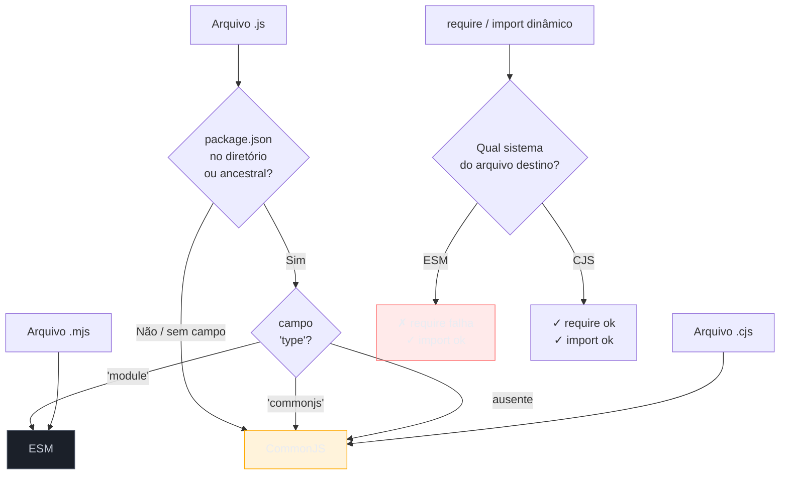

> [!abstract] TL;DR
> Node.js nasceu com CommonJS (`require`/`module.exports`) — um sistema síncrono e dinâmico criado antes do JavaScript ter módulos nativos. ESM (`import`/`export`) chegou depois como padrão da linguagem: estático, assíncrono, com suporte a tree-shaking e top-level await. Os dois coexistem mas não se misturam livremente: ESM pode importar CJS, mas CJS não pode usar `require()` em módulos ESM. A escolha de sistema depende da extensão do arquivo (`.mjs`/`.cjs`) ou do campo `"type"` no `package.json`. Para código novo, ESM é o padrão recomendado — mas entender CJS é obrigatório para trabalhar com o ecossistema legado.

## Por que dois sistemas de módulos existem ao mesmo tempo?

Você abre um projeto Node.js moderno e tenta fazer `import fs from 'fs'`. O Node devolve um erro enigmático: `Cannot use import statement in a module`. Você adiciona `"type": "module"` no `package.json` e outro erro aparece: `require is not defined in ES module scope`. O que está acontecendo?

Node.js nasceu em 2009 — antes do JavaScript ter um sistema de módulos nativo. Ryan Dahl adotou o **CommonJS** (criado pela comunidade) para permitir modularização no servidor. O ECMAScript só padronizou módulos (ESM) em 2015, com ES6 — e o Node só teve suporte estável a ESM em 2019 (v12 LTS, unflagged em v14). Resultado: quase uma década de ecossistema construído sobre CJS, que hoje precisa coexistir com o padrão moderno. Entender os dois sistemas — suas diferenças de design, não só de sintaxe — é o que separa quem depura erros de interop de quem os resolve.

## Como cada sistema funciona

### CommonJS (CJS)

```js
// math.js — exportar
exports.soma = (a, b) => a + b;
exports.subtrai = (a, b) => a - b;

// ou a forma de objeto completo
module.exports = { soma, subtrai };

// app.js — importar
const { soma } = require('./math');        // path relativo: resolve .js, /index.js automaticamente
const path = require('node:path');         // módulo nativo
const express = require('express');        // pacote npm
```

`require()` é **síncrono**: bloqueia a thread até o arquivo ser lido e executado. Isso foi aceitável porque módulos são arquivos locais em disco — operação rápida. O resultado é **cacheado** em `require.cache`: a segunda chamada a `require('./math')` retorna o mesmo objeto sem reler o arquivo.

O módulo CJS tem acesso a variáveis implícitas injetadas pelo wrapper:

```js
// Node envolve cada arquivo CJS neste wrapper antes de executar:
(function(exports, require, module, __filename, __dirname) {
  // seu código aqui
});
```

Isso explica por que `__filename` e `__dirname` existem em CJS mas não em ESM — eles são parâmetros da função wrapper, não globais reais.

### ESM (ECMAScript Modules)

```js
// math.mjs — exportar
export const soma = (a, b) => a + b;
export const subtrai = (a, b) => a - b;
export default class Calculator { /* ... */ }  // exportação padrão

// app.mjs — importar estático (hoisted, resolvido antes de executar)
import { soma } from './math.mjs';       // extensão obrigatória no Node raw
import Calculator from './calc.mjs';

// importar dinâmico (retorna Promise — funciona em CJS também)
const { soma } = await import('./math.mjs');
```

ESM é **estático**: as declarações `import` são resolvidas antes de o código executar. Bundlers (webpack, esbuild, rollup) usam isso para **tree-shaking** — eliminam exports nunca importados, reduzindo o bundle. O grafo de dependências é conhecido em tempo de compilação.

ESM não tem `__filename` nem `__dirname` — usa `import.meta.url`:

```js
// equivalente de __filename e __dirname em ESM
import { fileURLToPath } from 'node:url';
import { dirname } from 'node:path';

const __filename = fileURLToPath(import.meta.url);
const __dirname = dirname(__filename);

// alternativa moderna (Node 21.2+):
const dir = import.meta.dirname;   // disponível a partir de Node 21.2
const file = import.meta.filename;
```

## Como o Node decide qual sistema usar



| Extensão / configuração | Sistema usado |
|---|---|
| `.mjs` | ESM — sempre, ignora `package.json` |
| `.cjs` | CJS — sempre, ignora `package.json` |
| `.js` + `"type": "module"` | ESM |
| `.js` + `"type": "commonjs"` ou sem `"type"` | CJS (padrão) |

A extensão tem **precedência sobre o `package.json`**: um `.mjs` é sempre ESM mesmo dentro de um projeto `"type": "commonjs"`.

## Diferenças de design que importam

| Característica | CommonJS | ESM |
|---|---|---|
| Resolução de imports | Em runtime (dinâmica) | Em parse-time (estática) |
| `require()` sincrono | ✓ Sim | ✗ Não existe |
| `import()` dinâmico | ✓ Funciona (retorna Promise) | ✓ Funciona |
| Top-level `await` | ✗ Não | ✓ Sim |
| Tree-shaking | ✗ Difícil (dinâmico) | ✓ Sim (grafo estático) |
| `__filename` / `__dirname` | ✓ Disponíveis | ✗ Use `import.meta` |
| Cache de módulos | `require.cache` (mutável) | Imutável, por especificação |
| Named exports inferidos | Limitado | ✓ Completo |
| Extensão nos imports | Opcional | Obrigatória (Node raw) |

## O campo `exports` no package.json

O campo `exports` (introduzido no Node 12) substituiu `main` como o ponto de entrada canônico de um pacote. Ele define **condições de exportação** — o Node escolhe qual arquivo servir com base no contexto de importação:

```json
{
  "name": "minha-lib",
  "exports": {
    ".": {
      "import": "./dist/index.mjs",    // quando importado via ESM
      "require": "./dist/index.cjs",   // quando importado via CJS
      "types": "./dist/index.d.ts"     // para TypeScript (resolução de tipos)
    },
    "./utils": {
      "import": "./dist/utils.mjs",
      "require": "./dist/utils.cjs"
    }
  },
  "main": "./dist/index.cjs"  // fallback para Node < 12
}
```

As condições são avaliadas **em ordem**: o Node usa a primeira que bate. Você pode adicionar condições customizadas (ex: `"development"`, `"browser"`) que bundlers como webpack e vite respeitam.

> [!question]- O campo `exports` bloqueia subpaths não declarados?
> Sim. Se você declarar `"exports": { ".": "..." }`, tentar `require('minha-lib/internal/util')` vai falhar com `ERR_PACKAGE_PATH_NOT_EXPORTED` — mesmo que o arquivo exista em disco. Isso é intencional: o campo `exports` define a API pública do pacote. Para expor subpaths, declare-os explicitamente ou use `"./": "./"` para expor tudo (não recomendado para libraries).

### Condições de exportação mais comuns

| Condição | Quando ativa |
|---|---|
| `"import"` | `import` estático ou `import()` dinâmico (ESM) |
| `"require"` | `require()` (CJS) |
| `"default"` | Fallback — ativa em qualquer contexto não coberto |
| `"types"` | Resolução de tipos TypeScript |
| `"node"` | Ambiente Node.js (vs browser) |
| `"browser"` | Bundlers target browser |
| `"development"` | Definido por bundlers em modo dev (NODE_ENV=development) |
| `"production"` | Definido por bundlers em modo prod |

## Interoperabilidade: quando CJS e ESM se encontram

A regra fundamental de interop:

| Sentido | Permitido? | Mecanismo |
|---|---|---|
| ESM importa CJS | ✓ Sim | `import pkg from 'cjs-pkg'` — o `module.exports` vira default export |
| ESM importa named de CJS | ⚠ Parcial | Node tenta inferir; nem sempre funciona |
| CJS importa ESM com `require()` | ✗ Não | `ERR_REQUIRE_ESM` — use `import()` |
| CJS importa ESM com `import()` | ✓ Sim | Dentro de função async: `const m = await import('./esm')` |

```js
// CJS importando módulo ESM — única forma válida
async function loadEsmModule() {
  const { default: meuModulo, nomearExport } = await import('./esm-module.mjs');
  return meuModulo;
}

// Problema: não dá para usar await no top-level de um arquivo CJS
// Workaround: IIFE async
(async () => {
  const { fn } = await import('esm-only-pkg');
  fn();
})();
```

> [!question]- Por que `require('esm')` não funciona?
> ESM é assíncrono por design — o motor pode executar `import()` de um módulo remoto (via URL no browser). CommonJS é síncrono. Não há como `require()` aguardar uma operação assíncrona sem bloquear a thread, o que violaria o contrato do event loop. A especificação ESM proibiu `require()` de módulos ESM deliberadamente.

**Nota:** a partir do Node 22, o Node adicionou suporte experimental a `require()` de ESM (flag `--experimental-require-module`). Em Node 23.3+ está ativo por padrão em determinados cenários — mas não confie nisso para código de produção sem verificar a versão-alvo. A flag `--experimental-require-module` ainda imprime um aviso em stderr; em Node 23.5+ o aviso foi suprimido para módulos ESM síncronos (sem top-level await), mas o comportamento ainda não é estável o suficiente para dependências críticas.

**ESM e named exports de CJS:** quando o Node importa um módulo CJS via `import`, ele executa o módulo, captura `module.exports` como o default export, e tenta inferir named exports por análise estática do arquivo `.cjs`. Essa inferência nem sempre funciona — especialmente quando os exports são definidos dinamicamente (`module.exports[key] = ...`). Nesse caso, você precisa desestruturar do default: `const { fn } = (await import('pkg')).default`.

## Configurando um projeto novo para ESM

Três movimentos para ativar ESM em um projeto Node:

```json
// package.json
{
  "type": "module",           // 1. Todos os .js viram ESM
  "engines": { "node": ">=18" }  // 2. Declare a versão mínima com suporte estável
}
```

```js
// 3. Ajuste os imports — extensão obrigatória
import { readFile } from 'node:fs/promises';  // módulos nativos: prefixo node:
import { soma } from './math.js';             // arquivos locais: extensão .js
import express from 'express';                // pacotes npm: sem extensão (o Node resolve pelo exports)
```

**Com TypeScript:** use `"module": "NodeNext"` e `"moduleResolution": "NodeNext"` no `tsconfig.json`. Os imports em `.ts` devem usar a extensão `.js` (não `.ts`) — o TypeScript emite o `.js` e o Node resolve o arquivo correto.

```json
// tsconfig.json para ESM + TypeScript
{
  "compilerOptions": {
    "module": "NodeNext",
    "moduleResolution": "NodeNext",
    "target": "ES2022",
    "outDir": "./dist"
  }
}
```

**Com tsx / ts-node em ESM:** adicione `"ts-node": { "esm": true }` no `package.json` ou use `tsx` (mais simples, sem configuração).

## Top-level await — exclusivo do ESM

```js
// ESM: top-level await é válido
const config = await fetch('/api/config').then(r => r.json());
export const DB_URL = config.database;  // disponível quando o módulo é importado

// CJS: não existe top-level await. Workarounds:

// Workaround 1: IIFE — mas exports ficam undefined até resolver
(async () => {
  const config = await loadConfig();
  module.exports = { DB_URL: config.database };  // tardio demais para importadores síncronos
})();

// Workaround 2: lazy async getter — mais explícito
let _config;
module.exports = {
  getConfig: async () => {
    _config ??= await loadConfig();
    return _config;
  },
};
```

O risco do IIFE em CJS: se outro módulo fizer `require('./config')` antes do IIFE resolver, receberá um objeto vazio `{}`. ESM com top-level await bloqueia o grafo de importações do módulo até ele resolver — comportamento previsível e seguro.

## Casos práticos

### Cenário 1 — Pacote npm ESM-only: `chalk` v5 e o quebra-cabeça CJS

O time atualizou `chalk` para a v5 e o CI passou a quebrar com `ERR_REQUIRE_ESM`. A v5 é ESM-only — sem `"type": "commonjs"` nem `.cjs`. O arquivo `server.js` era CJS puro.

Três saídas, ordenadas do mais simples ao mais invasivo:

```js
// Opção 1: ficar na v4 (última versão CJS)
// package.json: "chalk": "^4.1.2"

// Opção 2: dynamic import no arquivo CJS (cirúrgico)
// server.js
async function getChalk() {
  const { default: chalk } = await import('chalk');
  return chalk;
}

// Opção 3: migrar server.js para ESM
// server.mjs (renomear + ajustar require → import)
import chalk from 'chalk';
```

O time optou pela Opção 2 nos arquivos críticos e criou um ticket para migrar para ESM gradualmente. Isso evitou regredir a versão e não exigiu migração big-bang.

### Cenário 2 — Biblioteca interna com pacote dual e dual package hazard

A equipe de plataforma publicou uma biblioteca de feature flags internamente. O `package.json` tinha:

```json
{
  "exports": {
    ".": {
      "import": "./dist/index.mjs",
      "require": "./dist/index.cjs"
    }
  }
}
```

Um serviço NestJS (CJS) e um script de migração (ESM) dependiam da biblioteca. Ambos rodavam no mesmo processo via `require()` e `import`. O estado interno da biblioteca (o cache de flags) ficou dividido em duas instâncias — a flag ativada no script não aparecia no NestJS. Bugs como esse são quase impossíveis de rastrear sem conhecer o dual package hazard.

Solução: a biblioteca foi publicada apenas como CJS (removendo o campo `"import"`). O script de migração usou `import()` dinâmico que obtém a instância CJS — mesma instância, cache compartilhado.

## Armadilhas comuns

> [!warning] Omitir extensão em imports ESM
> **O que acontece:** `import { soma } from './math'` (sem `.js`) lança `ERR_MODULE_NOT_FOUND`. **Por quê:** CJS resolve automaticamente `.js`, `.json`, `/index.js`. ESM segue a spec do browser — o specifier deve ser exato. **Como evitar:** Sempre use extensão explícita: `import { soma } from './math.js'`. Bundlers resolvem sem extensão, mas o Node raw não.

> [!warning] `require()` de pacote ESM-only
> **O que acontece:** `require('chalk')` com chalk v5+ lança `ERR_REQUIRE_ESM`. **Por quê:** Módulos ESM não expõem uma interface síncrona compatível com `require()`. **Como evitar:** Use a versão anterior CJS do pacote, migre o arquivo para `.mjs`, ou use `import()` dinâmico dentro de uma função `async`.

> [!warning] Dual package hazard com singletons e estado global
> **O que acontece:** Uma biblioteca com cache/singleton é carregada duas vezes no mesmo processo — estado não é compartilhado entre as duas instâncias. **Por quê:** O mesmo pacote foi resolvido pelas duas entradas do campo `exports` (CJS e ESM), gerando dois módulos distintos. **Como evitar:** Para pacotes com estado, publique só como CJS ou só como ESM. Documente o risco se precisar do dual format.

> [!warning] `module.exports` tardio no IIFE async de CJS
> **O que acontece:** Importadores síncronos recebem `{}` (objeto vazio) porque o IIFE ainda não resolveu. **Por quê:** `require()` é síncrono — captura o valor de `module.exports` no momento da chamada, antes do IIFE concluir. **Como evitar:** Nunca atribua `module.exports` dentro de uma função assíncrona se o módulo for consumido de forma síncrona. Use lazy getters ou migre para ESM com top-level await.

## Como explicar em inglês

Node.js originally used CommonJS because ESM didn't exist yet. CommonJS is synchronous and dynamic — `require()` resolves at runtime. ESM is static — imports are resolved at parse time, enabling tree-shaking and top-level await. The key interop rule: ESM can import CJS, but CJS cannot `require()` an ESM module — you'd need dynamic `import()` inside an async function. For new projects, default to ESM; for packages, avoid dual CJS+ESM formats if your module has internal state, to prevent the dual package hazard.

| PT | EN |
|---|---|
| Sistema de módulos | Module system |
| CommonJS | CommonJS (CJS) |
| Módulo ECMAScript | ES Module (ESM) |
| Importação estática | Static import |
| Importação dinâmica | Dynamic import |
| Exportação nomeada | Named export |
| Exportação padrão | Default export |
| Análise estática | Static analysis |
| Eliminação de código morto | Tree-shaking |
| Pacote dual | Dual package |
| Hazard de pacote dual | Dual package hazard |
| Extensão de arquivo | File extension |
| Interoperabilidade | Interoperability / interop |
| Aguardo no nível raiz | Top-level await |
| Cache de módulos | Module cache |
| Wrapper de módulo | Module wrapper |
| Condição de exportação | Export condition |
| Especificador de módulo | Module specifier |
| Subpath de exportação | Subpath export |
| Resolução de módulo | Module resolution |
| Grafo de dependências | Dependency graph |
| Ponto de entrada | Entry point |

## Quando usar cada sistema

| Contexto | Sistema recomendado | Motivo |
|---|---|---|
| Projeto novo (API, CLI, script) | ESM | Padrão da linguagem; top-level await; sem gambiarra de callback |
| Biblioteca npm com estado global | CJS ou ESM-only | Dual package hazard com singletons |
| Biblioteca npm sem estado | Dual (CJS + ESM) | Permite tree-shaking em bundlers ESM |
| Projeto legado com muitos `require()` | CJS | Custo de migração alto sem ganho imediato |
| Uso de pacote ESM-only (chalk v5+) | ESM no arquivo-alvo | `require()` não funciona — migrar o arquivo |
| TypeScript + Node moderno | ESM + `NodeNext` | Resolve extensões corretamente; alinhado com o runtime |
| Scripts de build/CI pontuais | ESM com `.mjs` | Sem mudar o `package.json` do projeto principal |

## O que vem a seguir

Com os módulos compreendidos — como o Node carrega código, quem pode importar o quê, e o que acontece na fronteira entre CJS e ESM — o próximo passo natural é entender o ambiente de execução em si. O objeto `process` é a interface entre o seu código e o sistema operacional: variáveis de ambiente, sinais Unix, stdin/stdout e o código de saída. É o que todo processo Node usa, mas poucos entendem por completo. Note que `process` está disponível como global tanto em CJS quanto em ESM — é um dos poucos pontos de continuidade entre os dois sistemas.

- [[15 - O objeto process]] — o objeto que conecta seu código Node ao sistema operacional; disponível como global em CJS e ESM
- [[13 - Promise-based core APIs]] — usa o prefixo `node:`, convenção intimamente ligada à transição para ESM
- [[03-Dominios/Tecnologia/Node/Runtime e Event Loop/index|Runtime e Event Loop]] — galho 1 completo
- [[03-Dominios/Tecnologia/Node/Frameworks e arquitetura/01 - Os 4 frameworks - Express, NestJS, Fastify, Hono|Frameworks e arquitetura]] — onde a escolha CJS vs ESM afeta configuração e toolchain

## Fontes

- **Node.js Docs** — [*ECMAScript Modules*](https://nodejs.org/api/esm.html) — suporte ESM no Node: interop, campos `exports`, `import.meta`, condições de exportação
- **Node.js Docs** — [*Modules: CommonJS*](https://nodejs.org/api/modules.html) — sistema CJS, caching, wrapper, `require.resolve()`
- **Node.js Docs** — [*Packages: Determining module system*](https://nodejs.org/api/packages.html#determining-module-system) — como o Node decide qual sistema usar com base na extensão e `"type"`
- **Node.js Docs** — [*Packages: Dual CommonJS/ES module packages*](https://nodejs.org/api/packages.html#dual-commonjses-module-packages) — dual package hazard documentado oficialmente
- **Node.js Docs** — [*import.meta*](https://nodejs.org/api/esm.html#importmeta) — `import.meta.url`, `import.meta.dirname`, `import.meta.filename` e `import.meta.resolve()`
- **TypeScript Docs** — [*Node16 and NodeNext module resolution*](https://www.typescriptlang.org/docs/handbook/modules/reference.html#node16-nodenext) — como o TypeScript trata extensões e condições de exportação em projetos ESM
- **Sindre Sorhus** — [*Pure ESM package*](https://gist.github.com/sindresorhus/a39789f98801d908bbc7ff3ecc99d99c) — guia prático para consumir ou publicar pacotes ESM-only, incluindo workarounds para ambientes CJS

## Veja também

- [[13 - Promise-based core APIs]] — submódulos `node:fs/promises`, `node:stream/promises` — são ESM-compatíveis
- [[08 - Promises por dentro]] — promessas são o substrato do `import()` dinâmico
- [[15 - O objeto process]] — `process.env`, `process.exit()`, sinais Unix — disponíveis em CJS e ESM
- [[03-Dominios/Tecnologia/Node/Frameworks e arquitetura/01 - Os 4 frameworks - Express, NestJS, Fastify, Hono|Frameworks]] — Express ainda é CJS; NestJS/Fastify suportam ESM com configuração
- [[Node.js]] — tronco da trilha Node Senior
