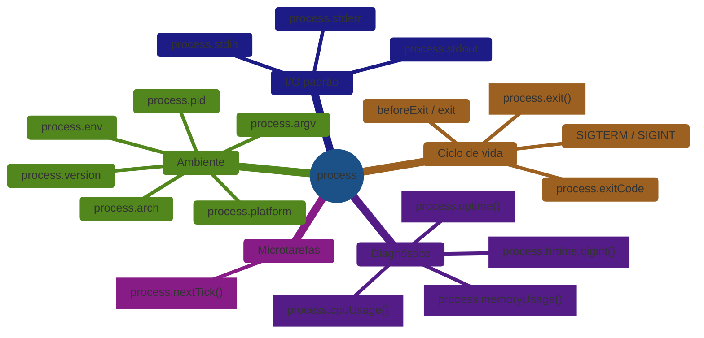

> [!abstract] TL;DR
> `process` é um objeto global do Node.js — disponível sem `import` em CJS e ESM — que expõe a interface entre o seu código JavaScript e o sistema operacional. Ele agrupa quatro responsabilidades: informações do ambiente (`process.env`, `process.argv`, `process.platform`), controle do ciclo de vida do processo (`process.exit()`, `process.exitCode`, sinais Unix), streams de I/O padrão (`process.stdin`, `process.stdout`, `process.stderr`), e agendamento de microtarefas (`process.nextTick()`). Entender `process` é pré-requisito para graceful shutdown, leitura de variáveis de ambiente segura, e diagnóstico de vazamentos de memória.

## O que acontece quando o processo não encerra graciosamente?

Você recebe um alerta às 2h: o serviço está aceitando conexões novas mas as respostas em andamento foram cortadas — clientes recebem RST ao invés de uma resposta completa. O Kubernetes reiniciou o pod com `SIGTERM`, mas o Node não capturou o sinal. Sem handler para `process.on('SIGTERM')`, o processo encerrou imediatamente, matando as requisições no meio.

Esse é o cenário mais frequente de incidente com `process` em produção. Resolver exige entender o que `process` expõe — não apenas `process.exit()`, mas toda a interface entre Node e o SO.

## `process` como ponto de contato com o SO

Pense no `process` como o "painel de controle" do processo Unix que hospeda o Node. Ele não é construído pelo seu código — o Node o cria antes de executar qualquer linha sua. Em CJS e ESM, `process` é global: sem `require` nem `import`.



## Ambiente: `process.env` e `process.argv`

### `process.env` — variáveis de ambiente

```js
// Todas as variáveis são strings — sempre
const port = Number(process.env.PORT) || 3000;  // parse explícito
const isProduction = process.env.NODE_ENV === 'production';  // comparação de string

// Variável ausente retorna undefined, não lança erro
const secret = process.env.API_SECRET;
if (!secret) throw new Error('API_SECRET is required');
```

`process.env` é um objeto **mutável** — você pode atribuir valores durante a execução. Isso é útil em testes (configurar variáveis antes de importar o módulo) mas perigoso em produção (mutações não são visíveis por outros processos).

> [!question]- Por que `process.env.PORT` é sempre string?
> Variáveis de ambiente são texto puro no SO — não há tipo. O Node lê o mapa de variáveis do processo Unix e expõe como objeto. `PORT=3000 node app.js` define uma string `"3000"`, nunca um número. Esquecer o parse numérico é uma fonte comum de `NaN` silencioso em portas e timeouts.

### `process.argv` — argumentos da linha de comando

```js
// node app.js --port 3001 --env staging
console.log(process.argv);
// [
//   '/usr/local/bin/node',   // argv[0]: path do executável Node
//   '/app/app.js',           // argv[1]: path do script
//   '--port', '3001',        // argv[2..N]: seus argumentos
//   '--env', 'staging'
// ]

// Parse manual
const args = process.argv.slice(2);
// Ou use minimist, yargs, commander para parsing robusto
```

## Informações do processo

```js
process.pid          // número do processo (PID Unix)
process.ppid         // PID do processo pai
process.version      // 'v20.11.0'
process.versions     // { node: '20.11.0', v8: '11.3.244.8', ... }
process.platform     // 'linux' | 'darwin' | 'win32'
process.arch         // 'x64' | 'arm64'
process.cwd()        // diretório de trabalho atual (mutável via process.chdir())
process.execPath     // path completo do binário node
process.uptime()     // segundos desde o início do processo
```

## Ciclo de vida: sinais e saída

### Sinais Unix

```js
// Graceful shutdown — capturar SIGTERM (enviado pelo Kubernetes, docker stop, etc.)
process.on('SIGTERM', async () => {
  console.log('SIGTERM recebido — iniciando graceful shutdown');
  await server.close();         // para de aceitar novas conexões
  await db.end();               // fecha pool de conexões do banco
  process.exit(0);              // saída limpa
});

// SIGINT — Ctrl+C no terminal
process.on('SIGINT', async () => {
  console.log('Interrompido pelo usuário');
  await cleanup();
  process.exit(0);
});
```

**Por que `SIGTERM` e não `SIGKILL`?** `SIGKILL` não pode ser capturado — o SO mata o processo diretamente. `SIGTERM` é um pedido polido de encerramento; o processo pode ignorá-lo (embora não deva). Orquestradores como Kubernetes enviam `SIGTERM` e esperam `terminationGracePeriodSeconds` (padrão: 30s) antes de escalar para `SIGKILL`.

### `process.exit()` vs `process.exitCode`

```js
// process.exit(code) — saída imediata, ignora operações pendentes
process.exit(0);   // sucesso
process.exit(1);   // falha genérica
process.exit(2);   // uso incorreto (convenção Unix)

// process.exitCode — define o código sem sair imediatamente
// O processo sai com esse código quando o event loop esvazia naturalmente
process.exitCode = 1;
await cleanup();  // ainda executa
// process sai com código 1 após o event loop esvaziar
```

> [!question]- Quando usar `process.exit()` e quando deixar o event loop esvaziar?
> `process.exit()` é para encerramento forçado — quando você quer garantir que o processo para agora, independente de timers ou conexões abertas. Deixar o event loop esvaziar é o fluxo normal em scripts curtos. Para servidores, o padrão é: capturar `SIGTERM` → fechar listeners → fechar conexões abertas → `process.exit(0)`.

### Eventos de ciclo de vida

```js
// 'exit' — síncrono, últimas instruções antes de encerrar
// NÃO pode usar operações async aqui
process.on('exit', (code) => {
  console.log(`Encerrando com código ${code}`);
  // fs.writeFileSync funciona; await não funciona
});

// 'beforeExit' — event loop está prestes a esvaziar, mas ainda pode agendar trabalho
process.on('beforeExit', async (code) => {
  await flushMetrics();  // pode usar async aqui
  // se agendar mais trabalho aqui, 'beforeExit' dispara de novo
});
```

## I/O padrão: stdin, stdout, stderr

`process.stdin`, `process.stdout`, e `process.stderr` são streams duplex/writable. `console.log()` escreve em `process.stdout`; `console.error()` escreve em `process.stderr`.

```js
// Ler de stdin linha a linha (útil em CLIs)
import { createInterface } from 'node:readline';

const rl = createInterface({ input: process.stdin });
for await (const line of rl) {
  console.log(`> ${line}`);
}

// Escrever sem trailing newline
process.stdout.write('Carregando...');
await doWork();
process.stdout.write(' OK\n');

// Redirecionar stdout para arquivo (shell): node app.js > output.txt
// Dentro do Node, verificar se stdout está conectado a terminal:
if (process.stdout.isTTY) {
  // colorizar output
}
```

## Diagnóstico: memória, CPU, tempo

```js
// Uso de memória (em bytes)
const mem = process.memoryUsage();
// {
//   rss: 45678592,         // Resident Set Size — total na RAM (inclui heap + stack + native)
//   heapTotal: 18874368,   // heap alocado pelo V8
//   heapUsed: 10534720,    // heap efetivamente usado
//   external: 1234567,     // memória de objetos C++ vinculados (Buffers)
//   arrayBuffers: 12345    // SharedArrayBuffers e ArrayBuffers
// }

// Uso de CPU (em microssegundos)
const start = process.cpuUsage();
doWork();
const diff = process.cpuUsage(start);  // { user: 123456, system: 7890 }

// Timestamp de alta resolução (ns) — para benchmarks
const t0 = process.hrtime.bigint();
doWork();
const elapsed = process.hrtime.bigint() - t0;  // BigInt em nanossegundos
console.log(`${elapsed / 1_000_000n}ms`);
```

## Tratamento de erros globais: `uncaughtException` e `unhandledRejection`

Quando um erro não é capturado por nenhum `try/catch` ou `.catch()`, ele sobe até o topo do processo. O Node expõe dois eventos para interceptar esses casos antes de encerrar:

```js
// Erro síncrono não capturado
process.on('uncaughtException', (err, origin) => {
  // 'origin' é 'uncaughtException' ou 'unhandledRejection'
  process.stderr.write(`Erro não capturado: ${err.stack}\n`);
  // OBRIGATÓRIO: encerrar após log. Não tente continuar.
  process.exit(1);
});

// Promise rejeitada sem .catch()
process.on('unhandledRejection', (reason, promise) => {
  process.stderr.write(`Promise rejeitada sem handler: ${reason}\n`);
  // Em Node 15+, o padrão é encerrar com código de saída não-zero
  // Em Node 14 e anteriores, era só um aviso
  process.exit(1);
});
```

**Mudança de comportamento entre versões:** até o Node 14, uma `unhandledRejection` gerava apenas um aviso e o processo continuava. A partir do Node 15, o comportamento padrão passou a encerrar o processo (equivalente a `--unhandled-rejections=throw`). Código que assumia o comportamento antigo pode encerrar inesperadamente ao atualizar a versão do Node.

## `process.nextTick()` — microtarefa antes das promises

`process.nextTick()` agenda um callback para rodar **antes** das promises e **antes** do próximo tick do event loop. É a fila com maior prioridade no Node.

```js
Promise.resolve().then(() => console.log('Promise'));
process.nextTick(() => console.log('nextTick'));
console.log('Sync');

// Saída: Sync → nextTick → Promise
```

Isso importa porque callbacks de `nextTick` rodam antes de qualquer I/O — inclusive antes de um `setImmediate`. Ver [[12 - Armadilhas, regras práticas, cheatsheet]] para o anti-padrão de `nextTick` recursivo que causa starvation.

## Casos práticos

### Cenário 1 — Graceful shutdown em servidor Express com banco de dados

Um serviço de pedidos precisava encerrar sem cortar requisições em andamento quando o Kubernetes fazia rolling deploy. O processo anterior não capturava `SIGTERM` — o Kubernetes enviava o sinal e, após 30s sem resposta, matava com `SIGKILL`.

```js
import express from 'express';
import { Pool } from 'pg';

const app = express();
const pool = new Pool();

const server = app.listen(3000);

let isShuttingDown = false;

// Middleware que recusa novas requisições durante shutdown
app.use((req, res, next) => {
  if (isShuttingDown) {
    res.set('Connection', 'close');
    return res.status(503).json({ error: 'Service shutting down' });
  }
  next();
});

async function shutdown(signal) {
  console.log(`${signal} recebido`);
  isShuttingDown = true;

  // Para de aceitar novas conexões
  server.close(async () => {
    console.log('HTTP server fechado');
    await pool.end();  // aguarda queries em andamento terminarem
    console.log('Pool fechado');
    process.exit(0);
  });

  // Timeout de segurança: forçar saída se demorar mais que 25s
  setTimeout(() => {
    console.error('Timeout — forçando saída');
    process.exit(1);
  }, 25_000).unref();  // .unref() não bloqueia o event loop
}

process.on('SIGTERM', () => shutdown('SIGTERM'));
process.on('SIGINT', () => shutdown('SIGINT'));
```

O timeout com `.unref()` é crítico: garante que o processo sai mesmo se uma query travar, mas não mantém o event loop vivo se tudo fechar antes dos 25s.

### Cenário 2 — CLI que lê configuração de ambiente e valida na inicialização

Um script de migração de banco precisava falhar rápido se variáveis obrigatórias estivessem ausentes, e reportar no stderr (não no stdout, que era redirecionado para um arquivo de log).

```js
// config.js — validação de ambiente na inicialização
function requireEnv(name) {
  const value = process.env[name];
  if (!value) {
    process.stderr.write(`FATAL: variável de ambiente "${name}" ausente\n`);
    process.exit(1);  // falha imediata, antes de qualquer operação de banco
  }
  return value;
}

export const config = {
  databaseUrl: requireEnv('DATABASE_URL'),
  apiKey: requireEnv('API_KEY'),
  dryRun: process.env.DRY_RUN === 'true',  // flag booleana via string
  batchSize: Number(process.env.BATCH_SIZE) || 100,
};

// Versão e plataforma para debug em CI
console.log(`Node ${process.version} em ${process.platform}/${process.arch}`);
```

Reportar no `stderr` é a convenção Unix: erros vão para stderr, output útil vai para stdout. Isso permite redirecionar stdout sem misturar com mensagens de erro.

## Armadilhas comuns

> [!warning] `process.exit()` dentro de handler de evento assíncrono
> **O que acontece:** Callbacks pendentes (queries, writes em disco) são abortados silenciosamente. Dados não são persistidos. **Por quê:** `process.exit()` encerra o event loop imediatamente, sem processar eventos pendentes. **Como evitar:** Feche os recursos explicitamente antes de chamar `process.exit()` — ou use `process.exitCode` e deixe o event loop esvaziar naturalmente.

> [!warning] Capturar `uncaughtException` sem re-encerrar o processo
> **O que acontece:** O processo fica vivo em estado inconsistente após um erro não capturado. **Por quê:** `uncaughtException` foi pensado para logging de último recurso, não para recuperação. O estado do heap pode estar corrompido. **Como evitar:** No handler de `uncaughtException`, apenas log + `process.exit(1)`. Nunca tente continuar a execução normal.

> [!warning] `process.env` valores booleanos como strings
> **O que acontece:** `if (process.env.FEATURE_FLAG)` é `true` para `"false"` — qualquer string não-vazia é truthy. **Por quê:** Todas as variáveis de ambiente são strings. `"false"`, `"0"`, `"no"` são strings truthy. **Como evitar:** Sempre compare explicitamente: `process.env.FEATURE_FLAG === 'true'`.

> [!warning] `process.nextTick()` em loop recursivo
> **O que acontece:** O event loop nunca progride — nenhuma promise resolve, nenhum I/O é processado. **Por quê:** A fila de `nextTick` é drenada completamente antes de qualquer outro trabalho. Callbacks adicionados durante a drenagem também rodam antes de ceder. **Como evitar:** Nunca agende `process.nextTick()` dentro de um callback de `nextTick()` em loop. Use `setImmediate()` para ceder ao event loop entre iterações.

## Como explicar em inglês

The `process` object is Node's bridge to the operating system — available as a global without any import. It exposes environment variables, command-line arguments, standard I/O streams, and process lifecycle hooks. The most critical production use case is graceful shutdown: listening for `SIGTERM`, stopping new connections, draining in-flight requests, then calling `process.exit(0)`. A common pitfall is treating `process.env` values as booleans — every env variable is a string, so `process.env.FLAG === 'true'` is the correct pattern.

| PT | EN |
|---|---|
| Objeto global | Global object |
| Variável de ambiente | Environment variable |
| Argumento da linha de comando | Command-line argument |
| Código de saída | Exit code |
| Encerramento gracioso | Graceful shutdown |
| Sinal Unix | Unix signal |
| Fluxo padrão de saída | Standard output (stdout) |
| Fluxo padrão de erro | Standard error (stderr) |
| Fluxo padrão de entrada | Standard input (stdin) |
| Uso de memória | Memory usage |
| Heap usado | Heap used |
| Conjunto residente | Resident Set Size (RSS) |
| Microtarefa | Microtask |
| Tick do event loop | Event loop tick |
| Tempo de atividade | Uptime |
| PID (identificador do processo) | Process ID (PID) |
| Tratamento de exceção não capturada | Uncaught exception handler |
| Rejeição de promise não tratada | Unhandled rejection |
| Identificador do processo pai | Parent Process ID (PPID) |

## O que vem a seguir

Este é o último capítulo do galho Runtime e Event Loop. Você agora tem uma visão completa do runtime Node: como o event loop funciona, como diagnosticá-lo quando trava, como usar APIs assíncronas nativas, como o sistema de módulos decide o que carregar, e como o processo se conecta ao SO. O próximo galho natural é **Streams** — onde tudo isso se aplica ao problema de mover dados de forma eficiente sem saturar memória.

- [[03-Dominios/Tecnologia/Node/Streams/index|Galho 2: Streams]] — processamento eficiente de dados com backpressure e pipeline
- [[12 - Armadilhas, regras práticas, cheatsheet]] — processo e event loop: regras de bolso consolidadas
- [[03-Dominios/Tecnologia/Node/Runtime e Event Loop/index|Runtime e Event Loop]] — índice completo do galho 1

## Fontes

- **Node.js Docs** — [*Process*](https://nodejs.org/api/process.html) — referência completa: todos os eventos, propriedades e métodos do objeto `process`
- **Node.js Docs** — [*process.nextTick()*](https://nodejs.org/en/docs/guides/event-loop-timers-and-nexttick#processnexttick) — como `nextTick` se posiciona no event loop versus promises e I/O
- **Node.js Docs** — [*process.memoryUsage()*](https://nodejs.org/api/process.html#processmemoryusage) — o que cada campo de memória mede e quando monitorar
- **Node.js Docs** — [*Unhandled rejections*](https://nodejs.org/api/process.html#event-unhandledrejection) — mudança de comportamento entre Node 14 e 15, flags `--unhandled-rejections`
- **Twelve-Factor App** — [*Config*](https://12factor.net/config) — prática de separar configuração de código via variáveis de ambiente (`process.env`)

## Veja também

- [[11 - Diagnóstico do event loop]] — `process.hrtime.bigint()` é a base de medição de lag
- [[12 - Armadilhas, regras práticas, cheatsheet]] — `process.nextTick()` starvation explicado
- [[14 - ESM vs CommonJS]] — `process` é um dos poucos globais disponíveis em ambos os sistemas
- [[Node.js]] — tronco da trilha Node Senior
